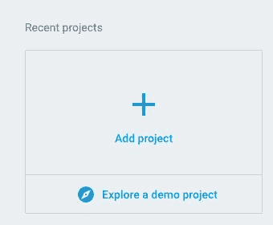
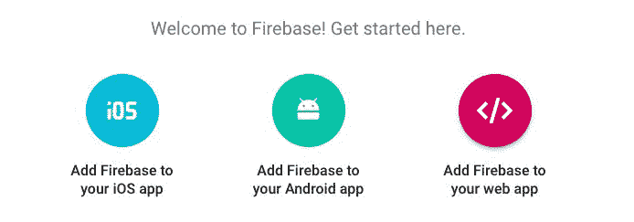
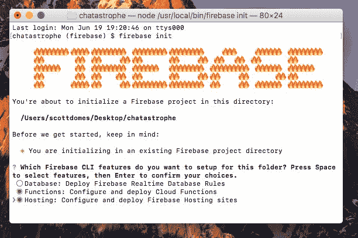
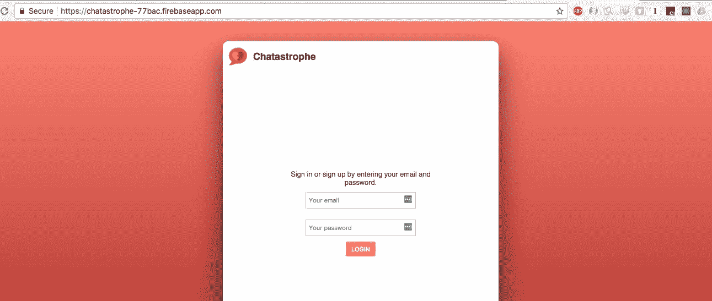
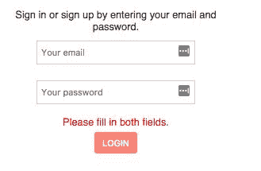

# 第四章：使用 Firebase 轻松设置后端

我们的应用程序看起来很漂亮，但它并没有做太多事情。我们有一个登录表单，但用户实际上无法登录。

在本章中，我们将开始处理我们应用程序的后端。在我们的情况下，这意味着设置一个数据库来保存用户及其消息。在一个章节中，我们将涵盖让用户创建帐户和登录所需的一切。我们还将深入研究 React 和组件状态。我们将学到以下内容：

+   Firebase 是什么

+   需要注意的问题和问题

+   如何部署我们的应用程序

+   用户认证（注册和登录）

+   React 生命周期方法

让我们开始吧！

# Firebase 是什么？

构建渐进式 Web 应用程序在很大程度上是一个前端过程。PWA 对于它们如何从后端 API 获取数据并不太关心（除非它影响性能，当然）。我们希望保持我们应用程序的后端设置最小化；为此，我们转向 Firebase。

**Firebase**是 Google 设计的一个项目，旨在帮助开发人员构建应用程序，而不必担心后端基础设施。它采用免费模型，基于后端需要响应的请求数量以及您需要的存储量。对于我们的目的，它非常适合快速开发一个小型原型。当我们的应用扩展时，Chatastrophe 的执行委员会向我们保证，“金钱不是问题”。

Firebase 提供了什么？我们感兴趣的是数据库、托管解决方案和内置认证。除此之外，它还提供了一种称为**Cloud Functions**的东西，这是一些代码片段，会在特定事件的响应中自动运行。一旦我们为我们的应用程序添加推送通知，我们将使用 Cloud Functions。现在，我们想要在我们的登录表单中添加一些身份验证，以便用户可以注册并登录到 Chatastrophe。

如果您有 Google 帐户（例如通过 Google Plus 或 Gmail），您可以使用这些凭据登录 Firebase，或者创建一个新帐户；这就是我们开始所需要的一切。

# Firebase 注意事项

Firebase 是一个有用的工具，但它确实有一些注意事项。

其中一个重要的卖点（尤其是对我们来说）是它的实时数据库。这意味着一个用户对数据的更改会自动推送给所有用户。我们不必检查是否已创建了新的聊天消息；应用程序的每个实例都将立即收到通知。

数据库还具有离线持久性，这意味着我们的用户甚至在离线时也可以阅读他们的消息（如果您记得的话，这满足了我们之前概述的用户故事之一）。Firebase 使用本地缓存来实现这一点。

那么，有什么缺点吗？Firebase 数据库是一个 NoSQL 数据库，具有特定的语法，对于更习惯于 SQL 数据库的开发人员可能会感到奇怪。该过程类似于 SQL 数据库（具有主要的**CRUD**操作--**创建**，**读取**，**更新**和**删除**--适用于数据），但可能不太直观。

Firebase 的另一个要点是，它（在撰写本文时）并未针对像 React 这样构建的**单页应用程序**（**SPAs**）进行优化。我们将不得不做一些变通方法，以使一切在我们的 React 应用程序中顺利运行。

尽管如此，Firebase 将节省我们大量时间，与设置我们自己的后端服务器/托管解决方案相比，这绝对是值得学习的。

# 设置

以下是我们如何开始使用 Firebase：

1.  我们将转到 Firebase 控制台。

1.  从那里，我们将创建一个项目。

1.  我们将为我们可爱的小项目命名。

1.  我们将获得将其集成到我们的应用程序中所需的代码。

1.  我们将将该代码添加到`index.html`中。

1.  我们将使 Firebase 作为全局变量可用。

如果您准备好开始，请这样做：

1.  一旦您创建或登录到您的 Google 帐户，转到[`firebase.google.com/`](https://firebase.google.com/)。在屏幕右上角，您应该看到一个名为 GO TO CONSOLE 的按钮：


1.  从 Firebase 控制台，我们想要添加项目。点击图标：



1.  对于项目名称，选择`chatastrophe`（全部小写），然后选择您的国家/地区。

1.  一旦完成，Firebase 应该直接带您到项目页面。从那里，点击上面写着 Add Firebase to your web app 的链接：



1.  复制并粘贴它给您的代码到`public/index.html`中，在闭合的`</body>`标签之前：

```jsx
<body>
  <div id="root"></div> 
  <script src="https://www.gstatic.com/firebasejs/4.1.2/firebase.js"></script> 
  <script>  
    // Initialize Firebase  
    var config = {    
      apiKey: /* API KEY HERE */,    
      authDomain: "chatastrophe-77bac.firebaseapp.com",    
      databaseURL: "https://chatastrophe-77bac.firebaseio.com",    
      projectId: "chatastrophe-77bac",    
      storageBucket: "chatastrophe-77bac.appspot.com",    
      messagingSenderId: "85734589405"  
    };  
    firebase.initializeApp(config); 
  </script> 
</body>
```

1.  最后，我们需要使我们的 Firebase 应用程序对我们的应用程序的其余部分可用。在脚本标签的底部，在`firebase.initializeApp(config)`行之前，添加以下内容：

```jsx
window.firebase = firebase;
```

这段代码将我们的 Firebase 设置存储在`window`对象上，这样我们就可以在 JavaScript 的其余部分中访问它。

如果您没有使用源代码控制（例如 GitHub 或 Bitbucket），或者正在使用私有存储库来存储您的代码，您可以跳过到下一节。对于我们其他人，我们需要做一些工作，以确保我们不会向整个世界显示我们的`config.apiKey`（这是一种恶意使用的方法）。

# 隐藏我们的 API 密钥

我们需要将我们的 API 密钥和`messagingSenderId`移动到一个单独的文件中，然后确保该文件没有被检入 Git：

1.  为此，在`public/`中创建一个名为`secrets.js`的文件。在该文件中，放入以下内容：

```jsx
window.apiKey = "YOUR-API-KEY”
messagingSenderId = "YOUR-SENDER-ID"
```

同样，我们利用全局访问的 window 对象来存储密钥。对于那些对 JavaScript 新手来说，请注意滥用 window 对象并不是一个好的做法；只有在绝对必要时才使用它。

1.  要在`index.html`中使用此密钥，我们可以在所有其他脚本标签之前添加以下内容：

```jsx
<script src="/secrets.js"></script>
```

1.  然后，在我们的 Firebase 初始化中：

```jsx
 <script>  
   // Initialize Firebase
   var config = {
     apiKey: window.apiKey,
     // ...rest of config
     messagingSenderId: window.messagingSenderId
   };
```

1.  作为最后一步，我们需要告诉 Git 忽略`secrets.js`文件。您可以通过修改我们项目基础中的`.gitignore`文件来实现这一点，添加以下行：

```jsx
/public/secrets.js
```

搞定了！我们现在可以自由地提交和推送了。

# 部署 Firebase

正如我之前提到的，Firebase 自带了一个内置的部署解决方案。让我们在真实的网络上让我们的应用程序运行起来！以下是如何做到这一点：

1.  为此，我们首先需要安装 Firebase 命令行工具：

```jsx
npm install -g firebase-tools
```

不要忘记`-g`。这个标志会在您的机器上全局安装这些工具。

1.  下一步是登录我们的 Firebase 工具：

```jsx
firebase login
```

1.  为了完成我们的 Firebase 工具设置，我们现在可以将我们的应用初始化为一个 Firebase 项目，类似于我们使用`npm`所做的。确保您从项目文件夹的根目录运行此命令：

```jsx
firebase init
```

在它随后提示您的第一个问题中，使用箭头键和*空格键*来选择 Functions 和 Hosting。我们稍后将使用 Firebase 的 Cloud Functions。不要选择 Database，那是用于在本地配置数据库规则的；我们将依赖于 Firebase 控制台。

您的选择应该如下所示：



当它要求默认的 Firebase 项目时，请选择`chatastrophe`（或者您在 Firebase 控制台中命名的项目）。

对于问题“您是否要立即使用 npm 安装依赖项？”，输入 y。

接下来，它会问你要使用哪个文件夹作为你的公共目录。输入`build`，而不是`public`。Firebase 正在询问要使用哪个文件夹来部署你的项目；我们想要我们最终编译的构建，包括我们转译的 JavaScript，因此，我们想要`build`文件夹。

现在让我们转到下一个问题！我们想将我们的应用程序配置为单页面应用程序吗？当然。尽管拒绝覆盖`index.html`（但是，如果你说是，也没关系；每次运行`build`命令时，我们都会重新生成我们的`build/index.html`）。

好的，我们已经准备好部署了。让我们创建一个`npm`脚本，让我们的生活更轻松。

每次部署，我们都希望重新运行我们的`build`命令，以确保我们拥有项目的最新构建。因此，我们的`npm`脚本将结合这两者，添加到我们的`package.json`中：

```jsx
"scripts": {
  "build": "node scripts/copy_assets.js && node_modules/.bin/webpack --config webpack.config.prod.js",
  "start": "node_modules/.bin/webpack-dev-server",
  "deploy": "npm run build && firebase deploy"
},
```

使用`yarn deploy`运行脚本，然后在终端中检查它显示的 URL。如果一切顺利，你的应用程序应该看起来和在开发中一样。打开控制台并检查警告；如果看到任何警告，浏览一下 Webpack 章节，看看是否错过了我们`webpack.config.prod.js`的一些设置（你可以在这里的最终文件中查看：[`github.com/scottdomes/chatastrophe/tree/chapter4`](https://github.com/scottdomes/chatastrophe/tree/chapter4)）：



太棒了！我们有一个部署好的应用程序可以与朋友分享。唯一的问题是我们在上一章讨论的问题；它实际上还没有做太多事情。

让我们开始使用 Firebase 添加身份验证流程。

# 使用 Firebase 进行身份验证

为了让用户能够登录/注册我们的应用程序，我们需要做三件事：

1.  在 Firebase 控制台上打开电子邮件验证。

1.  当用户点击按钮时，将电子邮件和密码提交到 Firebase 中。

1.  根据结果注册或登录用户。

让我们打开我们的 Firebase 控制台（[`console.firebase.google.com`](https://console.firebase.google.com)）并开始处理任务＃1：

1.  从我们的 Chatastrophe 项目页面，点击身份验证。

1.  在“登录方法”选项卡下，您可以看到 Firebase 提供的所有选项。这些身份验证解决方案对开发人员来说是巨大的福音，因为配置身份验证可能会很棘手（特别是在使用第三方 API 时，如 Twitter 或 Facebook）。提供适当的安全性需要创建大量基础设施。Firebase 为我们处理了这一切，所以我们只需要担心如何利用他们的系统。

1.  点击电子邮件/密码，然后点击启用和保存。我们的应用现在可以使用电子邮件和密码组合进行注册和登录。如果您想稍后为我们的应用增添一些趣味性，可以尝试实现 Facebook 或 GitHub 登录。

返回应用程序，转到`LoginContainer.js`。目前，当用户提交我们的表单时，我们只是阻止默认提交并注销我们的状态：

```jsx
handleSubmit = (event) => {
  event.preventDefault();
  console.log(this.state);
};
```

对于我们的流程，我们将合并注册和登录过程。首先，我们将检查电子邮件和密码字段是否已填写。如果是，我们将尝试登录用户，如果 Firebase 告诉我们该电子邮件对应的用户不存在，我们将自动创建用户并登录。

但是，如果用户存在并且我们收到密码错误的错误，我们将通过在我们的组件中实现更多状态来提醒用户。

这是计划：

```jsx
handleSubmit = (event) => {
 event.preventDefault();
 // Step 1\. Check if user filled out fields
 // Step 2\. If yes, try to log them in.
 // Step 3\. If login fails, sign them up.
}
```

首先，检查字段是否已填写：

```jsx
handleSubmit = (event) => {
  event.preventDefault();
  if (this.state.email && this.state.password) {
    // Try to log them in.
  } else {
    // Display an error reminding them to fill out fields.
  }
}
```

立即，我们需要一种方法向用户显示错误，告诉他们他们错过了一个字段。让我们向我们的状态添加一个错误字符串：

```jsx
state = { email: '', password: '', error: ‘’ }
```

每次他们提交表单时，我们将将该错误重置为空字符串，但如果他们错过了一个字段，我们将显示以下文本：

```jsx
handleSubmit = (event) => {
  event.preventDefault();
  this.setState({ error: '' });
  if (this.state.email && this.state.password) {
    // Try to log them in.
  } else {
    this.setState({ error: 'Please fill in both fields.' });
  }
}
```

最后，为了显示错误，我们将在按钮上方添加一个`<p>`标签，其中包含错误的`className`：

```jsx
  <input  
    type="password"  
    onChange={this.handlePasswordChange} 
    value={this.state.password} 
    placeholder="Your password" /> 
  <p className="error">{this.state.error}</p> 
  <button className="red light" type="submit">Login</button>
```

好的，尝试提交我们的表单，而不填写任何字段。您可以通过在本地运行应用程序（使用您的开发服务器）或重新部署更改来这样做。您应该会看到以下内容：



到目前为止看起来很不错。下一步是尝试登录用户。此时，我们的应用程序没有用户，因此 Firebase 应该返回一个错误。让我们使用我们的电子邮件和密码调用 Firebase，然后在控制台中记录结果。

我们想要使用的方法是`firebase.auth().signInWithEmailAndPassword(email, password)`。这个函数返回一个 JavaScript promise。对于熟悉 promise 的人，可以跳到下一节，但如果不确定的话，值得复习一下。

# 什么是 promise？

JavaScript 的问题在于它经常处理异步操作。这些是代码必须完成的步骤，它们不遵循时间上的线性流动。通常，代码一行一行地运行，但当我们需要调用一个需要随机秒数才能响应的 API 时会发生什么？我们不能停止我们的代码并等待，而且我们仍然有一些代码行需要在调用完成后执行，无论何时。

以前的解决方案是**回调**。如果我们以这种方式使用`firebase.auth().signInWithEmailAndPassword`，它会是这样的：

```jsx
firebase.auth().signInWithEmailAndPassword(email, password, function() {
  // Do something when the sign in is complete.
});
```

我们会传递一个回调函数，当操作完成时调用它。这种方法很好用，但可能会导致一些丑陋的代码：具体来说，一些称为**噩梦金字塔**或**回调地狱**的东西，其中嵌套的回调导致倾斜的代码：

```jsx
firebase.auth().signInWithEmailAndPassword(email, password, function() {
  onLoginComplete(email, password, function() { 
    onLoginCompleteComplete('contrived example', function() {
      anotherFunction('an argument', function () {
        console.log('Help I'm in callback hell!');
      });
    });
  });
});
```

为了使处理异步函数更容易和更清晰，JavaScript 背后的人们实现了 promises。**Promises**有一个简单的语法：将一个函数传递给`.then`语句，当操作成功时调用它，将另一个函数传递给`.catch`语句，当操作失败时调用它：

```jsx
firebase.auth().signInWithEmailAndPassword(email, password)
  .then(() => { // Do something on success })
  .catch(err => { // Do something on failure. })
```

现在，我们的代码很好读，我们知道操作完成时将运行哪些代码。

# 回到认证

由于我们期望返回一个错误（因为我们还没有使用任何电子邮件和密码组合进行注册），我们可以将我们的`then`语句留空，但在我们的`catch`语句中添加一个控制台日志：

```jsx
handleSubmit = (event) => {
  event.preventDefault();
  this.setState({ error: '' });
  if (this.state.email && this.state.password) {
    firebase.auth().signInWithEmailAndPassword(this.state.email, this.state.password)
      .then(res => { console.log(res); })
      .catch(err => { console.log(err); })
  } else {
    this.setState({ error: 'Please fill in both fields.' });
  }
}
```

提交您的表单，您应该返回以下错误：

```jsx
{code: "auth/user-not-found", message: "There is no user record corresponding to this identifier. The user may have been deleted."}
```

太好了！这正是我们想要的错误。这是我们在启动注册流程之前将检查的代码。现在，我们将假设所有其他错误都是由于密码不正确：

```jsx
handleSubmit = (event) => {
  event.preventDefault();
  this.setState({ error: '' });
  if (this.state.email && this.state.password) {
    firebase.auth().signInWithEmailAndPassword(this.state.email, 
     this.state.password)
      .then(res => { console.log(res); })
      .catch(err => { 
        if (error.code === 'auth/user-not-found') { 
          // Sign up here.
        } else { 
          this.setState({ error: 'Error logging in.' }) ;
        }
      })
 } else {
   this.setState({ error: 'Please fill in both fields.' });
 }
}
```

# 代码清理

我们的`handleSubmit`函数变得有点长，难以跟踪。在继续之前，让我们重新组织一下。

我们将从初始的`if`语句之后的所有内容移到一个名为`login()`的单独函数中，以简化操作：

```jsx
login() {
  firebase
    .auth()
    .signInWithEmailAndPassword(this.state.email, this.state.password)
    .then(res => {
      console.log(res);
    })
    .catch(err => {
      if (err.code === 'auth/user-not-found') {
        this.signup();
      } else {
        this.setState({ error: 'Error logging in.' });
      }
    });
}
```

然后，我们的`handleSubmit`变得更小：

```jsx
handleSubmit = event => {
  event.preventDefault();
  this.setState({ error: '' });
  if (this.state.email && this.state.password) {
    this.login();
  } else {
    this.setState({ error: 'Please fill in both fields.' });
  }
};
```

现在阅读和跟踪起来更容易了。

# 注册

让我们开始注册流程。同样，这是一个相当简单的函数名--`firebase.auth().createUserWithEmailAndPassword(email, password)`。同样，它返回一个 promise。让我们添加`then`和`catch`，但现在将`then`作为控制台日志：

```jsx
signup() {
  firebase
    .auth()
    .createUserWithEmailAndPassword(this.state.email, this.state.password)
    .then(res => {
      console.log(res);
    })
    .catch(error => {
      console.log(error);
      this.setState({ error: 'Error signing up.' });
    });
}
```

尝试登录我们的应用程序，你应该会在控制台看到一个复杂的用户对象。成功！我们创建了我们的第一个用户帐户。如果你尝试使用相同的帐户再次登录，你应该会在控制台看到相同的用户对象。

你可以尝试使用不同的电子邮件和密码组合再次尝试（对于我们的目的来说，它不必是真实的电子邮件），它应该可以顺利工作。

# 保存我们的用户

我们收到的`firebase.auth().signIn`的`user`对象似乎将来会有用。可能会有很多次我们想要访问当前登录用户的电子邮件。让我们将其保存在我们的`App`组件的状态中，这样我们就可以将其传递给任何`Container`组件（一旦我们创建更多的容器）。

有两种可能的方法：我们可以通过 props 从`LoginContainer`将用户对象传递给`App`，并且`App`将一个`handleLogin`函数作为 prop 传递给`LoginContainer`，当用户登录时调用该函数并适当设置`App`的状态。

然而，Firebase 给了我们另一个选择。正如我们之前讨论的，Firebase 数据库是实时的，这意味着数据的更改会自动推送到前端。我们所需要做的就是设置适当的监听函数来等待这些更改并对其进行操作。

# 事件监听器

JavaScript 中的**事件监听器**基本上是这样工作的：我们定义一个事件和一个我们想要在该事件发生时运行的回调。因此，我们可以在代码中提前声明一个函数，然后在稍后触发它，只要指定的事件发生。

以下是监听浏览器窗口调整大小的示例：

```jsx
window.addEventListener('resize', function() { // Do something about resize });
```

Firebase 为我们提供了一个名为`firebase.auth().onAuthStateChanged`的函数。这个函数以一个回调作为参数，然后用用户对象调用它；这对我们来说非常完美！

然而，挑战在于在我们的`App`组件中何时声明这个函数。我们希望它执行以下操作：

```jsx
firebase.auth().onAuthStateChanged((user) => {
  // If there is a user, save it to state.
  // If there is no user, do nothing.
});
```

然而，这会导致一些限制：

+   我们只想注册一次监听器，所以我们不能将其放在`render`方法中（因为 React 更新 DOM 时可能会多次调用）

+   我们需要在注册监听器之前完全加载`App`组件，因为如果你尝试在不存在的组件上`setState`，React 会报错

换句话说，我们需要在特定时间声明`onAuthStateChanged`，也就是在`App`出现在屏幕上后尽快。

# 生命周期方法

幸运的是，在 React 中这样的情况很常见，所以库为我们提供了一个解决方案：一组名为**生命周期方法**的函数。这些方法是所有（基于类的）React 组件的标准功能，并在组件出现、更新和消失时的特定时间点被调用。

React 组件的生命周期如下：

+   应用程序已启动，组件的`render`方法即将被调用

+   组件已呈现并出现在屏幕上

+   组件即将接收新的 props

+   组件已收到新的 props，并将再次调用 render 以响应更新

+   组件已根据新的 props 或状态更改进行了更新

+   组件即将从屏幕上消失

请注意，并非所有这些方法都会在每个组件中发生，但它们在 UI 更新和更改时都很常见。

相应的生命周期方法如下：

+   `componentWillMount`

+   `componentDidMount`

+   `componentWillReceiveProps`

+   `componentWillUpdate`

+   `componentDidUpdate`

+   `componentWillUnmount`

根据上述描述，花点时间想一想我们想要使用哪个生命周期方法来注册我们的`onAuthStateChanged`。

再次强调，我们要找的时间点是在组件首次呈现后。这使得`componentDidMount`成为完美的选择；让我们将其添加到我们的`App`组件中。我们还需要用`user`键初始化我们的状态，稍后我们将使用它：

```jsx
class App extends Component {
 state = { user: null };

 componentDidMount() {

 }

  render() {
    return (
      <div id="container">
        <LoginContainer />
      </div>
    );
  }
}
```

如果您对生命周期方法不清楚，请尝试在您的应用程序中添加所有六个生命周期方法，并在每个方法中使用控制台日志（以及在`render`方法中使用`console.log`），观察您的 React 组件的生命周期。

好的，接下来我们可以添加`onAuthStateChanged`：

```jsx
componentDidMount() { 
  firebase.auth().onAuthStateChanged((user) => {      
    if (user) {        
      this.setState({ user });      
    }    
  }); 
}
```

对`this.setState({ user })`感到困惑吗？这被称为`ES6`属性简写。基本上，当你将一个键分配给一个变量，并且键和变量应该有相同的名称时，你可以节省时间，而不是输入`this.setState({ user: user })`。

注意`if`语句。`onAuthStateChanged`也在用户登出时被调用，此时用户参数将为 null。我们可以将`this.state.user`设置为 null，但让我们保持简单，让用户在状态中持续，直到下一个用户出现。

Firebase 身份验证的另一个好处是它为我们处理了持久登录。这意味着用户不必每次进入我们的应用程序时都要登录；Firebase 会自动加载他们的登录状态，直到他们点击登出（这是我们将来会添加的）。根据这一点，`onAuthStateChanged`将在用户访问我们的应用程序时每次被调用，无论他们是物理登录还是已经登录。因此，如果用户已登录，我们可以依赖于我们的用户对象始终保存在状态中。

你可以在`onAuthStateChanged`的回调中使用`firebase.auth().signOut();`来尝试登出用户。尝试重新登录，然后刷新页面；无论您刷新多少次，您都应该看到用户对象出现，因为您已自动登录。

# 总结

身份验证就是这样！现在，我们的用户可以登录我们的应用程序。下一步是在他们登录后给他们一些事情要做。为此，我们需要更多页面，这将引出我们的下一个主题：使用 React 进行路由。我们如何在 React 组件之间导航？我们如何根据 URL 更改应用程序的内容？所有这些等等都即将到来！
