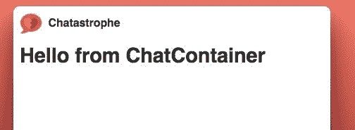
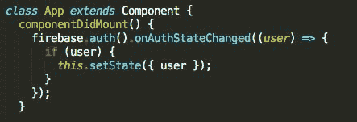

# 第五章：使用 React 进行路由

“我们已经扩展了功能列表。”

你忍住一声叹息，等待。

“我们想给我们的用户一切。他们需要的一切，他们想要的一切，他们可能永远想要的一切。”

“好吧，”你说。“但这只是一个原型…”

“一个用于分析的页面，一个用于他们的个人资料，一个用于他们朋友的分析，一个用于做笔记，一个用于天气。”

你悄悄地走出去，低声重复着，“这只是一个原型。”

# 计划

我们现在已经到达了技术上工作的应用程序的点（允许用户登录），但缺乏真正有用的内容。是时候改变了。

然而，为了这样做，我们需要向我们的应用程序添加额外的页面。你们中的一些人可能听说过**单页应用程序**（**SPA**）这个术语，它用来指代 React 应用程序，因此可能会对更多页面的讨论感到困惑。随着我们进一步深入，我们将涵盖这个区别，然后进入使用 React Router 进行实际路由设置。

我们将学到什么：

+   如何安装和使用 React Router v4

+   如何为其他组件添加额外的路由

+   如何在路由之间移动

# 页面上的页面

幸运的是，理智的头脑占上风，产品主设计师（公司目前雇佣的五名设计师中排名最高的）表示他们只需要原型的三个视图：登录视图（已完成！）、主要聊天视图和用户个人资料视图。

然而，显然我们需要一种强大且可扩展的方法来在我们的应用程序中在不同的屏幕之间切换。我们需要一个良好而坚实的路由解决方案。

传统上，路由一直是关于提供哪些 HTML/CSS/JavaScript 文件的问题。你在[static-site.com](http://static-site.com)上输入 URL，得到主`index.html`，然后转到[static-site.com/resources](http://static-site.com/resources)并得到`resources.html`。

在这个模型中，服务器收到对特定 URL 的请求并返回相应的文件。

然而，越来越多的情况下，路由正在转移到客户端。在 React 世界中，我们只提供我们的`index.html`和`bundle.js`。我们的 JavaScript 从浏览器中获取 URL，然后决定渲染什么 JSX。

因此有了单页应用程序这个术语--从传统模型来看，我们的用户技术上只坐在一个页面上。然而，他们能够在其他视图之间导航，并且以更加流畅的方式进行，而无需从服务器请求更多文件。

我们的顶层容器组件（`App.js`）将始终被渲染，但变化的是其内部渲染的内容。

# React 路由的不同之处

对于一些 React 路由解决方案，模型看起来可能是这样的。

我们将渲染我们的初始屏幕，如下所示：

```jsx
<App>
  <LoginContainer />
</App>
```

这将适用于`chatastrophe.com/login`的 URL。当用户完成登录后，我们将把他们发送到`chatastrophe.com/chat`。在那时，我们将使用以下方式调用`ReactDOM.render`：

```jsx
<App>
  <ChatContainer />
</App>
```

然后，React 的协调引擎将比较旧应用程序和新应用程序，并交换具有更改的组件；在这种情况下，它将`LoginContainer`替换为`ChatContainer`，而不重新渲染`App`。

以下是一个非常简单的示例，使用了一个名为`page.js`的基本路由解决方案：

```jsx
page(‘/’, () => {
  ReactDOM.render(
    <App>
      <ChatContainer />
    </App>.
    document.getElementById('root')
  );
});

page(‘/login’, () => {
 ReactDOM.render(
   <App>
    <LoginContainer />
   </App>.
   document.getElementById('root')
  );
});
```

这个解决方案运行良好。我们能够在多个视图之间导航，而 React 的协调确保没有不必要的重新渲染未更改的组件。

然而，这个解决方案并不是非常符合 React 的特点。每次我们改变页面时，我们都将整个应用程序传递给`ReactDOM.render`，这导致我们的`router.js`文件中有大量重复的代码。我们定义了多个版本的应用程序，而不是精确选择应该在何时渲染哪些组件。

换句话说，这个解决方案强调了路由的整体方法，而不是通过组件分割的方法。

输入`React Router v4`，这是该库的完全重写，它曾经是一个更传统的路由解决方案。不同之处在于现在路由是基于 URL 渲染的组件。

让我们通过重新编写我们之前的示例来详细讨论这意味着什么：

```jsx
ReactDOM.render(
  <Router>
    <App>
      <Route path="/" component={ChatContainer} />
      <Route path="/login" component={LoginContainer} />
    </App>
  </Router>,
  document.getElementById('root')
);
```

现在，我们只调用一次`ReactDOM.render`。我们渲染我们的应用程序，并在其中渲染两个包裹我们两个容器的`Route`组件。

每个`Route`都有一个`path`属性。如果浏览器中的 URL 与该`path`匹配，`Route`将渲染其子组件（容器）；否则，它将不渲染任何内容。

我们从不尝试重新渲染我们的`App`。它应该保持静态。此外，我们的路由解决方案不再与我们的组件分开存放在一个`router.js`文件中。现在，它存在于我们的组件内部。

我们还可以在组件内进一步嵌套我们的路由。在`LoginContainer`内部，我们可以添加两个路由--一个用于`/login`，一个用于`/login/new`--如果我们想要有单独的登录和注册视图。

在这个模型中，每个组件都可以根据当前的 URL 做出渲染的决定。

我会诚实，这种方法有点奇怪，需要时间适应，当我开始使用它时，我一点也不喜欢。对于有经验的开发人员来说，它需要以一种不同的方式思考你的路由，而不是作为一个自上而下的、整个页面决定要渲染什么的决定，现在鼓励你在组件级别做决定，这可能会很困难。

然而，经过一段时间的使用，我认为这种范式正是 React 路由所需要的，将为开发人员提供更多的灵活性。

好了，说了这么多。让我们创建我们的第二个视图--聊天界面--用户可以在这里查看并向全世界的人发送消息（你知道，“全球互联”）。首先，我们将创建一个基本组件，然后我们可以开始使用我们的路由解决方案。

# 我们的 ChatContainer

创建组件现在应该是老生常谈了。我们的`ChatContainer`将是一个基于类的组件，因为我们将需要在后面利用一些生命周期方法（稍后会详细介绍）。

在我们的`components`文件夹中，创建一个名为`ChatContainer.js`的文件。然后，设置我们的骨架：

```jsx
import React, { Component } from 'react';

export default class ChatContainer extends Component {
  render() {
    return (

   );
  }
}
```

让我们继续包装我们的组件，使用组件名称作为`div`的`id`：

```jsx
import React, { Component } from 'react';

export default class ChatContainer extends Component {
  render() {
    return (
      <div id="ChatContainer">
      </div>
    );
  }
}
```

就像在我们的`LoginContainer`顶部一样，我们希望渲染我们美丽的标志和标题供用户查看。如果我们有某种可重用的组件，这样我们就不必重写那段代码了：

```jsx
import React, { Component } from 'react';
import Header from './Header';

export default class ChatContainer extends Component {
  render() {
    return (
      <div id="ChatContainer">
        <Header />
      </div>
    );
  }
}
```

这太美妙了。好吧，让我们在`Header`后面添加`<h1>Hello from ChatContainer</h1>`，然后继续进行路由，这样我们在工作时就可以实际看到我们在做什么。现在，我们的`ChatContainer`是不可见的。要改变这种情况，我们需要设置 React Router。

# 安装 React Router

让我们从基础知识开始。从项目根目录在终端中运行以下命令。

```jsx
yarn add react-router-dom@4.2.2
```

`react-router-dom`包含了我们在应用程序中为用户进行路由所需的所有 React 组件。您可以在[`reacttraining.com/react-router`](https://reacttraining.com/react-router)上查看完整的文档。然而，我们感兴趣的唯一组件是`Route`和`BrowserRouter`。

重要的是要确保您安装的是`react-router-dom`而不是`react-router`。自从发布了第 4 版以后，该软件包已被拆分为各种分支。`React-router-dom`专门用于提供路由组件，这正是我们感兴趣的。请注意，它安装了`react-router`作为对等依赖。

`Route`组件相当简单；它接受一个名为`path`的属性，这是一个字符串，比如`/`或`/login`。当浏览器中的 URL 与该字符串匹配（[`chatastrophe.com/login`](http://chatastrophe.com/login)），`Route`组件渲染通过`component`属性传递的组件；否则，它不渲染任何内容。

与 Web 开发中的任何内容一样，您可以使用`Route`组件的方式有很多额外复杂性。我们稍后会更深入地探讨这个问题。但是，现在，我们只想根据我们的路径是`/`还是`/login`有条件地渲染`ChatContainer`或`LoginContainer`。

`BrowserRouter`更复杂，但对于我们的目的，使用起来会很简单。基本上，它确保我们的`Route`组件与 URL 保持同步（渲染或不渲染）。它使用 HTML5 历史 API 来实现这一点。

# 我们的 BrowserRouter

我们需要做的第一件事是将整个应用程序包装在`BrowserRouter`组件中，然后我们可以添加我们的`Route`组件。

由于我们希望在整个应用程序周围使用路由器，最容易添加它的地方是在我们的`src/index.js`中。在顶部，我们要求以下组件：

```jsx
import React from 'react';
import ReactDOM from 'react-dom';
import { BrowserRouter } from 'react-router-dom';
import App from './components/App';
```

然后，我们将我们的`App`作为`BrowserRouter`的子级进行渲染：

```jsx
ReactDOM.render(
  <BrowserRouter>
    <App />
  </BrowserRouter>,
  document.getElementById('root')
);
```

您还应该在我们的热重新加载器配置中执行相同的操作：

```jsx
if (module.hot) {
  module.hot.accept('./components/App', () => {
    const NextApp = require('./components/App').default;
    ReactDOM.render(
      <BrowserRouter>
 <App />
 </BrowserRouter>,
      document.getElementById('root')
    );
  });
}
```

完成！现在我们实际上可以开始添加路由了。

# 我们的前两个路由

在我们的`App`组件中，我们目前无论如何都会渲染`LoginContainer`：

```jsx
render() {
  return (
    <div id="container">
      <LoginContainer />
    </div>
  );
}
```

我们希望改变这个逻辑，以便只渲染`LoginContainer`或者渲染`ChatContainer`。为了做到这一点，让我们在`ChatContainer`中要求它。

我们还需要从`react-router-dom`中要求我们的`Route`组件：

```jsx
import React, { Component } from 'react';
import { Route } from 'react-router-dom';
import LoginContainer from './LoginContainer';
import ChatContainer from './ChatContainer';
import './app.css';
```

我将`Route`导入放在了两个`Container`导入的上面。最佳实践是，你应该在相对导入（从`src`内导入的文件）之前放置绝对导入（从`node_modules`导入）。这样可以保持代码整洁。

现在，我们可以用接受`component`属性的`Route`组件替换我们的容器：

```jsx
render() {
  return (
    <div id="container">
      <Route component={LoginContainer} />
      <Route component={ChatContainer} />
    </div>
  );
}
```

我们将我们的组件属性传递为`LoginContainer`，而不是`<LoginContainer />`。

我们的应用程序重新加载，我们看到...一团糟：


我们目前同时渲染两个容器！糟糕。问题在于我们没有给我们的`Route`一个`path`属性，告诉它们何时渲染（以及何时不渲染）。让我们现在来做。

我们的第一个`Route`，`LoginContainer`，应该在`/login`路由时渲染，因此我们添加了如下路径：

```jsx
<Route path="/login" component={LoginContainer} />
```

当用户在根路径`/`（当前在`localhost:8080/`，或者在我们部署的应用[`chatastrophe-77bac.firebaseapp.com/`](https://chatastrophe-77bac.firebaseapp.com/)）时，我们的另一个容器`ChatContainer`将被显示，因此我们添加了如下路径：

```jsx
<Route path="/" component={ChatContainer} />
```

保存，检查应用程序，你会得到以下结果：



好了！我们的`LoginContainer`不再渲染。让我们前往`/login`，确保我们只在那里看到我们的`LoginContainer`：


哎呀！

我们在`/login`处同时渲染两个容器。发生了什么？

长话短说，React Router 使用**RegEx**模式来匹配路由并确定要渲染的内容。我们当前的路径（`/login`）匹配了传递给我们登录`Route`的属性，但它也在技术上匹配了`/`。实际上，一切都匹配`/`，这对于你想要在每个页面上渲染一个组件是很好的，但我们希望我们的`ChatContainer`只在路径为`/`（没有其他内容）时才渲染。

换句话说，我们希望在路径精确匹配`/`时渲染`ChatContainer`路由。

好消息是，React Router 已经为这个问题做好了准备；只需在我们的`Route`中添加一个`exact`属性：

```jsx
<Route exact path="/" component={ChatContainer} />
```

前面的内容与写作如下相同：

`<Route exact={true} path="/" component={ChatContainer} />`

当我们检查`/login`时，我们应该只看到我们的`LoginContainer`。太棒了！我们有了我们的前两个路由。

接下来，我们想要做的是强制路由一点；当用户登录时，我们希望将他们重定向到主要的聊天界面。让我们来做吧！

# 登录后重定向

在这里，事情会变得有点棘手。首先，我们要做一些准备工作。

在我们的`LoginContainer`中，当涉及到我们的`signup`和`login`方法时，我们目前只是在`then`语句中`console.log`出结果。换句话说，一旦用户登录，我们实际上什么也没做：

```jsx
signup() {
  firebase.auth().createUserWithEmailAndPassword(this.state.email, this.state.password)
    .then(res => {
      console.log(res);
    }).catch(error => {
      console.log(error);
      this.setState({ error: 'Error signing up.' });
    })
}
```

让我们改变这一点（在`signup`和`login`中），调用另一个方法`onLogin`：

```jsx
login() {
  firebase.auth().signInWithEmailAndPassword(this.state.email, this.state.password)
    .then(res => {
      this.onLogin();
    }).catch((error) => {
      if (error.code === 'auth/user-not-found') {
        this.signup();
      } else {
        this.setState({ error: 'Error logging in.' });
      }
    });
}
```

然后，我们可以定义我们的`onLogin`方法：

```jsx
onLogin() {
  // redirect to '/'
}
```

那么，我们如何重定向到根路径？

我们知道我们的`Route`组件将根据浏览器中的 URL 进行渲染。我们可以确信，如果我们正确修改 URL，我们的应用程序将重新渲染以显示适当的组件。诀窍是从`LoginContainer`内部修改 URL。

正如我们之前提到的，React Router 使用 HTML5 历史 API 在 URL 之间移动。在这个模型中，有一个叫做`history`的对象，其中有一些方法，允许你将一个新的 URL 推入应用程序的当前状态。

所以，如果我们在`/login`，想要去`/`：

```jsx
history.pushState(null, null, ‘/’)
```

React Router 让我们以更简洁的方式与 HTML5 历史对象交互（例如避免空参数）。它的工作方式很简单：通过`Route`（通过`component`属性）传递给的每个组件都会接收到一个叫做`history`的 prop，其中包含一个叫做`push`的方法。

如果这听起来让人困惑，不用担心，一会儿就会清楚了。我们只需要这样做：

```jsx
onLogin() {
  this.props.history.push(‘/’);
}
```

试着去`/login`并登录。你将被重定向到`ChatContainer`。神奇！

当调用`push`时，`history` prop 正在更新浏览器的 URL，然后导致我们的`Route`组件渲染它们的组件（或者不渲染）：

```jsx
History.push -> URL change -> Re-render
```

请注意，这是一个相当革命性的在网站中导航的方式。以前，它是完全不同的：

```jsx
Click link/submit form -> URL change -> Download new page
```

欢迎来到单页面应用的路由世界。感觉不错，是吧？

# 登出

好的，我们已经处理了用户登录，但是当他们想要注销时怎么办？

让我们在`ChatContainer`的顶部建立一个按钮，让他们可以注销。它最适合在`Header`组件中，所以为什么不在那里建立呢？

等等。我们目前在`LoginContainer`的`/login`路径上使用`Header`。如果我们添加一个`Logout`按钮，它也会出现在登录界面上，这会让人感到困惑。我们需要一种方法，只在`ChatContainer`上渲染`Logout`按钮。

我们可以利用`Route history` prop，并使用它来根据 URL 进行 Logout 按钮的条件渲染（如果路径是`/`，则渲染按钮，否则不渲染！）。然而，这可能会变得混乱，对于未来的开发人员来说很难理解，因为我们添加了更多的路由。让我们在想要 Logout 按钮出现时变得非常明确。

换句话说，我们想在`Header`内部渲染 Logout 按钮，但只有当`Header`在`ChatContainer`内部时才这样做。这有意义吗？

这样做的方法是使用 React children。从 HTML 的角度来看，Children 实际上非常容易理解：

```jsx
<div>
  <h1>I am the child of div</h1>
</div>
```

`h1`是`div`的子元素。在 React 组件的情况下，`Parent`组件将接收一个名为`children`的属性，它等于`h1`标签：

```jsx
<Parent>
  <h1>I am the child of Parent</h1>
</Parent>
```

要在`Parent`中渲染它，我们只需要这样做：

```jsx
<div id=”Parent”>
  {this.props.children}
</div>
```

让我们看看这在实际中是如何运作的，希望这样会更有意义（并给你一个它的强大的想法）。

在`ChatContainer`中，让我们用一个开放和关闭的标签替换我们的`<Header />`标签：

```jsx
<Header>
</Header>
```

在其中，我们将定义我们的按钮：

```jsx
<Header>
  <button className="red">Logout</button>
</Header>
```

检查我们的页面，我们会发现没有任何变化。这是因为我们还没有告诉`Header`实际渲染它的`children`。让我们跳到`Header.js`并改变这一点。

在我们的`h1`下面，添加以下内容：

```jsx
import React from 'react';

const Header = (props) => {
  return (
    <div id="Header">
      
      <h1>Chatastrophe</h1>
      {props.children}
    </div>
  );
};

export default Header;
```

我们在这里做什么？首先，我们将`props`定义为我们函数组件的参数：

```jsx
const Header = (props) => {
```

所有功能性的 React 组件都将`props`对象作为它们的第一个参数。

然后，在该对象内，我们正在访问`children`属性，它等于我们的按钮。现在，我们的`Logout`按钮应该出现：


太棒了！如果你检查`/login`路径，你会注意到我们的按钮没有出现。那是因为在`LoginContainer`中，`Header`没有`children`，所以没有东西被渲染。

Children 使 React 组件非常可组合和可重用。

好的，让我们让我们的按钮真正起作用。我们想要调用一个名为`firebase.auth().signOut`的方法。让我们为我们的按钮创建一个调用这个函数的点击处理程序：

```jsx
export default class ChatContainer extends Component {
  handleLogout = () => {
    firebase.auth().signOut();
  };

  render() {
    return (
      <div id="ChatContainer">
        <Header>
          <button className="red" onClick={this.handleLogout}>
            Logout
          </button>
        </Header>
        <h1>Hello from ChatContainer</h1>
      </div>
    );
  }
}
```

现在，当我们按下按钮时，什么也不会发生，但我们已经被登出了。我们缺少登录谜题的最后一块。

当我们的用户注销时，我们希望将他们重定向到登录界面。如果我们有某种方式来告诉 Firebase 授权的状态就好了：



这很完美。当我们点击注销按钮后，当我们的用户注销时，Firebase 将使用空参数调用`firebase.auth().onAuthStateChanged`。

换句话说，我们已经拥有了我们需要的一切；我们只需要在我们的`if`语句中添加一个`else`来处理没有找到用户的情况。

流程将是这样的：

1.  当用户点击注销按钮时，Firebase 将登出他们。

1.  然后它将使用空参数调用`onAuthStateChanged`方法。

1.  如果`onAuthStateChanged`被调用时用户为空，我们将使用`history`属性将用户重定向到登录页面。

让我们通过跳转到 `App.js` 来实现这一点。

我们的 `App` 不是 `Route` 的子组件，所以它无法访问我们在 `LoginContainer` 中使用的 `history` 属性，但是我们可以使用一个小技巧。

在 `App.js` 的顶部，添加以下内容到我们的 `react-router-dom` 导入：

```jsx
import { Route, withRouter } from 'react-router-dom';
```

然后，在底部，用这个替换我们的 `export default` 语句：

```jsx
export default withRouter(App);
```

这里发生了什么？基本上，`withRouter` 是一个接受组件作为参数并返回该组件的函数，除了现在它可以访问 `history` 属性。随着我们的学习，我们会更多地涉及到这一点，但让我们先完成这个注销流程。

最后，我们可以填写 `componentDidMount`：

```jsx
componentDidMount() {
  firebase.auth().onAuthStateChanged((user) => {
    if (user) {
      this.setState({ user });
    } else {
      this.props.history.push('/login')
    }
  });
}
```

尝试再次登录并点击注销按钮。你应该直接进入登录界面。神奇！

# 绕道 - 高阶组件

在前面的代码中，我们使用了 `withRouter` 函数（从 `react-router-dom` 导入）来让我们的 `App` 组件访问 `history` 属性。让我们花点时间来谈谈它是如何工作的，因为这是你可以学到的最强大的 React 模式之一。

`withRouter` 是一个**高阶组件**（**HOC**）的例子。这个略显夸张的名字比我最喜欢的解释更好：*构建函数的函数*（感谢 *Tom Coleman*）。让我们看一个例子。

假设你有一个 `Button` 组件，如下所示：

```jsx
const Button = (props) => {
  return (
    <button style={props.style}>{props.text}</button>
  );
};
```

还有，假设我们有这样一种情况，我们希望它有白色文本和红色背景：

```jsx
<Button style={{ backgroundColor: 'red', color: 'white' }} text="I am red!" />
```

随着你的应用程序的发展，你发现你经常使用这种特定的样式来制作按钮。你需要很多红色按钮，带有不同的文本，每次都输入 `backgroundColor` 很烦人。

不仅如此；你还有另一个组件，一个带有相同样式的警报框：

```jsx
<AlertBox style={{ backgroundColor: 'red', color: 'white' }} warning="ALERT!" />
```

在这里，你有两个选择。你想要两个新的组件（`RedAlertBox` 和 `RedButton`），你可以在任何地方使用。你可以按照下面的示例定义它们：

```jsx
const RedButton = (props) => {
  return (
    <Button style={{ backgroundColor: 'red', color: 'white' }} text={props.text} />
  );
};
```

还有：

```jsx
const RedAlertBox = (props) => {
  return (
    <AlertBox style={{ backgroundColor: 'red', color: 'white' }} warning={props.text} />
  );
};
```

然而，有一种更简单、更可组合的方法，那就是创建一个高阶组件。

我们想要实现的是一种方法，可以给一个组件添加红色背景和白色文本的样式。就是这样。我们想要将这些属性注入到任何给定的组件中。

让我们先看看最终结果，然后看看我们的 HOC 会是什么样子。如果我们成功地创建了一个名为 `makeRed` 的 HOC，我们可以像下面这样使用它来创建我们的 `RedButton` 和 `RedAlertBox`：

```jsx
// RedButton.js
import Button from './Button'
import makeRed from './makeRed'

export default makeRed(Button)
```

```jsx
// RedAlertBox.js
import AlertBox from './AlertBox'
import makeRed from './makeRed'

export default makeRed(AlertBox)
```

这样做要容易得多，而且更容易重复使用。我们现在可以重复使用`makeRed`来将任何组件转换为漂亮的红色背景和白色文本。这就是力量。

好了，那么我们如何创建一个`makeRed`函数呢？我们希望将一个组件作为参数，并返回具有其所有分配的 props 和正确样式 prop 的组件：

```jsx
import React from 'react';

const makeRed = (Component) => {
  const wrappedComponent = (props) => {
    return (
      <Component style={{ backgroundColor: 'red', color: 'white' }} {...props} />
    );
  };
  return wrappedComponent;
}

export default makeRed;
```

以下是相同的代码，带有注释：

```jsx
import React from 'react';

// We receive a component constructor as an argument
const makeRed = (Component) => {
  // We make a new component constructor that takes props, just as any component
  const wrappedComponent = (props) => {
    // This new component returns the original component, but with the style applied
    return (
      // But we also use the ES6 spread operator to apply the regular props passed in.
      // The spread operator applies props like the text in <RedButton text="hello" /> 
       to our new component
      // It will "spread" any and all props across our component
      <Component style={{ backgroundColor: 'red', color: 'white' }} {...props} />
    );
  };
  // We return the new constructor, so it can be called as <RedButton /> or <RedAlertBox />
  return wrappedComponent;
}

export default makeRed;
```

最令人困惑的可能是`{...props}`的扩展运算符。扩展运算符是一个有用但令人困惑的 ES6 工具。它允许您获取一个对象（这里是`props`对象）并将其所有键和值应用于一个新对象（组件）：

```jsx
const obj1 = { 1: 'one', 2: 'two' };
const obj2 = { 3: 'three', ...obj1 };
console.log(obj2);
// { 1: 'one', 2: 'two', 3: 'three' }
```

高阶组件是使您的 React 组件更容易重用的下一级工具。我们在这里只是浅尝辄止。有关更多信息，请查看*Tom Coleman*的*Understanding Higher Order Components*，网址为[`medium.freecodecamp.org/understanding-higher-order-components-6ce359d761b`](https://medium.freecodecamp.org/understanding-higher-order-components-6ce359d761b)。

# 我们的第三个路由

正如本章开头所讨论的，Chatastrophe 团队决定要有一个用户个人资料视图。让我们为此做骨架和基本路由。

在`src/components`中，创建一个名为`UserContainer.js`的新文件。在里面，做基本的组件框架：

```jsx
import React, { Component } from 'react';
import Header from './Header';

export default class UserContainer extends Component {
  render() {
    return (
      <div id="UserContainer">
        <Header />
        <h1>Hello from UserContainer</h1>
      </div>
    );
  }
}
```

回到`App.js`，让我们导入我们的新容器并添加`Route`组件：

```jsx
import UserContainer from './UserContainer';

// Inside render, underneath ChatContainer Route
<Route path="/users" component={UserContainer} />
```

等一下！前面的代码为我们的`UserContainer`创建了一个在`/users`的路由，但我们不只有一个用户视图。我们为我们应用程序的每个用户都有一个用户视图。我们需要在`chatastrophe.com/users/1`为用户 1 创建一个路由，在`chatastrophe.com/users/2`为用户 2 创建一个路由，依此类推。

我们需要一种方法来将变量值传递给我们的`path`属性，等于用户的`id`。幸运的是，这样做很容易：

```jsx
<Route path="/users/:id" component={UserContainer} />
```

最棒的部分？现在，在我们的`UserContainer`中，我们将收到一个`props.params.match`对象，等于`{ id: 1 }`或者`id`是什么，然后我们可以使用它来获取该用户的消息。

让我们通过更改`UserContainer.js`中的`h1`来测试一下：

```jsx
<h1>Hello from UserContainer for User {this.props.match.params.id}</h1>
```

然后，前往`localhost:8080/users/1`：


如果在嵌套路由中遇到找不到`bundle.js`的问题，请确保您在`webpack.config.js`中的输出如下所示：

```jsx
output: {
 path: __dirname + "/public",
 filename: "bundle.js",
 publicPath: "/"
},
```

很好。现在，还有最后一步。让我们为用户从`UserContainer`返回到主聊天屏幕添加一种方式。

我们可以通过充分利用`Header`的子组件来以一种非常简单的方式做到这一点；只是，在这种情况下，我们可以添加另一个 React Router 组件，使我们的生活变得非常简单。它被称为`Link`，就像 HTML 中的标签一样，但经过了 React Router 的优化。

在`UserContainer.js`中：

```jsx
import { Link } from 'react-router-dom';
```

```jsx
<Header>
  <Link to="/">
    <button className="red">
      Back To Chat
    </button>
  </Link>
</Header>
```


当您单击按钮时，应该转到根路由`/`。

# 总结

就是这样！在本章中，我们涵盖了很多内容，以便让我们的应用程序的路由解决方案能够正常运行。如果有任何困惑，我建议您查看 React Router 文档[`reacttraining.com/react-router/`](https://reacttraining.com/react-router/)。接下来，我们将深入学习 React，完成我们的基本应用程序，然后开始将其转换为渐进式 Web 应用程序。
