# 第六章：完成我们的应用

是时候完成我们应用的原型了，哦，我们有很多工作要做。

框架已经搭好，所有的路由都设置好了，我们的登录界面也完全完成了。然而，我们的聊天和用户视图目前还是空白的，这就是 Chatastrophe 的核心功能所在。因此，在向董事会展示我们的原型之前，让我们确保它实际上能够工作。

本章我们将涵盖的内容如下：

+   加载和显示聊天消息

+   发送和接收新消息

+   仅在用户个人资料页面上显示特定的聊天消息

+   React 状态管理

# 用户故事进展

让我们简要地检查一下我们在第一章“创建我们的应用结构”中定义的用户故事，看看我们已经完成了哪些。

我们已经完成了以下内容：

用户应该能够登录和退出应用。

以下内容尚未完成，但是它们是我们稍后将构建的 PWA 功能的一部分：

+   用户应该能够在离线时查看他们的消息

+   用户应该在其他用户发送消息时收到推送通知

+   用户应该能够将应用安装到他们的移动设备上

+   用户应该能够在不稳定的网络条件下在五秒内加载应用

这给我们留下了一系列故事，我们需要在我们的原型完成之前完成：

+   用户应该能够实时发送和接收消息

+   用户应该能够查看特定作者的所有消息

这些故事中的每一个都与特定的视图（聊天视图和用户视图）相匹配。让我们从`ChatContainer`开始，开始构建我们的聊天框。

# ChatContainer 框架

我们的聊天视图将有两个主要部分：

+   一个消息显示，列出所有的聊天

+   一个聊天框，用户可以在其中输入新消息

我们可以先添加适当的`div`标签：

```jsx
render() {
  return (
    <div id="ChatContainer">
      <Header>
        <button className="red" onClick={this.handleLogout}>
          Logout
        </button>
      </Header>
      <div id="message-container">

 </div>
 <div id="chat-input">

 </div>
     </div>
   );
}
```

提醒确保你的 ID 和 classNames 与我的相同，以免你的 CSS 不同（甚至更糟）。

我们首先填写输入框。在`div#chat-input`内，让我们放置一个`textarea`，并设置占位符为“添加你的消息…”：

```jsx
<textarea placeholder="Add your message..." />
```

我们将配置它，以允许用户按“Enter”键发送消息，但最好也有一个发送按钮。在`textarea`下面，添加一个`button`，在其中，我们将添加一个`SVG`图标：

```jsx
<div id="chat-input">
  <textarea placeholder="Add your message..." />
  <button>
 <svg viewBox="0 0 24 24">
 <path fill="#424242" d="M2,21L23,12L2,3V10L17,12L2,14V21Z" />
 </svg>
 </button>
</div>
```

确保你的`path fill`和`svg viewBox`属性与提到的相同。

SVG 是一种可以缩放（放大）而不会失真的图像类型。在这种情况下，我们基本上创建了一个框（`svg`标签），然后在`path`标签内绘制一条线。浏览器进行实际绘制，所以永远不会有像素化。

为了 CSS 的目的，让我们也给我们的`div#ChatContainer`添加`inner-container`类：

```jsx
<div id="ChatContainer" className="inner-container">
```

如果一切顺利，你的应用现在应该是这个样子的：

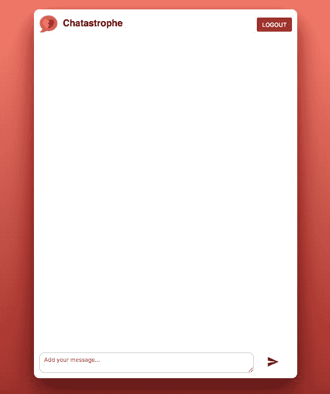

这就是我们聊天视图的基本结构。现在，我们可以开始讨论如何管理我们的数据--来自 Firebase 的消息列表。

# 管理数据流

React 的一个重要原则是所谓的**单向数据流**。

在原型 React 应用中，数据存储在最高级组件的状态中，并通过`props`传递给较低级的组件。当用户与应用程序交互时，交互事件通过 props 通过组件树传递，直到到达最高级组件，然后根据操作修改状态。

应用程序形成一个大循环--数据下传，事件上传，新数据下传。你也可以把它想象成一部电梯，从充满数据的顶层出发，然后再满载事件返回。

这种方法的优势在于很容易跟踪数据的流动。你可以看到数据流向哪里（传递给哪些子组件），以及为什么会改变（作为对哪些事件的反应）。

现在，这种模式在具有数百个组件的复杂应用程序中会遇到问题。在顶层组件中存储所有状态，并通过 props 传递所有数据和事件变得难以控制。

想象一条从顶层组件（`App.js`）到低层组件（比如一个`button`）的大链条。如果有数十个`嵌套`组件，并且`button`需要一个从`App`状态派生的 prop，你将不得不通过每个链条中的每个组件传递这个 prop。谢谢，我不要。

解决这个状态管理问题有很多方法，但大多数都是基于在组件树中创建容器组件的想法；这些组件有状态，并将其传递给有限数量的子组件。现在我们有多部电梯，一些服务于一楼到三楼，另一些服务于五楼到十二楼，依此类推。

我们不会在我们的应用程序中处理任何状态管理，因为我们只有四个组件，但是在你的 React 应用程序扩展时，记住这一点是很好的。

前两个 React 状态管理库是 Redux（[`github.com/reactjs/redux`](https://github.com/reactjs/redux)）和 MobX（[`github.com/mobxjs/mobx`](https://github.com/mobxjs/mobx)）。我对两者都有深入的了解，它们都有各自的优势和权衡。简而言之，MobX 对开发者的生产力更好，而 Redux 对于保持大型应用程序有组织性更好。

为了我们的目的，我们可以将所有状态存储在我们的`App`组件中，并将其传递给子组件。与其将我们的消息存储在`ChatContainer`中，不如将它们存储在`App`中并传递给`ChatContainer`。这立即给了我们一个优势，也可以将它们传递给`UserContainer`。

换句话说，我们的消息存储在`App`的状态中，并通过`props`与`UserContainer`和`ChatContainer`共享。

状态是你的应用程序中的唯一真相，并且不应该重复。在`ChatContainer`和`UserContainer`中存储两个消息数组是没有意义的。相反，将状态保持在必要的高度，并将其传递下去。

长话短说，我们需要在`App`中加载我们的消息，然后将它们传递给`ChatContainer`。将`App`负责发送消息也是有道理的，这样我们所有的消息功能都在一个地方。

让我们从发送我们的第一条消息开始！

# 创建一条消息

与我们的`LoginContainer`一样，我们需要在状态中存储`textarea`的值随着其变化。

我们使用`LoginContainer`的状态来存储该值。让我们在`ChatContainer`中也这样做。

在前面的讨论之后，你可能会想：为什么我们不把所有状态都保存在`App`中呢？有人会主张这种方法，把所有东西都放在一个地方；然而，这将使我们的`App`组件变得臃肿，并要求我们在组件之间传递多个`props`。最好将状态保持在必要的高度，而不是更高；在聊天输入中的新消息只有在完成并提交后才与`App`相关，而在此之前并不相关。

让我们开始设置它。

将此添加到`ChatContainer.js`：

```jsx
state = { newMessage: '' };
```

还要添加一个处理它的方法：

```jsx
handleInputChange = e => {
  this.setState({ newMessage: e.target.value });
};
```

现在，修改我们的`textarea`：

```jsx
<textarea
    placeholder="Add your message..."
    onChange={this.handleInputChange}
    value={this.state.newMessage} 
/>
```

最佳实践说，当 JSX 元素具有两个以上的`props`（或`props`特别长）时，应该将其多行化。

当用户点击发送时，我们希望将消息发送给`App`，然后`App`会将其发送到 Firebase。之后，我们重置字段：

```jsx
handleSubmit = () => {
   this.props.onSubmit(this.state.newMessage);
   this.setState({ newMessage: ‘’ });
};
```

我们还没有在`App`中添加这个`onSubmit`属性函数，但我们很快就可以做到：

```jsx
<button onClick={this.handleSubmit}>
  <svg viewBox="0 0 24 24">
    <path fill="#424242" d="M2,21L23,12L2,3V10L17,12L2,14V21Z" />
  </svg>
</button>
```

然而，我们也希望让用户通过按下*Enter*来提交。我们该怎么做呢？

目前，我们监听`textarea`上的更改事件，然后调用`handleInputChange`方法。在`textarea`上监听其值的更改的属性是`onChange`，但还有另一个事件，即按键按下事件，每当用户按下键时都会发生。

我们可以监听该事件，然后检查按下了什么键；如果是*Enter*，我们就发送我们的消息！

让我们看看它的效果：

```jsx
<textarea
    placeholder="Add your message..."
    onChange={this.handleInputChange}
    onKeyDown={this.handleKeyDown}
    value={this.state.newMessage} />
```

以下是这个事件的处理程序：

```jsx
handleKeyDown = e => {
  if (e.key === 'Enter') {
    e.preventDefault();
    this.handleSubmit();
  }
}
```

事件处理程序（`handleKeyDown`）会自动传入一个事件作为第一个参数。这个事件有一个名为`key`的属性，它是一个指示按键值的字符串。在提交消息之前，我们还需要阻止默认行为（在`textarea`中创建新行）。

你可以使用这种类型的事件监听器来监听各种用户输入，从悬停在元素上到按住 Shift 键点击某物。

在我们转到`App.js`之前，这是`ChatContainer`的当前状态：

```jsx
import React, { Component } from 'react';
import Header from './Header';

export default class ChatContainer extends Component {
  state = { newMessage: '' };

  handleLogout = () => {
    firebase.auth().signOut();
  };

  handleInputChange = e => {
    this.setState({ newMessage: e.target.value });
  };

  handleSubmit = () => {
    this.props.onSubmit(this.state.newMessage);
    this.setState({ newMessage: '' });
  };

  handleKeyDown = e => {
    if (e.key === 'Enter') {
      e.preventDefault();
      this.handleSubmit();
    }
  };

  render() {
    return (
      <div id="ChatContainer" className="inner-container">
        <Header>
          <button className="red" onClick={this.handleLogout}>
            Logout
          </button>
        </Header>
        <div id="message-container" />
        <div id="chat-input">
          <textarea
            placeholder="Add your message..."
            onChange={this.handleInputChange}
            onKeyDown={this.handleKeyDown}
            value={this.state.newMessage}
          />
          <button onClick={this.handleSubmit}>
            <svg viewBox="0 0 24 24">
              <path fill="#424242" d="M2,21L23,12L2,3V10L17,12L2,14V21Z" />
            </svg>
          </button>
        </div>
      </div>
    );
  }
}
```

好的，让我们添加最后一个链接来创建一条消息。在`App.js`中，我们需要为`onSubmit`事件添加一个处理程序，然后将其作为属性传递给`ChatContainer`：

```jsx
// in App.js
handleSubmitMessage = msg => {
  // Send to database
  console.log(msg);
};
```

我们想要将一个等于这个方法的`onSubmit`属性传递给`ChatContainer`，但等一下，我们当前渲染的`ChatContainer`如下：

```jsx
<Route exact path="/" component={ChatContainer} />
```

`ChatContainer`本身是我们`Route`上的一个属性。我们怎么能给`ChatContainer`任何`props`呢？

事实证明，React Router 提供了三种在`Route`内部渲染组件的不同方法。最简单的方法是我们之前选择的路由（哈哈），将其作为名为`component`的属性传递进去。

对于我们的目的来说，还有另一种更好的方法——一个名为`render`的属性，我们通过它传递一个返回我们组件的函数。

在`Route`内部渲染组件的第三种方法是通过一个名为`children`的属性，它接受一个带有`match`参数的函数，该参数根据`path`属性是否与浏览器的 URL 匹配而定义或为 null。函数返回的 JSX 始终被渲染，但您可以根据`match`参数进行修改。

让我们将我们的`Route`切换到这种方法：

```jsx
<Route
  exact
  path="/"
  render={() => <ChatContainer onSubmit={this.handleSubmitMessage} />}
/>
```

前面的例子使用了一个带有隐式返回的 ES6 箭头函数。这与写`() => { return <ChatContainer onSubmit={this.handleSubmitMessage} /> }`或者在 ES5 中写`function() { return <ChatContainer onSubmit={this.handleSubmitMessage} /> }`是一样的。

现在，我们可以将所有我们喜欢的 props 传递给`ChatContainer`。

让我们确保它有效。尝试发送一条消息，并确保你在`App.js`的`handleSubmit`中添加的`console.log`。

如果是这样，太好了！是时候进入好部分了--实际发送消息。

# 向 Firebase 发送消息

要写入 Firebase 数据库，首先我们要获取一个实例，使用`firebase.database()`。类似于`firebase.auth()`，这个实例带有一些内置方法可以使用。

在本书中，我们将处理的是`firebase.database().ref(refName)`。`Ref`代表**引用**，但更好地理解它可能是我们数据的一个类别（在 SQL 数据库中，可能构成一个表）。

如果我们想要获取对我们用户的引用，我们使用`firebase.database().ref(‘/users’)`。对于消息，就是`firebase.database().ref(‘/messages’)`...等等。现在，我们可以以各种方式对这个引用进行操作，比如监听变化（稍后在本章中介绍），或者推送新数据（我们现在要处理）。

要向引用添加新数据，可以使用`firebase.database().ref(‘/messages’).push(data)`。在这个上下文中，可以将`ref`看作一个简单的 JavaScript 数组，我们向其中推送新数据。

Firebase 会接管，将数据保存到 NoSQL 数据库，并向应用程序的所有实例推送一个“value”事件，稍后我们将利用这一点。

# 我们的消息数据

当然，我们希望将消息文本保存到数据库，但我们也希望保存更多的信息。

我们的用户需要能够看到谁发送了消息（最好是电子邮件地址），并能够导航到他们的`users/:id`页面。因此，我们需要保存消息作者的电子邮件地址以及唯一的用户 ID。让我们再加上一个`timestamp`以确保万无一失：

```jsx
// App.js
handleSubmitMessage = msg => {
  const data = {
    msg,
    author: this.state.user.email,
    user_id: this.state.user.uid,
    timestamp: Date.now()
  };
  // Send to database
}
```

前面的例子使用了 ES6 的属性简写来表示消息字段。我们可以简单地写`{ msg }`，而不是`{ msg: msg }`。

在这里，我们利用了将当前用户保存到`App`组件状态中的事实，并从中获取电子邮件和 uid（唯一 ID）。然后，我们使用`Date.now()`创建一个`timestamp`。

好的，让我们发送出去！：

```jsx
handleSubmitMessage = (msg) => {
  const data = {
    msg,
    author: this.state.user.email,
    user_id: this.state.user.uid,
    timestamp: Date.now()
  };
  firebase
      .database()
      .ref('messages/')
      .push(data);
}
```

在我们测试之前，让我们打开 Firebase 控制台[console.firebase.google.com](http://console.firebase.google.com)并转到数据库选项卡。在这里，我们可以实时查看我们的数据库数据的表示，以便检查我们的消息是否被正确创建。

现在，它应该是这样的：

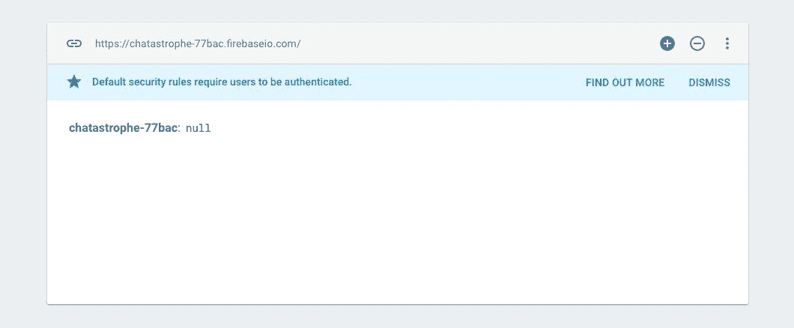

让我们在聊天输入框中输入一条消息，然后按**Enter**。

你应该立即在 Firebase 控制台上看到以下内容：

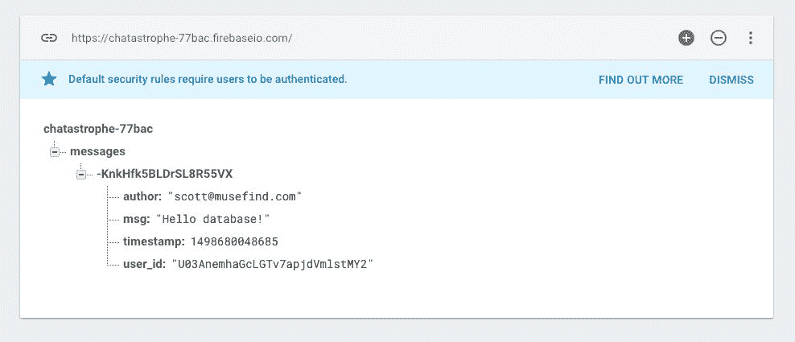

太棒了！我们发送了我们的第一条聊天消息，但是在我们的应用中没有显示任何内容。让我们来解决这个问题。

# 从 Firebase 加载数据

正如我们之前所描述的，我们可以监听数据库中特定引用的更改。换句话说，我们可以定义一个函数，以便在`firebase.database().ref(‘/messages’)`发生更改时运行，就像新消息进来一样。

在我们继续之前，我鼓励你考虑两件事情：我们应该在哪里定义这个监听器，以及这个函数应该做什么。

看看你能否想出一个可能的实现！在你构思了一个想法之后，让我们来实现它。

事实上：我们的应用程序中已经有一个非常相似的情况。我们的`App#componentDidMount`中的`firebase.auth().onAuthStateChanged`监听当前用户的更改，并更新我们`App`的`state.user`。

我们将用我们的消息引用做同样的事情，尽管语法有点不同：

```jsx
class App extends Component {
  state = { user: null, messages: [] }

  componentDidMount() {
    firebase.auth().onAuthStateChanged((user) => {
      if (user) {
        this.setState({ user });
      } else {
       this.props.history.push('/login')
      }
    });
    firebase
 .database()
 .ref('/messages')
 .on('value', snapshot => {
 console.log(snapshot);
 });
  }
```

我们使用`.on`函数来监听数据库中的`'value'`事件。然后我们的回调被称为一个叫做`snapshot`的参数。让我们把这个插入进去，然后发送另一条消息，看看我们的快照是什么样子的：

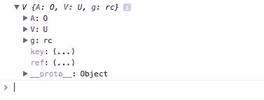

啊，这不太友好开发者。

快照是数据库结构`/messages`的一个图像。我们可以通过调用`val()`来访问一个更可读的形式：

```jsx
firebase.database().ref('/messages').on('value', snapshot => {
  console.log(snapshot.val());
});
```

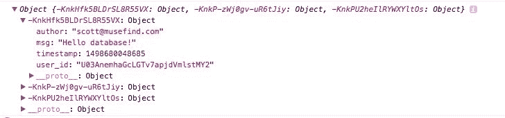

现在，我们可以得到一个包含每条消息的对象，其中消息 ID 是键。

在这里，我们需要做一些技巧。我们想用消息数组更新我们的`state.messages`，但我们想要将消息 ID 添加到消息对象中（因为消息 ID 目前是`snapshot.val()`中的键）。

如果这听起来让人困惑，希望当我们看到它实际运行时会更清楚。我们将创建一个名为`messages`的新数组，并遍历我们的对象（使用一个叫做`Object.keys`的方法），然后将带有 ID 的消息推入新数组中。

让我们将这个提取到一个新的函数中：

```jsx
class App extends Component {
  state = { user: null, messages: [] }

  componentDidMount() {
    firebase.auth().onAuthStateChanged((user) => {
      if (user) {
        this.setState({ user });
      } else {
       this.props.history.push('/login')
      }
    });
    firebase
      .database()
      .ref('/messages')
      .on('value', snapshot => {
        this.onMessage(snapshot);
      });
  }
```

还有新的方法：

```jsx
  onMessage = snapshot => {
    const messages = Object.keys(snapshot.val()).map(key => {
      const msg = snapshot.val()[key];
      msg.id = key;
      return msg;
    });
    console.log(messages);
  };
```

在我们的 `console.log` 中，我们最终得到了一个带有 ID 的消息数组：

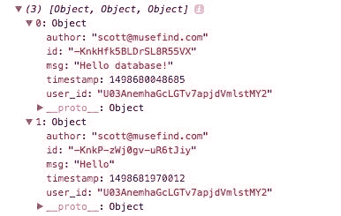

最后一步是将其保存到状态中：

```jsx
onMessage = (snapshot) => {
  const messages = Object.keys(snapshot.val()).map(key => {
    const msg = snapshot.val()[key]
    msg.id = key
    return msg
  });
  this.setState({ messages });
}
```

现在，我们可以将消息传递给 `ChatContainer`，并开始显示它们：

```jsx
<Route
  exact
  path="/"
  render={() => (
    <ChatContainer
      onSubmit={this.handleSubmitMessage}
      messages={this.state.messages}
    />
  )}
/>
```

我们对 `App.js` 进行了许多更改。以下是当前的代码：

```jsx
import React, { Component } from 'react';
import { Route, withRouter } from 'react-router-dom';
import LoginContainer from './LoginContainer';
import ChatContainer from './ChatContainer';
import UserContainer from './UserContainer';
import './app.css';

class App extends Component {
  state = { user: null, messages: [] };

  componentDidMount() {
    firebase.auth().onAuthStateChanged(user => {
      if (user) {
        this.setState({ user });
      } else {
        this.props.history.push('/login');
      }
    });
    firebase
      .database()
      .ref('/messages')
      .on('value', snapshot => {
        this.onMessage(snapshot);
      });
  }

  onMessage = snapshot => {
    const messages = Object.keys(snapshot.val()).map(key => {
      const msg = snapshot.val()[key];
      msg.id = key;
      return msg;
    });
    this.setState({ messages });
  };

  handleSubmitMessage = msg => {
    const data = {
      msg,
      author: this.state.user.email,
      user_id: this.state.user.uid,
      timestamp: Date.now()
    };
    firebase
      .database()
      .ref('messages/')
      .push(data);
  };

  render() {
    return (
      <div id="container">
        <Route path="/login" component={LoginContainer} />
        <Route
          exact
          path="/"
          render={() => (
            <ChatContainer
              onSubmit={this.handleSubmitMessage}
              messages={this.state.messages}
            />
          )}
        />
        <Route path="/users/:id" component={UserContainer} />
      </div>
    );
  }
}

export default withRouter(App);
```

# 显示我们的消息

我们将使用 `Array.map()` 函数来遍历我们的消息数组，并创建一个 `div` 数组来显示数据。

`Array.map()` 自动返回一个数组，这意味着我们可以将该功能嵌入到我们的 JSX 中。这是 React 中的一个常见模式（通常用于显示这样的数据集合），因此值得密切关注。

在我们的 `message-container` 中，我们创建了开头和结尾的花括号：

```jsx
<div id="message-container">
  {

  }
</div>
```

然后，我们在消息数组上调用 `map`，并传入一个函数来创建新的消息 `div`：

```jsx
<div id="message-container">
  {this.props.messages.map(msg => (
    <div key={msg.id} className="message">
      <p>{msg.msg}</p>
    </div>
  ))}
</div>
```

如果一切顺利，你应该看到以下内容，包括你发送的所有消息：

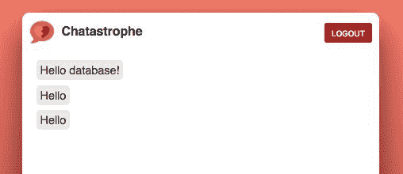

你甚至可以尝试写一条新消息，然后立即看到它出现在消息容器中。神奇！

关于前面的代码，有几点需要注意：

+   `map` 函数遍历消息数组中的每个元素，并根据其数据创建一个 `div`。当迭代完成时，它会返回一个 `div` 数组，然后作为 JSX 的一部分显示出来。

+   React 的一个怪癖是，屏幕上的每个元素都需要一个唯一的标识符，以便 React 可以正确地更新它。当处理一组相同的元素时，这对 React 来说很困难，就像我们在这里创建的一样。因此，我们必须给每个消息 `div` 一个保证是唯一的 key 属性。

有关列表和键的更多信息，请访问 [`facebook.github.io/react/docs/lists-and-keys.html`](https://facebook.github.io/react/docs/lists-and-keys.html)。

让我们增加一些功能，并在消息下方显示作者姓名，并附带到他们的用户页面的链接。我们可以使用 React Router 的 `Link` 组件来实现；它类似于锚标签（`<a>`），但针对 React Router 进行了优化：

```jsx
import { Link } from 'react-router-dom';
```

然后，在下面添加它：

```jsx
<div id="message-container">
  {this.props.messages.map(msg => (
    <div key={msg.id} className="message">
      <p>{msg.msg}</p>
      <p className="author">
 <Link to={`/users/${msg.user_id}`}>{msg.author}</Link>
 </p>
    </div>
  ))}
</div>
```

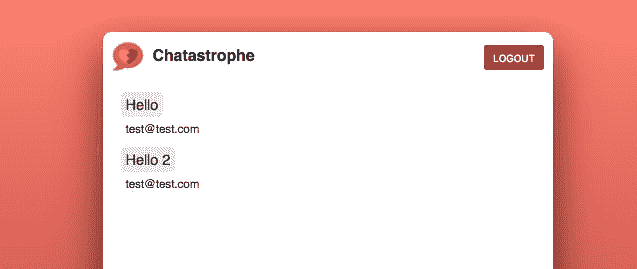 `Link` 上的 `to` 属性使用了 ES6 字符串插值。如果你用反引号包裹你的字符串（`` ` ``）而不是引号，您还可以使用`${VARIABLE}`将变量直接嵌入其中。

现在，我们将使我们的消息看起来更好！

# 消息显示改进

在我们转向用户资料页之前，让我们花点时间对消息显示进行一些快速的UI改进。

# 多个用户

如果你尝试注销并使用新用户登录，所有用户的消息都会显示出来，如下所示：

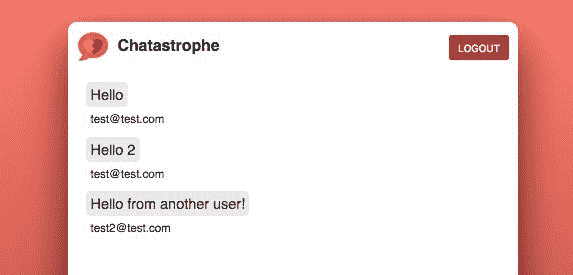

我的消息和其他用户的消息之间没有区分。经典的聊天应用程序模式是将一个用户的消息放在一侧，另一个用户的消息放在另一侧。我们的CSS已经准备好处理这一点——我们只需要为与当前用户匹配的消息分配“mine”类。

由于我们在`msg.author`中可以访问消息作者的电子邮件，我们可以将其与`App`状态中存储的用户进行比较。让我们将它作为道具传递给`ChatContainer`：

```jsx
<Route
  exact
  path="/"
  render={() => (
    <ChatContainer
      onSubmit={this.handleSubmitMessage}
      user={this.state.user}
      messages={this.state.messages}
    />
  )}
/>
```

然后，我们可以在我们的`className`属性中添加一个条件：

```jsx
<div id="message-container">
  {this.props.messages.map(msg => (
    <div
      key={msg.id}
      className={`message ${this.props.user.email === msg.author &&
 'mine'}`}>
      <p>{msg.msg}</p>
      <p className="author">
        <Link to={`/users/${msg.user_id}`}>{msg.author}</Link>
      </p>
    </div>
  ))}
</div>
```

这使用了ES6字符串插值以及短路评估来创建我们想要的效果。这些是花哨的术语，归结为这一点：如果消息作者与`state`中的用户电子邮件匹配，将`className`设置为`message mine`；否则，将其设置为`message`。

它最终应该看起来像这样：

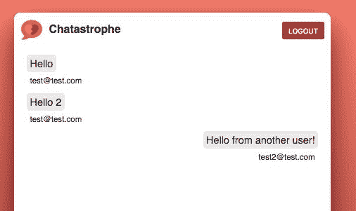

# 批量显示用户消息

在前面的截图中，你会注意到我们甚至在连续两条消息由同一作者发送时也显示了作者电子邮件。让我们变得狡猾，使得我们将同一作者的消息分组在一起。

换句话说，我们只希望在下一个消息不是由同一作者发送时显示作者电子邮件：

```jsx
<div id="message-container">
  {this.props.messages.map(msg => (
    <div
      key={msg.id}
      className={`message ${this.props.user.email === msg.author &&
        'mine'}`}>
      <p>{msg.msg}</p>
 // Only if the next message's author is NOT the same as this message's    author, return the following:      <p className="author">
        <Link to={`/users/${msg.user_id}`}>{msg.author}</Link>
      </p>
    </div>
  ))}
</div>
```

我们如何做到这一点？我们需要一种方法来检查数组中当前消息之后的下一个消息。

幸运的是，`Array.map()`函数将索引作为第二个元素传递给我们的回调函数。我们可以像这样使用它：

```jsx
<div id="message-container">
  {this.props.messages.map((msg, i) => (
    <div
      key={msg.id}
      className={`message ${this.props.user.email === msg.author &&
        'mine'}`}>
      <p>{msg.msg}</p>
      {(!this.props.messages[i + 1] ||
 this.props.messages[i + 1].author !== msg.author) && (
 <p className="author">
 <Link to={`/users/${msg.user_id}`}>{msg.author}</Link>
 </p>
 )}
    </div>
  ))}
</div>
```

现在，我们说的是：“如果有下一个消息，并且下一个消息的作者与当前消息的作者不同，显示这个消息的作者。”

然而，在我们的`render`方法中有大量复杂的逻辑。让我们将其提取到一个方法中：

```jsx
<div id="message-container">
  {this.props.messages.map((msg, i) => (
    <div
      key={msg.id}
      className={`message ${this.props.user.email === msg.author &&
        'mine'}`}>
      <p>{msg.msg}</p>
      {this.getAuthor(msg, this.props.messages[i + 1])}
    </div>
  ))}
</div>
```

还有，方法本身：

```jsx
  getAuthor = (msg, nextMsg) => {
    if (!nextMsg || nextMsg.author !== msg.author) {
      return (
        <p className="author">
          <Link to={`/users/${msg.user_id}`}>{msg.author}</Link>
        </p>
      );
    }
  };
```

我们的消息现在这样分组：

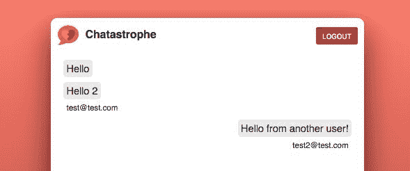

# 向下滚动

尝试缩小你的浏览器，使消息列表几乎被截断；然后，提交另一条消息。请注意，如果消息超出了消息容器的截断位置，你必须滚动才能看到它。这是糟糕的用户体验。让我们改进它，使得当新消息到达时，我们自动滚动到底部。

在本节中，我们将深入探讨两个强大的React概念：`componentDidUpdate`方法和refs。

让我们先讨论我们想要实现的目标。我们希望消息容器始终滚动到底部，以便最新消息始终可见（除非用户决定向上滚动查看旧消息）。这意味着我们需要在两种情况下使消息容器向下滚动：

+   当第一个组件被渲染时

+   当新消息到达时

让我们从第一个用例开始。我们需要一个我们已经使用过的React生命周期方法。我们将在我们的`ChatContainer`中添加一个`componentDidMount`方法，就像我们在`App`中所做的那样。

让我们来定义它，以及一个`scrollToBottom`方法：

```jsx
export default class ChatContainer extends Component {
  state = { newMessage: '' };

  componentDidMount() {
    this.scrollToBottom();
  }

  scrollToBottom = () => {

  };
```

我们还希望每当新消息到达并出现在屏幕上时触发`scrollToBottom`方法。React为我们提供了另一种处理这种情况的方法——`componentDidUpdate`。每当您的React组件因新的`props`或状态而更新时，都会调用此方法。最好的部分是该方法将前一个`props`作为第一个参数传递，因此我们可以比较它们并找出差异，如下所示：

```jsx
componentDidUpdate(previousProps) {
  if (previousProps.messages.length !== this.props.messages.length) {
    this.scrollToBottom();
  }
}
```

我们查看前一个`props`中的消息数组长度，并与当前`props`中的消息数组长度进行比较。如果它发生了变化，我们就滚动到底部。

好的，看起来都不错。让我们继续让我们的`scrollToBottom`方法工作起来。

# React refs

React中的refs是一种获取特定DOM元素的方式。对于熟悉jQuery的人来说，refs弥合了React通过props创建元素的方法与jQuery从DOM中获取元素并操作它们的方法之间的差距。

我们可以在任何我们想要稍后使用的JSX元素上添加一个`ref`（我们想要稍后引用的元素）。让我们在我们的消息容器上添加一个。`ref`属性总是一个函数，该函数被调用时带有相关元素，然后用于将该元素分配给组件的属性，如下所示：

```jsx
<div
  id="message-container"
  ref={element => {
    this.messageContainer = element;
  }}>
```

在我们的`scrollToBottom`方法内部，我们使用`ReactDOM.findDOMNode`来获取相关元素（别忘了导入react-dom！）：

```jsx
import ReactDOM from 'react-dom';
```

```jsx

scrollToBottom = () => {
  const messageContainer = ReactDOM.findDOMNode(this.messageContainer);
}
```

在下一节中，我们将使得只有在消息加载时才显示我们的消息容器。为此，我们需要一个`if`语句来检查我们的`messageContainer` DOM节点当前是否存在。一旦完成这一步，我们就可以将`messageContainer.scrollTop`（当前滚动到底部的距离）设置为其高度，以便它位于底部：

```jsx
scrollToBottom = () => {
  const messageContainer = ReactDOM.findDOMNode(this.messageContainer);
  if (messageContainer) {
    messageContainer.scrollTop = messageContainer.scrollHeight;
  }
}
```

现在，如果你尝试缩小浏览器窗口并发送一条消息，你应该总是被带到消息容器的底部，以便它自动进入视图。太棒了！

# 加载指示器

Firebase加载速度相当快，但如果我们的用户连接速度较慢，他们将看到一个空白屏幕，直到他们的消息加载完毕，并会想：“我所有的精彩聊天都去哪儿了？”让我们给他们一个加载指示器。

在我们的`ChatContainer`内部，我们只希望在名为`messagesLoaded`的prop为true时显示消息（我们稍后会定义它）。我们将根据该prop的条件来渲染我们的消息容器。我们可以使用一个**三元**运算符来实现这一点。

JavaScript中的三元运算符是一种简短的if-else写法。我们可以写成`true ? // 这段代码 : // 那段代码`，而不是`if (true) { // 这段代码 } else { // 那段代码 }`，这样既简洁又明了。

代码如下所示：

```jsx
// Beginning of ChatContainer
<Header>
  <button className="red" onClick={this.handleLogout}>
    Logout
  </button>
</Header>
{this.props.messagesLoaded ? (
  <div
    id="message-container"
    ref={element => {
      this.messageContainer = element;
    }}>
    {this.props.messages.map((msg, i) => (
      <div
        key={msg.id}
        className={`message ${this.props.user.email === msg.author &&
          'mine'}`}>
        <p>{msg.msg}</p>
        {this.getAuthor(msg, this.props.messages[i + 1])}
      </div>
    ))}
  </div>
) : (
 <div id="loading-container">
 
 </div>
)}
<div id="chat-input">
// Rest of ChatContainer
```

花点时间仔细阅读这个，确保你完全理解正在发生的事情。条件语句在React中很常见，因为它们使得条件渲染JSX变得容易。如果一切正确，你应该看到以下内容，带有到标志的脉冲动画：

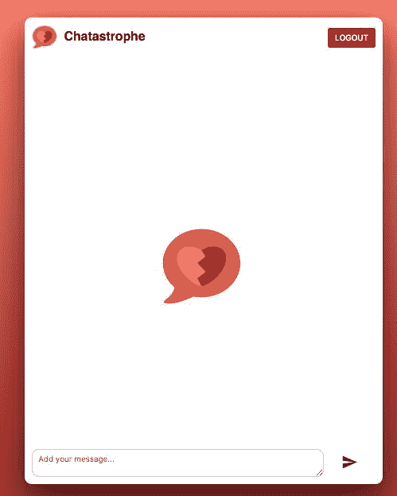

下一步是在消息加载时更新`messagesLoaded`属性。让我们跳到`App.js`。

这里的逻辑很简单——当我们从Firebase数据库接收到一个消息值时，如果我们之前没有收到过值（换句话说，这是我们收到的第一条消息），我们就知道我们的消息已经首次加载：

```jsx
class App extends Component {
  state = { user: null, messages: [], messagesLoaded: false };
```

```jsx
componentDidMount() {
    firebase.auth().onAuthStateChanged(user => {
      if (user) {
        this.setState({ user });
      } else {
        this.props.history.push('/login');
      }
    });
    firebase
      .database()
      .ref('/messages')
      .on('value', snapshot => {
        this.onMessage(snapshot);
        if (!this.state.messagesLoaded) {
 this.setState({ messagesLoaded: true });
 }
      });
  }
```

```jsx
<Route exact path="/" render={() => (
  <ChatContainer
    messagesLoaded={this.state.messagesLoaded}
    onSubmit={this.handleSubmitMessage}
    messages={this.state.messages}
    user={this.state.user} />
)} />
```

现在，如果你重新加载应用页面，你应该会短暂看到加载指示器（取决于你的互联网连接），然后看到消息显示出来。

这里是到目前为止`ChatContainer`的代码：

```jsx
import React, { Component } from 'react';
import { Link } from 'react-router-dom';
import ReactDOM from 'react-dom';
import Header from './Header';

export default class ChatContainer extends Component {
  state = { newMessage: '' };

  componentDidMount() {
    this.scrollToBottom();
  }

  componentDidUpdate(previousProps) {
    if (previousProps.messages.length !== this.props.messages.length) {
      this.scrollToBottom();
    }
  }

  scrollToBottom = () => {
    const messageContainer = ReactDOM.findDOMNode(this.messageContainer);
    if (messageContainer) {
      messageContainer.scrollTop = messageContainer.scrollHeight;
    }
  };

  handleLogout = () => {
    firebase.auth().signOut();
  };

  handleInputChange = e => {
    this.setState({ newMessage: e.target.value });
  };

  handleSubmit = () => {
    this.props.onSubmit(this.state.newMessage);
    this.setState({ newMessage: '' });
  };

  handleKeyDown = e => {
    if (e.key === 'Enter') {
      e.preventDefault();
      this.handleSubmit();
    }
  };

  getAuthor = (msg, nextMsg) => {
    if (!nextMsg || nextMsg.author !== msg.author) {
      return (
        <p className="author">
          <Link to={`/users/${msg.user_id}`}>{msg.author}</Link>
        </p>
      );
    }
  };

  render() {
    return (
      <div id="ChatContainer" className="inner-container">
        <Header>
          <button className="red" onClick={this.handleLogout}>
            Logout
          </button>
        </Header>
        {this.props.messagesLoaded ? (
          <div
            id="message-container"
            ref={element => {
              this.messageContainer = element;
            }}>
            {this.props.messages.map((msg, i) => (
              <div
                key={msg.id}
                className={`message ${this.props.user.email ===       
                                                    msg.author &&
                  'mine'}`}>
                <p>{msg.msg}</p>
                {this.getAuthor(msg, this.props.messages[i + 1])}
              </div>
            ))}
          </div>
        ) : (
          <div id="loading-container">
            
          </div>
        )}
        <div id="chat-input">
          <textarea
            placeholder="Add your message..."
            onChange={this.handleInputChange}
            onKeyDown={this.handleKeyDown}
            value={this.state.newMessage}
          />
          <button onClick={this.handleSubmit}>
            <svg viewBox="0 0 24 24">
              <path fill="#424242"  
                d="M2,21L23,12L2,3V10L17,12L2,14V21Z" />
            </svg>
          </button>
        </div>
      </div>
    );
  }
}
```

我们的应用已经接近完成。最后一步是用户资料页面。

# 个人资料页面

对于`UserContainer`的代码将与`ChatContainer`相同，有两个主要区别：

+   我们只想显示与我们从URL参数中获取的ID匹配的消息数组中的消息

+   我们想在页面顶部显示作者的电子邮件，在任何其他消息之前

首先，在`App.js`中，将`UserContainer`路由转换为使用`render`属性，与`ChatContainer`相同，并传递以下属性：

```jsx
<Route
  path="/users/:id"
  render={({ history, match }) => (
    <UserContainer
      messages={this.state.messages}
      messagesLoaded={this.state.messagesLoaded}
      userID={match.params.id}
    />
  )}
/>
```

请注意，React Router自动在我们的`render`方法中提供了历史和匹配`props`，我们在这里使用它们来从URL参数中获取用户ID。

然后，在`UserContainer`中，让我们设置我们的加载指示器。同时，确保你给`UserContainer`一个`className`的`inner-container`用于CSS目的：

```jsx
<div id="UserContainer" className="inner-container">
  <Header>
    <Link to="/">
      <button className="red">Back To Chat</button>
    </Link>
  </Header>
  {this.props.messagesLoaded ? (
 <h1>Messages go here</h1>
 ) : (
 <div id="loading-container">
 
 &lt;/div>
 )}
</div>
```

对于显示我们的消息，我们只想显示那些`msg.user_id`等于我们的`props.userID`的消息。我们可以不用`Array.map()`的回调，只需添加一个`if`语句：

```jsx
{this.props.messagesLoaded ? (
 <div id="message-container">
 {this.props.messages.map(msg => {
 if (msg.user_id === this.props.userID) {
 return (
 <div key={msg.id} className="message">
 <p>{msg.msg}</p>
 </div>
 );
 }
 })}
 </div>
) : (
  <div id="loading-container">
    
  </div>
)}
```

这应该只显示来自我们正在查看其资料的作者的消息。然而，我们现在需要在顶部显示作者的电子邮件。

挑战在于，我们不会知道用户电子邮件，直到我们已经加载了消息，并且在迭代第一个匹配ID的消息，所以我们不能像之前那样使用`map()`的索引，也不能使用属性。

相反，我们将添加一个`class`属性来跟踪我们是否已经显示了用户电子邮件。

在`UserContainer`顶部声明它：

```jsx
export default class UserContainer extends Component {
  renderedUserEmail = false;

  render() {
    return (
```

然后，我们将在代码中调用一个`getAuthor`方法：

```jsx
<div id="message-container">
  {this.props.messages.map(msg => {
    if (msg.user_id === this.props.userID) {
      return (
        <div key={msg.id} className="message">
          {this.getAuthor(msg.author)}
          <p>{msg.msg}</p>
        </div>
      );
    }
  })}
</div>
```

这个检查是为了看看我们是否已经渲染了作者，如果没有，就返回它：

```jsx
  getAuthor = author => {
    if (!this.renderedUserEmail) {
      this.renderedUserEmail = true;
      return <p className="author">{author}</p>;
    }
  };
```

有点绕路——对于我们的生产应用程序，我们可能想要添加更复杂的逻辑来只加载那个作者的消息。然而，这对于我们的原型来说已经足够了。

这里是`UserContainer`的完整代码：

```jsx
import React, { Component } from 'react';
import { Link } from 'react-router-dom';
import Header from './Header';

export default class UserContainer extends Component {
  renderedUserEmail = false;

  getAuthor = author => {
    if (!this.renderedUserEmail) {
      this.renderedUserEmail = true;
      return <p className="author">{author}</p>;
    }
  };

  render() {
    return (
      <div id="UserContainer" className="inner-container">
        <Header>
          <Link to="/">
            <button className="red">Back To Chat</button>
          </Link>
        </Header>
        {this.props.messagesLoaded ? (
          <div id="message-container">
            {this.props.messages.map(msg => {
              if (msg.user_id === this.props.userID) {
                return (
                  <div key={msg.id} className="message">
                    {this.getAuthor(msg.author)}
                    <p>{msg.msg}</p>
                  </div>
                );
              }
            })}
          </div>
        ) : (
          <div id="loading-container">
            
          </div>
        )}
      </div>
    );
  }
}
```

# 总结

就是这样！我们已经建立了完整的 React 应用程序。你的朋友对最终产品感到非常高兴，但我们还远未完成。

我们已经建立了一个网络应用程序。它看起来很不错，但它还不是一个渐进式网络应用程序。还有很多工作要做，但这就是乐趣开始的地方。

我们的下一步是开始将这个应用程序转换成 PWA。我们将从研究如何使我们的网络应用程序更像本地应用程序开始，并深入研究近年来最激动人心的网络技术之一--service workers。
