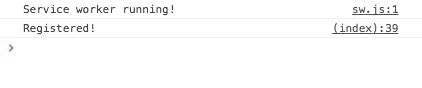
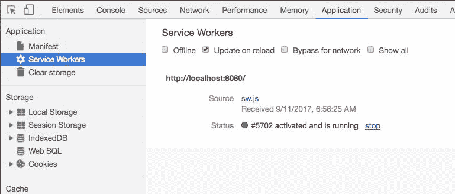
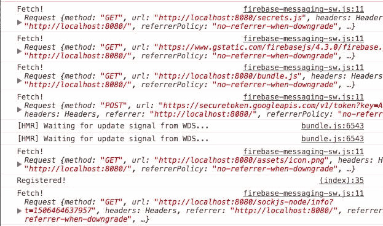

# 第七章：添加服务工作者

欢迎来到我们迈向渐进式 Web 应用程序世界的第一步。本章将致力于创建我们的第一个服务工作者，这将解锁使 PWA 如此特别的许多功能。

我们之前已经谈到过 PWA 是如何连接 Web 应用和原生应用的。它们通过服务工作者来实现这一点。服务工作者使推送通知和离线访问等功能成为可能。它们是一种令人兴奋的新技术，有许多应用（每年都有越来越多的新应用出现）；如果有一种技术能在未来五年内改变 Web 开发，那就是服务工作者。

然而，足够的炒作；让我们深入了解服务工作者到底是什么。

在本章中，我们将涵盖以下主题：

+   什么是服务工作者？

+   服务工作者的生命周期

+   如何在我们的页面上注册服务工作者

# 什么是服务工作者？

**服务工作者**是一小段 JavaScript 代码，位于我们的应用和网络之间。

你可以把它想象成在我们的应用程序之外运行的脚本，但我们可以在我们的代码范围内与其通信。它是我们应用的一部分，但与其余部分分开。

最简单的例子是在缓存文件的上下文中（我们将在接下来的章节中探讨）。比如说，当用户导航到[`chatastrophe.com`](https://chatastrophe.com)时，我们的应用会获取我们的`icon.png`文件。

服务工作者，如果我们配置好了，将会位于我们的应用和网络之间。当我们的应用请求图标文件时，服务工作者会拦截该请求并检查本地缓存中是否有该文件。如果找到了，就返回该文件；不会进行网络请求。只有在缓存中找不到文件时，才会让网络请求通过；下载完成后，它会将文件放入缓存中。

你可以看到“工作者”这个术语是从哪里来的--我们的服务工作者就像一只忙碌的小蜜蜂。

让我们再看一个例子；推送通知（第九章的预览，*使用清单使我们的应用可安装*）。大多数推送通知都是这样工作的--当发生某个事件（用户发送新的聊天消息）时，消息服务会被通知（在我们的情况下，消息服务由 Firebase 管理）。消息服务会向相关注册用户发送通知（这些用户通过他们的设备进行注册），然后他们的设备创建通知（叮咚！）。

在 Web 应用程序的情况下，这种流程的问题在于，当用户不在页面上时，我们的应用程序会停止运行，因此除非他们的应用程序已经打开，否则我们将无法通知他们，这完全违背了推送通知的初衷。

Service workers 通过始终处于“开启”状态并监听消息来解决了这个问题。现在，消息服务可以提醒我们的 service worker，后者向用户显示消息。我们的应用程序代码实际上并没有参与其中，因此它是否运行并不重要。

这是令人兴奋的事情，但是对于任何新技术来说，都存在一些问题，需要注意一些事情。

# service worker 的生命周期

当用户首次访问您的页面时，service worker 的生命周期就开始了。service worker 被下载并开始运行。当不需要时，它可能会空闲一段时间，但在需要时可以重新启动。

这种**始终开启**的功能是使 service workers 对推送通知有用的原因。它也使 service workers 有点不直观（稍后会详细介绍）。然而，让我们深入了解典型页面上 service worker 的生死。

首先，如果可能的话，service worker 会被安装。所有 service worker 的安装都将从检查用户浏览器是否支持该技术开始。截至目前，Firefox、Chrome 和 Opera 都提供了全面支持，其他浏览器则没有。例如，苹果认为 service workers 是**实验性技术**，这表明他们对整个事情仍然持观望态度。

如果用户的浏览器足够现代化，安装就会开始。脚本（例如`sw.js`）将在特定范围内安装（或者说注册）。在这种情况下，“范围”指的是它所关注的网站路径。例如，全局范围将采用`'/'`，即网站上的所有路径，但您也可以将 service worker 限制为`'/users'`，例如，仅缓存应用程序的某些部分。我们将在缓存章节中更多地讨论范围。

注册后，service worker 被激活。激活事件也会在需要 service worker 时发生，例如，当推送通知到来时。service worker 的激活和停用意味着您不能在 service worker 中保持状态；它只是对事件的反应而运行的一小段代码，而不是一个完整的应用程序。这是一个重要的区别需要记住，以免我们对我们的工作人员要求过多。

服务工作者将处于空闲状态，直到发生事件。目前，服务工作者对两个事件做出反应：`fetch`事件（也称为应用程序的网络请求）和`message`（也称为应用程序代码或消息服务的交互）。我们可以在服务工作者中为这些事件注册监听器，然后根据需要做出反应。

服务工作者代码将在两种情况下更新：已经过去了 24 小时（在这种情况下，它会停止并重新下载一个方法，以防止损坏的代码引起太多烦恼），或者用户访问页面并且`sw.js`文件已更改。每当用户访问应用程序时，服务工作者将其当前代码与站点提供的`sw.js`进行比较，如果有一丁点的差异，就会下载并注册新的`sw.js`。

这是服务工作者的基本技术概述以及它们的工作原理。这可能看起来很复杂，但好消息是使用服务工作者相对直接；您可以在几分钟内启动一个简单的服务工作者，这正是我们接下来要做的！

# 注册我们的第一个服务工作者

记住服务工作者的区别--它们是我们网站的一部分，但在我们的应用程序代码之外运行。考虑到这一点，我们的服务工作者将位于`public/文件夹`中，而不是`src/文件夹`中。

然后，在`public/文件夹`中创建一个名为`sw.js`的文件。现在我们将保持简单；只需在其中添加一个`console.log`：

```jsx
console.log("Service worker running!");
```

真正的工作（注册服务工作者）将在我们的`index.html`中完成。对于这个过程，我们想要做以下事情：

1.  检查浏览器是否支持服务工作者。

1.  等待页面加载。

1.  注册服务工作者。

1.  登出结果。

让我们一步一步地进行。首先，在我们的 Firebase 初始化下面，在`public/index.html`中创建一个空的`script`标签：

```jsx
<body>
  <div id="root"></div>
  <script src="/secrets.js"></script>
  <script src="https://www.gstatic.com/firebasejs/4.1.2/firebase.js"></script>
  <script>
    // Initialize Firebase
    var config = {
      apiKey: window.apiKey,
      authDomain: "chatastrophe-77bac.firebaseapp.com",
      databaseURL: "https://chatastrophe-77bac.firebaseio.com",
      projectId: "chatastrophe-77bac",
      storageBucket: "chatastrophe-77bac.appspot.com",
      messagingSenderId: "85734589405"
    }; 
    window.firebase = firebase;
    firebase.initializeApp(config);
  </script>
  <script>
 // Service worker code here.
 </script>
```

# 检查浏览器支持情况

检查用户的浏览器是否支持服务工作者非常容易。在我们的脚本标签中，我们将添加一个简单的`if`语句：

```jsx
<script>
  if ('serviceWorker' in navigator) {
    // register
  } else {
    console.log('service worker is not supported');
  }
</script>
```

在这里，我们检查`window.navigator`对象是否支持任何服务工作者。导航器还可以使用（通过其`userAgent`属性）来检查用户使用的浏览器，尽管我们在这里不需要。

# 监听页面加载

在页面加载完成之前，我们不想注册我们的 service worker；这没有意义，而且可能会导致复杂性，因此我们将为窗口添加一个`'load'`事件的事件侦听器：

```jsx
<script>
  if ('serviceWorker' in navigator) {
    window.addEventListener('load', function() {

    });
  } else {
    console.log('service worker is not supported');
  }
</script>
```

# 注册 service worker

正如我们之前指出的，`window.navigator`有一个`serviceWorker`属性，其存在确认了浏览器对 service worker 的支持。我们还可以使用同一个对象通过其`register`函数来注册我们的 service worker。我知道，这是令人震惊的事情。

我们调用`navigator.serviceWorker.register`，并传入我们的 service worker 文件的路径：

```jsx
<script>
  if ('serviceWorker' in navigator) {
    window.addEventListener('load', function() {
      navigator.serviceWorker.register('sw.js')
    });
  } else {
    console.log('service worker is not supported');
  }
</script>
```

# 记录结果

最后，让我们添加一些`console.logs`，这样我们就知道注册的结果。幸运的是，`navigator.serviceWorker.register`返回一个 promise：

```jsx
<script>
  if ('serviceWorker' in navigator) {
    window.addEventListener('load', function() {
      navigator.serviceWorker.register('sw.js').then(function(registration) {
        // Registration was successful
        console.log('Registered!');
      }, function(err) {
        // registration failed :(
        console.log('ServiceWorker registration failed: ', err);
      }).catch(function(err) {
        console.log(err);
      });
    });
  } else {
    console.log('service worker is not supported');
  }
</script>
```

好的，让我们测试一下！重新加载页面，如果一切正常，您应该在控制台中看到以下内容：



您还可以通过导航到 DevTools 中的应用程序选项卡，然后转到服务工作者选项卡来检查它：



我建议您此时检查重新加载按钮。这样可以确保每次刷新页面时都刷新您的 service worker（记住我们之前讨论的正常 service worker 生命周期）。为什么要采取这种预防措施？我们正在步入缓存代码的世界，浏览器可能会认为您的 service worker 没有改变，而实际上已经改变了。这个复选框只是确保您始终处理最新版本的`sw.js`。

好的，我们已经注册了一个 worker！太棒了。让我们花点时间从我们的`sw.js`中了解 service worker 的生命周期。

# 体验 service worker 生命周期

service worker 体验的第一个事件是`'install'`事件。这是用户第一次启动 PWA 时发生的。标准用户只会经历一次。

要利用这个事件，我们只需要在 service worker 本身添加一个事件侦听器。要在`sw.js`中执行这个操作，我们使用`self`关键字：

```jsx
self.addEventListener('install', function() {
 console.log('Install!');
});
```

当您重新加载页面时，您应该在控制台中看到`'Install!'`出现。事实上，除非您在应用程序|服务工作者下取消选中重新加载选项，否则每次重新加载页面时都应该看到它。然后，您只会在第一次看到它。

接下来是`activate`事件。此事件在服务工作者首次注册时触发，注册完成之前。换句话说，它应该在相同的情况下发生，只是稍后：

```jsx
self.addEventListener('activate', function() {
  console.log('Activate!');
});
```

我们要覆盖的最后一个事件是`'fetch'`事件。每当应用程序发出网络请求时，都会调用此事件。它与一个具有请求 URL 的事件对象一起调用，我们可以将其记录出来：

```jsx
self.addEventListener('fetch', function(event) {
  console.log('Fetch!', event.request);
});
```

添加后，我们应该看到一个非常混乱的控制台：



您现在可以删除服务工作者中的所有`console.logs`，但是我们将在将来使用这些事件监听器中的每一个。

接下来，我们将研究如何连接到 Firebase 消息服务，为推送通知奠定基础。

# 将 Firebase 添加到我们的服务工作者

本章的其余部分目标是将 Firebase 集成到我们的服务工作者中，以便它准备好接收推送通知并显示它们。

这是一个大项目。在下一章结束之前，我们将无法实际显示推送通知。然而，在这里，我们将看到如何将第三方服务集成到服务工作者中，并深入了解服务工作者背后的理论。

# 命名我们的服务工作者

我们将用于向用户设备发送推送通知的服务称为**Firebase Cloud Messaging**，或**FCM**。FCM 通过寻找服务工作者在网络上运行，然后向其发送消息（包含通知详情）。然后服务工作者显示通知。

默认情况下，FCM 会寻找一个名为`firebase-messaging-sw.js`的服务工作者。您可以使用`firebase.messaging().useServiceWorker`来更改，然后传递一个服务工作者注册对象。然而，为了我们的目的，简单地重命名我们的服务工作者会更直接。让我们这样做；在`public/`中更改文件名，并在`index.html`中更改注册：

```jsx
<script>
  if ('serviceWorker' in navigator) {
    window.addEventListener('load', function() {
      navigator.serviceWorker.register('firebase-messaging-sw.js').then(function(registration) {
        // Registration was successful
        console.log('Registered!');
      }, function(err) {
        // registration failed :(
        console.log('ServiceWorker registration failed: ', err);
      }).catch(function(err) {
        console.log(err);
      });
    });
   } else {
     console.log('service worker is not supported');
   }
</script>
```

完成后，我们可以开始在服务工作者中初始化 Firebase。

让我们再说一遍；服务工作者与您的应用程序代码没有关联。这意味着它无法访问我们当前的 Firebase 初始化。但是，我们可以在服务工作者中重新初始化 Firebase，并且只保留相关的内容--`messagingSenderId`。您可以从 Firebase 控制台或您的`secrets.js`文件中获取您的`messagingSenderId`。

如果您担心安全性，请确保将`public/firebase-messaging-sw.js`添加到您的`.gitignore`中，尽管保持您的`messagingSenderId`私有性并不像保持 API 密钥秘密那样重要。

```jsx
// firebase-messaging-sw.js
firebase.initializeApp({
  'messagingSenderId': '85734589405'
});
```

我们还需要在文件顶部导入我们需要的 Firebase 部分，包括`app`库和`messaging`库：

```jsx
importScripts('https://www.gstatic.com/firebasejs/3.9.0/firebase-app.js');
importScripts('https://www.gstatic.com/firebasejs/3.9.0/firebase-messaging.js');
```

完成后，我们应该能够`console.log`出`firebase.messaging();`：

```jsx
importScripts('https://www.gstatic.com/firebasejs/3.9.0/firebase-app.js');
importScripts('https://www.gstatic.com/firebasejs/3.9.0/firebase-messaging.js');
firebase.initializeApp({
  'messagingSenderId': '85734589405'
});console.log(firebase.messaging());
```

您应该看到以下内容：

*！[](../images/00054.jpeg)*

这意味着我们的 Firebase 已经在我们的服务工作者中运行起来了！

如果您仍然看到来自我们旧的`sw.js`的日志，请转到 DevTools 的**应用程序|服务工作者**选项卡，并**取消注册**它。这是服务工作者即使未重新注册也会持续存在的一个很好的例子。

正如前面所解释的，服务工作者是一段始终运行的代码（虽然不完全准确--想想这些工作者的生命周期--这是一个很好的思考方式）。这意味着它将始终等待 FCM 告诉它有消息进来。

但是，现在我们没有收到任何消息。下一步是开始配置何时发送推送通知，以及如何显示它们！

# 摘要

在本章中，我们学习了服务工作者的基础知识，并使其运行起来。我们的下一步是开始使用它。具体来说，我们希望使用它来监听通知，然后将它们显示给用户。通过设置推送通知，让我们再迈出一大步，使我们的 PWA 感觉像一个原生应用程序。
