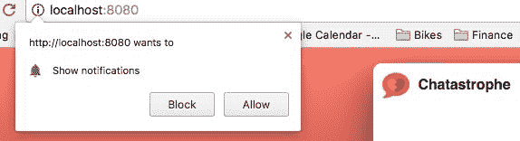
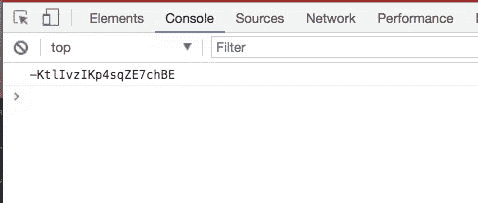
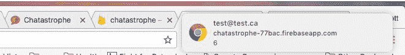

# 第八章：使用服务工作者发送推送通知

在本章中，我们将完成我们应用程序发送推送通知的过程。这个实现有点复杂；它需要许多移动的部分来使事情正常运行（根据我的经验，这对于任何移动或网络上的推送通知实现都是真实的）。令人兴奋的部分是我们可以与许多新的知识领域互动，比如**设备令牌**和**云函数**。

在我们开始之前，让我们花一分钟概述设置推送通知的过程。目前，我们的消息服务工作者已经启动并运行。这个服务工作者将坐在那里等待被调用以显示新通知。一旦发生这种情况，它将处理所有与显示通知有关的事情，所以我们不必担心（至少目前是这样）。

由我们负责的是将消息发送给服务工作者。假设我们的应用程序有 1,000 个用户，每个用户都有一个唯一的设备。每个设备都有一个唯一的令牌，用于将其标识给 Firebase。我们需要跟踪所有这些令牌，因为当我们想要发送通知时，我们需要告诉 Firebase 要发送到哪些设备。

所以，这是第一步 - 设置和维护一个包含我们应用程序使用的所有设备令牌的数据库表。正如我们将看到的，这也必然涉及询问用户是否首先想要通知。

一旦我们保存了我们的令牌，我们就可以告诉 Firebase 监听数据库中的新消息，然后向所有设备（基于令牌）发送消息详细信息的通知。作为一个小的额外复杂性，我们必须确保不向创建消息的用户发送通知。

这个阶段（告诉 Firebase 发送通知）实际上是在我们的应用程序之外进行的。它发生在神秘的“云”中，我们将在那里托管一个函数来处理这个过程；稍后会详细介绍。

我们对这个相当复杂的工程方法将是慢慢来，一次一个部分。确保你仔细跟随代码示例；通知的性质意味着在实现完全之前我们将无法完全测试我们的实现，所以尽力避免途中的小错误。

在本章中，我们将涵盖以下主题：

+   请求显示通知的权限

+   跟踪和保存用户令牌

+   使用云函数发送通知

好了，让我们开始吧！

# 请求权限

正如前面的介绍所解释的，我们在这一章中有很多功能要创建。为了将所有内容放在一个地方，而不会使我们的`App.js`混乱，我们将创建一个单独的 JavaScript 类来管理与通知有关的一切。这是我在 React 中非常喜欢的一种模式，可以提取与任何一个组件无关的功能。在我们的`src/`文件夹中，紧挨着我们的`components`文件夹，让我们创建一个名为`resources`的文件夹，在其中创建一个名为`NotificationResource.js`的文件。

我们的类的基本轮廓如下：

```jsx
export default class NotificationResource {

}
```

我们创建一个 JavaScript 类并导出它。

对于那些不熟悉 JavaScript 类的人（特别是那些熟悉其他语言中的类的人），我鼓励你阅读 MDN 的文章，解释了基础知识，网址为[`developer.mozilla.org/en-US/docs/Web/JavaScript/Reference/Classes`](https://developer.mozilla.org/en-US/docs/Web/JavaScript/Reference/Classes)。

在我们忘记之前，让我们在`App.js`中导入它：

```jsx
import NotificationResource from '../resources/NotificationResource';
```

当我们的应用启动时，我们希望请求用户权限发送通知给他们。请注意，Firebase 会记住用户是否已经接受或拒绝了我们的请求，因此我们不会每次都用弹出窗口打扰他们，只有在他们之前没有被问过的情况下才会这样做。

以下是我们将如何处理这个过程：

1.  当我们的应用挂载时，我们将创建一个`NotificationResource`类的新实例，将 Firebase 消息库传递给它（我们将这个传递进去是为了避免我们不得不在`NotificationResource.js`文件中导入它，因为我们已经在`App.js`中有了对它的访问）。

1.  当`NotificationResource`类首次实例化时，我们将立即使用传递进来的 Firebase 消息库请求用户权限。

如果这些步骤对你来说很清楚，我鼓励你首先尝试自己实现它们。如果你完全困惑于我们将如何做到这一点，不要担心，我们会一一讲解。

好的，让我们从我们的 App 的`componentDidMount`开始。这是我们想要创建`NotificationResource`实例的地方：

```jsx
componentDidMount() {
   this.notifications = new NotificationResource();
```

我们将`NotificationResource`实例设置为`App`的属性；这将允许我们在`App.js`中的其他地方访问它。

正如我们之前所说，我们还希望传入 Firebase 消息库：

```jsx
componentDidMount() {
   this.notifications = new NotificationResource(firebase.messaging());
```

每个 JavaScript 类都自动具有一个`constructor`方法，当创建一个实例时会调用该方法。这就是当我们说`new NotificationResource()`时会调用的方法。我们放在括号里的任何内容都作为参数传递给构造函数。

让我们跳回到`NotificationResource.js`并设置它：

```jsx
export default class NotificationResource {
  constructor(messaging) {
    console.log(“Instantiated!”);
  }
}
```

如果您启动您的应用程序，您应该在`App`挂载时立即在控制台中看到`"Instantiated!"`。

下一步是使用我们的`messaging`库来请求用户的权限发送通知：

```jsx
export default class NotificationResource {
     constructor(messaging) {
       this.messaging = messaging;
 try {
 this.messaging
 .requestPermission()
 .then(res => {
 console.log('Permission granted');
 })
 .catch(err => {
 console.log('no access', err);
 });
 } catch(err) {
 console.log('No notification support.', err);
 }
} } 
```

我们用`messaging`库在`App`中做了与`NotificationResource`相同的事情，也就是将其保存为资源的属性，以便我们可以在其他地方使用它。然后，我们进入`requestPermission`函数。

如果我们回到我们的应用程序，我们会看到这个：



单击允许，您应该在控制台中看到权限已被授予。

如果您之前使用`localhost:8080`构建了个人项目并允许通知，您将不会看到此弹出窗口。您可以通过单击前面截图中 URL 左侧的图标，并将通知重置为询问，来忘记您之前的偏好设置。

现在我们有了开始跟踪所有用户设备的权限，我们将开始跟踪他们的所有设备令牌。

# 跟踪令牌

**令牌**是用户设备的唯一标识符。它帮助 Firebase 找出应该发送推送通知的位置。为了正确发送我们的通知，我们需要在我们的数据库中保留所有当前设备令牌的记录，并确保它是最新的。

我们可以通过 Firebase 的`messaging`库访问用户设备的令牌。特别有用的是两种方法：`onTokenRefresh`和`getToken`。两者的名称都相当不言自明，所以我们将直接进入实现：

```jsx
 export default class NotificationResource {
     constructor(messaging) {
       this.messaging = messaging;
      try {
        this.messaging
          .requestPermission()
          .then(res => {
            console.log('Permission granted');
          })
         .catch(err => {
          console.log('no access', err);
          });
      } catch(err) {
        console.log('No notification support.', err);
      }
};
   this.messaging.getToken().then(res => {
 console.log(res);
 });
 }

```

当您的应用程序刷新时，您会看到一长串数字和字母。这是您设备的身份。我们需要将其保存到数据库中。

每当令牌更改时，`firebase.messaging().onTokenRefresh`会被调用。令牌可以被我们的应用程序删除，或者当用户清除浏览器数据时，此时会生成一个新的令牌。当这种情况发生时，我们需要覆盖数据库中的旧令牌。关键部分是覆盖；如果我们不删除旧令牌，我们最终会浪费 Firebase 的时间，发送到不存在的设备。

因此，我们有四个步骤要涵盖：

1.  当令牌更改时，获取新令牌。

1.  在数据库中查找现有令牌。

1.  如果存在旧令牌，则替换它。

1.  否则，将新令牌添加到数据库中。

在完成此清单之前，我们将不得不完成一堆中间任务，但让我们先用这个粗略的计划开始。

我们将向我们的`NotificationResource`添加四个函数：`setupTokenRefresh`，`saveTokenToServer`，`findExistingToken`和`registerToken`。您可以看到最后两个函数与我们清单中的最后两个步骤相符。

让我们从`setupTokenRefresh`开始。我们将从构造函数中调用它，因为它将负责注册令牌更改的监听器：

```jsx
   export default class NotificationResource {
     constructor(messaging) {
       this.messaging = messaging;
      try {
        this.messaging
          .requestPermission()
          .then(res => {
            console.log('Permission granted');
          })
         .catch(err => {
          console.log('no access', err);
          });
      } catch(err) {
        console.log('No notification support.', err);
      }
  } 
} 
```

这种模式应该在我们配置了 Firebase 的所有“on”监听器后是熟悉的。

接下来，我们将创建`saveTokenToServer`，并从`setupTokenRefresh`中调用它：

```jsx
 setupTokenRefresh() {
   this.messaging.onTokenRefresh(() => {
     this.saveTokenToServer();
   });
 }

 saveTokenToServer() {
   // Get token
   // Look for existing token
   // If it exists, replace
   // Otherwise, create a new one
 }
```

好的，现在我们可以逐条浏览这些注释了。我们已经知道如何获取令牌：

```jsx
saveTokenToServer() {
   this.messaging.getToken().then(res => {
     // Look for existing token
     // If it exists, replace
     // Otherwise, create a new one
   });
 }
```

接下来，查找现有令牌；我们目前无法访问保存在我们的数据库中的先前令牌（好吧，目前还没有，但以后会有）。

因此，我们需要在数据库中创建一个表来保存我们的令牌。我们将其称为`fcmTokens`以方便。它目前还不存在，但一旦我们向其发送一些数据，它就会存在。这就是 Firebase 数据的美妙之处--您可以向一个不存在的表发送数据，它将被创建并填充。

就像我们在`App.js`中对消息所做的那样，让我们在`NotificationResource`的构造函数中为`/fcmTokens`表添加一个值的监听器：

```jsx
export default class NotificationResource {
  allTokens = [];
 tokensLoaded = false;

  constructor(messaging, database) {
    this.database = database;
    this.messaging = messaging;
         try {
        this.messaging
          .requestPermission()
          .then(res => {
            console.log('Permission granted');
          })
         .catch(err => {
          console.log('no access', err);
          });
      } catch(err) {
        console.log('No notification support.', err);
      }};
    this.setupTokenRefresh();
    this.database.ref('/fcmTokens').on('value', snapshot => {
 this.allTokens = snapshot.val();
 this.tokensLoaded = true;
 });
  }
```

您会注意到我们现在期望将数据库实例传递到构造函数中。让我们回到`App.js`来设置它：

```jsx
componentDidMount() {
   this.notifications = new NotificationResource(
      firebase.messaging(),
      firebase.database()
    );
```

好的，这很完美。

如果您在数据库监听器中`console.log`出`snapshot.val()`，它将为 null，因为我们的`/fcmTokens`表中没有值。让我们开始注册一个：

```jsx
saveTokenToServer() {
   this.messaging.getToken().then(res => {
     if (this.tokensLoaded) {
       const existingToken = this.findExistingToken(res);
       if (existingToken) {
         // Replace existing toke
       } else {
         // Create a new one
       }
     }
   });
 }
```

如果令牌已加载，我们可以检查是否存在现有令牌。如果令牌尚未加载，则不执行任何操作。这可能看起来有点奇怪，但我们希望确保不创建重复的值。

我们如何找到现有的令牌？嗯，在我们的构造函数中，我们将从数据库中加载令牌值的结果保存到`this.allTokens`中。我们只需循环遍历它们，看看它们是否与从`getToken`生成的`res`变量匹配即可：

```jsx
findExistingToken(tokenToSave) {
   for (let tokenKey in this.allTokens) {
     const token = this.allTokens[tokenKey].token;
     if (token === tokenToSave) {
       return tokenKey;
     }
   }
   return false;
 }
```

这个方法的重要部分是`tokenToSave`将是一个字符串（之前看到的随机数字和字母的组合），而`this.allTokens`将是从数据库加载的令牌对象的集合，因此是`this.allTokens[tokenObject].token`的业务。

`findExistingToken`将返回与之匹配的令牌对象的键，或 false。从那里，我们可以更新现有的令牌对象，或者创建一个新的。当我们尝试更新令牌时，我们将看到为什么返回键（而不是对象本身）很重要。

# 将用户附加到令牌

在继续涵盖这两种情况之前，让我们退一步，思考一下我们的推送通知将如何工作，因为我们需要解决一个重要的警告。

当用户发送消息时，我们希望通知每个用户，除了创建消息的用户（那将是令人恼火的），因此我们需要一种方法来向数据库中的每个令牌发送通知，除了属于发送消息的用户的令牌。

我们将如何能够防止这种情况发生？我们如何将用户的消息与用户的令牌匹配起来？

好吧，我们可以在消息对象中访问用户 ID（也就是说，我们总是保存 ID 和消息内容）。如果我们对令牌做类似的操作，并保存用户 ID，这样我们就可以确定哪个用户属于哪个设备了。

这似乎是一个非常简单的解决方案，但这意味着我们需要在`NotificationResource`中访问当前用户的 ID。让我们立即做到这一点，然后回到编写和更新令牌。

# 在 NotificationResource 中更改用户

我们已经有一个处理用户更改的方法在`App.js`中——我们的老朋友`onAuthStateChanged`。让我们连接到那里，并使用它来调用`NotificationResource`中的一个方法：

```jsx
componentDidMount() {
   this.notifications = new NotificationResource(firebase.messaging(), firebase.database());
  firebase.auth().onAuthStateChanged((user) => {
     if (user) {
       this.setState({ user });
       this.listenForMessages();
       this.notifications.changeUser(user);
     } else {
       this.props.history.push('/login')
     }
   });
```

然后，在`NotificationResource`中：

```jsx
changeUser(user) {
   this.user = user;
 }
```

顺便说一下，这有助于解决令牌的另一个问题。如前所述，当生成新令牌时会调用`onTokenRefresh`，要么是因为用户删除了浏览器数据，要么是因为 Web 应用程序删除了先前的令牌。但是，如果我们将用户 ID 与令牌一起保存，我们需要确保在用户更改时更新该 ID，因此我们将不得不在用户更改时调用我们的`saveTokenToServer`方法：

```jsx
changeUser(user) {
   this.user = user;
   this.saveTokenToServer();
 }
```

好的，现在我们可以回到`saveTokenToServer`中的`if`-`else`语句，并开始保存一些令牌。

# 创建一个新令牌

让我们从涵盖后一种情况开始，创建一个新的令牌。我们将创建一个名为`registerToken`的新方法，传入`getToken`调用的结果：

```jsx
saveTokenToServer() {
   this.messaging.getToken().then(res => {
     if (this.tokensLoaded) {
       const existingToken = this.findExistingToken(res);
       if (existingToken) {
         // Replace existing token
       } else {
         this.registerToken(res);
       }
     }
   });
 }
```

然后，我们的新方法：

```jsx
  registerToken(token) {
    firebase
      .database()
      .ref('fcmTokens/')
      .push({
        token: token,
        user_id: this.user.uid
      });
  }
```

我们保存令牌，以及用户 ID。完美。

# 更新现有令牌

我们将类似的方法用于更新令牌，但这次我们需要访问数据库中的现有令牌。

在这里添加一个`console.log`以进行测试：

```jsx
saveTokenToServer() {
   this.messaging.getToken().then(res => {
     if (this.tokensLoaded) {
       const existingToken = this.findExistingToken(res);
       if (existingToken) {
         console.log(existingToken);
       } else {
         this.registerToken(res);
       }
     }
   });
 }
```

然后，尝试使用不同的用户登录和退出应用程序。您应该每次看到相同的`existingToken`键：



我们可以使用这个来获取我们数据库中`fcmToken`表中的现有条目，并更新它：

```jsx
saveTokenToServer() {
  this.messaging.getToken().then(res => {
    if (this.tokensLoaded) {
      const existingToken = this.findExistingToken(res);
      if (existingToken) {
        firebase
 .database()
 .ref(`/fcmTokens/${existingToken}`)
 .set({
 token: res,
 user_id: this.user.uid
 });
      } else {
        this.registerToken(res);
      }
    }
  });
}
```

好了，这是很多内容。让我们再次确认这是否正常工作。转到`console.firebase.com`并检查数据库选项卡。尝试使用两个不同的用户登录和退出应用程序。您应该看到匹配的令牌条目每次更新其用户 ID。然后，尝试在另一台设备上登录（在进行另一个 firebase deploy 之后），然后看到另一个令牌出现。神奇！

现在，我们为使用我们的应用程序的每个设备都有一个令牌表，以及上次与该设备关联的用户的 ID。我们现在准备进入推送通知的最佳部分--实际发送它们。

这是最终的`NotificationResource.js`：

```jsx
export default class NotificationResource {
  allTokens = [];
  tokensLoaded = false;
  user = null;

  constructor(messaging, database) {
    this.messaging = messaging;
    this.database = database;
          try {
        this.messaging
          .requestPermission()
          .then(res => {
            console.log('Permission granted');
          })
         .catch(err => {
          console.log('no access', err);
          });
      } catch(err) {
        console.log('No notification support.', err);
      };
    this.setupTokenRefresh();
    this.database.ref('/fcmTokens').on('value', snapshot => {
      this.allTokens = snapshot.val();
      this.tokensLoaded = true;
    });
  }

  setupTokenRefresh() {
    this.messaging.onTokenRefresh(() => {
      this.saveTokenToServer();
    });
  }

  saveTokenToServer() {
    this.messaging.getToken().then(res => {
      if (this.tokensLoaded) {
        const existingToken = this.findExistingToken(res);
        if (existingToken) {
          firebase
            .database()
            .ref(`/fcmTokens/${existingToken}`)
            .set({
              token: res,
              user_id: this.user.uid
            });
        } else {
          this.registerToken(res);
        }
      }
    });
  }

  registerToken(token) {
    firebase
      .database()
      .ref('fcmTokens/')
      .push({
        token: token,
        user_id: this.user.uid
      });
  }

  findExistingToken(tokenToSave) {
    for (let tokenKey in this.allTokens) {
      const token = this.allTokens[tokenKey].token;
      if (token === tokenToSave) {
        return tokenKey;
      }
    }
    return false;
  }

  changeUser(user) {
    this.user = user;
    this.saveTokenToServer();
  }
}
```

# 发送推送通知

回到本书的开头，当我们初始化 Firebase 时，我们勾选了一个 Functions 选项。这在我们的根目录中创建了一个名为`functions`的文件夹，到目前为止我们已经忽略了它（如果你没有这个文件夹，你可以再次运行`firebase init`，并确保你在第一个问题上都勾选了 Functions 和 Hosting。参考 Firebase 章节了解更多信息）。

`functions`文件夹允许我们使用 Firebase 云函数。这是 Google 如何定义它们的方式：

“Cloud Functions 允许开发人员访问 Firebase 和 Google Cloud 事件，以及可扩展的计算能力来运行响应这些事件的代码。”

这是最简单的定义--在事件发生时运行的代码，超出我们的应用程序之外。我们从我们的应用程序的任何特定实例中提取一些不属于任何特定实例的功能（因为它涉及我们应用程序的所有实例）到云端，并让 Firebase 自动运行它。

让我们打开`functions /index.js`并开始工作。

# 编写我们的云函数

首先，我们可以初始化我们的应用程序，如下所示：

```jsx
const functions = require('firebase-functions');
const admin = require('firebase-admin');
admin.initializeApp(functions.config().firebase);
```

云函数=响应事件的代码，那么我们的事件是什么？

我们希望在创建新消息时通知用户。因此，事件是一个新消息，或者更具体地说，是在我们数据库的消息表中创建新条目时。

我们将定义我们的`index.js`的导出为一个名为`sendNotifications`的函数，该函数定义了`/messages`的`onWrite`事件的监听器：

```jsx
exports.sendNotifications = functions.database
  .ref('/messages/{messageId}')
  .onWrite(event => {});
```

本节中的其他所有内容将在事件监听器中进行。

首先，我们从事件中获取快照：

```jsx
 const snapshot = event.data;
```

现在，我们不支持编辑消息；但将来可能会支持。在这种情况下，我们不希望推送通知，因此如果`onWrite`由更新触发（快照具有先前值），我们将提前返回：

```jsx
const snapshot = event.data;
if (snapshot.previous.val()) {
   return;
 }
```

然后，我们将构建我们的通知。我们定义了一个带有嵌套通知对象的对象，其中包含`title`、`body`、`icon`和`click_action`：

```jsx
const payload = {
   notification: {
     title: `${snapshot.val().author}`,
     body: `${snapshot.val().msg}`,
     icon: 'assets/icon.png',
     click_action: `https://${functions.config().firebase.authDomain}`
   }
 };
```

`title`来自与消息关联的用户电子邮件。`body`是消息本身。这两者都包裹在模板字符串中，以确保它们作为字符串输出。这只是一个安全措施！

然后，我们使用我们的应用图标作为通知的图标。请注意路径--图标实际上并不存在于我们的`functions`文件夹中，但由于它将部署到我们应用的根目录（在`build`文件夹中），我们可以引用它。

最后，我们的`click_action`应该将用户带到应用程序。我们通过我们的配置获取域 URL。

下一步是向相关设备发送有效负载。准备好，这将是一大块代码。

# 发送到令牌

让我们写出我们需要采取的步骤：

1.  获取我们数据库中所有令牌的列表。

1.  筛选该列表，仅保留不属于发送消息的用户的令牌。

1.  向设备发送通知。

1.  如果由于无效或未注册的令牌而导致任何设备无法接收通知，则从数据库中删除它们的令牌。

最后一步是定期从我们的数据库中删除无效令牌，以保持清洁。

好的，听起来很有趣。请记住，这一切都在`onWrite`的事件监听器中。以下是第一步：

```jsx
return admin
      .database()
      .ref('fcmTokens')
      .once('value')
      .then(allTokens => {
        if (allTokens.val()) {

        }
      });
```

这使用数据库的`.once`方法来一次性查看令牌表。从那里，如果我们实际上保存了一些令牌，我们就可以继续进行。

为了过滤我们的结果，我们将执行一个与我们的`findExistingToken`方法非常相似的循环：

```jsx
.then(allTokens => {
  if (allTokens.val()) {
    const tokens = [];
 for (let fcmTokenKey in allTokens.val()) {
 const fcmToken = allTokens.val()[fcmTokenKey];
 if (fcmToken.user_id !== snapshot.val().user_id) {
 tokens.push(fcmToken.token);
 }
 }
  }
});
```

我们循环遍历所有令牌，如果`user_id`与消息的`user_id`不匹配，我们将其推送到有效令牌数组中。

到了第三步了；向每个设备发送通知，如下所示：

```jsx
.then(allTokens => {
  if (allTokens.val()) {
    const tokens = [];
    for (let fcmTokenKey in allTokens.val()) {
      const fcmToken = allTokens.val()[fcmTokenKey];
      if (fcmToken.user_id !== snapshot.val().user_id) {
        tokens.push(fcmToken.token);
      }
    }
    if (tokens.length > 0) {
 return admin
 .messaging()
 .sendToDevice(tokens, payload)
 .then(response => {});
 }
  }
});
```

这很简单。我们向`sendToDevice`传递一个令牌数组和我们的有效负载对象。

最后，让我们进行清理：

```jsx
if (tokens.length > 0) {
  return admin
    .messaging()
    .sendToDevice(tokens, payload)
    .then(response => {
      const tokensToRemove = [];
 response.results.forEach((result, index) => {
 const error = result.error;
 if (error) {
 console.error(
 'Failure sending notification to',
 tokens[index],
 error
 );
 if (
 error.code === 'messaging/invalid-registration-token' ||
 error.code ===
 'messaging/registration-token-not-registered'
 ) {
 tokensToRemove.push(
 allTokens.ref.child(tokens[index]).remove()
 );
 }
 }
 });
 return Promise.all(tokensToRemove);
 });
}
```

这段代码应该很容易查看，除了可能会返回`Promise.all`。原因是在每个令牌条目上调用`remove()`会返回一个 promise，我们只需返回所有这些 promise 的解析。

这是最终文件：

```jsx
const functions = require('firebase-functions');
const admin = require('firebase-admin');
admin.initializeApp(functions.config().firebase);

exports.sendNotifications = functions.database
  .ref('/messages/{messageId}')
  .onWrite(event => {
    const snapshot = event.data;
    if (snapshot.previous.val()) {
      return;
    }
    const payload = {
      notification: {
        title: `${snapshot.val().author}`,
        body: `${snapshot.val().msg}`,
        icon: 'assets/icon.png',
        click_action: `https://${functions.config().firebase.authDomain}`
      }
    };
    return admin
      .database()
      .ref('fcmTokens')
      .once('value')
      .then(allTokens => {
        if (allTokens.val()) {
          const tokens = [];
          for (let fcmTokenKey in allTokens.val()) {
            const fcmToken = allTokens.val()[fcmTokenKey];
            if (fcmToken.user_id !== snapshot.val().user_id) {
              tokens.push(fcmToken.token);
            }
          }
          if (tokens.length > 0) {
            return admin
              .messaging()
              .sendToDevice(tokens, payload)
              .then(response => {
                const tokensToRemove = [];
                response.results.forEach((result, index) => {
                  const error = result.error;
                  if (error) {
                    console.error(
                      'Failure sending notification to',
                      tokens[index],
                      error
                    );
                    if (
                      error.code === 'messaging/invalid-registration-token' ||
                      error.code ===
                        'messaging/registration-token-not-registered'
                    ) {
                      tokensToRemove.push(
                        allTokens.ref.child(tokens[index]).remove()
                      );
                    }
                  }
                });
                return Promise.all(tokensToRemove);
              });
          }
        }
      });
  });
```

# 测试我们的推送通知

运行`**yarn deploy**`，然后我们可以测试我们的推送通知。

测试它的最简单方法是简单地打开我们部署的应用程序的一个标签，然后在隐身标签中打开另一个版本（使用 Chrome）。用不同的用户登录到每个标签，当你发送一条消息时，你应该看到以下内容：



请注意，你不能同时拥有两个标签；你需要打开两个标签，但切换到另一个标签，否则通知不会显示。

# 调试推送通知

如果你遇到任何问题，你可以尝试以下步骤。

# 检查云函数日志

登录到`console.firebase.com`后，在“函数”选项卡下，有一个显示每个函数执行的日志选项卡。任何错误都会显示在这里，还有我们配置的任何旧令牌删除。检查以确保 A）当你发送一条消息时函数实际上正在运行，B）没有干扰发送的任何错误。

# 检查服务工作者

正如我们之前所说，服务工作者应该在其大小的任何字节差异以及在 Chrome DevTools | Application 中检查“重新加载时更新”后更新。然而，即使有了这些步骤，我发现服务工作者经常在重新部署时实际上并没有更新。如果你遇到问题，请在 DevTools 的 Application | Service Workers 标签下的每个实例旁边点击注销。然后，点击每个服务工作者文件的名称，以确保代码与你的`build`文件夹中的代码匹配。

# 检查令牌

确保令牌在数据库中保存和更新正确。不应该有不同用户 ID 的重复。

# 总结

推送通知很棘手。在本章中，我们不得不写很多代码，但很少有基准可以在其中检查。如果你遇到问题，请确保你的所有代码与示例匹配。

一旦您的通知功能正常工作，我们将填补网络应用和本地应用之间的重要差距。现在，是时候迈向本地应用的世界，让用户可以安装我们的应用程序了。
