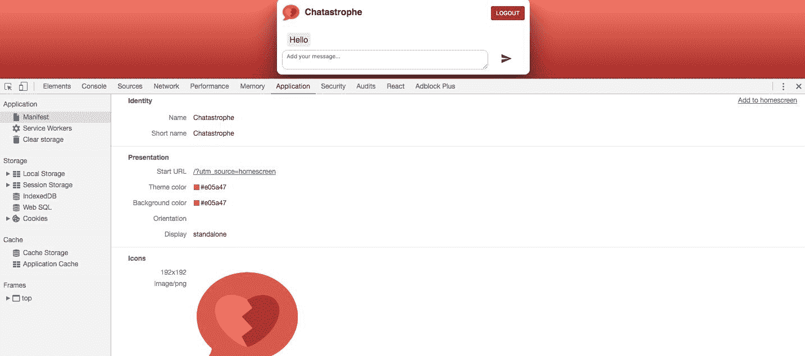
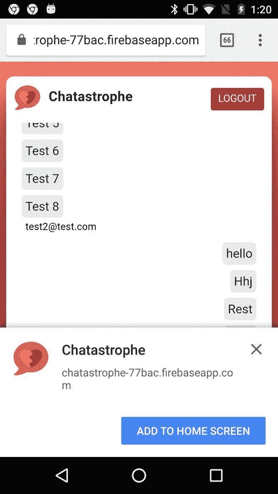
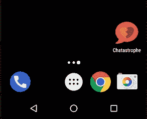
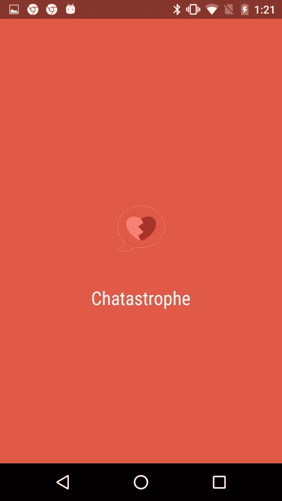
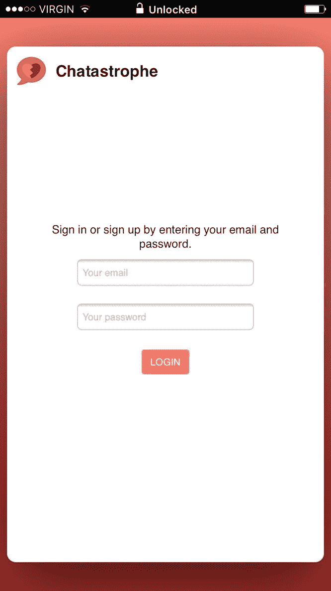
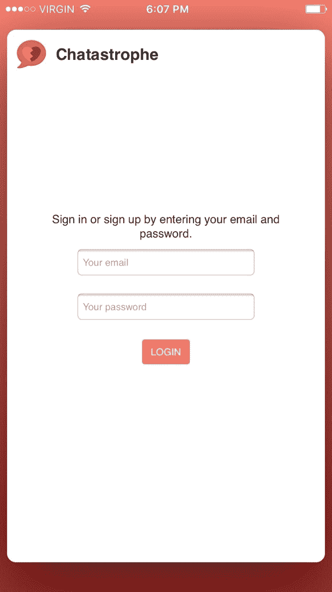
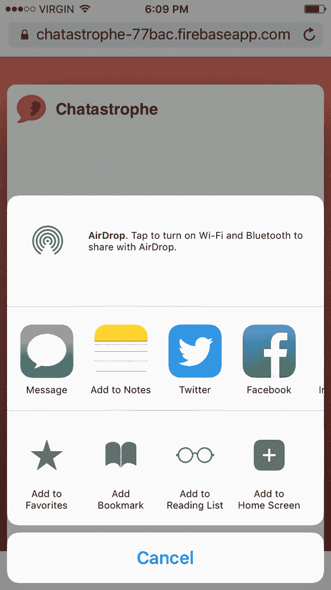
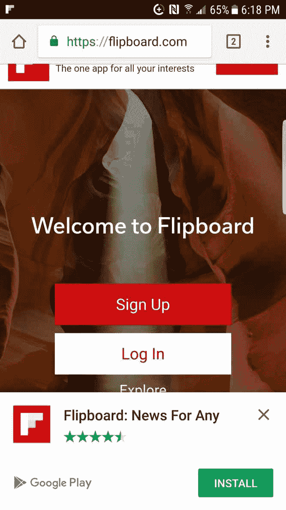
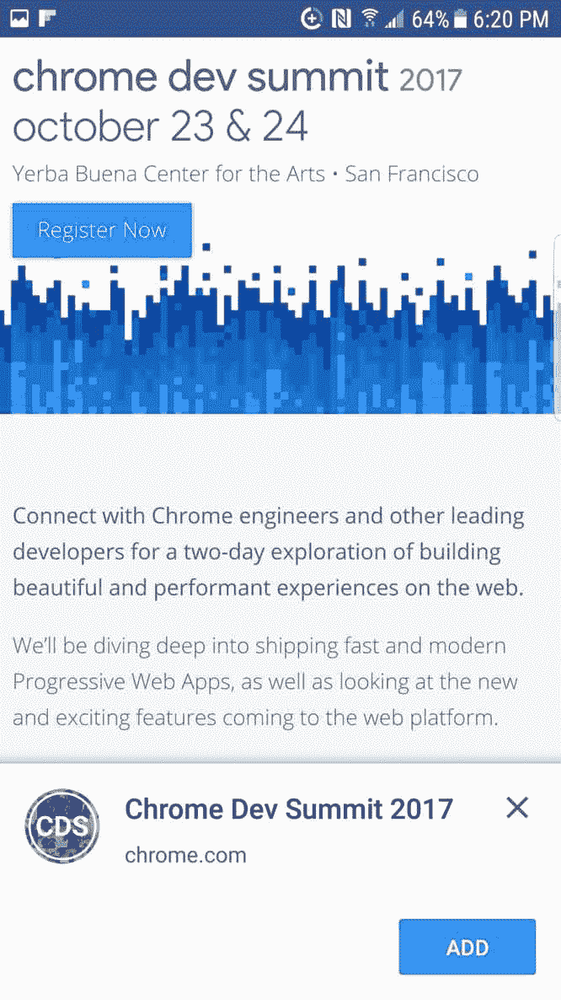
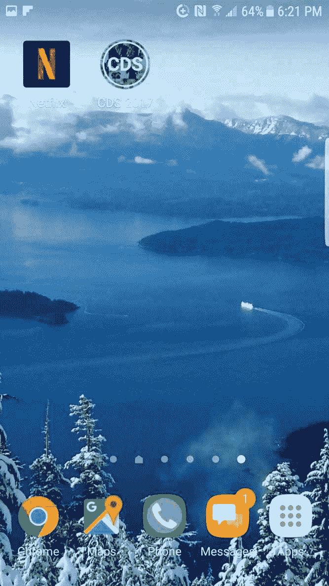

# 第九章：使用清单使我们的应用程序可安装

我们现在开始走向渐进式 Web 应用程序领域。从现在开始，我们的唯一重点将是将我们现有的应用程序变得更快、更时尚和更用户友好。

渐进式 Web 应用程序的一个重要优势是弥合了 Web 应用程序（在浏览器中查看）和本地应用程序（作为独立应用程序启动）之间的差距。接下来的几章，特别是将专注于使我们的 Web 应用程序更像本地应用程序，而不失去 Web 应用程序的所有优势。

Web 应用程序相对于本地应用程序的第一个主要优势是没有安装障碍。如果你创建一个本地应用程序，你需要说服用户在甚至使用你的应用程序之前，投入宝贵的存储空间和带宽。他们必须愿意忍受下载和安装过程。然后他们必须保留它，即使他们并不经常使用它。

Web 应用程序没有这样的障碍。你几乎可以立即使用它们，而且最复杂的 Web 应用程序具有可以与本地应用程序媲美的功能。它们的缺点是什么？嗯，用户必须先导航到他们的浏览器，然后再导航到网页才能使用它。他们没有漂亮整洁的应用程序存在的提醒，从他们手机的主屏幕上盯着他们。

什么是双赢的最佳选择？它将是一个允许用户在安装到他们的设备之前先试用的应用程序，但一旦安装后，它会像本地应用程序一样运行，并在设备的主屏幕上显示图标。

我们如何实现这一点？我们可以通过一个 Web 应用程序清单来实现。

在本章中，我们将涵盖以下内容：

+   什么是 Web 应用程序清单？

+   如何使我们的应用程序可以在 Android 上安装

+   如何使我们的应用程序可以在 iOS 上安装

+   使用 Web 应用程序安装横幅

# 什么是应用程序清单？

在第二章，*使用 Webpack 入门*，当我们设置我们的 Webpack 构建配置时，我们确保我们的构建过程生成了一个资产清单，文件名为`asset-manifest.json`。

这个文件包含了我们的应用程序使用的 JavaScript 文件列表。如果我们愿意，我们可以配置它来列出我们使用的 CSS 和图像文件。

这个资产清单让我们了解了清单的用途--描述应用程序的某个部分。我们的 Web 应用清单类似，但简单地描述了我们的应用程序从更高层面上的全部内容，以一种类似于应用商店对本地应用的描述的方式。

这就是它的外观，随着我们构建文件，我们将更深入地了解，但 Web 应用清单的真正魔力在于它的功能。

在某些浏览器上（本章后面会详细介绍），如果您的 Web 应用包括一个合适的 Web 应用清单，用户可以选择将网页保存到主屏幕上，它会像一个常规应用程序一样出现，并带有自己的启动图标。当他们点击图标时，它将以闪屏启动，并且（尽管是从浏览器运行）以全屏模式运行，因此看起来和感觉像一个常规应用程序。

# 浏览器支持

这就是 Web 应用清单的缺点--它是一种新技术。因此，很少有浏览器实际支持它。截至目前，只有较新版本的安卓 Webview 和 Chrome for Android 具有完全支持。

我预测支持很快会到来，适用于所有新版浏览器，但目前我们该怎么办呢？

简而言之，有办法在旧版浏览器上激活类似的功能。在本章中，我们将介绍如何使用 Web 应用清单（适用于新版浏览器的用户，并为未来做准备）以及 iOS 设备的**polyfill**。

如果您有兴趣覆盖其他设备，可以使用 polyfills，比如**ManUp**（[`github.com/boyofgreen/manUp.js/`](https://github.com/boyofgreen/manUp.js/)）。这些 polyfills 的作用是将不同设备的各种解决方法编译成一个清单文件。

然而，本书是关于 Web 应用的未来，所以我们将向您展示一切您需要为 Web 应用清单的世界做准备。

# 使我们的应用可安装-安卓

谷歌是 PWA 的最大支持者之一，因此他们的 Chrome 浏览器和安卓操作系统对 Web 应用清单最为友好。

让我们通过创建一个清单的过程，以使其与最新版本的 Chrome 兼容。在本章后面，我们将以更手动的方式进行相同的过程，以支持 iOS。

# 清单属性

让我们开始吧！在您的`public/`文件夹中，创建一个名为`manifest.json`的文件，然后添加一个空对象。以下每个都将是该对象的键值对。我们将快速浏览一下每个可用属性：

+   `name`：您的应用程序名称。简单！：

```jsx
"name": "Chatastrophe",
```

+   `short_name`：您的应用程序名称的可读版本。这是在全名无法完全显示时使用，比如在用户的主屏幕上。如果您的应用程序名称是“为什么 PWA 对每个人都很棒”，您可以将其缩短为“PWAs R Great”或其他内容：

```jsx
“short_name”: “Chatastrophe”,
```

+   `icons`：用户设备使用的图标列表。我们将只使用我们当前的徽标，这恰好是图标所需的最大尺寸。

Google 推荐以下一组图标：

+   128x128 作为基本图标大小

+   152x152 适用于 Apple 设备

+   144x144 适用于 Microsoft 设备

+   192x192 适用于 Chrome

+   256x256、384x384 和 512x512 适用于不同的设备尺寸

最后两个包含在资产包中。我们需要我们的设计师为我们的生产版本创建其余部分，但目前还不需要：

```jsx
"icons": [
  {
    "src":"/assets/icon.png",
    "sizes": "192x192",
    "type": "image/png"
  },
  { 
    "src": "/assets/icon-256.png", 
    "sizes": "256x256", 
    "type": "image/png" 
  }, 
  { 
    "src": "/assets/icon-384.png", 
    "sizes": "384x384", 
    "type": "image/png" 
  }, 
  { 
    "src": "/assets/icon-512.png", 
    "sizes": "512x512", 
    "type": "image/png" 
  }
],
```

+   `start_url`：启动 URL 用于分析目的，以便您可以看到有多少用户通过安装的 PWA 访问您的 Web 应用程序。这是可选的，但不会有害。

```jsx
"start_url": "/?utm_source=homescreen",
```

+   `background_color`：背景颜色用于启动我们的应用程序时显示的闪屏的颜色。在这里，我们将其设置为一个漂亮的橙红色：

```jsx
"background_color": "#e05a47",
```

+   `theme_color`：这类似于`background_color`，但在您的应用程序处于活动状态时，它会为 Android 上的工具栏设置样式。一个不错的点缀：

```jsx
"theme_color": "#e05a47",
```

+   `display`：正如我们之前所说，PWA 可以像本机应用程序一样启动，即浏览器栏被隐藏；这就是这个属性的作用。如果您认为让用户能够看到地址栏更好，可以将其设置为“browser”：

```jsx
"display": "standalone"
```

# 其他属性

还有一些属性需要您了解我们的应用程序：

+   `related_applications`：您可以提供与您的 Web 应用程序相关的本机应用程序的列表，并附带下载的 URL；将其与`prefer_related_applications`配对使用。

+   `prefer_related_applications`：一个默认值为 false 的布尔值。如果为 true，则用户将收到有关相关应用程序的通知。

+   `scope`：一个字符串，比如`/app`。如果用户导航到范围之外的页面，应用程序将返回到浏览器中常规网页的外观。

+   `description`：您的应用程序的描述；不是强制性的。

+   `dir`：类型的方向。

+   `lang`：`short_name`的语言。与`dir`配对使用，可用于确保从右到左的语言正确显示。

# 链接我们的清单

就是这样！最后，您的`manifest.json`应该是这样的：

```jsx
{
  "name": "Chatastrophe",
  "short_name": "Chatastrophe",
  "icons": [
    {
      "src":"/assets/icon.png",
      "sizes": "192x192",
      "type": "image/png"
    },
    { 
      "src": "/assets/icon-256.png", 
      "sizes": "256x256", 
      "type": "image/png" 
    }, 
    { 
      "src": "/assets/icon-384.png", 
      "sizes": "384x384", 
      "type": "image/png" 
    }, 
    { 
      "src": "/assets/icon-512.png", 
      "sizes": "512x512", 
      "type": "image/png" 
    }
  ],
  "start_url": "/?utm_source=homescreen",
  "background_color": "#e05a47",
  "theme_color": "#e05a47",
  "display": "standalone"
}
```

然后，您可以像这样从您的`index.html`中链接它：

```jsx
<link rel="manifest" href="/manifest.json">
```

确保您也将其复制到您的`build`文件夹中。

如果一切顺利，并且您使用的是最新版本的 Chrome，您可以通过转到 Chrome Dev Tools 中的“应用程序”选项卡来检查是否正常工作。确保首先重新启动服务器。您应该会看到以下内容：



现在来测试一下吧！让我们再次运行我们的部署过程，使用**`yarn deploy`**。完成后，转到您的 Android 设备上的应用程序。为了触发 Web 应用程序安装横幅，您需要访问该站点两次，每次访问之间间隔五分钟：



如果您没有看到安装横幅，您也可以通过转到选项下拉菜单并选择“添加到主屏幕”来安装它。

一旦您点击“添加到主屏幕”，您应该会看到它出现：



然后，当我们启动时，我们会得到一个漂亮的启动画面：



这很可爱。

这就是为 Android 制作可安装的 PWA 的要点。这是一个非常简洁流畅的过程，这要感谢 Google 对 PWA 的倡导，但我们的许多用户无疑会使用 iPhone，因此我们也必须确保我们也支持他们。

# 使我们的应用可安装- iOS

截至撰写本文时，苹果尚未支持渐进式 Web 应用程序。关于这一点有许多理论（他们的盈利能力强大的 App Store 生态系统，与谷歌的竞争，缺乏控制），但这意味着使我们的应用可安装的过程要更加手动化。

让我们明确一点-截至目前，PWA 的最佳体验将是针对使用最新版本 Chrome 的 Android 设备用户。

然而，PWA 也是关于渐进式增强的，这是我们将在后面的章节中更深入地介绍的概念。渐进式增强意味着我们为每个用户在其设备上提供最佳的体验；如果他们可以支持所有新的功能，那很好，否则，我们会尽力利用他们正在使用的工具。

因此，让我们来看看如何使我们的 UX 对于想要将我们的应用保存到主屏幕的 iPhone 用户来说是愉快的。

我们将使用大量的`<meta>`标签来告诉浏览器我们的应用是可安装的。让我们从图标开始：

```jsx
<link rel="apple-touch-icon" href="/assets/icon.png">
```

将以下内容添加到`public/index.html`（在本节的其余部分中，将所有的`meta`标签分组放在`link`标签之上）。这定义了用户主屏幕上的图标。

接下来，我们为页面添加一个标题，这将作为主屏幕上应用程序的名称。在您的`link`标签之后添加这个：

```jsx
<title>Chatastrophe</title>
```

然后，我们需要让 iOS 知道这是一个 Web 应用程序。您可以使用以下`meta`标签来实现：

```jsx
<meta name="apple-mobile-web-app-capable" content="yes">
```

就像我们在 Android 部分中使用`theme_color`一样，我们希望样式化状态栏的外观。默认值是黑色，看起来像这样：



另一个选项是 black-translucent，它并不是非常黑，主要是半透明的：



使用以下内容添加：

```jsx
<meta name="apple-mobile-web-app-status-bar-style" content="black-translucent">
```

我们要做的最后一件事是设计启动画面；在应用程序启动时出现的内容。

在 iOS 上进行此操作有点手动--您需要提供一个静态图像。

为了完全支持，您需要为每个 iOS 屏幕尺寸提供单独的启动图像，从 iPad 到最小的 iPhone。如果您想看到多个启动图像和图标的绝佳示例，请查看[gist 链接](https://gist.github.com/tfausak/2222823)。这里包括了该 gist 中的启动图像链接：

```jsx
    <!-- iPad retina portrait startup image -->
    <link href="https://placehold.it/1536x2008"
          media="(device-width: 768px) and (device-height: 1024px)
                 and (-webkit-device-pixel-ratio: 2)
                 and (orientation: portrait)"
          rel="apple-touch-startup-image">

    <!-- iPad retina landscape startup image -->
    <link href="https://placehold.it/1496x2048"
          media="(device-width: 768px) and (device-height: 1024px)
                 and (-webkit-device-pixel-ratio: 2)
                 and (orientation: landscape)"
          rel="apple-touch-startup-image">

    <!-- iPad non-retina portrait startup image -->
    <link href="https://placehold.it/768x1004"
          media="(device-width: 768px) and (device-height: 1024px)
                 and (-webkit-device-pixel-ratio: 1)
                 and (orientation: portrait)"
          rel="apple-touch-startup-image">

    <!-- iPad non-retina landscape startup image -->
    <link href="https://placehold.it/748x1024"
          media="(device-width: 768px) and (device-height: 1024px)
                 and (-webkit-device-pixel-ratio: 1)
                 and (orientation: landscape)"
          rel="apple-touch-startup-image">

    <!-- iPhone 6 Plus portrait startup image -->
    <link href="https://placehold.it/1242x2148"
          media="(device-width: 414px) and (device-height: 736px)
                 and (-webkit-device-pixel-ratio: 3)
                 and (orientation: portrait)"
          rel="apple-touch-startup-image">

    <!-- iPhone 6 Plus landscape startup image -->
    <link href="https://placehold.it/1182x2208"
          media="(device-width: 414px) and (device-height: 736px)
                 and (-webkit-device-pixel-ratio: 3)
                 and (orientation: landscape)"
          rel="apple-touch-startup-image">

    <!-- iPhone 6 startup image -->
    <link href="https://placehold.it/750x1294"
          media="(device-width: 375px) and (device-height: 667px)
                 and (-webkit-device-pixel-ratio: 2)"
          rel="apple-touch-startup-image">

    <!-- iPhone 5 startup image -->
    <link href="https://placehold.it/640x1096"
          media="(device-width: 320px) and (device-height: 568px)
                 and (-webkit-device-pixel-ratio: 2)"
          rel="apple-touch-startup-image">

    <!-- iPhone < 5 retina startup image -->
    <link href="https://placehold.it/640x920"
          media="(device-width: 320px) and (device-height: 480px)
                 and (-webkit-device-pixel-ratio: 2)"
          rel="apple-touch-startup-image">

    <!-- iPhone < 5 non-retina startup image -->
    <link href="https://placehold.it/320x460"
          media="(device-width: 320px) and (device-height: 480px)
                 and (-webkit-device-pixel-ratio: 1)"
          rel="apple-touch-startup-image">
```

您可能注意到这些链接不包括任何 iPhone 6 Plus 之后的 iPhone。在撰写本文时，iOS 9 对启动图像的支持有问题，iOS 10 则不支持。虽然这不会影响您的应用程序的用户体验（启动画面本来也只能看一秒钟），但这表明了苹果对 PWA 的支持不完全。希望这在不久的将来会发生改变。

总的来说，将您的应用程序制作成 iOS 可安装的 Web 应用程序并不像`manifest.json`那样花哨或直观，但相当简单。使用**`yarn deploy`**重新部署您的应用程序，然后在 iPhone 上的 Safari 中打开网页。然后，点击分享并添加到主屏幕：



它应该会出现在您的主屏幕上，就像普通的应用程序一样，并且在启动时会出现如下：


这非常漂亮。

最终的`index.html`应该是这样的：

```jsx
<!DOCTYPE html>
<html lang="en">
  <head>
    <meta name="viewport" content="width=device-width, initial-scale=1">
    <meta charset="utf-8">
    <meta name="apple-mobile-web-app-capable" content="yes">
    <meta name="apple-mobile-web-app-status-bar-style" content="black-translucent">
    <link rel="shortcut icon" href="assets/favicon.ico" type="image/x-icon">
    <link rel="manifest" href="/manifest.json">
    <link rel="apple-touch-icon" href="/assets/icon.png">
    <title>Chatastrophe</title>
  </head>
  <body>
    <div id="root"></div>
    <script src="/secrets.js"></script>
    <script src="https://www.gstatic.com/firebasejs/4.3.0/firebase.js"></script>
    <script>
      // Initialize Firebase
      var config = {
        apiKey: window.apiKey,
        authDomain: "chatastrophe-draft.firebaseapp.com",
        databaseURL: "https://chatastrophe-draft.firebaseio.com",
        projectId: "chatastrophe-draft",
        storageBucket: "chatastrophe-draft.appspot.com",
        messagingSenderId: window.messagingSenderId
      };
      window.firebase = firebase;
      firebase.initializeApp(config);
    </script>
  </body>
</html>
```

# 应用安装横幅和您

能够添加到主屏幕是一个很棒的功能，但是我们的用户如何知道我们的应用程序是可安装的，特别是如果他们从未听说过 PWA 呢？

进入**Web App Install Banner**。 以前，应用安装横幅是一种方便的方式来宣传您的原生应用程序-请参阅 Flipboard 的以下示例：



然而，现在，谷歌正在带头推动 PWA 安装横幅，提示用户添加到主屏幕。 请参阅 Chrome Dev Summit 网站的以下示例：



该横幅具有使用户意识到您的网站是 PWA 的优势，并且对于那些不熟悉可安装的 Web 应用程序的用户，提供了进入 PWA 世界的入口点。

当您点击上一个屏幕截图中的“添加”时，您的主屏幕上会显示如下内容：



然而，就像本节中的所有内容一样，这是一项新技术。 目前，仅在安卓上的 Chrome 和 Opera for Android 上存在牢固的支持。 此外，两个浏览器上安装横幅将出现的具体标准也是牢固的：

+   该应用程序必须具有 Web 应用程序清单

+   该应用程序必须通过 HTTPS 提供

+   该应用程序必须使用服务工作者

+   该应用程序必须被访问两次，访问之间至少间隔五分钟

我们已经涵盖了前三个条件（Firebase 应用程序会自动通过 HTTPS 部署）。 最后一个标准是尽量减少用户的烦恼。

# 延迟应用程序安装横幅

以下部分仅适用于您拥有安卓设备进行测试，并且安装了最新版本的 Chrome 或 Opera for Android。 您还需要为您的安卓设备设置远程调试，按照以下指南进行操作：[`developers.google.com/web/tools/chrome-devtools/remote-debugging/`](https://developers.google.com/web/tools/chrome-devtools/remote-debugging/)。

我们之前提到的 PWA 的优势之一是用户在决定是否安装之前有机会与您的应用程序进行交互。 如果 Web 应用程序安装横幅显示得太早（在用户与您的应用程序进行积极交互之前），可能会干扰该过程。

在本节中，我们将通过延迟 Web 应用程序安装横幅事件来解决这个问题，直到用户与我们的应用程序进行积极交互。

我们将向我们的`App.js`添加一个事件侦听器，以便在横幅显示事件准备好触发时进行监听。 然后，我们将拦截该事件，并在用户发送消息时保存它。

# 监听事件

Chrome 在显示 Web 应用程序安装横幅之前直接发出`beforeinstallprompt`事件。这就是我们要监听的事件。像我们的其他 Firebase 事件监听器一样，让我们将其添加到我们的`App.js`的`componentDidMount`中。

我们将创建一个名为`listenForInstallBanner`的方法，然后从`componentDidMount`中调用该方法：

```jsx
componentDidMount() {
  firebase.auth().onAuthStateChanged(user => {
    if (user) {
      this.setState({ user });
    } else {
      this.props.history.push('/login');
    }
  });
  firebase
    .database()
    .ref('/messages')
    .on('value', snapshot => {
      this.onMessage(snapshot);
      if (!this.state.messagesLoaded) {
        this.setState({ messagesLoaded: true });
      }
    });
  this.listenForInstallBanner();
}
```

```jsx
listenForInstallBanner = () => {

};
```

在`listenForInstallBanner`中，我们将做两件事：

1.  为事件注册一个监听器。

1.  当该事件触发时，取消它并将其存储以便以后使用。

将其存储以便以后我们可以在任何时候触发它，也就是当用户发送他们的第一条消息时。

代码如下：

```jsx
listenForInstallBanner = () => {
  window.addEventListener('beforeinstallprompt', (e) => {
    console.log('beforeinstallprompt Event fired');
    e.preventDefault();
    // Stash the event so it can be triggered later.
    this.deferredPrompt = e;
  });
};
```

我们将在`App`实例上存储我们的`deferredPrompt`，以便以后可以获取它。我们将在`handleSubmitMessage`方法中执行这个操作：

```jsx
handleSubmitMessage = msg => {
  const data = {
    msg,
    author: this.state.user.email,
    user_id: this.state.user.uid,
    timestamp: Date.now()
  };
  firebase
    .database()
    .ref('messages/')
    .push(data);
  if (this.deferredPrompt) {
 this.deferredPrompt.prompt();
 this.deferredPrompt.userChoice.then(choice => {
 console.log(choice);
 });
 this.deferredPrompt = null;
 }
};
```

在我们提交消息后，我们触发我们保存的事件。然后，我们记录用户的选择（无论他们是否实际安装了应用程序，我们也可以将其发送到将来选择使用的任何分析工具）。最后，我们删除事件。

好的，让我们测试一下！

将您的 Android 设备连接到计算机上，并在 DevTools 上打开远程调试。我们首先必须部署我们的应用程序，所以点击`yarn deploy`并等待它完成。然后，在您的设备上打开应用程序并输入一条消息；您应该会看到应用程序安装横幅弹出。

如果没有出现，请检查您的代码，或转到 DevTools 的应用程序选项卡，然后单击“添加到主屏幕”按钮。这应该会触发`beforeinstallprompt`事件。

# 总结

Web 应用程序安装横幅仍然是一项新技术，标准仍在不断变化中。有关最新信息，请参阅 Google 关于 Web 应用程序安装横幅的页面-[`developers.google.com/web/fundamentals/engage-and-retain/app-install-banners/`](https://developers.google.com/web/fundamentals/engage-and-retain/app-install-banners/)。也就是说，我希望本章对横幅的可能性和当前技术状态有所帮助。

现在我们已经使我们的应用程序更大更好，是时候精简并专注于性能了。下一章见！
