# 第十章：应用外壳

我们上一章讨论了添加主屏幕安装和推送通知，这两者都旨在通过添加功能来改善用户体验，但正如我们在书的开头描述的用户故事一样，这个应用最重要的特性之一是包容性；它是一个面向所有人的聊天应用。

从 Web 应用的角度来看，我们可以更好地重新表述为“任何连接，任何速度”。Web 应用性能的最大障碍是网络请求：在慢速连接下加载数据需要多长时间。

开发人员可能会忽视性能，仅仅因为我们通常在城市中心的空调建筑内快速连接上测试我们的网站。然而，对于像 Chatastrophe 这样的全球应用，我们必须考虑在不发达国家的用户、农村地区的用户以及只有我们十分之一网络速度的用户。我们如何让应用为他们工作？

本节重点讨论性能；具体来说，它是关于优化我们的应用，使其在最恶劣的条件下也能表现良好。如果我们做得好，我们将拥有一个强大的用户体验，适用于任何速度（或缺乏速度）。

在本章中，我们将涵盖以下内容：

+   渐进增强是什么

+   性能的 RAIL 模型

+   使用 Chrome DevTools 来衡量性能

+   将我们的应用外壳从 React 中移出

# 什么是渐进增强？

**渐进增强**是一个简单的想法，但影响深远。它源于提供出色用户体验的愿望，同时又需要性能。如果我们所有的用户都有完美、超快的连接，我们可以构建一个令人难以置信的应用。然而，如果我们所有的用户都有慢速连接，我们必须满足于更简化的体验。

渐进增强说为什么不两者兼得？为什么不两者都有？

我们的受众包括快速连接和慢速连接。我们应该为两者提供服务，并适当地为每个人提供服务，这意味着为最佳连接提供最佳体验，为较差的连接提供更简化（但仍然很棒）的体验，以及介于两者之间的一切。

简而言之，渐进增强意味着随着用户的连接改善，我们的应用会逐渐变得更好，但它始终是有用的和可用的。因此，我们的应用是一种适应连接的应用*。*

您可以想象这正是现代网页加载的方式。首先，我们加载 HTML——内容的基本、丑陋的骨架。然后，我们添加 CSS 使其变得漂亮。最后，我们加载 JavaScript，其中包含使其生动的所有好东西。换句话说，随着网站的加载，我们的应用程序会逐渐变得更好。

渐进增强范式敦促我们重新组织网站的内容，以便重要的内容尽快加载，然后再加载其他功能。因此，如果您使用的是超快速的连接，您会立即得到所有内容；否则，您只会得到使用应用程序所需的内容，其他内容稍后再加载。

因此，在本章中，我们将优化我们的应用程序，尽快启动。我们还将介绍许多工具，您可以使用这些工具来关注性能，并不断增强性能，但是我们如何衡量性能呢？我们可以使用哪些指标来确保我们提供了一个快速的应用程序？RAIL 模型应运而生。

# RAIL 模型

RAIL 是谷歌所称的“以用户为中心的性能模型”。这是一组衡量我们应用性能的指南。我们应该尽量避免偏离这些建议。

我们将使用 RAIL 的原则来加快我们的应用程序，并确保它对所有用户都表现良好。您可以在[`developers.google.com/web/fundamentals/performance/rail`](https://developers.google.com/web/fundamentals/performance/rail)上阅读谷歌关于 RAIL 的完整文档。

RAIL 概述了应用程序生命周期中的四个特定时期。它们如下：

+   响应

+   动画

+   空闲

+   加载

就我个人而言，我认为以相反的顺序来思考它们会更容易（因为这更符合它们的实际顺序），但那样会拼成 LIAR，所以我们可以理解为什么谷歌会回避这一点。无论如何，在这里我们将以这种方式来介绍它们。

# 加载

首先，您的应用程序加载（让光明降临！）。

RAIL 表示，最佳加载时间为一秒（或更短）。这并不意味着您的整个应用程序在一秒内加载完成；而是意味着用户在一秒内看到内容。他们会对当前任务（加载页面）有一定的感知，而不是盯着一片空白的白屏。正如我们将看到的，这并不容易做到！

# 空闲

一旦您的应用程序加载完成，它就是空闲的（在操作之间也会是空闲的），直到用户执行操作。

RAIL 认为，与其让你的应用程序闲置不用（懒惰！），我们应该利用这段时间继续加载应用程序的部分。

我们将在下一章中更详细地看到这一点，但如果我们的初始加载只是我们应用程序的基本版本，我们会在空闲时间加载其他内容（渐进增强！）。

# 动画

动画对我们的目的来说不太相关，但我们将在这里简要介绍一下。基本上，如果动画不以 60 帧每秒的速度执行，用户会注意到动画的延迟。这将对感知性能（用户对应用程序速度的感受）产生负面影响。

请注意，RAIL 还将滚动和触摸手势定义为动画，因此即使你没有动画，如果你的滚动有延迟，你就会有问题。

# 响应

最终（希望非常快！），用户执行一个操作。通常，这意味着点击按钮、输入或使用手势。一旦他们这样做，你有 100 毫秒的时间来提供一个响应，以确认他们的行动；否则，用户会注意到并感到沮丧，也许会重试该操作，从而在后续造成更多问题（我们都经历过这种情况——疯狂地双击和三击）。

请注意，如果需要进行一些计算或网络请求，某些操作将需要更长的时间来完成。你不需要在 100 毫秒内完成操作，但你必须提供一些响应；否则，正如*Meggin Kearney*所说，“行动和反应之间的连接就断了。用户会注意到。”

# 时间轴

正如前面的模型所示，我们的应用程序必须在一定的时间限制内运行。这里有一个方便的参考：

+   16 毫秒：任何动画/滚动的每帧时间。

+   100 毫秒：对用户操作的响应。

+   1000 毫秒以上：在网页上显示内容。

+   1000 毫秒以上：用户失去焦点。

+   10,000 毫秒以上：用户可能会放弃页面。

如果你的应用程序按照这些规范执行，你就处于一个良好的状态（这些并不容易做到，正如我们将看到的）。

# 使用时间轴进行测量

在这一部分，我们将看看如何使用 Chrome DevTools 来分析我们应用程序的性能，这是我们将使用的一些工具中的第一个，用来跟踪我们的应用程序加载和响应的方式。

一旦我们了解了它的性能，我们可以根据 RAIL 原则进行改进。

开发工具当然是一直在不断发展的，所以它们的外观可能会与给定的截图有所不同。然而，核心功能应该保持不变，因此，重要的是要密切关注工作原理。

在 Chrome 中打开部署的 Firebase 应用程序，并打开 DevTools 到性能标签（我建议通过右上角的下拉菜单将工具拖出到单独的窗口中，因为有很多内容要查看）；然后，刷新页面。页面加载完成后，您应该看到类似以下内容：

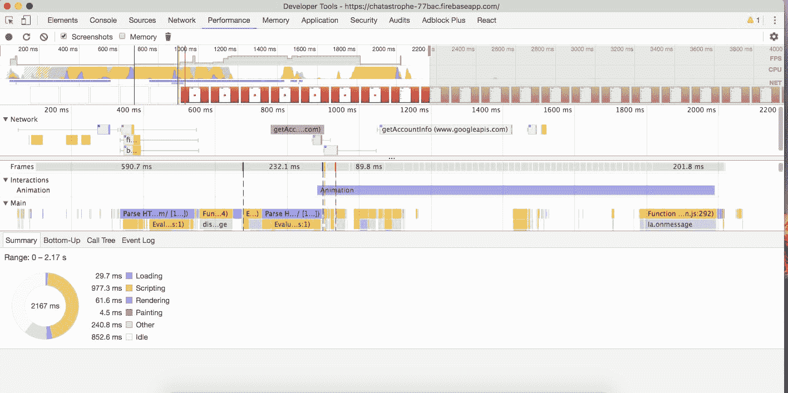

这里有很多内容，让我们来分解一下。我们将从摘要标签开始，底部的圆形图表。

# 摘要标签

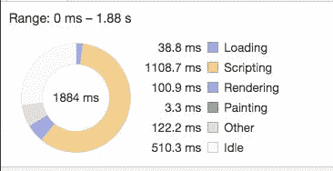

中间的数字是我们的应用程序完全加载所花费的时间。您的数字应该与我的类似，根据您的互联网速度会有一些变化。

到目前为止，这里最大的数字是脚本，几乎达到了 1000 毫秒。由于我们的应用程序使用 JavaScript 很多，这是有道理的。我们立刻就能看到我们大部分的优化应该集中在尽快启动我们的脚本上。

另一个重要的数字是空闲时间的数量（几乎与脚本时间一样多）。我们马上就会看到为什么会有这么多空闲时间，但请记住，RAIL 模型建议利用这段时间开始预加载尚未加载的应用程序部分。目前，我们一开始就加载了所有内容，然后启动所有内容，然后坐在那里一会儿。只加载我们需要的内容（从而减少脚本时间），然后在后台加载其余内容（从而减少空闲时间）将更有意义。

# 网络请求

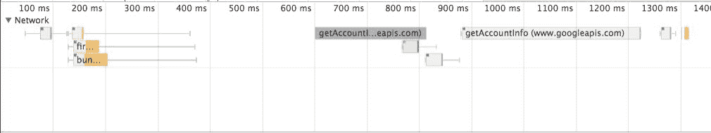

我们现在将转到网络请求，因为这将有助于解释性能概况的其余部分。

在这里，您可以看到确切加载了什么数据以及何时加载。一开始，我们看到了很多设置文件：Firebase 应用和`messaging`库，我们的`bundle.js`，以及页面的实际文档。

稍后，两个重要的调用是为了用户：登录和加载用户详细信息。我们加载的最后一件事是清单。

这个顺序是有道理的。我们需要加载 Firebase 库和我们的 JavaScript 来启动我们的应用程序。一旦我们这样做，我们就开始登录过程。

接下来发生的事情是，一旦用户登录，我们就会收到来自 Firebase 的消息和数据。正如您所注意到的，这在图表上并没有显示出来，因为它是通过 WebSockets 实时完成的，所以它并不是一个网络请求。然而，它将影响到其余的性能概况，所以请记住这一点。

# 瀑布

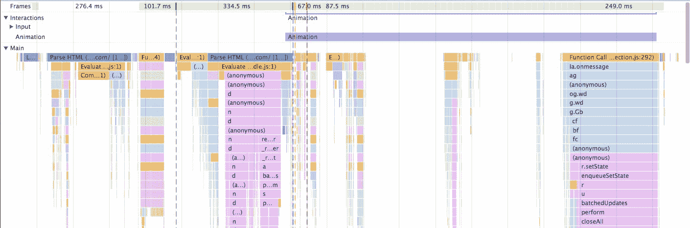

在这里，我们可以详细了解 Chrome 在渲染过程中实际在做什么。

瀑布工具是详细和复杂的，所以我们只能对其进行表面浏览。然而，我们可以从中得出两个见解。首先，我们可以看到所有的空闲时间可视化。大部分是在开始时，这在我们首次加载文档时有些不可避免，但在中间有一个很大的空白，我们可以尝试填补它。

其次，您可以看到应用程序在右侧瀑布图中接收来自 Firebase 的消息。如果您将鼠标悬停在每个块上，实际上可以追踪 Firebase 接收消息并将其状态设置为消息数组的过程。

因此，虽然我们无法在网络请求中看到消息加载，但我们可以在 JavaScript 执行中看到响应。

# 屏幕截图

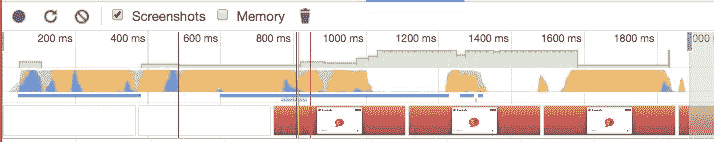

这是我最喜欢的性能工具部分，因为它生动地说明了您的应用程序是如何加载的。

正如我们之前所建立的，用户应该在加载您的应用程序后的 1000 毫秒内看到内容。在这里，我们可以看到应用程序上的内容首先出现大约在 400 毫秒左右，所以我们看起来不错，但随着我们的应用程序增长（和我们的脚本负担增加），情况可能会改变，所以现在是尽可能优化的时候了。

# PageSpeed Insights

性能工具非常棒，因为它们让我们深入了解应用程序加载的细节。我们将使用它们来跟踪我们应用程序的性能，但是，如果我们想要更具体、更详细的建议，我们可以转向 Google 提供的**PageSpeed Insights**工具。

转到 PageSpeed Insights（[`developers.google.com/speed/pagespeed/insights/`](https://developers.google.com/speed/pagespeed/insights/)）并输入您部署的应用程序的 URL。几秒钟后，您将收到关于 Chatastrophe 可以改进的建议：

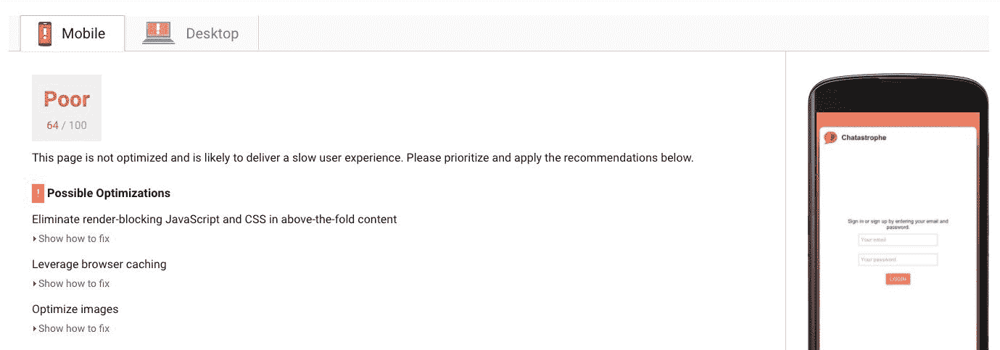

正如你所看到的，我们的移动性能急需帮助。大部分见解都集中在我们的阻塞渲染 JavaScript 和 CSS 上。我鼓励你阅读关于这些问题的描述，并尝试自行解决它们。在下一节中，我们将致力于根据谷歌的规范改进我们的应用程序，使用另一个渐进式 Web 应用程序的秘密武器——应用外壳模式。

# 应用外壳模式

我们应用程序的核心是消息列表和聊天框，用户在其中阅读和编写消息。

这个核心功能依赖于 JavaScript 来工作。我们无法绕过这样一个事实，即在用户通过 Firebase 进行身份验证并加载消息数组之前，我们无法显示消息，但是围绕这两个部分的一切大多是静态内容。在每个视图中都是相同的，并且不依赖于 JavaScript 来工作：


我们可以将这称为应用外壳——围绕功能性、由 JavaScript 驱动的核心的框架。

由于这个框架不依赖 JavaScript 来运行，实际上我们不需要等待 React 加载和启动所有 JavaScript，然后再显示它——这正是目前正在发生的事情。

现在，我们的外壳是我们的 React 代码的一部分，因此，在调用`ReactDOM.render`并在屏幕上显示之前，我们所有的 JavaScript 都必须加载。

然而，对于我们的应用程序，以及许多应用程序来说，UI 中有一个相当大的部分基本上只是 HTML 和 CSS。此外，如果我们的目标是减少感知加载时间（用户认为加载应用程序需要多长时间）并尽快将内容显示在屏幕上，最好将我们的外壳保持为纯粹的 HTML 和 CSS，即将其与 JavaScript 分离，这样我们就不必等待 React。

回到我们的性能工具，你可以看到加载的第一件事是文档，或者我们的`index.html`：

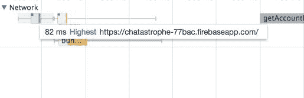

如果我们可以将我们的外壳放在`index.html`中，它将比目前快得多，因为它不必等待捆绑包加载。

然而，在开始之前，让我们进行基准测试，看看我们目前的情况以及这将带来多大的改进。

使用你部署的应用程序，打开我们的性能工具并刷新应用程序（在 DevTools 打开时使用 Empty Cache & Hard Reload 选项，以确保没有意外的缓存发生-按住并按下重新加载按钮来访问它）。然后，看一下那个图像条，看看内容何时首次出现：

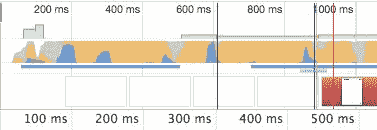

运行测试三次，以确保，并取平均值。对我来说，平均需要 600 毫秒。这是我们要超越的基准。

# 将 shell HTML 从 React 中移出

让我们首先定义我们想要移动到我们的`index.html`中的内容。

在下面的图像中，除了消息和聊天框线之外的所有内容都是我们的应用程序 shell：

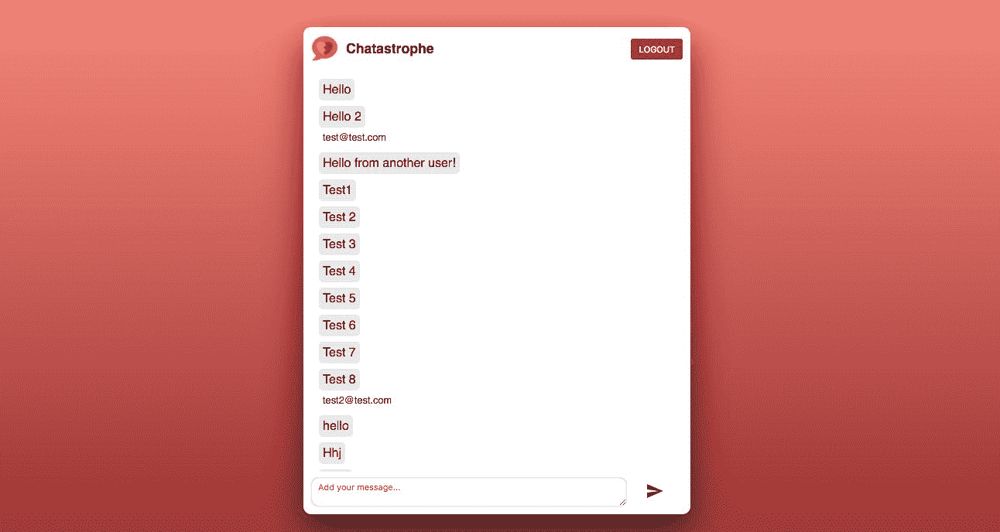

这就是我们想要从 React 中移出并转换为纯 HTML 的内容，但在继续之前让我们澄清一些事情。

我们的目标是创建一个快速加载的应用程序部分的版本，这些部分不需要立即使用 JavaScript，但最终，我们的一些 shell 将需要 JavaScript。我们需要在页眉中放置我们的注销按钮，这将需要 JavaScript 来运行（尽管只有在用户经过身份验证后才需要）。

因此，当我们谈论将这些内容从 React 中移出时，我们实际上要做的是有一个纯 HTML 和 CSS 版本的 shell，然后，当 React 初始化时，我们将用 React 版本替换它。

这种方法给了我们最好的两种世界：一个快速加载基础版本，一旦 JS 准备好，我们就会替换掉它。如果这听起来很熟悉，你也可以称之为逐步增强我们的应用程序。

那么，我们如何管理这个替换呢？嗯，让我们从打开我们的`index.html`开始，看看我们的应用程序是如何初始化的：

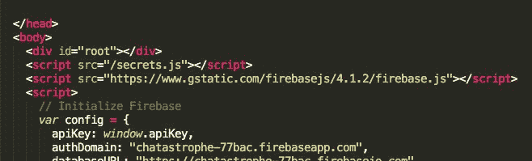

关键是我们的`div#root`。正如我们在`index.js`中看到的那样，那是我们注入 React 内容的地方：

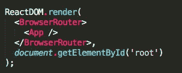

现在，我们将我们的 React 内容嵌入到一个空的`div`中，但让我们尝试一些东西；在里面添加一个`<h1>`：

```jsx
<div id="root">
  <h1>Hello</h1>
</div>
```

然后，重新加载你的应用程序：

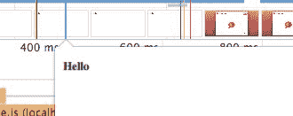

`<h1>`出现直到我们的 React 准备好，此时它被替换，所以我们可以在`div#root`内添加内容，当 React 准备好时，它将被简单地覆盖；这就是我们的关键。

让我们逐步移动内容，从我们的`App.js`开始，逐渐向下工作：

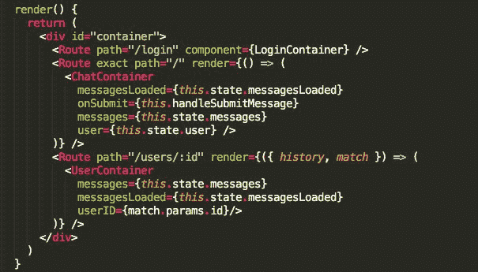

我们这里唯一需要的 HTML（或 JSX，目前）是容器。让我们将它复制到`div#root`中：

```jsx
<div id="root">
  <div id="container">
  </div>
</div>
```

然后，在`ChatContainer`（或`LoginContainer`，或`UserContainer`）内部，我们看到有一个`div.inner-container`，也可以移动过去：

```jsx
<div id="root">
  <div id="container">
    <div class="inner-container">
    </div>
  </div>
</div>
```

注意从`className`（对于 JSX）到`class`（对于 HTML）的更改。

然后，我们移动`Header`本身：

```jsx
<div id="root">
  <div id="container">
     <div class="inner-container">
       <div id="Header">
         
         <h1>Chatastrophe</h1>
       </div>
     </div>
  </div>
</div>
```

重新加载您的应用程序，您将看到我们的 HTML 的一个非常丑陋的版本在 React 加载之前出现：

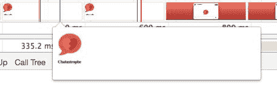

这里发生了什么？嗯，我们的 CSS 是在我们的`App.js`中加载的，在我们的导入语句中，因此直到我们的 React 准备好之前它都不会准备好。下一步将是将相关的 CSS 移动到我们的`index.html`中。

# 将 CSS 移出 React

目前，我们的应用程序没有太多的 CSS，所以理论上，我们可以只是在`index.html`中`<link>`整个样式表，而不是在`App.js`中导入它，但随着我们的应用程序和 CSS 的增长，这将不是最佳选择。

我们最好的选择是内联相关的 CSS。我们首先在`<head>`下方的`<title>`标签右侧添加一个`<style>`标签。

然后，打开`src/app.css`，并剪切（而不是复制）`/* Start initial styles */`和`/* End Initial styles */`注释内的 CSS。

将其放在样式标签内并重新加载应用程序：

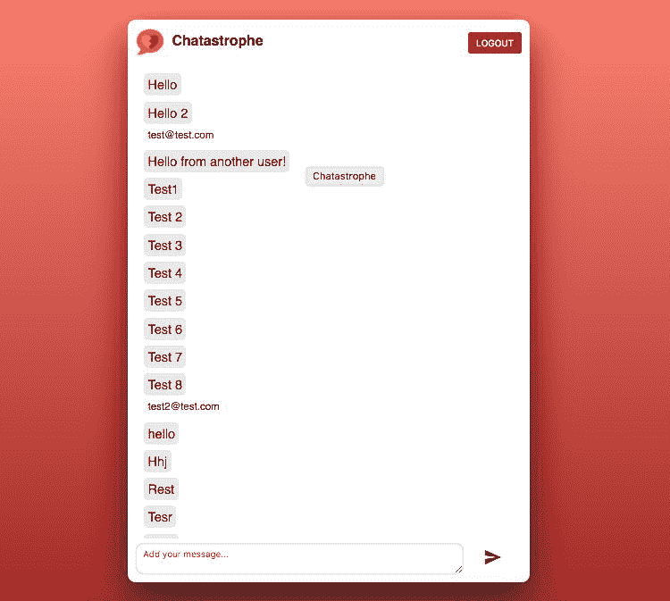

应用程序看起来完全一样！这是个好消息；在这个阶段，可能不会有明显的加载时间差异。然而，让我们部署然后再次运行我们的性能工具：

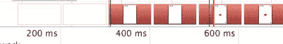

正如您所看到的，外壳（带有空白内部）出现在加载指示器出现之前（这表明 React 应用程序已经启动）。这是用户通常会花在空白屏幕上的时间。

# 移动加载指示器

让我们再向前迈进一小步，还将加载指示器添加到我们的应用程序外壳中，以让用户了解发生了什么。

复制`ChatContainer`中的 JSX 并将其添加到我们的`index.html`。然后，重新加载页面：

```jsx
<div id="root">
  <div id="container">
    <div class="inner-container">
      <div id="Header">
        
        <h1>Chatastrophe</h1>
      </div>
      <div id="loading-container">
        
      </div>
    </div>
  </div>
</div>
```

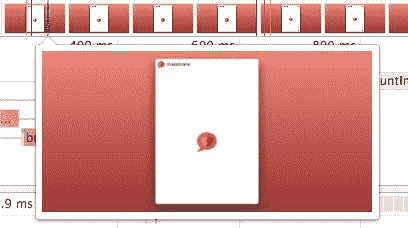

现在，用户可以清楚地感觉到应用程序正在加载，并且会更宽容地对待我们应用程序的加载时间（尽管我们仍然会尽力减少它）。

这是从本章中获得的基本原则：渐进式 Web 应用程序要求我们尽可能多地改善用户体验。有时，我们无法做任何关于加载时间的事情（归根结底，我们的 JavaScript 总是需要一些时间来启动--一旦它启动，它就提供了很好的用户体验），但我们至少可以让用户感受到进展。

良好的网页设计是关于共情。渐进式 Web 应用程序是关于对每个人都持有共情，无论他们从什么条件下访问您的应用程序。

# 总结

在本章中，我们涵盖了性能工具和概念的基本知识，从 RAIL 到 DevTools，再到 PageSpeed Insights。我们还使用了应用程序外壳模式进行了重大的性能改进。在接下来的章节中，我们将继续完善我们应用的性能。

我们下一章将解决最大的性能障碍——我们庞大的 JavaScript 文件。我们将学习如何使用 React Router 的魔力将其拆分成较小的块，并且如何在应用程序的空闲时间加载这些块。让我们开始吧！
