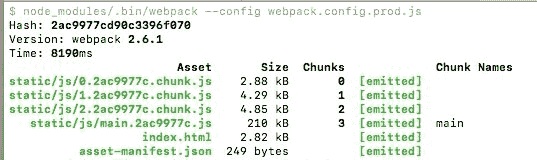
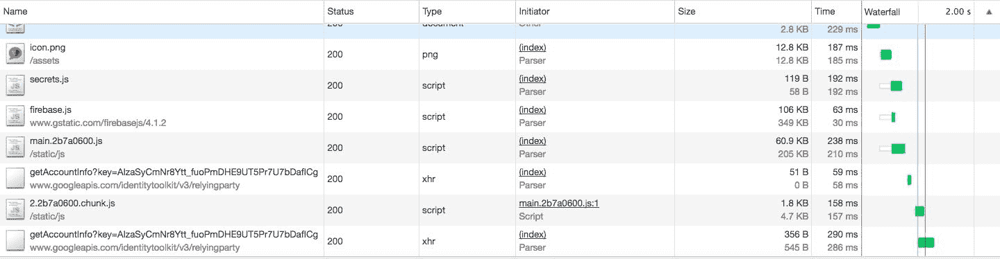
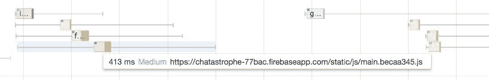

# 第十一章：使用 Webpack 对 JavaScript 进行分块以优化性能

正如我们在上一章中讨论的那样，将 React 应用程序转换为渐进式 Web 应用程序的最大问题是 React；更具体地说，它是构建现代 JavaScript 应用程序时固有的大量 JavaScript。解析和运行该 JavaScript 是 Chatastrophe 性能的最大瓶颈。

在上一章中，我们采取了一些措施来改善应用程序的感知启动时间，方法是将内容从 JavaScript 移出并放入我们的`index.html`中。虽然这是一种非常有效的向用户尽快显示内容的方法，但您会注意到，我们并没有做任何实际改变我们的 JavaScript 大小，或者减少初始化所有 React 功能所需的时间。

现在是时候采取行动了。在本章中，我们将探讨如何将我们的 JavaScript 捆绑分割以实现更快的加载。我们还将介绍渐进式 Web 应用程序理论的一个新部分--PRPL 模式。

在本章中，我们将涵盖以下主题：

+   什么是 PRPL 模式？

+   什么是代码拆分，我们如何实现它？

+   创建我们自己的高阶组件

+   按路由拆分代码

+   延迟加载其他路由

# PRPL 模式

在上一章中，我们介绍了一些执行应用程序的基本原则。您希望用户尽可能少地等待，这意味着尽快加载必要的内容，并将其余的应用程序加载推迟到处理器的“空闲”时间。

这两个概念构成 RAIL 指标的'I'和'L'。我们通过应用外壳的概念迈出了改善'L'的一步。现在，我们将把一些'L'（初始加载）移到'I'（应用程序的空闲时间），但在我们这样做之前，让我们介绍另一个缩写。

**PRPL**代表**推送**，**渲染**，**预缓存**，**延迟加载**；这是一个理想应用程序应该如何从服务器获取所需内容的逐步过程。

然而，在我们深入讨论之前，我想警告读者，PRPL 模式在撰写时相对较新，并且随着渐进式 Web 应用程序进入主流，可能会迅速发展。就像我们在本书中讨论的许多概念一样，它依赖于实验性技术，仅适用于某些浏览器。这是尖端的东西。

这就是*Addy Osmani*的说法：

对于大多数现实世界的项目来说，以其最纯粹、最完整的形式实现 PRPL 愿景实际上还为时过早，但采用这种思维方式或从各个角度开始追求这一愿景绝对不为时过早。 ([`developers.google.com/web/fundamentals/performance/prpl-pattern/`](https://developers.google.com/web/fundamentals/performance/prpl-pattern/))

让我们依次解释每个字母代表的意思，以及它对我们和我们的应用程序意味着什么。

# 推送

*Addy Osmani*将 PRPL 的 PUSH 定义如下：

“推送初始 URL 路由的关键资源。”

基本上，这意味着你的首要任务是尽快加载渲染初始路由所需的内容。听起来很熟悉吗？这正是我们在应用程序外壳中遵循的原则。

推送的一个温和定义可以是“在任何其他内容之前，首先加载关键内容。”这个定义与应用程序外壳模式完全吻合，但这并不完全是*Osmani*的意思。

以下部分是对服务器*推送*技术的理论介绍。由于我们无法控制我们的服务器（又名 Firebase），我们不会实施这种方法，但了解对于未来与自己的服务器通信的 PWA 是很有好处的。

如果你看一下我们的`index.html`，你会发现它引用了几个资产。它请求`favicon`，`icon.png`和`secrets.js`。在 Webpack 构建后，它还会请求我们的主 JavaScript `bundle.js`。

网站通常的工作方式是这样的：浏览器请求`index.html`。一旦得到文件，它会遍历并请求服务器上列出的所有依赖项，每个都作为单独的请求。

这里的核心低效性在于`index.html`已经包含了关于它的依赖项的所有信息。换句话说，当它响应`index.html`时，服务器已经“知道”浏览器接下来会请求什么，那么为什么不预期这些请求并发送所有这些依赖项呢？

进入 HTTP 2.0 服务器推送。这项技术允许服务器对单个请求创建多个响应。浏览器请求`index.html`，然后得到`index.html` + `bundle.js` + `icon.png`，依此类推。

正如*Ilya Grigorik*所说，服务器推送“使内联过时”（[`www.igvita.com/2013/06/12/innovating-with-http-2.0-server-push/`](https://www.igvita.com/2013/06/12/innovating-with-http-2.0-server-push/)）。我们不再需要内联我们的 CSS 来节省对服务器的请求；我们可以编写我们的服务器以在单次请求中发送我们初始路由所需的一切。这是令人兴奋的事情；有关更多信息（以及快速教程），请查看上述链接。

# 渲染

在（理想情况下）将所有必要的资源推送到客户端之后，我们渲染我们的初始路由。同样，由于应用程序外壳模式的快速渲染，我们已经涵盖了这一点。

# 预缓存

一旦我们渲染了初始路由，我们仍然需要其他路由所需的资源。预缓存意味着一旦加载了这些资源，它们将直接进入缓存，如果再次请求，我们将从缓存中加载它们。

随着我们进入缓存世界，我们将在下一章中更详细地介绍这一点。

# 延迟加载

这就是本章的重点所在。

我们希望首先加载我们初始路由所需的资源，以尽快完成初始渲染。这意味着不会加载其他路由所需的资源。

在实际操作中，这意味着我们希望首先加载`LoginContainer`（如果用户尚未登录），并推迟加载`UserContainer`。

然而，一旦渲染了初始路由并且用户可以看到登录屏幕，我们希望为未来做好准备。如果他们随后切换到`UserContainer`，我们希望尽快显示它。这意味着一旦加载了初始路由，我们就会在后台加载`UserContainer`资源。

这个过程被称为**延迟加载**-加载不需要立即使用的资源，但将来可能需要。

我们用来做到这一点的工具就是代码拆分。

# 什么是代码拆分？

**代码拆分**是将我们的 JavaScript 文件分割成有意义的块，以提高性能，但为什么我们需要它呢？

嗯，当用户首次访问我们的应用程序时，我们只需要当前所在路由的 JavaScript。

这意味着当它们在`/login`时，我们只需要`LoginContainer.js`及其依赖项。我们不需要`UserContainer.js`，所以我们希望立即加载`LoginContainer.js`并延迟加载`UserContainer.js`。然而，我们当前的 Webpack 设置创建了一个单一的`bundle.js`文件。我们所有的 JavaScript 都被绑在一起，必须一起加载。代码拆分是解决这个问题的一种方法。我们不再是一个单一的庞大的 JavaScript 文件，而是得到了多个 JavaScript 文件，每个路由一个。

因此，我们将得到一个用于`/login`，一个用于`/user/:id`，一个用于`/`的捆绑包。此外，我们还将得到另一个包含所有依赖项的`main`捆绑包。

无论用户首先访问哪个路由，他们都会得到该路由的捆绑包和主要捆绑包。与此同时，我们将在后台加载其他两个路由的捆绑包。

代码拆分不一定要基于路由进行，但对于我们的应用程序来说是最合理的。此外，使用 Webpack 和 React Router 进行这种方式的代码拆分相对来说是比较简单的。

事实上，只要您提供一些基本的设置，Webpack 就会自动处理这个问题。让我们开始吧！

# Webpack 配置

我们之前讨论过的策略是这样的：我们希望根据路由将我们的`bundle.js`拆分成单独的块。

这一部分的目的是做两件事：一是为 JavaScript 的块设置命名约定，二是为条件导入添加支持（稍后会详细介绍）。

打开`webpack.config.prod.js`，让我们进行第一步（这仅适用于`PRODUCTION`构建，因此只修改我们的生产 Webpack 配置；我们不需要在开发中进行代码拆分）。

就目前而言，我们的输出配置如下：

```jsx
output: {
   path: __dirname + "/build",
   filename: "bundle.js",
   publicPath: './'
},
```

我们在`build`文件夹中创建一个名为`bundle.js`的单个 JavaScript 文件。

让我们将整个部分改为以下内容：

```jsx
output: {
   path: __dirname + "/build",
   filename: 'static/js/[name].[hash:8].js',
   chunkFilename: 'static/js/[name].[hash:8].chunk.js',
   publicPath: './'
},
```

这里发生了什么？

首先，我们将我们的 JavaScript 输出移动到`build/static/js`，仅仅是为了组织目的。

接下来，我们在我们的命名中使用了两个变量：`name`和`hash`。`name`变量是由 Webpack 自动生成的，使用了我们的块的编号约定。我们马上就会看到这一点。

然后，我们使用一个`hash`变量。每次 Webpack 构建时，它都会生成一个新的哈希--一串随机字母和数字。我们使用这些来命名我们的文件，这样每次构建都会有不同的文件名。这在下一章中将很重要，因为这意味着我们的用户永远不会遇到应用程序已更新但缓存仍然保留旧文件的问题。由于新文件将具有新名称，它们将被下载，而不是缓存中的任何内容。

接下来，我们将在我们的代码拆分文件（每个路由的文件）后添加一个`.chunk`。这并非必需，但如果您想对块进行任何特殊缓存，建议这样做。

一旦我们的代码拆分完成，所有提到的内容将更加清晰，所以让我们尽快完成吧！然而，在继续之前，我们需要在我们的 Webpack 配置中再添加一件事。

# Babel 阶段 1

正如我们在 Webpack 章节中解释的那样，Babel 是我们用来允许我们使用尖端 JavaScript 功能，然后将其转译为浏览器将理解的 JavaScript 版本的工具。

在本章中，我们将使用另一个尖端功能：条件导入。然而，在开始之前，我们需要更改我们的 Babel 配置。

JavaScript 语言不断发展。负责更新它的委员会称为 TC39，他们根据 TC39 流程开发更新。它的工作方式如下：

+   建议一个新的 JavaScript 功能，此时它被称为“阶段 0”

+   为其工作创建一个提案（“阶段 1”）

+   创建一个实现（“阶段 2”）

+   它被打磨以包含（“阶段 3”）

+   它被添加到语言中

在任何时候，每个阶段都有多个功能。问题在于 JavaScript 开发人员很不耐烦，每当他们听说一个新功能时，即使它处于第 3 阶段、第 2 阶段甚至第 0 阶段，他们也想开始使用它。

Babel 提供了一种方法来做到这一点，即其**stage**预设。您可以为每个阶段安装一个预设，并获得当前处于该阶段的所有功能。

我们感兴趣的功能（条件导入）目前处于第 2 阶段。为了使用它，我们需要安装适当的 babel 预设：

```jsx
yarn add --dev babel-preset-stage-2
```

然后，在两个 Webpack 配置中，将其添加到 module | loaders | JavaScript 测试 | query | presets 下：

```jsx
module: {
  loaders: [
  {
  test: /\.js$/,
  exclude: /node_modules/,
  loader: 'babel-loader',
  query: {
         presets: ['es2015','react','stage-2'],
         plugins: ['react-hot-loader/babel', 'transform-class-properties']
       }
  },
```

记得将其添加到`webpack.config.js`和`webpack.config.prod.js`中。我们在生产和开发中都需要它。

# 条件导入

搞定了这些，现在是时候问一下条件导入是什么了。

目前，我们在每个 JavaScript 文件的顶部导入所有的依赖项，如下所示：

```jsx
import React, { Component } from 'react';
```

我们始终需要 React，所以这个导入是有意义的。它是静态的，因为它永远不会改变，但前面的意思是 React 是这个文件的依赖项，它将始终需要被加载。

目前，在`App.js`中，我们对每个容器都是这样做的：

```jsx
import LoginContainer from './LoginContainer';
import ChatContainer from './ChatContainer';
import UserContainer from './UserContainer';
```

这样做意味着这些容器是`App.js`的依赖，所以 Webpack 将始终将它们捆绑在一起；我们无法将它们分开。

相反，我们希望在需要时有条件地导入它们。

这样做的机制有点复杂，但本质上看起来是这样的：

```jsx
If (path === ‘/login’)
  import('./LoginContainer')
} else if (path === ‘/user/:id’)
  import(‘./UserContainer)
} else {
  import(‘./ChatContainer)
}
```

那么，我们该如何实现呢？

# 高阶组件

我们在第五章中讨论了高阶组件，*使用 React 进行路由*，讨论了来自 React Router 的`withRouter`；现在，我们将构建一个，但首先，让我们快速复习一下。

高阶组件在 React 中是一个非常有用的模式。如果你学会了如何使用它们，你将打开一系列可能性，使得大型代码库易于维护和可重用，但它们并不像常规组件那样直观，所以让我们确保我们充分涵盖它们。

在最基本的层面上，高阶组件是一个返回组件的函数。

想象一下我们有一个`button`组件：

```jsx
function Button(props) {
 return <button color={props.color}>Hello</button>
}
```

如果你更熟悉`class`语法，也可以用这种方式来写：

```jsx
class Button extends Component {
 render() {
   return <button color={this.props.color}>Hello</button>
 }
}
```

我们使用一个颜色属性来控制文本的颜色。假设我们在整个应用程序中都使用这个按钮。通常情况下，我们发现自己将文本设置为红色--大约 50%的时间。

我们可以简单地继续将`color=”red”`属性传递给我们的按钮。在这个假设的例子中，这将是更好的选择，但在更复杂的用例中，我们也可以制作一个高阶组件（正如我们将看到的）。

让我们创建一个名为`RedColouredComponent`的函数：

```jsx
function colorRed(Component) {
  return class RedColoredComppnent extends Component {
    render () {
      return <Component color="red" />
    }
  }
}
```

该函数接受一个组件作为参数。它所做的就是返回一个组件类，然后返回该组件并应用`color=”red”`属性。

然后，我们可以在另一个文件中渲染我们的按钮，如下所示：

```jsx
import Button from './Button';
import RedColouredComponent from './RedColouredComponent';

const RedButton = RedColouredComponent(Button);

function App() {
 return (
   <div>
     <RedButton />
   </div>
 )
}
```

然后，我们可以将任何组件传递给`RedColouredComponent`，从而创建一个红色版本。

这样做打开了新的组合世界--通过高阶组件的组合创建组件。

这毕竟是 React 的本质——用可重用的代码片段组合 UI。高阶组件是保持我们的应用程序清晰和可维护的好方法，但是足够的人为例子，现在让我们自己来做吧！

# AsyncComponent

本节的目标是创建一个帮助我们进行代码拆分的高阶组件。

这个组件只有在渲染时才会加载它的依赖项，或者当我们明确告诉它要加载它时。这意味着，如果我们传递给它`LoginContainer.js`，它只会在用户导航到`/login`时加载该文件，或者我们告诉它加载它时。

换句话说，这个组件将完全控制我们的 JavaScript 文件何时加载，并打开了懒加载的世界。然而，这也意味着每当渲染一个路由时，相关文件将自动加载。

如果这听起来抽象，让我们看看它的实际应用。

在您的`components/`目录中创建一个名为`AsyncComponent.js`的新文件，并添加基本的骨架，如下所示：

```jsx
import React, { Component } from 'react'

export default function asyncComponent(getComponent) {

}
```

`asyncComponent`是一个以导入语句作为参数的函数，我们称之为`getComponent`。我们知道，作为一个高阶组件，它将返回一个`component`类：

```jsx
export default function asyncComponent(getComponent) {
 return class AsyncComponent extends Component {
   render() {
     return (

     )
   }
 }
}
```

`AsyncComponent`的关键将是`componentWillMount`生命周期方法。这是`AsyncComponent`将知道何时去获取依赖文件的时候。这样，组件在需要之前等待，然后加载任何文件。

然而，当我们得到组件后，我们该怎么办呢？简单，将其存储在状态中：

```jsx
  componentWillMount() {
     if (!this.state.Component) {
       getComponent().then(Component => {
         this.setState({ Component });
       });
     }
   }
```

如果我们还没有加载组件，就去导入它（我们假设`getComponent`返回一个`Promise`）。一旦导入完成，将状态设置为导入的组件，这意味着我们的`render`应该是这样的：

```jsx
  render() {
     const { Component } = this.state;
     if (Component) {
       return <Component {...this.props} />;
     }
     return null;
   }
```

所有这些对你来说应该很熟悉，除了`return`语句中的`{...this.props}`。这是 JavaScript 的展开运算符。这是一个复杂的小东西（更多信息请参见[`developer.mozilla.org/en-US/docs/Web/JavaScript/Reference/Operators/Spread_operator`](https://developer.mozilla.org/en-US/docs/Web/JavaScript/Reference/Operators/Spread_operator)），但在这种情况下，它基本上意味着将`this.props`对象的所有键和值复制到`Component`的`props`上。

通过这种方式，我们可以将 props 传递给`asyncComponent`返回的组件，并将它们传递给`Component`渲染。应用于`AsyncComponent`的每个 prop 都将应用于其`render`函数中的`Component`。

供参考的完整组件如下：

```jsx
import React, { Component } from 'react';

export default function asyncComponent(getComponent) {
 return class AsyncComponent extends Component {
   state = { Component: null };

   componentWillMount() {
     if (!this.state.Component) {
       getComponent().then(Component => {
         this.setState({ Component });
       });
     }
   }

   render() {
     const { Component } = this.state;
     if (Component) {
       return <Component {...this.props} />;
     }
     return null;
   }
 };
}
```

# 路由拆分

让我们回到`App.js`，把它全部整合起来。

首先，我们将消除 App 对这三个容器的依赖。用`AsyncComponent`的导入替换这些导入，使文件顶部看起来像这样：

```jsx
import React, { Component } from 'react';
import { Route, withRouter } from 'react-router-dom';
import AsyncComponent from './AsyncComponent';
import NotificationResource from '../resources/NotificationResource';
import './app.css';
```

接下来，我们将定义三个`load()`函数，每个容器一个。这些是我们将传递给`asyncComponent`的函数。它们必须返回一个 promise：

```jsx
const loadLogin = () => {
 return import('./LoginContainer').then(module => module.default);
};

const loadChat = () => {
 return import('./ChatContainer').then(module => module.default);
};

const loadUser = () => {
 return import('./UserContainer').then(module => module.default);
};
```

看，条件导入的魔力。当调用这些函数时，将导入三个 JavaScript 文件。然后我们从每个文件中获取默认导出，并用它来`resolve()` `Promise`。

这意味着我们可以在`App.js`中重新定义我们的组件，如下所示，在前面的函数声明之后（这些函数声明在文件顶部的导入语句之后）：

```jsx
const LoginContainer = AsyncComponent(loadLogin);
const UserContainer = AsyncComponent(loadUser);
const ChatContainer = AsyncComponent(loadChat);
```

不需要其他更改！您可以保持应用程序的`render`语句完全相同。现在，当我们提到`ChatContainer`时，它指的是`loadChat…`周围的`AsyncComponent`包装器，它在需要时会获取`ChatContainer.js`。

让我们看看它是否有效。运行`yarn build`，并查看输出：



我们有四个 JavaScript 文件而不是一个。我们有我们的`main.js`文件，其中包含`App.js`加上我们必需的`node_modules`。然后，我们有三个块，每个容器一个。

还要查看文件大小，您会发现我们并没有通过这种代码拆分获得太多好处，主文件减少了几千字节。然而，随着我们的应用程序增长，每个路由变得更加复杂，代码拆分的好处也会随之增加。这有多简单？

# 懒加载

懒加载是我们 PRPL 拼图的最后一块，它是利用应用程序的空闲时间来加载其余的 JavaScript 的过程。

如果您**`yarn deploy`**我们的应用程序并导航到 DevTools 中的网络选项卡，您将看到类似以下的内容：



我们加载我们的主文件，然后加载与当前 URL 相关的任何块，然后停止。

我们在应用程序的空闲时间内没有加载其他路由！我们需要一种方式来触发加载过程，即在初始路由渲染完成后，即`App`挂载后。

我想你知道这将会发生什么。在`App`的`componentDidMount`方法中，我们只需要调用我们的三个加载方法：

```jsx
componentDidMount() {
    this.notifications = new NotificationResource(
      firebase.messaging(),
      firebase.database()
    );
    firebase.auth().onAuthStateChanged(user => {
      if (user) {
        this.setState({ user });
        this.listenForMessages();
        this.notifications.changeUser(user);
      } else {
        this.props.history.push('/login');
      }
    });
    this.listenForMessages();
    this.listenForInstallBanner();
 loadChat();
 loadLogin();
 loadUser();
  }
```

现在，每当我们完成渲染当前路由时，我们也会准备好其他路由。

如果您再次打开 DevTools 的性能选项卡，您将看到网络请求中反映出这一点：



在左边，底部的黄色块是我们加载的`main.js`文件。这意味着我们的应用程序可以开始初始化。在右边，三个黄色块对应我们的三个路由块。我们首先加载需要的块，然后很快加载其他两个块。

我们现在更多地利用了应用程序的空闲时间，分散了初始化应用程序的工作。

# 总结

在本章中，我们涵盖了很多内容，大步迈向了更高性能的应用程序。我们按路由拆分了我们的 JavaScript，并简化了加载过程，以便加载我们需要的内容，并将其推迟到空闲时间。

然而，所有这些实际上只是为下一节铺平了道路。我们需要我们的应用程序在所有网络条件下都能正常运行，甚至在没有任何网络的情况下。我们如何使我们的应用程序在离线状态下工作？

接下来，我们将深入研究缓存的世界，并进一步改善我们应用程序在任何网络条件下的性能，甚至在没有网络的情况下。
