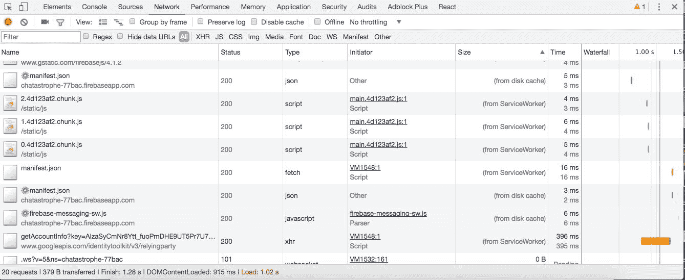
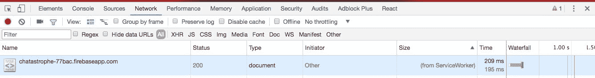

# 第十二章：准备好进行缓存

我们在应用程序的性能方面取得了巨大进展。我们的 JavaScript 现在根据应用程序的路由拆分成更小的块，并且在我们的应用程序有空闲时间时延迟加载不太重要的部分。我们还引入了渐进增强，尽快向用户展示内容，并学习了如何根据 RAIL 指标分析我们应用程序的性能。

然而，我们的 Web 应用程序仍然存在一个核心的低效问题。如果我们的用户离开我们的页面去其他地方（我知道，他们怎么敢），然后返回，我们又要重复同样的过程：下载`index.html`，下载不同的 JavaScript 包，下载图片等等。

我们要求用户每次访问页面时都下载完全相同的文件，一遍又一遍，而他们的设备有足够的内存来为我们存储这些文件。为什么我们不把它们保存到用户的设备上，然后根据需要检索呢？

欢迎来到缓存。在本章中，我们将涵盖以下内容：

+   什么是缓存？

+   缓存 API

+   在我们的服务工作者中使用缓存 API

+   测试我们的缓存

# 什么是缓存？

缓存是减少网络请求或计算的行为。后端缓存可能包括保存严格计算的结果（比如生成统计数据），这样当客户端第二次请求时，我们就不必再次进行计算。客户端缓存通常包括保存网络请求的响应，这样我们就不必再次发起请求。

正如我们之前所说，**服务工作者**是位于我们应用程序和网络之间的代码片段。这意味着它们非常适合缓存，因为它们可以拦截网络请求并用所请求的文件进行响应，从缓存中获取文件，而不是从服务器获取；节省了时间。

从更广泛的角度来看，你可以将缓存视为不必重复做同样的事情，使用内存来存储结果。

使用渐进式 Web 应用程序进行缓存的好处在于，由于缓存存储在设备内存中，无论网络连接如何，它都是可用的。这意味着无论设备是否连接，都可以访问缓存中存储的所有内容。突然间，我们的网站可以离线访问了。

对于在 Wi-Fi 区域之间切换的移动用户来说，便利因素可能是巨大的，使他们能够快速查看朋友的消息或一组方向（任何曾经没有漫游计划旅行的人都会有这种感觉）。这也不仅仅是纯离线用户的优势；对于网络时断时续或质量低劣的用户来说，能够在网络断断续续时继续工作而不丧失功能性是一个巨大的胜利。

因此，一举两得，我们可以提高我们的应用程序性能，使其对所有用户都可离线使用。然而，在我们开始在 Chatastrophe 中实施缓存之前（希望不会出现灾难），让我们先看一个关于缓存重要性的故事。

# 缓存的重要性

2013 年，美国政府推出了[`healthcare.gov/`](https://healthcare.gov/)，这是一个供公民注册平价医疗法案（也称为**奥巴马医改**）的网站。从一开始，该网站就饱受严重的技术问题困扰。对于成千上万的人来说，它根本无法加载。

公平地说，该网站承受着巨大的压力，在运营的第一个月就有大约 2,000 万次访问（来源-[`www.bbc.com/news/world-us-canada-24613022`](http://www.bbc.com/news/world-us-canada-24613022)），但这种压力是可以预料的。

如果你正在为数百万人注册医疗保健的网站（所有人同时开始），性能可能会是你首要考虑的问题，但最终，[`healthcare.gov/`](https://healthcare.gov/)未能交付。

作为对危机的回应（这威胁到了 ACA 的信誉），政府成立了一个团队来解决问题，有点像复仇者联盟，但是软件开发人员（所以根本不是复仇者联盟）。

考虑到该网站的目标，工程师们震惊地发现[`healthcare.gov/`](https://healthcare.gov/)没有实施基本的缓存。没有。因此，每当用户访问该网站时，服务器都必须处理网络请求并生成回复的信息。

这种缺乏缓存产生了复合效应。第一波用户堵塞了管道，所以第二波用户看到了加载屏幕。作为回应，他们刷新屏幕，发出了越来越多的网络请求，依此类推。

一旦 Devengers 实施了缓存，他们将响应时间缩短了四分之三。从那时起，该网站甚至能够处理高峰时段的流量。

Chatastrophe 可能还没有处理[`healthcare.gov/`](https://healthcare.gov/)级别的流量（但是……），但缓存总是一个好主意。

# 缓存 API

我们将使用**Web 缓存 API**进行缓存。

请注意，Mozilla 开发者网络将缓存 API 定义为**实验性技术**，截至 2017 年 8 月，它仅得到 Chrome、Firefox 和最新版本的 Opera 的支持。

API 规范有一些我们需要讨论的怪癖。首先，你可以在缓存中存储多个缓存对象。这样，我们就能够存储我们的缓存的多个版本，以我们喜欢的任何字符串命名。

也就是说，浏览器对于每个站点可以存储的数据有限制。如果缓存太满，它可能会简单地删除来自该站点的所有数据，因此我们最好存储最少量的数据。

然而，还有一个额外的困难。除非明确删除，否则缓存中的项目永远不会过期，因此如果我们不断尝试将新的缓存对象放入我们的缓存中，最终它会变得太满并删除所有内容。管理、更新和删除缓存对象完全取决于我们。换句话说，我们必须清理自己的混乱。

# 方法

我们将使用五种方法与缓存 API 交互：`open`、`addAll`、`match`、`keys`和`delete`。在接下来的内容中，**Caches**将指的是缓存 API 本身，而**Cache**指的是特定的缓存对象，以区分在单个缓存上调用的方法与 API 本身：

+   `Caches.open()`接受一个缓存对象名称（也称为缓存键）作为参数（可以是任何字符串），并创建一个新的缓存对象，或者打开同名的现有缓存对象。它返回一个`Promise`，并将缓存对象作为参数解析，然后我们可以使用它。

+   `Cache.addAll()`接受一个 URL 数组。然后它将从服务器获取这些 URL，并将结果文件存储在当前的缓存对象中。它的小伙伴是`Cache.add`，它可以用单个 URL 做同样的事情。

+   `Caches.match()`接受一个网络请求作为参数（我们将在接下来看到如何获取它）。它在缓存中查找与 URL 匹配的文件，并返回一个解析为该文件的`Promise`。然后我们可以返回该文件，从而取代向服务器发出请求的需要。它的大哥是`Caches.matchAll()`。

+   `Caches.keys()`返回所有现有缓存对象的名称。然后我们可以通过将它们的键传递给`Caches.delete()`来删除过时的缓存对象。

缓存 API 中的最后一个方法，我们这里不会使用，但可能会感兴趣的是`Caches.put`。这个方法接受一个网络请求并获取它，然后将结果保存到缓存中。如果你想缓存每个请求而不必提前定义 URL，这将非常有用。

# 资产清单

我们的构建过程会自动生成一个`asset-manifest.json`文件，其中列出了我们应用程序包含的每个 JavaScript 文件。它看起来像这样：

```jsx
{
  "main.js": "static/js/main.8d0d0660.js",
  "static/js/0.8d0d0660.chunk.js": "static/js/0.8d0d0660.chunk.js",
  "static/js/1.8d0d0660.chunk.js": "static/js/1.8d0d0660.chunk.js",
  "static/js/2.8d0d0660.chunk.js": "static/js/2.8d0d0660.chunk.js"
}
```

换句话说，我们有一个我们想要缓存的每个 JS 文件的列表。更重要的是，资产清单会使用每个文件的新哈希更新，因此我们不必担心保持其最新。

因此，我们可以使用资产清单中的 URL 以及`Cache.addAll()`方法一次性缓存所有我们的 JavaScript 资产。但是，我们还需要手动将我们的静态资产（图像）添加到缓存中，但是为了这样做，我们将不得不利用我们的服务工作者生命周期方法并进行一些基本设置。

# 设置我们的缓存

在本节中，我们将通过我们的三个主要服务工作者生命周期事件，并在每个事件中单独与我们的缓存进行交互。最终，我们将自动缓存所有静态文件。

不过，要警告一下——在开发中使用缓存，充其量是可以容忍的，最坏的情况下是令人恼火的。我们对着屏幕大喊：“为什么你不更新？”直到我们意识到我们的缓存一直在提供旧代码；这种情况发生在我们每个人身上。在本节中，我们将采取措施避免缓存我们的开发文件，并躲避这个问题，但是在未来，请记住奇怪的错误可能是由缓存引起的。

在计算机科学中只有两件难事：缓存失效和命名事物。- Phil Karlton

另一个方法：

在计算机科学中有两个难题：缓存失效、命名事物和 off-by-1 错误。- Leon Bambrick

# 安装事件

当我们的服务工作者安装时，我们希望立即设置我们的缓存，并开始缓存相关的资产。因此，我们的安装事件的逐步指南如下：

1.  打开相关的缓存。

1.  获取我们的资产清单。

1.  解析 JSON。

1.  将相关的 URL 添加到我们的缓存中，以及我们的静态资产。

让我们打开`firebase-messaging-sw.js`并开始工作！

如果你仍然有`console.log`事件监听器用于安装，很好！删除`console.log`；否则，设置如下：

```jsx
self.addEventListener('install', function() {

});
```

就在这个函数的上面，我们还会将我们的缓存对象名称分配给一个变量：

```jsx
const CACHE_NAME = ‘v1’;
```

这个名称可以是任何东西，但我们希望每次部署时都提高版本，以确保旧的缓存无效，并且每个人都能获得尽可能新鲜的代码。

现在，让我们按照清单来运行。

# 打开缓存

在我们开始正题之前，我们需要谈谈可扩展事件。

一旦我们的服务工作线程被激活和安装，它可能会立即进入“等待”模式--等待必须响应的事件发生。然而，我们不希望它在我们正在打开缓存的过程中进入等待模式，这是一个异步操作。因此，我们需要一种告诉我们的服务工作线程的方法，“嘿，直到缓存被填充，不要认为自己完全安装了。”

我们通过`event.waitUntil()`来实现这一点。这个方法延长了事件的生命周期（在这里是安装事件），直到其中的所有 Promise 都被解决。

它看起来如下所示：

```jsx
self.addEventListener('install', event => {
 event.waitUntil(
   // Promise goes here
 );
});
```

现在我们可以打开我们的缓存。我们的缓存 API 在全局变量 caches 中可用，所以我们可以直接调用`caches.open()`：

```jsx
const CACHE_NAME = 'v1';
self.addEventListener('install', event => {
 event.waitUntil(
   caches.open(CACHE_NAME)
     .then(cache => {
     });
 );
});
```

由于当前不存在名称为'v1'的缓存对象，我们将自动创建一个。一旦获得了该缓存对象，我们就可以进行第二步。

# 获取资产清单

获取资产清单听起来就像它听起来的那样：

```jsx
self.addEventListener('install', event => {
 event.waitUntil(
   caches.open(CACHE_NAME)
     .then(cache => {
       fetch('asset-manifest.json')
         .then(response => {
           if (response.ok) {

           }
         })
     });
 );
});
```

请注意，在开发中我们不应该有 asset-manifest；在继续之前，我们需要确保请求响应是正常的，以免抛出错误。

# 解析 JSON

我们的`asset-manifest.json`返回了一些 JSON，相当令人惊讶。让我们解析一下：

```jsx
self.addEventListener('install', event => {
 event.waitUntil(
   caches.open(CACHE_NAME)
     .then(cache => {
       fetch('asset-manifest.json')
         .then(response => {
           if (response.ok) {
             response.json().then(manifest => {

             });
           }
         })
     });
 );
});
```

现在我们有一个 manifest 变量，它是一个普通的 JavaScript 对象，与`asset-manifest.json`的内容相匹配。

# 将相关的 URL 添加到缓存

由于我们有一个 JavaScript 对象来访问 URL，我们可以挑选我们想要缓存的内容，但在这种情况下，我们想要一切，所以让我们遍历对象并获得一个 URL 数组：

```jsx
response.json().then(manifest => {
  const urls = Object.keys(manifest).map(key => manifest[key]);
})
```

我们还想缓存`index.html`和我们的图标，所以让我们推入`/`和`/assets/icon.png`：

```jsx
response.json().then(manifest => {
  const urls = Object.keys(manifest).map(key => manifest[key]);
  urls.push(‘/’);
  urls.push('/assets/icon.png');
})
```

现在，我们可以使用`cache.addAll()`将所有这些 URL 添加到缓存中。请注意，我们指的是我们打开的特定缓存对象，而不是一般的 caches 变量：

```jsx

self.addEventListener('install', event => {
  event.waitUntil(
    caches.open(CACHE_NAME).then(cache => {
      fetch('asset-manifest.json').then(response => {
        if (response.ok) {
          response.json().then(manifest => {
            const urls = Object.keys(manifest).map(key => manifest[key]);
            urls.push('/');
            urls.push('/assets/icon.png');
            cache.addAll(urls);
          });
        }
      });
    })
  );
});
```

完成！我们已经进行了缓存，但目前还不值得多少，因为我们还没有办法从缓存中检索项目。让我们接着做。

# 获取事件

当我们的应用程序从服务器请求文件时，我们希望在服务工作线程内拦截该请求，并用缓存的文件进行响应（如果存在）。

我们可以通过监听 fetch 事件来实现这一点，如下所示：

```jsx
self.addEventListener('fetch', event => {

});
```

作为参数传递的事件有两个有趣的属性。第一个是`event.request`，它是目标 URL。我们将使用它来查看我们的缓存中是否有该项，但事件还有一个名为`respondWith`的方法，基本上意味着“停止这个网络请求的进行，并用以下内容回应它。”

这里是不直观的部分--我们实质上是在调用`event.respondWith`后立即取消了这个 fetch 事件。这意味着如果我们的缓存中没有该项，我们必须开始另一个 fetch 请求（幸运的是，这不会触发另一个事件监听器；这里没有递归）。这是需要记住的一点。

因此，让我们调用`event.respondWith`，然后使用`caches.match`来查看我们是否有与 URL 匹配的文件：

```jsx
self.addEventListener('fetch', event => {
 event.respondWith(
   caches.match(event.request).then(response => {

   });
 );
});
```

在这种情况下，响应要么是问题文件，要么是空。如果是文件，我们就返回它；否则，我们发起另一个 fetch 请求并返回其结果。以下是一行版本：

```jsx
self.addEventListener('fetch', event => {
  event.respondWith(
    caches.match(event.request).then(response => {
      return response || fetch(event.request);
    })
  );
});
```

就是这样！现在我们资产清单中的文件的所有 fetch 请求都将首先进入缓存，只有在该文件不在缓存中时才会进行实际的网络请求。

# 激活事件

激活事件是我们三个 service worker 事件中发生的第一个，所以可能看起来奇怪我们最后才谈论它，但这是有原因的。

激活事件是我们进行缓存清理时发生的。我们确保清除任何过期的缓存对象，以便我们的浏览器缓存不会变得太混乱并被终止。

为此，我们基本上删除任何名称与`CACHE_NAME`的当前值不匹配的缓存对象。

“但是，Scott，”你说，“如果我们的 service worker 没有正确更新，并且仍然包含旧的`CACHE_NAME`怎么办？”这是一个有效的观点。然而，正如所说的，我们的 service worker 应该在它与上一个 service worker 之间有字节大小的差异时自动更新，所以这不应该成为一个问题。

这次我们的过程不那么密集，但我们仍然来分解一下：

1.  获取缓存名称列表。

1.  循环遍历它们。

1.  删除任何键不匹配`CACHE_NAME`的缓存。

一个快速提醒--如果你想将你的 CSS 保存在一个单独的缓存中，你可以拥有多个缓存。这样做没有真正的好处，但你可能喜欢有组织的东西。一个可行的方法是创建一个`CACHE_NAMES`对象，如下所示：

```jsx
const VERSION = ‘v1’
const CACHE_NAMES = {
 css: `css-${VERSION}`,
 js: `js-${VERSION}`
};
```

然后，在随后的步骤中，我们将不得不迭代该对象；只是要记住的一些事情。

好的，让我们开始工作。

# 获取缓存名称列表

同样，我们必须在完成此异步代码时使用`event.waitUntil()`。这意味着我们最终将不得不返回一个`Promise`给`event.waitUntil()`，这将影响我们编写代码的方式。

首先，我们通过调用`cache.keys()`来获取缓存键的列表，这会返回一个 promise：

```jsx
self.addEventListener('activate', event => {
 event.waitUntil(
   cache.keys().then(keyList => {

   })
 );
});
```

# 循环遍历它们

我们需要遍历每个键，并调用`caches.delete()`，如果它不匹配我们的`CACHE_NAME`。由于我们可能有多个要删除的缓存，并且多次调用`caches.delete()`，它本身返回一个`Promise`，我们将在`keyList`上映射，并使用`Promise.all()`返回一组`Promise`。

它看起来是这样的：

```jsx
self.addEventListener('activate', event => {
 event.waitUntil(
   caches.keys().then(keyList => {
     Promise.all(keyList.map(key => {

     }));
   })
 );
});
```

删除任何键不匹配`CACHE_NAME`的缓存。

一个简单的`if`语句，然后调用`caches.delete()`，我们就完成了：

```jsx
self.addEventListener('activate', event => {
 event.waitUntil(
   caches.keys().then(keyList => {
     Promise.all(
       keyList.map(key => {
         if (key !== CACHE_NAME) {
           return caches.delete(key);
         }
       })
     );
   })
 );
});
```

现在我们的缓存将恰好是我们想要的大小（仅在缓存对象上），并且每次我们的服务工作者激活时都会被检查。

因此，我们的缓存保持更新的机制是固有的。每次更新 JavaScript 时，我们都应该更新服务工作者中的版本。这会导致我们的服务工作者更新，从而重新激活，触发对先前缓存的检查和失效；一个美丽的系统。

# 测试我们的缓存

使用**`yarn start`**快速在本地运行您的应用程序，以检查是否有任何明显的错误（拼写错误等），如果一切正常，请启动**`yarn deploy`**。

打开您的实时应用程序和 Chrome DevTools。在应用程序|服务工作者下关闭更新后重新加载，刷新一次，然后转到网络选项卡。您应该会看到类似以下的内容：

如果这不起作用，请尝试取消注册应用程序|服务工作者下的任何服务工作者，然后重新加载两次。

关键点是（来自服务工作者）在我们的 JavaScript 文件旁边。我们的静态资产是由我们的服务工作者缓存提供的，如果您滚动到网络选项卡的顶部，您将看到这样的情况：



文档本身是由服务工作者提供的，这意味着我们可以在任何网络条件下运行我们的应用程序，甚至是离线的；让我们试试。点击网络选项卡顶部的离线复选框，然后点击重新加载。

如果一切顺利，我们的应用程序的加载时间不应该有任何区别，即使我们没有网络连接！我们的应用程序仍然可以加载，我们的聊天消息也是如此。

消息加载是 Firebase 数据库的一个好处，不是我们的功劳，但是从缓存中加载文档，这才是真正的成就！

当然，我们的用户体验并没有很好地为离线访问做准备。我们应该有一种方式来通知用户他们当前处于离线状态，也许可以通过某种对话框，但我们将其作为一个目标。

# 总结

我们实现了渐进式梦想——一个可以在任何网络条件下工作的应用程序，包括完全没有网络的情况。缓存是一个复杂的主题，所以为自己的成就鼓掌吧。

然而，在我们过于兴奋并将我们的原型提交给 Chatastrophe 董事会之前，让我们确保我们做对了事情。我们需要一种方式来在我们的项目上盖上一个橡皮图章，上面写着“批准！这是一个渐进式网络应用！”。

幸运的是，一个名为 Google 的小型初创公司已经给了我们一个可以做到这一点的工具。

接下来是对我们完成的渐进式网络应用进行审计，也就是胜利之旅。
