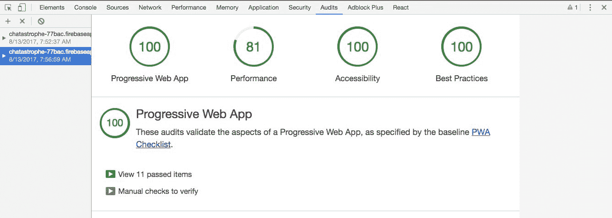
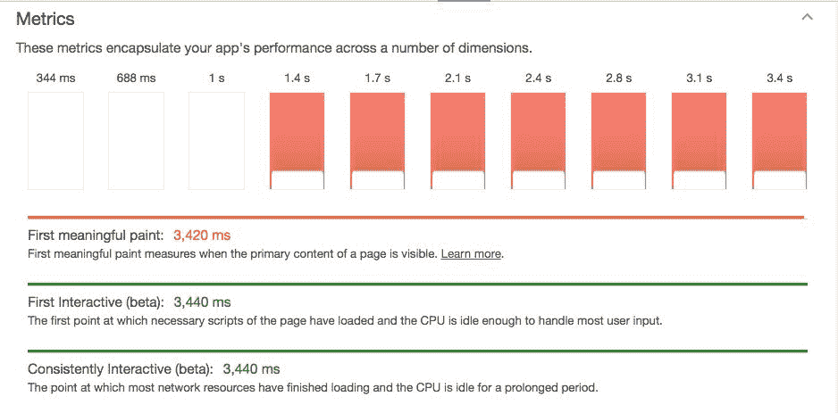

# 第十三章：审核我们的应用程序

**审核**是确认我们的渐进式 Web 应用程序是否真正符合 PWA 标准的一种方式。这种审核是我们检查工作并确保我们的应用在 PWA 功能方面尽可能好的重要最后一步。

如前所述，渐进式 Web 应用程序的最大支持者是谷歌。他们的 Chrome 浏览器和 Android 操作系统不仅是所有 PWA 友好的，而且谷歌还非常努力地教育开发人员如何以及为什么构建 PWA。当您进入 PWA 的世界时（超出本书范围），您可能经常会查阅他们的文档。

然而，谷歌提供了另一种引领渐进式网络前进的方式。为了确保您的网页或应用程序的质量，他们发布了一套工具来衡量您的网站是否符合一组标准。他们用来做到这一点的主要工具称为 Lighthouse。

以下是本章将涵盖的内容：

+   Lighthouse 是什么？

+   它遵循哪些标准？

+   DevTools 中的审核标签是什么？

+   运行我们的第一次审核

+   评估读数

+   使用 Lighthouse CLI

# Lighthouse 是什么？

简而言之，**Lighthouse**是一个工具，运行您的网站并告诉您基于一组特定标准它到底有多渐进式。

它通过尝试在各种条件下加载页面（包括 3G 网络和离线），并评估页面的响应方式来实现。它还检查一些 PWA 的常规功能，例如启动画面和服务工作者。

# 标准

以下标准本质上是 Lighthouse 在查看您的应用程序时遵循的一份清单。每个“测试”都是一个简单的是/否。如果您通过所有测试，您将获得 100 分。这就是我们想要的！

以下是 2017 年 8 月的标准列表：

+   **注册服务工作者**：服务工作者是使您的应用能够使用许多渐进式 Web 应用程序功能的技术，例如离线、添加到主屏幕和推送通知。

+   **离线时响应 200**：如果您正在构建渐进式 Web 应用程序，请考虑使用服务工作者，以便您的应用程序可以离线工作。

+   当 JavaScript 不可用时包含一些内容：即使只是警告用户 JavaScript 是必需的，您的应用程序也应在 JavaScript 被禁用时显示一些内容。

+   配置自定义启动画面：您的应用将构建一个默认的启动画面，但满足这些要求可以保证一个高质量的启动画面，让用户从点击主屏幕图标到应用的首次绘制有一个流畅的过渡。

+   使用 HTTPS：所有网站都应该使用 HTTPS 进行保护，即使不处理敏感数据的网站也是如此。HTTPS 可以防止入侵者篡改或被动监听您的应用与用户之间的通信，并且是 HTTP/2 和许多新的网络平台 API 的先决条件。

+   将 HTTP 流量重定向到 HTTPS：如果您已经设置了 HTTPS，请确保将所有 HTTP 流量重定向到 HTTPS。

+   3G 网络下的页面加载速度足够快：如果**交互时间**短于 10 秒，即满足 PWA 基准检查表中的定义（来源--[`developers.google.com/web/progressive-web-apps/checklist`](https://developers.google.com/web/progressive-web-apps/checklist)），则满足此标准。需要进行网络限速（具体来说，预期的 RTT 延迟>=150 RTT）。

+   用户可以被提示安装 Web 应用：虽然用户可以手动将您的网站添加到其主屏幕，但如果满足各种要求并且用户对您的网站有适度的参与度，提示（也称为应用安装横幅）将主动提示用户安装应用。

+   地址栏与品牌颜色匹配：浏览器地址栏可以进行主题设置以匹配您的网站。当用户浏览网站时，``theme-color``元标签将升级地址栏，一旦添加到主屏幕后，清单主题颜色将在整个网站上应用相同的主题。

+   具有带有宽度或初始缩放的<meta name="viewport">标签：添加`viewport`元标签以优化您的应用在移动屏幕上的显示。

+   内容在视口中正确调整大小：如果您的应用内容的宽度与视口的宽度不匹配，您的应用可能没有针对移动屏幕进行优化。

# 审核标签

直到 Chrome 60 发布之前，Lighthouse 只能作为 Chrome 扩展程序或命令行工具的测试版版本。然而，现在它在 Chrome DevTools 中有了自己的位置，在新的**审核标签**中。

在审核标签中，除了 Lighthouse PWA 审核之外，还包括一系列其他基准测试，包括性能和网络最佳实践。我们将专注于 PWA 测试和性能测试，但也可以随意运行其他测试。

审计选项卡的另一个有用功能是能够保存先前的审计，以便在改进应用程序时获得应用程序的历史记录。

好了，说够了。让我们继续进行我们的第一次审计！

# 我们的第一次审计

打开您的 DevTools，导航到审计选项卡，然后单击运行审计。

应该需要几秒钟，然后给您一个关于我们网站外观的简要摘要，鼓掌。我们的渐进式 Web 应用程序有多好呢？：



一点也不糟糕。事实上，在 PWA 类别中没有比这更好的了。给自己一个鼓励，也许是一个成功的高五。让我们评估读数，然后决定是否要继续前进或者争取在所有类别中达到 100%。

请注意，由于 Lighthouse 正在积极开发中，您的分数可能与上述不符合新的标准。在这种情况下，我鼓励您查看 Lighthouse 所抱怨的内容，并看看是否可以解决问题以达到“100”分。

# 评估读数

如果您的结果与前面的不符，有两种可能性：

+   Chrome 添加了我们的应用程序无法满足的新测试。正如我们多次提到的，PWA 是一种不断发展的技术，所以这是完全可能的。

+   您在书中错过了一些步骤；最好的人也会发生这种情况。

无论哪种情况，我都鼓励您进行调查并尝试解决根本问题。谷歌为每个测试标准提供了文档，这是一个很好的起点。

在我们的情况下，我们唯一没有通过的测试是性能。让我们看看我们没有通过的原因：



正如我们在这里看到的，我们的第一个有意义的绘制大约需要三秒钟。请注意，我们的应用程序外壳不被视为有意义的绘制，尽管它确实改善了页面的感知性能。Chrome 足够聪明，知道只有当我们的“登录”表单或“聊天”容器出现时，我们才真正在屏幕上有有意义的内容--用户实际可以使用的东西。

尽管如此，显示有意义的内容需要超过三秒的原因是，我们需要等待我们的 JavaScript 加载，启动，然后加载我们的用户当前是否已登录，然后加载聊天消息或重定向到登录。这是很多后续步骤。

这是一个可以解决的问题吗？也许可以。我们可以设置一些方式，在 React 加载之前找出用户是否已登录（换句话说，将一些 JavaScript 移出我们的主应用程序）。我们可以将`chat`容器和`login`表单都移出 React，以确保它们可以在库加载之前呈现，然后想出一些方法在 React 初始化后替换它们（挑战在于替换输入而不擦除用户已开始输入的任何内容）。

所有提到的挑战都属于优化关键渲染路径的范畴。对于任何想深入了解性能优化的人，我鼓励你去尝试一下。然而，从商业角度来看，这对于一点收益来说是很多（可能有错误）优化。根据先前的基准测试，我们的用户已经在大约 400 毫秒内接收到内容，并且完整的应用程序在三秒多一点的时间内加载完成。请记住，由于缓存，大多数用户在随后的访问中将获得更快的加载时间。

我们较低的性能得分实际上展示了使用诸如 React 之类的庞大 JavaScript 库构建高性能应用程序的成本效益。对于那些对更轻量级替代方案感兴趣的人，在下一章节中查看关于 Preact 的部分，这可能是解决前述问题的一个可能方案。

# 使用 Lighthouse CLI

从审计选项卡运行测试非常简单易行，但我们如何确保在将应用程序推送到线上之前保持应用程序的质量呢？

答案是将 Lighthouse 纳入我们的部署流程，并使用它自动评估我们的构建。这类似于在我们执行`yarn deploy`时运行测试套件。幸运的是，谷歌为此目的提供了 Lighthouse CLI。

让我们使用以下命令进行安装：

```jsx
yarn add --dev lighthouse
```

在这里，我们的目标是在执行`yarn deploy`时在我们的应用程序上运行 Lighthouse。为此，我们必须制作一个自定义部署脚本。

如果打开我们的`package.json`，你会在`scripts`下看到以下内容：

```jsx
 "scripts": {
   "build": "node_modules/.bin/webpack --config webpack.config.prod.js",
   "start": "node_modules/.bin/webpack-dev-server",
   "deploy": "npm run build && firebase deploy"
 },
```

让我们将其更改为以下内容：

```jsx
 "scripts": {
   "build": "node_modules/.bin/webpack --config webpack.config.prod.js",
   "start": "node_modules/.bin/webpack-dev-server",
   "deploy": "npm run build && node scripts/assess.js && firebase deploy"
 },
```

我们将使用 node 来运行一个用 JavaScript 编写的自定义构建脚本。在你的目录根目录下创建`scripts/文件夹`，以及`assess.js`文件。

我们的流程将如下：

1.  在本地提供我们的`build`文件夹，以便在浏览器中运行。

1.  使用 Lighthouse 评估提供的页面。

1.  在控制台记录结果。

让我们添加我们需要用来提供我们的`build`文件夹的包：

```jsx
yarn add --dev serve
```

请注意，鉴于我们永远不会在生产中使用它们，我们将这个和`lighthouse`保存为`dev`依赖项。

# 服务我们的构建文件夹

在我们的新`scripts/assess.js`中，要求`serve`包：

```jsx
const serve = require('serve');
```

我们只想要在端口 5000 上`serve`我们新编译的`build`文件夹，看起来是这样的：

```jsx
const server = serve('./build', {
 port: 5000
});
```

我们可以随时通过运行`server.stop()`来停止服务器。我们会在显示分数后这样做。

# 使用 Lighthouse 来评估提供的页面

现在，让我们在`assess.js`的顶部要求另外两个工具：

```jsx
const lighthouse = require('lighthouse');
const chromeLauncher = require('lighthouse/chrome-launcher');
```

`chromeLauncher`将允许我们打开 Chrome 到目标页面，然后运行 Lighthouse。让我们创建一个名为`launchChromeAndRunLighthouse`的函数来做到这一点：

```jsx
function launchChromeAndRunLighthouse(url, flags= {}, config = null) {

}
```

我们可以选择传入一些标志和配置，这里我们不会使用（标志可以用来在过程展开时打开日志记录）。

在函数内部，我们将启动 Chrome，设置 Lighthouse 运行的端口，然后运行它。最后，我们将停止 Chrome：

```jsx
function launchChromeAndRunLighthouse(url, flags = {}, config = null) {
 return chromeLauncher.launch().then(chrome => {
   flags.port = chrome.port;
   return lighthouse(url, flags, config).then(results =>
     chrome.kill().then(() => results));
 });
}
```

顺便说一句，这个函数直接来自 Lighthouse CLI 文档。

好了，现在是最后一步了。我们将使用我们选择的 URL 运行我们的函数（将其放在文件底部，在`serve`命令下方）：

```jsx
launchChromeAndRunLighthouse('http://localhost:5000', {}).then(results => {
  server.stop();
});
```

一旦我们有了结果，我们就停止服务器，但我们需要正确显示我们的结果。

# 记录结果

结果变量以对象的形式出现。它提供了每个类别的详细分数，但我们只关心有问题的地方。在我们的函数调用之前，让我们添加一个分数截止线：

```jsx
const CUTOFF = 90
launchChromeAndRunLighthouse('http://localhost:5000', {}).then(results => {
```

我们将使用这个来说“只显示得分低于 90/100 的结果”。

登出结果的过程并不是很令人兴奋，所以我们不会在这里深入讨论。以下是完整的文件：

```jsx
const serve = require('serve');
const lighthouse = require('lighthouse');
const chromeLauncher = require('lighthouse/chrome-launcher');

function launchChromeAndRunLighthouse(url, flags = {}, config = null) {
 return chromeLauncher.launch().then(chrome => {
   flags.port = chrome.port;
   return lighthouse(url, flags, config).then(results =>
     chrome.kill().then(() => results));
 });
}

const server = serve('./build', {
 port: 5000
})

const CUTOFF = 90

launchChromeAndRunLighthouse('http://localhost:5000', {}).then(results => {
 score = results.score
 const catResults = results.reportCategories.map(cat => {
   if (cat.score < CUTOFF) {
     cat.audits.forEach(audit => {
       if (audit.score < CUTOFF) {
         const result = audit.result
         if (result.score) {
           console.warn(result.description + ': ' + result.score)
         } else {
           console.warn(result.description)
         }
         if (results.displayValue) {
           console.log('Value: ' + result.displayValue)
         }
         console.log(result.helpText)
         console.log(' ')
       }
     })
   }
   return cat
 })
 catResults.forEach(cat => {
   console.log(cat.name, cat.score)
 })
 server.stop()
});
```

如果您从终端运行`node scripts/assess.js`，您应该会看到一个问题区域的列表，以及每个类别的最终得分。通过运行`yarn deploy`将所有内容汇总在一起，您将在 Firebase 部署之前看到这些分数。

现在我们有了一个简单而干净的方法来随时了解我们应用程序的状态，而不必自己启动网站来测试它。

# 总结

完成！我们对我们的应用进行了全面审查，它在每个类别都表现出色。我们有一个可用的渐进式 Web 应用程序。在本章中，我们了解了 Lighthouse 是什么，以及为什么验证我们的 PWA 很重要。我们还将其作为部署过程的一部分，以确保我们的应用程序继续符合质量标准。现在我们可以认为我们的应用在各个方面都已经完成。

接下来，我们将讨论后续步骤以及增加对 PWA 知识的有用资源，但首先，关于将我们的应用提交给你的朋友和 Chatastrophe 委员会。
