# 第九章：Apollo 和 GraphQL

在本章中，将涵盖以下配方：

+   创建我们的第一个 GraphQL 服务器

+   使用 Apollo 和 GraphQL 创建 Twitter 时间线

# 介绍

GraphQL 是一种可以与任何数据库一起使用的应用层查询语言。它也是开源的（MIT 许可证），由 Facebook 创建。它与 REST 的主要区别在于 GraphQL 不使用端点，而是使用查询，并且受大多数服务器语言支持，如 JavaScript（Node.js），Go，Ruby，PHP，Java 和 Python。

现在让我们来看看 GraphQL 和 REST 之间的主要区别。

GraphQL：

+   查询可读

+   您可以在不使用版本的情况下演变 API

+   类型系统

+   您可以避免进行多次往返以获取相关数据

+   很容易限制我们需要的数据集

REST：

+   在 REST 中，一切都是资源

+   REST 是无模式的

+   您需要版本来演变 API

+   很难限制我们需要的数据集

+   如果您需要来自不同资源的数据，您需要进行多个请求

# 创建我们的第一个 GraphQL 服务器

对于这个配方，我们将创建一个联系人列表，其中我们将保存我们朋友的姓名，电话和电子邮件地址。

# 准备工作

我们需要做的第一件事是为我们的项目创建一个目录并初始化一个新的`package.json`文件，安装`express`，`graphql`和`express-graphql`：

```jsx
 mkdir contacts-graphql
 cd contacts-graphql
 npm init --yes
 npm install express graphql express-graphql babel-preset-env
 npm install -g babel-cli
```

我们需要安装`babel-preset-env`和`babel-cli`以在 Node 中使用 ES6 语法。此外，我们需要创建一个`.babelrc`文件：

```jsx
  {
    "presets": ["env"]
  }
```

文件：.babelrc

# 如何做...

让我们创建我们的第一个 GraphQL 服务器：

1.  首先，我们需要为我们的 Express 服务器创建一个`index.js`文件：

```jsx
  import express from 'express';

  const app = express();

  app.listen(3000, () => console.log('Running server on port 3000'));
```

文件：index.js

1.  如果您在终端中运行`babel-node index.js`，您应该能够看到运行在端口 3000 上的节点服务器：

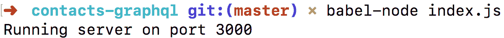

1.  现在我们需要包含我们的`express-graphql`库，并从`graphql`导入`buildSchema`方法：

```jsx
    import express from 'express';
    import expressGraphQL from 'express-graphql';
    import { buildSchema } from 'graphql';

    const app = express();

    app.listen(3000, () => console.log('Running server on port 3000'));
```

文件：index.js

1.  一旦我们有了`expressGraphQL`和`buildSchema`，让我们用我们的第一个查询创建我们的第一个 GraphQL 服务器：

```jsx
  // Dependencies
  import express from 'express';
  import expressGraphQL from 'express-graphql';
  import { buildSchema } from 'graphql';

  // Express Application
  const app = express();

  // Creating our GraphQL Schema
  const schema = buildSchema(`
    type Query {
      message: String
    }
  `);

  // Root has the methods we will execute to get the data
  const root = {
    message: () => 'First message'
  };

  // GraphQL middleware
  app.use('/graphql', expressGraphQL({
    schema,
    rootValue: root,
    graphiql: true // This enables the GraphQL browser's IDE
  }));

  // Running our server
  app.listen(3000, () => console.log('Running server on port 3000'));
```

文件：index.js

1.  现在让我们为我们的联系人列表创建数据文件。我们可以创建一个 data 目录和一个`contacts.json`文件：

```jsx
    {
      "contacts": [
        {
          "id": 1,
          "name": "Carlos Santana",
          "phone": "281-323-4146",
          "email": "carlos@milkzoft.com"
        },
        {
          "id": 2,
          "name": "Cristina",
          "phone": "331-251-5673",
          "email": "cristina@gmail.com"
        },
        {
          "id": 3,
          "name": "John Smith",
          "phone": "415-307-4382",
          "email": "john.smith@gmail.com"
        },
        {
          "id": 4,
          "name": "John Brown",
          "phone": "281-323-4146",
          "email": "john.brown@gmail.com"
        }
      ]
    }
```

文件：data/contacts.json

1.  现在我们需要添加获取数据的方法（`getContact`和`getContacts`）：

```jsx
      // Dependencies
      import express from 'express';
      import expressGraphQL from 'express-graphql';
      import { buildSchema } from 'graphql';

      // Contacts Data
      import { contacts } from './data/contacts';

      // Express Application
      const app = express();

      // Creating our GraphQL Schema
      const schema = buildSchema(`
        type Query {
          contact(id: Int!): Contact
          contacts(name: String): [Contact]
        }

        type Contact {
          id: Int
          name: String
          phone: String
          email: String
        }
      `);

      // Data methods
      const methods = {
        getContact: args => {
          const { id } = args;

          return contacts.filter(contact => contact.id === id)[0];
        },
        getContacts: args => {
          const { name = false } = args;

          // If we don't get a name we return all contacts
          if (!name) {
            return contacts;
          }

          // Returning contacts with same name...
          return contacts.filter(
            contact => contact.name.includes(name)
          );
        }
      };

      // Root has the methods we will execute to get the data
      const root = {
        contact: methods.getContact,
        contacts: methods.getContacts
      };

      // GraphQL middleware
      app.use('/graphql', expressGraphQL({
        schema,
        rootValue: root,
        graphiql: true // This enables the GraphQL GUI
      }));

      // Runnign our server
      app.listen(3000, () => console.log('Running server on port 3000'));
```

文件：index.js

# 它是如何工作的...

如果你运行服务器并转到 URL `http://localhost:3000/graphql`，你将看到 GraphiQL IDE，并且默认情况下会有一个 message 查询，如果你点击播放按钮，你将观察到带有消息“First message”的数据：

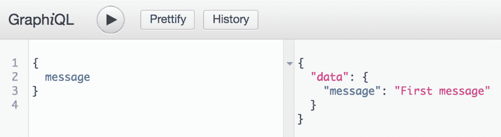

现在在 GraphiQL IDE 中，我们需要创建一个查询，并为我们的`contactId`添加一个查询变量以获取单个联系人：

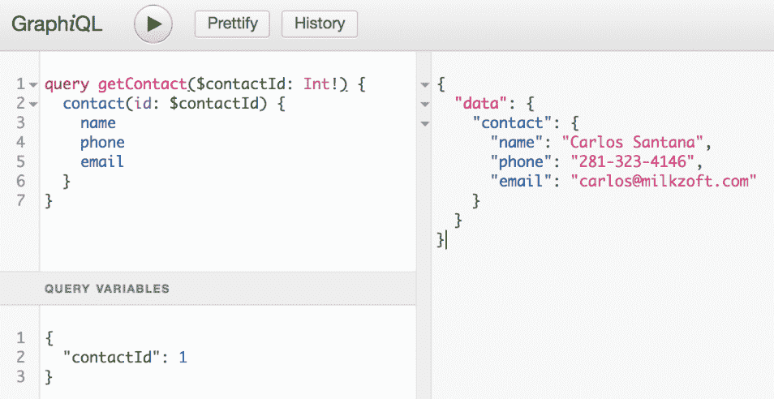

现在对于我们的`getContacts`查询，我们需要传递`contactName`变量：

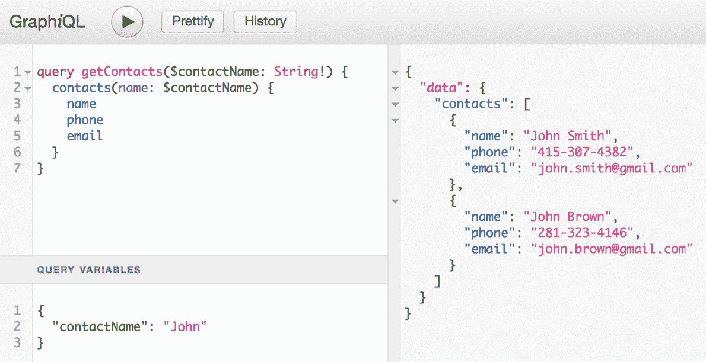

正如你所看到的，如果我们发送`John`作为`contactName`，查询将返回我们拥有的两行名称为`John Smith`和`John Brown`的联系人。此外，如果我们发送一个空值，我们将得到所有的联系人：

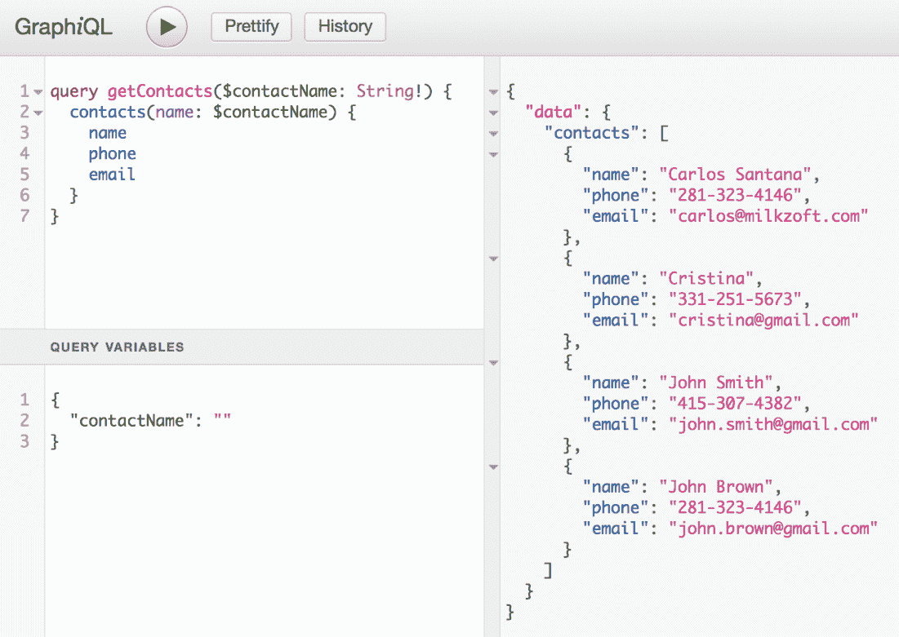

此外，我们可以开始使用 fragments，它们用于在`queries`，`mutations`和`subscriptions`之间共享字段：

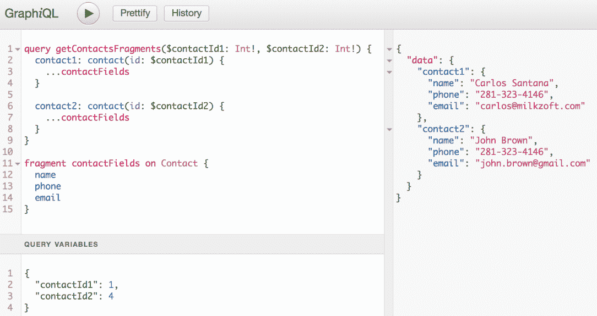

正如你所看到的，我们用我们想要获取的字段定义了我们的 fragment，然后在两个查询（`contact1`和`contact2`）中，我们重复使用了相同的 fragment（`contactFields`）。在查询变量中，我们传递了我们想要获取数据的联系人的值。

# 还有更多...

Mutation 也是必不可少的，因为它们帮助我们修改数据。让我们实现一个 mutation，并通过传递 ID 和我们想要更改的字段来更新一个联系人。

我们需要添加我们的 mutation 定义并创建更新联系人的函数；我们的代码应该如下所示：

```jsx
  // Dependencies
  import express from 'express';
  import expressGraphQL from 'express-graphql';
  import { buildSchema } from 'graphql';

  // Contacts Data
  import { contacts } from './data/contacts';

  // Express Application
  const app = express();

  // Creating our GraphQL Schema
  const schema = buildSchema(`
    type Query {
      contact(id: Int!): Contact
      contacts(name: String): [Contact]
    }

    type Mutation {
      updateContact(
 id: Int!, 
 name: String!, 
 phone: String!, 
 email: String!
      ): Contact
    }

    type Contact {
      id: Int
      name: String
      phone: String
      email: String
    }
  `);

  // Data methods
  const methods = {
    getContact: args => {
      const { id } = args;

      return contacts.filter(contact => contact.id === id)[0];
    },
    getContacts: args => {
      const { name = false } = args;

      // If we don't get a name we return all contacts
      if (!name) {
        return contacts;
      }

      // Returning contacts with same name...
      return contacts.filter(contact => contact.name.includes(name));
    },
    updateContact: ({ id, name, phone, email }) => {
      contacts.forEach(contact => {
        if (contact.id === id) {
          // Updating only the fields that has new values...
          contact.name = name || contact.name;
          contact.phone = phone || contact.phone;
          contact.email = email || contact.email;
        }
      });

      return contacts.filter(contact => contact.id === id)[0];
    }
  };

  // Root has the methods we will execute to get the data
  const root = {
    contact: methods.getContact,
    contacts: methods.getContacts,
    updateContact: methods.updateContact
  };

  // GraphQL middleware
  app.use('/graphql', expressGraphQL({
    schema,
    rootValue: root,
    graphiql: true // This enables the GraphQL GUI
  }));

  // Running our server
  app.listen(3000, () => console.log('Running server on port 3000'));
```

文件：index.js

现在让我们在 GraphiQL 中创建我们的 mutation 并更新一个联系人：

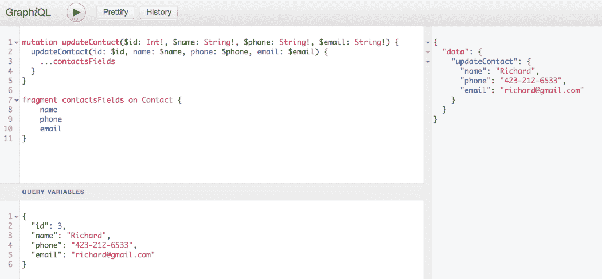

# 使用 Apollo 和 GraphQL 创建 Twitter 时间线

Apollo 是一个用于 GraphQL 的开源基础设施。还有其他处理 GraphQL 的库，比如 Relay 和 Universal React Query Library (URQL)。这些库的主要问题是它们主要用于 React 应用程序，而 Apollo 可以与任何其他技术或框架一起使用。

# 准备工作

对于这个示例，我们将使用`create-react-app`创建一个新的 React 应用程序：

```jsx
 create-react-app apollo
```

我们需要通过执行以下命令来弹出配置：

```jsx
 npm run eject
```

`eject`命令将把`react-scripts`的所有配置带到你的本地项目中（Webpack 配置）。

现在我们需要安装以下包：

```jsx
 npm install apollo-boost graphql graphql-tag moment mongoose react-
  apollo
```

我们还需要安装这些开发包：

```jsx
 npm install --save-dev babel-preset-react babel-preset-stage-0
```

最后，我们需要创建我们的 tweet 模型：

```jsx
 "resolutions": {
   "graphql": "0.13.2"
 }
```

此外，我们需要在我们的`package.json`中删除`babel`节点。

```jsx
 "babel": {
   "presets": [
     "react-app"
   ]
 }
```

文件：package.json

然后，最后，我们需要创建一个`.babelrc`文件，其中包含以下内容：

```jsx
 {
   "presets": ["react", "stage-0"]
 }
```

现在是真相的时刻！如果您正确地按照所有步骤进行了操作，您应该看到 GraphiQL IDE 在`http://localhost:5000/graphiql`上运行，但可能会出现以下错误：

您需要安装并运行 MongoDB 才能使用此项目。如果您不知道如何做到这一点，您可以查看第八章*，使用 MongoDB 和 MySQL 创建 Node.js API*。

# 文件：.babelrc

让我们开始后端服务器：

1.  首先，在`apollo`项目内（我们使用`create-react-app`创建的项目），我们需要创建一个名为`backend`的新目录，初始化一个`package.json`文件，并在`src`文件夹内创建：

```jsx
 cd apollo
 mkdir backend
 cd backend
 npm init -y
 mkdir src
```

1.  现在我们需要安装这些依赖项：

```jsx
 npm install cors express express-graphql graphql graphql-tools 
      mongoose nodemon babel-preset-es2015

 npm install -g babel-cli
```

1.  在我们的`package.json`文件中，我们需要修改我们的启动脚本以使用`nodemon`：

```jsx
      "scripts": {
        "start": "nodemon src/app.js --watch src --exec babel-node 
        --presets es2015"
      }
```

然后我们需要添加一个`resolutions`节点来指定我们将要使用的 GraphQL 的确切版本。这是为了避免版本冲突。当前版本的`graphql`是`0.13.2`。当然，您需要在阅读本文时指定最新版本的 GraphqQL：

1.  然后我们需要创建我们的`app.js`文件，在其中我们将创建我们的 GraphQL 中间件：

```jsx
  // Dependencies
  import express from 'express';
  import expressGraphQL from 'express-graphql';
  import cors from 'cors';
  import graphQLExpress from 'express-graphql';
  import { makeExecutableSchema } from 'graphql-tools';

  // Query
  import { typeDefs } from './types/Query';
  import { resolvers } from './types/Resolvers';

  // Defining our schema with our typeDefs and resolvers
  const schema = makeExecutableSchema({
    typeDefs,
    resolvers
  });

  // Intializing our express app
  const app = express();

  // Using cors
  app.use(cors());

  // GraphQL Middleware
  app.use('/graphiql', graphQLExpress({
    schema,
    pretty: true,
    graphiql: true
  }));

  // Listening port 5000
  app.listen(5000);

  console.log('Server started on port 5000');
```

文件：src/app.js

1.  正如你所看到的，我们已经从`types`文件夹中包含了我们的 typeDefs 和 resolvers，所以让我们创建这个目录并创建我们的 Query 文件：

```jsx
 export const typeDefs = [`
    # Scalar Types (custom type)
    scalar DateTime

    # Tweet Type (should match our Mongo schema)
    type Tweet {
      _id: String
      tweet: String
      author: String
      createdAt: DateTime
    }

    # Query
    type Query {
      # This query will return a single Tweet
      getTweet(_id: String): Tweet 

      # This query will return an array of Tweets
      getTweets: [Tweet]
    }

    # Mutations
    type Mutation {
      # DateTime is a custom Type
      createTweet(
        tweet: String,
        author: String,
        createdAt: DateTime 
      ): Tweet

      # Mutation to delete a Tweet
      deleteTweet(_id: String): Tweet

      # Mutation to update a Tweet (! means mandatory).
      updateTweet(
        _id: String!,
        tweet: String!
      ): Tweet
    }

    # Schema
    schema {
      query: Query
      mutation: Mutation
    }
  `];
```

创建我们的 GraphQL 后端服务器

1.  文件：src/types/Query.js

```jsx
 // Dependencies
 import { GraphQLScalarType } from 'graphql';
 // TweetModel (Mongo Schema)
 import TweetModel from '../model/Tweet';
 // Resolvers
 export const resolvers = {
    Query: {
      // Receives an _id and returns a single Tweet.
      getTweet: _id => TweetModel.getTweet(_id),
      // Gets an array of Tweets.
      getTweets: () => TweetModel.getTweets()
    },
    Mutation: {
      // Creating a Tweet passing the args (Tweet object), the _ is    
      // the root normally is undefined
      createTweet: (_, args) => TweetModel.createTweet(args),
      // Deleting a Tweet passing in the args the _id of the Tweet 
      // we want to remove
      deleteTweet: (_, args) => TweetModel.deleteTweet(args),
      // Updating a Tweet passing the new values of the Tweet we 
      // want to update
      updateTweet: (_, args) => TweetModel.updateTweet(args)
    },
    // This DateTime will return the current date.
    DateTime: new GraphQLScalarType({
      name: 'DateTime',
      description: 'Date custom scalar type',
      parseValue: () => new Date(),
      serialize: value => value,
      parseLiteral: ast => ast.value
    })
  };
```

在我们跳到实际的配方之前，我们需要首先创建我们的 GraphQL 后端服务器，以创建我们完成这个项目所需的所有查询和变异。我们将在接下来的章节中看到如何做到这一点。

1.  文件：src/types/Resolvers.js

```jsx
  // Dependencies
  import mongoose from 'mongoose';

  // Connecting to Mongo
  mongoose.Promise = global.Promise;
  mongoose.connect('mongodb://localhost:27017/twitter', {
    useNewUrlParser: true
  });

  // Getting Mongoose Schema
  const Schema = mongoose.Schema;

  // Defining our Tweet schema
  const tweetSchema = new Schema({
    tweet: String,
    author: String,
    createdAt: Date,
  });

  // Creating our Model
  const TweetModel = mongoose.model('Tweet', tweetSchema);

  export default {
    // Getting all the tweets and sorting descending
    getTweets: () => TweetModel.find().sort({ _id: -1 }),
    // Getting a single Tweet using the _id
    getTweet: _id => TweetModel.findOne({ _id }),
    // Saving a Tweet
    createTweet: args => TweetModel(args).save(),
    // Removing a Tweet by _id
    deleteTweet: args => {
      const { _id } = args;

      TweetModel.remove({ _id }, error => {
        if (error) {
          console.log('Error Removing:', error);
        }
      });

      // Even when we removed a tweet we need to return the object 
      // of the tweet
      return args;
    },
    // Updating a Tweet (just the field tweet will be updated)
    updateTweet: args => {
      const { _id, tweet } = args;

      // Searching by _id and then update tweet field.
      TweetModel.update({ _id }, {
        $set: {
          tweet
        }
      },
      { upsert: true }, error => {
        if (error) {
          console.log('Error Updating:', error);
        }
      });

      // This is hard coded for now
      args.author = 'codejobs';
      args.createdAt = new Date();

      // Returning the updated Tweet 
      return args;
    }
  };
```

文件：src/model/Tweet.js

1.  文件：package.json

在我们创建了 Query 文件之后，我们需要添加我们的 resolvers。这些是为每个查询和变异执行的函数。我们还将使用`GraphQLScalarType`定义我们的自定义`DateTime`类型：

1.  通常，这个错误意味着我们在两个项目（前端和后端）中都在使用`graphql`，npm 不知道将使用哪个版本。这是一个棘手的错误，但我会告诉你如何修复它。首先，我们从我们的两个项目（前端和后端）中删除`node_modules`文件夹。然后我们需要在两个`package.json`文件中添加一个`resolutions`节点：

```jsx
  "resolutions": {
     "graphql": "0.13.2"
   }
```

1.  同时，我们还需要从两个`package.json`文件中的`graphql`版本中删除插入符（`^`）。

1.  现在我们必须删除`package-lock.json`和`yarn.lock`文件（如果有的话）。

1.  在我们再次安装依赖之前，最好将 npm 更新到最新版本：

```jsx
     npm install -g npm
```

1.  之后，为了安全起见，让我们清除 npm 缓存：

```jsx
    npm cache clean --force
```

1.  然后再次运行`npm install`（首先在后端），然后在`npm start`中运行项目，如果一切正常，您应该看到 GraphiQL IDE 正常工作：

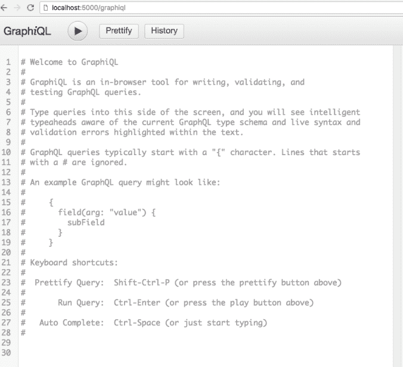

# 如何做到这一点...

现在我们的后端准备好了，让我们开始在前端工作：

1.  我们需要修改的第一个文件是`index.js`文件：

```jsx
    // Dependencies
    import React from 'react';
    import { render } from 'react-dom';
    import ApolloClient from 'apollo-boost';
    import { ApolloProvider } from 'react-apollo';

    // Components
    import App from './App';

    // Styles
    import './index.css';

    // Apollo Client
    const client = new ApolloClient({
      uri: 'http://localhost:5000/graphiql' // Backend endpoint
    });

    // Wrapping the App with ApolloProvider
    const AppContainer = () => (
      <ApolloProvider client={client}>
        <App />
      </ApolloProvider>
    );

    // Root
    const root = document.getElementById('root');

    // Rendering the AppContainer
    render(<AppContainer />, root);
```

文件：src/index.js

1.  我们将后端端点连接到`ApolloClient`，并将我们的`<App />`组件包装在`<ApolloProvider>`中（是的，这类似于 Redux Provider）。现在让我们修改我们的`App.js`文件，包括我们的主要组件（`Tweets`）：

```jsx
  // Dependencies
  import React, { Component } from 'react';

  // Components
  import Tweets from './components/Tweets';

  // Styles
  import './App.css';

  class App extends Component {
    render() {
      return (
        <div className="App">
          <Tweets />
        </div>
      );
    }
  }

 export default App;
```

文件：src/App.js

1.  我们需要做的第一件事是创建我们的 GraphQL 查询和 mutations。为此，我们需要创建一个名为`graphql`的新目录，并在其中创建另外两个目录，一个用于`mutations`，另一个用于`queries`：

```jsx
 // Dependencies
 import gql from 'graphql-tag';

 // getTweets query
 export const QUERY_GET_TWEETS = gql`
    query getTweets {
      getTweets {
        _id
        tweet
        author
        createdAt
      }
    }
  `;
```

文件：src/graphql/queries/index.js

1.  是的，你看得没错，这不是打字错误！该函数在没有括号的情况下被调用，并且只使用反引号（`gql`YOUR QUERY HERE``）。`getTweets`查询已经在我们的后端中定义。我们正在执行`getTweets`查询，并将获得字段（`_id`，`tweet`，`author`和`createdAt`）。现在让我们创建我们的 mutations：

```jsx
  // Dependencies
  import gql from 'graphql-tag';

  // createTweet Mutation
  export const MUTATION_CREATE_TWEET = gql`
    mutation createTweet(
      $tweet: String,
      $author: String,
      $createdAt: DateTime
    ) {
      createTweet(
        tweet: $tweet,
        author: $author,
        createdAt: $createdAt
      ) {
        _id
        tweet
        author
        createdAt
      }
    }
  `;

  // deleteTweet Mutation
  export const MUTATION_DELETE_TWEET = gql`
    # ! means mandatory
    mutation deleteTweet($_id: String!) {
      deleteTweet(
        _id: $_id
      ) {
        _id
        tweet
        author
        createdAt
      }
    }
  `;

  // updateTweet Mutation
 export const MUTATION_UPDATE_TWEET = gql`
    mutation updateTweet(
      $_id: String!,
      $tweet: String!
    ) {
      updateTweet(
        _id: $_id,
        tweet: $tweet
      ) {
        _id
        tweet
        author
        createdAt
      }
    }
  `;
```

文件：src/graphql/mutations/index.js

1.  我总是喜欢重构和改进事物，这就是为什么我为`react-apollo`的`Query`和`Mutation`组件创建了两个帮助程序。首先，让我们创建两个目录，`shared`和`shared/components`。首先，这是我们的 Query 组件：

```jsx
  // Dependencies
  import React, { Component } from 'react';
  import { Query as ApolloQuery } from 'react-apollo';

  class Query extends Component {
    render() {
      const {
        query,
        render: Component
      } = this.props;

      return (
        <ApolloQuery query={query}>
          {({ loading, error, data }) => {
            if (loading) {
              return <p>Loading...</p>;
            }

            if (error) {
              return <p>Query Error: {error}</p>
            }

            return <Component data={data || false} />;
          }}
        </ApolloQuery>
      );
    }
  }

  export default Query;
```

文件：src/shared/components/Query.js

1.  我们的 Mutation 组件应该是这样的：

```jsx
  // Dependencies
  import React, { Component } from 'react';
  import { Mutation as ApolloMutation } from 'react-apollo';

  class Mutation extends Component {
    render() {
      const {
        mutation,
        query,
        children,
        onCompleted
      } = this.props;

      return (
        <ApolloMutation
          mutation={mutation}
          update={(cache, { data }) => {
            // Getting the mutation and query name
            const { 
              definitions: [{ name: { value: mutationName } }] 
            } = mutation;
            const { 
              definitions: [{ name: { value: queryName } }] 
            } = query;

            // Getting cachedData from previous query
            const cachedData = cache.readQuery({ query });

            // Getting current data (result of the mutation)
            const current = data[mutationName];

            // Initializing our updatedData
            let updatedData = [];

            // Lower case mutation name
            const mutationNameLC = mutationName.toLowerCase();

            // If the mutation includes "delete" or "remove"
            if (mutationNameLC.includes('delete') 
              || mutationNameLC.includes('remove')) {
              // Removing the current tweet by filtering 
              // from the cachedData
              updatedData = cachedData[queryName].filter(
                row => row._id !== current._id
              );
            } else if (mutationNameLC.includes('create') 
 || mutationNameLC.includes('add')) {
              // Create or add action injects the current 
              // value in the array
              updatedData = [current, ...cachedData[queryName]];
            } else if (mutationNameLC.includes('edit') 
 || mutationNameLC.includes('update')) {
              // Edit or update actions will replace the old values 
              // with the new ones
              const index = cachedData[queryName].findIndex(
                row => row._id === current._id
              );
              cachedData[queryName][index] = current;
              updatedData = cachedData[queryName];
            }

            // Updating our data to refresh the tweets list
            cache.writeQuery({
              query,
              data: {
                [queryName]: updatedData
              }
            });
          }}
          onCompleted={onCompleted} 
        >
          {/** 
            * Here we render the content of the 
            * component (children) 
            */}
          {children}
        </ApolloMutation>
      );
    }
  }

  export default Mutation;
```

文件：src/shared/components/Mutation.js

1.  一旦我们的助手准备好了，让我们创建我们的 Tweets、Tweet 和 CreateTweet 组件。这是我们的`Tweets`组件：

```jsx
 // Dependencies
  import React, { Component } from 'react';

  // Components
  import Tweet from './Tweet';
  import CreateTweet from './CreateTweet';
  import Query from '../shared/components/Query';

  // Queries
  import { QUERY_GET_TWEETS } from '../graphql/queries';

  // Styles
  import './Tweets.css';

  class Tweets extends Component {
    render() {
      return (
        <div className="tweets">
          {/* Rendering CreateTweet component */}
          <CreateTweet />

          {/** 
            * Executing QUERY_GET_TWEETS query and render our Tweet 
            * component 
            */}
          <Query query={QUERY_GET_TWEETS} render={Tweet} />
        </div>
      );
    }
  }

  export default Tweets;
```

文件：src/components/Tweets.js

1.  这是我们的`Tweet`组件：

```jsx
    // Dependencies
    import React, { Component } from 'react';
    import moment from 'moment';

    // Components
    import Mutation from '../shared/components/Mutation';

 // Queries
    import { 
      MUTATION_DELETE_TWEET, 
      MUTATION_UPDATE_TWEET 
    } from '../graphql/mutations';

    import { QUERY_GET_TWEETS } from '../graphql/queries';

    // Images (those are temporary images and exists on the repository)
    import TwitterLogo from './twitter.svg';
    import CodejobsAvatar from './codejobs.png';

    class Tweet extends Component {
      // Local State
      state = {
        currentTweet: false
      };

      // Enabling a textarea for edit a Tweet
      handleEditTweet = _id => {
        const { data: { getTweets: tweets } } = this.props;

        const selectedTweet = tweets.find(tweet => tweet._id === _id);

        const currentTweet = {
          [_id]: selectedTweet.tweet
        };

        this.setState({
          currentTweet
        });
      }

      // Handle Change for textarea
      handleChange = (value, _id) => {
        const { currentTweet } = this.state;

        currentTweet[_id] = value;

        this.setState({
          currentTweet
        });
      }

      // Delete tweet mutation
      handleDeleteTweet = (mutation, _id) => {
        // Sending variables
        mutation({
          variables: {
            _id
          }
        });
      }

      // Update tweet mutation
      handleUpdateTweet = (mutation, value, _id) => {
        // Sending variables
        mutation({
          variables: {
            _id,
            tweet: value
          }
        });
      }

      render() {
        // Getting the data from getTweets query
        const { data: { getTweets: tweets } } = this.props;

        // currentTweet state
        const { currentTweet } = this.state;

        // Mapping the tweets
        return tweets.map(({
          _id,
          tweet,
          author,
          createdAt
        }) => (
          <div className="tweet" key={`tweet-${_id}`}>
            <div className="author">
              {/* Rendering our Twitter Avatar (this is hardcoded) */}
              

              {/* Rendering the author */}
              <strong>{author}</strong>
            </div>

            <div className="content">
              <div className="twitter-logo">
                {/* Rendering the Twitter Logo */}
                
              </div>

              {/**
 * If there is no currentTweet being edited then  
                * we display the tweet as a text otherwise we 
                * render a textarea with the tweet to be edited
 */}
              {!currentTweet[_id]
                ? tweet
                : (
                  <Mutation
                    mutation={MUTATION_UPDATE_TWEET}
                    query={QUERY_GET_TWEETS}
                    onCompleted={() => {
                      // Once the mutation is completed we clear our 
                      // currentTweet state
                      this.setState({
                        currentTweet: false
                      });
                    }}
                  >
                    {(updateTweet) => (
                      <textarea
                        autoFocus
                        className="editTextarea"
                        value={currentTweet[_id]}
                        onChange={(e) => {
                          this.handleChange(
                            e.target.value, 
 _id                          ); 
                        }}
                        onBlur={(e) => {
                          this.handleUpdateTweet(
 updateTweet, 
                            e.target.value, 
 _id                          ); 
                        }}
                      />
                    )}
                  </Mutation>
                )
              }
            </div>

            <div className="date">
              {/* Rendering the createdAt date (MMM DD, YYYY) */}
              {moment(createdAt).format('MMM DD, YYYY')}
            </div>

            {/* Rendering edit icon */}
            <div 
              className="edit" 
 onClick={() => { 
                this.handleEditTweet(_id); 
              }}
            >
              <i className="fa fa-pencil" aria-hidden="true" />
            </div>

            {/* Mutation for delete a tweet */}
            <Mutation
              mutation={MUTATION_DELETE_TWEET}
              query={QUERY_GET_TWEETS}
            >
              {(deleteTweet) => (
                <div 
                  className="delete" 
 onClick={() => {
                    this.handleDeleteTweet(deleteTweet, _id); 
                  }}
                >
                  <i className="fa fa-trash" aria-hidden="true" />
                </div>
              )}
            </Mutation>
          </div>
        ));
      }
    }

 export default Tweet;
```

文件：src/components/Tweet.js

1.  我们的`CreateTweet`组件如下：

```jsx
  // Dependencies
  import React, { Component } from 'react';
  import Mutation from '../shared/components/Mutation';

  // Images (this image is on the repository)
  import CodejobsAvatar from './codejobs.png';

  // Queries
  import { MUTATION_CREATE_TWEET } from '../graphql/mutations';
  import { QUERY_GET_TWEETS } from '../graphql/queries';

  class CreateTweet extends Component {
    // Local state
    state = {
      tweet: ''
    };

    // Handle change for textarea
    handleChange = e => {
      const { target: { value } } = e;

      this.setState({
        tweet: value
      })
    }

    // Executing createTweet mutation to add a new Tweet
    handleSubmit = mutation => {
      const tweet = this.state.tweet;
      const author = '@codejobs';
      const createdAt = new Date();

      mutation({
        variables: {
          tweet,
          author,
          createdAt
        }
      });
    }

    render() {
      return (
        <Mutation
          mutation={MUTATION_CREATE_TWEET}
          query={QUERY_GET_TWEETS}
          onCompleted={() => {
            // On mutation completed we clean the tweet state 
            this.setState({
              tweet: ''
            });
          }}
        >
          {(createTweet) => (
            <div className="createTweet">
              <header>
                Write a new Tweet
              </header>

              <section>
                

                <textarea
                  placeholder="Write your tweet here..."
                  value={this.state.tweet}
                  onChange={this.handleChange}
                />
              </section>

              <div className="publish">
                <button
                  onClick={() => {
                    this.handleSubmit(createTweet);
                  }}
                >
                  Tweet it!
                </button>
              </div>
            </div>
          )}
        </Mutation>
      );
    }
  }

 export default CreateTweet;
```

文件：src/components/CreateTweet.js

1.  最后，但同样重要的是，这是样式文件：

```jsx
  .tweet {
    margin: 20px auto;
    padding: 20px;
    border: 1px solid #ccc;
    height: 200px;
    width: 80%;
    position: relative;
  }

  .author {
    text-align: left;
    margin-bottom: 20px;
  }

  .author strong {
    position: absolute;
    top: 40px;
    margin-left: 10px;
  }

  .author img {
    width: 50px;
    border-radius: 50%;
  }

  .content {
    text-align: left;
    color: #222;
    text-align: justify;
    line-height: 25px;
  }

  .date {
    color: #aaa;
    font-size: 12px;
    position: absolute;
    bottom: 10px;
  }

  .twitter-logo img {
    position: absolute;
    right: 10px;
    top: 10px;
    width: 20px;
  }

  .createTweet {
    margin: 20px auto;
    background-color: #F5F5F5;
    width: 86%;
    height: 225px;
    border: 1px solid #AAA;
  }

  .createTweet header {
    color: white;
    font-weight: bold;
    background-color: #2AA3EF;
    border-bottom: 1px solid #AAA;
    padding: 20px;
  }

  .createTweet section {
    padding: 20px;
    display: flex;
  }

  .createTweet section img {
    border-radius: 50%;
    margin: 10px;
    height: 50px;
  }

  textarea {
    border: 1px solid #ddd;
    height: 80px;
    width: 100%;
  }

  .publish {
    margin-bottom: 20px;
  }

  .publish button {
    cursor: pointer;
    border: 1px solid #2AA3EF;
    background-color: #2AA3EF;
    padding: 10px 20px;
    color: white;
    border-radius: 20px;
    float: right;
    margin-right: 20px;
  }

  .delete {
    position: absolute;
    right: 10px;
    bottom: 10px;
    cursor: pointer;
  }

  .edit {
    position: absolute;
    right: 30px;
    bottom: 10px;
    cursor: pointer;
  }
```

文件：src/components/Tweets.css

# 它是如何工作的...

如果你做了一切正确，并且你在前端和后端分别运行（在不同的终端上），那么你可以在`http://localhost:3000`上运行项目，你应该会看到这个视图：

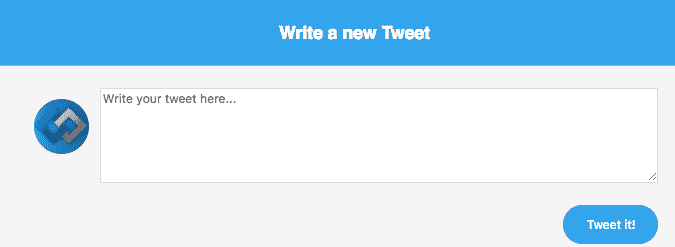

现在我们可以通过在文本区域中编写推文并点击“Tweet it!”按钮来创建新的推文：

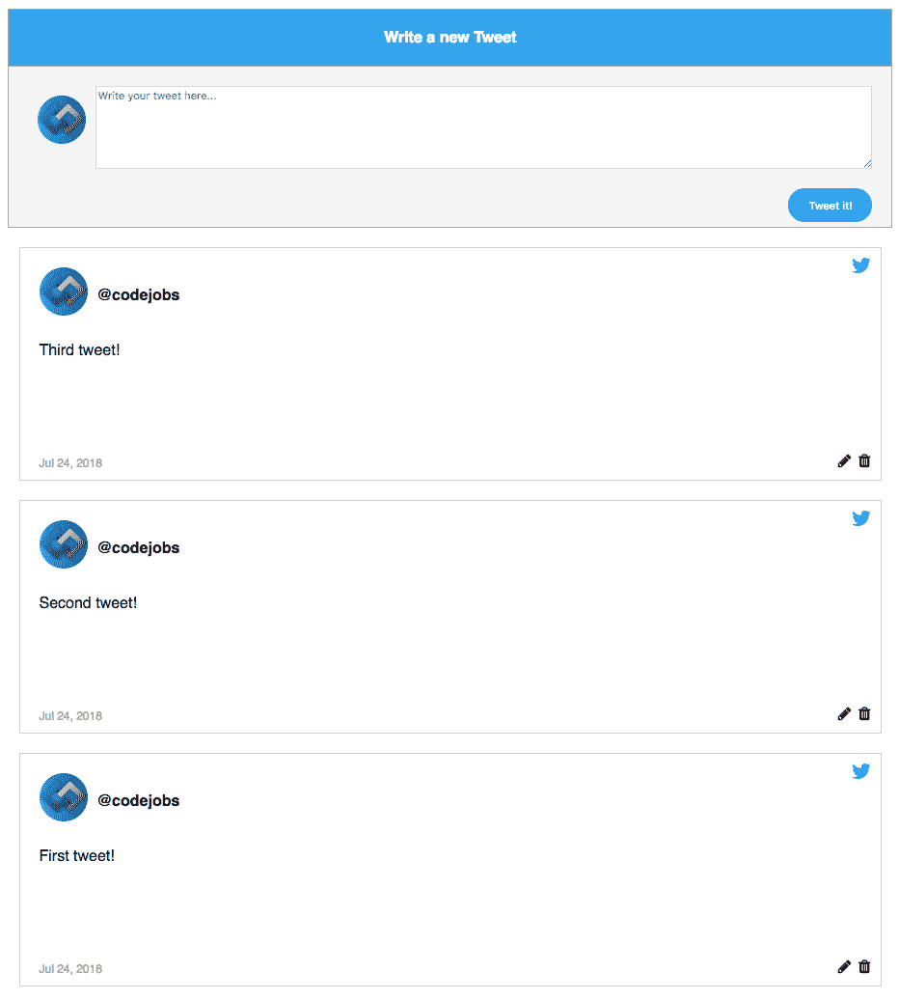

正如你所看到的，推文的顺序是降序的。这意味着最新的推文会被发布在顶部。如果你想编辑一条推文，你可以点击编辑图标（铅笔）：

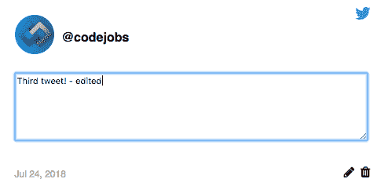

保存更改的方法是通过移除文本区域的焦点（onBlur），现在我们可以看到更新后的推文：

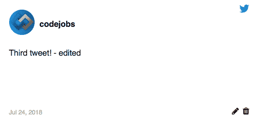

最后，如果你想删除一条推文，那么点击垃圾桶图标（我已经删除了第二条推文）：

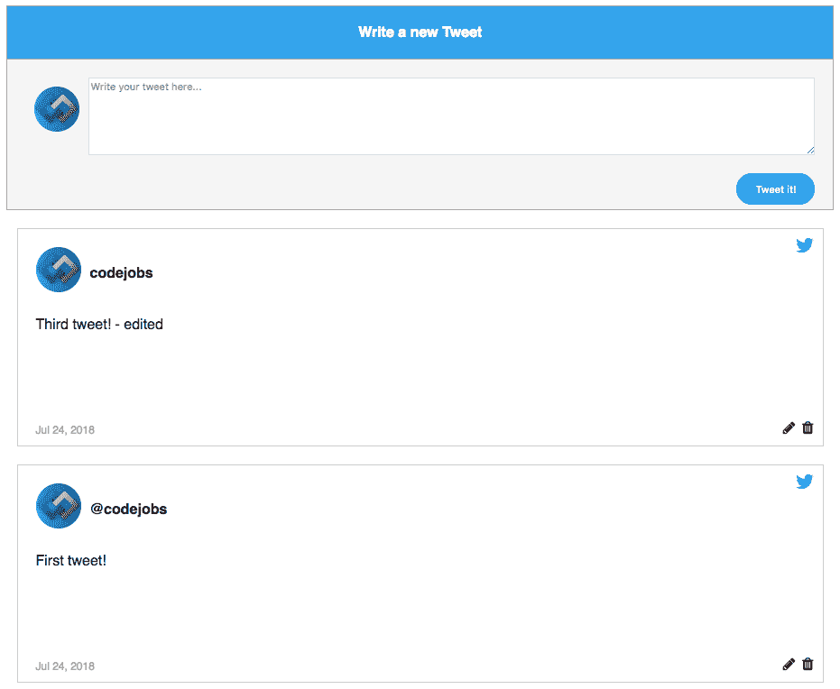

正如你所看到的，变异非常容易实现，并且通过助手，我们简化了这个过程。

你可能会认为有一些方法可以将 Redux 与 GraphQL 一起使用，但让我告诉你，GraphQL 有可能会取代 Redux，因为我们可以通过 ApolloProvider 访问数据。
