# 第十一章：实现服务器端渲染

在本章中，将涵盖以下示例：

+   实现服务器端渲染

+   使用服务器端渲染实现承诺

+   实现 Next.js

# 介绍

React 通常使用客户端渲染（CSR）。这意味着它动态地将 HTML 代码注入到目标`div`中（通常使用`#app`或`#root` ID），这就是为什么如果您尝试直接查看页面的代码（右键单击-查看页面代码），您将看到类似于这样的内容：

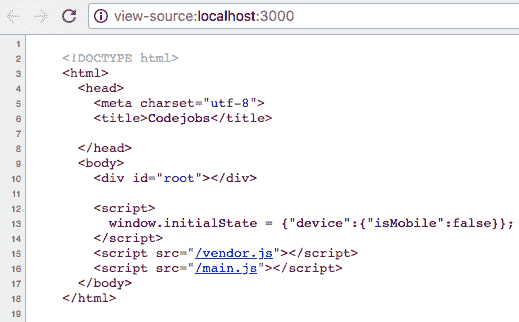

查看实际代码的唯一方法是使用 Chrome Dev 工具或其他工具检查网站，以下是 React 使用 CSR 生成的代码：

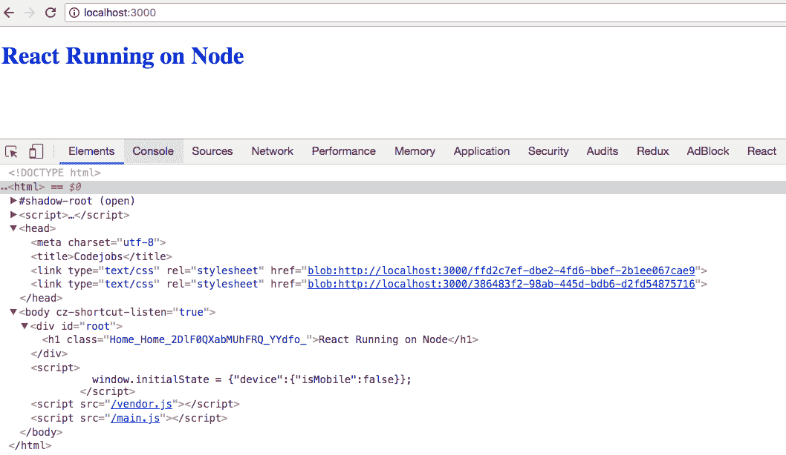

通过检查页面，您可以看到注入到我们的`#root` div 中的代码。*服务器端渲染（SSR）*对于改善我们网站的*SEO*并被主要搜索引擎（如*Google*、*Yahoo*和*Bing*）索引非常有用。如果您不太关心 SEO，可能不需要担心*SSR*。目前，*Googlebot*支持*CSR*，并且可以在*Google*上索引我们的网站，但如果您关心 SEO 并且担心改善其他搜索引擎（如*Yahoo*、*Bing*或*DuckDuckGo*）上的 SEO，则使用*SSR*是正确的选择。

# 实现服务器端渲染

在这个示例中，我们将在我们的项目中实现 SSR。

# 准备工作

我们将使用上一篇示例（*使用 Node.js 与 React/Redux 和 Webpack 4 实现*）中的代码，从第十章*，掌握 Webpack 4.x*，并安装一些其他依赖项：

```jsx
npm install --save-dev webpack-node-externals webpack-dev-middleware webpack-hot-middleware webpack-hot-server-middleware webpack-merge babel-cli babel-preset-es2015
```

# 如何做...

现在让我们来看一下渲染的步骤：

1.  首先，我们需要将 npm 脚本添加到我们的`package.json`文件中：

```jsx
    "scripts": {
      "clean": "rm -rf dist/ && rm -rf public/app",
      "start": "npm run clean & NODE_ENV=development 
 BABEL_ENV=development 
 nodemon src/server --watch src/server --watch src/shared -- 
      exec babel-node --presets es2015",
      "start-analyzer": "npm run clean && NODE_ENV=development 
 BABEL_ENV=development ANALYZER=true babel-node src/server"
    }
```

文件：package.json

1.  现在我们需要更改我们的`webpack.config.js`文件。因为我们要实现 SSR，我们需要将我们的 Webpack 配置分成客户端配置和服务器配置，并将它们作为数组返回。文件应该看起来像这样：

```jsx
  // Webpack Configuration (Client & Server)
  import clientConfig from './webpack/webpack.config.client';
  import serverConfig from './webpack/webpack.config.server';

 export default [
    clientConfig,
    serverConfig
  ];
```

文件：webpack.config.js

1.  现在我们需要在我们的`webpack`文件夹内为我们的客户端配置创建一个文件。我们需要将其命名为`webpack.config.client.js`：

```jsx
  // Dependencies
  import webpackMerge from 'webpack-merge';

  // Webpack Configuration
  import commonConfig from './webpack.config.common';
  import {
    context,
    devtool,
    entry,
    name,
    output,
    optimization,
    plugins,
    target
  } from './configuration';

  // Type of Configuration
  const type = 'client';

  export default webpackMerge(commonConfig(type), {
    context: context(type),
    devtool,
    entry: entry(type),
    name: name(type),
    output: output(type),
    optimization,
    plugins: plugins(type),
    target: target(type)
  });
```

文件：webpack/webpack.config.client.js

1.  现在服务器配置应该是这样的：

```jsx
 // Dependencies
  import webpackMerge from 'webpack-merge';

  // Webpack Configuration
  import commonConfig from './webpack.config.common';

  // Configuration
  import {
    context,
    entry,
    externals,
    name,
    output,
    plugins,
    target
  } from './configuration';

  // Type of Configuration
  const type = 'server';

 export default webpackMerge(commonConfig(type), {
    context: context(type),
    entry: entry(type),
    externals: externals(type),
    name: name(type),
    output: output(type),
    plugins: plugins(type),
    target: target(type)
  });
```

文件：webpack/webpack.config.server.js

1.  正如您所看到的，在这两个文件中，我们正在导入一个包含需要添加到客户端和服务器端的配置的共同配置文件：

```jsx
  // Configuration
  import { module, resolve, mode } from './configuration';
  export default type => ({
    module: module(type),
    resolve,
    mode
  });
```

文件：webpack/webpack.config.common.js

1.  我们需要为 Webpack 节点添加新的配置文件，并修改一些我们已经有的文件。我们需要创建的第一个文件是`context.js`。在这个文件（和其他一些文件）中，我们将导出一个带有类型参数的函数，该参数可以是*client*或*server*，并根据该值返回不同的配置：

```jsx
  // Dependencies
  import path from 'path';
 export default type => type === 'server'
    ? path.resolve(__dirname, '../../src/server')
    : path.resolve(__dirname, '../../src/client');
```

文件：webpack/configuration/context.js

1.  入口文件是我们将添加到捆绑包中的所有文件的位置。我们的入口文件现在应该是这样的：

```jsx
  // Environment
  const isDevelopment = process.env.NODE_ENV !== 'production';

 export default type => {
    if (type === 'server') {
      return './render/serverRender.js';
    }

    const entry = [];

    if (isDevelopment) {
      entry.push(
        'webpack-hot-middleware/client',
        'react-hot-loader/patch'
      );
    }

    entry.push('./index.jsx');

    return entry;
  };
```

文件：webpack/configuration/entry.js

1.  我们需要创建一个名为 externals.js 的文件，其中包含我们不打包的模块（除非它们在白名单上）：

```jsx
  // Dependencies
  import nodeExternals from 'webpack-node-externals';

  export default () => [
    nodeExternals({
      whitelist: [/^redux\/(store|modules)/]
    })
  ];
```

文件：webpack/configuration/externals.js

1.  此外，我们需要修改我们的`module.js`文件，根据环境或配置类型返回我们的规则：

```jsx
  // Dependencies
  import ExtractTextPlugin from 'extract-text-webpack-plugin';

 // Environment
  const isDevelopment = process.env.NODE_ENV !== 'production';

  export default type => {
    const rules = [
      {
        test: /\.(js|jsx)$/,
        use: 'babel-loader',
        exclude: /node_modules/
      }
    ];

    if (!isDevelopment || type === 'server') {
      rules.push({
        test: /\.scss$/,
        use: ExtractTextPlugin.extract({
          fallback: 'style-loader',
          use: [
            'css-loader?minimize=true&modules=true&localIdentName=
            [name]__[local]_[hash:base64]',
            'sass-loader'
          ]
        })
      });
    } else {
      rules.push({
        test: /\.scss$/,
        use: [
          {
            loader: 'style-loader'
          },
          {
            loader: 'css-loader',
            options: {
              modules: true,
              importLoaders: 1,
              localIdentName: '[name]__[local]_[hash:base64]',
              sourceMap: true,
              minimize: true
            }
          },
          {
            loader: 'sass-loader'
          }
        ]
      });
    }

    return {
      rules
    };
  };
```

文件：webpack/configuration/module.js

1.  现在我们需要为名称创建一个节点：

```jsx
  export default type => type;
```

文件：webpack/configuration/name.js

1.  对于输出配置，我们需要根据配置的类型（客户端或服务器端）返回一个对象：

```jsx
  // Dependencies
  import path from 'path';

 export default type => {
    if (type === 'server') {
      return {
        filename: 'server.js',
        path: path.resolve(__dirname, '../../dist'),
        libraryTarget: 'commonjs2'
      };
    }

    return {
      filename: '[name].bundle.js',
      path: path.resolve(__dirname, '../../public/app'),
      publicPath: '/'
    };
  };
```

文件：webpack/configuration/output.js

1.  在我们的`plugins.js`文件中，我们正在验证用户是否发送了`ANALYZER`变量，以便在开发模式下运行应用程序时仅在该情况下显示`BundleAnalyzerPlugin`，而不是每次都显示。

```jsx
  // Dependencies
  import CompressionPlugin from 'compression-webpack-plugin';
  import ExtractTextPlugin from 'extract-text-webpack-plugin';
  import webpack from 'webpack';
  import WebpackNotifierPlugin from 'webpack-notifier';
  import { BundleAnalyzerPlugin } from 'webpack-bundle-analyzer';

 // Environment
  const isDevelopment = process.env.NODE_ENV !== 'production';

  // Analyzer
  const isAnalyzer = process.env.ANALYZER === 'true';

 export default type => {
    const plugins = [
      new ExtractTextPlugin({
        filename: '../../public/css/style.css'
      })
    ];

    if (isAnalyzer) {
      plugins.push(
        new BundleAnalyzerPlugin()
      );
    }

    if (isDevelopment) {
      plugins.push(
        new webpack.HotModuleReplacementPlugin(),
        new webpack.NoEmitOnErrorsPlugin(),
        new WebpackNotifierPlugin({
          title: 'CodeJobs'
        })
      );
    } else {
      plugins.push(
        new CompressionPlugin({
          asset: '[path].gz[query]',
          algorithm: 'gzip',
          test: /\.js$|\.css$|\.html$/,
          threshold: 10240,
          minRatio: 0.8
        })
      );
    }

    return plugins;
  };
```

文件：webpack/configuration/plugins.js

1.  我们需要在我们的解析文件中指定我们的模块；文件应该是这样的：

```jsx
  // Dependencies
  import path from 'path';

  export default {
    extensions: ['.js', '.jsx'],
    modules: [
      'node_modules',
      path.resolve(__dirname, '../../src/client'),
      path.resolve(__dirname, '../../src/server')
    ]
  };
```

文件：webpack/configuration/resolve.js

1.  我们需要创建的最后一个配置是`target.js`文件：

```jsx
 export default type => type === 'server' ? 'node' : 'web';
```

文件：webpack/configuration/target.js

1.  在我们配置了 Webpack 之后，我们需要修改我们的`App.jsx`文件，其中我们需要使用`<BrowserRouter>`组件为客户端创建路由，并使用`<StaticRouter>`为服务器端创建路由：

```jsx
  // Dependencies
  import React from 'react';
  import { 
    BrowserRouter, 
    StaticRouter, 
    Switch, 
    Route 
  } from 'react-router-dom';

 // Components
  import About from '@components/About';
  import Home from '@components/Home';

  export default ({ server, location, context = {} }) => {
    const routes = (
      <Switch>
        <Route exact path="/" component={Home} />
        <Route exact path="/about" component={About} />
      </Switch>
    );

    // Client Router
    let router = (
      <BrowserRouter>
        {routes}
      </BrowserRouter>
    );

    // Server Router
    if (server) {
      router = (
        <StaticRouter location={location} context={context}>
          {routes}
        </StaticRouter>
      );
    }

    return router;
  };
```

文件：src/client/App.jsx

1.  现在我们需要修改我们的服务器文件（`index.js`）以使用我们的*clientRender*和*serverRender*中间件：

```jsx
  // Dependencies
  import express from 'express';
  import path from 'path';
  import webpackDevMiddleware from 'webpack-dev-middleware';
  import webpackHotMiddleware from 'webpack-hot-middleware';
  import webpackHotServerMiddleware from 'webpack-hot-server-middleware';
  import webpack from 'webpack';

  // Utils
  import { isMobile, isBot } from '@utils/device';

  // Client Render
  import clientRender from './render/clientRender';

  // Webpack Configuration
  import webpackConfig from '@webpack';

  // Environment
  const isProduction = process.env.NODE_ENV === 'production';

  // Express Application
  const app = express();

  // Webpack Compiler
  const compiler = webpack(webpackConfig);

  // Public directory
  app.use(express.static(path.join(__dirname, '../../public')));

  // Device Detection
  app.use((req, res, next) => {
    req.isMobile = isMobile(req.headers['user-agent']);
    // We detect if a search bot is accessing...
    req.isBot = isBot(req.headers['user-agent']);

    next();
  });

  // Webpack Middleware
  if (!isProduction) {
    // Hot Module Replacement
    app.use(webpackDevMiddleware(compiler));
    app.use(webpackHotMiddleware(
      compiler.compilers.find(compiler => compiler.name === 'client'))
    );
  } else {
    // GZip Compression just for Production
    app.get('*.js', (req, res, next) => {
      req.url = `${req.url}.gz`;
      res.set('Content-Encoding', 'gzip');
      next();
    });
  }

  // Client Side Rendering
  app.use(clientRender());

  if (isProduction) {
    try {
      // eslint-disable-next-line
      const serverRender = require('../../dist/server.js').default; 

      app.use(serverRender());
    } catch (e) {
      throw e;
    }
  }

  // For Server Side Rendering on Development Mode
  app.use(webpackHotServerMiddleware(compiler));

 // Disabling x-powered-by
  app.disable('x-powered-by');

  // Listen Port...
  app.listen(3000);
```

文件：src/server/index.js

1.  我们需要修改我们的`clientRender.js`文件。如果我们检测到一个搜索引擎爬虫使用`isBot`函数，我们将返回`next()`中间件。否则，我们渲染 HTML 并使用 CSR 执行应用程序：

```jsx
  // HTML
  import html from './html';

  // Initial State
  import initialState from './initialState';

  export default function clientRender() {
    return (req, res, next) => {
      if (req.isBot) {
        return next();
      }

      res.send(html({
        title: 'Codejobs',
        initialState: initialState(req)
      }));
    };
  }
```

文件：src/server/render/clientRender.js

1.  现在让我们创建我们的`serverRender.js`文件。在这里，我们需要使用`react-dom/server`库中的`renderToString`方法来渲染我们的`App`组件：

```jsx
  // Dependencies
  import React from 'react';
  import { renderToString } from 'react-dom/server';
  import { Provider } from 'react-redux';

  // Redux Store
  import configureStore from '@configureStore';

  // Components
  import App from '../../client/App';

  import html from './html';

  // Initial State
  import initialState from './initialState';

  export default function serverRender() {
    return (req, res, next) => {
      // Configuring Redux Store
      const store = configureStore(initialState(req));

      const markup = renderToString(
        <Provider store={store}>
          <App
            server
            location={req.url}
          />
        </Provider>
      );

      res.send(html({
        title: 'Codejobs',
        markup,
        initialState: initialState(req)
      }));
    };
  }
```

文件：src/server/render/serverRender.js

# 它是如何工作的...

您可以通过运行`npm start`命令启动应用程序。

如果您在浏览器（例如 Chrome）中打开`http://localhost:3000`中的应用程序，然后右键单击，然后查看页面源代码，您可能会注意到我们没有使用 SSR：

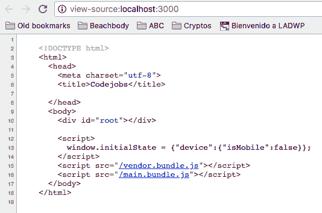

这是因为我们将仅将 SSR 用于搜索引擎爬虫。*isBot*函数将检测所有搜索引擎爬虫，仅供测试，我添加了*curl*作为一个爬虫来测试我们的 SSR；这是该函数的代码：

```jsx
  export function isBot(ua) {
    const b = /curl|bot|googlebot|google|baidu|bing|msn|duckduckgo|teoma|slurp|yandex|crawler|spider|robot|crawling/i;
    return b.test(ua);
  }
```

文件：src/shared/utils/device.js

在另一个终端中打开一个新的终端，然后执行以下命令：

```jsx
    curl http://localhost:3000
```

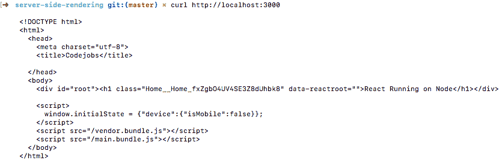

如您所见，#root div 内的 HTML 代码是使用 SSR 渲染的。

另外，如果您想尝试在 curl 中运行`/about`，您将看到它也将使用 SSR 进行渲染：

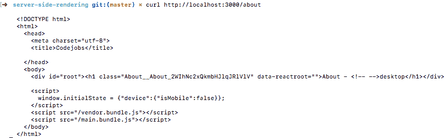

Chrome 有一个名为 User-Agent Switcher for Chrome 的扩展，您可以在其中指定要在浏览器中使用的用户代理。通过这种方式，您可以为 Googlebot 添加一个特殊的用户代理，例如：

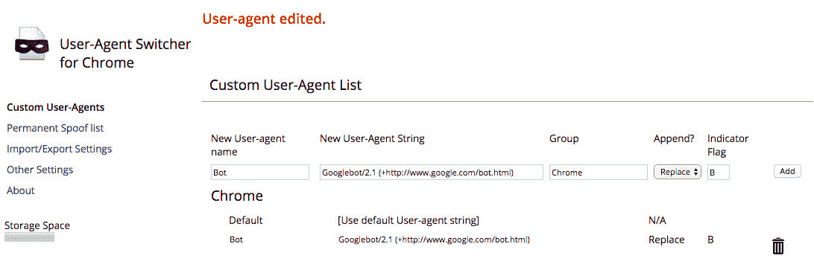

然后，如果您在 User-Agent Switcher 中选择 Chrome | Bot，您会发现当您查看页面源代码时，HTML 代码会将其呈现为 SSR：

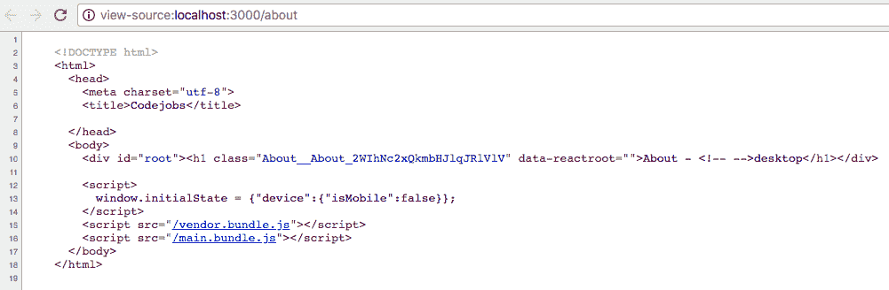

# 还有更多...

当我们使用 SSR 时，当我们尝试在客户端使用 window 对象时，我们必须非常小心。如果您直接使用 SSR，您将收到 ReferenceError，例如：

```jsx
    ReferenceError: window is not defined
```

为了解决这个问题，您可以验证 window 对象是否存在，但这可能非常重复。我更喜欢创建一个可以验证我们是使用浏览器（客户端）还是服务器的函数。您可以这样做：

```jsx
    export function isBrowser() {
      return typeof window !== 'undefined';
    }
```

然后，每次您需要使用 window 对象时，可以这样做：

```jsx
 const store = isBrowser() ? configureStore(window.initialState) : {};
```

# 使用服务器端渲染实现承诺

在上一个示例中，我们看到了 SSR 的工作原理，但该示例仅限于显示具有简单组件的 SSR。在本示例中，我们将学习如何实现承诺以将我们的组件连接到 Redux，使用 API 获取数据并使用 SSR 渲染组件。

# 准备就绪

我们将使用上一个步骤中的相同代码，但我们将进行一些更改。在这个步骤中，我们需要安装这些软件包：

```jsx
    npm install axios babel-preset-stage-0 react-router-dom redux-devtools-extension redux-thunk
```

# 如何做...

对于这个步骤，我们将实现一个基本的待办事项列表，从 API 中拉取数据，以展示如何使用 SSR 将 Redux 连接到我们的应用程序中：

1.  我们需要做的第一件事是添加一个简单的 API 来显示待办事项列表：

```jsx
  import express from 'express';

  const router = express.Router();

  // Mock data, this should come from a database....
  const todo = [
    {
      id: 1,
      title: 'Go to the Gym'
    },
    {
      id: 2,
      title: 'Dentist Appointment'
    },
    {
      id: 3,
      title: 'Finish homework'
    }
  ];

  router.get('/todo/list', (req, res, next) => {
    res.json({
      response: todo
    });
  });

  export default router;
```

文件：src/server/controllers/api.js

1.  第二步是将这个 API 控制器导入到我们的`src/server/index.js`文件中，并将其添加为`/api`路由的中间件：

```jsx
  ...
  // Controllers
  import apiController from './controllers/api';
  ...
  // Express Application
  const app = express();

  // Webpack Compiler
  const compiler = webpack(webpackConfig);

  // Routes
  app.use('/api', apiController);
  ...
```

文件：src/server/index.js

1.  以前，在我们的`serverRender.js`文件中，我们直接渲染了我们的`App`组件。现在我们需要从具有名为`initialAction`的静态方法的组件中获取承诺，将它们保存到一个承诺数组中，解决它们，然后渲染我们的`App`方法：

```jsx
  // Dependencies
  import React from 'react';
  import { renderToString } from 'react-dom/server';
  import { Provider } from 'react-redux';
  import { matchPath } from 'react-router-dom';

  // Redux Store
  import configureStore from '@configureStore';

  // Components
  import App from '../../client/App';

  // HTML
  import html from './html';

  // Initial State
  import initialState from './initialState';

  // Routes
  import routes from '@shared/routes';

  export default function serverRender() {
    return (req, res, next) => {
      // Configuring Redux Store
      const store = configureStore(initialState(req));

      // Getting the promises from the components which has  
      // initialAction.
      const promises = routes.paths.reduce((promises, route) => {
        if (matchPath(req.url, route) && route.component && route.component.initialAction) {          
promises.push(Promise.resolve(store.dispatch(route.component.initialAction())));
        }

        return promises;
      }, []);

      // Resolving our promises
      Promise.all(promises)
        .then(() => {
          // Getting Redux Initial State
          const initialState = store.getState();

          // Rendering with SSR
          const markup = renderToString(
            <Provider store={store}>
              <App
                server
                location={req.url}
              />
            </Provider>
          );

          // Sending our HTML code.
          res.send(html({
            title: 'Codejobs',
            markup,
            initialState
          }));
        })
        .catch(e => {
          // eslint-disable-line no-console
          console.log('Promise Error: ', e); 
        });
    };
  }
```

文件：src/server/render/serverRender.js

1.  在这个步骤中，我们需要在客户端目录中稍微改变我们的文件夹结构。以前，我们有一个`components`目录，我们的组件都在里面。现在我们要将我们的组件封装为小应用程序，在里面我们可以创建我们的操作、API、组件、容器和减速器。我们的新结构应该是这样的：

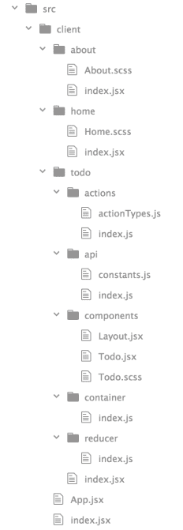

1.  我们将创建一个待办事项应用程序。为此，首先我们需要添加我们的操作文件夹，在里面我们需要首先创建我们的`actionTypes.js`文件。在这个文件中，我们需要添加我们的`FETCH_TODO`操作。我更喜欢创建一个具有两个函数的对象，一个用于请求，另一个用于成功；当我们在减速器中使用它们并分发我们的操作时，你将看到这一点的优势：

```jsx
  // Actions
  export const FETCH_TODO = {
    request: () => 'FETCH_TODO_REQUEST',
    success: () => 'FETCH_TODO_SUCCESS'
  };
```

文件：src/client/todo/actions/actionTypes.js

1.  在我们的`index.js`文件中，我们将创建一个 fetchTodo 操作，从我们的 API 中检索我们的待办事项列表项：

```jsx
  // Base Actions
  import { request, received } from '@baseActions';

  // Api
  import api from '../api';

  // Action Types
  import { FETCH_TODO } from './actionTypes';

  export const fetchTodo = () => dispatch => {
    const action = FETCH_TODO;
    const { fetchTodo } = api;

    dispatch(request(action));

    return fetchTodo()
      .then(response => dispatch(received(action, response.data)));
  };
```

文件：src/client/todo/actions/index.js

1.  正如你所看到的，我们正在使用基本操作中的两种特定方法（请求和接收）。这些函数将帮助我们轻松地分发我们的操作（你还记得我们在操作中使用了请求和成功方法吗？）：

```jsx
  // Base Actions
  export const request = ACTION => ({
    type: ACTION.request()
  });

  export const received = (ACTION, data) => ({
    type: ACTION.success(),
    payload: data
  });
```

文件：src/shared/redux/baseActions.js

1.  现在让我们创建我们的`api`文件夹，在这里我们需要添加一个`constants.js`文件和我们的`index.js`文件：

```jsx
 export const API = Object.freeze({
    TODO: 'api/todo/list'
  });
```

文件：src/client/todo/api/constants.js

1.  在我们的`index.js`文件中，我们必须创建我们的 Api 类并添加一个名为`fetchTodo`的静态方法：

```jsx
  // Dependencies
  import axios from 'axios';

  // Configuration
  import config from '@configuration';

  // Utils
  import { isBrowser } from '@utils/frontend';

  // Constants
  import { API } from './constants';

  class Api {
    static fetchTodo() {
      // For Node (SSR) we have to specify our base domain  
      // (http://localhost:3000/api/todo/list)
 // For Client Side Render just /api/todo/list.
      const url = isBrowser()
        ? API.TODO
        : `${config.baseUrl}/${API.TODO}`;

      return axios(url);
    }
  }

 export default Api;
```

文件：src/client/todo/api/index.js

1.  在我们的 Todo 容器中，我们需要映射我们的待办事项列表，并将*fetchTodo*动作添加到 Redux 中。我们将导出一个布局组件，然后我们将添加我们的其他组件，并操纵我们想要显示布局的方式：

```jsx
  // Dependencies
  import { connect } from 'react-redux';
  import { bindActionCreators } from 'redux';

  // Components
  import Layout from '../components/Layout';

  // Actions
  import { fetchTodo } from '../actions';

  export default connect(({ todo }) => ({
    todo: todo.list
  }), dispatch => bindActionCreators(
    {
      fetchTodo
    },
    dispatch
  ))(Layout);
```

文件：src/client/todo/container/index.js

1.  我们的布局组件应该是这样的：

```jsx
  // Dependencies
  import React from 'react';

  // Shared Components
  import Header from '@layout/Header';
  import Content from '@layout/Content';
  import Footer from '@layout/Footer';

  // Componenets
  import Todo from '../components/Todo';

  const Layout = props => (
    <main>
      <Header {...props} />
      <Content>
        <Todo {...props} />
      </Content>
      <Footer {...props} />
    </main>
  );
  export default Layout;
```

文件：src/client/todo/components/Layout.jsx

1.  在这个教程中，我们不会看到布局组件（Header、Content 和 Footer），因为它们非常通用，我们在过去的教程中已经使用过它们。现在让我们创建我们的 reducer 文件：

```jsx
  // Utils
  import { getNewState } from '@utils/frontend';

  // Action Types
  import { FETCH_TODO } from '../actions/actionTypes';

  // Initial State
  const initialState = {
    list: []
  };
  export default function todoReducer(state = initialState, action) {
    switch (action.type) {
      case FETCH_TODO.success(): {
        const { payload: { response = [] } } = action;

        return getNewState(state, {
          list: response
        });
      }

      default:
        return state;
    }
  }
```

文件：src/client/todo/reducer/index.js

1.  我们的 Todo 组件将在 componentDidMount 方法中执行我们的 fetchTodo 动作，然后我们将待办事项列表呈现为 HTML 列表；非常简单：

```jsx
  // Dependencies
  import React, { Component } from 'react';

  // Utils
  import { isFirstRender } from '@utils/frontend';

  // Styles
  import styles from './Todo.scss';

  class Todo extends Component {
    componentDidMount() {
      const { fetchTodo } = this.props;

      fetchTodo();
    }

    render() {
      const {
        todo
      } = this.props;

      if (isFirstRender(todo)) {
        return null;
      }

      return (
        <div>
          <div className={styles.Todo}>
            <ol>
              {todo.map((item, key) => 
                <li key={key}>{item.title}</li>)}
            </ol>
          </div>
        </div>
      );
    }
  }

 export default Todo;
```

文件：src/client/todo/components/Todo.jsx

1.  最后，我们需要为我们的待办事项应用程序创建一个`index.jsx`文件，在这个文件中，我们将添加我们的 initialAction（这将返回一个承诺）来执行我们的 fetchTodo 动作，并使用 SSR 呈现这个待办事项列表：

```jsx
  // Dependencies
  import React from 'react';

  // Actions
  import { fetchTodo } from './actions';

  // Main Container
  import Container from './container';

 // Main Component
  const Main = props => <Container {...props} />;

  // Initial Action
  Main.initialAction = () => fetchTodo();

 export default Main;
```

文件：src/client/todo/index.jsx

# 它是如何工作的...

正如您在我们的`serverRender.js`文件中所看到的，我们获取承诺并解决它们，然后我们使用 SSR 渲染我们的应用程序。

如果您想测试该应用程序，您需要在浏览器中转到 http://localhost:3000/todo。

请记住，在我们的应用程序中，我们只是为搜索引擎爬虫和 curl 使用 SSR，否则将使用 CSR。这是因为我们必须使用 SSR 的唯一原因是为了改善我们在 Google、Yahoo 和 Bing 中的 SEO。

如果我们使用 CSR，我们将在 Todo 组件的`componentDidMount()`方法中执行我们的动作；如果我们使用 SSR，我们将使用`initialAction`方法，该方法返回一个将在`serverRender.js`中解决的承诺。

如果您打开页面，您应该会看到这个：

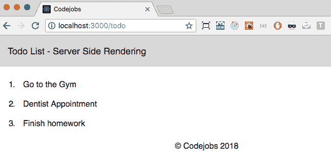

如果您想查看 SSR 是否正常工作，可以使用`curl`命令并在终端中执行相同的 URL：

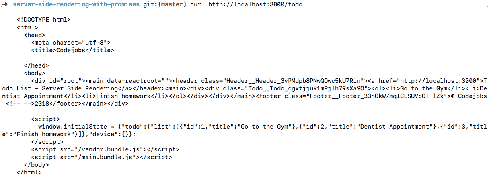

正如您所看到的，待办事项列表 reducer 已添加到`initialState`中，从那里，我们可以使用 SSR 渲染列表。

# 实施 Next.js

Next.js 是一个用于服务器渲染的 React 应用程序的极简框架。

在这个教程中，我们将学习如何使用 Sass 实现 Next.js，并且我们还将使用 axios 从服务中获取数据。

# 准备工作

首先，让我们创建一个名为`nextjs`的新目录，初始化`package.json`，最后在其中创建一个新目录：

```jsx
 mkdir nextjs
 cd nextjs
 npm init -y
 mkdir src
```

然后我们需要安装一些依赖项：

```jsx
 npm install next react react-dom axios node-sass @zeit/next-sass
```

# 如何做...

现在我们已经安装了依赖项，让我们创建我们的第一个 Next.js 应用程序：

1.  我们需要做的第一件事是在我们的 package.json 中创建一些脚本。在每个脚本中，我们需要指定`src`目录。否则，它将尝试从根目录而不是`src`路径启动 Next：

```jsx
  "scripts": {
    "start": "next start src",
    "dev": "next src",
    "build": "next build src"
  }
```

文件：package.json

1.  Next 中的主目录称为`pages`。这是我们将使用 Next 渲染的所有`pages`的位置：

```jsx
 cd src && mkdir pages
```

1.  我们需要创建的第一个页面是`index.jsx`：

```jsx
 const Index = () => <h1>Home</h1>;

  export default Index;
```

文件：src/pages/index.jsx

1.  现在让我们使用 dev 脚本运行我们的应用程序：

```jsx
 npm run dev
```

1.  如果一切正常，您应该在终端中看到这个：

！[](assets/f75b2344-5ab1-4d52-af63-01d928622c7d.png)

1.  打开`http://localhost:3000`：

！[](assets/d996d9a6-c555-4412-9451-dce13b0b2d21.png)

Next.js 有自己的 Webpack 配置和热重载功能。这意味着如果您编辑 index.js 文件，您将看到反映这些更改而无需刷新页面。

1.  现在让我们创建一个关于页面，看看路由是如何工作的：

```jsx
 const About = () => <h1>About</h1>;

  export default About;
```

文件：src/pages/about.jsx

1.  现在，如果您转到 http://localhost:3000/about，您将看到关于页面。正如您所看到的，Next.js 会自动为我们创建的每个页面创建一个新路由。这意味着我们不需要安装 React Router 来处理路由。

在 Next 页面中，不需要导入 React，因为 Next 也会自动处理它。

1.  现在我们需要创建一个`next.config.js`文件，并导入 withSass 方法来在我们的项目中使用 Sass。不幸的是，这个文件需要用 ES5 语法编写，因为目前不支持使用 ES6 的 babel 扩展（[`github.com/zeit/next.js/issues/2916`](https://github.com/zeit/next.js/issues/2916)）：

```jsx
 const withSass = require('@zeit/next-sass');

  module.exports = withSass();
```

文件：src/next.config.js 在这个文件中，如果需要，我们还可以添加自定义的 Webpack 配置。

1.  然后我们需要在`pages`目录中创建一个特殊的文件叫做`_document.js`。这个文件会被 Next.js 自动处理，我们可以在这里定义文档的头部和正文：

```jsx
  import Document, { Head, Main, NextScript } from 'next/document';

  export default class MyDocument extends Document {
    render() {
      return (
        <html>
          <Head>
            <title>Codejobs with Next</title>
            <link 
 rel="stylesheet" 
 href="/_next/static/style.css" />
          </Head>

          <body>
            <Main />
            <NextScript />
          </body>
        </html>
      );
    }
  }
```

文件：src/pages/_document.jsCSS 文件的路径（`/_next/static/style.css`）是默认的；我们应该使用它来在我们的项目中使用样式。

1.  现在我们可以创建一些组件来包装我们的页面。我们需要创建的第一个是菜单选项的导航栏：

```jsx
  import Link from 'next/link';
  import './Navbar.scss';

  const Navbar = () => (
    <div className="navbar">
      <ul>
        <li>Codejobs</li>
        <li><Link href="/">Home</Link></li>
        <li><Link href="/about">About</Link></li>
      </ul>
    </div>
  )
 export default Navbar;
```

文件：src/components/Navbar.jsx Link 组件与 React Router Link 不同。有一些区别；例如，React Router Link 使用“to”prop，而 Next Link 使用“href”来指定 URL。

1.  现在我们可以为我们的`navbar`添加 Sass 样式：

```jsx
 .navbar {
    background: black;
    color: white;
    height: 60px;

    ul {
      padding: 0;
      margin: 0;
      list-style: none;

      li {
        display: inline-block;
        margin-left: 30px;
        text-align: center;

        a {
          display: block;
          color: white;
          line-height: 60px;
          width: 150px;

          &:hover {
            background: white;
            color: black;
          }
        }
      }
    }
  }
```

文件：src/components/Navbar.scss

1.  然后我们需要创建我们的 Layout 组件：

```jsx
  import Navbar from './Navbar';
  import './Layout.scss';

  const Layout = ({ children }) => (
    <div className="layout">
      <Navbar />

      <div className="wrapper">
        {children}
      </div>
    </div>
  )

  export default Layout;
```

文件：src/components/Layout.jsx

1.  我们的 Layout 的样式如下：

```jsx
  body {
    font-family: verdana;
    padding: 0;
    margin: 0;
  }

  .layout {
    a {
      text-decoration: none;
    }

    .wrapper {
      margin: 0 auto;
      width: 96%;
    }
  }
```

文件：src/components/Layout.scss

1.  你还记得第五章中的配方，*精通 Redux*，关于从 CoinMarketCap 列出前 100 个加密货币（`Repository: Chapter05/Recipe2/coinmarketcap`）吗？在这个配方中，我们将使用 Next.js 做同样的事情。我们需要做的第一件事是修改页面的`index.js`文件，并在`getInitialProps`方法中进行异步`axios`请求：

```jsx
  import axios from 'axios';
  import Layout from '../components/Layout';
  import Coins from '../components/Coins';

  const Index = ({ coins }) => (
    <Layout>
      <div className="index">
        <Coins coins={coins} />
      </div>
    </Layout>
  );

  Index.getInitialProps = async () => {
    const url = 'https://api.coinmarketcap.com/v1/ticker/';
    const res = await axios.get(url);

    return {
      coins: res.data
    };
  };

 export default Index;
```

文件：src/pages/index.js

1.  现在让我们创建`Coins`组件：

```jsx
  // Dependencies
  import React, { Component } from 'react';
  import { array } from 'prop-types';

  // Styles
  import './Coins.scss';

  const Coins = ({ coins }) => (
    <div className="Coins">
      <h1>Top 100 Coins</h1>

      <ul>
        {coins.map((coin, key) => (
          <li key={key}>
            <span className="left">{coin.rank} {coin.name} <strong>
            {coin.symbol}</strong></span>
            <span className="right">${coin.price_usd}</span>
          </li>
        ))}
      </ul>
    </div>
  );

  Coins.propTypes = {
    coins: array
  };

 export default Coins;
```

文件：src/components/Coins.jsx

1.  `Coins`组件的样式如下：

```jsx
 .Coins {
    h1 {
      text-align: center;
    }

    ul {
      margin: 0 auto;
      margin-bottom: 20px;
      padding: 0;
      list-style: none;
      width: 400px;

      li {
        border-bottom: 1px solid black;
        text-align: left;
        padding: 10px;
        display: flex;
        justify-content: space-between;

        a {
          display: block;
          color: #333;
          text-decoration: none;
          background: #5ed4ff;

          &:hover {
            color: #333;
            text-decoration: none;
            background: #baecff;
          }
        }
      }
    }
  }
```

文件：src/components/Coins.scss

# 它是如何工作的...

现在我们已经创建了所有页面和组件，让我们通过运行`npm run dev`来测试我们的 Next 应用程序：


现在让我们看看它在 HTML 视图中是如何渲染的：

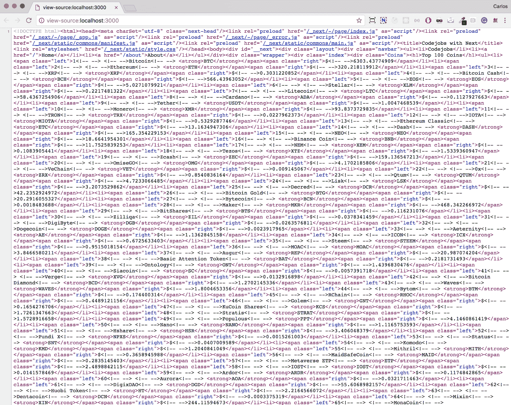

万岁！HTML 以 SSR 方式呈现，非常适合改善 SEO。正如你所看到的，使用 Next 创建应用程序非常快速，而且在启用 SSR 时避免了大量的配置。
