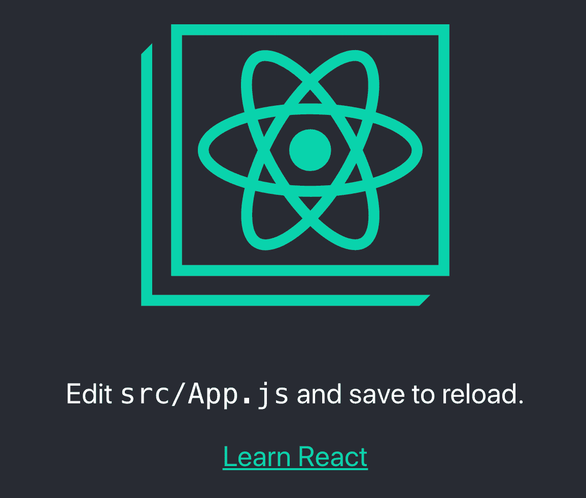
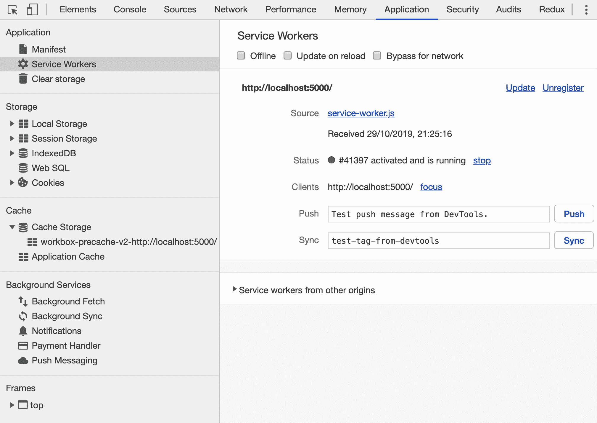
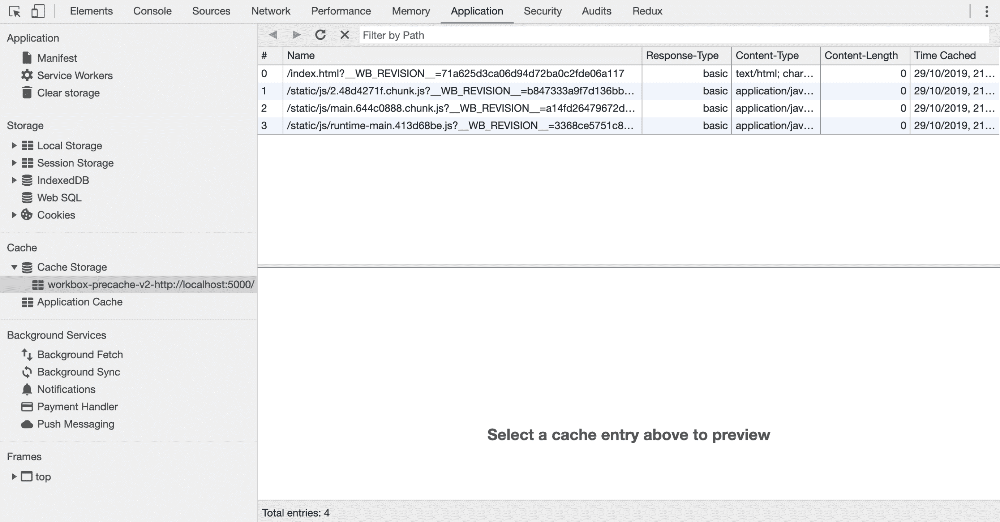
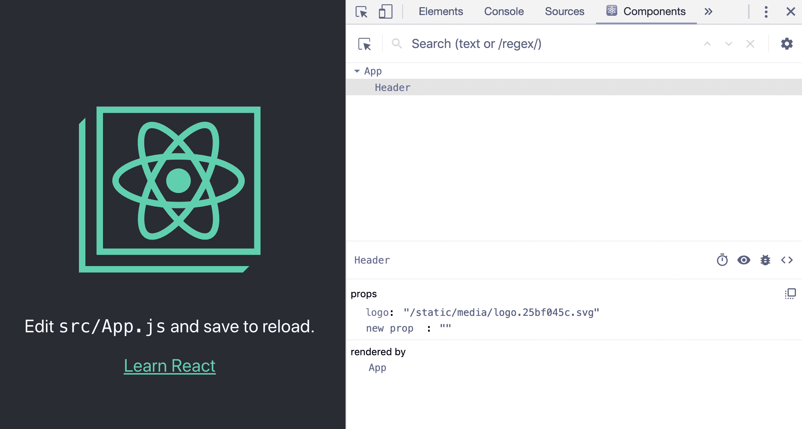
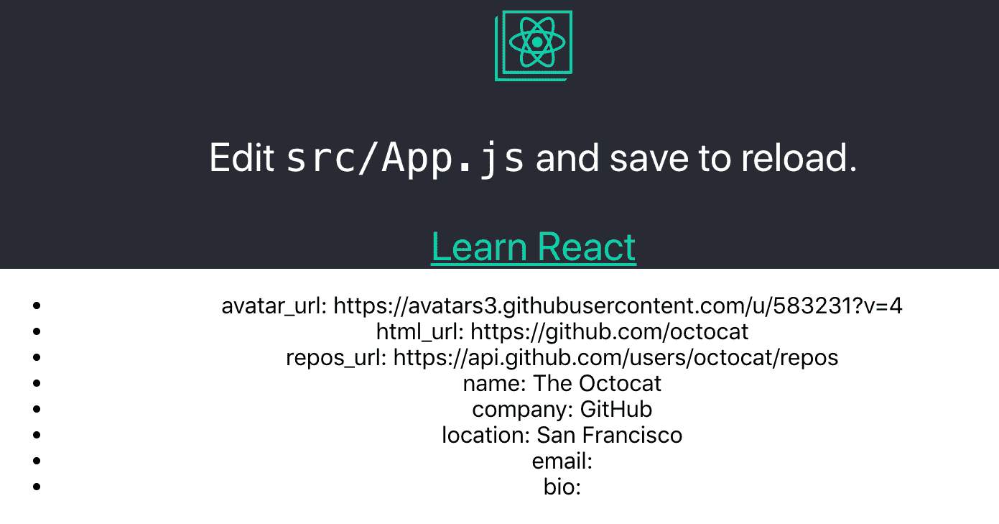
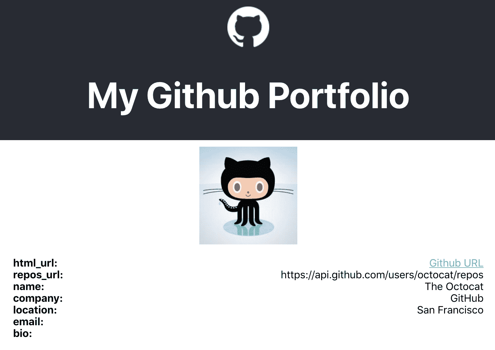
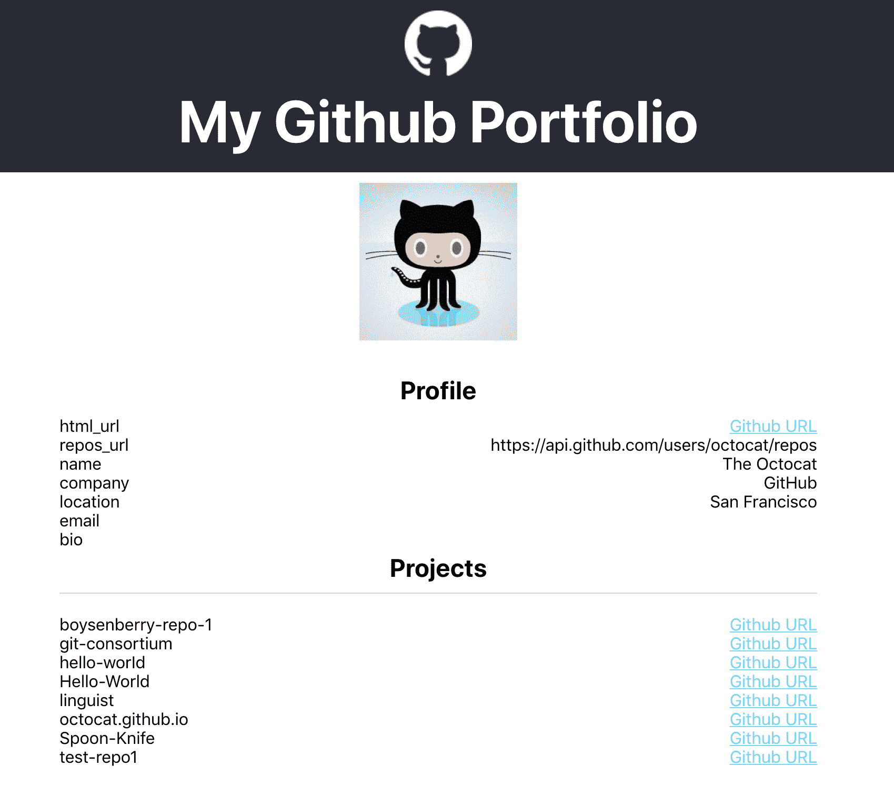
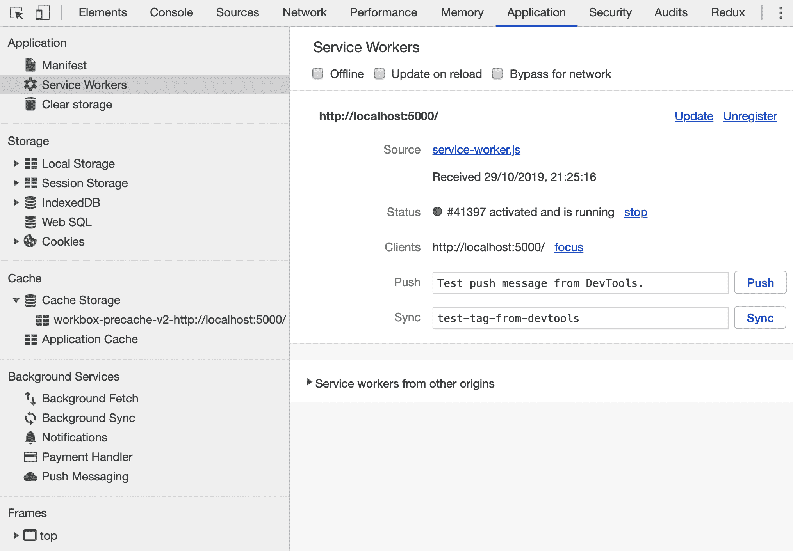

# 第二章：使用可重用的 React 组件创建渐进式 Web 应用程序

在完成第一章后，您是否已经对 React 的核心概念感到熟悉？太好了！这一章对您来说将不成问题！如果没有，不要担心-您在上一章中遇到的大多数概念将被重复。但是，如果您想获得更多关于 webpack 和 Babel 的经验，建议您再次尝试在第一章中创建项目，*在 React 中创建电影列表应用程序*，因为本章不会涵盖这些主题。

在这一章中，您将使用 Create React App，这是一个由 React 核心团队创建的入门套件，可以快速开始使用 React，并且可以用作**渐进式 Web 应用程序**（**PWA**）-一种行为类似移动应用程序的 Web 应用程序。这将使模块捆绑器和编译器（如 webpack 和 Babel）的配置变得不必要，因为这将在 Create React App 包中处理。这意味着您可以专注于构建您的 GitHub 作品集应用程序，将其作为一个 PWA，重用 React 组件和样式。

除了设置 Create React App 之外，本章还将涵盖以下主题：

+   创建渐进式 Web 应用程序

+   构建可重用的 React 组件

+   使用`styled-components`在 React 中进行样式设置

迫不及待？让我们继续吧！

# 项目概述

在这一章中，我们将使用 Create React App 和`styled-components`创建具有可重用 React 组件和样式的 PWA。该应用程序将使用从公共 GitHub API 获取的数据。

建立时间为 1.5-2 小时。

# 入门

在本章中，您将创建的项目将使用 GitHub 的公共 API，您可以在[`developer.github.com/v3/`](https://developer.github.com/v3/)找到。要使用此 API，您需要拥有 GitHub 帐户，因为您将希望从 GitHub 用户帐户中检索信息。如果您还没有 GitHub 帐户，可以通过在其网站上注册来创建一个。此外，您需要从这里下载 GitHub 标志包：[`github-media-downloads.s3.amazonaws.com/GitHub-Mark.zip`](https://github-media-downloads.s3.amazonaws.com/GitHub-Mark.zip)。此应用程序的完整源代码也可以在 GitHub 上找到：[`github.com/PacktPublishing/React-Projects/tree/ch2`](https://github.com/PacktPublishing/React-Projects/tree/ch2)。

# GitHub 作品集应用程序

在这一部分，我们将学习如何使用 Create React App 创建一个新的 React 项目，并将其设置为一个可以重用 React 组件和使用`styled-components`进行样式设置的 PWA。

# 使用 Create React App 创建 PWA

每次创建新的 React 项目都需要配置 webpack 和 Babel 可能会非常耗时。此外，每个项目的设置可能会发生变化，当我们想要为我们的项目添加新功能时，管理所有这些配置变得困难。

因此，React 核心团队推出了一个名为 Create React App 的起始工具包，并在 2018 年发布了稳定版本 2.0。通过使用 Create React App，我们不再需要担心管理编译和构建配置，即使 React 的新版本发布了，这意味着我们可以专注于编码而不是配置。此外，它还具有我们可以使用的功能，可以轻松创建 PWA。

PWA 通常比普通的 Web 应用程序更快、更可靠，因为它专注于离线/缓存优先的方法。这使得用户在没有或者网络连接缓慢的情况下仍然可以打开我们的应用程序，因为它专注于缓存。此外，用户可以将我们的应用程序添加到他们的智能手机或平板电脑的主屏幕，并像本地应用程序一样打开它。

这一部分将向我们展示如何创建一个具有 PWA 功能的 React 应用程序，从设置一个新的应用程序开始，使用 Create React App。

# 安装 Create React App

Create React App 可以通过命令行安装，我们应该全局安装它，这样该包就可以在我们本地计算机的任何地方使用，而不仅仅是在特定项目中：

```jsx
npm install -g create-react-app
```

现在`create-react-app`包已经安装完成，我们准备创建我们的第一个 Create React App 项目。有多种设置新项目的方法，但由于我们已经熟悉了`npm`，我们只需要学习两种方法。让我们开始吧：

1.  第一种方法是使用`npm`创建一个新项目，运行以下命令：

```jsx
npm init react-app github-portfolio
```

您可以将`github-portfolio`替换为您想要为此项目使用的任何其他名称。

1.  另外，我们也可以使用`npx`，这是一个与`npm`（v5.2.0 或更高版本）预装的工具，简化了我们执行`npm`包的方式：

```jsx
npx create-react-app github-portfolio
```

这两种方法都将启动 Create React App 的安装过程，这可能需要几分钟，具体取决于您的硬件。虽然我们只执行一个命令，但 Create React App 的安装程序将安装我们运行 React 应用程序所需的软件包。因此，它将安装`react`，`react-dom`和`react-scripts`，其中最后一个软件包包含了编译、运行和构建 React 应用程序的所有配置。

如果我们进入项目的根目录，该目录以我们的项目名称命名，我们会看到它具有以下结构：

```jsx
github-portfolio
|-- node_modules
|-- public
    |-- favicon.ico
    |-- index.html
    |-- manifest.json
|-- src
    |-- App.css
    |-- App.js
    |-- App.test.js
    |-- index.css
    |-- index.js
    |-- logo.svg
    |-- serviceWorker.js
.gitignore
package.json
```

这个结构看起来很像我们在第一章设置的结构，尽管有一些细微的差异。`public`目录包括所有不应包含在编译和构建过程中的文件，而该目录中的文件是唯一可以直接在`index.html`文件中使用的文件。`manifest.json`文件包含 PWA 的默认配置，这是我们将在本章后面学到更多的内容。

在另一个名为`src`的目录中，我们将找到在执行`package.json`文件中的任何脚本时将被编译和构建的所有文件。有一个名为`App`的组件，它由`App.js`，`App.test.js`和`App.css`文件定义，以及一个名为`index.js`的文件，它是 Create React App 的入口点。`serviceWorker.js`文件是设置 PWA 所需的，这也是本节下一部分将讨论的内容。

如果我们打开`package.json`文件，我们会看到定义了三个脚本：`start`，`build`和`test`。由于测试是目前尚未处理的事情，我们现在可以忽略这个脚本。为了能够在浏览器中打开项目，我们只需在命令行中输入以下命令，即以开发模式运行`package react-scripts`：

```jsx
npm start
```

如果我们访问`http://localhost:3000/`，默认的 Create React App 页面将如下所示：



由于`react-scripts`默认支持热重载，我们对代码所做的任何更改都将导致页面重新加载。如果我们运行构建脚本，将在项目的根目录中创建一个名为`build`的新目录，其中可以找到我们应用程序的缩小捆绑包。

使用基本的 Create React App 安装完成后，本节的下一部分将向我们展示如何启用功能，将该应用程序转变为 PWA。

# 创建 PWA

Create React App 自带了一个支持 PWA 的配置，在我们初始化构建脚本时生成。我们可以通过访问`src/index.js`文件并修改最后一行来将我们的 Create React App 项目设置为 PWA，这将注册`serviceWorker`：

```jsx
import React from 'react';
import ReactDOM from 'react-dom';
import './index.css';
import App from './App';
import * as serviceWorker from './serviceWorker';

ReactDOM.render(<App />, document.getElementById('root'));

// If you want your app to work offline and load faster, you can change
// unregister() to register() below. Note this comes with some pitfalls.
// Learn more about service workers: http://bit.ly/CRA-PWA
- //serviceWorker.register();
+ serviceWorker.register();
```

现在，当我们运行构建脚本时，我们的应用程序的压缩包将使用离线/缓存优先的方法。在幕后，`react-scripts`使用一个名为`workbox-webpack-plugin`的包，它与 webpack 4 一起工作，将我们的应用程序作为 PWA 提供。它不仅缓存放在`public`目录中的本地资产；它还缓存导航请求，以便我们的应用程序在不稳定的移动网络上更可靠地运行。

另一个在使用 Create React App 设置 PWA 中起作用的文件是`manifest.json`。我们的 PWA 的大部分配置都放在这里，如果我们打开`public/manifest.json`文件就可以看到。在这个配置 JSON 文件中，我们会找到操作系统和浏览器的最重要的部分。让我们来分解一下：

1.  这个文件包含了`short_name`和`name`字段，描述了我们的应用程序应该如何被用户识别：

```jsx
{
  "short_name": "React App",
  "name": "Create React App Sample",

...
```

`short_name`字段的长度不应超过 12 个字符，并将显示在用户主屏幕上应用程序图标的下方。对于`name`字段，我们最多可以使用 45 个字符。这是我们应用程序的主要标识符，并且可以在将应用程序添加到主屏幕的过程中看到。

1.  当用户将我们的应用程序添加到主屏幕时，他们看到的特定图标可以在`icons`字段中配置：

```jsx
  "icons": [
    {
      "src": "favicon.ico",
      "sizes": "64x64 32x32 24x24 16x16",
      "type": "image/x-icon"
    }
  ],
```

正如我们之前提到的，`favicon.ico`文件被用作唯一的图标，并以`image/x-icon`格式以多种尺寸提供。对于`manifest.json`，同样的规则适用于`index.html`。只有放在 public 目录中的文件才能从这个文件中引用。

1.  最后，使用`theme_color`和`background_color`字段，我们可以为打开我们的应用程序时在移动设备主屏幕上设置顶部栏的颜色（以十六进制格式）：

```jsx
  ...
  "theme_color": "#000000",
  "background_color": "#ffffff"
}
```

默认的工具栏和 URL 框不会显示；相反，会显示一个顶部栏。这种行为类似于原生移动应用程序。

配置文件还可以处理的另一件事是国际化，当我们的应用程序以不同的语言提供内容时，这将非常有用。如果我们的应用程序有多个版本在生产中，我们还可以在这个文件中添加版本控制。

我们在这里所做的更改配置了应用程序，使其作为 PWA 运行，但目前还不向用户提供这些功能。在本节的下一部分，我们将学习如何提供这个 PWA 并在浏览器中显示出来。

# 提供 PWA

PWA 的配置已经就绪，现在是时候看看这将如何影响应用程序了。如果您仍在运行 Create React App（如果没有，请再次执行`npm start`命令），请访问项目`http://localhost:3000/`。我们会发现目前还没有任何变化。正如我们之前提到的，只有当我们的应用程序的构建版本打开时，PWA 才会可见。为了做到这一点，请在项目的根目录中执行以下命令：

```jsx
npm run build 
```

这将启动构建过程，将我们的应用程序最小化为存储在`build`目录中的捆绑包。我们可以从本地机器上提供这个构建版本的应用程序。如果我们在命令行上查看构建过程的输出，我们会看到 Create React App 建议我们如何提供这个构建版本。

```jsx
npm install -g serve
serve -s build
```

`npm install`命令安装了`serve`包，用于提供构建的静态站点或者 JavaScript 应用程序。安装完这个包后，我们可以使用它在服务器或本地机器上部署`build`目录，方法如下：

```jsx
serve -s build
```

`-s`标志用于将任何未找到的导航请求重定向回我们的`index.js`文件。

如果我们在浏览器中访问我们的项目`http://localhost:5000/`，我们会发现一切看起来和我们在`http://localhost:3000/`上运行的版本完全一样。然而，有一个很大的不同：构建版本是作为 PWA 运行的。这意味着如果我们的互联网连接失败，应用程序仍然会显示。我们可以通过断开互联网连接或从命令行停止`serve`包来尝试这一点。如果我们在`http://localhost:5000/`上刷新浏览器，我们会看到完全相同的应用程序。

这是如何工作的？如果我们在浏览器（Chrome 或 Firefox）中打开开发者工具并访问应用程序选项卡，我们将看到侧边栏中的项目。我们首先应该打开的是 Service Workers。如果您使用 Chrome 作为浏览器，结果将类似于以下截图所示：



如果我们点击 Service Worker 侧边栏项目，我们将看到正在运行的所有 service worker 的列表。对于`localhost`，有一个活动的 service worker，其源为`service-worker.js` - 这与我们项目中的文件相同。该文件确保在没有或者网络连接缓慢的情况下提供我们应用程序的缓存版本。

当我们使用`npm start`在本地运行应用程序时，service worker 不应处于活动状态。由于 service worker 将缓存我们的应用程序，我们将无法看到我们所做的任何更改，因为缓存版本将是一个服务器。

这些缓存文件存储在浏览器缓存中，也可以在工具栏的缓存存储下找到。在这里，我们可能会看到多个缓存位置，这些位置是在构建应用程序时由`workbox-webpack-plugin`包创建的。

与我们应用程序相关的一个是`workbox-precache-v2-http://localhost:5000/`，其中包含我们应用程序的所有缓存文件：



在上述截图中，我们可以看到浏览器为我们的应用程序缓存了哪些文件，其中`index.html`文件是应用程序的入口点，以`static/`开头的文件是在构建过程中创建的，并代表我们应用程序的缩小捆绑包。正如我们所看到的，它包括缩小的`.js`、`.css`和`.svg`文件，这些文件存储在浏览器缓存中。每当用户加载我们的应用程序时，它都会尝试首先提供这些文件，然后再寻找网络连接。

创建了我们的第一个 PWA 并安装了 Create React App 后，我们将开始着手创建项目的组件并为它们设置样式。

# 构建可重用的 React 组件

在上一章中简要讨论了使用 JSX 创建 React 组件，但在本章中，我们将通过创建可以在整个应用程序中重用的组件来进一步探讨这个主题。首先，让我们看看如何构建我们的应用程序，这是基于上一章的内容的。

# 构建我们的应用程序

首先，我们需要以与第一章相同的方式构建我们的应用程序。这意味着我们需要在`src`目录内创建两个新目录，分别为`components`和`containers`。`App`组件的文件可以移动到`container`目录，`App.test.js`文件可以删除，因为测试还没有涉及到。

创建完目录并移动文件后，我们的应用程序结构将如下所示：

```jsx
github-portfolio
|-- node_modules
|-- public
    |-- favicon.ico
    |-- index.html
    |-- manifest.json
|-- src
 |-- components
 |-- containers
 |-- App.css
 |-- App.js
    |-- index.css
    |-- index.js
    |-- serviceWorker.js
.gitignore
package.json
```

不要忘记在`src/index.js`中更改对`App`组件的导入位置：

```jsx
import React from 'react';
import ReactDOM from 'react-dom';
import './index.css';
- import App from './App';
+ import App from './containers/App';
import * as serviceWorker from './serviceWorker';

ReactDOM.render(<App />, document.getElementById('root'));

...
```

在`src/containers/App.js`中的 React `logo`的位置也做同样的事情：

```jsx
import React, { Component } from 'react';
- import logo from './logo.svg';
+ import logo from '../logo.svg';
import './App.css';

class App extends Component {

...
```

如果我们再次运行`npm start`并在浏览器中访问项目，将不会有可见的变化，因为我们只是改变了项目的结构，而没有改变其内容。

我们的项目仍然只包含一个组件，这并不使它非常可重用。下一步将是将我们的`App`组件也分成`Components`。如果我们查看`App.js`中这个组件的源代码，我们会看到返回函数中已经有一个 CSS `header`元素。让我们将`header`元素改成一个 React 组件：

1.  首先，在`components`目录内创建一个名为`Header`的新目录，并将`classNames`、`App-header`、`App-logo`和`App-link`的样式复制到一个名为`Header.css`的新文件中：

```jsx
.App-logo {
  height: 40vmin;
  pointer-events: none;
}

.App-header {
  background-color: #282c34;
  display: flex;
  flex-direction: column;
  align-items: center;
  justify-content: center;
  font-size: calc(10px + 2vmin);
  color: white;
}

.App-link {
  color: #61dafb;
}

@keyframes App-logo-spin {
  from {
    transform: rotate(0deg);
  }
  to {
    transform: rotate(360deg);
  }
}
```

1.  现在，在这个目录内创建一个名为`Header.js`的文件。这个文件应该返回与`<header>`元素相同的内容。

```jsx
import React from 'react';
import './Header.css';

const Header = () => (
 <header className='App-header'>
     
     <p>
       Edit <code>src/App.js</code> and save to reload.
     </p>
     <a
       className='App-link'
       href='https://reactjs.org'
       target='_blank'
       rel='noopener noreferrer'
     >
       Learn React
     </a>
 </header>
);

export default Header;
```

1.  在`App`组件内导入这个`Header`组件，并将其添加到`return`函数中：

```jsx
import React, { Component } from 'react';
+ import Header from '../components/App/Header';
import logo from '../logo.svg';
import './App.css';

class App extends Component {
 render() {
   return (
     <div className='App'>
-      <header  className='App-header'> -         -        <p>Edit <code>src/App.js</code> and save to reload.</p> -        <a -          className='App-link' -          href='https://reactjs.org' -          target='_blank' -          rel='noopener noreferrer' -        >
-          Learn React
-        </a> -      </header>
+      <Header />
     </div>
   );
 }
}

export default App;
```

当我们再次在浏览器中访问我们的项目时，会看到一个错误，说 logo 的值是未定义的。这是因为新的`Header`组件无法访问在`App`组件内定义的`logo`常量。根据我们在第一章学到的知识，我们知道这个 logo 常量应该作为 prop 添加到`Header`组件中，以便显示出来。让我们现在来做这个：

1.  将`logo`常量作为 prop 发送到`src/container/App.js`中的`Header`组件：

```jsx
...
class App extends Component {
 render() {
   return (
     <div className='App'>
-      <Header />
+      <Header logo={logo} />
     </div>
   );
 }
}

export default App;
```

1.  获取`logo`属性，以便它可以被`img`元素作为`src`属性在`src/components/App/Header.js`中使用：

```jsx
import React from 'react';

- const Header = () => (
+ const Header = ({ logo }) => (
 <header className='App-header'>
   

   ...
```

在上一章中，演示了`prop-types`包的使用，但在本章中没有使用。如果您想在本章中也使用`prop-types`，可以使用`npm install prop-types`从`npm`安装该包，并在要使用它的文件中导入它。

在这里，当我们在浏览器中打开项目时，我们看不到任何可见的变化。但是，如果我们打开 React 开发者工具，我们将看到项目现在被分成了一个`App`组件和一个`Header`组件。该组件以`.svg`文件的形式接收`logo`属性，如下截图所示：



`Header`组件仍然被分成多个可以拆分为单独组件的元素。看看`img`和`p`元素，它们看起来已经很简单了。但是，`a`元素看起来更复杂，需要接受诸如`url`、`title`、`className`等属性。为了将这个`a`元素改为可重用的组件，它需要被移动到我们项目中的不同位置。

为此，在`components`目录中创建一个名为`Link`的新目录。在该目录中，创建一个名为`Link.js`的新文件。该文件应返回与我们已经在`Header`组件中拥有的相同的`a`元素。此外，我们可以将`url`和`title`作为属性发送到该组件。现在让我们这样做：

1.  从`src/components/Header/Header.css`中删除`App-link`类的样式，并将其放置在名为`Link.css`的文件中：

```jsx
.App-link {
    color: #61dafb;
}
```

1.  创建一个名为`Link`的新组件，该组件接受`url`和`title`属性。该组件将这些属性添加为`<a>`元素的属性，放在`src/components/Link/Link.js`中：

```jsx
import React from 'react';
import './Link.css';

const Link = ({ url, title }) => (
  <a
    className='App-link'
    href={url}
    target='_blank'
    rel='noopener noreferrer'
  >
    {title}
  </a>
);

export default Link;
```

1.  导入这个`Link`组件，并将其放置在`src/components/Header/Header.js`中的`Header`组件中：

```jsx
import React from 'react';
+ import Link from '../Link/Link';

const Header = ({ logo }) => (
 <header className='App-header'>
   
   <p>Edit <code>src/App.js</code> and save to reload.</p>
-  <a -    className='App-link' -    href='https://reactjs.org' -    target='_blank' -    rel='noopener noreferrer' -  > -    Learn React
-  </a>
+  <Link url='https://reactjs.org' title='Learn React' />
 </header>
);

export default Header;
```

我们的代码现在应该如下所示，这意味着我们已成功将目录分成了`containers`和`components`，其中组件被放置在以组件命名的单独子目录中：

```jsx
github-portfolio
|-- node_modules
|-- public
    |-- favicon.ico
    |-- index.html
    |-- manifest.json
|-- src
    |-- components
        |-- Header
            |-- Header.js
            |-- Header.css
        |-- Link
            |-- Link.js
            |-- Link.css
    |-- containers
        |-- App.css
        |-- App.js
    |-- index.css
    |-- index.js
    |-- serviceWorker.js
.gitignore
package.json
```

然而，如果我们在浏览器中查看项目，就看不到任何可见的变化。然而，在 React 开发者工具中，我们的应用程序结构已经形成。`App`组件显示为组件树中的父组件，而`Header`组件是一个具有`Link`作为子组件的子组件。

在本节的下一部分，我们将向该应用程序的组件树中添加更多组件，并使这些组件在整个应用程序中可重用。

# 在 React 中重用组件

我们在本章中构建的项目是一个 GitHub 作品集页面；它将显示我们的公共信息和公共存储库的列表。因此，我们需要获取官方的 GitHub REST API（v3）并从两个端点拉取信息。获取数据是我们在第一章中做过的事情，但这次信息不会来自本地 JSON 文件。检索信息的方法几乎是相同的。我们将使用 fetch API 来做这件事。

我们可以通过执行以下命令从 GitHub 检索我们的公共 GitHub 信息。将代码的粗体部分末尾的`username`替换为您自己的`username`：

```jsx
curl 'https://api.github.com/users/username'
```

如果您没有 GitHub 个人资料或者没有填写所有必要的信息，您也可以使用`octocat`用户名。这是 GitHub `吉祥物`的用户名，已经填充了示例数据。

这个请求将返回以下输出：

```jsx
{
  "login": "octocat",
  "id": 1,
  "node_id": "MDQ6VXNlcjE=",
  "avatar_url": "https://github.com/images/error/octocat_happy.gif",
  "gravatar_id": "",
  "url": "https://api.github.com/users/octocat",
  "html_url": "https://github.com/octocat",
  "followers_url": "https://api.github.com/users/octocat/followers",
  "following_url": "https://api.github.com/users/octocat/following{/other_user}",
  "gists_url": "https://api.github.com/users/octocat/gists{/gist_id}",
  "starred_url": "https://api.github.com/users/octocat/starred{/owner}{/repo}",
  "subscriptions_url": "https://api.github.com/users/octocat/subscriptions",
  "organizations_url": "https://api.github.com/users/octocat/orgs",
  "repos_url": "https://api.github.com/users/octocat/repos",
  "events_url": "https://api.github.com/users/octocat/events{/privacy}",
  "received_events_url": "https://api.github.com/users/octocat/received_events",
  "type": "User",
  "site_admin": false,
  "name": "monalisa octocat",
  "company": "GitHub",
  "blog": "https://github.com/blog",
  "location": "San Francisco",
  "email": "octocat@github.com",
  "hireable": false,
  "bio": "There once was...",
  "public_repos": 2,
  "public_gists": 1,
  "followers": 20,
  "following": 0,
  "created_at": "2008-01-14T04:33:35Z",
  "updated_at": "2008-01-14T04:33:35Z"
}
```

JSON 输出中的多个字段都被突出显示，因为这些是我们在应用程序中将使用的字段。这些字段是`avatar_url`，`html_url`，`repos_url`，`name`，`company`，`location`，`email`和`bio`，其中`repos_url`字段的值实际上是另一个我们需要调用以检索该用户所有存储库的 API 端点。这是我们将在本章稍后要做的事情。

由于我们想在应用程序中显示这个结果，我们需要做以下事情：

1.  要从 GitHub 检索这些公共信息，请创建一个名为`Profile`的新容器，并将以下代码添加到`src/containers/Profile.js`中：

```jsx
import React, { Component } from 'react';

class Profile extends Component {
  constructor() {
    super();
    this.state = {
      data: {},
      loading: true,
    }
  }

  async componentDidMount() {
    const profile = await fetch('https://api.github.com/users/octocat');
    const profileJSON = await profile.json();

    if (profileJSON) {
      this.setState({
        data: profileJSON,
        loading: false,
      })
    }
  }

  render() {
    return (
      <div></div>
    );
  }
}

export default Profile;
```

这个新组件包含一个`constructor`，其中设置了`state`的初始值，以及一个`componentDidMount`生命周期方法，该方法在异步使用时，当获取的 API 返回结果时，为`state`设置一个新值。由于我们仍然需要创建新组件来显示数据，因此尚未呈现任何结果。

现在，将这个新组件导入到`App`组件中：

```jsx
import React, { Component } from 'react';
+ import Profile from './Profile';
import Header from '../components/Header/Header';
import logo from '../logo.svg';
import './App.css';

class App extends Component {
  render() {
    return (
      <div className='App'>
        <Header logo={logo} />
+       <Profile />
      </div>
    );
  }
}

export default App;
```

1.  快速查看我们项目运行的浏览器，我们会发现这个新的`Profile`组件还没有显示。这是因为`Header.css`文件具有`height`属性，其`view-height`为`100`，这意味着组件将占据整个页面的高度。要更改此设置，请打开`scr/components/App/Header.css`文件并更改以下突出显示的行：

```jsx
.App-logo {
- height: 40vmin;
+ height: 64px;
  pointer-events: none;
}

.App-header {
  background-color: #282c34;
- min-height: 100vh;
+ height: 100%;
  display: flex;
  flex-direction: column;
  align-items: center;
  justify-content: center;
  font-size: calc(10px + 2vmin);
  color: white;
}

...
```

1.  我们的页面上应该有足够的空间来显示`Profile`组件，因此我们可以再次打开`scr/containers/Profile.js`文件，并显示 GitHub API 返回的`avatar_url`、`html_url`、`repos_url`、`name`、`company`、`location`、`email`和`bio`字段：

```jsx
...

render() {
+   const { data, loading } = this.state;

+   if (loading) {
+       return <div>Loading...</div>;
+   }

    return (
      <div>
+       <ul>
+         <li>avatar_url: {data.avatar_url}</li>
+         <li>html_url: {data.html_url}</li>
+         <li>repos_url: {data.repos_url}</li>
+         <li>name: {data.name}</li>
+         <li>company: {data.company}</li>
+         <li>location: {data.location}</li>
+         <li>email: {data.email}</li>
+         <li>bio: {data.bio}</li>
+       </ul>
      </div>
    );
  }
}

export default Profile;
```

保存此文件并在浏览器中访问我们的项目后，我们将看到显示 GitHub 信息的项目列表，如下截图所示：



由于这看起来不太好看，页眉与页面内容不匹配，让我们对这两个组件的`样式`文件进行一些更改：

1.  更改`Header`组件的代码，删除 React 标志，并用 GitHub 标志替换它。我们不再需要从`App`组件中获取`logo`作为属性。此外，`Link`组件可以从这里删除，因为我们将在稍后在`Profile`组件中使用它：

```jsx
import React from 'react';
- import logo from '../logo.svg';
+ import logo from '../../GitHub-Mark-Light-64px.png';
- import Link from '../components/Link';
import './Header.css';

- const Header = ({ logo }) => (
+ const Header = () => (
  <header className='App-header'>
    
-   <p>
+   <h1>
-     Edit <code>src/App.js</code> and save to reload.
+     My Github Portfolio
-   </p>
+   </h1> -   <Link url='https://reactjs.org' title='Learn React' />
  </header>
);

export default Header;
```

1.  更改`scr/containers/Profile.js`中的突出显示的行，我们将把头像图像与项目列表分开，并在字段名称周围添加`strong`元素。还记得我们之前创建的`Link`组件吗？这将用于在 GitHub 网站上创建指向我们个人资料的链接：

```jsx
import React, { Component } from 'react';
+ import Link from '../components/Link/Link';
+ import './Profile.css';

class Profile extends Component {

  ...

      return (
-       <div>
+       <div className='Profile-container'>
+         
-         <ul>
-           ...
-         </ul>
+         <ul>
+           <li><strong>html_url:</strong> <Link url={data.html_url} title='Github URL' /></li>
+           <li><strong>repos_url:</strong> {data.repos_url}</li>
+           <li><strong>name:</strong> {data.name}</li>
+           <li><strong>company:</strong> {data.company}</li>
+           <li><strong>location:</strong> {data.location}</li>
+           <li><strong>email:</strong> {data.email}</li>
+           <li><strong>bio:</strong> {data.bio}</li>
+         </ul>
+      </div>
    );
  }
}

export default Profile;
```

1.  不要忘记创建`src/containers/Profile.css`文件，并将以下代码粘贴到其中。这定义了`Profile`组件的样式：

```jsx
.Profile-container {
  width: 50%;
  margin: 10px auto;
}

.Profile-avatar {
  width: 150px;
}

.Profile-container > ul {
 list-style: none;
 padding: 0;
 text-align: left;
}

.Profile-container > ul > li {
 display: flex;
 justify-content: space-between;
}
```

最后，我们可以看到应用程序开始看起来像一个 GitHub 作品集页面，其中有一个显示 GitHub 标志图标和标题的页眉，接着是我们的 GitHub 头像和我们的公共信息列表。这导致应用程序看起来类似于以下截图中显示的内容：



如果我们查看`Profile`组件中的代码，我们会发现有很多重复的代码，因此我们需要将显示我们公共信息的列表转换为一个单独的组件。让我们开始吧：

1.  在新的`src/components/List`目录中创建一个名为`List.js`的新文件：

```jsx
import React from 'react';

const List = () => (
  <ul></ul>
);

export default List;
```

1.  在`Profile`组件中，可以在`src/containers/Profile.js`文件中找到，我们可以导入这个新的`List`组件，构建一个包含我们想要在此列表中显示的所有项目的新数组，并将其作为一个 prop 发送。对于`html_url`字段，我们将发送`Link`组件作为值，而不是从 GitHub API 返回的值：

```jsx
import React, { Component } from 'react';
import Link from '../components/Link/Link';
+ import List from '../components/List/List';

class Profile extends Component {

...

render() {
  const { data, loading } = this.state;

  if (loading) {
    return <div>Loading...</div>;
  }

+ const items = [
+   { label: 'html_url', value: <Link url={data.html_url} title='Github URL' /> },
+   { label: 'repos_url', value: data.repos_url },
+   { label: 'name', value: data.name},
+   { label: 'company', value: data.company },
+   { label: 'location', value: data.location },
+   { label: 'email', value: data.email },
+   { label: 'bio', value: data.bio }
+ ]

  return (
    <div className='Profile-container'>
      
-     <ul>
-       <li><strong>html_url:</strong> <Link url={data.html_url} title='Github URL' /></li>
-       <li><strong>repos_url:</strong> {data.repos_url}</li>
-       <li><strong>name:</strong> {data.name}</li>
-       <li><strong>company:</strong> {data.company}</li>
-       <li><strong>location:</strong> {data.location}</li>
-       <li><strong>email:</strong> {data.email}</li>
-       <li><strong>bio:</strong> {data.bio}</li>
-     </ul>
+     <List items={items} />
    </div>
   );
  }
}

export default Profile;
```

1.  在`List`组件中，我们现在可以映射`items`属性并返回带有样式的列表项：

```jsx
import React from 'react';

- const List = () => (
+ const List = ({ items }) => (
  <ul>
+   {items.map(item =>
+     <li key={item.label}>
+       <strong>{item.label}</strong>{item.value}
+     </li>
+   )}
  </ul>
);

export default List;
```

假设我们正确执行了前面的步骤，你的应用在美学上不应该有任何变化。然而，如果我们查看 React 开发者工具，我们会发现组件树已经发生了一些变化。

在下一节中，我们将使用`styled-components`而不是 CSS 来为这些组件添加样式，并添加链接到我们 GitHub 账户的存储库。

# 使用`styled-components`在 React 中添加样式

到目前为止，我们一直在使用 CSS 文件为我们的 React 组件添加样式。然而，这迫使我们在不同的组件之间导入这些文件，这使得我们的代码不够可重用。因此，我们将把`styled-components`包添加到项目中，这允许我们在 JavaScript 中编写 CSS（所谓的**CSS-in-JS**）并创建组件。

通过这样做，我们将更灵活地为我们的组件添加样式，可以防止由于`classNames`而产生样式重复或重叠，并且可以轻松地为组件添加动态样式。所有这些都可以使用我们用于 CSS 的相同语法来完成，就在我们的 React 组件内部。

第一步是使用`npm`安装`styled-components`：

```jsx
npm install styled-components
```

如果你查看`styled-components`的官方文档，你会注意到他们强烈建议你也使用这个包的 Babel 插件。但是，由于你使用 Create React App 来初始化你的项目，你不需要添加这个插件，因为所有编译你的应用程序需要的工作已经被`react-scripts`处理了。

安装`styled-components`后，让我们尝试从其中一个组件中删除 CSS 文件。一个很好的开始是`Link`组件，因为这是一个非常小的组件，功能有限：

1.  首先导入`styled-components`包并创建一个名为`InnerLink`的新样式化组件。这个组件扩展了一个`a`元素，并采用了我们已经为`className` `App-link`得到的 CSS 规则：

```jsx
import React from 'react';
+ import styled from 'styled-components'; import './Link.css';

+ const InnerLink = styled.a`
+  color: #61dafb;
+ `;

const Link = ({ url, title }) => (
  <a className='App-link'
    href={url}
    target='_blank'
    rel='noopener noreferrer'
  >
    {title}
  </a>
);

export default Link;
```

1.  添加了这个组件后，我们可以用这个 styled component 替换现有的`<a>`元素。此外，我们也不再需要导入`Link.css`文件，因为所有的样式现在都在这个 JavaScript 文件中进行了设置。

```jsx
import React from 'react';
import styled from 'styled-components';
- import './Link.css';

const InnerLink = styled.a`
 color: #61dafb;
`;

const Link = ({ url, title }) => (
- <a className='App-link'
+ <InnerLink
    href={url}
    target='_blank'
    rel='noopener noreferrer'
  >
    {title}
- </a>
+ </InnerLink>
);

export default Link;
```

如果我们再次运行`npm start`并在浏览器中访问我们的项目，我们会看到删除 CSS 文件后，我们的应用程序仍然看起来一样。下一步是替换所有导入 CSS 文件进行样式设置的其他组件：

1.  为`src/components/Header/Header.js`中的`Header`组件添加`styled-components`并删除 CSS 文件：

```jsx
import React from 'react';
+ import styled from 'styled-components';
import logo from '../../GitHub-Mark-Light-64px.png';
- import './Header.css'

+ const HeaderWrapper = styled.div`
+  background-color: #282c34;
+  height: 100%;
+  display: flex;
+  flex-direction: column;
+  align-items: center;
+  justify-content: center;
+  font-size: calc(10px + 2vmin);
+  color: white;
+ `;

+ const Logo = styled.img`
+  height: 64px;
+  pointer-events: none;
+ `;

const Header = ({ logo }) => (
- <header className='App-header'>
+ <HeaderWrapper>
    <Logo src={logo} alt='logo' />
    <h1>My Github Portfolio</h1>
- </header>
+ </HeaderWrapper>
);

export default Header;
```

1.  为`src/containers/App.js`中的`App`组件添加`styled-components`并删除 CSS 文件：

```jsx
import React, { Component } from 'react';
+ import styled from 'styled-components';
import Profile from './Profile';
import Header from '../components/App/Header';
- import './App.css'; 
+ const AppWrapper = styled.div`
+  text-align: center;
+ `;

class App extends Component {
 render() {
   return (
-    <div className="App">
+    <AppWrapper>
       <Header />
       <Profile />
-    </div>
+    </AppWrapper>
   );
  }
}

export default App;
```

1.  为`List`组件中的`ul`、`li`和`strong`元素添加一些 styled components：

```jsx
import React from 'react';
+ import styled from 'styled-components';

+ const ListWrapper = styled.ul`
+  list-style: none;
+  text-align: left;
+  padding: 0;
+ `;

+ const ListItem = styled.li`
+  display: flex;
+  justify-content: space-between;
+ `;

+ const Label = styled.span`
+  font-weight: strong;
+ `;

const List = ({ items }) => (
- <ul>
+ <ListWrapper>
    {items.map(item =>
-     <li key={item.label}>
+     <ListItem key={item.label}>
-       <strong>{item.label}</strong>{item.value}
+       <Label>{item.label}</Label>{item.value}
-     </li>
+     </ListItem>
    )}
-  </ul>
+  </ListWrapper>
);

export default List;
```

1.  最后，通过将`Profile`组件中的最后两个元素转换为 styled components，删除`Profile.css`文件：

```jsx
import React, { Component } from 'react';
+ import styled from 'styled-components';
import Link from '../components/Link/Link';
import List from '../components/List/List';
- import './Profile.css';

+ const ProfileWrapper = styled.div`
+  width: 50%;
+  margin: 10px auto;
+ `;

+ const Avatar = styled.img`
+  width: 150px;
+ `;

class Profile extends Component {

...

  return (
-   <div className='Profile-container'>
+   <ProfileWrapper>
-     
+     <Avatar src={data.avatar_url} alt='avatar' />
 <List items={items} />
-   </div>
+   </ProfileWrapper>
  );
 }
}

export default Profile;
```

现在再次在浏览器中打开项目；我们的应用程序应该看起来仍然一样。我们所有的组件都已经转换为使用`styled-components`，不再使用 CSS 文件和`classNames`进行样式设置。不要忘记删除`containers`和`components`目录及子目录中的`.css`文件。

然而，在项目中仍然有一个 CSS 文件直接位于`src`目录内。这个 CSS 文件包含了`<body>`元素的样式，该元素存在于`public/index.html`文件中，并已被导入到`src/index.js`文件中。为了删除这个 CSS 文件，我们可以使用`styled-components`中的`createGlobalStyle`函数来为我们的应用程序添加`<body>`元素的样式。

我们可以为`App`组件内的全局样式创建一个 styled component，并将`<body>`元素的 CSS 样式粘贴到其中。由于这个组件应该与我们的`AppWrapper`组件在组件树中处于相同的层次结构，我们需要使用**React Fragments**，因为 JSX 组件应该被封装在一个封闭标签内。

```jsx
import React, { Component } from 'react';
- import styled from 'styled-components';
+ import styled, { createGlobalStyle } from 'styled-components';
import Profile from './Profile';
import Header from '../components/App/Header';

+ const GlobalStyle = createGlobalStyle`
+  body {
+    margin: 0;
+    padding: 0;
+    font-family: -apple-system, BlinkMacSystemFont, "Segoe UI", "Roboto", "Oxygen",
+    "Ubuntu", "Cantarell", "Fira Sans", "Droid Sans", "Helvetica Neue",
+    sans-serif;
+    -webkit-font-smoothing: antialiased;
+    -moz-osx-font-smoothing: grayscale;
+  }
+ `;

...

class App extends Component {
 render() {
   return (
+   <> 
+    <GlobalStyle />
     <AppWrapper>
       <Header />
       <Profile />
     </AppWrapper>
+   </>
  );
 }
}

export default App;
```

`<>`标签是`<React.Fragment>`的简写。这些 React Fragments 用于在单个封闭标签内列出子组件，而无需向 DOM 添加额外的节点。

现在，我们应该能够删除项目中的最后一个 CSS 文件，即`src/index.css`。我们可以通过在浏览器中查看项目来确认这一点。我们将看不到由`src/index.css`文件设置的`body`字体的任何更改。

最后一步是在 Github 作品集页面上显示我们 Github 个人资料中的存储库。检索这些存储库的 API 端点也是由检索我们用户信息的端点返回的。要显示这些存储库，我们可以重用之前创建的`List`组件：

1. 从 API 端点加载存储库列表并将其添加到`src/containers/Profile.js`中的`state`中：

```jsx
...

class Profile extends Component {
  constructor() {
    super();
    this.state = {
      data: {},
+     repositories: [],
      loading: true,
    }
  }

  async componentDidMount() {
    const profile = await fetch('https://api.github.com/users/octocat');
    const profileJSON = await profile.json();

    if (profileJSON) {
+     const repositories = await fetch(profileJSON.repos_url);
+     const repositoriesJSON = await repositories.json();

      this.setState({
        data: profileJSON,
+       repositories: repositoriesJSON,
        loading: false,
      })
    }
  }

  render() {
-   const { data, loading } = this.state; 
+   const { data, loading, repositories } = this.state;

    if (loading) {
      return <div>Loading...</div>
    }

    const items = [
      ...
    ];

 +  const projects = repositories.map(repository => ({
 +    label: repository.name,
 +    value: <Link url={repository.html_url} title='Github URL' />
 +  }));

...
```

1.  接下来，为存储库返回一个`List`组件，并向该列表发送一个名为`title`的 prop。我们这样做是因为我们想显示两个列表之间的区别：

```jsx
...

  render() {

  ...

    const projects = repositories.map(repository => ({
      label: repository.name,
      value: <Link url={repository.html_url} title='Github URL' />
    }));

    return (
      <ProfileWrapper>
         <Avatar src={data.avatar_url} alt='avatar' />
-       <List items={items} />
+       <List title='Profile' items={items} />
+       <List title='Projects' items={projects} />
      </ProfileWrapper>
    );
  }
}

export default Profile;
```

1.  对`src/components/List/List.js`中的`List`组件进行更改，并在每个列表的顶部显示标题。在这种情况下，我们将使用 React Fragments 来防止不必要的节点被添加到 DOM 中：

```jsx
import React from 'react';
import styled from 'styled-components';

+ const Title = styled.h2`
+  padding: 10px 0;
+  border-bottom: 1px solid lightGrey;
+ `;

...

- const List = ({ items }) => (
+ const List = ({ items, title }) => (
+  <>
+    <Title>{title}</Title>
     <ListWrapper>
       {items.map(item =>
         <ListItem key={item.label}>
           <Label>{item.label}</Label>{item.value}
         </ListItem>
       )}
     </ListWrapper>
+  </>
);

export default List;
```

现在，如果我们再次在浏览器中访问该项目，我们将看到我们在本章中创建的 GitHub 作品集页面。该应用程序将看起来像以下截图所示，其中使用了上一节中的默认 GitHub 用户来获取数据：



现在，我们已经使用了 Create React App 并启用了项目作为 PWA 的设置，当我们访问项目的`build`版本时，应该能够看到一个缓存版本。要构建项目，请运行以下命令：

```jsx
npm run build
```

然后，通过运行以下命令来提供`build`版本：

```jsx
serve -s build
```

我们可以通过访问`http://localhost:5000/`来查看我们应用程序的`build`版本。但是，我们可能会看到我们应用程序的第一个版本。这是因为该项目已创建为 PWA，因此将显示应用程序的缓存版本。我们可以通过转到浏览器的开发者工具中的`Application`选项卡来重新启动 Service Worker 并缓存我们应用程序的新版本：



在此页面中，选择侧边栏中的 Service Workers。从这里，我们可以通过按下`Update`按钮来更新`localhost`的 service worker。`service-worker.js`文件将被再次调用，并且当前缓存的版本将被新版本替换。我们还可以通过检查`Offline`复选框来测试我们的应用程序在互联网连接失败时的响应方式。

正如我们所看到的，`Header`组件已经被正确缓存，但是没有来自 GitHub 的信息被显示出来。相反，`Profile`组件显示了一个`Loading...`消息，因为没有从 API 请求中返回任何信息。如果我们在浏览器中打开开发者工具并查看控制台，我们会看到一个错误消息。我们可以捕获这个错误来显示为什么我们的应用程序不包含任何内容的原因：

1.  为了做到这一点，我们需要改变`src/containers/Profile.js`文件，并向`state`添加一个名为`error`的变量：

```jsx
...

class Profile extends Component {
  constructor() {
    super();
    this.state = {
      data: {},
      repositories: [],
      loading: false,
+     error: '',
    }
  }

  async componentDidMount() {
     ...
```

1.  这个变量要么是一个空字符串，要么包含`try...catch`方法返回的错误消息：

```jsx
...

  async componentDidMount() {
+   try {
      const profile = await fetch('https://api.github.com/users/octocat');
      const profileJSON = await profile.json();

      if (profileJSON) {
        const repositories = await fetch(profileJSON.repos_url);
        const repositoriesJSON = await repositories.json();

       this.setState({
         data: profileJSON,
         repositories: repositoriesJSON,
         loading: false,
       });
     }
   }
+  catch(error) {
+    this.setState({
+      loading: false,
+      error: error.message,
+    });
+  }
+ } ...
```

1.  当组件被渲染时，如果发生错误，错误状态也应该从状态中获取并显示，而不是显示加载状态。

```jsx
...

render() {
-  const { data, loading, repositories } = this.state;
+  const { data, loading, repositories, error } = this.state;

-  if (loading) {
-    return <div>Loading...</div>;
+  if (loading || error) {
+    return <div>{loading ? 'Loading...' : error}</div>;
  }

...

export default Profile;
```

通过这些更改，状态现在具有加载状态的初始值，在应用程序首次挂载时显示`Loading...`消息。GitHub 端点被包裹在`try...catch`语句中，这意味着当`fetch`函数失败时，我们可以捕获错误消息。如果发生这种情况，`loading`的值将被错误消息替换。

我们可以通过再次构建我们的应用程序并在本地运行它来检查这些更改是否起作用，就像这样：

```jsx
npm run build
serve -s build
```

当我们访问项目`http://localhost:5000`并在浏览器的开发者工具中的`Application`选项卡中将应用程序设置为离线模式时，我们将看到一个`Failed to fetch`消息被显示出来。现在，我们知道如果用户在没有活动互联网连接的情况下使用我们的应用程序，他们将看到这条消息。

# 总结

在本章中，您使用 Create React App 创建了 React 应用程序的起始项目，该项目具有用于库（如 Babel 和 webpack）的初始配置。通过这样做，您不必自己配置这些库，也不必担心您的 React 代码将如何在浏览器中运行。此外，Create React App 还提供了 PWA 的默认设置，您可以通过注册服务工作程序来使用。这使得您的应用程序在没有互联网连接或在移动设备上运行时可以平稳运行。还记得以前如何使用 CSS 来为应用程序添加样式吗？本章向您展示了如何使用`styled-components`包来创建可重用且无需导入任何 CSS 文件的样式化组件，因为它使用了 CSS-in-JS 原则。

即将到来的章节将全部使用 Create React App 创建的项目，这意味着这些项目不需要您对 webpack 或 Babel 进行更改。您在本章中喜欢使用`styled-components`吗？那么您将喜欢这本书中大多数项目都是使用这个包进行样式设计，包括下一章。

在下一章中，我们将在本章的基础上创建一个使用 React 的动态项目管理板，其中使用了**Suspense**等功能。

# 进一步阅读

+   Create React App: [`facebook.github.io/create-react-app/`](https://facebook.github.io/create-react-app/)

+   使用 npx: [`medium.com/@maybekatz/introducing-npx-an-npm-package-runner-55f7d4bd282b`](https://medium.com/@maybekatz/introducing-npx-an-npm-package-runner-55f7d4bd282b)

+   使用 Create React App 创建 PWA [`facebook.github.io/create-react-app/docs/making-a-progressive-web-app`](https://facebook.github.io/create-react-app/docs/making-a-progressive-web-app)

+   关于`manifest.json`文件：[`developers.chrome.com/apps/manifest`](https://developers.chrome.com/apps/manifest)

+   Styled components: [`www.styled-components.com/docs/basics`](https://www.styled-components.com/docs/basics)
