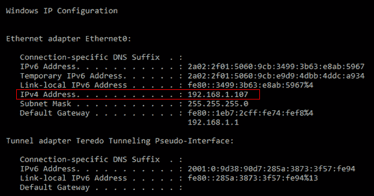
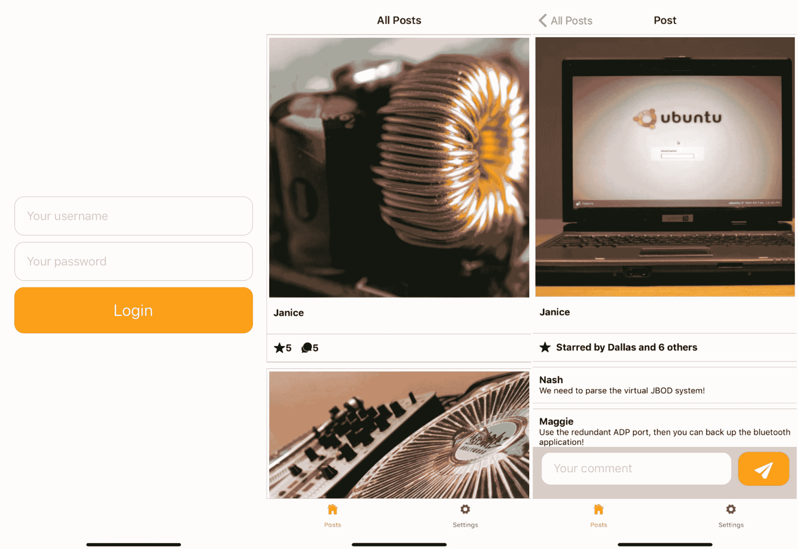
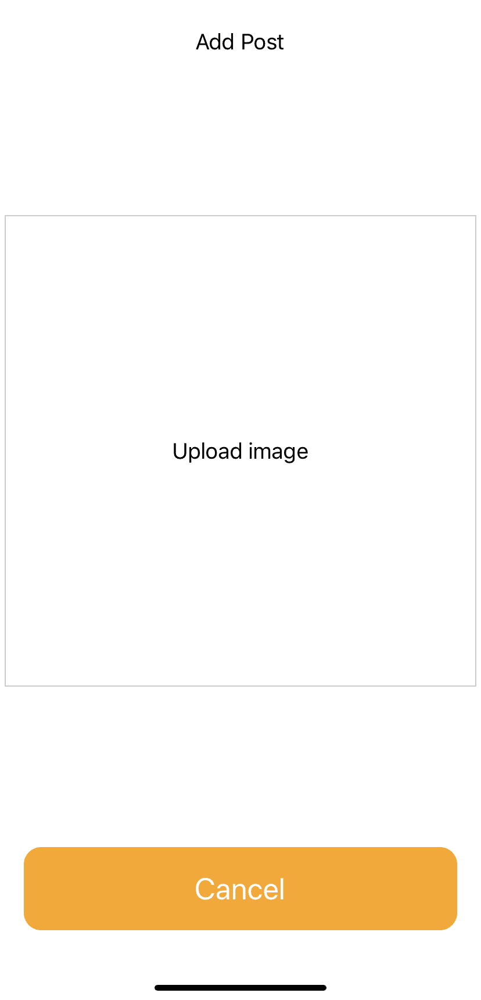
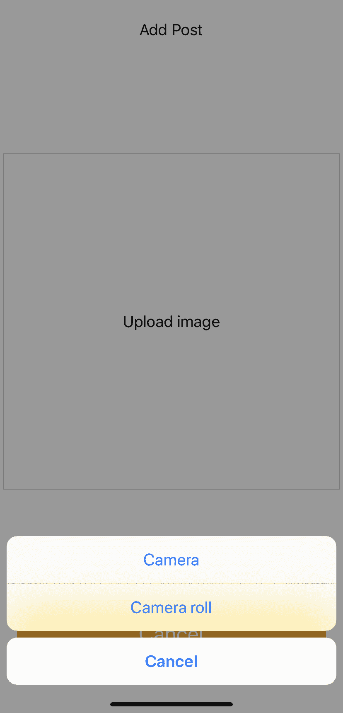
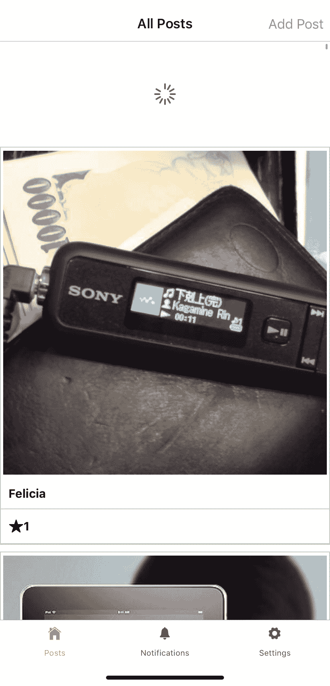
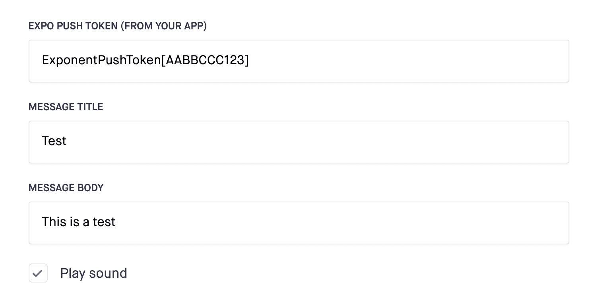
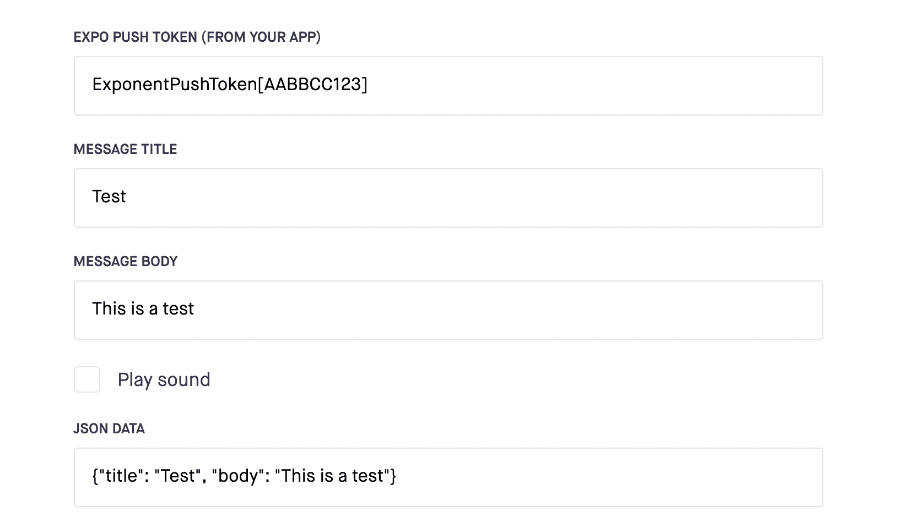

# 第十一章：使用 React Native 和 GraphQL 构建全栈社交媒体应用程序

到目前为止，你几乎可以称自己是 React Native 的专家了，因为你即将开始在 React Native 部分中工作最复杂的应用程序。移动应用程序的一个巨大优势是，你可以直接向安装了你的应用程序的人发送通知。这样，你可以在应用程序中发生重要事件或有人很久没有使用应用程序时，针对用户。此外，移动应用程序可以直接使用设备的相机拍照和录像。

在上一章中，你创建了一个移动消息应用程序，具有身份验证流程和实时数据，并使用 React Native 的 GraphQL。这些模式和技术也将在本章中使用，以创建一个移动社交媒体应用程序，让你将图片发布到社交动态，并允许你对这些帖子进行点赞和评论。在本章中，使用相机不仅是一个重要的部分，还将添加使用 Expo 向用户发送通知的可能性。

本章将涵盖以下主题：

+   使用 React Native 和 Expo 的相机

+   使用 React Native 和 GraphQL 刷新数据

+   使用 Expo 发送移动通知

# 项目概述

一个移动社交媒体应用程序，使用本地 GraphQL 服务器请求和添加帖子到社交动态，包括使用移动设备上的相机。使用本地 GraphQL 服务器和 React Navigation 添加基本身份验证，同时使用 Expo 访问相机（滚动）并在添加新评论时发送通知。

构建时间为 2 小时。

# 入门

我们将在本章中创建的项目基于 GitHub 上的初始版本：[`github.com/PacktPublishing/React-Projects/tree/ch11-initial`](https://github.com/PacktPublishing/React-Projects/tree/ch11-initial)。完整的源代码也可以在 GitHub 上找到：[`github.com/PacktPublishing/React-Projects/tree/ch11`](https://github.com/PacktPublishing/React-Projects/tree/ch11)。

你需要在移动 iOS 或 Android 设备上安装 Expo Client 应用程序，才能在物理设备上运行项目。

强烈建议使用 Expo Client 应用程序在物理设备上运行本章的项目。目前，仅支持在物理设备上接收通知，并且在 iOS 模拟器或 Android Studio 模拟器上运行项目将导致错误消息。

或者，您可以在计算机上安装 Xcode 或 Android Studio 来在虚拟设备上运行应用程序：

+   **对于 iOS**：可以在这里找到如何设置本地机器以运行 iOS 模拟器的信息：[`docs.expo.io/versions/v36.0.0/workflow/ios-simulator/`](https://docs.expo.io/versions/v36.0.0/workflow/ios-simulator/)。

+   **对于 Android**：可以在这里找到如何设置本地机器以从 Android Studio 运行模拟器的信息：[`docs.expo.io/versions/v36.0.0/workflow/android-studio-emulator/`](https://docs.expo.io/versions/v36.0.0/workflow/android-studio-emulator/)。在运行模拟器时存在已知问题，可以通过确保以下行存在于您的`~/.bash_profile`或`~/.bash_rc`文件中来防止这种情况：

```jsx
export ANDROID_SDK=**ANDROID_SDK_LOCATION** export PATH=**ANDROID_SDK_LOCATION**/platform-tools:$PATH export PATH=**ANDROID_SDK_LOCATION**/tools:$PATH
```

`ANDROID_SDK_LOCATION`的值是本地机器上 Android SDK 的路径，可以通过打开 Android Studio 并转到**首选项**|**外观和行为**|**系统设置**|**Android SDK**来找到。路径在声明 Android SDK 位置的框中列出，看起来像这样：`/Users/myuser/Library/Android/sdk`。

该应用程序是使用**Expo SDK 版本 33.0.0**创建的，因此，您需要确保您在本地机器上使用的 Expo 版本类似。由于 React Native 和 Expo 经常更新，请确保您使用此版本，以便本章中描述的模式表现如预期。如果您的应用程序无法启动或遇到错误，请参考 Expo 文档，了解有关更新 Expo SDK 的更多信息。

# 检出初始项目

该项目由两部分组成，一个是样板 React Native 应用程序，另一个是 GraphQL 服务器。 React Native 应用程序位于`client`目录中，而 GraphQL 服务器放置在`server`目录中。在本章中，您需要始终同时运行应用程序和服务器，而只对`client`目录中的应用程序进行代码更改。

要开始，您需要在`client`和`server`目录中运行以下命令，以安装所有依赖项并启动服务器和应用程序：

```jsx
npm install && npm start
```

对于移动应用程序，此命令将在安装依赖项后启动 Expo，并使您能够从终端或浏览器启动项目。在终端中，您现在可以使用 QR 码在移动设备上打开应用程序，或者在模拟器中打开应用程序。

此项目的本地 GraphQL 服务器正在运行`http://localhost:4000/graphql/`，但为了能够在 React Native 应用程序中使用此端点，您需要找到您机器的本地 IP 地址。

要查找本地 IP 地址，您需要根据您的操作系统执行以下操作：

+   **对于 Windows**：打开终端（或命令提示符）并运行此命令：

```jsx
ipconfig
```

这将返回一个类似下面所见的列表，其中包含来自您本地机器的数据。在此列表中，您需要查找字段**IPv4 地址**：



+   **对于 macOS**：打开终端并运行此命令：

```jsx
ipconfig getifaddr en0
```

运行此命令后，将返回您机器的本地`Ipv4 地址`，看起来像这样：

```jsx
192.168.1.107
```

必须使用本地 IP 地址来创建文件`client/App.js`中的`API_URL`的值，前缀为`http://`，后缀为`/graphql`，使其看起来像`http://192.168.1.107/graphql`：

```jsx
...

**- const API_URL = '';**
**+ const API_URL = 'http://192.168.1.107/graphql';**

const  httpLink  =  new  HttpLink({
 uri: API_URL,  }); const  authLink  =  setContext(async (_, { headers }) => {

  ...
```

无论您是从虚拟设备还是物理设备打开应用程序，此时应用程序应该看起来像这样：



此应用程序是使用**Expo SDK 版本 33.0.0**创建的，因此您需要确保您本地机器上使用的 Expo 版本类似。由于 React Native 和 Expo 经常更新，请确保您使用此版本，以确保本章中描述的模式表现如预期。如果您的应用程序无法启动或收到错误消息，请务必查看 Expo 文档，以了解有关更新 Expo SDK 的更多信息。

初始应用程序由七个屏幕组成：`AddPost`、`AuthLoading`、`Login`、`Notifications`、`Post`、`Posts`和`Settings`。当首次启动应用程序时，您将看到`Login`屏幕，您可以使用以下凭据登录：

+   **用户名**：`test`

+   **密码**：`test`

`Posts` 屏幕将是登录后的初始屏幕，显示一个帖子列表，您可以点击继续到`Post`屏幕，而`Settings`屏幕显示一个无效的注销按钮。目前，`AddPost`和`Notification`屏幕尚不可见，因为您将在本章后面添加到这些屏幕的路由。

React Native 应用程序中的项目结构在`directory` client 中如下，结构类似于您在本书中之前创建的项目：

```jsx
messaging
|-- client
    |-- .expo
    |-- assets
        |-- icon.png
        |-- splash.png
    |-- Components
        |-- // ...
    |-- node_modules
    |-- Screens
        |-- AddPost.js
        |-- AuthLoading.js
        |-- Login.js
        |-- Notifications.js
        |-- Post.js
        |-- Posts.js
        |-- Settings.js
    |-- .watchmanconfig
    |-- App.js
    |-- AppContainer.js
    |-- app.json
    |-- babel.config.js
    |-- package.json
```

在`assets`目录中，您可以找到用作应用程序图标的图像，一旦您在移动设备上安装了该应用程序，它将显示在主屏幕上，以及作为启动画面的图像，当您启动应用程序时显示。例如，应用程序名称的 App Store 配置放在`app.json`中，而`babel.config.js`包含特定的 Babel 配置。

`App.js`文件是您的应用程序的实际入口点，其中导入并返回`AppContainer.js`文件。在`AppContainer`中，定义了该应用程序的所有路由，`AppContext`将包含应该在整个应用程序中可用的信息。

该应用程序的所有组件都位于`Screens`和`Components`目录中，其中第一个包含由屏幕呈现的组件。这些屏幕的子组件可以在`Components`目录中找到，其结构如下：

```jsx
|-- Components
    |-- Button
        |-- Button.js
    |-- Comment
        |-- Comment.js
        |-- CommentForm.js
    |-- Notification
        |-- Notification.js
    |-- Post
        |-- PostContent.js
        |-- PostCount.js
        |-- PostItem.js
    |-- TextInput
        |-- TextInput.js
```

GraphQL 服务器可以在`http://localhost:4000/graphql` URL 找到，GraphQL Playground 将可见。从这个 playground，您可以查看 GraphQL 服务器的模式，并检查所有可用的查询、变异和订阅。虽然您不会对服务器进行任何代码更改，但了解模式及其工作原理是很重要的。

服务器有两个查询，通过使用`userName`参数作为标识符来检索帖子列表或单个帖子。这些查询将返回具有`id`、`userName`、`image`、`stars`和`comments`计数值的`Post`类型，`stars`类型的星星列表，以及具有`Comment`类型的`comments`列表。检索单个帖子的查询将如下所示：

```jsx
export  const  GET_POST  =  gql`
 query getPost($userName: String!) { post(userName: $userName) { id userName image stars { userName } comments { id userName text } } } `;
```

之后，可以在 GraphQL 服务器中找到三个变异，用于登录用户、存储来自 Expo 的推送令牌，或添加帖子。

如果收到错误消息“请提供（有效的）身份验证详细信息”，则需要重新登录应用程序。可能，上一个应用程序的 JWT 仍然存储在 Expo 的`AsyncStorage`中，并且这将无法在本章的 GraphQL 服务器上验证。

# 使用 React Native、Apollo 和 GraphQL 构建全栈社交媒体应用程序

在本章中要构建的应用程序将使用本地 GraphQL 服务器来检索和改变应用程序中可用的数据。该应用程序将显示来自社交媒体动态的数据，并允许您对这些社交媒体帖子进行回复。

# 使用 React Native 和 Expo 的相机

除了显示由 GraphQL 服务器创建的帖子之外，您还可以使用 GraphQL mutation 自己添加帖子，并将文本和图像作为变量发送。将图像上传到您的 React Native 应用程序可以通过使用相机拍摄图像或从相机滚动中选择图像来完成。对于这两种用例，React Native 和 Expo 都提供了 API，或者可以从`npm`安装许多包。对于此项目，您将使用 Expo 的 ImagePicker API，它将这些功能合并到一个组件中。

要向您的社交媒体应用程序添加创建新帖子的功能，需要进行以下更改以创建新的添加帖子屏幕：

1.  可以使用的 GraphQL mutation 用于向您在`Main`屏幕中看到的动态中添加帖子，它将图像变量发送到 GraphQL 服务器。此 mutation 具有以下形式：

```jsx
mutation {
  addPost(image: String!) {
    image
  }
}
```

`image`变量是`String`，是此帖子的图像的绝对路径的 URL。此 GraphQL mutation 需要添加到`client/constants.js`文件的底部，以便稍后可以从`useMutation` Hook 中使用：

```jsx
export  const  GET_POSTS  =  gql`
 ... `; + export  const  ADD_POST  =  gql` +   mutation addPost($image: String!) { +     addPost(image: $image) { +       image  +     } +   } + `;
```

1.  有了`Mutation`，必须将添加帖子的屏幕添加到`client/AppContainer.js`文件中的`SwitchNavigator`。`AddPost`屏幕组件可以在`client/Screens/AddPost.js`文件中找到，并应作为导航器中的模态添加：

```jsx
import  React  from 'react';  import { Platform } from 'react-native';  import { Ionicons }  from '@expo/vector-icons';  import {  createSwitchNavigator,
 createAppContainer } from 'react-navigation';
import { createStackNavigator } from 'react-navigation-stack';
import { createBottomTabNavigator } from 'react-navigation-tabs';  import  Posts  from './Screens/Posts';  import  Post  from './Screens/Post';  import  Settings  from './Screens/Settings';  import  Login  from './Screens/Login';  import  AuthLoading  from './Screens/AuthLoading';  + import  AddPost  from './Screens/AddPost'; ... 
const  SwitchNavigator  =  createSwitchNavigator(
  {
    Main:  TabNavigator, Login, AuthLoading,
**+** **AddPost,**
  },
  {
+   mode: 'modal'**,**
    initialRouteName: 'AuthLoading',
  },
);

export  default  createAppContainer(SwitchNavigator);
```

1.  当然，用户必须能够从应用程序的某个位置打开这个模态框，例如，从屏幕底部的选项卡导航器或标题栏。对于这种情况，您可以在`client/Screens/Posts.js`文件中设置`navigationOptions`来在标题栏中添加导航链接到`AddPost`屏幕：

```jsx
...

**+ Posts**.navigationOptions  = ({ navigation}) => ({ +   headerRight: ( +     <Button  onPress={() =>  navigation.navigate('AddPost')}  title='Add Post'  /> +   ), **+ });** export  default  Posts;
```

通过在`navigationOptions`中设置`headerRight`字段，只会更改标题的右侧部分，而导航器设置的标题将保持不变。现在点击`Add Post`链接将导航到`AddPost`屏幕，显示标题和关闭模态框的按钮。

现在您已经添加了`AddPost`屏幕，Expo 的 ImagePicker API 应该被添加到这个屏幕上。要将`ImagePicker`添加到`AddPost`屏幕上，请按照以下步骤在`client/Screens/AddPost.js`文件中启用从相机滚动中选择照片：

1.  在用户可以从相机滚动中选择照片之前，当用户使用 iOS 设备时，应该为应用程序设置正确的权限。要请求权限，您可以使用 Expo 的权限 API，它应该请求`CAMERA_ROLL`权限。权限 API 曾经直接从 Expo 可用，但现在已经移动到一个名为`expo-permissions`的单独包中，可以通过 Expo CLI 安装，方法是运行以下命令：

```jsx
expo install expo-permissions
```

1.  之后，您可以导入权限 API 并创建函数来检查是否已经为相机滚动授予了正确的权限：

```jsx
import  React  from 'react';  import { Dimensions, TouchableOpacity, Text, View } from 'react-native';  + import { Dimensions, Platform, TouchableOpacity, Text, View } from 'react-native'; import  styled  from 'styled-components/native';  import  Button  from '../Components/Button/Button';  + import * as Permissions from 'expo-permissions'; ...

const AddPost = ({ navigation }) => { +  const  getPermissionAsync  =  async () => { +    if (Platform.OS  === 'ios') { +      const { status } =  await  Permissions.askAsync(Permissions.CAMERA_ROLL);
+ +      if (status  !== 'granted') { +        alert('Sorry, you need camera roll permissions! Go to 'Settings > Expo' to enable these.'); +      } +    } **+ };**   ...
```

1.  这个`getPermissionAsync`函数是异步的，可以从`Button`或`Touchable`元素中调用。在文件底部可以找到`UploadImage`组件，它是一个带有`onPress`函数的样式化`TouchableOpacity`元素。这个组件必须添加到`AddPost`的返回函数中，并在点击时调用`getPermissionAsync`函数：

```jsx
...

const  AddPost  = ({ navigation }) => { const  getPermissionAsync  =  async () => { if (Platform.OS  === 'ios') {
 const { status } =  await  Permissions.askAsync(Permissions.CAMERA_ROLL);

 if (status  !== 'granted') {
 alert('Sorry, you need camera roll permissions! Go to 'Settings > Expo' to enable these.');
 } } };  return ( <AddPostWrapper>
 <AddPostText>Add Post</AddPostText> +     <UploadImage  onPress={() =>  getPermissionAsync()}> +       <AddPostText>Upload image</AddPostText> +     </UploadImage**>**
 <Button  onPress={() =>  navigation.navigate('Main')}  title='Cancel'  />
  </AddPostWrapper>
 ); };

...
```

在 iOS 设备上点击时，将打开一个请求访问相机滚动权限的弹出窗口。如果您不接受请求，就无法从相机滚动中选择照片。

您不能再次要求用户授予权限；相反，您需要手动授予对摄像机滚动的权限。要再次设置这个权限，您应该从 iOS 的设置屏幕进入，并选择 Expo 应用程序。在下一个屏幕上，您可以添加访问摄像机的权限。

1.  当用户已经授予访问摄像机滚动的权限时，您可以调用 Expo 的 ImagePicker API 来打开摄像机滚动。就像权限 API 一样，这曾经是 Expo 核心的一部分，但现在已经移动到一个单独的包中，您可以使用 Expo CLI 安装：

```jsx
expo install expo-image-picker
```

这是一个再次使用异步函数，它接受一些配置字段，比如宽高比。如果用户选择了一张图片，ImagePicker API 将返回一个包含字段 URI 的对象，该字段是用户设备上图片的 URL，可以在`Image`组件中使用。可以通过使用`useState` Hook 创建一个本地状态来存储这个结果，以便稍后将其发送到 GraphQL 服务器：

```jsx
import  React  from 'react';  import { Dimensions, Platform, TouchableOpacity, Text, View } from 'react-native';  import  styled  from 'styled-components/native';  import  Button  from '../Components/Button/Button'; **+ import * as ImagePicker from 'expo-image-picker';** import * as Permissions from 'expo-permissions';  ...

const  AddPost  = ({ navigation }) => { +  const [imageUrl, setImageUrl] = React.useState(false); 
+  const  pickImageAsync  =  async () => { +    const  result  =  await  ImagePicker.launchImageLibraryAsync({ +      mediaTypes:  ImagePicker.MediaTypeOptions.All, +      allowsEditing:  true, +      aspect: [4, 4], +    });
+    if (!result.cancelled) { +      setImageUrl(result.uri); +    }
+  };

 return (
     ... 
```

然后可以从函数中调用`pickImageAsync`函数，以获取用户在摄像机滚动时授予的权限：

```jsx
...

const  AddPost  = ({ navigation }) => { ...

  const  getPermissionAsync  =  async () => { if (Platform.OS  === 'ios') {
 const { status } =  await  Permissions.askAsync(Permissions.CAMERA_ROLL);

 if (status  !== 'granted') {
 alert('Sorry, you need camera roll permissions! Go to 'Settings > Expo' to enable these.');
**+     } else {**
**+       pickImageAsync();**
 } } };  return (
```

1.  现在，由于图片的 URL 已经存储在本地状态中的`imageUrl`常量中，您可以在`Image`组件中显示这个 URL。这个`Image`组件以`imageUrl`作为源的值，并且已经设置为使用 100%的`width`和`height`：

```jsx
...

  return ( <AddPostWrapper>
 <AddPostText>Add Post</AddPostText>

 <UploadImage  onPress={() =>  getPermissionAsync()}>
**+       {imageUrl ? (**
**+** <Image +           source={{ uri:  imageUrl }} +           style={{ width: '100%', height: '100%' }} +         />
+       ) : (
          <AddPostText>Upload image</AddPostText>
**+       )}**
 </UploadImage>
 <Button  onPress={() =>  navigation.navigate('Main')}  title='Cancel'  />
  </AddPostWrapper>
 ); };

...
```

通过这些更改，`AddPost`屏幕应该看起来像下面的截图，这是从运行 iOS 的设备上获取的。如果您使用 Android Studio 模拟器或运行 Android 的设备，这个屏幕的外观可能会有轻微的差异：



这些更改将使从摄像机滚动中选择照片成为可能，但您的用户还应该能够通过使用他们的摄像机上传全新的照片。使用 Expo 的 ImagePicker，您可以处理这两种情况，因为这个组件还有一个`launchCameraAsync`方法。这个异步函数将启动摄像机，并以与从摄像机滚动中返回图片的 URL 相同的方式返回它。

要添加直接使用用户设备上的摄像机上传图片的功能，可以进行以下更改：

1.  由于用户需要授予您的应用程序访问相机滚动条的权限，因此用户需要做同样的事情来使用相机。可以通过使用`Permissions.askAsync`方法发送`Permissions.CAMERA`来请求使用相机的权限。必须扩展对相机滚动条的授予权限的检查，以便还检查相机权限：

```jsx
...

  const  getPermissionAsync  =  async () => {  if (Platform.OS  === 'ios') { -   const { status } = await Permissions.askAsync(Permissions.CAMERA_ROLL);
-   if (status !== 'granted') {
+     const { status: statusCamera } =  await  Permissions.askAsync(Permissions.CAMERA); +     const { status: statusCameraRoll } =  await  Permissions.askAsync(Permissions.CAMERA_ROLL); +     if (statusCamera  !== 'granted'  ||  statusCameraRoll  !== 'granted'**) {**
        alert(
          `Sorry, you need camera roll permissions! Go to 'Settings > Expo' to enable these.`
        );
      } else {        pickImageAsync();
      }
    }
  };

  return (
    ... 
```

这将在 iOS 上要求用户允许使用相机，也可以通过转到设置| Expo 手动授予权限。

1.  在获得权限后，您可以通过调用`ImagePicker`中的`launchCameraAsync`函数来创建启动相机的功能。该功能与您创建的用于打开相机滚动条的`launchCameraAsync`函数相同；因此，`pickImageAsync`函数也可以编辑为能够启动相机：

```jsx
const  AddPost  = ({ navigation }) => { const [imageUrl, setImageUrl] =  React.useState(false);
 **-  const** pickImageAsync  =  async () => {  +  const addImageAsync  =  async (camera = false) => { -    const  result  =  await  ImagePicker.launchCameraAsync({ -      mediaTypes:  ImagePicker.MediaTypeOptions.All, -      allowsEditing:  true, -      aspect: [4, 4]
-    }); +    const  result  = !camera 
+      ? await  ImagePicker.launchImageLibraryAsync({ +          mediaTypes:  ImagePicker.MediaTypeOptions.All, +          allowsEditing:  true, +          aspect: [4, 4] +        })
+      : await  ImagePicker.launchCameraAsync({  +          allowsEditing:  true, +          aspect: [4, 4] **+        })**
 if (!result.cancelled) { setImageUrl(result.uri);
 } };
```

如果现在向`addImageAsync`函数发送参数，将调用`launchCameraAsync`。否则，用户将被引导到其设备上的相机滚动条。

1.  当用户点击图像占位符时，默认情况下将打开图像滚动条。但您还希望给用户选择使用他们的相机的选项。因此，必须在使用相机或相机滚动条上传图像之间进行选择，这是实现`ActionSheet`组件的完美用例。React Native 和 Expo 都有一个`ActionSheet`组件；建议使用 Expo 中的组件，因为它将在 iOS 上使用本机的`UIActionSheet`组件，在 Android 上使用 JavaScript 实现。`ActionSheet`组件可从 Expo 的`react-native-action-sheet`软件包中获得，您可以从`npm`安装。

```jsx
npm install @expo/react-native-action-sheet
```

之后，您需要在`client/App.js`文件中使用来自该软件包的`Provider`将顶级组件包装起来，这类似于添加`ApolloProvider`：

```jsx
import React from 'react';
import { AsyncStorage } from 'react-native';
import { ApolloClient } from 'apollo-client';
import { InMemoryCache } from 'apollo-cache-inmemory';
import { setContext } from 'apollo-link-context';
import { HttpLink } from 'apollo-link-http';
import { ApolloProvider } from '@apollo/react-hooks';
+ import { ActionSheetProvider } from '@expo/react-native-action-sheet';
import AppContainer from './AppContainer';

...

const  App  = () => (  <ApolloProvider  client={client}> +   <ActionSheetProvider>       <AppContainer  /> +   </ActionSheetProvider**>**
  </ApolloProvider> );

export  default  App;
```

在`client/Screens/AddPost.js`中通过从`react-native-action-sheet`导入`connectActionSheet`函数来创建`ActionSheet`，在导出之前需要将`AddPost`组件包装起来。使用`connectActionSheet()`将`AddPost`组件包装起来，将`showActionSheetWithOptions`属性添加到组件中，你将在下一步中使用它来创建`ActionSheet`：

```jsx
import  React  from 'react';  import { Dimensions,
 Image,
 Platform,
  TouchableOpacity,
  Text,
  View } from 'react-native';  import  styled  from 'styled-components/native';  import  *  as  ImagePicker  from 'expo-image-picker';  import  *  as  Permissions  from 'expo-permissions';  + import { connectActionSheet } from  '@expo/react-native-action-sheet'; import  Button  from '../Components/Button/Button'; ... - const  AddPost  = ({ navigation }) => { + const  AddPost  = ({ navigation, showActionSheetWithOptions }) => **{**

    ... 
- export default AddPost;
+ const  ConnectedApp  =  connectActionSheet(AddPost); + export  default  ConnectedApp;
```

1.  要添加`ActionSheet`，必须添加一个打开`ActionSheet`的函数，并使用`showActionSheetWithOptions`属性和选项来构造`ActionSheet`。选项包括`相机`、`相机相册`和`取消`，选择第一个选项应该调用带有参数的`addImageAsync`函数，第二个选项应该调用不带参数的函数，最后一个选项是关闭`ActionSheet`。打开`ActionSheet`的函数必须添加到`getPermissionsAsync`函数中，并在`相机`和`相机相册`的权限都被授予时调用：

```jsx
...

+  const openActionSheet = () => { +    const  options  = ['Camera', 'Camera roll', 'Cancel']; +    const  cancelButtonIndex  =  2; + 
+    showActionSheetWithOptions( +      {
+        options, +        cancelButtonIndex
+      },
+      buttonIndex  => { +        if (buttonIndex  ===  0  ||  buttonIndex  ===  1) { +          addImageAsync(buttonIndex  ===  0); +        }
+      },
+    );
+   };

  const  getPermissionAsync  =  async () => {    if (Platform.OS  === 'ios') {
      const { status: statusCamera } =  await  Permissions.askAsync(Permissions.CAMERA);
      const { status: statusCameraRoll } =  await  Permissions.askAsync(Permissions.CAMERA_ROLL);

      if (statusCamera  !== 'granted'  ||  statusCameraRoll  !== 'granted') {
        alert(
          `Sorry, you need camera roll permissions! Go to 'Settings > Expo' to enable these.`
        );
      } else { -       pickImageAsync**();**
**+       openActionSheet();**
      }
    }
  };

  return (
    ...
```

点击图像占位符将给用户选择使用`相机`或`相机相册`向`AddPost`组件添加图像的选项。这可以通过`ActionSheet`来实现，在 iOS 和 Android 上看起来会有所不同。在下面的截图中，您可以看到在使用 iOS 模拟器或运行 iOS 的设备时的效果：



1.  然而，这还不是全部，因为图像仍然必须发送到服务器才能出现在应用程序的动态中，通过从`@apollo/react-hooks`中添加`useMutation` Hook，并使用返回的`addPost`函数将`imageUrl`变量发送到 GraphQL 服务器的文档中。在本节的开头已经提到了添加帖子的变异，并可以从`client/constants.js`文件中导入：

```jsx
import  React  from 'react';  import { Dimensions,
 Image,
 Platform,
  TouchableOpacity,
  Text,
  View } from 'react-native';  import  styled  from 'styled-components/native';  import  *  as  ImagePicker  from 'expo-image-picker';  import  *  as  Permissions  from 'expo-permissions';  import { connectActionSheet } from '@expo/react-native-action-sheet';
**+ import { useMutation } from '@apollo/react-hooks';** **+ import { ADD_POST } from '../constants';** import  Button  from '../Components/Button/Button';  
...

const  AddPost  = ({ navigation, showActionSheetWithOptions }) => { + const [addPost] = useMutation(ADD_POST);
  const [imageUrl, setImageUrl] =  React.useState(false); ... 
  return (    <AddPostWrapper>
      <AddPostText>Add Post</AddPostText>
        <UploadImage  onPress={() =>  getPermissionAsync()}> {imageUrl ? ( <Image source={{ uri:  imageUrl }} style={{ width: '100%', height: '100%' }} />
          ) : (
            <AddPostText>Upload image</AddPostText> )} </UploadImage> +       {imageUrl && ( +         <Button +           onPress={() => { +             addPost({ variables: { image:  imageUrl } }).then(() => 
+ navigation.navigate('Main') +             );
+           }} +           title='Submit' +         />
+       )}  <Button  onPress={() =>  navigation.navigate('Main')}  title='Cancel'  /> </AddPostWrapper>
   );
 };

export default AddPost;
```

点击`提交`按钮后，图像将作为帖子添加，并且用户将被重定向到`Main`屏幕。

1.  通过将`refetchQueries`变量上的查询设置为`useMutation` Hook，可以重新加载`Main`屏幕上的帖子，并在此列表中显示您刚刚添加的帖子。可以通过从`client/constants.js`中获取`GET_POSTS`查询来检索帖子：

```jsx
import  React  from 'react';  import { Dimensions,
 Image,
 Platform,
  TouchableOpacity,
  Text,
  View } from 'react-native';  import  styled  from 'styled-components/native';  import  *  as  ImagePicker  from 'expo-image-picker';  import  *  as  Permissions  from 'expo-permissions';  import { connectActionSheet } from '@expo/react-native-action-sheet';
import { useMutation } from '@apollo/react-hooks'; **- import { ADD_POST } from '../constants';** **+ import { ADD_POST, GET_POSTS } from '../constants';** import  Button  from '../Components/Button/Button';  
...

const  AddPost  = ({ navigation, showActionSheetWithOptions }) => { - const [addPost] = useMutation(ADD_POST);
+ const [addPost] =  useMutation(ADD_POST, { +   refetchQueries: [{ query:  GET_POSTS }] + });
  const [imageUrl, setImageUrl] =  React.useState(false);
 ... 
 return (   <AddPostWrapper>
     ...
```

您的帖子现在将显示在`Main`屏幕的顶部，这意味着您已成功添加了帖子，其他用户可以查看、点赞和评论。由于用户可能在应用程序打开时发送帖子，您希望他们能够接收这些帖子。因此，接下来的部分将探讨如何从 GraphQL 实现近实时数据。

# 使用 GraphQL 检索近实时数据

除了消息应用程序之外，您不希望每当您的网络中的任何人发布新帖子时，就重新加载带有帖子的信息流。除了订阅之外，还有其他方法可以使用 GraphQL 和 Apollo 实现（近乎）实时数据流，即轮询。通过轮询，您可以每隔`n`毫秒从`useQuery` Hook 中检索一个查询，而无需设置订阅的复杂性。

轮询可以添加到`client/Screens/Posts.js`中的`useQuery` Hook 中，就像这样。通过在`useQuery` Hook 的对象参数上设置`pollInterval`值，您可以指定多久应该由 Hook 重新发送带有`GET_POSTS`查询的文档：

```jsx
...

const  Posts  = ({ navigation }) => {
**- const { loading, data } = useQuery(GET_POSTS);**
**+ const { loading, data } = useQuery(GET_POSTS, { pollInterval: 2000 });**

  return ( <PostsWrapper> {loading ? (  <PostsText>Loading...</PostsText>;
      ) : ( ...
```

这会导致您的`Posts`组件每 2 秒（2,000 毫秒）发送一个带有`GET_POSTS`查询的文档，由于 GraphQL 服务器返回的是模拟数据，显示的帖子在每次重新获取时都会有所不同。与订阅相比，轮询会重新发送文档以检索帖子，即使没有新数据，这对于显示模拟数据或经常更改的数据的应用程序并不是很有用。

除了在`useQuery` Hook 上设置`pollInterval`变量之外，您还可以手动调用`refetch`函数，该函数会发送一个带有查询的文档。社交媒体信息流的常见交互是能够下拉显示的组件以刷新屏幕上的数据。

通过对`Posts`屏幕组件进行以下更改，也可以将此模式添加到您的应用程序中：

1.  `pollInterval`属性可以设置为`0`，这样就暂时禁用了轮询。除了`loading`和`data`变量之外，还可以从`useQuery` Hook 中检索更多变量。其中一个变量是`refetch`函数，您可以使用它手动将文档发送到服务器：

```jsx
...

const  Posts  = ({ navigation }) => {
**- const { loading, data } = useQuery(GET_POSTS, { pollInterval: 2000 });**
**+ const { loading, data, refetch } = useQuery(GET_POSTS, { pollInterval: 0 });**
  return ( <PostsWrapper> {loading ? (  <PostsText>Loading...</PostsText>;
      ) : ( ...
```

1.  有一个 React Native 组件用于创建下拉刷新交互，称为`RefreshControl`，您应该从`react-native`中导入它。此外，您还应该导入一个`ScrollView`组件，因为`RefreshControl`组件只能与`ScrollView`或`ListView`组件一起使用：

```jsx
import  React  from 'react';  import { useQuery } from '@apollo/react-hooks';  - import { FlatList, Text, View } from 'react-native';  + import { FlatList, Text, View, ScrollView, RefreshControl } from 'react-native';  import  styled  from 'styled-components/native';  import { GET_POSTS } from '../constants';  import  PostItem  from '../Components/Post/PostItem'; ... const  Posts  = ({ navigation }) => {  ...
```

1.  这个`ScrollView`组件应该包裹在`PostsList`组件周围，它是一个经过 GraphQL 服务器创建的帖子进行迭代的样式化`FlatList`组件。作为`refreshControl`属性的值，必须将`RefreshControl`组件传递给这个`ScrollView`，并且必须设置一个`style`属性，将宽度锁定为 100%，以确保只能垂直滚动：

```jsx
const Posts = ({ navigation }) => {
  const { loading, data, refetch } = useQuery(GET_POSTS, { pollInterval: 0 });
  return (
    <PostsWrapper>
      {loading ? (
        <PostsText>Loading...</PostsText>;
      ) : (
+       <ScrollView
+         style={{ width: '100%' }}
+         refreshControl={
+           <RefreshControl />
+         }
+       >
         <PostsList
           data={data.posts}
           keyExtractor={item => String(item.id)}
           renderItem={({ item }) => (
             <PostItem item={item} navigation={navigation} />
           )}
         />
+       </ScrollView>
      )}
    </PostsWrapper>
  );
};
```

1.  如果您现在下拉`Posts`屏幕，屏幕顶部将显示一个不断旋转的加载指示器。通过`refreshing`属性，您可以通过传递由`useState` Hook 创建的值来控制是否应该显示加载指示器。除了`refreshing`属性，还可以将应该在刷新开始时调用的函数传递给`onRefresh`属性。您应该将`refetch`函数传递给此函数，该函数应将`refreshing`状态变量设置为`true`并调用`useQuery` Hook 返回的`refetch`函数。在`refetch`函数解析后，回调可以用于再次将`refreshing`状态设置为`false`：

```jsx
...
const Posts = ({ navigation }) => {
  const { loading, data, refetch } = useQuery(GET_POSTS, { pollInterval: 0 });
+ const [refreshing, setRefreshing] = React.useState(false);

+ const handleRefresh = (refetch) => {
+   setRefreshing(true);
+
+   refetch().then(() => setRefreshing(false));
+ }

  return(
    <PostsWrapper>
    {loading ? (
      <PostsText>Loading...</PostsText>;
    ) : (
      <ScrollView
        style={{ width: '100%' }}
        refreshControl={
-         <RefreshControl />
+         <RefreshControl
+           refreshing={refreshing}
+           onRefresh={() => handleRefresh(refetch)}
+         />
        }
      >
        <PostsList
          ...
```

1.  最后，当您下拉`Posts`屏幕时，从`useQuery` Hook 返回的加载消息会干扰`RefreshControl`的加载指示器。通过在 if-else 语句中还检查`refreshing`的值，可以防止这种行为：

```jsx
...
const Posts = ({ navigation }) => {
  const { loading, data, refetch } = useQuery(GET_POSTS, { pollInterval: 0 });
  const [refreshing, setRefreshing] = React.useState(false);

  const handleRefresh = (refetch) => {
    setRefreshing(true);

    refetch().then(() => setRefreshing(false));
  }

  return(
    <PostsWrapper>
-     {loading ? (
+     {loading && !refreshing ? (
        <PostsText>Loading...</PostsText>      ) : (

        ...
```

在最后这些更改之后，下拉刷新`Posts`屏幕的交互已经实现，使您的用户可以通过下拉屏幕来检索最新数据。当您将 iOS 作为运行应用程序的虚拟或物理设备的操作系统时，它将看起来像这样的截图：



在接下来的部分中，您将使用 Expo 和 GraphQL 服务器向这个社交媒体应用程序添加通知。

# 使用 Expo 发送通知

移动社交媒体应用程序的另一个重要功能是向用户发送重要事件的通知，例如，当他们的帖子被点赞或朋友上传了新帖子。使用 Expo 可以发送通知，并且需要添加服务器端和客户端代码，因为通知是从服务器发送的。客户端需要检索用户设备的本地标识符，称为 Expo 推送代码。这个代码是需要的，以确定哪个设备属于用户，以及通知应该如何发送到 iOS 或 Android。

测试通知只能通过在您的移动设备上使用 Expo 应用程序来完成。iOS 和 Android 模拟器无法接收推送通知，因为它们不在实际设备上运行。

检索推送代码是向用户发送通知的第一步，包括以下步骤：

1.  为了能够发送通知，用户应该允许您的应用程序推送这些通知。要请求此权限，应该使用相同的权限 API 来获取相机的权限。请求此权限的函数可以添加到一个名为`registerForPushNotificationsAsync.js`的新文件中。这个文件必须创建在新的`client/utils`目录中，您可以在其中粘贴以下代码，该代码还使用通知 API 检索推送代码：

```jsx
import { Notifications } from 'expo';  import  *  as  Permissions  from 'expo-permissions';  async  function  registerForPushNotificationsAsync() {
 const { status: existingStatus } =  await  Permissions.getAsync(
 Permissions.NOTIFICATIONS
 ); let  finalStatus  =  existingStatus;
   if (existingStatus  !== 'granted') {
  const { status } =  await  Permissions.askAsync(Permissions.NOTIFICATIONS);
 finalStatus  =  status;
 }  if (finalStatus  !== 'granted') {
 return;
 } const  token  =  await  Notifications.getExpoPushTokenAsync();
 return  token; }

export default registerForPushNotificationsAsync;
```

1.  当您使用 iOS 设备时，应该在应用程序打开时调用`registerForPushNotificationAsync`函数，因为您应该请求权限。在 Android 设备上，用户是否希望您发送通知的请求是在安装过程中发送的。因此，当用户打开应用程序时，应该触发此函数，之后此函数将在 Android 上返回 Expo 推送令牌，或在 iOS 上启动弹出窗口以请求权限。由于您只想要向注册用户请求他们的令牌，因此在`client/Screens/Posts.js`文件中使用`useEffect` Hook 来完成。

```jsx
import React from 'react';
import { useQuery } from '@apollo/react-hooks';
import {
  Button,
  FlatList,
  Text,
  View,
  ScrollView,
  RefreshControl
} from 'react-native';
import styled from 'styled-components/native';
import { GET_POSTS } from '../constants';
import PostItem from '../Components/Post/PostItem';
+ import registerForPushNotificationsAsync from '../utils/registerForPushNotificationsAsync';

... const Posts = ({ navigation }) => {
  const { loading, data, refetch } = useQuery(GET_POSTS, { pollInterval: 0 });
  const [refreshing, setRefreshing] = React.useState(false);
+ React.useEffect(() => {
+   registerForPushNotificationsAsync();
+ });

...
```

如果您看到此错误，“错误：Expo 推送通知服务仅支持 Expo 项目。请确保您已登录到从中加载项目的计算机上的 Expo 开发人员帐户。”，这意味着您需要确保已登录到 Expo 开发人员帐户。通过在终端中运行`expo login`，您可以检查是否已登录，否则它将提示您重新登录。

1.  在终端中，现在将显示此用户的 Expo 推送令牌，看起来像`ExponentPushToken[AABBCC123]`。这个令牌对于这个设备是唯一的，可以用来发送通知。要测试通知的外观，您可以在浏览器中转到`https://expo.io/dashboard/notifications`的 URL 以找到 Expo 仪表板。在这里，您可以输入 Expo 推送令牌以及通知的消息和标题；根据移动操作系统的不同，您可以选择不同的选项，例如以下选项：



这将向您的设备发送一个标题为`Test`，正文为`This is a test`的通知，并在发送通知时尝试播放声音。

然而，当应用程序在 iOS 设备上运行并处于前台时，此通知不会显示。因此，当您在苹果设备上使用 Expo 应用程序时，请确保 Expo 应用程序在后台运行。

本节的下一部分将展示如何在应用程序在前台运行时也可以接收通知。

# 处理前台通知

当应用程序处于前台时处理通知更加复杂，需要我们添加一个监听器来检查新通知，然后这些通知应该被存储在某个地方。Expo 的通知 API 提供了一个可用的监听器，可以帮助您检查新通知，而通知可以使用 Apollo 来存储，通过使用本地状态。这个本地状态通过添加监听器发现的任何新通知来扩展 GraphQL 服务器返回的数据。

当通知存储在本地状态中时，可以查询这些数据并在应用程序的组件或屏幕中显示。让我们创建一个通知屏幕，显示这些在应用程序在前台加载时发送的通知。

添加对前台通知的支持需要您进行以下更改：

1.  在`client/App.js`中 Apollo Client 的设置应该被扩展，以便您可以查询通知，并在监听器发现新通知时添加新通知。应该创建一个名为`notifications`的新类型`Query`，返回`Notification`类型的列表。此外，必须在`cache`中添加一个空数组的形式作为这个`Query`的初始值：

```jsx
...

 const  client  =  new  ApolloClient({
  link:  authLink.concat(link),
 cache, +  typeDefs:  ` +    type Notification { +      id: Number! +      title: String! +      body: String! +    } +    extend type Query { +      notifications: [Notification]! +    } +  `
 }); + cache.writeData({ +  data: { +    notifications: [] +  } **+ });** const  App  = () => {

  ...
```

1.  现在，您可以发送一个带有查询的文档，以检索包括`id`、`title`和`body`字段的通知列表。这个查询也必须在`client/constants.js`文件中定义，以便在下一步中从`useQuery` Hook 中使用。

```jsx
...

export  const  ADD_POST  =  gql`
 mutation addPost($image: String!) { addPost(image: $image) { image } } `; + export  const  GET_NOTIFICATIONS  =  gql` +   query getNotifications { +     notifications { +       id @client +       title @client +       body @client +     } +   } + `;
```

1.  在`client/Screens`目录中，可以找到`Notifications.js`文件，必须将其用作用户显示通知的屏幕。此屏幕组件应该在`client/AppContainer.js`文件中导入，其中必须创建一个新的`StackNavigator`对象：

```jsx
import  React  from 'react';  import { Platform } from 'react-native';  import { Ionicons }  from '@expo/vector-icons';  import {   createSwitchNavigator,
 createAppContainer } from 'react-navigation';
import { createStackNavigator } from 'react-navigation-stack';
import { createBottomTabNavigator } from 'react-navigation-tabs';  import  Posts  from './Screens/Posts';  import  Post  from './Screens/Post';  import  Settings  from './Screens/Settings';  import  Login  from './Screens/Login';  import  AuthLoading  from './Screens/AuthLoading';  import  AddPost  from './Screens/AddPost';  + import  Notifications  from './Screens/Notifications';  ...

+ const  NotificationsStack  =  createStackNavigator({ +   Notifications: { +     screen:  Notifications, +     navigationOptions: { title: 'Notifications' }, +   } **+ });**
```

创建`Notifications`屏幕的`StackNavigator`之后，需要将其添加到`TabNavigator`中，以便它将显示在`Posts`和`Settings`屏幕旁边：

```jsx
...

const  TabNavigator  =  createBottomTabNavigator(
 { Posts:  PostsStack, +   Notifications:  NotificationsStack,  Settings }, { initialRouteName: 'Posts',
 defaultNavigationOptions: ({ navigation }) => ({ tabBarIcon: ({ tintColor }) => { const { routeName } =  navigation.state;
  let  iconName;
  if (routeName  === 'Posts') { iconName  =  `${Platform.OS === 'ios' ? 'ios' : 'md'}-home`; } else  if (routeName  === 'Settings') {
 iconName  =  `${Platform.OS === 'ios' ? 'ios' : 'md'}-settings`; +     } else  if (routeName  === 'Notifications') { +       iconName  =  `${Platform.OS === 'ios' ? 'ios' : 'md'}-notifications`; **+     }** return  <Ionicons  name={iconName}  size={20}  color={tintColor}  />;
 },  ...
```

1.  `Notifications`屏幕现在显示在`TabNavigator`中，并显示文本 Empty！因为没有任何通知可显示。要添加已发送给用户的任何通知，需要为 GraphQL 客户端创建本地解析器。此本地解析器将用于创建`Mutation`，用于将任何新通知添加到本地状态。您可以通过将以下代码添加到`client/App.js`来创建本地解析器：

```jsx
...

import AppContainer from './AppContainer';
**+ import { GET_NOTIFICATIONS } from './constants';**

...

const  client  =  new  ApolloClient({
 link:  authLink.concat(link),
 cache, + resolvers: { +   Mutation: { +     addNotification:  async (_, { id, title, body }) => { +       const { data } =  await  client.query({ query:  GET_NOTIFICATIONS })
+ +       cache.writeData({ +         data: { +           notifications: [ +             ...data.notifications, +             { id, title, body, __typename: 'notifications' }, +           ], +         }, +       }); +     } +   } **+ },**
 typeDefs:  `
 type Notification { id: Number! title: String! body: String! } extend type Query { notifications: [Notification]! } ` });

...
```

这将创建`addNotification`变异，该变异接受`id`、`title`和`body`变量，并将这些值添加到`Notification`类型的数据中。当前在本地状态中的通知是使用之前创建的`GET_NOTIFICATIONS`查询来请求的。通过在 GraphQL `client`常量上调用`query`函数，您将向服务器发送包含此查询的文档。连同与变异一起发送的通知以及包含变异的文档，这些将通过`cache.writeData`写入本地状态。

1.  这个变异必须添加到`client/constants.js`文件中，其他 GraphQL 查询和变异也放在那里。同样重要的是要添加`client`应该使用`@client`标签来解决这个变异：

```jsx
...

export  const  GET_NOTIFICATIONS  =  gql`
 query getNotifications { notifications { id @client title @client body @client } } `; + export  const  ADD_NOTIFICATION  =  gql`
+ mutation { +     addNotification(id: $id, title: $title, body: $body) @client +   } + `;
```

1.  最后，从`Notifications` API 中添加的监听器被添加到`client/App.js`文件中，当应用程序处于前台时，它将寻找新的通知。新的通知将使用`client/constants.js`中的前述变异添加到本地状态。在客户端上调用的`mutate`函数将使用来自 Expo 通知的信息并将其添加到变异；变异将确保通过将此信息写入`cache`将其添加到本地状态：

```jsx
...

import { ActionSheetProvider } from '@expo/react-native-action-sheet';  + import { Notifications } from 'expo'; import AppContainer from './AppContainer';
- import { GET_NOTIFICATIONS } from './constants'; + import { ADD_NOTIFICATIONS, GET_NOTIFICATIONS } from './constants'; 
...

const  App  = () => { + React.useEffect(() => { +   Notifications.addListener(handleNotification); + });

+ const  handleNotification  = ({ data }) => { +   client.mutate({ +     mutation:  ADD_NOTIFICATION, +     variables: { +       id:  Math.floor(Math.random() *  500) +  1, +       title:  data.title, +       body:  data.body, +     },
+   });
+ };

  return (

    ...
```

在上一个代码块中，您不能使用`useMutation` Hook 来发送`ADD_NOTIFICATION`变异，因为 React Apollo Hooks 只能从嵌套在`ApolloProvider`中的组件中使用。因此，使用了`client`对象上的`mutate`函数，该函数还提供了发送带有查询和变异的文档的功能，而无需使用`Query`或`Mutation`组件。

1.  通过从 Expo 导入`Notifications` API，`handleNotification`函数可以访问发送的通知中的数据对象。该数据对象与您使用 Expo 仪表板发送的消息标题和消息正文不同，因此在从`https://expo.io/dashboard/notifications`发送通知时，您还需要添加 JSON 数据。可以通过在表单中添加正文来发送测试通知：



通过提交表单，当应用程序处于前台运行时，将向用户发送标题为`Test`，正文为`This is a test`的通知，但也会在应用程序在后台运行时发送。

在生产中运行的移动应用程序中，您期望通知是从 GraphQL 服务器而不是 Expo 仪表板发送的。处理此应用程序的数据流的本地 GraphQL 服务器已配置为向用户发送通知，但需要用户的 Expo 推送令牌才能发送。该令牌应存储在服务器上并与当前用户关联，因为该令牌对于此设备是唯一的。该令牌应在文档中从变异发送到 GraphQL 服务器，该变异将获取关于用户的信息并从变异的标头中获取：

1.  首先，在`client/constants.js`文件中创建将在 GraphQL 服务器上存储 Expo 推送令牌的变异，以及其他查询和变异。此变异所需的唯一变量是推送令牌，因为发送到 GraphQL 服务器的每个文档的 OAuth 令牌用于标识用户：

```jsx
import  gql  from 'graphql-tag';  export  const  LOGIN_USER  =  gql`
 mutation loginUser($userName: String!, $password: String!) { loginUser(userName: $userName, password: $password) { userName token } } `; + export  const  STORE_EXPO_TOKEN  =  gql` +   mutation storeExpoToken($expoToken: String!) { +     storeExpoToken(expoToken: $expoToken) { +       expoToken +     } +   } + `**;**

...
```

1.  必须从`client/Posts.js`文件中发送带有 Expo 推送令牌的此变异，该文件通过调用`registerForPushNotificationsAsync`函数检索令牌。此函数将返回推送令牌，您可以将其与变异文档一起发送。要发送此文档，可以使用`@apollo/react-hooks`中的`useMutation` Hook，您必须与`STORE_EXPO_TOKEN`常量一起导入：

```jsx
import  React  from 'react';  - import { useQuery } from '@apollo/react-hooks'; **+ import { useQuery, useMutation } from '@apollo/react-hooks';**  ... - import { GET_POSTS } from '../constants';  + import { GET_POSTS, STORE_EXPO_TOKEN } from '../constants';  import  PostItem  from '../Components/Post/PostItem';  import  registerForPushNotificationsAsync  from '../utils/registerForPushNotificationsAsync';  ...
```

在 React Apollo Hooks 可用之前，使用变异是很复杂的，因为只能从`client`对象或`Mutation`组件发送变异。通过导入`ApolloConsumer`组件，可以从 React 组件中访问`client`对象，该组件可以从包装应用程序的`ApolloProvider`中读取客户端值。

1.  现在可以使用`useMutation` Hook 调用`STORE_EXPO_TOKEN`变异，并将`registerForPushNotificationsAsync`中的`expoToken`作为参数，该参数返回一个用于存储令牌的函数称为`storeExpoToken`。可以从异步`registerForPushNotificationsAsync`函数的回调中调用此函数，并将令牌作为变量传递：

```jsx
...

const  Posts  = ({ client, navigation }) => {
**+ const [storeExpoToken] = useMutation(STORE_EXPO_TOKEN);** const [refreshing, setRefreshing] =  React.useState(false);

 React.useEffect(() => { -   registerForPushNotificationsAsync(); +   registerForPushNotificationsAsync().then(expoToken  => { +     return storeExpoToken({ variables: { expoToken } }); +   });  }, []);

...
```

每当“帖子”屏幕被挂载时，Expo 推送令牌将被发送到 GraphQL 服务器，您可以通过在“添加帖子”和“帖子”屏幕之间切换来强制执行此操作。当从 GraphQL 服务器请求“帖子”屏幕的内容时，服务器将向您的应用程序发送一个随机通知，您可以从“通知”屏幕中查看该通知。此外，您仍然可以在 Expo 仪表板上发送任何通知，无论应用程序是在前台还是后台运行。

# 总结

在本章中，您使用 React Native 和 Expo 创建了一个移动社交媒体应用程序，该应用程序使用 GraphQL 服务器发送和接收数据以及进行身份验证。使用 Expo，您学会了如何让应用程序请求访问设备的相机或相机滚动条，以添加新照片到帖子中。此外，Expo 还用于从 Expo 仪表板或 GraphQL 服务器接收通知。这些通知将被用户接收，无论应用程序是在后台还是前台运行。

完成了这个社交媒体应用程序，您已经完成了本书的最后一个 React Native 章节，现在准备开始最后一个章节。在这最后一个章节中，您将探索 React 的另一个用例，即 React 360。使用 React 360，您可以通过编写 React 组件创建 360 度的 2D 和 3D 体验。

# 进一步阅读

+   Expo 相机：[`docs.expo.io/versions/latest/sdk/camera/`](https://docs.expo.io/versions/latest/sdk/camera/)

+   通知：[`docs.expo.io/versions/v33.0.0/sdk/notifications/`](https://docs.expo.io/versions/v33.0.0/sdk/notifications/)
