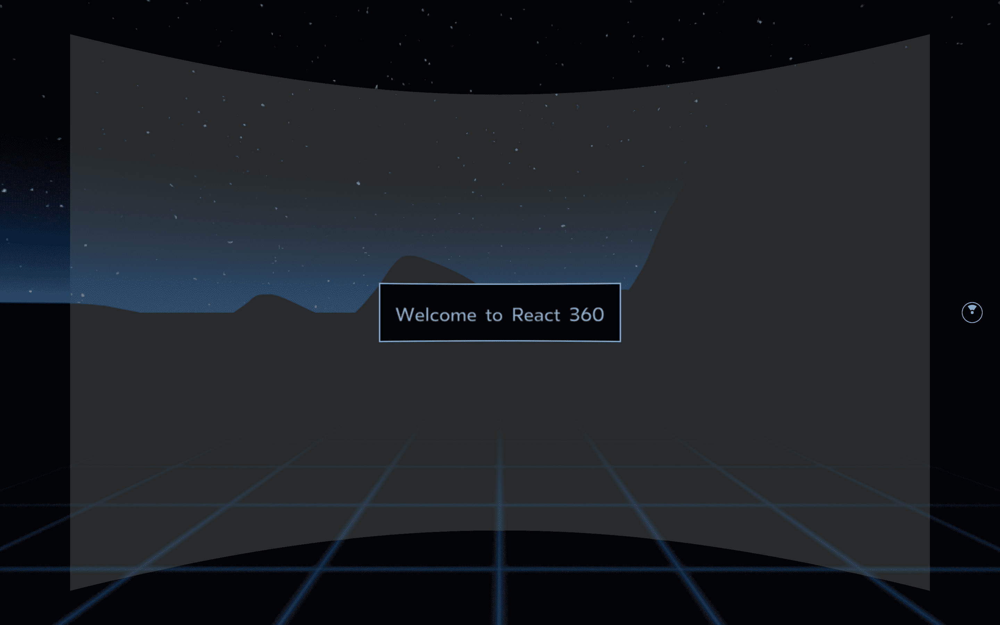
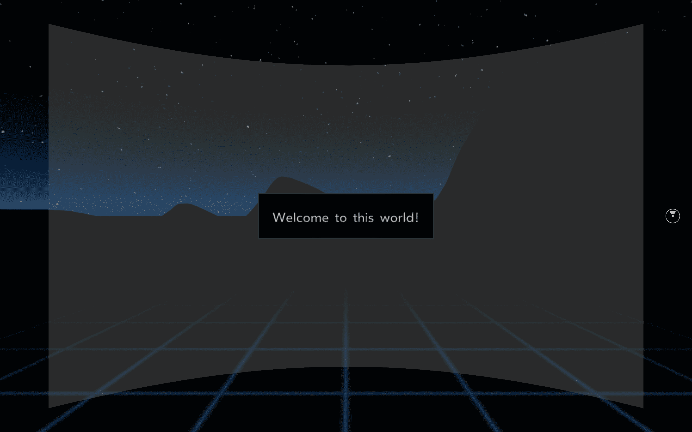
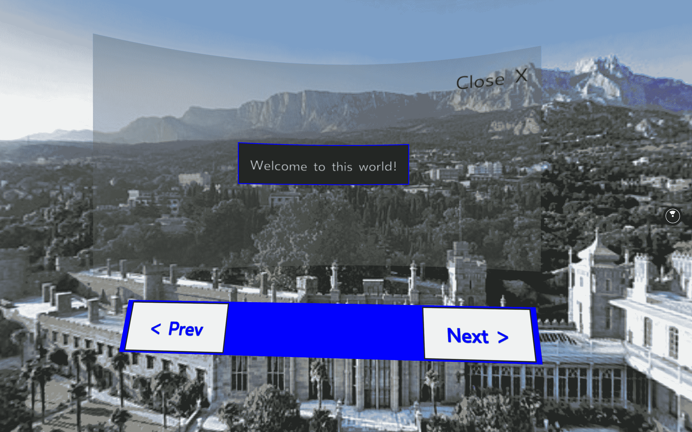
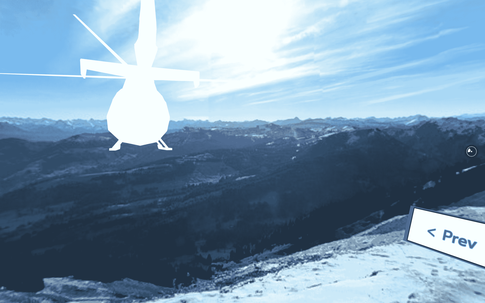

# 第十二章：使用 React 360 创建虚拟现实应用程序

您已经接近成功了——只剩下最后一个章节，然后您就可以称自己为一个在每个平台上都有 React 经验的 React 专家了。在本书中，您已经使用 React 和 React Native 构建了 11 个应用程序，而对于最后的大结局，您将使用 React 360。React 和 React Native 的“一次学习，随处编写”策略的最终部分将在本章中得到最好的展示。使用 React 360，您可以使用 React 和 React Native 的原则创建动态的 3D 和虚拟现实（VR）体验，更具体地说，使用 React Native 类似的生命周期和 UI 组件。虽然虚拟现实仍然是新兴技术，但虚拟现实的最佳用例是，例如，希望顾客体验他们的商店或在线游戏的零售商店。

在本章中，您将探索 React 360 的基础知识以及它与 React 和 React Native 的关系。您将构建的应用程序将能够渲染 360 度全景图像，并使用状态管理在屏幕之间进行渲染。使用 React 360 构建的场景中还将显示动画 3D 对象。

本章将涵盖以下主题：

+   使用 React 360 入门

+   使用 React 360 创建全景查看器

+   构建可点击元素

# 项目概述

在本章中，您将使用 React 360 构建一个应用程序，该应用程序使用了来自 React 和 React Native 的原则。这个应用程序将添加 2D 全景图像和 3D 对象，并且可以使用 Metro 捆绑器在浏览器中运行项目。

构建时间为 1.5 小时。

# 入门

本章的应用程序将从头开始构建，并使用可以在 GitHub 上找到的资产。这些资产应该下载到您的计算机上，以便您稍后在本章中使用。本章的完整代码可以在 GitHub 上找到。

React 360 需要与 React 和 React Native 项目相同版本的 Node.js 和`npm`。如果您尚未在计算机上安装 Node.js，请转到`https://nodejs.org/en/download/`，在那里您可以找到 macOS、Windows 和 Linux 的下载说明。

安装 Node.js 后，您可以在命令行中运行以下命令来检查已安装的版本：

+   对于 Node.js（应为 v10.16.3 或更高版本），请使用以下命令：

```jsx
node -v
```

+   对于`npm`（应为 v6.9.0 或更高版本），请使用以下命令：

```jsx
npm -v
```

# 使用 React 360 创建 VR 应用程序

React 360 使用了来自 React 的原则，并且在很大程度上基于 React Native。React 360 允许您创建应用程序，使用 UI 组件而无需处理移动设备或 VR 设备的复杂设置，这与 React Native 的工作方式类似。

# 开始使用 React 360

无论您是使用 React、React Native 还是 React 360 创建项目，都有工具可以轻松帮助您开始使用这些技术。在本书中，您已经使用 Create React App 作为 React web 应用程序的起点，并使用 Expo CLI 创建 React Native 项目。此 React 360 项目将使用 React 360 CLI 启动，该 CLI 将帮助您创建和管理 React 360 应用程序。

# 设置 React 360

可以通过运行以下命令从`npm`安装 React 360 CLI：

```jsx
npm install -g react-360-cli
```

这将从`npm`软件包注册表全局安装 React 360 CLI。安装过程完成后，您可以使用它通过执行以下命令来创建您的第一个 React 360 项目：

```jsx
react-360 init virtual-reality
```

通过执行此命令，将创建一个名为`virtual-reality`的新 React 360 项目。将安装运行 React 360 应用程序所需的所有软件包，例如`react`、`react-native`、`react-360`、`react-360-web`和`three`。`three`软件包安装了`three.js`，这是一个轻量级且易于使用的 JavaScript 3D 库，带有默认的 WebGL 渲染器。React 360 使用此渲染器来渲染 3D 图形，它通过添加一个允许您创建声明式 UI 组件的层来实现。

此外，将在具有相同名称的目录中创建构建项目所需的所有文件。该目录具有以下结构，其中以下文件很重要：

```jsx
virtual-reality
|-- __tests__
    |-- index-test.js
|-- node_modules
|-- static_assets
    |-- 360_world.jpg
.babelrc
client.js
index.html
index.js
package.json
```

`__tests__`目录是您可以使用`react-test-renderer`包创建测试文件的地方。`node_modules`目录是您安装包的位置，而`static_assets`目录包含在开发模式中静态使用的文件，以后可能会转移到 CND。要在浏览器（或移动设备）中使用 React 360，您需要使用 Babel 来转译您的代码。其配置可以在`.babelrc`文件中找到。由`react-360-cli`创建的最重要的文件是`client.js`，`index.html`和`index.js`，因为这些文件是您开发和提供应用程序的地方。`client.js`文件包含您用于执行应用程序的代码，而`index.js`包含实际的代码，该代码被挂载到`index.html`中的 DOM 中。

与 webpack 不同，React 360 使用了另一个 JavaScript 捆绑器**Metro**。这是由 Facebook 创建的，就像 React 一样。Metro 是 React Native 项目的捆绑器，由于 React 360 也从 React Native 中借鉴了很多原则来在 VR 设备上运行，因此 Metro 是 React 360 应用程序的首选捆绑器。与 webpack 一样，所有源代码都被捆绑成一个可供 Web 浏览器阅读的大文件。在开发应用程序时，Metro 捆绑器将运行一个本地开发服务器，允许您在浏览器中查看应用程序。文件在请求时被编译或处理，当应用程序完成时，它可以用于创建一个生产就绪的构建。您可以使用以下命令启动捆绑器来启动开发服务器：

```jsx
npm start 
```

这将启动 Metro 捆绑器并编译您的源代码，该代码将被挂载到`index.html`文件中，并在`http://localhost:8081/index.html`上提供。

当您首次在浏览器中访问项目时，捆绑器可能需要更长的时间来加载，因为它需要读取您的文件系统以获取有关如何呈现的更多信息。如果您对项目的源代码进行更改，这些更改将更快地变得可见，以增加您的开发速度。由 React 360 CLI 创建的初始应用程序现在在`http://localhost:8081/index.html`上可见，显示了一个 360 度查看器，可以探索`static_assets/360_world.jpg`文件中的黑暗景观。它看起来如下：



React 360 应用程序可以显示 360 度（或 3D）图像或视频作为背景，并在此背景上渲染 2D 和 3D UI 组件。在`client.js`文件中，来自`static_assets`目录的图像被用作 360 度 2D 背景图像，代码如下：

```jsx
function  init(bundle, parent, options  = {}) { ... **// Load the initial environment** r360.compositor.setBackground(r360.getAssetURL('360_world.jpg'**))** } window.React360  = {init};
```

`getAssetUrl`函数指向`static_assets`目录，并且在应用程序处于生产状态时，可以稍后用于指向 CDN 或其他 URL，其中托管了背景图像。

如果您有 3D 眼镜，可以用 3D 360 图像替换初始的 360 度 2D 图像，以创建 3D 效果。例如，NASA 的网站是寻找来自任何火星任务的 360 度 3D 图像的好来源。可以在该任务的图像网址中找到这些图像，并将下载的文件放在`static_assets`中。这应该在`client.js`文件中使用，而不是`360_world.jpg`文件。

通过`react-360 init`创建的应用程序也显示一些 UI 组件；在下一节中，我们将更详细地探讨如何在 React 360 中使用 UI 组件。

# React 360 UI 组件

之前，我们提到 React 360 使用了许多 React Native 的概念之一是可以渲染的 UI 组件。React 360 默认提供了四个 UI 组件，即`View`、`Text`、`Entity`和`VrButton`。首先，`View`和`Text`组件是 2D 的，并且在`index.js`文件中用于创建面板和问候消息，您可以在应用程序中看到。另外两个组件更复杂，可以用于渲染 3D 对象（`Entity`组件）或响应用户操作，例如按下`a`键（`VrButton`组件）。

从`client.js`文件中，这些组件可以放置在`index.js`文件中的圆柱面上，因为这些组件是由`client.js`中的`renderToSurface`渲染的。在这里，声明的默认表面指的是显示来自`index.js`的 UI 组件的 2D 圆柱面：

```jsx
function  init(bundle, parent, options  = {}) { ...  ** // Render your app content to the default cylinder surface** r360.renderToSurface(
 r360.createRoot('virtual_reality', { /* initial props */ }), r360.getDefaultSurface() **);** ... } window.React360  = {init};
```

在`index.js`文件中，我们有`View`和`Text`组件，用于渲染默认表面，显示应用程序启动时看到的欢迎消息。`index.js`的默认导出称为`virtual_reality`，它指的是项目名称，并且与`client.js`中的`createRoot`函数使用的名称相同。

随着应用程序的增长，初始结构和命名可能会变得有点混乱。为了解决这个问题，您可以拆分组件，并在`index.js`中区分应用程序的入口和实际的 UI 组件。需要进行以下更改：

1.  将`index.js`文件移动到一个名为`Components`的新目录中，并将该文件命名为`Panel.js`。在这里，您需要将此类组件的名称从`virtual_reality`更改为`Panel`：

不幸的是，当前版本的 React 360 与 React 16.8+不兼容，因此您需要使用类组件来使用生命周期。

```jsx
import  React  from  'react'; import { - AppRegistry,  StyleSheet,
 Text,
 View, } from  'react-360'; - export  default  class  virtual_reality  extends  React.Component {
+ export default class Panel extends React.Component {  render() {
 return ( <View  style={styles.panel}> <View  style={styles.greetingBox}> <Text  style={styles.greeting}>Welcome to React 360</Text> </View> </View> );
   }
 }; const  styles  =  StyleSheet.create({
  ... }); - AppRegistry.registerComponent('virtual_reality', () =>  virtual_reality); 
```

1.  这个新创建的`Panel`组件可以被导入到`index.js`文件中，您需要删除其中已经存在的所有代码，并用以下代码块替换它：

```jsx
import { AppRegistry, } from  'react-360'; import  Panel  from  './Components/Panel';  AppRegistry.registerComponent('virtual_reality', () =>  Panel);
```

1.  要查看您所做的更改，您需要在`http://localhost:8081/index.html`处刷新浏览器，之后 Metro bundler 将重新编译代码。由于您没有进行可见的更改，您需要查看终端中的输出来查看是否成功。要直接在浏览器中查看这些更改，您可以通过更改`Panel`组件中`Text`组件内的值来更改显示的文本：

```jsx
import  React  from  'react'; import { StyleSheet,
 Text,
 View, } from  'react-360'; export default class Panel extends React.Component {
 render() { return ( <View  style={styles.panel}> <View  style={styles.greetingBox}> -         <Text  style={styles.greeting}>Welcome to React 360</Text> +         <Text  style={styles.greeting}>Welcome to this world!</Text**>** </View> </View> );
  }; }; ...
```

在进行此更改后刷新浏览器，将显示文本“欢迎来到这个世界！”而不是初始消息。

这些`View`和`Text`组件是简单的 2D 元素，可以使用`StyleSheet`进行样式设置，您在 React Native 中也使用过。通过使用这种方法来为您的 React 360 组件设置样式，React 360 的学习曲线变得不那么陡峭，并且应用了“一次学习，随处编写”的原则。`View`和`Text`组件的样式放在`scr/Panel.js`文件的底部。可以用于`View`和`Text`组件的样式规则是有限的，因为并非每个样式规则都适用于这些组件中的每一个。您可以对这些样式进行一些小的更改，就像我们在以下代码块中所做的那样：

```jsx
...

const  styles  =  StyleSheet.create({
 panel: { // Fill the entire surface width:  1000,
 height:  600,
 backgroundColor: 'rgba(255, 255, 255, 0.4)',  justifyContent: 'center',  alignItems: 'center',
 }, greetingBox: { -   padding:  20, -   backgroundColor: '#000000',  -   borderColor: '#639dda', **+   padding: 25,**
**+   backgroundColor: 'black',**
**+   borderColor: 'green',** borderWidth:  2,
 }, greeting: { fontSize:  30,
 } });
```

以下截图显示了在进行这些更改后您的应用程序将会是什么样子，面板内显示欢迎消息的框已经有了一些变化：



此外，使用`panel`样式的第一个视图是在`client.js`中创建的，默认表面是圆柱形，宽度为`1000px`，高度为`600px`。还可以更改此表面的形状和大小，我们将在接下来的部分中进行。

在这一部分，您学习了如何开始使用 React 360 的基础知识。现在，我们将学习如何与 React 360 进行交互。

# 在 React 360 中的交互

在上一节中，您设置了 React 360 的基础知识，并对显示欢迎消息的初始表面进行了一些更改。使用 React 360，可以创建其他甚至与用户进行一些交互的表面。这些表面可以具有不同的形状和大小，例如平面或圆形，这使得可以在这些表面上添加可操作的按钮。

# 使用本地状态和 VrButton

在这一部分，您将在表面上添加一些按钮，以便用户可以关闭欢迎消息或切换背景图像场景。首先，让我们从创建一个按钮开始，让我们关闭欢迎消息表面：

1.  `Panel`组件是一个类组件，它让您可以访问生命周期和本地状态管理。由于您希望能够关闭欢迎消息，因此可以使用本地状态。在`Panel`组件的声明顶部，您必须添加一个`constructor`，其中将有初始状态：

```jsx
import  React  from  'react'; import { StyleSheet,
 Text,
 View, } from  'react-360'; export default class Panel extends React.Component {
**+ constructor() {**
**+   super();**
**+   this.state = {**
**+     open: true**
**+   }**
**+ }**

 render() { return (        ...
```

如果您对使用类组件进行生命周期不太熟悉，可以回顾一下本书的前几章。在这些章节中，类组件用于生命周期，而不是 Hooks，您在最近的几章中主要使用了 Hooks。

1.  现在已经设置了初始状态，您可以使用它来修改面板的样式，方法是使用一个`styles`数组而不是单个对象。除了在这个数组中传递一个`style`对象之外，您还可以通过使用条件展开直接插入样式规则。如果打开状态不为 true，则会将`display: 'none'`样式规则添加到面板的样式中。否则，一个空数组将被展开到`style`数组中：

```jsx
...

export default class Panel extends React.Component {
  constructor() {
    super();
    this.state = {
      open: true,
    };
  }

 render() {
**+   const { open } = this.state;** return ( -     <View  style={styles.panel}> +     <View  style={[styles.panel, ...(!open ? [{ display: 'none' }] : [])]}>  <View  style={styles.greetingBox}> <Text  style={styles.greeting}>Welcome to this world!</Text> </View> </View> );
  }; };
```

1.  在将此`state`变量添加到面板的样式属性之后，您可以创建将更改打开状态的按钮。您可能还记得，React 360 具有四个默认 UI 组件之一称为`VrButton`。该组件类似于 React Native 中的`TouchableOpacity`，默认情况下没有任何样式。可以从`react-360`中导入`VrButton`，并将其放置在`Text`（或`View`）组件内。单击此`VrButton`将更改打开状态，因为它使用`setState`方法：

```jsx
import  React  from  'react'; import { StyleSheet,
 Text,
 View,
**+ VrButton,** } from  'react-360'; export default class Panel extends React.Component {

  ...

 render() { return (      <View  style={[styles.panel, ...(!open ? [{ display: 'none' }] : [])]}>  <View  style={styles.greetingBox}> <Text  style={styles.greeting}>Welcome to this world!</Text> </View> +       <VrButton +         onClick={() =>  this.setState({ open:  false })} +       >
+         <Text>Close X</Text> +       </VrButton>  </View> );
  }; };
```

1.  我们还可以为`VrButton`和`Text`添加一些样式。这些组件的样式可以放在与此文件中其他组件的样式相同的`StyleSheet`中：

```jsx
 ... render() { return (      <View  style={[styles.panel, ...(!open ? [{ display: 'none' }] : [])]}>  <View  style={styles.greetingBox}> <Text  style={styles.greeting}>Welcome to this world!</Text> </View>
        <VrButton          onClick={() =>  this.setState({ open:  false })}
**+         style={styles.closeButton}**
        >
-         <Text>Close X</Text>
+         <Text style={styles.close}>Close X</Text>         </VrButton>  </View> );
  }; }; 
const  styles  =  StyleSheet.create({ 
  ... 

+   closeButton: { +     position: 'absolute',  +     top:  20, +     right:  20, +   },
+   close: { +     fontSize:  40, +     color: 'black', +   },
});
```

现在，当您在浏览器中刷新应用程序时，面板的右上角将有一个按钮，上面写着`Close X`。单击此按钮，面板将关闭，您可以自由探索整个背景表面。除了关闭面板，您还可以更改整个应用程序的风景，这将在本节的最后部分中添加。

# 动态更改场景

该应用程序使用默认背景显示在表面上，但也可以动态更改此背景图像。初始应用程序带有默认的 360 度背景图像。要更改此设置，您需要制作自己的 360 度全景图像，或者从互联网上下载一些图像。可以使用特殊相机或在移动设备上下载应用程序来创建自己的 360 度图像。在线图像可以在许多库存照片网站上找到。在本书的 GitHub 存储库中，在`ch12-assets`分支中，您可以找到一些 360 度全景图像的选择。

目前，您的应用程序只有一个默认表面，这是一个圆形表面，显示了`Panel`组件的欢迎面板。还可以添加平面组件，以便用户可以使用按钮更改风景。这需要您进行以下更改：

+   创建一个显示指定按钮的组件

+   从`index.js`导入并注册组件

+   在`client.js`中设置新的表面

在进行这些更改之前，您必须从 GitHub 存储库下载图像，并将它们放在`static_assets`目录中，以便可以从应用程序内部使用它们。现在，进行以下更改以改变风景：

1.  在`Components`目录中创建一个名为`Navigation`的新组件，并将以下代码块放入其中。这将返回一个具有表面基本样式的组件，稍后将在其中放置按钮：

```jsx
import  React  from 'react';  import { StyleSheet, View } from 'react-360';  export  default  class  Navigation  extends  React.Component { render() {
 return  <View  style={styles.navigation} />;
 } } const  styles  =  StyleSheet.create({
 navigation: { width:  800, height:  100, backgroundColor: 'blue', justifyContent: 'space-between', alignItems: 'center',
    flexDirection: 'row',
 } });
```

1.  在`index.js`文件中，您必须导入`Navigation`组件，并使用`AppRegistry`方法注册它。这将确保该组件可以呈现到一个表面上：

```jsx
import { AppRegistry } from 'react-360';  import  Panel  from './Components/Panel';  + import  Navigation  from './Components/Navigation';  AppRegistry.registerComponent('Panel', () =>  Panel); + AppRegistry.registerComponent('Navigation', () =>  Navigation);
```

1.  在`client.js`文件中，必须将此`Navigation`组件添加到一个表面上；在这种情况下，这是一个平面表面。可以使用`react-360`的`Surface`方法创建一个新表面，并且必须指定组件的形状和大小。您还可以设置一个角度来定位组件：

```jsx
function  init(bundle, parent, options  = {}) {  const  r360  =  new  ReactInstance(bundle, parent, {
    // Add custom options here
    fullScreen:  true,
    ...options
  });

+ const  navigationPanel  =  new  Surface(1000, 100, Surface.SurfaceShape.Flat); + navigationPanel.setAngle(0, -0.3); + r360.renderToSurface(r360.createRoot('Navigation'), navigationPanel**);**

 // Render your app content to the default cylinder surface r360.renderToSurface(
 r360.createRoot('virtual_reality', { /* initial props */ }), r360.getDefaultSurface(),
 ); ... } window.React360  = {init};
```

通过刷新浏览器中的项目，您将看到一个蓝色块被渲染在屏幕底部。要向此块添加按钮，您可以使用`VrButton`组件，并将当前选择的背景放在本地状态中。现在让我们来做这个：

1.  在`Components/Navigation.js`文件中，您可以向`Navigation`组件添加必要的按钮。为此，您需要从`react-360`中导入`VrButton`和`Text`组件，并将它们放在正在呈现的`View`组件中。它们将获得样式属性，因为您希望按钮在左侧或右侧都有边距：

```jsx
import  React  from 'react';  - import { StyleSheet, View } from 'react-360'; **+ import {**
**+   StyleSheet,**
**+   Text,**
**+   View,**
**+   VrButton,**
**+ } from 'react-360';** export  default  class  Navigation  extends  React.Component { render() { -   return  <View  style={styles.navigation} />;
+   return (
+     <View style={styles.navigation}>
+       <VrButton style={[styles.button, styles.buttonLeft]}>
+         <Text style={styles.buttonText}>{'< Prev'}</Text>
+       </VrButton> +       <VrButton style={[styles.button, styles.buttonRight]}>
+         <Text style={styles.buttonText}>{'Next >'}</Text>
+       </VrButton> **+   );**
 } } ...
```

1.  这些样式对象可以添加到此文件底部的`StyleSheet`方法中，就在`navigation`的样式下面：

```jsx
... const  styles  =  StyleSheet.create({
 navigation: { width:  800, height:  100, backgroundColor: 'blue',  justifyContent: 'space-between',  alignItems: 'center',
    flexDirection: 'row', }, + button: { +   padding:  20, +   backgroundColor: 'white',  +   borderColor: 'black',  +   borderWidth:  2, + alignItems: 'center',  + width:  200, + }, + buttonLeft: { + marginLeft:  10, + }, + buttonRight: { +   marginRight:  10, + }, + buttonText: { +   fontSize:  40, +   fontWeight: 'bold',  +   color: '**blue',** **+ },** });
```

1.  稍后可以使用`react-360`的`assets`方法将从 GitHub 存储库下载并放置在`static_assets`中的不同 360 度全景背景图像导入到此文件中。为此，您需要创建一个常量，其中包含这些图像的所有文件名的数组，包括由`react-360-cli`添加的初始图像。此外，必须在此处导入`assets`和`Environment`方法，因为您需要这些来更改背景图像：

```jsx
import  React  from 'react';  import {
**+ assets,**
**+ Environment,**
  StyleSheet,
  Text,
  View,
  VrButton,
} from 'react-360';

**+ const backgrounds = [** +  '360_world.jpg', +  'beach.jpg', +  'landscape.jpg', +  'mountain.jpg', +  'winter.jpg',
+ ];  export  default  class  Navigation  extends  React.Component {

  ...
```

1.  就像我们为`Panel`组件所做的那样，我们需要创建一个初始状态，定义显示哪个背景。这将是背景数组的第一个背景，即`0`。此外，必须创建一个函数，可以使用`setState`方法来改变`currentBackground`。当`currentBackground`的状态已经改变时，将使用`Environment`方法更新背景图像，该方法使用`assets`方法从`static_assets`目录中选择一个背景：

```jsx
...

export  default  class  Navigation  extends  React.Component {
**+ constructor() {**
**+  super();**
**+  this.state = {**
**+    currentBackground: 0**
**+  };**
**+ }** 
+ changeBackground(change) { +  const { currentBackground } =  this.state; 
+  this.setState( +    {
+      currentBackground: currentBackground  +  change +    },
+    () => { +      Environment.setBackgroundImage( +        asset(backgrounds[this.state.currentBackground], { format: '2D' }) +      );
+    }
+  );
+ }
 ...
```

1.  新创建的`changeBackground`函数可以在`Navigation`组件挂载时调用，并使用第一个背景图像，但是当用户点击按钮时，也必须调用`changeBackground`函数。这可以通过在按钮上添加`componentDidMount`生命周期并使用`onClick`事件调用函数来实现：

```jsx
...

export  default  class  Navigation  extends  React.Component {

  ...

**+ componentDidMount() {**
**+   this.changeBackground(0);**
**+ }** render() {
    return (      <View  style={styles.navigation}> +  <VrButton  style={[styles.button, styles.buttonLeft]}> +       <VrButton +         onClick={() =>  this.changeBackground(-1)} +         style={[styles.button, styles.buttonLeft]} +       >
          <Text  style={styles.buttonText}>{`< Prev`}</Text> </VrButton> +  <VrButton  style={[styles.button, styles.buttonRight]}> +       <VrButton +         onClick={() =>  this.changeBackground(1)} +         style={[styles.button, styles.buttonRight]} +       >
          <Text  style={styles.buttonText}>{`Next >`}</Text> </VrButton> </View> );
  }
}

... 
```

1.  当您在浏览器中刷新项目时，您可能会注意到当您按一次左按钮或多次按右按钮时会出现错误。为了防止发生此错误，您需要限定`currentBackground`状态的最大和最小值。该值不能低于零或高于`backgrounds`数组的长度。您可以通过对`changeBackground`函数进行以下更改来实现这一点：

```jsx
...

export  default  class  Navigation  extends  React.Component {

  ... 
  changeBackground(change) {
   const { currentBackground } =  this.state; 
   this.setState(
     {
-      currentBackground: currentBackground  +  change
+ currentBackground:
+        currentBackground  +  change  >  backgrounds.length  -  1 +          ?  0 +          :  currentBackground  +  change  <  0 +          ?  backgrounds.length  -  1 +          :  currentBackground  +  change      },
     () => {       Environment.setBackgroundImage(
         asset(backgrounds[this.state.currentBackground], { format: '2D' })       );
     }
   );
  }
 ...
```

`currentBackground`状态的值将始终是可以在`backgrounds`数组长度内找到的值，这使您可以在不同的背景图像之间来回导航。点击 Prev 或 Next 按钮几次后，您的应用程序将如下所示：



使用 React 360，您可以做的另一件事是添加动画组件，就像我们在学习 React Native 时所做的那样。您将在下一节学习如何添加这些动画。

# 动画和 3D

到目前为止，在本章中添加的所有组件都是 2D 的，并且没有动画；但是，您也可以使用 React 360 对组件进行动画处理，甚至添加 3D 对象。这些 3D 对象必须在特殊的 3D 建模软件中预先构建，或者从互联网上下载，并可以添加到应用程序的表面上。对于动画，必须导入 Animated API，这类似于我们用于 React Native 的 Animated API。

# 动画

在进入 React 360 中使用 3D 对象之前，让我们学习如何使用 React 360 中的 Animated API 创建动画。Animated API 使用 React Native 中的 Animated API，可用于为 UI 组件创建简单和高级动画。使用 Animated API，您可以轻松创建淡入淡出或旋转的动画，只需使用受本地状态影响的值即可。

`Panel`组件是可以进行动画处理的一个组件，它显示一个欢迎消息，因为这个组件有一个元素，用户可以点击关闭表面。当用户点击关闭按钮时，组件的显示样式规则将被设置为`none`，使组件突然消失。与此相反，您可以通过以下方式将其改变为平滑的动画：

1.  `panel`组件是在`Components/Panel.js`文件中创建的，这是必须从`react-360`导入`Animated`API 的地方：

```jsx
import  React  from 'react';  - import { StyleSheet, Text, View, VrButton } from 'react-360'; **+ import {**
**+   Animated,**
**+   StyleSheet,**
**+   Text,**
**+   View,**
**+   VrButton,**
**+ } from 'react-360';** export  default  class  Panel  extends  React.Component {
```

1.  在`constructor()`中，应该设置`Animated`值的初始值。在这种情况下称为`opacity`，因为您希望`Panel`组件的`opacity`值变为零以使其消失。最初，`opacity`应为 1，因为用户打开应用程序时必须显示欢迎消息：

```jsx
...

export  default  class  Panel  extends  React.Component { constructor() {
 super();
 this.state  = { open:  true, +     opacity:  new  Animated.Value(1),  }; }

  render() {
    ... 
```

1.  当用户在`Panel`组件中点击`VrButton`时，`open`状态将被更改，之后动画应该开始。因此，必须创建一个`componentDidUpdate()`生命周期方法，在其中可以检查`open`状态的变化并在之后开始动画。当`open`的值从`true`变为`false`时，动画应该开始将`opacity`的值从`1`变为`0`，使其消失。

```jsx
export  default  class  Panel  extends  React.Component { constructor() {
 super();
 this.state  = { open:  true,
 opacity:  new  Animated.Value(1),
 }; } + componentDidUpdate() { +   const { open, opacity } =  this.state; +   Animated.timing(opacity, { +     toValue:  open  ?  1  :  0, +     duration:  800, +   }).start(); **+ }**

 render() {

    ...
```

1.  最后，这个值应该传递给`Animated`组件的`style`属性，这意味着您需要将`View`组件更改为可以处理动画的`Animated.View`组件。`style`属性中的`display`样式规则可以被删除，并替换为`opacity`，因为这控制着组件对用户是否可见：

```jsx
render() { - const { open, opacity } =  this.state**;**
**+ const { opacity } this.state;**
 return ( -   <View  style={[styles.panel, ...(!open ? [{ display: 'none' }] : [])]}> +   <Animated.View  style={[styles.panel, { opacity }]}**>**
 <View  style={styles.welcomeBox}>
 <Text  style={styles.welcome}>Welcome to this world!</Text>
 </View>
 <VrButton
 onClick={() =>  this.setState({ open:  false })}
 style={styles.closeButton}
 > <Text  style={styles.close}>Close X</Text> </VrButton> -   </View>
+   </Animated.View**>**
 ); }
```

现在，当您点击关闭带有欢迎消息的`Panel`组件的`VrButton`时，该组件将慢慢溶解到背景中并消失。同样的动画效果也可以添加到`Navigation`组件中，因为您希望确保我们的用户知道他们可以浏览不同的背景。您可以通过使其重复淡入淡出来突出显示点击选项，例如`Next`按钮。其中很多逻辑与`Panel`组件相同：

1.  在`Components/Navigation.js`文件的顶部导入`Animated`API，并创建`opacity`状态的初始值：

```jsx
import  React  from 'react';  import { + Animated,  asset,
 Environment,
  StyleSheet,
 Text,
 View,
 VrButton, } from 'react-360'; ... export  default  class  Navigation  extends  React.Component { constructor() {
 super();     this.state  = { currentBackground:  0, +     opacity:  new  Animated.Value(0),  }; } changeBackground(change) {
    ...
```

1.  动画应该在组件挂载后立即开始，因此`Animated.timing`方法，用于改变`opacity`的值，必须放在`componentDidMount()`生命周期方法中。这将启动`opacity`从`0`到`1`的动画，使按钮内的文本闪烁：

```jsx
...

componentDidMount() { + const { opacity } =  this.state;  this.changeBackground(0); + Animated.timing(opacity, { +  toValue:  1, +  duration:  800 + }).start**()** } render() {

  ...
```

1.  `VrButton`中的`Text`组件用于按钮，以便用户可以导航到下一个背景图像，现在可以更改为`Animated.Text`组件，并且必须将`opacity`样式规则添加到`style`属性中。这将向该组件添加动画，使文本在应用程序挂载时闪烁一次。

```jsx
render() {
**+ const { opacity } = this.state;**
  return (    <View  style={styles.navigation}>
      <VrButton
        onClick={() =>  this.changeBackground(-1)}
        style={[styles.button, styles.buttonLeft]}
      >
        <Text  style={styles.buttonText}>{`< Prev`}</Text> </VrButton>
 <VrButton
        onClick={() =>  this.changeBackground(1)}
        style={[styles.button, styles.buttonRight]}
      >
-       <Text  style={styles.buttonText}>{`Next >`}</Text> +       <Animated.Text  style={[styles.buttonText, { opacity }]}>{`Next >`}</Animated.Text> </VrButton> </View> );
}

... 
```

1.  您不希望按钮文本只闪烁一次。为了使其重复闪烁，您可以使用`Animated`的`loop`和`sequence`方法来获得此动画的多次迭代。为了使其更加平滑，我们可以给动画添加一个小延迟。这将迭代 10 次，之后按钮将停止闪烁：

```jsx
...

componentDidMount() {
  const { opacity } =  this.state;
 this.changeBackground(0);

**+ Animated.loop(**
**+  Animated.sequence([**
**+    Animated.delay(400),**
 Animated.timing(opacity, {
 toValue:  1,
 duration:  800 -    }).start**()**
**+    })**
**+  ]),**
**+  {**
**+    iterations: 10**
**+  }**
**+ ).start();** } render() {

  ...
```

现在，当应用程序挂载时，下一个按钮将闪烁 10 次，从而强调用户可以在背景场景之间进行导航。然而，这些动画并不是您可以添加的唯一动画特性。在下一节中，您将学习如何添加动画的 3D 对象。

# 渲染 3D 对象

要在 React 360 中使用 3D 对象，您需要预先构建的 3D 对象，可以使用特殊的 3D 建模软件创建，也可以从互联网上下载。在本节中，我们将使用 GitHub 存储库中的 3D 对象，您可以在该章节中找到一个`.obj`文件，它受到 React 360 的支持。除了 OBJ，GLTF 模型也受到 React 360 支持作为 3D 对象。

OBJ 文件是 3D 模型文件的标准格式，可以被许多 3D 工具导出和导入。请记住，React 360 不支持照明，您需要包含更高级的软件包来渲染 3D 模型中的复杂纹理。因此，这个例子中使用的 3D 模型只是一个颜色，即白色。

在 React 360 中添加 3D 对象可以很容易地使用`Entity`对象，同时使用存储在`static_assets`目录中的 3D 模型。通过使用`Entity`，3D 模型可以转换为一个组件，您需要在`index.js`中注册它，以便在`client.js`中使用并添加到应用程序中。

添加 3D 对象，进行以下更改：

1.  首先，确保你已经将本章的 GitHub 存储库中的`helicopter.obj`文件复制到`static_assets`目录中，并在`Components`目录中创建一个名为`Helicoper.js`的新文件。在这个文件中，可以使用`asset`方法导入 3D 模型，并将其添加为`Entity`对象的源。为此，请使用以下代码：

```jsx
import  React  from 'react';  import { asset } from 'react-360';  import  Entity  from 'Entity';  export  default  class  Helicopter  extends  React.Component { render() { return ( <Entity source={{ obj:  asset('helicopter.obj'), }} style={{ transform: [
            { rotate: 90 },
            { scaleX:  0.02 }, 
            { scaleY:  0.02 }, 
            { scaleZ:  0.02 },
          ] }} /> ); } }
```

`Entity`对象在`style`属性中的缩放将减小 3D 模型的大小；否则，它将会太大而无法正确显示。此外，`rotateY`的值将在*y*轴上将直升机旋转 90 度。

1.  这个`Helicopter`组件应该在你的应用程序中显示，但只有在`index.js`文件中将其注册到`AppRegistry`中才能实现：

```jsx
import { AppRegistry } from 'react-360';
import Panel from './Components/Panel';
import Navigation from './Components/Navigation';
+ import Helicopter from './Components/Helicopter';

AppRegistry.registerComponent('Panel', () => Panel);
AppRegistry.registerComponent('Navigation', () => Navigation);
+ AppRegistry.registerComponent('Helicopter', () => Helicopter);
```

1.  这个组件可以在`client.js`文件中使用`renderToLocation`方法挂载到应用程序中。之前，你使用`renderToSurface`方法来挂载`Panel`和`Navigation`组件，但是对于 3D 对象，这种方法行不通。除了组件本身，`renderToLocation`方法还需要指定对象放置的位置。

```jsx
- import { ReactInstance, Surface } from 'react-360-web'; + import { ReactInstance, Surface, Location } from 'react-360-web';  function  init(bundle, parent, options  = {}) {

  ... + const  location  =  new  Location([-100, 10, -2]);
+ r360.renderToLocation(r360.createRoot('Helicopter'), location**);**

 // Render your app content to the default cylinder surface r360.renderToSurface(

    ... 
```

现在，当你打开应用程序时，当你向左转 90 度时，将会看到一个白色的直升机。在上述代码中，`Location`用于在应用程序中创建一个位置，3D 模型将被挂载在这个位置上。这是通过`new Location([-100, 10, -2])`来实现的。这将把对象放置在用户启动应用程序时的初始位置的左侧 100 米，上方 10 米，前方 2 米处。这可以在以下截图中看到，这是在应用程序的不同场景之一中拍摄的：



然而，React 360 不仅仅局限于导入和渲染 3D 对象：你也可以像任何其他组件一样对它们进行动画处理。为此，可以再次使用 Animated API。你可以使用这个 API 与本地状态一起为 3D 直升机添加任何动画。`Entity`的`style`属性已经具有一些样式，用于确定比例，这是可以通过使用`Animated`值动态地实现的。通过进一步减小直升机的比例，它看起来就像在飞行，并且会消失在远处。通过改变`rotateY`的值，可以添加更多效果，使直升机看起来正在转向。

要创建一个动画的 3D 对象，请对`Components/Helicopter.js`进行以下更改：

1.  从`react-360`中导入`Animated`并创建`Entity`的`Animated`版本。由于这不是预定义的`Animated`组件，我们不能通过输入`Animated.Entity`来实现。相反，我们需要使用`createAnimatedComponent`方法创建一个自定义的`Animated`组件：

```jsx
import  React  from 'react';  - import {  asset } from 'react-360';  + import { Animated, asset } from 'react-360'; import  Entity  from 'Entity';  + const  AnimatedEntity  =  Animated.createAnimatedComponent(Entity**);** export  default  class  Helicopter  extends  React.Component {

  ...
```

1.  必须在`Helicopter`组件中添加一个`constructor`，在其中将`scale`和`rotateY`的初始`Animated`值设置为本地状态值。`scale`的初始值为`0.02`，与直升机的当前比例相同，而`rotateY`将获得与当前值相同的值：

```jsx
...

export  default  class  Helicopter  extends  React.Component { + constructor() { +   super(); +   this.state  = { +     scale:  new  Animated.Value(0.02), +     rotateY:  new  Animated.Value(90) +   }; **+ }**

  render() {

    ...
```

1.  我们可以在`componentDidMount()`生命周期方法中创建动画序列，因为我们希望直升机转向并飞走。动画的第一部分是一个小延迟，所以动画不会在应用程序挂载后立即开始。1 秒后（1,000 毫秒），直升机将开始转向约 8 秒，并在另一个小延迟后飞走：

```jsx
... + componentDidMount() { +   const { scale, rotateY } =  this.state;
+ +   Animated.sequence([ +     Animated.delay(1000), +     Animated.timing(rotateY, { +       toValue:  0, +       duration:  8000 +     }), +     Animated.delay(800), +     Animated.timing(scale, { +       toValue:  0, +       duration:  8000 +     }) +   ]).start(); **+ }** render() {

  ...
```

1.  `Entity`组件必须被`AnimatedEntity`组件替换，后者处理来自`Animated` API 的值。这些值可以从本地状态中获取，以便将它们添加到`AnimatedEntity`组件的`style`属性中：

```jsx
  render() { +   const { scale, rotateY } =  this.state;  return ( -     <Entity
+     <**AnimatedEntity** source={{ obj:  asset('helicopter.obj') }} style={{ transform: [
**-           { rotateY: 90 },**
**-           { scaleX: 0.02 },**
**-           { scaleY: 0.02 },**
**-           { scaleZ: 0.02 },**
**+** { rotateY }, +           { scaleX:  scale }, +           { scaleY:  scale }, +           { scaleZ:  scale **},** ] }} /> );
 } }
```

现在，直升机将从 90 度转向 0 度，经过一段时间，它将飞向远处并消失。

# 总结

在本章的最后，您已经结合了本书中收集到的所有知识，开始使用 React 360。虽然 React 360 使用了来自 React 和 React Native 的实践，但它的用途与其他 React 技术不同且更为特定。在撰写本文时，已经使用了诸如生命周期方法和 Animated API 之类的众所周知的原则，以创建一个允许用户探索 2D 全景图像的 VR 应用程序。它具有基本的动画，以及一个飞向远处的 3D 直升机对象。

通过这最后一章，您已完成本书的所有 12 章，并使用 React、React Native 和 React 360 创建了 12 个项目。现在，您对 React 的所有可能性以及如何在不同平台上使用它有了扎实的理解。虽然 React 和 React Native 已经是成熟的库，但不断添加新功能。即使您完成了本书的阅读，可能还会有新功能可以查看，首先是**并发模式**。我的建议是永远不要停止学习，并在宣布新功能时密切关注文档。

# 进一步阅读

+   React 360 原生模块示例：[`facebook.github.io/react-360/docs/example-native-modules.html`](https://facebook.github.io/react-360/docs/example-native-modules.html)

+   NASA 3D 图像：[`mars.nasa.gov/3d/images`](https://mars.nasa.gov/3d/images)
