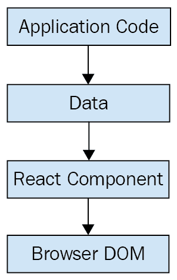
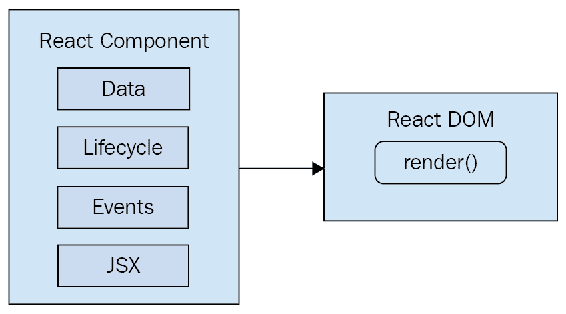
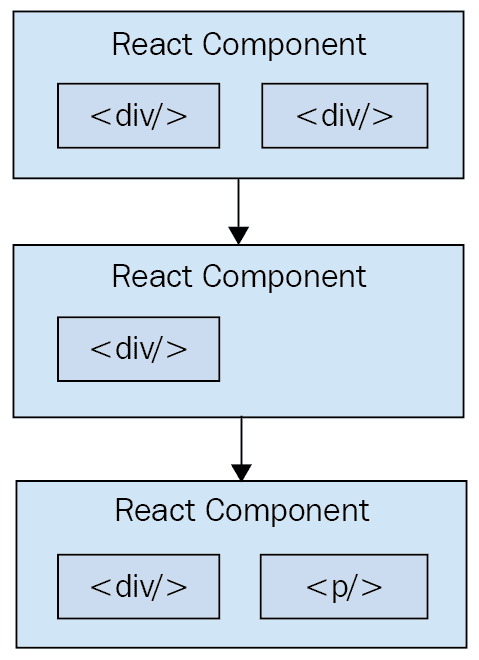
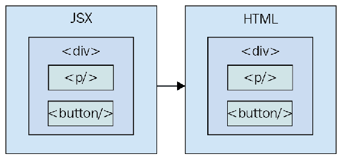
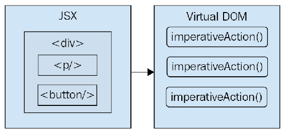
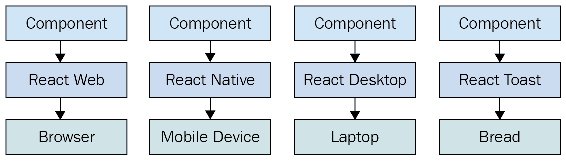

# 第一章：为什么要使用 React？

如果你正在阅读这本书，你可能已经对 React 有一些想法。你可能也听过一两个 React 的成功故事。如果没有，不用担心。我会尽力在本章节中避免让你接触到额外的营销文学。然而，这是一本内容丰富的书，所以我觉得设定基调是一个合适的第一步。是的，目标是学习 React 和 React Native。但同时也是为了构建一个持久的架构，可以处理我们今天和未来想要用 React 构建的一切。

本章以 React 存在的简要解释开始。然后，我们将讨论使 React 成为一种吸引人的技术的简单性，以及 React 如何能够处理 Web 开发人员面临的许多典型性能问题。接下来，我们将介绍 React 的声明性哲学以及 React 程序员可以期望使用的抽象级别。最后，我们将介绍 React 16 的一些主要新功能。

让我们开始吧！

# 什么是 React？

我认为 React 在其主页上的一行描述([`facebook.github.io/react`](https://facebook.github.io/react)))非常出色：

*“用于构建用户界面的 JavaScript 库。”*

这是一个用于构建用户界面的库。这很完美，因为事实证明，这正是我们大多数时候想要的。我认为这个描述最好的部分是它所省略的一切。它不是一个大型框架。它不是一个从数据库到实时更新的 Web 套接字连接处理一切的全栈解决方案。实际上，我们并不想要大多数这些预打包的解决方案，因为最终它们通常会带来更多问题而不是解决问题。

# React 只是视图

React 通常被认为是应用程序中的*视图*层。你可能以前使用过类似 Handlebars 或 jQuery 的库。就像 jQuery 操作 UI 元素，或者 Handlebars 模板被插入到页面上一样，React 组件改变了用户所看到的内容。下面的图表说明了 React 在我们前端代码中的位置：

这就是 React 的全部核心概念。当然，在我们阅读本书的过程中，这个主题可能会有一些微妙的变化，但流程基本上是一样的。我们有一些应用逻辑生成一些数据。我们想要将这些数据渲染到 UI 上，所以我们将其传递给一个 React 组件，它负责将 HTML 放入页面中。

也许你会想知道这有什么大不了的，特别是因为在表面上，React 似乎只是另一种渲染技术。在本章的其余部分，我们将涉及 React 可以简化应用程序开发的一些关键领域。

# 简单就是好

React 并没有太多需要学习和理解的部分。在内部，有很多事情正在发生，我们将在本书中逐渐涉及这些事情。与大型框架相比，拥有一个小的 API 可以让你花更多的时间熟悉它，进行实验等等。大型框架则相反，你需要花费大量时间来弄清楚所有东西是如何工作的。下图大致展示了我们在使用 React 编程时需要考虑的 API：

React 分为两个主要的 API。首先是 React DOM。这是用于在网页上执行实际渲染的 API。其次是 React 组件 API。这些是实际由 React DOM 渲染的页面的部分。在 React 组件中，我们需要考虑以下几个方面：

+   **数据**：这是来自某处的数据（组件不关心来自哪里），并由组件渲染。

+   **生命周期**：这些是我们实现的方法，用于响应组件生命周期的变化。例如，组件即将被渲染。

+   **事件**：这是我们编写的用于响应用户交互的代码。

+   **JSX**：这是 React 组件的语法，用于描述 UI 结构。

暂时不要过于专注于 React API 的这些不同领域代表什么。这里要记住的是，React 本质上是简单的。看看需要弄清楚的东西是多么少！这意味着我们不必在这里花费大量时间去了解 API 的细节。相反，一旦掌握了基础知识，我们可以花更多时间来研究 React 的微妙用法模式。

# 声明式 UI 结构

React 新手很难接受组件将标记与 JavaScript 混合在一起的想法。如果您看过 React 示例并有相同的不良反应，不要担心。最初，我们都对这种方法持怀疑态度，我认为原因是我们几十年来一直被**关注分离**原则所影响。现在，每当我们看到事物混合在一起，我们自动假设这是不好的，不应该发生。

React 组件使用的语法称为**JSX**（**JavaScript XML**）。组件通过返回一些 JSX 来呈现内容。JSX 本身通常是 HTML 标记，混合了用于 React 组件的自定义标记。在这一点上具体细节并不重要；我们将在接下来的章节中详细讨论。这里绝对突破性的是，我们不必执行微操作来改变组件的内容。

虽然我在本书中不会遵循惯例，但一些 React 开发人员更喜欢使用`.jsx`扩展名而不是`.js`来命名他们的组件。

例如，想想使用类似 jQuery 来构建应用程序。您有一个页面上有一些内容，当单击按钮时，您想向段落添加一个类。执行这些步骤足够简单。这被称为**命令式编程**，对 UI 开发来说是有问题的。虽然在响应事件时更改元素的类的这个例子很简单，但实际应用程序往往涉及超过三四个步骤才能实现某些事情。

React 组件不需要以命令式的方式执行步骤来呈现内容。这就是为什么 JSX 对于 React 组件如此重要的原因。XML 风格的语法使得描述 UI 应该是什么样子变得容易。也就是说，这个组件将呈现哪些 HTML 元素？这被称为**声明式编程**，非常适合 UI 开发。

# 时间和数据

React 新手难以理解的另一个领域是 JSX 就像一个静态字符串，代表了一块渲染输出。这就是时间和数据发挥作用的地方。React 组件依赖于传递给它们的数据。这些数据代表了 UI 的动态方面。例如，基于布尔值呈现的 UI 元素可能会在下次组件渲染时发生变化。这里是这个想法的一个例证：

每次渲染 React 组件时，就像在那个确切的时间点拍摄 JSX 的快照。随着应用程序随时间向前推进，您将拥有一个有序的渲染用户界面组件的集合。除了声明性地描述 UI 应该是什么之外，重新渲染相同的 JSX 内容对开发人员来说更加容易。挑战在于确保 React 能够处理这种方法的性能要求。

# 性能很重要

使用 React 构建用户界面意味着我们可以使用 JSX 声明 UI 的结构。这比逐个组装 UI 的命令式方法更不容易出错。然而，声明性方法确实给我们带来了一个挑战：性能。

例如，具有声明性 UI 结构对于初始渲染是可以的，因为页面上还没有任何内容。因此，React 渲染器可以查看 JSX 中声明的结构，并将其呈现到 DOM 浏览器中。

**DOM**代表**文档对象模型**，表示在浏览器中呈现后的 HTML。DOM API 是 JavaScript 能够更改页面上内容的方式。

这个概念在下图中有所说明：

在初始渲染时，React 组件及其 JSX 与其他模板库没有区别。例如，Handlebars 将模板呈现为 HTML 标记作为字符串，然后插入到浏览器 DOM 中。React 与诸如 Handlebars 之类的库不同之处在于数据发生变化时，我们需要重新渲染组件。Handlebars 将重新构建整个 HTML 字符串，就像在初始渲染时所做的那样。由于这对性能有问题，我们经常需要实现命令式的解决方法，手动更新 DOM 的一小部分。我们最终会得到一堆混乱的声明性模板和命令式代码来处理 UI 的动态方面。

在 React 中我们不这样做。这就是 React 与其他视图库不同的地方。组件在初始渲染时是声明性的，并且即使在重新渲染时也保持这种状态。React 在幕后所做的工作使得重新渲染声明性 UI 结构成为可能。

React 有一个叫做**虚拟 DOM**的东西，用于在内存中保持对真实 DOM 元素的表示。它这样做是为了每次重新渲染组件时，它可以比较新内容和已经显示在页面上的内容。根据差异，虚拟 DOM 可以执行必要的命令步骤来进行更改。因此，当我们需要更新 UI 时，我们不仅可以保留我们的声明式代码，React 还会确保以高效的方式完成。这个过程看起来是这样的：

当你阅读关于 React 的内容时，你经常会看到诸如**diffing**和**patching**之类的词语。Diffing 意味着比较旧内容和新内容，以找出发生了什么变化。Patching 意味着执行必要的 DOM 操作来渲染新内容。

和任何其他 JavaScript 库一样，React 受到主线程运行完成性质的限制。例如，如果 React 内部正在忙于 diffing 内容和 patching DOM，浏览器就无法响应用户输入。正如你将在本章的最后一节中看到的，React 16 对内部渲染算法进行了更改，以减轻这些性能缺陷。

# 适当的抽象水平

在我们深入研究 React 代码之前，我想以高层次来讨论另一个主题，即**抽象**。React 并没有太多抽象，但 React 实现的抽象对其成功至关重要。

在前面的部分中，你看到了 JSX 语法如何转换为我们不感兴趣的低级操作。观察 React 如何转换我们的声明式 UI 组件的更重要的方式是，我们并不一定关心渲染目标是什么。渲染目标恰好是浏览器 DOM，但它并不局限于浏览器 DOM。

React 有潜力用于我们想要创建的任何用户界面，可以在任何可想象的设备上使用。我们只是刚刚开始在 React Native 中看到这一点，但可能性是无限的。当 React Toast 成为一种事物时，我个人不会感到惊讶，它可以将 JSX 的渲染输出烤到面包上。React 的抽象水平正好，而且位置合适。

以下图表让你了解 React 可以针对的不仅仅是浏览器：

从左到右，我们有 React Web（纯粹的 React）、React Native、React Desktop 和 React Toast。正如你所看到的，为了针对新的目标，同样的模式适用：

+   实现特定于目标的组件

+   实现一个可以在底层执行特定于平台的操作的 React 渲染器

+   利润

这显然是对任何给定的 React 环境实际实现的过度简化。但这些细节对我们来说并不那么重要。重要的是，我们可以利用我们的 React 知识来专注于描述任何平台上用户界面的结构。

不幸的是，React Toast 可能永远不会成为一种东西。

# React 16 的新功能

在这一部分，我想强调 React 16 的主要变化和新功能。随着我们在整本书中遇到这些变化，我将更详细地介绍这些变化。

# 核心架构改进

React 16 中最大的变化可能是内部协调代码。这些变化不会影响您与 React API 交互的方式。相反，这些变化是为了解决一些痛点，这些痛点阻碍了 React 在某些情况下的扩展。例如，这个新架构的主要概念之一是 fiber。React 不再以运行到编译的方式渲染页面上的每个组件，而是渲染 fiber - 页面的较小块，可以优先级和异步渲染。

要更深入地了解这种新架构，这些资源应该会有所帮助：

+   [`github.com/acdlite/react-fiber-architecture`](https://github.com/acdlite/react-fiber-architecture)

+   [`reactjs.org/blog/2017/09/26/react-v16.0.html`](https://reactjs.org/blog/2017/09/26/react-v16.0.html)

# 生命周期方法

React 16 必须重新设计一些可用于类组件的生命周期方法。一些生命周期方法已被弃用，并最终将被移除。有新的生命周期方法来替换它们。主要问题是，弃用的生命周期方法鼓励以一种与新的异步 React 核心不兼容的方式编码。

有关这些生命周期方法的更多信息，请访问此页面：[`reactjs.org/blog/2018/03/27/update-on-async-rendering.html`](https://reactjs.org/blog/2018/03/27/update-on-async-rendering.html)。

# 上下文 API

React 一直为开发人员提供上下文 API，但它一直被视为实验性的。上下文是将数据从一个组件传递到下一个组件的替代方法。例如，使用属性，您可以通过多层组件树传递数据。这个树中间的组件实际上并不使用任何这些属性，它们只是充当中间人。随着应用程序的增长，这变得有问题，因为您的源代码中有很多属性，增加了复杂性。

React 16.3 中的新上下文 API 更加官方，并提供了一种方法，让您在任何树级别为组件提供数据。您可以在这里阅读有关新上下文 API 的更多信息：[`reactjs.org/docs/context.html`](https://reactjs.org/docs/context.html)。

# 渲染片段

如果您的 React 组件呈现了几个兄弟元素，例如三个`
`元素，您将不得不将它们包装在`
`中，因为 React 只允许组件返回单个元素。这种方法的唯一问题是它会导致大量不必要的 DOM 结构。使用`<Fragment>`包装您的元素与使用`
`包装它们的想法是一样的，只是不会有多余的 DOM 元素。

您可以在这里阅读更多关于片段的信息：[`reactjs.org/docs/fragments.html`](https://reactjs.org/docs/fragments.html)。

# 门户

当 React 组件返回内容时，它会被渲染到其父组件中。然后，父级的内容被渲染到其父组件中，依此类推，一直到树根。有时，您希望渲染的内容专门针对 DOM 元素。例如，应该将其呈现为对话框的组件可能不需要挂载到父级。使用门户，您可以控制组件内容的具体渲染位置。

您可以在这里阅读更多关于门户的信息：[`reactjs.org/docs/portals.html`](https://reactjs.org/docs/portals.html)。

# 渲染列表和字符串

在 React 16 之前，组件必须返回 HTML 元素或另一个 React 组件作为其内容。这可能会限制您如何组合应用程序。例如，您可能有一个负责生成错误消息的组件。以前，您必须将这些字符串包装在 HTML 标记中，以被视为有效的 React 组件输出。现在您可以直接返回字符串。同样，您可以直接返回字符串列表或元素列表。

介绍 React 16 的博客文章中有关于这个新功能的更多细节：[`reactjs.org/blog/2017/09/26/react-v16.0.html`](https://reactjs.org/blog/2017/09/26/react-v16.0.html)。

# 处理错误

在 React 中处理错误可能很困难。到底在哪里处理错误？如果一个组件处理 JavaScript 异常并将组件的错误状态设置为 true，那么如何重置这个状态？在 React 16 中，有错误边界。错误边界是通过在组件中实现`componentDidCatch()`生命周期方法来创建的。然后，这个组件可以作为错误边界来包装其他组件。如果任何被包装的组件抛出异常，错误边界组件可以渲染替代内容。

像这样设置错误边界可以让您以最适合您的应用程序的方式构建组件。您可以在这里阅读更多关于错误边界的信息：[`reactjs.org/docs/error-boundaries.html`](https://reactjs.org/docs/error-boundaries.html)。

# 服务器端渲染

在 React 中的**服务器端渲染**（**SSR**）可能很难理解。你在服务器上渲染，然后在客户端上也渲染？由于 SSR 模式变得更加普遍，React 团队在 React 16 中使其更易于使用。此外，通过启用将渲染内容流式传输到客户端，还可以获得一些内部性能和效率方面的收益。

如果您想阅读更多关于 React 16 中的 SSR 的内容，我推荐以下资源：

+   [`hackernoon.com/whats-new-with-server-side-rendering-in-react-16-9b0d78585d67`](https://hackernoon.com/whats-new-with-server-side-rendering-in-react-16-9b0d78585d67)

+   [`reactjs.org/docs/react-dom-server.html`](https://reactjs.org/docs/react-dom-server.html)

# 摘要

在本章中，您以高层次介绍了 React。React 是一个库，具有一个小的 API，用于构建用户界面。接下来，您将介绍 React 的一些关键概念。首先，我们讨论了 React 之所以简单，因为它没有太多的移动部分。接下来，我们看了 React 组件和 JSX 的声明性质。然后，您了解到 React 认真对待性能，这就是我们能够编写可以一遍又一遍重新渲染的声明性代码的原因。接下来，您了解了渲染目标的概念，以及 React 如何轻松成为所有这些目标的首选 UI 工具。最后，我大致概述了 React 16 的新功能。

现在关于介绍和概念的内容就够了。当我们逐渐接近书的结尾时，我们将重新讨论这些想法。现在，让我们退一步，从 JSX 开始，打好基础。

# 测试您的知识

1.  什么是声明式 UI 结构，React 如何支持这个想法？

1.  声明式 UI 是由在使用之前声明的所有组件构建的。如果所有组件没有预先声明，React 将无法渲染。

1.  声明式 UI 结构定义了 UI 组件是什么，而不用担心它是如何定义的。React 通过允许使用 JSX 语法声明组件来支持这个想法。

1.  在 React 中，声明式 UI 结构是完全可选的。您也可以轻松地采用命令式方法。

1.  React 如何提高渲染性能？

1.  React 有一个虚拟 DOM，它在内存中比较组件数据的更改，尽量避免使用浏览器 DOM。React 16 有一个新的内部架构，允许将渲染分成更小的工作块并设置优先级。

1.  React 设置了 Web Workers，以便尽可能地并行处理工作。

1.  React 不专注于性能，而是依赖于增量浏览器性能改进。

1.  何时会渲染一个片段？

1.  当您需要在渲染的内容中使用占位符时，可以使用片段。

1.  片段用于提高其子元素的性能。

1.  片段用于避免渲染不必要的 DOM 元素。

# 进一步阅读

点击以下链接获取更多信息：

+   [`facebook.github.io/react`](https://facebook.github.io/react)

+   [`github.com/acdlite/react-fiber-architecture`](https://github.com/acdlite/react-fiber-architecture)

+   [`reactjs.org/blog/2017/09/26/react-v16.0.html`](https://reactjs.org/blog/2017/09/26/react-v16.0.html)

+   [`reactjs.org/blog/2018/03/27/update-on-async-rendering.html`](https://reactjs.org/blog/2018/03/27/update-on-async-rendering.html)

+   [`reactjs.org/docs/context.html`](https://reactjs.org/docs/context.html)

+   [`reactjs.org/docs/fragments.html`](https://reactjs.org/docs/fragments.html)

+   [`reactjs.org/docs/portals.html`](https://reactjs.org/docs/portals.html)

+   [`reactjs.org/blog/2017/09/26/react-v16.0.html`](https://reactjs.org/blog/2017/09/26/react-v16.0.html)

+   [`reactjs.org/docs/error-boundaries.html`](https://reactjs.org/docs/error-boundaries.html)

+   [`hackernoon.com/whats-new-with-server-side-rendering-in-react-16-9b0d78585d67`](https://hackernoon.com/whats-new-with-server-side-rendering-in-react-16-9b0d78585d67)

+   [`reactjs.org/docs/react-dom-server.html`](https://reactjs.org/docs/react-dom-server.html)

+   [`github.com/facebook/react/wiki/Sites-Using-React`](https://github.com/facebook/react/wiki/Sites-Using-React)
