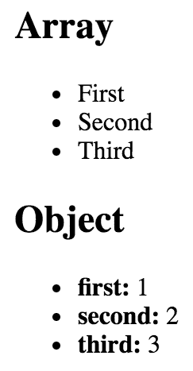

# 第二章：使用 JSX 渲染

本章将向您介绍 JSX。我们将从基础知识开始：什么是 JSX？然后，您会发现 JSX 内置支持 HTML 标记，正如您所期望的那样，所以我们将在这里运行一些示例。在查看了一些 JSX 代码之后，我们将讨论它如何使我们轻松描述 UI 的结构。然后，我们将开始构建我们自己的 JSX 元素，并使用 JavaScript 表达式进行动态内容。最后，您将学习如何使用片段来产生更少的 HTML——这是 React 16 的一个新功能。

准备好了吗？

# 什么是 JSX？

在这一部分，我们将实现义不容辞的*你好世界*JSX 应用程序。在这一点上，我们只是在试水；更深入的例子将会接下来。我们还将讨论什么使这种语法适合声明式 UI 结构。

# 你好 JSX

话不多说，这是你的第一个 JSX 应用程序：

```jsx
// The "render()" function will render JSX markup and
// place the resulting content into a DOM node. The "React"
// object isn't explicitly used here, but it's used
// by the transpiled JSX source.
import React from 'react';
import { render } from 'react-dom';

// Renders the JSX markup. Notice the XML syntax
// mixed with JavaScript? This is replaced by the
// transpiler before it reaches the browser.
render(
 <p>
    Hello, <strong>JSX</strong>
  </p>,
  document.getElementById('root')
);
```

让我们来看看这里发生了什么。首先，我们需要导入相关的部分。`render()`函数是这个例子中真正重要的部分，因为它将 JSX 作为第一个参数并将其呈现到作为第二个参数传递的 DOM 节点上。

在这个例子中，实际的 JSX 内容呈现了一个段落，里面有一些加粗的文本。这里没有什么花哨的东西，所以我们可以直接将这个标记插入到 DOM 中作为普通字符串。然而，JSX 比这里展示的更复杂。这个例子的目的是展示将 JSX 呈现到页面上所涉及的基本步骤。现在，让我们稍微谈一下声明式 UI 结构。

JSX 被转译成 JavaScript 语句；浏览器不知道 JSX 是什么。我强烈建议您从[`github.com/PacktPublishing/React-and-React-Native-Second-Edition`](https://github.com/PacktPublishing/React-and-React-Native-Second-Edition)下载本书的配套代码，并在阅读时运行它。一切都会自动转译给您；您只需要遵循简单的安装步骤。

# 声明式 UI 结构

在我们继续进行代码示例之前，让我们花一点时间来反思我们的*hello world*示例。 JSX 内容简短而简单。它也是**声明性**的，因为它描述了要渲染的内容，而不是如何渲染它。具体来说，通过查看 JSX，您可以看到此组件将呈现一个段落，并在其中呈现一些粗体文本。如果这是以命令式方式完成的，可能会涉及一些更多的步骤，并且它们可能需要按特定顺序执行。

我们刚刚实施的示例应该让您了解声明性 React 的全部内容。随着我们在本章和整本书中的继续前进，JSX 标记将变得更加复杂。但是，它始终将描述用户界面中的内容。让我们继续。

# 就像 HTML 一样

归根结底，React 组件的工作是将 HTML 渲染到 DOM 浏览器中。这就是为什么 JSX 默认支持 HTML 标记。在本节中，我们将查看一些代码，用于渲染一些可用的 HTML 标记。然后，我们将介绍在 React 项目中使用 HTML 标记时通常遵循的一些约定。

# 内置 HTML 标记

当我们渲染 JSX 时，元素标记引用的是 React 组件。由于为 HTML 元素创建组件将是繁琐的，React 带有 HTML 组件。我们可以在我们的 JSX 中渲染任何 HTML 标记，输出将如我们所期望的那样。现在，让我们尝试渲染一些这些标记：

```jsx
import React from 'react';
import { render } from 'react-dom';

// The render() function will only complain if the browser doesn't
// recognize the tag
render(
  <div>
    <button />
    <code />
    <input />
    <label />
    <p />
    <pre />
    <select />
    <table />
    <ul />
  </div>,
  document.getElementById('root')
);
```

不要担心此示例的渲染输出；这没有意义。我们在这里所做的一切只是确保我们可以渲染任意 HTML 标记，并且它们会按预期渲染。

你可能已经注意到周围的`<div>`标签，将所有其他标签分组为其子标签。这是因为 React 需要一个根组件来渲染。在本章的后面，你将学习如何渲染相邻的元素，而不需要将它们包装在父元素中。

# HTML 标记约定

当您在 JSX 标记中渲染 HTML 标记时，期望是您将使用小写来表示标记名称。事实上，大写 HTML 标记的名称将失败。标记名称是区分大小写的，而非 HTML 元素是大写的。这样，很容易扫描标记并找到内置的 HTML 元素与其他所有内容。

您还可以传递 HTML 元素的任何标准属性。当您传递意外的内容时，将记录有关未知属性的警告。以下是一个说明这些想法的示例：

```jsx
import React from 'react';
import { render } from 'react-dom';

// This renders as expected, except for the "foo"
// property, since this is not a recognized button
// property.
render(
  <button title="My Button" foo="bar">
    My Button
  </button>,
  document.getElementById('root')
);

// This fails with a "ReferenceError", because
// tag names are case-sensitive. This goes against
// the convention of using lower-case for HTML tag names.
render(<Button />, document.getElementById('root'));

```

在书的后面，我将介绍你制作的组件的属性验证。这可以避免类似于这个例子中`foo`属性的静默错误行为。

# 描述 UI 结构

JSX 是描述复杂 UI 结构的最佳方式。让我们看一些声明比单个段落更复杂结构的 JSX 标记：

```jsx
import React from 'react';
import { render } from 'react-dom';

// This JSX markup describes some fairly-sophisticated
// markup. Yet, it's easy to read, because it's XML and
// XML is good for concisely-expressing hierarchical
// structure. This is how we want to think of our UI,
// when it needs to change, not as an individual element
// or property.
render(
  <section>
    <header>
      <h1>A Header</h1>
    </header>
    <nav>
      <a href="item">Nav Item</a>
    </nav>
    <main>
      <p>The main content...</p>
    </main>
    <footer>
      <small>&copy; 2018</small>
    </footer>
  </section>,
  document.getElementById('root')
);
```

正如你所看到的，在这个标记中有很多语义元素，描述了 UI 的结构。关键在于这种复杂结构很容易理解，我们不需要考虑渲染它的特定部分。但在我们开始实现动态 JSX 标记之前，让我们创建一些自己的 JSX 组件。

这是渲染的内容：


# 创建你自己的 JSX 元素

组件是 React 的基本构建块。事实上，组件是 JSX 标记的词汇。在本节中，我们将看到如何在组件中封装 HTML 标记。我们将构建示例，向你展示如何嵌套自定义 JSX 元素以及如何为你的组件命名空间。

# 封装 HTML

你想创建新的 JSX 元素的原因是为了封装更大的结构。这意味着你可以使用自定义标签，而不是输入复杂的标记。React 组件返回替换元素的 JSX。现在让我们看一个例子：

```jsx
// We also need "Component" so that we can
// extend it and make a new JSX tag.
import React, { Component } from 'react';
import { render } from 'react-dom';

// "MyComponent" extends "Compoennt", which means that
// we can now use it in JSX markup.
class MyComponent extends Component {
  render() {
    // All components have a "render()" method, which
    // retunrns some JSX markup. In this case, "MyComponent"
    // encapsulates a larger HTML structure.
    return (
      <section>
        <h1>My Component</h1>
        <p>Content in my component...</p>
      </section>
    );
  }
}

// Now when we render "<MyComponent>" tags, the encapsulated
// HTML structure is actually rendered. These are the
// building blocks of our UI.
render(<MyComponent />, document.getElementById('root'));

```

这是渲染的输出：


这是你实现的第一个 React 组件，所以让我们花点时间来分析一下这里发生了什么。你创建了一个名为`MyComponent`的类，它继承自 React 的`Component`类。这是你创建一个新的 JSX 元素的方式。正如你在`render()`中看到的，你正在渲染一个`<MyComponent>`元素。

这个组件封装的 HTML 是由`render()`方法返回的。在这种情况下，当 JSX `<MyComponent>`被`react-dom`渲染时，它被一个`<section>`元素替换，并且其中的所有内容。 

当 React 渲染 JSX 时，你使用的任何自定义元素必须在同一个作用域内具有相应的 React 组件。在前面的例子中，`MyComponent`类在`render()`调用的同一个作用域中声明，所以一切都按预期工作。通常，你会导入组件，将它们添加到适当的作用域中。随着你在书中的进展，你会看到更多这样的情况。

# 嵌套元素

使用 JSX 标记有助于描述具有父子关系的 UI 结构。例如，`<li>`标记只有作为`<ul>`或`<ol>`标记的子标记才有用-您可能会使用自己的 React 组件创建类似的嵌套结构。为此，您需要使用`children`属性。让我们看看这是如何工作的。以下是 JSX 标记：

```jsx
import React from 'react';
import { render } from 'react-dom';

// Imports our two components that render children...
import MySection from './MySection';
import MyButton from './MyButton';

// Renders the "MySection" element, which has a child
// component of "MyButton", which in turn has child text.
render(
  <MySection>
    <MyButton>My Button Text</MyButton>
  </MySection>,
  document.getElementById('root')
);
```

您正在导入两个自己的 React 组件：`MySection`和`MyButton`。现在，如果您查看 JSX 标记，您会注意到`<MyButton>`是`<MySection>`的子代。您还会注意到`MyButton`组件接受文本作为其子代，而不是更多的 JSX 元素。让我们看看这些组件是如何工作的，从`MySection`开始：

```jsx
import React, { Component } from 'react';

// Renders a "<section>" element. The section has
// a heading element and this is followed by
// "this.props.children".
export default class MySection extends Component {
  render() {
    return (
      <section>
        <h2>My Section</h2>
        {this.props.children}
      </section>
    );
  }
}
```

这个组件呈现了一个标准的`<section>`HTML 元素，一个标题，然后是`{this.props.children}`。正是这个构造允许组件访问嵌套元素或文本，并将其呈现出来。

在前面的例子中使用的两个大括号用于 JavaScript 表达式。我将在下一节中详细介绍在 JSX 标记中找到的 JavaScript 表达式语法的更多细节。

现在，让我们看一下`MyButton`组件：

```jsx
import React, { Component } from 'react';

// Renders a "<button>" element, using
// "this.props.children" as the text.
export default class MyButton extends Component {
  render() {
    return <button>{this.props.children}</button>;
  }
}
```

这个组件使用与`MySection`完全相同的模式；获取`{this.props.children}`的值，并用有意义的标记包围它。React 会为您处理混乱的细节。在这个例子中，按钮文本是`MyButton`的子代，而`MyButton`又是`MySection`的子代。但是，按钮文本是透明地通过`MySection`传递的。换句话说，我们不需要在`MySection`中编写任何代码来确保`MyButton`获得其文本。很酷，对吧？渲染输出如下所示：


# 命名空间组件

到目前为止，您创建的自定义元素都使用了简单的名称。有时，您可能希望给组件一个命名空间。在您的 JSX 标记中，您将写入`<MyNamespace.MyComponent>`而不是`<MyComponent>`。这样可以清楚地告诉任何人`MyComponent`是`MyNamespace`的一部分。

通常，`MyNamespace`也将是一个组件。**命名空间**的想法是使用命名空间语法呈现其子组件。让我们来看一个例子：

```jsx
import React from 'react';
import { render } from 'react-dom';

// We only need to import "MyComponent" since
// the "First" and "Second" components are part
// of this "namespace".
import MyComponent from './MyComponent';

// Now we can render "MyComponent" elements,
// and it's "namespaced" elements as children.
// We don't actually have to use the namespaced
// syntax here, we could import the "First" and
// "Second" components and render them without the
// "namespace" syntax. It's a matter of readability
// and personal taste.
render(
  <MyComponent>
    <MyComponent.First />
    <MyComponent.Second />
  </MyComponent>,
  document.getElementById('root')
);

```

这个标记呈现了一个带有两个子元素的`<MyComponent>`元素。关键在于，我们不是写`<First>`，而是写`<MyComponent.First>`，`<MyComponent.Second>`也是一样。这个想法是我们想要明确地显示`First`和`Second`属于`MyComponent`，在标记内部。

我个人不依赖于这样的命名空间组件，因为我宁愿通过查看模块顶部的`import`语句来看哪些组件正在使用。其他人可能更愿意导入一个组件，并在标记中明确标记关系。没有正确的做法；这是个人品味的问题。

现在，让我们来看一下`MyComponent`模块：

```jsx
import React, { Component } from 'react';

// The "First" component, renders some basic JSX...
class First extends Component {
  render() {
    return <p>First...</p>;
  }
}

// The "Second" component, renders some basic JSX...
class Second extends Component {
  render() {
    return <p>Second...</p>;
  }
}

// The "MyComponent" component renders it's children
// in a "<section>" element.
class MyComponent extends Component {
  render() {
    return <section>{this.props.children}</section>;
  }
}

// Here is where we "namespace" the "First" and
// "Second" components, by assigning them to
// "MyComponent" as class properties. This is how
// other modules can render them as "<MyComponent.First>"
// elements.
MyComponent.First = First;
MyComponent.Second = Second;

export default MyComponent;

// This isn't actually necessary. If we want to be able
// to use the "First" and "Second" components independent
// of "MyComponent", we would leave this in. Otherwise,
// we would only export "MyComponent".
export { First, Second };

```

这个模块声明了`MyComponent`以及属于这个命名空间的其他组件（`First`和`Second`）。这个想法是将组件分配给命名空间组件（`MyComponent`）作为类属性。在这个模块中有很多可以改变的东西。例如，你不必直接导出`First`和`Second`，因为它们可以通过`MyComponent`访问。你也不需要在同一个模块中定义所有东西；你可以导入`First`和`Second`并将它们分配为类属性。使用命名空间是完全可选的，如果你使用它们，应该一致地使用它们。

# 使用 JavaScript 表达式

正如你在前面的部分中看到的，JSX 有特殊的语法，允许你嵌入 JavaScript 表达式。每当 React 渲染 JSX 内容时，标记中的表达式都会被评估。这是 JSX 的动态方面，在本节中，你将学习如何使用表达式来设置属性值和元素文本内容。你还将学习如何将数据集合映射到 JSX 元素。

# 动态属性值和文本

一些 HTML 属性或文本值是静态的，意味着它们在 JSX 重新渲染时不会改变。其他值，即属性或文本的值，是基于应用程序中其他地方找到的数据。记住，React 只是视图层。让我们看一个例子，这样你就可以感受一下在 JSX 标记中 JavaScript 表达式语法是什么样子的：

```jsx
import React from 'react';
import { render } from 'react-dom';

// These constants are passed into the JSX
// markup using the JavaScript expression syntax.
const enabled = false;
const text = 'A Button';
const placeholder = 'input value...';
const size = 50;

// We're rendering a "<button>" and an "<input>"
// element, both of which use the "{}" JavaScript
// expression syntax to fill in property, and text
// values.
render(
  <section>
    <button disabled={!enabled}>{text}</button>
    <input placeholder={placeholder} size={size} />
  </section>,
  document.getElementById('root')
);

```

任何有效的 JavaScript 表达式，包括嵌套的 JSX，都可以放在大括号`{}`之间。对于属性和文本，这通常是一个变量名或对象属性。请注意，在这个例子中，`!enabled`表达式计算出一个布尔值。渲染输出如下所示：

如果你正在使用可下载的配套代码进行跟进，我强烈建议你这样做，尝试玩玩这些值，看看渲染的 HTML 如何改变。

# 将集合映射到元素

有时，你需要编写 JavaScript 表达式来改变你的标记结构。在前面的部分中，你学会了如何使用 JavaScript 表达式语法来动态改变 JSX 元素的属性值。那么当你需要根据 JavaScript 集合添加或删除元素时呢？

在整本书中，当我提到 JavaScript**集合**时，我指的是普通对象和数组。或者更一般地说，任何可迭代的东西。

动态控制 JSX 元素的最佳方式是从集合中映射它们。让我们看一个如何做到这一点的例子：

```jsx
import React from 'react';
import { render } from 'react-dom';

// An array that we want to render as s list...
const array = ['First', 'Second', 'Third'];

// An object that we want to render as a list...
const object = {
  first: 1,
  second: 2,
  third: 3
};

render(
  <section>
    <h1>Array</h1>

    {/* Maps "array" to an array of "<li>"s.
         Note the "key" property on "<li>".
         This is necessary for performance reasons,
         and React will warn us if it's missing. */}
    <ul>{array.map(i => <li key={i}>{i}</li>)}</ul>
    <h1>Object</h1>

    {/* Maps "object" to an array of "<li>"s.
         Note that we have to use "Object.keys()"
         before calling "map()" and that we have
         to lookup the value using the key "i". */}
    <ul>
      {Object.keys(object).map(i => (
        <li key={i}>
          <strong>{i}: </strong>
          {object[i]}
        </li>
      ))}
    </ul>
  </section>,
  document.getElementById('root')
);

```

第一个集合是一个名为`array`的数组，其中包含字符串值。在 JSX 标记中，你可以看到对`array.map()`的调用，它将返回一个新数组。映射函数实际上返回了一个 JSX 元素（`<li>`），这意味着数组中的每个项目现在在标记中表示。

评估这个表达式的结果是一个数组。别担心；JSX 知道如何渲染元素数组。

对象集合使用相同的技术，只是你需要调用`Object.keys()`，然后映射这个数组。将集合映射到页面上的 JSX 元素的好处是，你可以根据集合数据驱动 React 组件的结构。这意味着你不必依赖命令式逻辑来控制 UI。

渲染输出如下：



# JSX 片段的片段

React 16 引入了**JSX 片段**的概念。片段是一种将标记块组合在一起的方式，而无需向页面添加不必要的结构。例如，一种常见的方法是让 React 组件返回包裹在`<div>`元素中的内容。这个元素没有实际目的，只会给 DOM 添加混乱。

让我们看一个例子。这里有一个组件的两个版本。一个使用包装元素，另一个使用新的片段功能：

```jsx
import React from 'react';
import { render } from 'react-dom';

import WithoutFragments from './WithoutFragments';
import WithFragments from './WithFragments';

render(
  <div>
    <WithoutFragments />
    <WithFragments />
  </div>,
  document.getElementById('root')
);
```

渲染的两个元素分别是`<WithoutFragments>`和`<WithFragments>`。渲染时的样子如下：


现在让我们比较这两种方法。

# 包装元素

第一种方法是将兄弟元素包装在`<div>`中。以下是源代码的样子：

```jsx
import React, { Component } from 'react';

class WithoutFragments extends Component {
  render() {
    return (
      <div>
        <h1>Without Fragments</h1>
        <p>
          Adds an extra <code>div</code> element.
        </p>
      </div>
    );
  }
}

export default WithoutFragments;
```

这个组件的本质是`<h1>`和`<p>`标签。然而，为了从`render()`中返回它们，你必须用`<div>`包装它们。实际上，使用浏览器开发工具检查 DOM 会发现这个`<div>`除了增加了另一层结构外并没有做任何事情。


现在，想象一个有很多这些组件的应用程序，那就是很多无意义的元素！

# 避免使用片段的不必要标签

现在让我们来看一下`WithFragments`组件：

```jsx
import React, { Component, Fragment } from 'react';

class WithFragments extends Component {
  render() {
    return (
      <Fragment>
        <h1>With Fragments</h1>
        <p>Doesn't have any unused DOM elements.</p>
      </Fragment>
    );
  }
}

export default WithFragments;
```

而不是将组件内容包装在`<div>`中，使用了`<Fragment>`元素。这是一种特殊类型的元素，表示只需要渲染它的子元素。如果你检查 DOM，你可以看到与`WithoutFragments`组件相比的区别：

注意在前面的例子中你不得不从 React 中导入`Fragment`吗？这是因为并非所有的转译器（如 Babel）都能理解 Fragment 元素。在未来的版本中，实际上会有一种简写的方式来在 JSX 中表示片段：`<>My Content</>`。但是目前，`React.Fragment`应该可以在所有的 React 工具中使用。

# 摘要

在本章中，你学习了 JSX 的基础知识，包括其声明性结构以及为什么这是一件好事。然后，你编写了一些代码来渲染一些基本的 HTML，并学习了如何使用 JSX 描述复杂的结构。

接下来，你花了一些时间学习了通过实现自己的 React 组件来扩展 JSX 标记的词汇量，这是 UI 的基本构建块。然后，你学习了如何将动态内容带入到 JSX 元素属性中，以及如何将 JavaScript 集合映射到 JSX 元素，消除了控制 UI 显示的命令式逻辑的需要。最后，你学习了如何使用新的 React 16 功能来渲染 JSX 内容的片段。

现在你已经感受到了在 JavaScript 模块中嵌入声明性 XML 来渲染 UI 的感觉，是时候进入下一章了，在那里我们将更深入地了解组件属性和状态。

# 测试你的知识

1.  你可以将所有标准的 HTML 标签作为 JSX 元素使用吗？

1.  是的，但你必须从 react-dom 中导入你想要使用的任何 HTML 标签

1.  不，你必须实现自己的 React 组件来渲染 HTML 内容

1.  是的，React 支持这个功能

1.  如何访问组件的子元素？

1.  子 JSX 元素始终可以通过 `children` 属性访问

1.  子 JSX 元素作为参数传递给 `render()` 方法

1.  无法从组件内部访问子元素

1.  `Fragment` 组件从 React 做什么？

1.  它更有效地呈现其子元素

1.  它创建一个可重复使用的标记片段，然后可以在整个应用程序中重复使用

1.  它通过消除渲染无意义的元素（如容器 div）来充当容器组件

# 进一步阅读

查看以下链接以获取更多信息：

+   [`reactjs.org/docs/introducing-jsx.html`](https://reactjs.org/docs/introducing-jsx.html)

+   [`reactjs.org/docs/fragments.html`](https://reactjs.org/docs/fragments.html)
