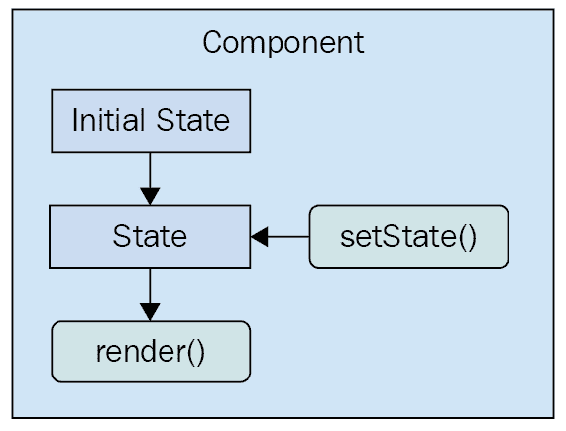

# 第三章：组件属性，状态和上下文

React 组件依赖于 JSX 语法，用于描述 UI 的结构。JSX 只能带你走这么远 - 你需要数据来填充 React 组件的结构。本章的重点是组件数据，它有两种主要的变体：*属性*和*状态*。向组件传递数据的另一种选择是通过上下文。

我将首先定义属性和状态的含义。然后，我将通过一些示例来演示设置组件状态和传递组件属性的机制。在本章的末尾，我们将建立在您对 props 和 state 的新知识的基础上，并介绍功能组件和容器模式。最后，您将了解上下文以及何时选择它比属性更好地向组件传递数据。

# 组件状态是什么？

React 组件使用 JSX 声明 UI 元素的结构。但是，如果组件要有用，它们需要数据。例如，您的组件 JSX 可能声明一个`<ul>`，将 JavaScript 集合映射到`<li>`元素。这个集合是从哪里来的？

**状态**是 React 组件的动态部分。您可以声明组件的初始状态，随着时间的推移而改变。

想象一下，您正在渲染一个组件，其中其状态的一部分被初始化为空数组。稍后，该数组将被填充数据。这被称为**状态变化**，每当您告诉 React 组件更改其状态时，组件将自动重新渲染自身。该过程在这里可视化：



组件的状态是组件本身可以设置的东西，或者是组件外的其他代码片段。现在我们将看看组件属性以及它们与组件状态的区别。

# 组件属性是什么？

**属性**用于将数据传递给您的 React 组件。与使用新状态作为参数调用方法不同，属性仅在组件呈现时传递。也就是说，您将属性值传递给 JSX 元素。

在 JSX 的上下文中，属性被称为**属性**，可能是因为在 XML 术语中是这样称呼它们的。在本书中，属性和属性是同义词。

属性与状态不同，因为它们在组件初始渲染后不会改变。如果属性值已更改，并且你想重新渲染组件，那么我们必须重新渲染用于首次渲染的 JSX。React 内部会确保这样做的效率。下面是使用属性渲染和重新渲染组件的图示：


这看起来与有状态的组件有很大不同。真正的区别在于，对于属性来说，往往是父组件决定何时渲染 JSX。组件实际上不知道如何重新渲染自己。正如你将在本书中看到的那样，这种自上而下的流程比在各个地方更改状态更容易预测。

让我们通过编写一些代码来理解这两个概念。

# 设置组件状态

在这一部分，你将编写一些设置组件状态的 React 代码。首先，你将了解初始状态——这是组件的默认状态。接下来，你将学习如何改变组件的状态，导致它重新渲染自己。最后，你将看到新状态如何与现有状态合并。

# 初始组件状态

组件的初始状态实际上并不是必需的，但如果你的组件使用状态，应该设置初始状态。这是因为如果组件期望某些状态属性存在，而它们不存在，那么组件要么会失败，要么会渲染出意外的东西。幸运的是，设置初始组件状态很容易。

组件的初始状态应该始终是一个具有一个或多个属性的对象。例如，你可能有一个使用单个数组作为状态的组件。这没问题，但确保将初始数组设置为状态对象的属性。不要将数组用作状态。原因很简单：一致性。每个 React 组件都使用普通对象作为其状态。

现在让我们把注意力转向一些代码。这是一个设置初始状态对象的组件：

```jsx
import React, { Component } from 'react';

export default class MyComponent extends Component {
 // The initial state is set as a simple property
  // of the component instance.
  state = {
    first: false,
    second: true
  };

  render() {
    // Gets the "first" and "second" state properties
    // into constants, making our JSX less verbose.
    const { first, second } = this.state;

    // The returned JSX uses the "first" and "second"
    // state properties as the "disabled" property
    // value for their respective buttons.
    return (
      <main>
        <section>
          <button disabled={first}>First</button>
        </section>
        <section>
          <button disabled={second}>Second</button>
        </section>
      </main>
    );
  }
}
```

当你查看`render()`返回的 JSX 时，你实际上可以看到这个组件依赖的状态值——`first`和`second`。由于你在初始状态中设置了这些属性，所以可以安全地渲染组件，不会有任何意外。例如，你可以只渲染这个组件一次，它会按预期渲染，多亏了初始状态：

```jsx
import React from 'react';
import { render } from 'react-dom';

import MyComponent from './MyComponent';

// "MyComponent" has an initial state, nothing is passed
// as a property when it's rendered.
render(<MyComponent />, document.getElementById('root'));
```

渲染输出如下所示：


设置初始状态并不是很令人兴奋，但它仍然很重要。让组件在状态改变时重新渲染自己。

# 设置组件状态

让我们创建一个具有一些初始状态的组件。然后渲染这个组件，并更新它的状态。这意味着组件将被渲染两次。让我们来看看这个组件：

```jsx
import React, { Component } from 'react';

export default class MyComponent extends Component {
  // The initial state is used, until something
  // calls "setState()", at which point the state is
  // merged with this state.
  state = {
    heading: 'React Awesomesauce (Busy)',
    content: 'Loading...'
  };

  render() {
    const { heading, content } = this.state;

    return (
      <main>
        <h1>{heading}</h1>
        <p>{content}</p>
      </main>
    );
  }
}
```

这个组件的 JSX 取决于两个状态值——`heading`和`content`。该组件还设置了这两个状态值的初始值，这意味着它可以在没有任何意外情况的情况下被渲染。现在，让我们看一些代码，渲染组件，然后通过改变状态重新渲染它：

```jsx
import React from 'react';
import { render } from 'react-dom';

import MyComponent from './MyComponent';

// The "render()" function returns a reference to the
// rendered component. In this case, it's an instance
// of "MyComponent". Now that we have the reference,
// we can call "setState()" on it whenever we want.
const myComponent = render(
  <MyComponent />,
  document.getElementById('root')
);

// After 3 seconds, set the state of "myComponent",
// which causes it to re-render itself.
setTimeout(() => {
  myComponent.setState({
    heading: 'React Awesomesauce',
    content: 'Done!'
  });
}, 3000);
```

首先使用默认状态渲染组件。然而，这段代码中有趣的地方是`setTimeout()`的调用。3 秒后，它使用`setState()`来改变两个状态属性的值。果然，这个改变在 UI 中得到了体现。在渲染时，初始状态如下所示：


在状态改变后，渲染输出如下：

这个例子突出了具有声明性 JSX 语法来描述 UI 组件结构的强大功能。你只需声明一次，然后随着应用程序中的变化随时间更新组件的状态以反映这些变化。所有 DOM 交互都经过优化并隐藏在视图之外。

在这个例子中，你替换了整个组件状态。也就是说，调用`setState()`传入了与初始状态中找到的相同对象属性。但是，如果你只想更新组件状态的一部分呢？

# 合并组件状态

当你设置 React 组件的状态时，实际上是将组件的状态与传递给`setState()`的对象进行合并。这很有用，因为这意味着你可以设置组件状态的一部分，同时保持其余状态不变。现在让我们来看一个例子。首先，一个带有一些状态的组件：

```jsx
import React, { Component } from 'react';

export default class MyComponent extends Component {
  // The initial state...
  state = {
    first: 'loading...',
    second: 'loading...',
    third: 'loading...',
    fourth: 'loading...',
    doneMessage: 'finished!'
  };

  render() {
    const { state } = this;

    // Renders a list of items from the
    // component state.
    return (
      <ul>
        {Object.keys(state)
          .filter(key => key !== 'doneMessage')
          .map(key => (
            <li key={key}>
              <strong>{key}: </strong>
              {state[key]}
            </li>
          ))}
      </ul>
    );
  }
}
```

该组件呈现其状态的键和值——除了`doneMessage`。每个值默认为`loading...`。让我们编写一些代码，分别设置每个状态属性的状态：

```jsx
import React from 'react';
import { render } from 'react-dom';

import MyComponent from './MyComponent';

// Stores a reference to the rendered component...
const myComponent = render(
  <MyComponent />,
  document.getElementById('root')
);

// Change part of the state after 1 second...
setTimeout(() => {
  myComponent.setState({ first: 'done!' });
}, 1000);

// Change another part of the state after 2 seconds...
setTimeout(() => {
  myComponent.setState({ second: 'done!' });
}, 2000);

// Change another part of the state after 3 seconds...
setTimeout(() => {
  myComponent.setState({ third: 'done!' });
}, 3000);

// Change another part of the state after 4 seconds...
setTimeout(() => {
  myComponent.setState(state => ({
    ...state,
    fourth: state.doneMessage
  }));
}, 4000);

```

从此示例中可以得出的结论是，您可以在组件上设置单个状态属性。它将有效地重新呈现自身。以下是初始组件状态的呈现输出：


以下是两个`setTimeout()`回调运行后输出的样子：


对`setState()`的第四次调用与前三次不同。您可以传递一个函数，而不是传递一个新对象以合并到现有状态中。此函数接受一个状态参数-组件的当前状态。当您需要基于当前状态值进行状态更改时，这将非常有用。在此示例中，`doneMessage`值用于设置`fourth`的值。然后函数返回组件的新状态。您需要将现有状态值合并到新状态中。您可以使用扩展运算符来执行此操作（`...state`）。

# 传递属性值

属性就像传递到组件中的状态数据。但是，属性与状态不同之处在于它们只在组件呈现时设置一次。在本节中，您将了解*默认属性值*。然后，我们将看看*设置属性值*。在本节之后，您应该能够理解组件状态和属性之间的区别。

# 默认属性值

默认属性值的工作方式与默认状态值略有不同。它们被设置为一个名为`defaultProps`的类属性。让我们看一个声明默认属性值的组件：

```jsx
import React, { Component } from 'react';

export default class MyButton extends Component {
  // The "defaultProps" values are used when the
  // same property isn't passed to the JSX element.
  static defaultProps = {
    disabled: false,
    text: 'My Button'
  };

  render() {
    // Get the property values we want to render.
    // In this case, it's the "defaultProps", since
    // nothing is passed in the JSX.
    const { disabled, text } = this.props; 

    return <button disabled={disabled}>{text}</button>;
  }
}

```

为什么不像默认状态一样将默认属性值设置为实例属性？原因是*属性是不可变的*，它们不需要保留为实例属性值。另一方面，状态不断变化，因此组件需要对其进行实例级引用。

您可以看到，此组件为`disabled`和`text`设置了默认属性值。只有在通过用于呈现组件的 JSX 标记未传递这些值时，才会使用这些值。让我们继续呈现此组件，而不使用任何属性，以确保使用`defaultProps`值：

```jsx
import React from 'react';
import { render } from 'react-dom';

import MyButton from './MyButton';

// Renders the "MyButton" component, without
// passing any property values.
render(<MyButton />, document.getElementById('root'));

```

始终具有默认状态的相同原则也适用于属性。您希望能够呈现组件，而无需预先知道组件的动态值是什么。

# 设置属性值

首先，让我们创建一些期望不同类型的属性值的组件：

在第七章*验证组件属性*中，我将更详细地讨论验证传递给组件的属性值。

```jsx
import React, { Component } from 'react';

export default class MyButton extends Component {
  // Renders a "<button>" element using values
  // from "this.props".
  render() {
    const { disabled, text } = this.props;

    return <button disabled={disabled}>{text}</button>;
  }
}
```

这个简单的按钮组件期望一个布尔类型的`disabled`属性和一个字符串类型的`text`属性。让我们再创建一个期望一个数组属性值的组件：

```jsx
import React, { Component } from 'react';

export default class MyList extends Component {
  render() {
    // The "items" property is an array.
    const { items } = this.props;

    // Maps each item in the array to a list item.
    return <ul>{items.map(i => <li key={i}>{i}</li>)}</ul>;
  }
}
```

你可以通过 JSX 传递几乎任何你想要的东西作为属性值，只要它是一个有效的 JavaScript 表达式。现在让我们编写一些代码来设置这些属性值：

```jsx
import React from 'react';
import { render as renderJSX } from 'react-dom';

// The two components we're to pass props to
// when they're rendered.
import MyButton from './MyButton';
import MyList from './MyList';

// This is the "application state". This data changes
// over time, and we can pass the application data to
// components as properties.
const appState = {
  text: 'My Button',
  disabled: true,
  items: ['First', 'Second', 'Third']
};

// Defines our own "render()" function. The "renderJSX()"
// function is from "react-dom" and does the actual
// rendering. The reason we're creating our own "render()"
// function is that it contains the JSX that we want to
// render, and so we can call it whenever there's new
// application data.
function render(props) {
  renderJSX(
    <main>
      {/* The "MyButton" component relies on the "text"
           and the "disabed" property. The "text" property
           is a string while the "disabled" property is a
           boolean. */}
      <MyButton text={props.text} disabled={props.disabled} />

      {/* The "MyList" component relies on the "items"
           property, which is an array. Any valid
           JavaScript data can be passed as a property. */}
      <MyList items={props.items} />
    </main>,
    document.getElementById('root')
  );
}

// Performs the initial rendering...
render(appState);

// After 1 second, changes some application data, then
// calls "render()" to re-render the entire structure.
setTimeout(() => {
  appState.disabled = false;
  appState.items.push('Fourth');

  render(appState);
}, 1000);

```

`render()`函数看起来像是每次调用时都在创建新的 React 组件实例。React 足够聪明，能够弄清楚这些组件已经存在，并且只需要弄清楚使用新的属性值时输出的差异是什么。

从这个例子中得出的另一个要点是，你有一个`appState`对象，它保存了应用程序的状态。然后将这个状态的部分作为属性传递给组件，当组件被渲染时。状态必须存在于某个地方，在这种情况下，它在组件之外。我将在下一节中继续讨论这个话题，届时你将学习如何实现无状态的功能组件。

# 无状态组件

到目前为止，在本书中你所见过的组件都是扩展了基础的`Component`类的类。现在是时候学习 React 中的**功能性组件**了。在本节中，你将通过实现一个功能性组件来学习什么是功能性组件。然后，你将学习如何为无状态的功能性组件设置默认属性值。

# 纯函数组件

一个功能性的 React 组件就像它听起来的那样——一个函数。想象一下你见过的任何 React 组件的`render()`方法。这个方法本质上就是组件。一个功能性的 React 组件的工作是返回 JSX，就像基于类的 React 组件一样。不同之处在于，这是一个功能性组件可以做的全部。它没有状态和生命周期方法。

为什么要使用函数组件？这更多是简单性的问题。如果你的组件只渲染一些 JSX 而不做其他事情，那么为什么要使用类，而不是一个函数更简单呢？

**纯函数**是没有副作用的函数。也就是说，给定一组参数调用函数时，函数总是产生相同的输出。这对于 React 组件是相关的，因为给定一组属性，更容易预测渲染的内容会是什么。总是返回相同值的函数在测试时也更容易。

现在让我们看一个函数组件：

```jsx
import React from 'react'; 

// Exports an arrow function that returns a 
// "<button>" element. This function is pure 
// because it has no state, and will always 
// produce the same output, given the same 
// input. 
export default ({ disabled, text }) => ( 
  <button disabled={disabled}>{text}</button> 
); 
```

简洁明了，不是吗？这个函数返回一个`<button>`元素，使用传入的属性作为参数（而不是通过`this.props`访问它们）。这个函数是纯的，因为如果传入相同的`disabled`和`text`属性值，就会渲染相同的内容。现在，让我们看看如何渲染这个组件：

```jsx
import React from 'react';
import { render as renderJSX } from 'react-dom';

// "MyButton" is a function, instead of a
// "Component" subclass.
import MyButton from './MyButton';

// Renders two "MyButton" components. We only need
// the "first" and "second" properties from the
// props argument by destructuring it.
function render({ first, second }) {
  renderJSX(
    <main>
      <MyButton text={first.text} disabled={first.disabled} />
      <MyButton text={second.text} disabled={second.disabled} />
    </main>,
    document.getElementById('root')
  );
}

// Reders the components, passing in property data.
render({
  first: {
    text: 'First Button',
    disabled: false
  },
  second: {
    text: 'Second Button',
    disabled: true
  }
});
```

从 JSX 的角度来看，基于类和基于函数的 React 组件没有任何区别。无论是使用类还是函数语法声明的组件，JSX 看起来都是一样的。

惯例是使用箭头函数语法来声明功能性的 React 组件。然而，如果传统的 JavaScript 函数语法更适合你的风格，也是完全有效的。

渲染后的 HTML 如下所示：


# 函数组件中的默认值

函数组件很轻量；它们没有任何状态或生命周期。然而，它们支持一些**元数据**选项。例如，你可以像类组件一样指定函数组件的默认属性值。下面是一个示例：

```jsx
import React from 'react';

// The functional component doesn't care if the property
// values are the defaults, or if they're passed in from
// JSX. The result is the same.
const MyButton = ({ disabled, text }) => (
  <button disabled={disabled}>{text}</button>
);

// The "MyButton" constant was created so that we could
// attach the "defaultProps" metadata here, before
// exporting it.
MyButton.defaultProps = {
  text: 'My Button',
  disabled: false
};

export default MyButton;

```

`defaultProps`属性是在函数上定义的，而不是在类上。当 React 遇到具有此属性的函数组件时，它知道如果没有通过 JSX 提供默认值，就会传递默认值。

# 容器组件

在这一部分，你将学习**容器组件**的概念。这是一个常见的 React 模式，它汇集了你所学到的关于状态和属性的许多概念。

容器组件的基本原则很简单：不要将数据获取与渲染数据的组件耦合在一起。容器负责获取数据并将其传递给其子组件。它包含负责渲染数据的组件。

这个模式的目的是让你能够在一定程度上实现**可替换性**。例如，一个容器可以替换它的子组件。或者，一个子组件可以在不同的容器中使用。让我们看看容器模式的实际应用，从容器本身开始：

```jsx
import React, { Component } from 'react';

import MyList from './MyList';

// Utility function that's intended to mock
// a service that this component uses to
// fetch it's data. It returns a promise, just
// like a real async API call would. In this case,
// the data is resolved after a 2 second delay.
function fetchData() {
  return new Promise(resolve => {
    setTimeout(() => {
      resolve(['First', 'Second', 'Third']);
    }, 2000);
  });
}

// Container components usually have state, so they
// can't be declared as functions.
export default class MyContainer extends Component {
  // The container should always have an initial state,
  // since this will be passed down to child components
  // as properties.
  state = { items: [] };

  // After the component has been rendered, make the
  // call to fetch the component data, and change the
  // state when the data arrives.
  componentDidMount() {
    fetchData().then(items => this.setState({ items }));
  }

  // Renders the container, passing the container
  // state as properties, using the spread operator: "...".
  render() {
    return <MyList {...this.state} />;
  }
}
```

这个组件的工作是获取数据并设置它的状态。每当状态被设置时，`render()`就会被调用。这就是*子组件*的作用。容器的状态被传递给子组件作为属性。接下来让我们来看一下`MyList`组件：

```jsx
import React from 'react';

// A stateless component that expects
// an "items" property so that it can render
// a "<ul>" element.
export default ({ items }) => (
  <ul>{items.map(i => <li key={i}>{i}</li>)}</ul>
);

```

`MyList`是一个期望有一个`items`属性的函数组件。让我们看看容器组件实际上是如何使用的：

```jsx
import React from 'react';
import { render } from 'react-dom';

import MyContainer from './MyContainer';

// All we have to do is render the "MyContainer"
// component, since it looks after providing props
// for it's children.
render(<MyContainer />, document.getElementById('root'));
```

容器组件设计将在第五章中更深入地介绍，*Crafting Reusable Components*。这个例子的目的是让你感受一下在 React 组件中状态和属性之间的相互作用。

当你加载页面时，你会在模拟 HTTP 请求需要 3 秒后看到以下内容被渲染出来：


# 提供和消费上下文

随着你的 React 应用程序的增长，它将使用更多的组件。它不仅会有更多的组件，而且你的应用程序的结构将发生变化，使得组件嵌套更深。嵌套在最深层级的组件仍然需要传递数据给它们。从父组件向子组件传递数据并不是什么大问题。挑战在于当你不得不开始使用组件作为传递数据的间接方式时。

对于需要传递到应用程序中任何组件的数据，你可以创建并使用一个上下文。在使用 React 中上下文时，有两个关键概念要记住——提供者和消费者。**上下文提供者**创建数据并确保它对任何 React 组件都可用。**上下文消费者**是一个在上下文中使用这些数据的组件。

你可能会想知道上下文是否只是在 React 应用程序中说全局数据的另一种方式。基本上，这正是上下文的用途。使用 React 的方法将组件与上下文包装在一起比创建全局数据更好，因为你可以更好地控制数据如何流经你的组件。例如，你可以有嵌套的上下文和许多其他高级用例。但现在，让我们只关注简单的用法。

假设您有一些应用程序数据，用于确定给定应用程序功能的权限。这些数据可以从 API 中获取，也可以是硬编码的。无论哪种情况，要求是您不希望通过组件树传递所有这些权限数据。如果权限数据只需存在，供任何需要它的组件使用，那就太好了。

从组件树的顶部开始，让我们看一下`index.js`：

```jsx
import React from 'react';
import { render } from 'react-dom';

import { PermissionProvider } from './PermissionContext';
import App from './App';

render(
  <PermissionProvider>
    <App />
  </PermissionProvider>,
  document.getElementById('root')
);
```

`<App>`组件是`<PermissionProvider>`组件的子组件。这意味着权限上下文已经提供给了`<App>`组件及其所有子组件，一直到树的最底部。让我们看一下定义权限上下文的`PermissionContext.js`模块。

```jsx
import React, { Component, createContext } from 'react';

const { Provider, Consumer } = createContext('permissions');

export class PermissionProvider extends Component {
  state = {
    first: true,
    second: false,
    third: true
  };

  render() {
    return (
      <Provider value={this.state}>{this.props.children}</Provider>
    );
  }
}

const PermissionConsumer = ({ name, children }) => (
  <Consumer>{value => value[name] && children}</Consumer>
);

export { PermissionConsumer };
```

`createContext()`函数用于创建实际的上下文。返回值是一个包含两个组件——`Provider`和`Consumer`的对象。接下来，有一个用于整个应用程序的权限提供者的简单抽象。状态包含组件可能想要使用的实际数据。在这个例子中，如果值为 true，则应该正常显示该功能。如果为 false，则该功能没有权限进行渲染。在这里，状态只设置一次，但由于这是一个常规的 React 组件，您可以像在任何其他组件上设置状态一样设置状态。渲染的值是`<Provider>`组件。这通过`value`属性为任何子组件提供上下文数据。

接下来，有一个用于权限消费者的小抽象。不是让每个需要测试权限的组件一遍又一遍地实现相同的逻辑，`PermissionConsumer`组件可以做到。`<Consumer>`组件的子组件始终是一个以上下文数据作为参数的函数。在这个例子中，`PermissionConsumer`组件有一个`name`属性，用于功能的名称。这与上下文中的值进行比较，如果为 false，则不会渲染任何内容。

现在让我们看一下`App`组件：

```jsx
import React, { Fragment } from 'react';

import First from './First';
import Second from './Second';
import Third from './Third';

export default () => (
  <Fragment>
    <First />
    <Second />
    <Third />
  </Fragment>
);
```

这个组件渲染了三个需要检查权限的功能组件。如果没有 React 的上下文功能，您将不得不通过这个组件将这些数据作为属性传递给每个组件。如果`<First>`有需要检查权限的子组件或孙子组件，相同的属性传递机制可能会变得非常混乱。

现在让我们来看一下`<First>`组件（`<Second>`和`<Third>`几乎完全相同）：

```jsx
import React from 'react';
import { PermissionConsumer } from './PermissionContext';

export default () => (
  <PermissionConsumer name="first">
    <div>
      <button>First</button>
    </div>
  </PermissionConsumer>
);
```

这就是`PermissionConsumer`组件的用法。您只需要为其提供一个`name`属性，如果权限检查通过，则子组件将被渲染。`<PermissionConsumer>`组件可以在任何地方使用，无需传递数据即可使用。以下是这三个组件的渲染输出：


第二个组件没有被渲染，因为它在`PermissionProvider`组件中的权限被设置为 false。

# 摘要

在本章中，您了解了 React 组件中的状态和属性。您首先定义并比较了这两个概念。然后，您实现了几个 React 组件并操纵了它们的状态。接下来，您通过实现了从 JSX 传递属性值到组件的代码来了解了属性。然后，您了解了容器组件的概念，用于将数据获取与呈现内容解耦。最后，您了解了 React 16 中的新上下文 API 以及如何使用它来避免在组件中引入间接性。

在下一章中，您将学习如何处理 React 组件中的用户事件。

# 测试您的知识

1.  为什么始终初始化组件的状态是个好主意？

1.  因为如果不这样做，当您尝试渲染时，React 将抛出错误。

1.  因为 React 不知道您在组件状态中有什么类型，并且无法优化渲染。

1.  因为如果`render()`方法期望状态值，您需要确保它们始终存在，以避免意外的渲染行为。

1.  什么时候应该使用属性而不是状态？

1.  状态应该只用于可以更改的值。对于其他所有情况，应该使用属性。

1.  尽量避免使用状态。

1.  您应该只使用属性来更新现有状态。

1.  什么是 React 中的上下文？

1.  上下文是您如何将事件处理程序函数传递给应用程序中的不同组件的方法。

1.  上下文用于避免瞬态属性。上下文用于与少数组件共享公共数据。

1.  上下文就像在组件之间共享的状态。

# 进一步阅读

访问以下链接获取更多信息：

+   [`reactjs.org/docs/react-component.html#instance-properties-1`](https://reactjs.org/docs/react-component.html#instance-properties-1)

+   [`reactjs.org/docs/react-without-es6.html#setting-the-initial-state`](https://reactjs.org/docs/react-without-es6.html#setting-the-initial-state)

+   [`reactjs.org/docs/context.html`](https://reactjs.org/docs/context.html)

+   [`developer.mozilla.org/en-US/docs/Web/JavaScript/Reference/Operators/Spread_syntax`](https://developer.mozilla.org/en-US/docs/Web/JavaScript/Reference/Operators/Spread_syntax)
