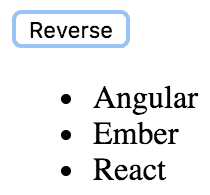
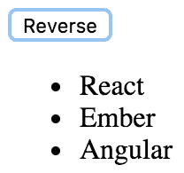
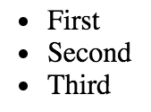
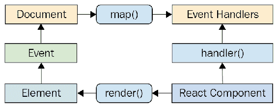
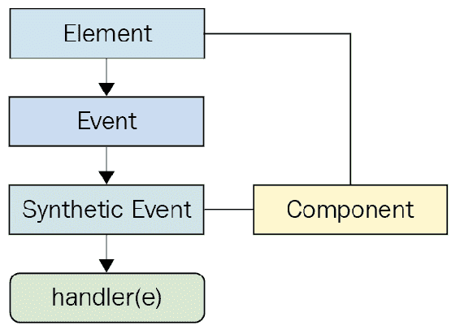
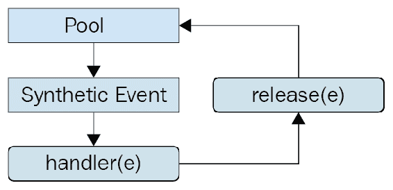

# 第四章：事件处理，React 方式

本章的重点是事件处理。React 在处理事件方面有独特的方法：在 JSX 中声明事件处理程序。我将首先看一下在 JSX 中声明特定元素的事件处理程序。然后，您将了解如何绑定处理程序上下文和参数值。接下来，我们将实现内联和高阶事件处理程序函数。

然后您将了解 React 实际上是如何将事件处理程序映射到 DOM 元素的。最后，您将了解 React 传递给事件处理程序函数的合成事件，以及它们如何为性能目的进行池化。

# 声明事件处理程序

在 React 组件中处理事件的不同因素是它是**声明式**的。与 jQuery 相比，你必须编写命令式代码来选择相关的 DOM 元素并将事件处理程序函数附加到它们上。

在 JSX 标记中声明事件处理程序的声明性方法的优势在于它们是 UI 结构的一部分。不必追踪分配事件处理程序的代码是一种心理上的解放。

在本节中，您将编写一个基本的事件处理程序，以便了解在 React 应用程序中找到的声明性事件处理语法。然后，您将学习如何使用通用事件处理程序函数。

# 声明处理程序函数

让我们看一个声明了元素点击事件的基本组件：

```jsx
import React, { Component } from 'react';

export default class MyButton extends Component {
  // The click event handler, there's nothing much
  // happening here other than a log of the event.
  onClick() {
    console.log('clicked');
  }

  // Renders a "<button>" element with the "onClick"
  // event handler set to the "onClick()" method of
  // this component.
  render() {
    return (
      <button onClick={this.onClick}>{this.props.children}</button>
    );
  }
}
```

事件处理程序函数`this.onClick()`被传递给`<button>`元素的`onClick`属性。通过查看这个标记，清楚地知道按钮被点击时将运行什么代码。

请参阅官方的 React 文档，了解支持的事件属性名称的完整列表：[`facebook.github.io/react/docs/`](https://facebook.github.io/react/docs/)。

# 多个事件处理程序

我真的很喜欢声明式事件处理程序语法的一点是，当一个元素分配了多个处理程序时，它很容易阅读。有时，例如，一个元素有两个或三个处理程序。命令式代码很难处理单个事件处理程序，更不用说多个事件处理程序了。当一个元素需要更多处理程序时，它只是另一个 JSX 属性。从代码可维护性的角度来看，这在很大程度上是可扩展的。

```jsx
import React, { Component } from 'react';

export default class MyInput extends Component {
  // Triggered when the value of the text input changes...
  onChange() {
    console.log('changed');
  }

  // Triggered when the text input loses focus...
  onBlur() {
    console.log('blured');
  }

  // JSX elements can have as many event handler
  // properties as necessary.
  render() {
    return <input onChange={this.onChange} onBlur={this.onBlur} />;
  }
}
```

这个`<input>`元素可能有几个更多的事件处理程序，代码仍然可以读得很清楚。

当您不断向组件添加更多事件处理程序时，您会注意到很多事件处理程序都在做相同的事情。接下来，您将学习如何在组件之间共享通用处理程序函数。

# 导入通用处理程序

任何 React 应用程序都可能会为不同组件共享相同的事件处理逻辑。例如，响应按钮点击时，组件应该对项目列表进行排序。这些类型的通用行为应该属于它们自己的模块，以便多个组件可以共享它们。让我们实现一个使用通用事件处理程序函数的组件：

```jsx
import React, { Component } from 'react';

// Import the generic event handler that
// manipulates the state of a component.
import reverse from './reverse';

export default class MyList extends Component {
  state = {
    items: ['Angular', 'Ember', 'React']
  };

  // Makes the generic function specific
  // to this component by calling "bind(this)".
  onReverseClick = reverse.bind(this);

  render() {
    const { state: { items }, onReverseClick } = this;

    return (
      <section>
        {/* Now we can attach the "onReverseClick" handler
            to the button, and the generic function will
            work with this component's state. */}
        <button onClick={onReverseClick}>Reverse</button>
        <ul>{items.map((v, i) => <li key={i}>{v}</li>)}</ul>
      </section>
    );
  }
}
```

让我们从这里开始，逐步了解正在发生的事情，从导入开始。您正在导入一个名为`reverse()`的函数。这是您在`<button>`元素中使用的通用事件处理程序函数。当它被点击时，列表应该反转其顺序。

`onReverseClick`方法实际上调用了通用的`reverse()`函数。它是使用`bind()`来将通用函数的上下文绑定到此组件实例而创建的。

最后，看一下 JSX 标记，您可以看到`onReverseClick()`函数被用作按钮点击的处理程序。

那么，这到底是如何工作的呢？您有一个通用函数，它以某种方式改变了此组件的状态，因为您将上下文绑定到它？嗯，基本上是的，就是这样。现在让我们来看一下通用函数的实现：

```jsx
// Exports a generic function that changes the 
// state of a component, causing it to re-render 
// itself.
export default function reverse() { 
  this.setState(this.state.items.reverse()); 
} 
```

此函数依赖于`this.state`属性和状态中的`items`数组。关键在于状态是通用的；一个应用程序可能有许多具有其状态中的`items`数组的组件。

我们渲染的列表如下所示：



如预期的那样，点击按钮会导致列表排序，使用您的通用`reverse()`事件处理程序：



接下来，您将学习如何绑定事件处理程序函数的上下文和参数值。

# 事件处理程序上下文和参数

在这一部分，您将了解绑定其事件处理程序上下文的 React 组件以及如何将数据传递给事件处理程序。对于 React 事件处理程序函数来说，拥有正确的上下文是很重要的，因为它们通常需要访问组件属性或状态。能够对事件处理程序进行参数化也很重要，因为它们不会从 DOM 元素中提取数据。

# 获取组件数据

在本节中，您将了解处理程序需要访问组件属性以及参数值的情况。您将渲染一个自定义列表组件，该组件在列表中的每个项目上都有一个点击事件处理程序。组件将按以下方式传递一个值数组：

```jsx
import React from 'react';
import { render } from 'react-dom';

import MyList from './MyList';

// The items to pass to "<MyList>" as a property.
const items = [
  { id: 0, name: 'First' },
  { id: 1, name: 'Second' },
  { id: 2, name: 'Third' }
];

// Renders "<MyList>" with an "items" property.
render(<MyList items={items} />, document.getElementById('root'));

```

列表中的每个项目都有一个`id`属性，用于标识该项目。当用户在 UI 中点击项目时，您需要能够访问此 ID，以便事件处理程序可以处理该项目。以下是`MyList`组件的实现方式：

```jsx
import React, { Component } from 'react';

export default class MyList extends Component {
  constructor() {
    super();

    // We want to make sure that the "onClick()"
    // handler is explicitly bound to this component
    // as it's context.
    this.onClick = this.onClick.bind(this);
  }

  // When a list item is clicked, look up the name
  // of the item based on the "id" argument. This is
  // why we need access to the component through "this",
  // for the properties.
  onClick(id) {
    const { name } = this.props.items.find(i => i.id === id);
    console.log('clicked', `"${name}"`);
  }

  render() {
    return (
      <ul>
        {/* Creates a new handler function with
            the bound "id" argument. Notice that
            the context is left as null, since that
            has already been bound in the
            constructor. */}
        {this.props.items.map(({ id, name }) => (
          <li key={id} onClick={this.onClick.bind(null, id)}>
            {name}
          </li>
        ))}
      </ul>
    );
  }
}
```

渲染列表如下所示：



您必须绑定事件处理程序的上下文，这是在构造函数中完成的。如果您查看`onClick()`事件处理程序，您会发现它需要访问组件，以便它可以在`this.props.items`中查找被点击的项目。此外，`onClick()`处理程序需要一个`id`参数。如果您查看此组件的 JSX 内容，您会发现调用`bind()`为列表中的每个项目提供了参数值。这意味着当处理程序响应点击事件时，项目的`id`已经提供了。

这种参数化事件处理的方法与以往的方法有很大不同。例如，我过去常常依赖于从 DOM 元素本身获取参数数据。当你只需要一个事件处理程序时，这种方法效果很好，它可以从事件参数中提取所需的数据。这种方法也不需要通过迭代集合并调用`bind()`来设置几个新函数。

这就是其中的权衡。React 应用程序避免触及 DOM，因为 DOM 实际上只是 React 组件的渲染目标。如果您可以编写不引入对 DOM 元素的显式依赖的代码，那么您的代码将是可移植的。这就是您在此示例中事件处理程序所实现的内容。

如果你担心为集合中的每个项目创建一个新函数会对性能产生影响，那就不用担心。你不会一次在页面上渲染成千上万个项目。对你的代码进行基准测试，如果结果表明`bind()`调用是 React 事件处理程序中最慢的部分，那么你可能有一个非常快速的应用程序。

# 高阶事件处理程序

**高阶函数**是返回新函数的函数。有时，高阶函数也将函数作为参数。在前面的例子中，您使用`bind()`来绑定事件处理程序函数的上下文和参数值。返回事件处理程序函数的高阶函数是另一种技术。这种技术的主要优点是您不需要多次调用`bind()`。相反，您只需在要将参数绑定到函数的位置调用该函数。让我们看一个示例组件：

```jsx
import React, { Fragment, Component } from 'react';

export default class App extends Component {
  state = {
    first: 0,
    second: 0,
    third: 0
  };

  // This function is defined as an arrow function, so "this" is
  // lexically-bound to this component. The name argument is used
  // by the function that's returned as the event handler in the
  // computed property name.
  onClick = name => () => {
    this.setState(state => ({
      ...state,
      [name]: state[name] + 1
    }));
  };

  render() {
    const { first, second, third } = this.state;

    return (
      <Fragment>
        {/* By calling this.onClick() and supplying an argument value,
            you're creating a new event handler function on the fly. 
       */}
        <button onClick={this.onClick('first')}>First {first}</button>
        <button onClick={this.onClick('second')}>
          Second {second}
        </button>
        <button onClick={this.onClick('third')}>Third {third}</button>
      </Fragment>
    );
  }
}
```

该组件呈现三个按钮，并具有三个状态片段-每个按钮的计数器。`onClick()`函数会自动绑定到组件上下文，因为它被定义为箭头函数。它接受一个`name`参数并返回一个新函数。返回的函数在调用时使用这个`name`值。它使用计算属性语法（`[]`内的变量）来增加给定名称的状态值。在每个按钮被点击几次后，该组件内容如下：


# 内联事件处理程序

将处理程序函数分配给 JSX 属性的典型方法是使用**命名**函数。但是，有时您可能想要使用**内联**函数。这是通过直接将**箭头**函数分配给 JSX 标记中的事件属性来完成的：

```jsx
import React, { Component } from 'react';

export default class MyButton extends Component {
  // Renders a button element with an "onClick()" handler.
  // This function is declared inline with the JSX, and is
  // useful in scenarios where you need to call another
  // function.
  render() {
    return (
      <button onClick={e => console.log('clicked', e)}>
        {this.props.children}
      </button>
    );
  }
}

```

像这样内联事件处理程序的主要用途是当您有一个静态参数值要传递给另一个函数时。在这个例子中，您正在使用字符串`clicked`调用`console.log()`。您可以通过在 JSX 标记之外创建一个使用`bind()`创建新函数，或者使用高阶函数来为此目的设置一个特殊函数。但是，您将不得不再想一个新的函数名称。有时内联更容易。

# 将处理程序绑定到元素

当您将事件处理程序函数分配给 JSX 中的元素时，React 实际上并没有将事件侦听器附加到底层 DOM 元素上。相反，它将函数添加到内部函数映射中。页面上的文档有一个单一的事件侦听器。当事件通过 DOM 树冒泡到文档时，React 处理程序会检查是否有匹配的处理程序。该过程如下图所示：



你可能会问，为什么 React 要费这么大的劲？这与我在过去几章中一直在讲的原则相同；尽可能将声明式 UI 结构与 DOM 分开。

例如，当渲染新组件时，其事件处理程序函数只是添加到 React 维护的内部映射中。当触发事件并且它命中`document`对象时，React 将事件映射到处理程序。如果找到匹配项，它会调用处理程序。最后，当 React 组件被移除时，处理程序只是从处理程序列表中移除。

这些 DOM 操作实际上都没有触及 DOM。它都是由单个事件侦听器抽象出来的。这对性能和整体架构都是有利的（保持渲染目标与应用程序代码分开）。

# 合成事件对象

当您使用原生的`addEventListener()`函数将事件处理程序函数附加到 DOM 元素时，回调函数将会传递一个事件参数。React 中的事件处理程序函数也会传递一个事件参数，但它不是标准的`Event`实例。它被称为`SyntheticEvent`，它是原生事件实例的简单包装。

在 React 中，合成事件有两个目的：

+   提供一致的事件接口，规范浏览器的不一致性

+   合成事件包含传播所需的信息

以下是在 React 组件上下文中合成事件的示例：



在下一节中，您将看到这些合成事件是如何为了性能原因而进行池化的，以及这对异步代码的影响。

# 事件池化

用原生事件实例包装的一个挑战是可能会导致性能问题。每个创建的合成事件包装器最终都需要被垃圾回收，这在 CPU 时间方面可能是昂贵的。

当垃圾收集器运行时，您的 JavaScript 代码将无法运行。这就是为什么要节约内存；频繁的垃圾收集意味着对响应用户交互的代码的 CPU 时间较少。

例如，如果您的应用程序只处理少量事件，这可能并不重要。但即使按照适度的标准，应用程序也会响应许多事件，即使处理程序实际上并不对其执行任何操作。如果 React 不断地必须分配新的合成事件实例，这就成了一个问题。

React 通过分配**合成实例池**来解决这个问题。每当触发事件时，它都会从池中取出一个实例并填充其属性。当事件处理程序运行结束时，合成事件实例将被释放回池中，如下所示：



这可以防止在触发大量事件时垃圾收集器频繁运行。池保留对合成事件实例的引用，因此它们永远不会被垃圾收集。React 也不需要分配新实例。

然而，有一个需要注意的地方。它涉及在事件处理程序的异步代码中访问合成事件实例。这是一个问题，因为一旦处理程序运行结束，实例就会返回到池中。当它返回到池中时，它的所有属性都被清除。下面是一个示例，展示了这种情况可能出错的情况：

```jsx
import React, { Component } from 'react'; 

// Mock function, meant to simulate fetching 
// data asynchronously from an API. 
function fetchData() { 
  return new Promise((resolve) => { 
    setTimeout(() => { 
      resolve(); 
    }, 1000); 
  }); 
} 

export default class MyButton extends Component { 
  onClick(e) { 
    // This works fine, we can access the DOM element 
    // through the "currentTarget" property. 
    console.log('clicked', e.currentTarget.style); 

    fetchData().then(() => { 
      // However, trying to access "currentTarget" 
      // asynchronously fails, because it's properties 
      // have all been nullified so that the instance 
      // can be reused. 
      console.log('callback', e.currentTarget.style); 
    }); 
  } 

  render() { 
    return ( 
      <button onClick={this.onClick}> 
        {this.props.children} 
      </button> 
    ); 
  } 
} 
```

第二次调用`console.log()`试图从异步回调中访问合成事件属性，直到事件处理程序完成才运行，这导致事件清空其属性。这会导致警告和`undefined`值。

这个例子的目的是说明当您编写与事件交互的异步代码时，事情可能会出错。千万不要这样做！

# 摘要

本章向您介绍了 React 中的事件处理。React 和其他事件处理方法的关键区别在于处理程序是在 JSX 标记中声明的。这使得追踪哪些元素处理哪些事件变得更加简单。

您学到了在单个元素上有多个事件处理程序是添加新的 JSX 属性的问题。接下来，您学到了共享处理通用行为的事件处理函数是一个好主意。如果事件处理程序函数需要访问组件属性或状态，则上下文可能很重要。您了解了绑定事件处理程序函数上下文和参数值的各种方法。这些包括调用`bind()`和使用高阶事件处理程序函数。

然后，您了解了内联事件处理程序函数及其潜在用途，以及 React 实际上是如何将单个 DOM 事件处理程序绑定到文档对象的。合成事件是包装本机事件的抽象，您了解了它们为什么是必要的以及它们如何被池化以实现高效的内存消耗。

在下一章中，您将学习如何创建可重用于各种目的的组件。

# 测试你的知识

1.  什么使 React 中的事件处理程序是声明式的？

1.  任何事件处理程序函数都是声明式的

1.  React 事件处理程序被声明为组件 JSX 的一部分

1.  React 事件处理程序不是声明式的

1.  高阶事件处理程序函数的常见用途是什么？

1.  当你有几个处理相同事件的组件时，你可以使用高阶函数将被点击的项目的 ID 绑定到处理程序函数

1.  应该尽可能使用高阶函数作为 React 事件处理程序函数

1.  当你不确定事件处理程序需要什么数据时，高阶函数允许你传递任何你需要的东西

1.  你能把内联函数传递给事件属性吗？

1.  是的。当事件处理程序是简单的一行代码时，这是首选。

1.  不。你应该总是将事件处理程序函数声明为方法或绑定函数。

1.  为什么 React 使用事件实例池而不是在每个事件中创建新实例？

1.  React 不使用事件池

1.  如果不这样做，最终会耗尽内存，因为这些对象永远不会被删除

1.  为了避免在短时间内触发大量事件时调用垃圾收集器来删除未使用的事件实例

# 进一步阅读

访问以下链接以获取更多信息：

+   [`reactjs.org/docs/handling-events.html`](https://reactjs.org/docs/handling-events.html)
