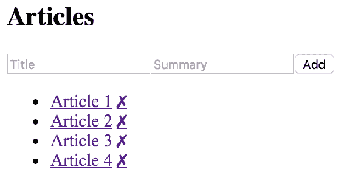
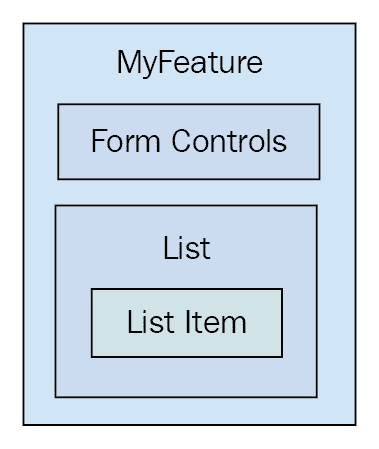
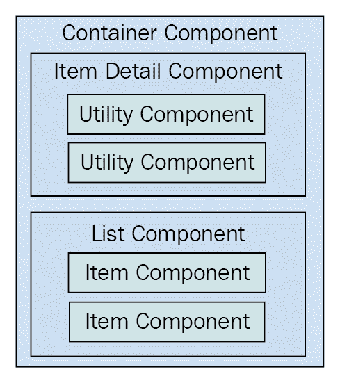

# 第五章：打造可重用的组件

本章的重点是向您展示如何实现不止一种用途的 React 组件。阅读完本章后，您将对如何组合应用程序功能感到自信。

本章以简要介绍 HTML 元素及其在帮助实现功能方面的工作方式开始。然后，您将看到一个单片组件的实现，并发现它将在未来引起的问题。接下来的部分致力于以一种使功能由更小的组件组成的方式重新实现单片组件。

最后，本章以讨论渲染 React 组件树结束，并为您提供一些建议，以避免由于分解组件而引入过多复杂性。我将通过重申高级功能组件与实用组件的概念来结束这一最后部分。

# 可重用的 HTML 元素

让我们思考一下 HTML 元素。根据 HTML 元素的类型，它要么是*以功能为中心*，要么是*以实用为中心*。实用为中心的 HTML 元素比以功能为中心的 HTML 元素更具重用性。例如，考虑`<section>`元素。这是一个通用元素，可以在任何地方使用，但它的主要目的是组成功能的结构方面——功能的外壳和功能的内部部分。这就是`<section>`元素最有用的地方。

另一方面，您还有诸如`<p>`、`<span>`和`<button>`之类的元素。这些元素提供了高度的实用性，因为它们从设计上就是通用的。当用户可以点击时，您应该使用`<button>`元素，从而产生一个动作。这比功能的概念低一个级别。

虽然谈论具有高度实用性的 HTML 元素与针对特定功能的元素很容易，但当涉及*数据*时，讨论就会更加详细。HTML 是静态标记——React 组件将静态标记与数据结合在一起。问题是，如何确保您正在创建正确的以功能为中心和以实用为中心的组件？

本章的目标是找出如何从定义功能的单片 React 组件转变为与实用组件相结合的更小的以功能为中心的组件。

# 单片组件的困难

如果您可以为任何给定功能实现一个组件，那将简化您的工作。至少，就不会有太多需要维护的组件，也不会有太多数据流通的路径，因为一切都将是组件内部的。

然而，这个想法出于许多原因是行不通的。拥有单体功能组件使得协调任何团队开发工作变得困难。单体组件变得越大，以后重构为更好的东西就会变得越困难。

还有功能重叠和功能通信的问题。重叠是因为功能之间的相似之处而发生的——一个应用程序不太可能具有完全彼此独特的一组功能。这将使应用程序非常难以学习和使用。组件通信基本上意味着一个功能中的某些东西的状态将影响另一个功能中的某些东西的状态。状态很难处理，当有很多状态打包到单体组件中时更是如此。

学习如何避免单体组件的最佳方法是亲身体验一个。您将在本节的其余部分中实现一个单体组件。在接下来的部分中，您将看到如何将此组件重构为更可持续的东西。

# JSX 标记

我们要实现的单体组件是一个列出文章的功能。这只是为了举例说明，所以我们不希望组件过大。它将是简单的，但是单体的。用户可以向列表中添加新项目，切换列表中项目的摘要，并从列表中删除项目。这是组件的`render`方法：

```jsx
render() {
 const { articles, title, summary } = this.data.toJS();

  return (
    <section>
      <header>
        <h1>Articles</h1>
        <input
          placeholder="Title"
          value={title}
          onChange={this.onChangeTitle}
        />
        <input
          placeholder="Summary"
          value={summary}
          onChange={this.onChangeSummary}
        />
        <button onClick={this.onClickAdd}>Add</button>
      </header>
      <article>
        <ul>
          {articles.map(i => (
            <li key={i.id}>
              <a
                href={`#${i.id}`}
                title="Toggle Summary"
                onClick={this.onClickToggle.bind(null, i.id)}
              >
                {i.title}
              </a>
              &nbsp;
              <a
                href={`#${i.id}`}
                title="Remove"
                onClick={this.onClickRemove.bind(null, i.id)}
              >
                ✗
              </a>
              <p style={{ display: i.display }}>{i.summary}</p>
            </li>
          ))}
        </ul>
      </article>
    </section>
  );
} 
```

在一个地方使用的 JSX 肯定比必要的要多。您将在接下来的部分中改进这一点，但现在让我们为这个组件实现初始状态。

我强烈建议您从[`github.com/PacktPublishing/React-and-React-Native-Second-Edition`](https://github.com/PacktPublishing/React-and-React-Native-Second-Edition)下载本书的配套代码。我可以拆分组件代码，以便在这些页面上解释它。但是，如果您可以完整地看到代码模块，并运行它们，学习体验会更容易。

# 初始状态和状态助手

现在让我们看看这个组件的初始状态：

```jsx
// The state of this component is consists of
// three properties: a collection of articles,
// a title, and a summary. The "fromJS()" call
// is used to build an "Immutable.js" Map. Also
// note that this isn't set directly as the component
// state - it's in a "data" property of the state -
// otherwise, state updates won't work as expected.
state = {
  data: fromJS({
    articles: [
      {
        id: cuid(),
        title: 'Article 1',
        summary: 'Article 1 Summary',
        display: 'none'
      },
      {
        id: cuid(),
        title: 'Article 2',
        summary: 'Article 2 Summary',
        display: 'none'
      },
      {
        id: cuid(),
        title: 'Article 3',
        summary: 'Article 3 Summary',
        display: 'none'
      },
      {
        id: cuid(),
        title: 'Article 4',
        summary: 'Article 4 Summary',
        display: 'none'
      }
    ],
    title: '',
    summary: ''
  })
}; 
```

有两个有趣的函数用于初始化状态。第一个是来自`cuid`包的`cuid()`——一个用于生成唯一 ID 的有用工具。第二个是来自`immutable`包的`fromJS()`。以下是引入这两个依赖项的导入：

```jsx
// Utility for constructing unique IDs... 
import cuid from 'cuid'; 

// For building immutable component states... 
import { fromJS } from 'immutable'; 
```

正如其名称所示，`fromJS()`函数用于构建不可变的数据结构。`Immutable.js`对于操作 React 组件的状态非常有用的功能。在本书的其余部分，你将继续使用`Immutable.js`，并且随着学习的深入，你将了解更多具体内容，从这个例子开始。

要更深入地了解**Immutable.js**，请查看《精通 Immutable.js》：[`www.packtpub.com/web-development/mastering-immutablejs`](https://www.packtpub.com/web-development/mastering-immutablejs)

你可能还记得上一章中提到的`setState()`方法只能使用普通对象。嗯，`Immutable.js`对象不是普通对象。如果我们想使用不可变数据，就需要将它们包装在一个普通对象中。让我们实现一个帮助器的获取器和设置器：

```jsx
// Getter for "Immutable.js" state data... 
get data() { 
  return this.state.data; 
} 

// Setter for "Immutable.js" state data... 
set data(data) { 
  this.setState({ data }); 
} 
```

现在，你可以在我们的事件处理程序中使用不可变的组件状态。

# 事件处理程序实现

在这一点上，你已经有了初始状态、状态辅助属性和组件的 JSX。现在是时候实现事件处理程序本身了：

```jsx
// When the title of a new article changes, update the state
// of the component with the new title value, by using "set()"
// to create a new map.
onChangeTitle = e => {
  this.data = this.data.set('title', e.target.value);
};

// When the summary of a new article changes, update the state
// of the component with the new summary value, by using "set()"
// to create a new map.
onChangeSummary = e => {
  this.data = this.data.set('summary', e.target.value);
};

// Creates a new article and empties the title
// and summary inputs. The "push()" method creates a new
// list and "update()" is used to update the list by
// creating a new map.
onClickAdd = () => {
  this.data = this.data
    .update('articles', a =>
      a.push(
        fromJS({
          id: cuid(),
          title: this.data.get('title'),
          summary: this.data.get('summary'),
          display: 'none'
        })
      )
    )
    .set('title', '')
    .set('summary', '');
};

// Removes an article from the list. Calling "delete()"
// creates a new list, and this is set in the new component
// state.
onClickRemove = id => {
  const index = this.data
    .get('articles')
    .findIndex(a => a.get('id') === id);

  this.data = this.data.update('articles', a => a.delete(index));
};

// Toggles the visibility of the article summary by
// setting the "display" state of the article. This
// state is dependent on the current state.
onClickToggle = id => {
  const index = this.data
    .get('articles')
    .findIndex(a => a.get('id') === id);

  this.data = this.data.update('articles', articles =>
    articles.update(index, a =>
      a.update('display', display => (display ? '' : 'none'))
    )
  );
};
```

天啊！这是很多`Immutable.js`代码！不用担心，实际上这比使用普通 JavaScript 实现这些转换要少得多。以下是一些指针，帮助你理解这段代码：

+   `setState()`总是以一个普通对象作为其参数调用。这就是为什么我们引入了数据设置器。当你给`this.data`赋一个新值时，它会用一个普通对象调用`setState()`。你只需要关心`Immutable.js`数据。同样，数据获取器返回`Immutable.js`对象而不是整个状态。

+   不可变方法总是返回一个新实例。当你看到像`article.set(...)`这样的东西时，它实际上并没有改变`article`，而是创建了一个新的实例。

+   在`render()`方法中，不可变数据结构被转换回普通的 JavaScript 数组和对象，以便在 JSX 标记中使用。

如果需要，尽管花费你需要的时间来理解这里发生了什么。随着你在书中的进展，你会看到不可变状态可以被 React 组件利用的方式。这些事件处理程序只能改变这个组件的状态。也就是说，它们不会意外地改变其他组件的状态。正如你将在接下来的部分中看到的，这些处理程序实际上已经相当完善了。

这是渲染输出的截图：



# 重构组件结构

你有一个庞大的功能组件，现在怎么办？让我们把它做得更好。

在本节中，你将学习如何将刚刚在前一节中实现的功能组件分割成更易维护的组件。你将从 JSX 开始，因为这可能是最好的重构起点。然后，你将为这个功能实现新的组件。

接下来，你将使这些新组件变成功能性的，而不是基于类的。最后，你将学会如何使用渲染属性来减少应用程序中直接组件的依赖数量。

# 从 JSX 开始

任何庞大组件的 JSX 都是找出如何将其重构为更小组件的最佳起点。让我们来可视化一下我们当前正在重构的组件的结构：



JSX 的顶部部分是表单控件，所以这很容易成为自己的组件：

```jsx
<header> 
  <h1>Articles</h1> 
  <input 
    placeholder="Title" 
    value={title} 
    onChange={this.onChangeTitle} 
  /> 
  <input 
    placeholder="Summary" 
    value={summary} 
    onChange={this.onChangeSummary} 
  /> 
  <button onClick={this.onClickAdd}>Add</button> 
</header> 
```

接下来，你有文章列表：

```jsx
<ul> 
  {articles.map(i => ( 
    <li key={i.id}> 
      <a 
        href="#" 

        onClick={ 
          this.onClickToggle.bind(null, i.id) 
        } 
      > 
        {i.title} 
      </a> 
      &nbsp; 
      <a 
        href="#" 

        onClick={this.onClickRemove.bind(null, i.id)} 
      > 
        ✗
      </a> 
      <p style={{ display: i.display }}> 
        {i.summary} 
      </p> 
    </li> 
  ))} 
</ul> 
```

在这个列表中，有可能有一个文章项目，它将是`<li>`标签中的所有内容。

单单 JSX 就展示了 UI 结构如何可以被分解成更小的 React 组件。没有声明性的 JSX 标记，这种重构练习将会很困难。

# 实现文章列表组件

文章列表组件的实现如下：

```jsx
import React, { Component } from 'react';

export default class ArticleList extends Component {
  render() {
    // The properties include things that are passed in
    // from the feature component. This includes the list
    // of articles to render, and the two event handlers
    // that change state of the feature component.
    const { articles, onClickToggle, onClickRemove } = this.props;

    return (
      <ul>
        {articles.map(article => (
          <li key={article.id}>
            {/* The "onClickToggle()" callback changes
                the state of the "MyFeature" component. */}
            <a
              href={`#${article.id}`}
              title="Toggle Summary"
              onClick={onClickToggle.bind(null, article.id)}
            >
              {article.title}
            </a>
            &nbsp;
            {/* The "onClickRemove()" callback changes
                the state of the "MyFeature" component. */}
            <a
              href={`#${article.id}`}
              title="Remove"
              onClick={onClickRemove.bind(null, article.id)}
            >
              ✗
            </a>
            <p style={{ display: article.display }}>
              {article.summary}
            </p>
          </li>
        ))}
      </ul>
    );
  }
}
```

你只需从庞大的组件中取出相关的 JSX，并放到这里。现在让我们看看功能组件 JSX 是什么样的：

```jsx
render() {
  const { articles, title, summary } = this.data.toJS();

  return (
    <section>
      <header>
        <h1>Articles</h1>
        <input
          placeholder="Title"
          value={title}
          onChange={this.onChangeTitle}
        />
        <input
          placeholder="Summary"
          value={summary}
          onChange={this.onChangeSummary}
        />
        <button onClick={this.onClickAdd}>Add</button>
      </header>

      {/* Now the list of articles is rendered by the
           "ArticleList" component. This component can
           now be used in several other components. */}
      <ArticleList
        articles={articles}
        onClickToggle={this.onClickToggle}
        onClickRemove={this.onClickRemove}
      />
    </section>
  );
} 
```

文章列表现在由`<ArticleList>`组件渲染。要渲染的文章列表作为属性传递给这个组件，以及两个事件处理程序。

等等，为什么我们要将事件处理程序传递给子组件？原因是`ArticleList`组件不需要担心状态或状态如何改变。它只关心呈现内容，并确保适当的事件回调连接到适当的 DOM 元素。这是我稍后在本章中会扩展的*容器组件*概念。

# 实现文章项目组件

在实现文章列表组件之后，您可能会决定进一步拆分此组件，因为该项目可能会在另一页上的另一个列表中呈现。实现文章列表项作为其自己的组件最重要的一点是，我们不知道标记将来会如何改变。

另一种看待它的方式是，如果事实证明我们实际上不需要该项目作为其自己的组件，这个新组件并不会引入太多间接性或复杂性。话不多说，这就是文章项目组件：

```jsx
import React, { Component } from 'react';

export default class ArticleItem extends Component {
  render() {
    // The "article" is mapped from the "ArticleList"
    // component. The "onClickToggle()" and
    // "onClickRemove()" event handlers are passed
    // all the way down from the "MyFeature" component.
    const { article, onClickToggle, onClickRemove } = this.props;

    return (
      <li>
        {/* The "onClickToggle()" callback changes
            the state of the "MyFeature" component. */}
        <a
          href={`#{article.id}`}
          title="Toggle Summary"
          onClick={onClickToggle.bind(null, article.id)}
        >
          {article.title}
        </a>
        &nbsp;
        {/* The "onClickRemove()" callback changes
            the state of the "MyFeature" component. */}
        <a
          href={`#{article.id}`}
          title="Remove"
          onClick={onClickRemove.bind(null, article.id)}
        >
          ✗
        </a>
        <p style={{ display: article.display }}>{article.summary}</p>
      </li>
    );
  }
}

```

这是由`ArticleList`组件呈现的新的`ArticleItem`组件：

```jsx
import React, { Component } from 'react';
import ArticleItem from './ArticleItem';

export default class ArticleList extends Component {
  render() {
    // The properties include things that are passed in
    // from the feature component. This includes the list
    // of articles to render, and the two event handlers
    // that change state of the feature component. These,
    // in turn, are passed to the "ArticleItem" component.
    const { articles, onClickToggle, onClickRemove } = this.props;

    // Now this component maps to an "<ArticleItem>" collection.
    return (
      <ul>
        {articles.map(i => (
          <ArticleItem
            key={i.id}
            article={i}
            onClickToggle={onClickToggle}
            onClickRemove={onClickRemove}
          />
        ))}
      </ul>
    );
  }
}
```

您看到这个列表只是映射了文章列表吗？如果您想要实现另一个还进行一些过滤的文章列表呢？如果是这样，拥有可重用的`ArticleItem`组件是有益的。

# 实现添加文章组件

现在你已经完成了文章列表，是时候考虑用于添加新文章的表单控件了。让我们为这个功能的这一方面实现一个组件：

```jsx
import React, { Component } from 'react';

export default class AddArticle extends Component {
  render() {
    const {
      name,
      title,
      summary,
      onChangeTitle,
      onChangeSummary,
      onClickAdd
    } = this.props;

    return (
      <section>
        <h1>{name}</h1>
        <input
          placeholder="Title"
          value={title}
          onChange={onChangeTitle}
        />
        <input
          placeholder="Summary"
          value={summary}
          onChange={onChangeSummary}
        />
        <button onClick={onClickAdd}>Add</button>
      </section>
    );
  }
}

```

现在，您的功能组件只需要呈现`<AddArticle>`和`<ArticleList>`组件：

```jsx
render() { 
  const {  
    articles,  
    title,  
    summary, 
  } = this.state.data.toJS(); 

  return ( 
    <section> 
      { /* Now the add article form is rendered by the 
           "AddArticle" component. This component can 
           now be used in several other components. */ } 
      <AddArticle 
        name="Articles" 
        title={title} 
        summary={summary} 
        onChangeTitle={this.onChangeTitle} 
        onChangeSummary={this.onChangeSummary} 
        onClickAdd={this.onClickAdd} 
      /> 

      { /* Now the list of articles is rendered by the 
           "ArticleList" component. This component can 
           now be used in several other components. */ } 
      <ArticleList 
        articles={articles} 
        onClickToggle={this.onClickToggle} 
        onClickRemove={this.onClickRemove} 
      /> 
    </section> 
  ); 
} 
```

该组件的重点是功能数据，同时它会推迟到其他组件来呈现 UI 元素。

# 使组件功能化

在实现这些新组件时，您可能已经注意到它们除了使用属性值呈现 JSX 之外没有任何职责。这些组件是*纯函数组件*的良好候选者。每当您遇到仅使用属性值的组件时，最好将它们制作成功能性组件。首先，这明确表明组件不依赖于任何状态或生命周期方法。它还更有效，因为当 React 检测到组件是函数时，它不会执行太多工作。

这是文章列表组件的功能版本：

```jsx
import React from 'react';
import ArticleItem from './ArticleItem';

export default ({ articles, onClickToggle, onClickRemove }) => (
  <ul>
    {articles.map(i => (
      <ArticleItem
        key={i.id}
        article={i}
        onClickToggle={onClickToggle}
        onClickRemove={onClickRemove}
      />
    ))}
  </ul>
);
```

这是文章项目组件的功能版本：

```jsx
import React from 'react';

export default ({ article, onClickToggle, onClickRemove }) => (
  <li>
    {/* The "onClickToggle()" callback changes
         the state of the "MyFeature" component. */}
    <a
      href={`#${article.id}`}
      title="Toggle Summary"
      onClick={onClickToggle.bind(null, article.id)}
    >
      {article.title}
    </a>
    &nbsp;
    {/* The "onClickRemove()" callback changes
         the state of the "MyFeature" component. */}
    <a
      href={`#${article.id}`}
      title="Remove"
      onClick={onClickRemove.bind(null, article.id)}
    >
      ✗
    </a>
    <p style={{ display: article.display }}>{article.summary}</p>
  </li>
);
```

这是添加文章组件的功能版本：

```jsx
import React from 'react';

export default ({
  name,
  title,
  summary,
  onChangeTitle,
  onChangeSummary,
  onClickAdd
}) => (
  <section>
    <h1>{name}</h1>
    <input
      placeholder="Title"
      value={title}
      onChange={onChangeTitle}
    />
    <input
      placeholder="Summary"
      value={summary}
      onChange={onChangeSummary}
    />
    <button onClick={onClickAdd}>Add</button>
  </section>
);
```

使组件变成功能性的另一个好处是，减少了引入不必要方法或其他数据的机会。

# 利用渲染属性

想象一下实现一个由几个较小的组件组成的特性，就像你在本章中一直在做的那样。`MyFeature`组件依赖于`ArticleList`和`AddArticle`。现在想象一下，在应用程序的不同部分使用`MyFeature`，在那里使用不同的`ArticleList`或`AddArticle`的实现是有意义的。根本的挑战是用一个组件替换另一个组件。

渲染属性是解决这一挑战的一种好方法。其思想是，你向组件传递一个属性，其值是一个返回要渲染的组件的函数。这样，你可以根据需要配置子组件，而不是让特性组件直接依赖它们；你可以将它们作为渲染属性值传递进去。

**渲染属性**不是 React 16 的新特性。它是一种技术，其流行程度与 React 16 的发布同时增加。这是一种官方认可的处理依赖和替换问题的方法。你可以在这里阅读更多关于渲染属性的内容：[`reactjs.org/docs/render-props.html`](https://reactjs.org/docs/render-props.html)让我们来看一个例子。不是让`MyFeature`直接依赖于`AddArticle`和`ArticleList`，你可以将它们作为渲染属性传递。当`MyFeature`使用渲染属性来填补`<AddArticle>`和`<ArticleList>`原来的位置时，`MyFeature`的`render()`方法是什么样子的：

```jsx
// Now when <MyFeature> is rendered, it uses render props to
// render <ArticleList> and <AddArticle>. It no longer has
// a direct dependency to these components.
render() {
  const { articles, title, summary } = this.data.toJS();
  const {
    props: { addArticle, articleList },
    onClickAdd,
    onClickToggle,
    onClickRemove,
    onChangeTitle,
    onChangeSummary
  } = this;

  return (
    <section>
      {addArticle({
        title,
        summary,
        onChangeTitle,
        onChangeSummary,
        onClickAdd
      })}
      {articleList({ articles, onClickToggle, onClickRemove })}
    </section>
  );
}
```

`addArticle()`和`articleList()`函数被调用，传递的是与`<AddArticle>`和`<ArticleList>`应该传递的相同的属性值。现在的区别是，这个模块不再将`AddArticle`或`ArticleList`作为依赖导入。

现在让我们来看一下`index.js`，在这里`<MyFeature>`被渲染：

```jsx
// <MyFeature> is now passed a "addArticle" and a "articleList"
// property. These are functions that return components to render.
render(
  <MyFeature
    addArticle={({
      title,
      summary,
      onChangeTitle,
      onChangeSummary,
      onClickAdd
    }) => (
      <AddArticle
        name="Articles"
        title={title}
        summary={summary}
        onChangeTitle={onChangeTitle}
        onChangeSummary={onChangeSummary}
        onClickAdd={onClickAdd}
      />
    )}
    articleList={({ articles, onClickToggle, onClickRemove }) => (
      <ArticleList
        articles={articles}
        onClickToggle={onClickToggle}
        onClickRemove={onClickRemove}
      />
    )}
  />,
  document.getElementById('root')
);
```

这里现在发生的事情比只渲染`<MyFeature>`时要多得多。让我们分解一下为什么会这样。在这里，您传递了`addArticle`和`articleList`渲染属性。这些属性值是从`MyComponent`接受参数值的函数。例如，`onClickToggle()`函数来自`MyFeature`，用于更改该组件的状态。您可以使用渲染属性函数将其传递给将要呈现的组件，以及任何其他值。这些函数的返回值最终被呈现。

# 呈现组件树

让我们花点时间来反思一下在本章中我们已经取得的成就。曾经是单片的功能组件最终几乎完全专注于*状态数据*。它处理了初始状态并处理了状态的转换，如果有的话，它还会处理获取状态的网络请求。这是 React 应用程序中典型的*容器组件*，也是数据的起点。

您实现的新组件，用于更好地组合功能，是这些数据的接收者。这些组件与它们的容器之间的区别在于，它们只关心在它们呈现时传递给它们的属性。换句话说，它们只关心特定时间点的*数据快照*。从这里，这些组件可能将属性数据作为属性传递给它们自己的子组件。组合 React 组件的通用模式如下：



容器组件通常只包含一个直接子组件。在这个图表中，您可以看到容器既有一个项目详细信息组件，也有一个列表组件。当然，这两个类别会有所不同，因为每个应用程序都是不同的。这种通用模式有三个级别的组件组合。数据从容器一直流向实用组件。

一旦添加了超过三层，应用程序架构就变得难以理解。会有偶尔需要添加四层 React 组件的情况，但一般情况下，应该避免这样做。

# 功能组件和实用组件

在庞大的组件示例中，你开始时只有一个完全专注于某个特性的组件。这意味着该组件在应用程序的其他地方几乎没有效用。

这是因为顶层组件处理应用程序状态。**有状态的组件**在任何其他上下文中都很难使用。当你重构庞大的特性组件时，你创建了更远离数据的新组件。一般规则是，你的组件离有状态数据越远，它们的效用就越大，因为它们的属性值可以从应用程序的任何地方传递进来。

# 总结

本章是关于避免庞大的组件设计。然而，在任何 React 组件的设计中，庞大的组件通常是一个必要的起点。

你开始学习不同的 HTML 元素具有不同程度的效用。接下来，你了解了庞大的 React 组件的问题，并演示了如何实现庞大的组件。

然后，你花了几节课学习如何将庞大的组件重构为更可持续的设计。通过这个练习，你学到了容器组件只需要考虑处理状态，而较小的组件具有更多的效用，因为它们的属性值可以从任何地方传递进来。你还学到了可以使用渲染属性更好地控制组件的依赖关系和替换。

在下一章中，你将学习关于 React 组件生命周期。这对于实现容器组件来说是一个特别相关的话题。

# 测试你的知识

1.  为什么应该避免庞大的 React 组件？

1.  因为一旦组件达到一定的大小，整个应用程序的性能就会开始受到影响。

1.  因为它们难以理解，并且难以在以后重构为更小的可重用组件。

1.  你不需要担心避免庞大的组件。

1.  为什么要使组件功能化？

1.  功能组件只依赖于传递给它的属性值。它们不依赖于状态或生命周期方法，这两者都是潜在的问题来源。

1.  功能组件更容易阅读。

1.  不应该使组件功能化，即使它们没有任何状态。

1.  渲染属性如何简化 React 应用程序？

1.  它们减少了你需要为给定组件编写的代码量。

1.  它们不会简化 React 应用程序。

1.  它们减少了组件的直接依赖数量，允许您组合新的行为。

# 更多阅读

点击以下链接获取更多信息：

+   [`reactjs.org/docs/render-props.html`](https://reactjs.org/docs/render-props.html)

+   [`reactjs.org/docs/components-and-props.html#functional-and-class-components`](https://reactjs.org/docs/components-and-props.html#functional-and-class-components)
