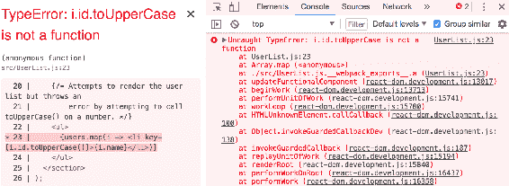

# 第六章：React 组件生命周期

本章的目标是让您了解 React 组件的生命周期以及如何编写响应生命周期事件的代码。您将学习为什么组件首先需要生命周期。然后，您将使用这些方法实现几个初始化其属性和状态的组件。

接下来，您将学习如何通过避免在不必要时进行渲染来优化组件的渲染效率。然后，您将了解如何在 React 组件中封装命令式代码以及在组件卸载时如何进行清理。最后，您将学习如何使用新的 React 16 生命周期方法捕获和处理错误。

# 组件为什么需要生命周期

React 组件经历生命周期。实际上，您在本书中迄今为止在组件中实现的`render()`方法实际上是一个生命周期方法。渲染只是 React 组件中的一个生命周期事件。

例如，当组件挂载到 DOM 时，当组件更新时等都有生命周期事件。生命周期事件是另一个移动部分，因此您希望将其保持最少。正如您将在本章中学到的那样，一些组件确实需要响应生命周期事件以执行初始化、渲染启发式、在组件从 DOM 中卸载时进行清理，或者处理组件抛出的错误。

以下图表让您了解组件如何通过其生命周期流程，依次调用相应的方法：


这是 React 组件的两个主要生命周期流程。第一个发生在组件初始渲染时。第二个发生在组件更新时。以下是每个方法的大致概述：

+   `getDerivedStateFromProps()`: 此方法允许您根据组件的属性值更新组件的状态。当组件首次渲染和接收新的属性值时，将调用此方法。

+   `render()`: 返回组件要渲染的内容。当组件首次挂载到 DOM 时，当它接收新的属性值时以及调用`setState()`时都会调用此方法。

+   `componentDidMount()`: 这在组件挂载到 DOM 后调用。这是您可以执行组件初始化工作的地方，例如获取数据。

+   `shouldComponentUpdate()`: 您可以使用此方法将新状态或属性与当前状态或属性进行比较。然后，如果不需要重新渲染组件，可以返回 false。此方法用于使您的组件更有效。

+   `getSnapshotBeforeUpdate()`: 此方法允许您在实际提交到 DOM 之前直接在组件的 DOM 元素上执行操作。此方法与`render()`的区别在于`getSnapshotBeforeUpdate()`不是异步的。使用`render()`时，调用它和实际在 DOM 中进行更改之间的 DOM 结构可能会发生变化的可能性很大。

+   `componentDidUpdate()`: 当组件更新时调用此方法。您很少需要使用此方法。

此图表中未包括的另一个生命周期方法是`componentWillUnmount()`。这是组件即将被移除时调用的唯一生命周期方法。我们将在本章末尾看到如何使用此方法的示例。在此之前，让我们开始编码。

# 初始化属性和状态

在本节中，您将看到如何在 React 组件中实现初始化代码。这涉及使用在组件首次创建时调用的生命周期方法。首先，您将实现一个基本示例，该示例使用来自 API 的数据设置组件。然后，您将看到如何从属性初始化状态，以及如何在属性更改时更新状态。

# 获取组件数据

当初始化组件时，您将希望填充其状态或属性。否则，组件除了其骨架标记之外将没有任何内容可渲染。例如，假设您想要渲染以下用户列表组件：

```jsx
import React from 'react';
import { Map } from 'immutable';

// This component displays the passed-in "error"
// property as bold text. If it's null, then
// nothing is rendered.
const ErrorMessage = ({ error }) =>
  Map([[null, null]]).get(error, <strong>{error}</strong>);

// This component displays the passed-in "loading"
// property as italic text. If it's null, then
// nothing is rendered.
const LoadingMessage = ({ loading }) =>
  Map([[null, null]]).get(loading, <em>{loading}</em>);

export default ({
  error, 
  loading,
  users
}) => (
  <section>
    {/* Displays any error messages... */}
    <ErrorMessage error={error} />

    {/* Displays any loading messages, while
         waiting for the API... */}
    <LoadingMessage loading={loading} />

    {/* Renders the user list... */}
    <ul>{users.map(i => <li key={i.id}>{i.name}</li>)}</ul>
  </section>
);
```

此 JSX 依赖于三个数据：

+   加载中：在获取 API 数据时显示此消息

+   `error`: 如果出现问题，将显示此消息

+   `users`: 从 API 获取的数据

此处使用了两个辅助组件：`ErrorMessage`和`LoadingMessage`。它们分别用于格式化`error`和`loading`状态。但是，如果`error`或`loading`为 null，您不希望在组件中引入命令式逻辑来处理此情况。这就是为什么您使用`Immutable.js`映射的一个很酷的小技巧：

1.  您创建了一个具有单个**键值对**的映射。键为 null，值也为 null。

1.  您使用`error`或`loading`属性调用`get()`。如果`error`或`loading`属性为 null，则找到键并且不渲染任何内容。

1.  `get()`接受第二个参数，如果找不到键，则返回该参数。这是您传递您的*真值*值并完全避免命令逻辑的地方。这个特定的组件很简单，但是当存在两种以上可能性时，这种技术尤其强大。

您应该如何进行 API 调用并使用响应来填充`users`集合？答案是使用一个容器组件进行 API 调用，然后渲染`UserList`组件：

```jsx
import React, { Component } from 'react';
import { fromJS } from 'immutable';

import { users } from './api';
import UserList from './UserList';

export default class UserListContainer extends Component {
  state = {
    data: fromJS({
      error: null,
      loading: 'loading...',
      users: []
    })
  };

  // Getter for "Immutable.js" state data...
  get data() {
    return this.state.data;
  }

  // Setter for "Immutable.js" state data...
  set data(data) {
    this.setState({ data });
  }

  // When component has been rendered, "componentDidMount()"
  // is called. This is where we should perform asynchronous
  // behavior that will change the state of the component.
  // In this case, we're fetching a list of users from
  // the mock API.
  componentDidMount() {
    users().then(
      result => {
        // Populate the "users" state, but also
        // make sure the "error" and "loading"
        // states are cleared.
        this.data = this.data
          .set('loading', null)
          .set('error', null)
          .set('users', fromJS(result.users));
      },
      error => {
        // When an error occurs, we want to clear
        // the "loading" state and set the "error"
        // state.
        this.data = this.data
          .set('loading', null)
          .set('error', error);
      }
    );
  }

  render() {
    return <UserList {...this.data.toJS()} />;
  }
}
```

让我们来看看`render()`方法。它的工作是渲染`<UserList>`组件，并将`this.state`作为属性传递。实际的 API 调用发生在`componentDidMount()`方法中。此方法在组件挂载到 DOM 后调用。

由于`componentDidMount()`的命名，React 开发人员认为在发出组件数据的请求之前等待组件挂载到 DOM 是不好的。换句话说，如果 React 在发送请求之前必须执行大量工作，用户体验可能会受到影响。实际上，获取数据是一个异步任务，在`render()`之前或之后启动它对您的应用程序来说没有真正的区别。

您可以在这里阅读更多信息：[`reactjs.org/blog/2018/03/27/update-on-async-rendering.html`](https://reactjs.org/blog/2018/03/27/update-on-async-rendering.html)

一旦 API 调用返回数据，`users`集合就会被填充，导致`UserList`重新渲染自身，只是这一次，它有了需要的数据。让我们来看看这里使用的`users()`模拟 API 函数调用：

```jsx
// Returns a promise that's resolved after 2
// seconds. By default, it will resolve an array
// of user data. If the "fail" argument is true,
// the promise is rejected.
export function users(fail) {
  return new Promise((resolve, reject) => {
    setTimeout(() => {
      if (fail) {
        reject('epic fail');
      } else {
        resolve({
          users: [
            { id: 0, name: 'First' },
            { id: 1, name: 'Second' },
            { id: 2, name: 'Third' },
          ],
        });
      }
    }, 2000);
  });
}
```

它返回一个在 2 秒后解析为数组的 promise。Promise 是模拟诸如 API 调用之类的东西的好工具，因为它们使您能够在 React 组件中使用不止 HTTP 调用作为数据源。例如，您可能正在从本地文件中读取数据，或者使用返回解析来自各种来源的数据的库。

当`loading`状态为字符串，`users`状态为空数组时，`UserList`组件渲染如下：


当`loading`为`null`且`users`不为空时，它渲染如下：


我想再次强调`UserListContainer`和`UserList`组件之间的责任分离。因为容器组件处理生命周期管理和实际的 API 通信，你可以创建一个通用的用户列表组件。事实上，它是一个不需要任何状态的功能组件，这意味着你可以在应用程序中的其他容器组件中重用它。

# 使用属性初始化状态

前面的例子向你展示了如何通过在`componentDidMount()`生命周期方法中进行 API 调用来初始化容器组件的状态。然而，组件状态中唯一填充的部分是`users`集合。你可能想填充其他不来自 API 端点的状态部分。

例如，当状态初始化时，`error`和`loading`状态消息已经设置了默认值。这很好，但是如果渲染`UserListContainer`的代码想要使用不同的加载消息怎么办？你可以通过允许属性覆盖默认状态来实现这一点。让我们继续完善`UserListContainer`组件：

```jsx
import React, { Component } from 'react';
import { fromJS } from 'immutable';

import { users } from './api';
import UserList from './UserList';

class UserListContainer extends Component {
  state = {
    data: fromJS({
      error: null,
      users: []
    })
  };

  // Getter for "Immutable.js" state data...
  get data() {
    return this.state.data;
  }

  // Setter for "Immutable.js" state data...
  set data(data) {
    this.setState({ data });
  }

  // When component has been rendered, "componentDidMount()"
  // is called. This is where we should perform asynchronous
  // behavior that will change the state of the component.
  // In this case, we're fetching a list of users from
  // the mock API.
  componentDidMount() {
    users().then(
      result => {
        // Populate the "users" state, but also
        // make sure the "error" and "loading"
        // states are cleared.
        this.data = this.data
          .set('error', null)
          .set('users', fromJS(result.users));
      },
      error => {
        // When an error occurs, we want to clear
        // the "loading" state and set the "error"
        // state.
        this.data = this.data
          .set('loading', null)
          .set('error', error);
      }
    );
  }

  render() {
    return <UserList {...this.data.toJS()} />;
  }

  // Called right before render, you can use this method
  // to update the state of the component based on prop
  // values.
  static getDerivedStateFromProps(props, state) {
    return {
      ...state,
      data: state.data.set(
        'loading',
        state.data.get('users').size === 0 ? props.loading : null
      )
    };
  }
}

UserListContainer.defaultProps = {
  loading: 'loading...'
};

export default UserListContainer;

```

`loading`属性不再具有默认字符串值。相反，`defaultProps`为属性提供默认值。新的生命周期方法是`getDerivedStateFromProps()`。它使用`loading`属性来设置`loading`状态。由于`loading`属性有一个默认值，所以只需改变状态是安全的。该方法在组件挂载之前和组件的后续重新渲染时被调用。

这个方法是静态的，因为在 React 16 中有内部变化。预期这个方法的行为像一个纯函数，没有副作用。如果这个方法是一个实例方法，你将可以访问组件上下文，并且副作用将很常见。

使用这种新的 React 16 方法的挑战在于它在初始渲染和后续重新渲染时都会被调用。在 React 16 之前，你可以使用`componentWillMount()`方法来运行只在初始渲染之前运行的代码。在这个例子中，你必须检查`users`集合中是否有值，然后再将`loading`状态设置为 null - 你不知道这是初始渲染还是第 40 次渲染。

现在让我们看看如何将状态数据传递给`UserListContainer`：

```jsx
import React from 'react';
import { render } from 'react-dom';

import UserListContainer from './UserListContainer';

// Renders the component with a "loading" property.
// This value ultimately ends up in the component state.
render(
  <UserListContainer loading="playing the waiting game..." />,
  document.getElementById('root')
);

```

当首次渲染`UserList`时，初始加载消息是什么样子的：


仅仅因为组件有状态并不意味着你不能进行定制。接下来，你将学习这个概念的一个变种——使用属性更新组件状态。

# 使用属性更新状态

你已经看到了`componentDidMount()`和`getDerivedStateFromProps()`生命周期方法如何帮助你的组件获取所需的数据。还有一个情景你需要考虑——重新渲染组件容器。

让我们来看一个简单的`button`组件，它会跟踪被点击的次数：

```jsx
import React from 'react';

export default ({
  clicks,
  disabled,
  text,
  onClick
}) => (
  <section>
    {/* Renders the number of button clicks,
         using the "clicks" property. */}
    <p>{clicks} clicks</p>

    {/* Renders the button. It's disabled state
         is based on the "disabled" property, and
         the "onClick()" handler comes from the
         container component. */}
    <button disabled={disabled} onClick={onClick}>
      {text}
    </button>
  </section>
);

```

现在，让我们为这个功能实现一个容器组件：

```jsx
import React, { Component } from 'react';
import { fromJS } from 'immutable';

import MyButton from './MyButton';

class MyFeature extends Component {
  state = {
    data: fromJS({
      clicks: 0,
      disabled: false,
      text: ''
    })
  };

  // Getter for "Immutable.js" state data...
  get data() {
    return this.state.data;
  }

  // Setter for "Immutable.js" state data...
  set data(data) {
    this.setState({ data });
  }

  // Click event handler, increments the "click" count.
  onClick = () => {
    this.data = this.data.update('clicks', c => c + 1);
  };

  // Renders the "<MyButton>" component, passing it the
  // "onClick()" handler, and the state as properties.
  render() {
    return <MyButton onClick={this.onClick} {...this.data.toJS()} />;
  }

  // If the component is re-rendered with new
  // property values, this method is called with the
  // new property values. If the "disabled" property
  // is provided, we use it to update the "disabled"
  // state. Calling "setState()" here will not
  // cause a re-render, because the component is already
  // in the middle of a re-render.
  static getDerivedStateFromProps({ disabled, text }, state) {
    return {
      ...state,
      data: state.data.set('disabled', disabled).set('text', text)
    };
  }
}

MyFeature.defaultProps = {
  text: 'A Button'
};

export default MyFeature;

```

与前面的例子相同的方法在这里也被使用。`getDerivedStateFromProps()`方法在每次渲染之前被调用，这是你可以使用属性值来确定组件状态是否应该更新的地方。让我们看看如何重新渲染这个组件以及状态是否如预期般行为：

```jsx
import React from 'react';
import { render as renderJSX } from 'react-dom';

import MyFeature from './MyFeature';

// Determines the state of the button
// element in "MyFeature".
let disabled = true;

function render() {
  // Toggle the state of the "disabled" property.
  disabled = !disabled;

  renderJSX(
    <MyFeature {...{ disabled }} />,
    document.getElementById('root')
  );
}

// Re-render the "<MyFeature>" component every
// 3 seconds, toggling the "disabled" button
// property.
setInterval(render, 3000);

render();

```

果然，一切都按计划进行。每当按钮被点击时，点击计数器都会更新。`<MyFeature>`每 3 秒重新渲染一次，切换按钮的`disabled`状态。当按钮重新启用并且点击恢复时，计数器会从上次停止的地方继续。

这是`MyButton`组件在首次渲染时的样子：


这是在点击了几次后，按钮进入禁用状态后的样子：


# 优化渲染效率

接下来你要学习的下一个生命周期方法用于实现改进组件渲染性能的启发式。你会发现，如果组件的状态没有改变，那么就没有必要进行渲染。然后，你将实现一个组件，该组件使用来自 API 的特定元数据来确定是否需要重新渲染组件。

# 渲染还是不渲染

`shouldComponentUpdate()`生命周期方法用于确定当被要求渲染时组件是否会进行渲染。例如，如果实现了这个方法，并返回 false，那么组件的整个生命周期都会被中断，不会进行渲染。如果组件渲染了大量数据并且经常重新渲染，这个检查就非常重要。关键是要知道组件状态是否已经改变。

这就是不可变数据的美妙之处——你可以轻松地检查它是否发生了变化。如果你正在使用`Immutable.js`等库来控制组件的状态，这一点尤为真实。让我们看一个简单的列表组件：

```jsx
import React, { Component } from 'react';
import { fromJS } from 'immutable';

export default class MyList extends Component {
  state = {
    data: fromJS({
      items: [...Array(5000).keys()]
    })
  };

  // Getter for "Immutable.js" state data...
  get data() {
    return this.state.data;
  }

  // Setter for "Immutable.js" state data...
  set data(data) {
    this.setState({ data });
  }

  // If this method returns false, the component
  // will not render. Since we're using an Immutable.js
  // data structure, we simply need to check for equality.
  // If "state.data" is the same, then there's no need to
  // render because nothing has changed since the last render.
  shouldComponentUpdate(props, state) {
    return this.data !== state.data;
  }

  // Renders the complete list of items, even if it's huge.
  render() {
    const items = this.data.get('items');

    return <ul>{items.map(i => <li key={i}>{i}</li>)}</ul>;
  }
}

```

`items`状态初始化为一个包含 5000 个项目的`Immutable.js` `List`。这是一个相当大的集合，所以你不希望 React 内部的虚拟 DOM 不断地对比这个列表。虚拟 DOM 在它所做的事情上是高效的，但远不及能执行简单的渲染检查的代码高效。你在这里实现的`shouldComponentRender()`方法正是这样做的。它比较新状态和当前状态；如果它们是相同的对象，完全绕过虚拟 DOM。

现在，让我们让这个组件开始工作，看看你能获得什么样的效率提升：

```jsx
import React from 'react';
import { render as renderJSX } from 'react-dom';

import MyList from './MyList';

// Renders the "<MyList>" component. Then, it sets
// the state of the component by changing the value
// of the first "items" element. However, the value
// didn't actually change, so the same Immutable.js
// structure is reused. This means that
// "shouldComponentUpdate()" will return false.
function render() {
  const myList = renderJSX(
    <MyList />,
    document.getElementById('root')
  );

  // Not actually changing the value of the first
  // "items" element. So, Immutable.js recognizes
  // that nothing changed, and instead of
  // returning a new object, it returns the same
  // "myList.data" reference.
  myList.data = myList.data.setIn(['items', 0], 0);
}

// Instead of performing 500,000 DOM operations,
// "shouldComponentUpdate()" turns this into
// 5000 DOM operations.
for (let i = 0; i < 100; i++) {
  render();
}

```

你正在循环渲染`<MyList>`。每次迭代都有 5000 个列表项要渲染。由于状态没有改变，`shouldComponentUpdate()`的调用在每次迭代中都返回`false`。出于性能原因，这很重要，因为迭代次数很多。在真实应用中，你不会有代码在紧密循环中重新渲染组件。这段代码旨在测试 React 的渲染能力。如果你注释掉`shouldComponentUpdate()`方法，你就会明白我的意思。这个组件的性能概况如下：


初始渲染时间最长——几百毫秒。但接下来有很多微小的时间片段，对用户体验完全不可感知。这些是`shouldComponentUpdate()`返回 false 的结果。现在让我们注释掉这个方法，看看这个概况会如何改变：


没有`shouldComponentUpdate()`，最终结果是更长的时间片段，对用户体验有极大的负面影响。

你可能注意到，我们实际上是使用`Immutable.js`的`setIn()`来改变状态。这应该会导致状态改变，对吧？实际上，这将返回相同的`Immutable.js`实例，原因很简单，我们设置的值与当前值相同：`0`。当没有发生改变时，`Immutable.js`方法返回相同的对象，因为它没有发生变化。

# 使用元数据优化渲染

在本节中，你将学习如何使用 API 响应的元数据来确定组件是否应该重新渲染自己。这里是一个简单的用户详情组件：

```jsx
import React, { Component } from 'react';

export default class MyUser extends Component {
  state = {
    modified: new Date(),
    first: 'First',
    last: 'Last'
  };

  // The "modified" property is used to determine
  // whether or not the component should render.
  shouldComponentUpdate(props, state) {
    return Number(state).modified > Number(this.state.modified);
  }

  render() {
    const { modified, first, last } = this.state;

    return (
      <section>
        <p>{modified.toLocaleString()}</p>
        <p>{first}</p>
        <p>{last}</p>
      </section>
    );
  }
}
```

`shouldComponentUpdate()`方法正在比较新的`modified`状态和旧的`modified`状态。这段代码假设`modified`值是一个反映 API 返回的数据实际修改时间的日期。这种方法的主要缺点是`shouldComponentUpdate()`方法现在与 API 数据紧密耦合。优点是，你可以像使用不可变数据一样获得性能提升。

这就是这个启发式方法的实际效果：

```jsx
import React from 'react';
import { render } from 'react-dom';

import MyUser from './MyUser';

// Performs the initial rendering of "<MyUser>".
const myUser = render(<MyUser />, document.getElementById('root'));

// Sets the state, with a new "modified" value.
// Since the modified state has changed, the
// component will re-render.
myUser.setState({
  modified: new Date(),
  first: 'First1',
  last: 'Last1'
});

// The "first" and "last" states have changed,
// but the "modified" state has not. This means
// that the "First2" and "Last2" values will
// not be rendered.
myUser.setState({
  first: 'First2',
  last: 'Last2'
});
```

`MyUser`组件现在完全依赖于`modified`状态。如果它不大于先前的`modified`值，就不会发生渲染。

在渲染两次后，组件的外观如下：

在这个例子中，我没有使用不可变状态数据。在本书中，我将使用普通的 JavaScript 对象作为简单示例的状态。`Immutable.js`是这项工作的好工具，所以我会经常使用它。与此同时，我想明确指出`Immutable.js`并不需要在每种情况下都使用。

# 渲染命令式组件

到目前为止，在本书中，你渲染的所有内容都是直接的声明式 HTML。生活从来都不是那么简单：有时你的 React 组件需要在底层实现一些命令式的代码。

这就是关键——隐藏命令式操作，使渲染组件的代码不必触及它。在本节中，你将实现一个简单的 jQuery UI 按钮 React 组件，以便你可以看到相关的生命周期方法如何帮助你封装命令式代码。

# 渲染 jQuery UI 小部件

jQuery UI 小部件库在标准 HTML 之上实现了几个小部件。它使用渐进增强技术，在支持新功能的浏览器中增强基本 HTML。为了使这些小部件工作，你首先需要以某种方式将 HTML 渲染到 DOM 中；然后，进行命令式函数调用来创建和与小部件交互。

在这个例子中，你将创建一个 React 按钮组件，作为 jQuery UI 小部件的包装器。使用 React 组件的人不需要知道，在幕后，它正在进行命令式调用来控制小部件。让我们看看按钮组件的样子：

```jsx
import React, { Component } from 'react';

// Import all the jQuery UI widget stuff...
import $ from 'jquery';
import 'jquery-ui/ui/widgets/button';
import 'jquery-ui/themes/base/all.css';

export default class MyButton extends Component {
  // When the component is mounted, we need to
  // call "button()" to initialize the widget.
  componentDidMount() {
    $(this.button).button(this.props);
  }

  // After the component updates, we need to use
  // "this.props" to update the options of the
  // jQuery UI button widget.
  componentDidUpdate() {
    $(this.button).button('option', this.props);
  }

  // Renders the "<button>" HTML element. The "onClick()"
  // handler will always be a assigned, even if it's a
  // noop function. The "ref" property is used to assign
  // "this.button". This is the DOM element itself, and
  // it's needed by the "componentDidMount()" and
  // "componentDidUpdate()" methods.
  render() {
    return (
      <button
        onClick={this.props.onClick}
        ref={button => {
          this.button = button;
        }}
      />
    );
  }
}

```

jQuery UI 按钮小部件期望`<button>`元素，因此组件呈现为此。还分配了来自组件属性的`onClick()`处理程序。这里还使用了`ref`属性，它将`button`参数分配给`this.button`。这样做的原因是，组件可以直接访问组件的底层 DOM 元素。通常，组件不需要访问任何 DOM 元素，但在这里，您需要向元素发出命令。

例如，在`componentDidMount()`方法中，调用了`button()`函数，并将其属性传递给组件。`componentDidUpdate()`方法执行类似的操作，当属性值更改时调用。现在，让我们看一下按钮容器组件：

```jsx
import React, { Component } from 'react';
import { fromJS } from 'immutable';

import MyButton from './MyButton';

class MyButtonContainer extends Component {
  // The initial state is an empty Immutable map, because
  // by default, we won't pass anything to the jQuery UI
  // button widget.
  state = {
    data: fromJS({})
  };

  // Getter for "Immutable.js" state data...
  get data() {
    return this.state.data;
  }

  // Setter for "Immutable.js" state data...
  set data(data) {
    this.setState({ data });
  }

  // When the component is mounted for the first time,
  // we have to bind the "onClick()" handler to "this"
  // so that the handler can set the state.
  componentDidMount() {
    this.data = this.data.merge(this.props, {
      onClick: this.props.onClick.bind(this)
    });
  }

  // Renders the "<MyButton>" component with this
  // component's state as properties.
  render() {
    return <MyButton {...this.state.data.toJS()} />;
  }
}

// By default, the "onClick()" handler is a noop.
// This makes it easier because we can always assign
// the event handler to the "<button>".
MyButtonContainer.defaultProps = {
  onClick: () => {}
};

export default MyButtonContainer;

```

您有一个控制状态的容器组件，然后将其作为属性传递给`<MyButton>`。

`{...data}`语法称为 JSX 扩展属性。这允许您将对象作为属性传递给元素。您可以在此处阅读更多关于此功能的信息。

该组件具有默认的`onClick()`处理函数。但是，您可以将不同的点击处理程序作为属性传递。此外，它会自动绑定到组件上下文，如果处理程序需要更改按钮状态，则这很有用。让我们看一个例子：

```jsx
import React from 'react';
import { render } from 'react-dom';

import MyButtonContainer from './MyButtonContainer';

// Simple button event handler that changes the
// "disabled" state when clicked.
function onClick() {
  this.data = this.data.set('disabled', true);
}

render(
  <section>
    {/* A simple button with a simple label. */}
    <MyButtonContainer label="Text" />

    {/* A button with an icon, and a hidden label. */}
    <MyButtonContainer
      label="My Button"
      icon="ui-icon-person"
      showLabel={false}
    />

    {/* A button with a click event handler. */}
    <MyButtonContainer label="Disable Me" onClick={onClick} />
  </section>,
  document.getElementById('root')
);

```

在这里，您有三个 jQuery UI 按钮小部件，每个都由一个 React 组件控制，看不到任何命令式代码。按钮的外观如下：


# 在组件之后进行清理

在这一部分，您将学习如何在组件之后进行清理。您不必显式地从 DOM 中卸载组件-React 会为您处理。有一些 React 不知道的东西，因此在组件被移除后无法为您清理。

正是为了这些清理任务，`componentWillUnmount()`生命周期方法存在。清理 React 组件之后的一个用例是异步代码。

例如，想象一个组件，在组件首次挂载时发出 API 调用以获取一些数据。现在，想象一下，在 API 响应到达之前，该组件从 DOM 中移除。

# 清理异步调用

如果您的异步代码尝试设置已卸载的组件的状态，将不会发生任何事情。会记录一个警告，并且状态不会被设置。记录这个警告实际上非常重要；否则，您将很难解决微妙的竞争条件错误。

正确的方法是创建可取消的异步操作。这是你在本章前面实现的`users()` API 函数的修改版本：

```jsx
// Adapted from:
// https://facebook.github.io/react/blog/2015/12/16/ismounted-antipattern.html
function cancellable(promise) {
  let cancelled = false;

  // Creates a wrapper promise to return. This wrapper is
  // resolved or rejected based on the wrapped promise, and
  // on the "cancelled" value.
  const promiseWrapper = new Promise((resolve, reject) => {
    promise.then(
      value => {
        return cancelled ? reject({ cancelled: true }) : resolve(value);
      },
      error => {
        return cancelled
          ? reject({ cancelled: true })
          : reject(error);
      }
    );
  });

  // Adds a "cancel()" method to the promise, for
  // use by the React component in "componentWillUnmount()".
  promiseWrapper.cancel = function cancel() {
    cancelled = true;
  };

  return promiseWrapper;
}

export function users(fail) {
  // Make sure that the returned promise is "cancellable", by
  // wrapping it with "cancellable()".
  return cancellable(
    new Promise((resolve, reject) => {
      setTimeout(() => {
        if (fail) {
          reject(fail);
        } else {
          resolve({
            users: [
              { id: 0, name: 'First' },
              { id: 1, name: 'Second' },
              { id: 2, name: 'Third' }
            ]
          });
        }
      }, 4000);
    })
  );
}
```

关键是`cancellable()`函数，它用新的 promise 包装了一个 promise。新的 promise 有一个`cancel()`方法，如果调用则拒绝 promise。它不会改变 promise 同步的实际异步行为。然而，它确实为在 React 组件中使用提供了一个通用和一致的接口。

现在让我们看一个具有取消异步行为能力的容器组件：

```jsx
import React, { Component } from 'react';
import { fromJS } from 'immutable';
import { render } from 'react-dom';

import { users } from './api';
import UserList from './UserList';

// When the "cancel" link is clicked, we want to render
// a new element in "#app". This will unmount the
// "<UserListContainer>" component.
const onClickCancel = e => {
  e.preventDefault();

  render(<p>Cancelled</p>, document.getElementById('root'));
};

export default class UserListContainer extends Component {
  state = {
    data: fromJS({
      error: null,
      loading: 'loading...',
      users: []
    })
  };

  // Getter for "Immutable.js" state data...
  get data() {
    return this.state.data;
  }

  // Setter for "Immutable.js" state data...
  set data(data) {
    this.setState({ data });
  }

  componentDidMount() {
    // We have to store a reference to any async promises,
    // so that we can cancel them later when the component
    // is unmounted.
    this.job = users();

    this.job.then(
      result => {
        this.data = this.data
          .set('loading', null)
          .set('error', null)
          .set('users', fromJS(result.users));
      },

      // The "job" promise is rejected when it's cancelled.
      // This means that we need to check for the "cancelled"
      // property, because if it's true, this is normal
      // behavior.
      error => {
        if (!error.cancelled) {
          this.data = this.data
            .set('loading', null)
            .set('error', error);
        }
      }
    );
  }

  // This method is called right before the component
  // is unmounted. It is here, that we want to make sure
  // that any asynchronous behavior is cleaned up so that
  // it doesn't try to interact with an unmounted component.
  componentWillUnmount() {
    this.job.cancel();
  }

  render() {
    return (
      <UserList onClickCancel={onClickCancel} {...this.data.toJS()} />
    );
  }
}
```

`onClickCancel()`处理程序实际上替换了用户列表。这调用了`componentWillUnmount()`方法，在那里您可以取消`this.job`。值得注意的是，当在`componentDidMount()`中进行 API 调用时，会在组件中存储对 promise 的引用。否则，您将无法取消异步调用。

在进行挂起的 API 调用期间呈现组件时，组件的样子如下：


# 使用错误边界包含错误

React 16 的一个新功能——**错误边界**——允许您处理意外的组件失败。与其让应用程序的每个组件都知道如何处理可能遇到的任何错误，**错误边界**是一个机制，您可以使用它来包装具有错误处理行为的组件。最好将错误边界视为 JSX 的`try`/`catch`语法。

让我们重新访问本章中的第一个示例，其中您使用 API 函数获取了组件数据。`users()`函数接受一个布尔参数，当为 true 时，会导致 promise 被拒绝。这是您想要处理的事情，但不一定是在进行 API 调用的组件中。实际上，`UserListContainer`和`UserList`组件已经设置好了处理这样的 API 错误。挑战在于，如果有很多组件，这将是大量的错误处理代码。此外，错误处理是特定于一个 API 调用的——如果其他地方出了问题怎么办？

以下是您可以用于此示例的`UserListContainer`的修改后源代码：

```jsx
import React, { Component } from 'react';
import { fromJS } from 'immutable';

import { users } from './api';
import UserList from './UserList';

export default class UserListContainer extends Component {
  state = {
    data: fromJS({
      error: null,
      loading: 'loading...',
      users: []
    })
  };

  // Getter for "Immutable.js" state data...
  get data() {
    return this.state.data;
  }

  // Setter for "Immutable.js" state data...
  set data(data) {
    this.setState({ data });
  }

  // When component has been rendered, "componentDidMount()"
  // is called. This is where we should perform asynchronous
  // behavior that will change the state of the component.
  // In this case, we're fetching a list of users from
  // the mock API.
  componentDidMount() {
    users(true).then(
      result => {
        // Populate the "users" state, but also
        // make sure the "error" and "loading"
        // states are cleared.
        this.data = this.data
          .set('loading', null)
          .set('error', null)
          .set('users', fromJS(result.users));
      },
      error => {
        // When an error occurs, we want to clear
        // the "loading" state and set the "error"
        // state.
        this.data = this.data
          .set('loading', null)
          .set('error', error);
      }
    );
  }

  render() {
    // If the error state has a string value in it, it
    // means that something went wrong during the asynchronous
    // data fetching for this component. You can just throw an
    // error using this string instead of rendering.
    if (this.data.get('error') !== null) {
      throw new Error(this.data.get('error'));
    }
    return <UserList {...this.data.toJS()} />;
  }
}
```

这个组件大部分与第一个示例中的相同。第一个区别是对`users()`的调用，现在它传递了 true：

```jsx
componentDidMount() {
  users(true).then(
    ...
```

这个调用将失败，导致错误状态被设置。第二个区别在于`render()`方法：

```jsx
if (this.data.get('error') !== null) {
  throw new Error(this.data.get('error'));
}
```

它不是将错误状态转发到`UserList`组件，而是通过抛出错误而不是尝试渲染更多组件将错误传递回组件树。这里的关键设计变化是，该组件现在假设在组件树的更高位置有某种错误边界，将相应地处理这些错误。

您可能想知道为什么错误在渲染时抛出，而不是在`componentDidMount()`中拒绝承诺时抛出。问题在于像这样异步获取数据意味着 React 内部实际上无法捕获从异步承诺处理程序中抛出的异常。对于可能导致组件失败的异步操作，最简单的解决方案是将错误存储在组件状态中，但如果存在错误，则在实际渲染任何内容之前抛出错误。

现在让我们创建错误边界本身：

```jsx
import React, { Component } from 'react';

// A basic error boundary used to display error messages.
export default class ErrorBoundary extends Component {
  state = {
    error: null
  };

  // This lifecycle method is only called if a component
  // lower in the tree than this component throws an error.
  // You can handle the error however you like in this method,
  // including setting it as a state value so that it can be used
  // for rendering.
  componentDidCatch(error) {
    this.setState({ error });
  }

  // If there's no error, you can just render the boundary's
  // children as usual. If there's an error, you can render
  // the error message while ignoring the child components.
  render() {
    if (this.state.error === null) {
      return this.props.children;
    } else {
      return <strong>{this.state.error.toString()}</strong>;
    }
  }
}
```

这就是`componentDidCatch()`生命周期方法的用法，当它捕获到错误时，设置该组件的错误状态。当渲染时，如果设置了`error`状态，则渲染错误消息。否则，像往常一样渲染子组件。

以下是如何使用这个`ErrorBoundary`组件：

```jsx
import React from 'react';
import { render } from 'react-dom';

import ErrorBoundary from './ErrorBoundary';
import UserListContainer from './UserListContainer';

// The <ErrorBoundary> component can wrap any component you need.
// You can also create different error boundary components that
// render errors differently.
render(
  <ErrorBoundary>
    <UserListContainer />
  </ErrorBoundary>,
  document.getElementById('root')
);
```

`UserListContainer`或其任何子级抛出的任何错误都将被`ErrorBoundary`捕获和处理：


现在，您可以删除传递给`UserListContainer`中的`users()`的参数，以阻止其失败。在`UserList`组件中，假设您有一个错误，尝试在数字上调用`toUpperCase()`：

```jsx
import React from 'react';
import { Map } from 'immutable';

// This component displays the passed-in "loading"
// property as italic text. If it's null, then
// nothing is rendered.
const LoadingMessage = ({ loading }) =>
  Map([[null, null]]).get(loading, <em>{loading}</em>);

export default ({
  error, // eslint-disable-line react/prop-types
  loading, // eslint-disable-line react/prop-types
  users // eslint-disable-line react/prop-types
}) => (
  <section>
    {/* Displays any loading messages, while
         waiting for the API... */}
    <LoadingMessage loading={loading} />

    {/* Attempts to render the user list but throws an
        error by attempting to call toUpperCase() on a number. */}
    <ul>
      {users.map(i => <li key={i.id.toUpperCase()}>{i.name}</li>)}
    </ul>
  </section>
);
```

您将获得不同的错误抛出，但由于它位于与先前错误相同的边界下，它将以相同的方式处理：

如果您使用`create-react-app`和`react-scripts`运行项目，您可能会注意到应用程序中的每个错误都会有一个错误叠加层，即使这些错误已被错误边界处理。如果您使用右上角的**x**关闭叠加层，您可以看到您的组件如何处理应用程序中的错误。

# 总结

在本章中，您学到了很多关于 React 组件生命周期的知识。我们首先讨论了为什么 React 组件首先需要生命周期。原来 React 不能自动完成所有工作，所以我们需要编写一些代码，在组件生命周期的适当时间运行。

接下来，您实现了几个组件，它们能够从 JSX 属性中获取初始数据并初始化它们的状态。然后，您学会了通过提供`shouldComponentRender()`方法来实现更高效的 React 组件。

您学会了如何隐藏一些组件需要实现的命令式代码，以及如何在异步行为之后进行清理。最后，您学会了如何使用 React 16 的新错误边界功能。

在接下来的章节中，您将学习一些技术，以确保您的组件被传递了正确的属性。

# 测试您的知识

1.  `render()`是一个生命周期方法吗？

1.  是的，`render()`与任何其他生命周期方法没有区别。

1.  不，`render()`只是用来获取组件的内容。

1.  以下哪项是`componentWillUnmount()`方法的有效用法？

1.  删除组件添加的 DOM 元素。

1.  取消组件卸载时将失败的异步操作。

1.  组件即将卸载时记录日志。

1.  哪个生命周期方法被错误边界组件使用？

1.  `componentDidCatch()`

1.  `componentWillCatch()`

1.  `componentError()`

# 进一步阅读

您可以访问以下链接获取更多信息：

+   [`reactjs.org/docs/react-component.html`](https://reactjs.org/docs/react-component.html)

+   [`reactjs.org/docs/state-and-lifecycle.html`](https://reactjs.org/docs/state-and-lifecycle.html)
