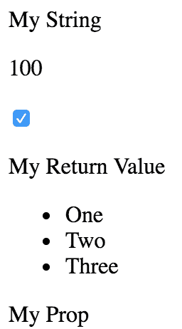
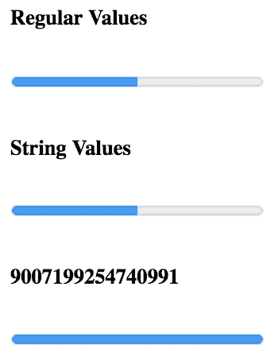
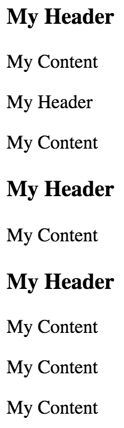
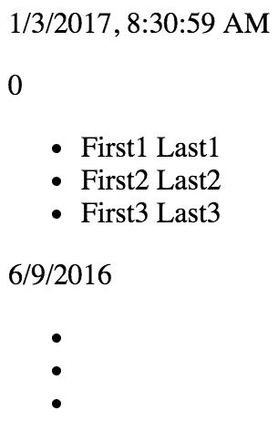
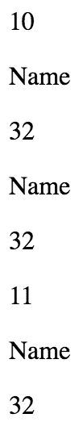
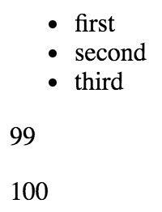

# 第七章：验证组件属性

在本章中，你将学习关于 React 组件中的属性验证。乍一看，这可能看起来很简单，但这是一个重要的主题，因为它可以使组件无 bug。我将从讨论**可预测的结果**开始，以及如何使组件在整个应用程序中具有可移植性。

接下来，你将通过一些 React 自带的类型检查属性验证器的示例进行学习。然后，你将学习一些更复杂的属性验证场景。最后，我将用一个示例来结束本章，展示如何实现自定义验证器。

# 了解预期结果

在 React 组件中的**属性验证**就像 HTML 表单中的字段验证。验证表单字段的基本原则是让用户知道他们提供了一个不可接受的值。理想情况下，验证错误消息应该清晰明了，以便用户可以轻松地解决问题。通过 React 组件属性验证，你正在做同样的事情——让意外值的情况变得容易修复。属性验证增强了开发人员的体验，而不是用户体验。

属性验证的关键方面是了解作为属性值传递到组件的内容。例如，如果你期望一个数组，而实际传递了一个布尔值，可能会出现问题。如果你使用`prop-types` React 验证包来验证属性值，那么你就知道传递了一些意外的内容。如果组件期望一个数组以便调用`map()`方法，如果传递了布尔值，它将失败，因为布尔值没有`map()`方法。然而，在这种失败发生之前，你会看到属性验证警告。

这并不是要通过属性验证来**快速失败**，而是为开发人员提供信息。当属性验证失败时，你知道作为组件属性提供了一些不应该有的内容。这是要找到代码中传递值的位置并修复它的问题。

快速失败是软件架构的一个特性，系统会完全崩溃，而不是继续以不一致的状态运行。

# 推广可移植组件

当您知道组件属性可以期望什么时，组件使用的上下文变得不那么重要。这意味着只要组件能够验证其属性值，组件在哪里使用实际上并不重要；它可以轻松地被任何功能使用。

如果您想要一个通用组件，可以跨应用程序功能进行移植，您可以编写组件验证代码，也可以编写在渲染时运行的**防御性代码**。编程防御性的挑战在于它削弱了声明式 React 组件的价值。使用 React 风格的属性验证，您可以避免编写防御性代码。相反，属性验证机制在某些情况下会发出警告，通知您需要修复某些问题。

防御性代码是在生产环境中需要考虑许多边缘情况的代码。在开发过程中无法检测到潜在问题时，例如 React 组件属性验证，编写防御性代码是必要的。

# 简单属性验证器

在本节中，您将学习如何使用`prop-types`包中提供的简单属性类型验证器。然后，您将学习如何接受任何属性值，以及如何将属性**必需**而不是**可选**。

# 基本类型验证

让我们来看看处理 JavaScript 值最基本类型的验证器。您将经常使用这些验证器，因为您想知道一个属性是字符串还是函数，例如。这个例子还将介绍您在组件上设置验证所涉及的机制。这是组件；它只是使用基本标记呈现一些属性：

```jsx
import React from 'react';
import PropTypes from 'prop-types';

const MyComponent = ({
  myString,
  myNumber,
  myBool,
  myFunc,
  myArray,
  myObject
}) => (
  <section>
    {/* Strings and numbers can be rendered
         just about anywhere. */}
    <p>{myString}</p>
    <p>{myNumber}</p>

    {/* Booleans are typically used as property values. */}
    <p>
      <input type="checkbox" defaultChecked={myBool} />
    </p>

    {/* Functions can return values, or be assigned as
         event handler property values. */}
    <p>{myFunc()}</p>

    {/* Arrays are typically mapped to produce new JSX elements. */}
    <ul>{myArray.map(i => <li key={i}>{i}</li>)}</ul>

    {/* Objects typically use their properties in some way. */}
    <p>{myObject.myProp}</p>
  </section>
);

// The "propTypes" specification for this component.
MyComponent.propTypes = {
  myString: PropTypes.string,
  myNumber: PropTypes.number,
  myBool: PropTypes.bool,
  myFunc: PropTypes.func,
  myArray: PropTypes.array,
  myObject: PropTypes.object
};

export default MyComponent;

```

属性验证机制有两个关键部分。首先，您有静态的`propTypes`属性。这是一个类级别的属性，而不是实例属性。当 React 找到`propTypes`时，它将使用此对象作为组件的属性规范。其次，您有来自`prop-types`包的`PropTypes`对象，其中包含几个内置的验证器函数。

`PropTypes`对象曾经是内置在 React 中的。它从 React 核心中分离出来，并移动到`prop-types`包中，因此成为了一个可选择使用的内容 - 这是 React 开发人员的一个请求，他们不使用属性验证。

在这个例子中，`MyComponent`有六个属性，每个属性都有自己的类型。当您查看`propTypes`规范时，可以看到这个组件将接受什么类型的值。让我们使用一些属性值来渲染这个组件：

```jsx
import React from 'react';
import { render as renderJSX } from 'react-dom';

import MyComponent from './MyComponent';

// The properties that we'll pass to the component.
// Each property is a different type, and corresponds
// to the "propTypes" spec of the component.
const validProps = {
  myString: 'My String',
  myNumber: 100,
  myBool: true,
  myFunc: () => 'My Return Value',
  myArray: ['One', 'Two', 'Three'],
  myObject: { myProp: 'My Prop' }
};

// These properties don't correspond to the "<MyComponent>"
// spec, and will cause warnings to be logged.
const invalidProps = {
  myString: 100,
  myNumber: 'My String',
  myBool: () => 'My Reaturn Value',
  myFunc: true,
  myArray: { myProp: 'My Prop' },
  myObject: ['One', 'Two', 'Three']
};

// Renders "<MyComponent>" with the given "props".
function render(props) {
  renderJSX(
    <MyComponent {...props} />,
    document.getElementById('root')
  );
}

render(validProps);
render(invalidProps);

```

第一次渲染`<MyComponent>`时，它使用`validProps`属性。这些值都符合组件属性规范，因此控制台中不会记录任何警告。第二次，使用`invalidProps`属性，这将导致属性验证失败，因为每个属性中都使用了错误的类型。控制台输出应该类似于以下内容：

```jsx
Invalid prop `myString` of type `number` supplied to `MyComponent`, expected `string` 
Invalid prop `myNumber` of type `string` supplied to `MyComponent`, expected `number` 
Invalid prop `myBool` of type `function` supplied to `MyComponent`, expected `boolean` 
Invalid prop `myFunc` of type `boolean` supplied to `MyComponent`, expected `function` 
Invalid prop `myArray` of type `object` supplied to `MyComponent`, expected `array` 
Invalid prop `myObject` of type `array` supplied to `MyComponent`, expected `object` 
TypeError: myFunc is not a function 
```

最后一个错误很有趣。您可以清楚地看到属性验证正在抱怨无效的属性类型。这包括传递给`myFunc`的无效函数。因此，尽管在属性上进行了类型检查，但组件仍会尝试调用该值，就好像它是一个函数一样。

渲染输出如下所示：

再次强调，React 组件中属性验证的目的是帮助您在开发过程中发现错误。当 React 处于生产模式时，属性验证将完全关闭。这意味着您不必担心编写昂贵的属性验证代码；它永远不会在生产中运行。但是错误仍然会发生，所以要修复它。

# 要求值

让我们对前面的示例进行一些调整。组件属性规范需要特定类型的值，但只有在将属性作为 JSX 属性传递给组件时才会进行检查。例如，您可以完全省略`myFunc`属性，它也会通过验证。幸运的是，`PropTypes`函数有一个工具，让您可以指定必须提供属性并且必须具有特定类型。以下是修改后的组件：

```jsx
import React from 'react';
import PropTypes from 'prop-types';

const MyComponent = ({
  myString,
  myNumber,
  myBool,
  myFunc,
  myArray,
  myObject
}) => (
  <section>
    <p>{myString}</p>
    <p>{myNumber}</p>
    <p>
      <input type="checkbox" defaultChecked={myBool} />
    </p>
    <p>{myFunc()}</p>
    <ul>{myArray.map(i => <li key={i}>{i}</li>)}</ul>
    <p>{myObject.myProp}</p>
  </section>
);

// The "propTypes" specification for this component. Every
// property is required, because they each have the
// "isRequired" property.
MyComponent.propTypes = {
  myString: PropTypes.string.isRequired,
  myNumber: PropTypes.number.isRequired,
  myBool: PropTypes.bool.isRequired,
  myFunc: PropTypes.func.isRequired,
  myArray: PropTypes.array.isRequired,
  myObject: PropTypes.object.isRequired
};

export default MyComponent; 
```

这个组件和前面部分实现的组件之间没有太多变化。主要区别在于`propTypes`中的规格。`isRequired`值被附加到每个使用的类型验证器上。因此，例如，`string.isRequired`表示属性值必须是字符串，并且属性不能为空。现在让我们测试一下这个组件：

```jsx
import React from 'react';
import { render as renderJSX } from 'react-dom';

import MyComponent from './MyComponent';

const validProps = {
  myString: 'My String',
  myNumber: 100,
  myBool: true,
  myFunc: () => 'My Return Value',
  myArray: ['One', 'Two', 'Three'],
  myObject: { myProp: 'My Prop' }
};

// The same as "validProps", except it's missing
// the "myObject" property. This will trigger a
// warning.
const missingProp = {
  myString: 'My String',
  myNumber: 100,
  myBool: true,
  myFunc: () => 'My Return Value',
  myArray: ['One', 'Two', 'Three']
};

// Renders "<MyComponent>" with the given "props".
function render(props) {
  renderJSX(
    <MyComponent {...props} />,
    document.getElementById('root')
  );
}

render(validProps);
render(missingProp);

```

第一次渲染时，组件使用了所有正确的属性类型。第二次渲染时，组件没有使用 `myObject` 属性。控制台错误应该如下：

```jsx
Required prop `myObject` was not specified in `MyComponent`. 
Cannot read property 'myProp' of undefined 
```

由于属性规范和后续对 `myObject` 的错误消息，很明显需要为 `myObject` 属性提供一个对象值。最后一个错误是因为组件假设存在一个具有 `myProp` 作为属性的对象。

理想情况下，在这个例子中，你应该验证 `myProp` 对象属性，因为它直接用在 JSX 中。在 JSX 标记中使用的特定属性可以验证对象的形状，正如你将在本章后面看到的那样。

# 任何属性值

本节的最后一个主题是 `any` 属性验证器。也就是说，它实际上并不关心它得到什么值——任何值都是有效的，包括根本不传递值。事实上，`isRequired` 验证器可以与 `any` 验证器结合使用。例如，如果你正在开发一个组件，你只想确保传递了某些东西，但还不确定你将需要哪种类型，你可以做类似这样的事情：`myProp: PropTypes.any.isRequired`。

拥有 `any` 属性验证器的另一个原因是为了一致性。每个组件都应该有属性规范。在开始时，`any` 验证器是有用的，当你不确定属性类型时。你至少可以开始属性规范，然后随着事情的展开逐渐完善它。

现在让我们来看一些代码：

```jsx
import React from 'react';
import PropTypes from 'prop-types';

// Renders a component with a header and a simple
// progress bar, using the provided property
// values.
const MyComponent = ({ label, value, max }) => (
  <section>
    <h5>{label}</h5>
    <progress {...{ max, value }} />
  </section>
);

// These property values can be anything, as denoted by
// the "PropTypes.any" prop type.
MyComponent.propTypes = {
  label: PropTypes.any,
  value: PropTypes.any,
  max: PropTypes.any
};

export default MyComponent;
```

这个组件实际上并不验证任何东西，因为它的属性规范中的三个属性将接受任何东西。然而，这是一个很好的起点，因为乍一看，我就可以看到这个组件使用的三个属性的名称。所以以后，当我决定这些属性应该具有哪些类型时，更改是简单的。现在让我们看看这个组件的实际效果：

```jsx
import React from 'react';
import { render } from 'react-dom';

import MyComponent from './MyComponent';

render(
  <section>
    {/* Passes a string and two numbers to
         "<MyComponent>". Everything works as
         expected. */}
    <MyComponent label="Regular Values" max={20} value={10} />

    {/* Passes strings instead of numbers to the
         progress bar, but they're correctly
         interpreted as numbers. */}
    <MyComponent label="String Values" max="20" value="10" />

    {/* The "label" has no issue displaying
         "MAX_SAFE_INTEGER", but the date that's
         passed to "max" causes the progress bar
         to break. */}
    <MyComponent
      label={Number.MAX_SAFE_INTEGER}
      max={new Date()}
      value="10"
    />
  </section>,
  document.getElementById('root')
);
```

字符串和数字在几个地方是可以互换的。只允许其中一个似乎过于限制了。正如你将在下一节中看到的，React 还有其他属性验证器，允许你进一步限制组件允许的属性值。

我们的组件在渲染时是这样的：



# 类型和值验证器

在这一部分，你将学习 React `prop-types`包中更高级的验证功能。首先，你将学习检查可以在 HTML 标记内渲染的值的元素和节点验证器。然后，你将看到如何检查特定类型，超出了你刚刚学到的原始类型检查。最后，你将实现寻找特定值的验证。

# 可以渲染的东西

有时，你只想确保属性值是可以由 JSX 标记渲染的东西。例如，如果属性值是一组普通对象，这不能通过将其放在`{}`中来渲染。你必须将数组项映射到 JSX 元素。

这种检查特别有用，如果你的组件将属性值传递给其他元素作为子元素。让我们看一个例子，看看这是什么样子的：

```jsx
import React from 'react';
import PropTypes from 'prop-types';

const MyComponent = ({ myHeader, myContent }) => (
  <section>
    <header>{myHeader}</header>
    <main>{myContent}</main>
  </section>
);

// The "myHeader" property requires a React
// element. The "myContent" property requires
// a node that can be rendered. This includes
// React elements, but also strings.
MyComponent.propTypes = {
  myHeader: PropTypes.element.isRequired,
  myContent: PropTypes.node.isRequired
};

export default MyComponent;
```

这个组件有两个属性，需要渲染数值。`myHeader`属性需要一个`element`，可以是任何 JSX 元素。`myContent`属性需要一个`node`，可以是任何 JSX 元素或任何字符串值。让我们给这个组件传递一些值并渲染它：

```jsx
import React from 'react';
import { render } from 'react-dom';

import MyComponent from './MyComponent';

// Two React elements we'll use to pass to
// "<MyComponent>" as property values.
const myHeader = <h1>My Header</h1>;
const myContent = <p>My Content</p>;

render(
  <section>
    {/* Renders as expected, both properties are passed
         React elements as values. */}
    <MyComponent {...{ myHeader, myContent }} />

    {/* Triggers a warning because "myHeader" is expecting
         a React element instead of a string. */}
    <MyComponent myHeader="My Header" {...{ myContent }} />

    {/* Renders as expected. A string is a valid type for
         the "myContent" property. */}
    <MyComponent {...{ myHeader }} myContent="My Content" />

    {/* Renders as expected. An array of React elements
         is a valid type for the "myContent" property. */}
    <MyComponent
      {...{ myHeader }}
      myContent={[myContent, myContent, myContent]}
    />
  </section>,
  document.getElementById('root')
);
```

`myHeader`属性对其接受的值更加严格。`myContent`属性将接受一个字符串、一个元素或一个元素数组。当从属性中传递子数据时，这两个验证器非常重要，就像这个组件所做的那样。例如，尝试将一个普通对象或函数作为子元素传递将不起作用，最好使用验证器检查这种情况。

当渲染时，这个组件看起来是这样的：



# 需要特定类型

有时，你需要一个属性验证器，检查你的应用程序定义的类型。例如，假设你有以下用户类：

```jsx
import cuid from 'cuid';

// Simple class the exposes an API that the
// React component expects.
export default class MyUser {
  constructor(first, last) {
    this.id = cuid();
    this.first = first;
    this.last = last;
  }

  get name() {
    return `${this.first} ${this.last}`;
  }
}
```

现在，假设你有一个组件想要使用这个类的实例作为属性值。你需要一个验证器来检查属性值是否是`MyUser`的实例。让我们实现一个做到这一点的组件：

```jsx
import React from 'react';
import PropTypes from 'prop-types';

import MyUser from './MyUser';

const MyComponent = ({ myDate, myCount, myUsers }) => (
  <section>
    {/* Requires a specific "Date" method. */}
    <p>{myDate.toLocaleString()}</p>

    {/* Number or string works here. */}
    <p>{myCount}</p>
    <ul>
      {/* "myUsers" is expected to be an array of
           "MyUser" instances. So we know that it's
           safe to use the "id" and "name" property. */}
      {myUsers.map(i => <li key={i.id}>{i.name}</li>)}
    </ul>
  </section>
);

// The properties spec is looking for an instance of
// "Date", a choice between a string or a number, and
// an array filled with specific types.
MyComponent.propTypes = {
  myDate: PropTypes.instanceOf(Date),
  myCount: PropTypes.oneOfType([PropTypes.string, PropTypes.number]),
  myUsers: PropTypes.arrayOf(PropTypes.instanceOf(MyUser))
};

export default MyComponent; 
```

这个组件有三个需要特定类型的属性，每一个都超出了本章中到目前为止所见的基本类型验证器。让我们现在逐步了解这些：

+   `myDate`需要一个`Date`的实例。它使用`instanceOf()`函数来构建一个验证函数，确保值是`Date`的实例。

+   `myCount` 要求值要么是一个数字，要么是一个字符串。这个验证器函数是通过结合 `oneOfType`、`PropTypes.number()` 和 `PropTypes.string()` 创建的。

+   `myUsers` 需要一个 `MyUser` 实例的数组。这个验证器是通过结合 `arrayOf()` 和 `instanceOf()` 构建的。

这个例子说明了通过结合 React 提供的属性验证器可以处理的场景数量。渲染输出如下：



# 需要特定的值

到目前为止，我专注于验证属性值的类型，但这并不总是你想要检查的。有时候，特定的值很重要。让我们看看如何验证特定的属性值：

```jsx
import React from 'react';
import PropTypes from 'prop-types';

// Any one of these is a valid "level"
// property value.
const levels = new Array(10).fill(null).map((v, i) => i + 1);

// This is the "shape" of the object we expect
// to find in the "user" property value.
const userShape = {
  name: PropTypes.string,
  age: PropTypes.number
};

const MyComponent = ({ level, user }) => (
  <section>
    <p>{level}</p>
    <p>{user.name}</p>
    <p>{user.age}</p>
  </section>
);

// The property spec for this component uses
// "oneOf()" and "shape()" to define the required
// property values.
MyComponent.propTypes = {
  level: PropTypes.oneOf(levels),
  user: PropTypes.shape(userShape)
};

export default MyComponent; 
```

`level` 属性预期是来自 `levels` 数组的数字。这很容易使用 `oneOf()` 函数进行验证。`user` 属性预期一个特定的形状。形状是对象的预期属性和类型。在这个例子中定义的 `userShape` 需要一个 `name` 字符串和一个 `age` 数字。`shape()` 和 `instanceOf()` 之间的关键区别是你不一定关心类型。你可能只关心组件 JSX 中使用的值。

让我们看看这个组件是如何使用的：

```jsx
import React from 'react';
import { render } from 'react-dom';

import MyComponent from './MyComponent';

render(
  <section>
    {/* Works as expected. */}
    <MyComponent level={10} user={{ name: 'Name', age: 32 }} />

    {/* Works as expected, the "online"
         property is ignored. */}
    <MyComponent user={{ name: 'Name', age: 32, online: false }} />

    {/* Fails. The "level" value is out of range,
         and the "age" property is expecting a
         number, not a string. */}
    <MyComponent level={11} user={{ name: 'Name', age: '32' }} />
  </section>,
  document.getElementById('root')
);
```

组件渲染时的样子如下：



# 编写自定义属性验证器

在这最后一节中，你将学习如何构建自己的自定义属性验证函数，并将它们应用在属性规范中。一般来说，只有在绝对必要的情况下才应该实现自己的属性验证器。`prop-types` 中提供的默认验证器涵盖了广泛的场景。

然而，有时候，你需要确保非常特定的属性值被传递给组件。记住，这些不会在生产模式下运行，所以验证器函数迭代集合是完全可以接受的。现在让我们实现一些自定义验证器函数：

```jsx
import React from 'react';

const MyComponent = ({ myArray, myNumber }) => (
  <section>
    <ul>{myArray.map(i => <li key={i}>{i}</li>)}</ul>
    <p>{myNumber}</p>
  </section>
);

MyComponent.propTypes = {
  // Expects a property named "myArray" with a non-zero
  // length. If this passes, we return null. Otherwise,
  // we return a new error.
  myArray: (props, name, component) =>
    Array.isArray(props[name]) && props[name].length
      ? null
      : new Error(`${component}.${name}: expecting non-empty array`),

  // Expects a property named "myNumber" that's
  // greater than 0 and less than 99\. Otherwise,
  // we return a new error.
  myNumber: (props, name, component) =>
    Number.isFinite(props[name]) &&
    props[name] > 0 &&
    props[name] < 100
      ? null
      : new Error(
          `${component}.${name}: expecting number between 1 and 99`
        )
};

export default MyComponent;

```

`myArray` 属性预期一个非空数组，`myNumber` 属性预期一个大于 `0` 且小于 `100` 的数字。让我们尝试传递一些数据给这些验证器：

```jsx
import React from 'react';
import { render } from 'react-dom';

import MyComponent from './MyComponent';

render(
  <section>
    {/* Renders as expected... */}
    <MyComponent
      myArray={['first', 'second', 'third']}
      myNumber={99}
    />

    {/* Both custom validators fail... */}
    <MyComponent myArray={[]} myNumber={100} />
  </section>,
  document.getElementById('root')
);
```

第一个元素渲染得很好，因为这两个验证器都返回 null。然而，空数组和数字 `100` 导致这两个验证器都返回错误：

```jsx
MyComponent.myArray: expecting non-empty array 
MyComponent.myNumber: expecting number between 1 and 99 
```

渲染输出如下：



# 摘要

本章的重点是 React 组件属性验证。当您实施属性验证时，您知道可以期望什么；这有助于可移植性。组件不关心属性值是如何传递给它的，只要它们是有效的即可。

然后，您将使用基本的 React 验证器来处理几个示例，这些验证器检查原始 JavaScript 类型。您还了解到，如果属性是必需的，必须明确指出。接下来，您将学习如何通过组合 React 提供的内置验证器来验证更复杂的属性值。

最后，您将实现自己的自定义验证器函数，以执行超出`prop-types`验证器可能的验证。在下一章中，您将学习如何通过新数据和行为扩展 React 组件。

# 测试您的知识

1.  以下是描述`prop-types`包的最佳描述之一？

1.  用于编译 React 组件的强类型 JavaScript 实用程序。

1.  用于在开发过程中验证传递给组件的 prop 值的工具。

1.  用于在生产环境中验证传递给组件的 prop 值的工具。

1.  如何验证属性值是否可以呈现？

1.  如果它具有`toString()`函数，则足以呈现它。

1.  使用**`PropTypes.node`**验证器。

1.  使用`PropTypes.renderable`验证器。

1.  PropTypes.shape 验证器的目的是什么？

1.  确保对象具有特定类型的特定属性，忽略任何其他属性。

1.  确保作为 prop 传递的对象是特定类的对象。

1.  确保对象具有特定的属性名称。

# 进一步阅读

+   [`reactjs.org/docs/typechecking-with-proptypes.html`](https://reactjs.org/docs/typechecking-with-proptypes.html)
