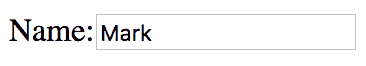
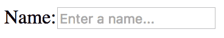
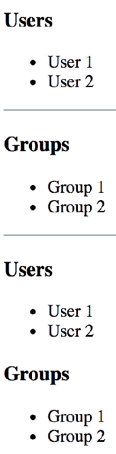
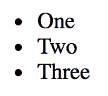
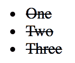
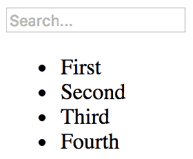

# 第八章：扩展组件

在本章中，您将学习如何通过扩展现有组件来添加新的功能。有两种 React 机制可以用来扩展组件：

+   组件继承

+   使用高阶组件进行组合

您将首先学习基本组件继承，就像面向对象的类继承一样。然后，您将实现一些用于组合 React 组件的高阶组件。

# 组件继承

组件就是类。事实上，当您使用 **ES2015** 类语法实现组件时，您会从 React 扩展基类 `Component`。您可以继续像这样扩展您的类，以创建自己的基本组件。

在本节中，您将看到您的组件可以继承状态、属性，以及几乎任何其他东西，包括 JSX 标记和事件处理程序。

# 继承状态

有时，您有几个使用相同初始状态的 React 组件。您可以实现一个设置此初始状态的基本组件。然后，想要使用此作为其初始状态的任何组件都可以扩展此组件。让我们实现一个设置一些基本状态的基本组件：

```jsx
import { Component } from 'react';
import { fromJS } from 'immutable';

export default class BaseComponent extends Component {
  state = {
    data: fromJS({
      name: 'Mark',
      enabled: false,
      placeholder: ''
    })
  };

  // Getter for "Immutable.js" state data...
  get data() {
    return this.state.data;
  }

  // Setter for "Immutable.js" state data...
  set data(data) {
    this.setState({ data });
  }

  // The base component doesn't actually render anything,
  // but it still needs a render method.
  render() {
    return null;
  }
}
```

状态是不可变的 `Map`。这个基本组件还实现了不可变数据的设置和获取方法。让我们实现一个扩展了这个组件的组件：

```jsx
import React from 'react';
import BaseComponent from './BaseComponent';

// Extends "BaseComponent" to inherit the
// initial component state.
export default class MyComponent extends BaseComponent {
  // This is our chance to build on the initial state.
  // We change the "placeholder" text and mark it as
  // "enabled".
  componentDidMount() {
    this.data = this.data.merge({
      placeholder: 'Enter a name...',
      enabled: true
    });
  }

  // Used to set the name state whenever the input
  // value changes.
  onChange = ({ target: { value } }) => {
    this.data = this.data.set('name', value);
  };

  // Renders a simple input element, that uses the
  // state of this component as properties.
  render() {
    const { enabled, name, placeholder } = this.data.toJS();

    return (
      <label htmlFor="my-input">
        Name:
        <input
          type="text"
          id="my-input"
          disabled={!enabled}
          placeholder={placeholder}
          value={name}
          onChange={this.onChange}
        />
      </label>
    );
  }
}
```

这个组件实际上不需要设置任何初始状态，因为它已经被 `BaseComponent` 设置了。由于状态已经是不可变的 `Map`，您可以在 `componentDidMount()` 中使用 `merge()` 调整初始状态。渲染输出如下所示：



如果您删除输入元素中的默认文本，您会发现 `MyComponent` 添加到初始状态的占位文本会如预期般应用：



您还可以将文本更改为其他内容，`onChange()` 事件处理程序将相应地设置 `name` 状态。

# 继承属性

通过将默认属性值和属性类型定义为基类的静态属性，来实现属性继承。从这个基类继承的任何类也会继承属性值和属性规范。让我们来看一个基类的实现：

```jsx
import { Component } from 'react';
import PropTypes from 'prop-types';

export default class BaseComponent extends Component {
  // The specifiction for these base properties.
  static propTypes = {
    users: PropTypes.array.isRequired,
    groups: PropTypes.array.isRequired
  };

  // The default values of these base properties.
  static defaultProps = {
    users: [],
    groups: []
  };

  render() {
    return null;
  }
} 
```

这个类本身实际上并没有做任何事情。定义它的唯一原因是为了声明默认的属性值和它们的类型约束的地方。分别是`defaultProps`和`propTypes`静态类属性。

现在，让我们看一个继承这些属性的组件：

```jsx
import React from 'react';
import { Map } from 'immutable';

import BaseComponent from './BaseComponent';

// Renders the given "text" as a header, unless
// the given "length" is 0.
const SectionHeader = ({ text, length }) =>
  Map([[0, null]]).get(length, <h1>{text}>/h1>);

export default class MyComponent extends BaseComponent {
  render() {
    const { users, groups } = this.props;

    // Renders the "users" and "groups" arrays. There
    // are not property validators or default values
    // in this component, since these are declared in
    // "BaseComponent".
    return (
      <section>
        <SectionHeader text="Users" length={users.length} />
        <ul>{users.map(i => <li key={i}>{i}</li>)}</ul>

        <SectionHeader text="Groups" length={groups.length} />
        <ul>{groups.map(i => <li key={i}>{i}</li>)}</ul>
      </section>
    );
  }
}
```

让我们尝试渲染`MyComponent`以确保继承的属性按预期工作：

```jsx
import React from 'react';
import { render } from 'react-dom';

import ErrorBoundary from './ErrorBoundary';
import MyComponent from './MyComponent';

const users = ['User 1', 'User 2'];

const groups = ['Group 1', 'Group 2'];

render(
  <section>
    {/* Renders as expected, using the defaults. */}
    <ErrorBoundary>
      <MyComponent />
    </ErrorBoundary>

    {/* Renders as expected, using the "groups" default. */}
    <ErrorBoundary>
      <MyComponent users={users} />
      <hr />
    </ErrorBoundary>

    {/* Renders as expected, using the "users" default. */}
    <ErrorBoundary>
      <MyComponent groups={groups} />
      <hr />
    </ErrorBoundary>

    {/* Renders as expected, providing property values. */}
    <ErrorBoundary>
      <MyComponent users={users} groups={groups} />
    </ErrorBoundary>

    {/* Fails to render, the property validators in the base
         component detect the invalid number type. */}
    <ErrorBoundary>
      <MyComponent users={0} groups={0} />
    </ErrorBoundary>
  </section>,
  document.getElementById('root')
);

```

尽管`MyComponent`没有定义任何属性默认值或类型，但你会得到预期的行为。当你尝试将数字传递给`users`和`groups`属性时，你不会看到任何渲染。这是因为`MyComponent`期望这些属性值上有一个“map（）”方法，而实际上并没有。

这里使用`ErrorBoundary`元素来隔离错误。如果没有它们，任何`MyComponent`元素失败都会导致页面上的其他组件也失败，例如，通过将数字值传递给用户和组。下面是`ErrorBoundary`组件的样子：

```jsx
import { Component } from 'react';

// Uses the componentDidCatch() method to set the
// error state of this component. When rendering,
// if there's an error it gets logged and nothing
// is rendered.
export default class ErrorBoundary extends Component {
  state = { error: null };

  componentDidCatch(error) {
    this.setState({ error });
  }

  render() {
    if (this.state.error === null) {
      return this.props.children;
    } else {
      console.error(this.state.error);
      return null;
    }
  }
}
```

这个组件使用了你在第六章中学到的“componentDidCatch（）”生命周期方法。如果捕获到错误，它会设置错误状态，以便“render（）”方法知道不再渲染导致错误的组件。下面是渲染的内容：



# 继承 JSX 和事件处理程序

在本节中，你将学习如何继承 JSX 和事件处理程序。如果你有一个单一的 UI 组件，它具有相同的 UI 元素和事件处理逻辑，但在组件使用的位置上初始状态有所不同，那么你可能想使用这种方法。

例如，一个基类会定义 JSX 和事件处理程序方法，而更具体的组件会定义特定于功能的初始状态。下面是一个基类的例子：

```jsx
import React, { Component } from 'react';
import { fromJS } from 'immutable';

export default class BaseComponent extends Component {
  state = {
    data: fromJS({
      items: []
    })
  };

  // Getter for "Immutable.js" state data...
  get data() {
    return this.state.data;
  }

  // Setter for "Immutable.js" state data...
  set data(data) {
    this.setState({ data });
  }

  // The click event handler for each item in the
  // list. The context is the lexically-bound to
  // this component.
  onClick = id => () => {
    this.data = this.data.update('items', items =>
      items.update(
        items.indexOf(items.find(i => i.get('id') === id)),
        item => item.update('done', d => !d)
      )
    );
  };

  // Renders a list of items based on the state
  // of the component. The style of the item
  // depends on the "done" property of the item.
  // Each item is assigned an event handler that
  // toggles the "done" state.
  render() {
    const { items } = this.data.toJS();

    return (
      <ul>
        {items.map(i => (
          <li
            key={i.id}
            onClick={this.onClick(i.id)}
            style={{
              cursor: 'pointer',
              textDecoration: i.done ? 'line-through' : 'none'
            }}
          >
            {i.name}
          </li>
        ))}
      </ul>
    );
  }
} 
```

这个基础组件渲染一个项目列表，当点击时，切换项目文本的样式。默认情况下，这个组件的状态有一个空的项目列表。这意味着可以安全地渲染这个组件，而不设置组件状态。然而，这并不是很有用，所以让我们通过继承基础组件并设置状态来给这个列表添加一些项目：

```jsx
import BaseComponent from './BaseComponent';

export default class MyComponent extends BaseComponent {
  // Initializes the component state, by using the
  // "data" getter method from "BaseComponent".
  componentDidMount() {
    this.data = this.data.merge({
      items: [
        { id: 1, name: 'One', done: false },
        { id: 2, name: 'Two', done: false },
        { id: 3, name: 'Three', done: false }
      ]
    });
  }
} 
```

`componentDidMount()`生命周期方法可以安全地设置组件的状态。基本组件使用您的`data`设置器/获取器来改变组件的状态。这种方法的另一个方便之处是，如果您想要覆盖基本组件的事件处理程序之一，您可以在`MyComponent`中定义该方法。

渲染时，列表的样子如下：



当所有项目都被点击时，列表的样子如下：



# 使用高阶组件进行组合

在本节中，您将了解**高阶组件**。如果您熟悉函数式编程中的高阶函数，高阶组件的工作方式是相同的。**高阶函数**是一个以另一个函数作为输入的函数，并返回一个新函数作为输出。返回的函数以某种方式调用原始函数。其思想是通过现有行为组合新行为。

使用高阶 React 组件，您有一个以组件作为输入的函数，并返回一个新组件作为输出。这是在 React 应用程序中组合新行为的首选方式，而且似乎许多流行的 React 库正在朝着这个方向发展，如果它们还没有的话。通过这种方式组合功能时，您会获得更多的灵活性。

# 条件组件渲染

高阶组件的一个用例是条件渲染。例如，根据谓词的结果，渲染组件或不渲染任何内容。谓词可以是特定于应用程序的任何内容，比如权限或类似的东西。

假设您有以下组件：

```jsx
import React from 'react';

// The world's simplest component...
export default () => <p>My component...</p>; 
```

现在，要控制此组件的显示，您可以用另一个组件包装它。包装由高阶函数处理。

如果在 React 的上下文中听到“包装器”这个术语，它可能指的是高阶组件。基本上，它的作用是包装您传递给它的组件。

现在，让我们创建一个高阶 React 组件：

```jsx
import React from 'react';

// A minimal higher-order function is all it
// takes to create a component repeater. Here, we're
// returning a function that calls "predicate()".
// If this returns true, then the rendered
// "<Component>" is returned.
export default (Component, predicate) => props =>
  predicate() && <Component {...props} />; 
```

这个函数的两个参数是`Component`，即您要包装的组件，和要调用的`predicate`。如果对`predicate()`的调用返回`true`，那么将返回`<Component>`。否则，将不会渲染任何内容。

现在，让我们实际使用这个函数来组合一个新的组件，以及渲染一个段落文本的组件：

```jsx
import React from 'react';
import { render } from 'react-dom';

import cond from './cond';
import MyComponent from './MyComponent';

// Two compositions of "MyComponent". The
// "ComposedVisible" version will render
// because the predicate returns true. The
// "ComposedHidden" version doesn't render.
const ComposedVisible = cond(MyComponent, () => true);
const ComposedHidden = cond(MyComponent, () => false);

render(
  <section>
    <h1>Visible</h1>
    <ComposedVisible />
    <h2>Hidden</h2>
    <ComposedHidden />
  </section>,
  document.getElementById('root')
); 
```

您刚刚使用`MyComponent`、`cond()`和`predicate`函数创建了两个新组件。这是渲染输出：


# 提供数据源

让我们通过查看一个更复杂的高阶组件示例来完成本章。您将实现一个数据存储函数，用数据源包装给定的组件。了解这种模式很有用，因为它被 React 库（如**Redux**）使用。这是用于包装组件的`connect()`函数：

```jsx
import React, { Component } from 'react';
import { fromJS } from 'immutable';

// The components that are connected to this store.
let components = fromJS([]);

// The state store itself, where application data is kept.
let store = fromJS({});

// Sets the state of the store, then sets the
// state of every connected component.
export function setState(state) {
  store = state;

  for (const component of components) {
    component.setState({
      data: store
    });
  }
}

// Returns the state of the store.
export function getState() {
  return store;
}

// Returns a higher-order component that's connected
// to the "store".
export function connect(ComposedComponent) {
  return class ConnectedComponent extends Component {
    state = { data: store };

    // When the component is mounted, add it to "components",
    // so that it will receive updates when the store state
    // changes.
    componentDidMount() {
      components = components.push(this);
    }

    // Deletes this component from "components" when it is
    // unmounted from the DOM.
    componentWillUnmount() {
      const index = components.findIndex(this);
      components = components.delete(index);
    }

    // Renders "ComposedComponent", using the "store" state
    // as properties.
    render() {
      return <ComposedComponent {...this.state.data.toJS()} />;
    }
  };
} 
```

这个模块定义了两个内部不可变对象：`components`和`store`。`components`列表保存了监听`store`变化的组件的引用。`store`代表整个应用程序状态。

存储的概念源自**Flux**，这是一组用于构建大规模 React 应用程序的架构模式。我将在本书中介绍 Flux 的想法，但 Flux 远远超出了本书的范围。

这个模块的重要部分是导出的函数：`setState()`，`getState()`和`connect()`。`getState()`函数简单地返回对数据存储的引用。`setState()`函数设置存储的状态，然后通知所有组件应用程序的状态已更改。`connect()`函数是一个高阶函数，用一个新的组件包装给定的组件。当组件被挂载时，它会在存储中注册自己，以便在存储更改状态时接收更新。它通过将`store`作为属性传递来呈现组合的组件。

现在，让我们使用这个实用程序来构建一个简单的过滤器和列表。首先是列表组件：

```jsx
import React from 'react';
import PropTypes from 'prop-types';

// Renders an item list...
const MyList = ({ filterValue, items }) => {
  const filter = new RegExp(filterValue, 'i');

  return (
    <ul>
      {items
        .filter(item => filter.test(item))
        .map(item => <li key={item}>{item}>/li>)}
    </ul>
  );
};

MyList.propTypes = {
  items: PropTypes.array.isRequired
};

export default MyList; 
```

有两个状态片段作为属性传递给这个组件。第一个是来自过滤文本输入的`filterValue`字符串。第二个是要过滤的值数组`items`。通过构建一个不区分大小写的正则表达式并在`filter()`内部使用它来进行过滤。然后，只有与`filterValue`匹配的项目才是这个组件的 JSX 输出的一部分。接下来，让我们看一下`MyInput`：

```jsx
import React from 'react';
import PropTypes from 'prop-types';
import { getState, setState } from './store';

// When the filter input value changes.
function onChange(e) {
  // Updates the state of the store.
  setState(getState().set('filterValue', e.target.value));
}

// Renders a simple input element to filter a list.
const MyInput = ({ value, placeholder }) => (
  <input
    autoFocus
    value={value}
    placeholder={placeholder}
    onChange={onChange}
  />
);

MyInput.propTypes = {
  value: PropTypes.string,
  placeholder: PropTypes.string
};

export default MyInput;
```

`MyInput`组件呈现一个`<input>`元素。`onChange()`处理程序的目标是过滤用户列表，以便仅显示包含当前输入文本的项目。它通过在文本输入更改时设置`filterValue`状态来实现此目的。这将导致`MyList`组件使用新的过滤值重新呈现以过滤项目。

这是渲染的过滤输入和项目列表的样子：



# 摘要

在本章中，您了解了扩展现有组件的不同方法。您了解的第一种机制是继承。这是使用 ES2015 类语法完成的，对于实现常见方法或 JSX 标记非常有用。

然后，您了解了高阶组件，其中您使用函数来包装一个组件，以便为其提供新的功能。这是新的 React 应用程序正在向其移动的方向，而不是继承。

在下一章中，您将学习如何根据当前 URL 渲染组件。

# 测试你的知识

1.  何时应该继承组件状态？

1.  您不应该继承组件状态

1.  只有当您有许多不同的组件都共享相同的状态结构，但呈现不同的输出时

1.  只有当您想要在两个或更多组件之间共享状态时

1.  什么是高阶组件？

1.  由另一个组件渲染的组件

1.  功能组件的另一个名称

1.  返回另一个组件的组件

1.  如果您从组件继承 JSX，您应该覆盖什么？

1.  没有。您只是继承以为组件提供一个新名称。

1.  您应该只覆盖状态。

1.  您可以在**`componentDidMount()`**中将新的状态值传递给继承的组件。

# 进一步阅读

+   [`reactjs.org/docs/components-and-props.html`](https://reactjs.org/docs/components-and-props.html)
