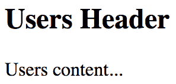
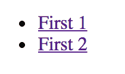
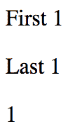
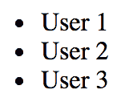
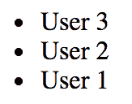
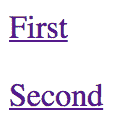
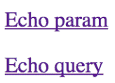

# 第九章：处理路由导航

几乎每个 Web 应用程序都需要**路由**：根据一组路由处理程序声明来响应 URL 的过程。换句话说，从 URL 到渲染内容的映射。然而，这个任务比起初看起来更加复杂。这就是为什么在本章中您将利用`react-router`包，这是 React 的*事实上*的路由工具。

首先，您将学习使用 JSX 语法声明路由的基础知识。然后，您将了解路由的动态方面，例如动态路径段和查询参数。接下来，您将使用`react-router`中的组件实现链接。

# 声明路由

使用`react-router`，您可以将路由与它们渲染的内容放在一起。在本节中，您将看到这是通过使用 JSX 语法来定义路由的。

您将创建一个基本的“hello world”示例路由，以便您可以看到在 React 应用程序中路由是什么样子的。然后，您将学习如何通过功能而不是在一个庞大的模块中组织路由声明。最后，您将实现一个常见的父子路由模式。

# Hello route

让我们创建一个简单的路由，以渲染一个简单的组件。首先，当路由被激活时，您有一个小的 React 组件要渲染：

```jsx
import React from 'react';

export default () => <p>Hello Route!</p>;
```

接下来，让我们看一下路由定义：

```jsx
import React from 'react';
import { render } from 'react-dom';
import { BrowserRouter as Router, Route } from 'react-router-dom';

import MyComponent from './MyComponent';

// The "<Router>" is the root element of the app.
render(
  <Router>
    <Route exact path="/" component={MyComponent} />
  </Router>,
  document.getElementById('root')
);

```

`Router`组件是应用程序的顶层组件。让我们来分解一下，了解路由器内部发生了什么。

您已经将实际路由声明为`<Route>`元素。任何路由的两个关键属性是`path`和`component`。当`path`与活动 URL 匹配时，将渲染`component`。但它到底是在哪里渲染的呢？`Router`组件实际上并不自己渲染任何内容；它负责根据当前 URL 管理其他组件的渲染方式。当您在浏览器中查看此示例时，`<MyComponent>`会如预期地被渲染：


当`path`属性与当前 URL 匹配时，`<Route>`将被`component`属性值替换。在这个例子中，路由将被`<MyComponent>`替换。如果给定路由不匹配，则不会渲染任何内容。

# 路由声明的解耦

路由的困难在于当你的应用程序在单个模块中声明了数十个路由时，因为更难将路由映射到功能上。

为了帮助实现这一点，应用程序的每个顶级功能都可以定义自己的路由。这样，清楚地知道哪些路由属于哪个功能。所以，让我们从`App`组件开始：

```jsx
import React, { Fragment } from 'react';
import {
  BrowserRouter as Router,
  Route,
  Redirect
} from 'react-router-dom';

// Import the routes from our features.
import One from './one';
import Two from './two';

// The feature routes are rendered as children of
// the main router.
export default () => (
  <Router>
    <Fragment>
      <Route exact path="/" render={() => <Redirect to="one" />} />
      <One />
      <Two />
    </Fragment>
  </Router>
); 
```

在这个例子中，应用程序有两个功能：`one` 和 `two`。这些被导入为组件并在`<Router>`内呈现。您必须包含`<Fragment>`元素，因为`<Router>`不喜欢有多个子元素。通过使用片段，您可以传递一个子元素，而不必使用不必要的 DOM 元素。这个路由器中的第一个子元素实际上是一个重定向。这意味着当应用程序首次加载 URL `/` 时，`<Redirect>`组件将把用户发送到 `/one`。`render`属性是`component`属性的替代品，当您需要调用一个函数来呈现内容时。您在这里使用它是因为您需要将属性传递给`<Redirect>`。

这个模块只会变得像应用程序功能的数量一样大，而不是路由的数量，后者可能会大得多。让我们来看看一个功能路由：

```jsx
import React, { Fragment } from 'react';
import { Route, Redirect } from 'react-router';

// The pages that make up feature "one".
import First from './First';
import Second from './Second';

// The routes of our feature. The "<Redirect>"
// handles "/one" requests by redirecting to "/one/1".
export default () => (
  <Fragment>
    <Route
      exact
      path="/one"
      render={() => <Redirect to="/one/1" />}
    />
    <Route exact path="/one/1" component={First} />
    <Route exact path="/one/2" component={Second} />
  </Fragment>
);
```

这个模块，`one/index.js`，导出一个呈现带有三个路由的片段的组件：

+   当匹配路径`/one`时，重定向到`/one/1`

+   当匹配路径`/one/1`时，呈现`First`组件

+   当匹配路径`/one/2`时，呈现`Second`组件

这遵循与路径`/`的`App`组件相同的模式。通常，您的应用程序实际上没有要在功能的根或应用程序本身的根处呈现的内容。这种模式允许您将用户发送到适当的路由和适当的内容。这是您首次加载应用程序时会看到的内容：


第二个功能遵循与第一个完全相同的模式。以下是组件的初始外观：

```jsx
import React from 'react';

export default () => (
  <p>Feature 1, page 1</p>
);
```

这个例子中的每个功能都使用相同的最小呈现内容。当用户导航到给定路由时，这些组件最终是用户需要看到的内容。通过以这种方式组织路由，您使得您的功能在路由方面是自包含的。

# 父级和子级路由

在前面的例子中，`App`组件是应用程序的主要组件。这是因为它定义了根 URL：`/`。然而，一旦用户导航到特定的功能 URL，`App`组件就不再相关了。

在`react-router`版本 4 之前的版本中，您可以嵌套您的`<Route>`元素，以便随着路径继续匹配当前 URL，相关组件被渲染。例如，路径`/users/8462`将具有嵌套的`<Route>`元素。在版本 4 及以上，`react-router`不再使用嵌套路由来处理子内容。相反，您有您通常的`App`组件。然后，使用`<Route>`元素来匹配当前 URL 的路径，以渲染`App`中的特定内容。

让我们看一下一个父级`App`组件，它使用`<Route>`元素来渲染子组件：

```jsx
import React from 'react';
import {
  BrowserRouter as Router,
  Route,
  NavLink
} from 'react-router-dom';

// The "User" components rendered with the "/users"
// route.
import UsersHeader from './users/UsersHeader';
import UsersMain from './users/UsersMain';

// The "Groups" components rendered with the "/groups"
// route.
import GroupsHeader from './groups/GroupsHeader';
import GroupsMain from './groups/GroupsMain';

// The "header" and "main" properties are the rendered
// components specified in the route. They're placed
// in the JSX of this component - "App".
const App = () => (
  <Router>
    <section>
      <nav>
        <NavLink
          exact
          to="/"
          style={{ padding: '0 10px' }}
          activeStyle={{ fontWeight: 'bold' }}
        >
          Home
        </NavLink>
        <NavLink
          exact
          to="/users"
          style={{ padding: '0 10px' }}
          activeStyle={{ fontWeight: 'bold' }}
        >
          Users
        </NavLink>
        <NavLink
          exact
          to="/groups"
          style={{ padding: '0 10px' }}
          activeStyle={{ fontWeight: 'bold' }}
        >
          Groups
        </NavLink>
      </nav>
      <header>
        <Route exact path="/" render={() => <h1>Home</h1>} />
        <Route exact path="/users" component={UsersHeader} />
        <Route exact path="/groups" component={GroupsHeader} />
      </header>
      <main>
        <Route exact path="/users" component={UsersMain} />
        <Route exact path="/groups" component={GroupsMain} />
      </main>
    </section>
  </Router>
);

export default App;
```

首先，`App`组件渲染一些导航链接。这些链接将始终可见。由于这些链接指向应用程序中的页面，您可以使用`NavLink`组件而不是`Link`组件。唯一的区别是，当其 URL 与当前 URL 匹配时，您可以使用`activeStyle`属性来改变链接的外观。

接下来，您有标题和主要部分。这是您使用`Route`组件来确定在`App`组件的这部分中渲染什么的地方。例如，`<header>`中的第一个路由使用`render`属性在用户位于应用程序的根目录时渲染标题。接下来的两个`Route`组件使用组件属性来渲染其他标题内容。在`<main>`中也使用相同的模式。

嵌套路由可能会很快变得混乱。通过声明路由的扁平结构，更容易扫描代码中的路由，以弄清发生了什么。

此应用程序有两个功能——`users`和`groups`。它们各自都有自己的`App`组件定义。例如，`UsersHeader`用于`<header>`，`UsersMain`用于`<main>`。

这是`UsersHeader`组件的样子：

```jsx
import React from 'react';

export default () => <h1>Users Header</h1>;
```

这是`UsersMain`组件的样子：

```jsx
import React from 'react';

export default () => <p>Users content...</p>;
```

在组中使用的组件几乎与这些完全相同。如果您运行此示例并导航到`/users`，您可以期望看到：



# 处理路由参数

到目前为止，在本章中您所看到的 URL 都是静态的。大多数应用程序将同时使用静态和动态路由。在本节中，您将学习如何将动态 URL 段传递到您的组件中，如何使这些段可选，以及如何获取查询字符串参数。

# 路由中的资源 ID

一个常见的用例是将资源的 ID 作为 URL 的一部分。这样可以让您的代码轻松获取 ID，然后发出 API 调用以获取相关的资源数据。让我们实现一个渲染用户详细信息页面的路由。这将需要一个包含用户 ID 的路由，然后需要以某种方式将其传递给组件，以便它可以获取用户。

让我们从声明路由的`App`组件开始：

```jsx
import React, { Fragment } from 'react';
import { BrowserRouter as Router, Route } from 'react-router-dom';

import UsersContainer from './UsersContainer';
import UserContainer from './UserContainer';

export default () => (
  <Router>
    <Fragment>
      <Route exact path="/" component={UsersContainer} />
      <Route path="/users/:id" component={UserContainer} />
    </Fragment>
  </Router>
); 
```

`:`语法标记了 URL 变量的开始。`id`变量将传递给`UserContainer`组件，下面是它的实现方式：

```jsx
import React, { Component } from 'react';
import PropTypes from 'prop-types';
import { fromJS } from 'immutable';

import User from './User';
import { fetchUser } from './api';

export default class UserContainer extends Component {
  state = {
    data: fromJS({
      error: null,
      first: null,
      last: null,
      age: null
    })
  };

  // Getter for "Immutable.js" state data...
  get data() {
    return this.state.data;
  }

  // Setter for "Immutable.js" state data...
  set data(data) {
    this.setState({ data });
  }

  componentDidMount() {
    // The dynamic URL segment we're interested in, "id",
    // is stored in the "params" property.
    const { match: { params: { id } } } = this.props;

    // Fetches a user based on the "id". Note that it's
    // converted to a number first.
    fetchUser(Number(id)).then(
      // If the user was successfully fetched, then
      // merge the user properties into the state. Also,
      // make sure that "error" is cleared.
      user => {
        this.data = this.data.merge(user, { error: null });
      },

      // If the user fetch failed, set the "error" state
      // to the resolved error value. Also, make sure the
      // other user properties are restored to their defaults
      // since the component is now in an error state.
      error => {
        this.data = this.data.merge({
          error,
          first: null,
          last: null,
          age: null
        });
      }
    );
  }

  render() {
    return <User {...this.data.toJS()} />;
  }
}

// Params should always be there...
UserContainer.propTypes = {
  match: PropTypes.object.isRequired
};
```

`match.params`属性包含 URL 的任何动态部分。在这种情况下，您对`id`参数感兴趣。然后，将此值的数字版本传递给`fetchUser()`API 调用。如果 URL 完全缺少该段，那么这段代码将根本不运行；路由器将恢复到`/`路由。但是，在路由级别没有进行类型检查，这意味着您需要处理传递非数字的地方期望数字等情况。

在这个例子中，如果用户导航到，例如，`/users/one`，类型转换操作将导致 500 错误。您可以编写一个函数来对参数进行类型检查，并且在出现异常时不会失败，而是响应 404：未找到错误。无论如何，提供有意义的失败模式取决于应用程序，而不是`react-router`库。

现在让我们看一下这个示例中使用的 API 函数：

```jsx
// Mock data...
const users = [
  { first: 'First 1', last: 'Last 1', age: 1 },
  { first: 'First 2', last: 'Last 2', age: 2 }
];

// Returns a promise that resolves the users array.
export function fetchUsers() {
  return new Promise((resolve, reject) => {
    resolve(users);
  });
}

// Returns a promise that resolves to a
// user from the "users" array, using the
// given "id" index. If nothing is found,
// the promise is rejected.
export function fetchUser(id) {
  const user = users[id];

  if (user === undefined) {
    return Promise.reject(`User ${id} not found`);
  } else {
    return Promise.resolve(user);
  }
}
```

`fetchUsers()`函数被`UsersContainer`组件使用来填充用户链接列表。`fetchUser()`函数将在模拟数据的`users`数组中查找并解析值，或者拒绝承诺。如果被拒绝，将调用`UserContainer`组件的错误处理行为。

这是负责渲染用户详细信息的`User`组件：

```jsx
import React from 'react';
import PropTypes from 'prop-types';
import { Map } from 'immutable';

// Renders "error" text, unless "error" is
// null - then nothing is rendered.
const Error = ({ error }) =>
  Map([[null, null]]).get(
    error,
    <p>
      <strong>{error}</strong>
    </p>
  );

// Renders "children" text, unless "children"
// is null - then nothing is rendered.
const Text = ({ children }) =>
  Map([[null, null]]).get(children, <p>{children}</p>);

const User = ({ error, first, last, age }) => (
  <section>
    {/* If there's an API error, display it. */}
    <Error error={error} />

    {/* If there's a first, last, or age value,
         display it. */}
    <Text>{first}</Text>
    <Text>{last}</Text>
    <Text>{age}</Text>
  </section>
);

// Every property is optional, since we might
// have have to render them.
User.propTypes = {
  error: PropTypes.string,
  first: PropTypes.string,
  last: PropTypes.string,
  age: PropTypes.number
};

export default User;
```

当您运行此应用程序并导航到`/`时，您应该看到一个用户列表，看起来像这样：



点击第一个链接应该带您到`/users/0`，看起来像这样：



如果您导航到一个不存在的用户，`/users/2`，您将看到以下内容：


您看到这个错误消息而不是 500 错误的原因是因为 API 端点知道如何处理缺少的资源：

```jsx
if (user === undefined) {
  reject(`User ${id} not found`);
}
```

这导致`UserContainer`设置其错误状态：

```jsx
fetchUser(Number(id)).then(
  user => {
    this.data = this.data.merge(user, { error: null });
  },
  error => {
    this.data = this.data.merge({
      error,
      first: null,
      last: null,
      age: null
    });
  }
);
```

这样就导致`User`组件渲染错误消息：

```jsx
const Error = ({ error }) =>
  Map([[null, null]]).get(
    error,
    <p>
      <strong>{error}</strong>
    </p>
  );

const User = ({ error, first, last, age }) => (
  <section>
    <Error error={error} />
    ...
  </section>
);
```

# 可选参数

有时，您需要可选的 URL 路径值和查询参数。URL 对于简单选项效果最佳，如果组件可以使用许多值，则查询参数效果最佳。

让我们实现一个用户列表组件，它渲染用户列表。可选地，您希望能够按降序对列表进行排序。让我们将这作为此页面的路由定义的可选路径段：

```jsx
import React from 'react';
import { render } from 'react-dom';
import { BrowserRouter as Router, Route } from 'react-router-dom';

import UsersContainer from './UsersContainer';

render(
  <Router>
    <Route path="/users/:desc?" component={UsersContainer} />
  </Router>,
  document.getElementById('root')
); 
```

`:`语法标记一个变量，`?`后缀标记变量为可选。这意味着用户可以在`/users/`后提供任何他们想要的内容。这也意味着组件需要确保提供了字符串`desc`，并且忽略其他所有内容。

组件还需要处理提供给它的任何查询字符串。因此，虽然路由声明不提供定义接受的查询字符串的机制，但路由器仍将原始查询字符串传递给组件。现在让我们来看一下用户列表容器组件：

```jsx
import React, { Component } from 'react';
import PropTypes from 'prop-types';
import { fromJS } from 'immutable';

import Users from './Users';
import { fetchUsers } from './api';

export default class UsersContainer extends Component {
  // The "users" state is an empty immutable list
  // by default.
  state = {
    data: fromJS({
      users: []
    })
  };

  // Getter for "Immutable.js" state data...
  get data() {
    return this.state.data;
  }

  // Setter for "Immutable.js" state data...
  set data(data) {
    this.setState({ data });
  }

  componentDidMount() {
    // The URL and query string data we need...
    const { match: { params }, location: { search } } = this.props;

    // If the "params.desc" value is "desc", it means that
    // "desc" is a URL segment. If "search.desc" is true, it
    // means "desc" was provided as a query parameter.
    const desc =
      params.desc === 'desc' ||
      !!new URLSearchParams(search).get('desc');

    // Tell the "fetchUsers()" API to sort in descending
    // order if the "desc" value is true.
    fetchUsers(desc).then(users => {
      this.data = this.data.set('users', users);
    });
  }

  render() {
    return <Users {...this.data.toJS()} />;
  }
}

UsersContainer.propTypes = {
  params: PropTypes.object.isRequired,
  location: PropTypes.object.isRequired
};

```

在`componentDidMount()`方法中，此组件查找`params.desc`或`search.desc`。它将此作为`fetchUsers()` API 的参数，以确定排序顺序。

`Users`组件如下所示：

```jsx
import React from 'react';
import PropTypes from 'prop-types';

// Renders a list of users...
const Users = ({ users }) => (
  <ul>{users.map(i => <li key={i}>{i}</li>)}</ul>
);

Users.propTypes = {
  users: PropTypes.array.isRequired
};

export default Users;
```

当您导航到`/users`时，将呈现如下内容：



如果您通过导航到`/users/desc`包含降序参数，我们会得到以下结果：



# 使用链接组件

在本节中，您将学习如何创建链接。您可能会尝试使用标准的`<a>`元素链接到由`react-router`控制的页面。这种方法的问题在于，这些链接将尝试通过发送 GET 请求在后端定位页面。这不是您想要的，因为路由配置已经在浏览器中。

首先，您将看到一个示例，说明`<Link>`元素在大多数方面都像`<a>`元素。然后，您将看到如何构建使用 URL 参数和查询参数的链接。

# 基本链接

在 React 应用程序中，链接的想法是它们指向指向渲染新内容的组件的路由。`Link`组件还负责浏览器历史 API 和查找路由/组件映射。这是一个渲染两个链接的应用程序组件：

```jsx
import React from 'react';
import {
  BrowserRouter as Router,
  Route,
  Link
} from 'react-router-dom';

import First from './First';
import Second from './Second';

const App = () => (
  <Router>
    <section>
      <nav>
        <p>
          <Link to="first">First</Link>
        </p>
        <p>
          <Link to="second">Second</Link>
        </p>
      </nav>
      <section>
        <Route path="/first" component={First} />
        <Route path="/second" component={Second} />
      </section>
    </section>
  </Router>
);

export default App; 
```

`to`属性指定点击时要激活的路由。在这种情况下，应用程序有两个路由—`/first`和`/second`。渲染的链接如下所示：



当您点击第一个链接时，页面内容会变成这样：


# URL 和查询参数

构建传递给`<Link>`的路径的动态段涉及字符串操作。路径的所有部分都放在`to`属性中。这意味着您必须编写更多的代码来构建字符串，但也意味着在路由器中发生的幕后魔术更少。

让我们创建一个简单的组件，它将回显传递给回声 URL 段或`echo`查询参数的任何内容：

```jsx
import React from 'react';
import { withRouter } from 'react-router';

// Simple component that expects either an "echo"
// URL segment parameter, or an "echo" query parameter.
export default withRouter(
  ({ match: { params }, location: { search } }) => (
    <h1>{params.msg || new URLSearchParams(search).get('msg')}</h1>
  )
); 
```

`withRouter()`实用程序函数是一个返回新组件的高阶函数。这个新组件将传递给它与路由相关的属性，如果你想要处理路径段变量或查询字符串，这些属性是必需的。你的`Echo`组件使用的两个属性是`match.params`用于 URL 路径变量和`location.search`用于查询字符串。

在`react-router`版本 4 之前，查询字符串被解析并作为对象传递。现在必须在您的代码中处理。在这个例子中，使用了`URLSearchParams`。

现在，让我们来看一下渲染两个链接的`App`组件。第一个将构建一个使用动态值作为 URL 参数的字符串。第二个将使用`URLSearchParams`来构建 URL 的查询字符串部分：

```jsx
import React from 'react';
import PropTypes from 'prop-types';
import { Link } from 'react-router-dom';

const App = ({ children }) => <section>{children}</section>;

App.propTypes = {
  children: PropTypes.node.isRequired
};

// Link parameter and query data...
const param = 'From Param';
const query = new URLSearchParams({ msg: 'From Query' });

App.defaultProps = {
  children: (
    <section>
      {/* This "<Link>" uses a paramter as part of
           the "to" property. */}
      <p>
        <Link to={`echo/${param}`}>Echo param</Link>
      </p>

      {/* This "<Link>" uses the "query" property
           to add query parameters to the link URL. */}
      <p>
        <Link to={`echo?${query.toString()}`} query={query}>
          Echo query
        </Link>
      </p>
    </section>
  )
};

export default App; 
```

当它们被渲染时，这两个链接看起来像这样：



参数链接将带您到`/echo/From Param`，看起来像这样：


查询链接将带您到`/echo?echo=From+Query`，看起来像这样：


# 总结

在本章中，您学习了 React 应用程序中的路由。路由的工作是渲染与 URL 对应的内容。`react-router`包是这项工作的标准工具。

您学会了路由是 JSX 元素，就像它们渲染的组件一样。有时，您需要将路由拆分为基于特性的模块。结构化页面内容的常见模式是有一个父组件，根据 URL 的变化来渲染动态部分。

您学会了如何处理 URL 段和查询字符串的动态部分。您还学会了如何使用`<Link>`元素在整个应用程序中构建链接。

在下一章中，您将学习如何在 Node.js 中呈现 React 组件。

# 测试您的知识

1.  `react-router`包是 React 应用程序中用于路由的官方包，因此是唯一的选择。

1.  是的，`react-router`是官方的 React 路由解决方案。

1.  不，`react-router`是多个路由选项之一，您应该花时间查看每个选项。

1.  不，**`react-router`**是 React 的事实标准路由解决方案，除非您有充分的理由不使用它。

1.  `Route`和`Router`组件之间有什么区别？

1.  **`Route`**用于根据 URL 匹配呈现组件，**`Router`**用于声明路由-组件映射。

1.  没有区别。

1.  每个组件都应该声明一个`Router`，以声明组件使用的路由。

1.  当路由更改时，如何仅更改 UI 的某些部分？

1.  您不能仅更改某些部分，必须重新呈现整个组件树，从根开始。

1.  您使用**`Route`**组件根据提供的**`path`**属性呈现特定于任何给定部分的内容。您可以有多个具有相同**`path`**值的**`Route`**。

1.  您将部分名称作为属性值传递给`Route`组件，以及要为该部分呈现的组件。

1.  何时应该使用`NavLink`组件？

1.  当您希望`react-router`自动为您设置活动链接的样式时。

1.  向用户显示哪些链接是导航链接，哪些是常规链接。

1.  当您想要使用**`activeStyle`**或**`activeClassName`**属性为活动链接设置样式时。

1.  如何从 URL 路径中获取值？

1.  您可以通过传递段的索引来获取任何 URL 路径段的值。

1.  您必须自己解析 URL 并找到值。

1.  您使用**`:`**语法来指定这是一个变量，**`react-router`**将此值作为属性传递给您的组件。

# 进一步阅读

有关更多信息，请参考以下链接：

+   [`reacttraining.com/react-router/`](https://reacttraining.com/react-router/)

+   [`developer.mozilla.org/en-US/docs/Web/API/URLSearchParams`](https://developer.mozilla.org/en-US/docs/Web/API/URLSearchParams)
