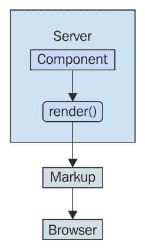
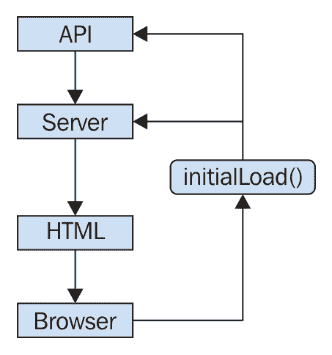
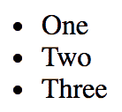
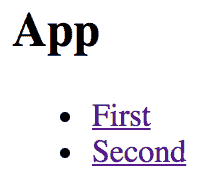
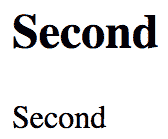
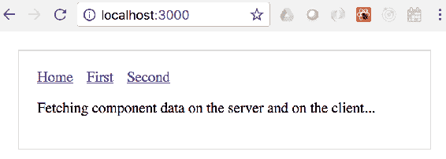
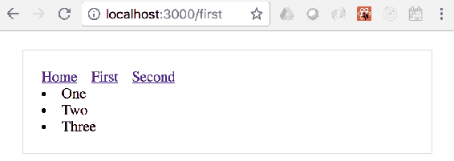

# 第十章：服务器端 React 组件

到目前为止，你在本书中学到的所有内容都是在 Web 浏览器中运行的 React 代码。React 并不局限于浏览器进行渲染，在本章中，你将学习如何从 Node.js 服务器渲染组件。

本章的第一部分简要介绍了高级服务器渲染概念。接下来的四个部分将深入探讨，教你如何使用 React 和 Next.js 实现服务器端渲染的最关键方面。

# 什么是同构 JavaScript？

**服务器端渲染**的另一个术语是**同构 JavaScript**。这是一种花哨的说法，表示 JavaScript 代码可以在浏览器和 Node.js 中运行，而无需修改。在本节中，你将学习同构 JavaScript 的基本概念，然后深入到代码中。

# 服务器是一个渲染目标

React 的美妙之处在于它是一个小的抽象层，位于渲染目标的顶部。到目前为止，目标一直是浏览器，但也可以是服务器。渲染目标可以是任何东西，只要在幕后实现了正确的翻译调用。

在服务器上进行渲染时，组件被渲染为字符串。服务器实际上无法显示渲染的 HTML；它所能做的就是将渲染的标记发送到浏览器。这个想法在下图中有所说明：



在服务器上渲染 React 组件并将渲染输出发送到浏览器是可能的。问题是，为什么你想在服务器上这样做，而不是在浏览器上呢？

# 初始加载性能

对我个人来说，服务器端渲染背后的主要动机是提高性能。特别是，初始渲染对用户来说感觉更快，这会转化为更好的用户体验。一旦应用程序加载并准备就绪，它有多快并不重要；初始加载时间对用户留下了深刻的印象。

这种方法有三个原因可以提高初始加载的性能：

+   在服务器上进行的渲染生成了一个字符串；不需要计算差异或以任何方式与 DOM 交互。生成一串渲染标记的速度本质上比在浏览器中渲染组件要快。

+   呈现的 HTML 一旦到达就会显示。任何需要在初始加载时运行的 JavaScript 代码都是在用户已经看到内容之后运行的。

+   从 API 获取数据的网络请求更少，因为这些请求已经在服务器上发生，而服务器通常比单个客户端拥有更多的资源。

以下图表说明了这些性能思想：



# 在服务器和浏览器之间共享代码

你的应用程序很有可能需要与你无法控制的 API 端点进行通信，例如，由许多不同的微服务端点组成的应用程序。很少有可能直接使用这些服务的数据而不经过修改。相反，你需要编写代码来转换数据，以便 React 组件可以使用。

如果你在 Node.js 服务器上呈现你的组件，那么这个数据转换代码将被客户端和服务器同时使用，因为在初始加载时，服务器需要与 API 通信，而后来浏览器中的组件需要与 API 通信。

这不仅仅是关于转换从这些服务返回的数据。例如，你还需要考虑提供给它们的输入，比如创建或修改资源时。

作为 React 程序员，你需要做的基本调整是假设你实现的任何组件都需要在服务器上呈现。这可能看起来像是一个小的调整，但细节中藏着魔鬼。说到细节，现在让我们来看一些代码示例。

# 呈现为字符串

在 Node.js 中呈现组件意味着呈现为字符串，而不是试图找出将它们插入 DOM 的最佳方法。然后将字符串内容返回给浏览器，浏览器立即显示给用户。让我们来看一个例子。首先，要呈现的组件：

```jsx
import React from 'react';
import PropTypes from 'prop-types';

const App = ({ items }) => (
  <ul>{items.map(i => <li key={i}>{i}</li>)}</ul>
);

App.propTypes = {
  items: PropTypes.arrayOf(PropTypes.string).isRequired
};

export default App;
```

接下来，让我们实现服务器，当浏览器请求时，它将呈现这个组件：

```jsx
import React from 'react';

// The "renderToString()" function is like "render()",
// except it returns a rendered HTML string instead of
// manipulating the DOM.
import { renderToString } from 'react-dom/server';
import express from 'express';

// The component that we're going to render as a string.
import App from './App';

// The "doc()" function takes the rendered "content"
// of a React component and inserts it into an
// HTML document skeleton.
const doc = content =>
  `
  <!doctype html>
  <html>
    <head>
      <title>Rendering to strings</title>
    </head>
    <body>
      <div id="app">${content}</div>
    </body>
  </html>
  `;

const app = express();

// The root URL of the APP, returns the rendered
// React component.
app.get('/', (req, res) => {
  // Some properties to render...
  const props = {
    items: ['One', 'Two', 'Three']
  };

  // Render the "App" component using
  // "renderToString()"
  const rendered = renderToString(<App {...props} />);

  // Use the "doc()" function to build the final
  // HTML that is sent to the browser.
  res.send(doc(rendered));
});

app.listen(8080, () => {
  console.log('Listening on 127.0.0.1:8080');
});
```

现在，如果你在浏览器中访问[`127.0.0.1:8080`](http://127.0.0.1:8080)，你会看到呈现的组件内容：



在这个例子中有两件事情需要注意。首先是`doc()`函数。它创建了带有渲染的 React 内容占位符的基本 HTML 文档模板。第二个是对`renderToString()`的调用，就像你习惯的`render()`调用一样。这是在服务器请求处理程序中调用的，渲染的字符串被发送到浏览器。

# 后端路由

在前面的例子中，你在服务器上实现了一个单一的请求处理程序，用于响应根 URL(`/`)的请求。你的应用程序需要处理不止一个路由。在上一章中，你学会了如何在路由中使用`react-router`包。现在，你将看到如何在 Node.js 中使用相同的包。 

首先，让我们看一下主要的`App`组件：

```jsx
import React from 'react';
import { Route, Link } from 'react-router-dom';

import FirstHeader from './first/FirstHeader';
import FirstContent from './first/FirstContent';
import SecondHeader from './second/SecondHeader';
import SecondContent from './second/SecondContent';

export default () => (
  <section>
    <header>
      <Route exact path="/" render={() => <h1>App</h1>} />
      <Route exact path="/first" component={FirstHeader} />
      <Route exact path="/second" component={SecondHeader} />
    </header>
    <main>
      <Route
        exact
        path="/"
        render={() => (
          <ul>
            <li>
              <Link to="first">First</Link>
            </li>
            <li>
              <Link to="second">Second</Link>
            </li>
          </ul>
        )}
      />
      <Route exact path="/first" component={FirstContent} />
      <Route exact path="/second" component={SecondContent} />
    </main>
  </section>
); 
```

这个应用程序处理三条路线：

+   `/`：首页

+   `/first`：第一页内容

+   `/second`：第二页内容

`App`内容分为`<header>`和`<main>`元素。在每个部分中，都有一个处理适当内容的`<Route>`组件。例如，`/`路由的主要内容由一个`render()`函数处理，该函数呈现到`/first`和`/second`的链接。

这个组件在客户端上可以正常工作，但在服务器上会工作吗？让我们现在实现一下：

```jsx
import React from 'react';
import { renderToString } from 'react-dom/server';
import { StaticRouter } from 'react-router';
import express from 'express';

import App from './App';

const app = express();

app.get('/*', (req, res) => {
  const context = {};
  const html = renderToString(
    <StaticRouter location={req.url} context={context}>
      <App />
    </StaticRouter>
  );

  if (context.url) {
    res.writeHead(301, {
      Location: context.url
    });
    res.end();
  } else {
    res.write(`
      <!doctype html>
      <div id="app">${html}</div>
    `);
    res.end();
  }
});

app.listen(8080, () => {
  console.log('Listening on 127.0.0.1:8080');
}); 
```

现在你有了前端和后端路由！这到底是如何工作的？让我们从请求处理程序路径开始。这已经改变了，现在是通配符(`/*`)。现在这个处理程序会对每个请求进行调用。

在服务器上，使用`<StaticRouter>`组件代替`<BrowserRouter>`组件。`<App>`组件是子组件，这意味着其中的`<Route>`组件将从`<StaticRouter>`传递数据。这就是`<App>`如何知道根据 URL 呈现正确的内容。调用`renderToString()`得到的`html`值可以作为发送给浏览器的响应文档的一部分。

现在你的应用程序开始看起来像一个真正的端到端的 React 渲染解决方案。这是服务器在你访问根 URL`/`时呈现的内容：



如果你访问`/second` URL，Node.js 服务器将呈现正确的组件：



如果您从主页导航到第一页，则请求将返回到服务器。我们需要弄清楚如何将前端代码传递到浏览器，以便它可以在初始呈现后接管。

# 前端协调

上一个示例中缺少的唯一内容是客户端 JavaScript 代码。用户希望使用应用程序，服务器需要传递客户端代码包。这将如何工作？路由必须在浏览器和服务器上工作，而不需要修改路由。换句话说，服务器处理初始请求的路由，然后浏览器在用户开始点击和在应用程序中移动时接管。

让我们为这个示例创建`index.js`模块：

```jsx
import React from 'react';
import { hydrate } from 'react-dom';

import App from './App';

hydrate(<App />, document.getElementById('root')); 
```

这看起来像本书中迄今为止您所见过的大多数`index.js`文件。您在 HTML 文档的根元素中呈现`<App>`组件。在这种情况下，您使用`hydrate()`函数而不是`render()`函数。这两个函数的最终结果是相同的——在浏览器窗口中呈现的 JSX 内容。`hydrate()`函数不同，因为它期望已经放置了呈现的组件内容。这意味着它将执行更少的工作，因为它将假定标记是正确的，不需要在初始呈现时进行更新。

只有在开发模式下，React 才会检查服务器呈现内容的整个 DOM 树，以确保显示正确的内容。如果现有内容与 React 组件的输出之间存在不匹配，您将看到警告，显示出现不匹配的位置，以便您可以去修复它们。

这是您的应用程序将在浏览器和 Node.js 服务器上呈现的`App`组件：

```jsx
import React, { Component } from 'react';

export default class App extends Component {
  state = { clicks: 0 };

  render() {
    return (
      <section>
        <header>
          <h1>Hydrating The Client</h1>
        </header>
        <main>
          <p>Clicks {this.state.clicks}</p>
          <button
            onClick={() =>
              this.setState(state => ({ clicks: state.clicks + 1 }))
            }
          >
            Click Me
          </button>
        </main>
      </section>
    );
  }
}
```

该组件呈现一个按钮，当点击时，将更新`clicks`状态。该状态在按钮上方的标签中呈现。当此组件在服务器上呈现时，将使用默认的点击值 0，并且`onClick`处理程序将被忽略，因为它只是呈现静态标记。让我们接下来看一下服务器端的代码：

```jsx
import fs from 'fs';
import React from 'react';
import { renderToString } from 'react-dom/server';
import express from 'express';

import App from './App';

const app = express();
const doc = fs.readFileSync('./build/index.html');

app.use(express.static('./build', { index: false }));

app.get('/*', (req, res) => {
  const context = {};
  const html = renderToString(<App />);

  if (context.url) {
    res.writeHead(301, {
      Location: context.url
    });
    res.end();
  } else {
    res.write(
      doc
        .toString()
        .replace('<div id="root">', `<div id="root">${html}`)
    );
    res.end();
  }
});

app.listen(8080, () => {
  console.log('Listening on 127.0.0.1:8080');
});
```

让我们浏览一下这个源代码，看看发生了什么：

```jsx
const doc = fs.readFileSync('./build/index.html');
```

这读取由您的 React 构建工具（如`create-react-app/react-scripts`）创建的`index.html`文件，并将其存储在`doc`中：

```jsx
app.use(express.static('./build', { index: false }));
```

这告诉 Express 服务器将`./build`下的文件作为静态文件提供，除了`index.html`。相反，您将编写一个处理程序，以响应站点根目录的请求：

```jsx
app.get('/*', (req, res) => {
  const context = {};
  const html = renderToString(<App />);

  if (context.url) {
    res.writeHead(301, {
      Location: context.url
    });
    res.end();
  } else {
    res.write(
      doc
        .toString()
        .replace('<div id="root">', `<div id="root">${html}`)
    );
    res.end();
  }
});
```

这是 `html` 常量被填充为渲染的 React 内容的地方。然后，它被插入到 HTML 字符串中使用 `replace()`，并作为响应发送。因为你使用了基于构建的 `index.html` 文件，它包含了一个链接到捆绑的 React 应用程序，当在浏览器中加载时将运行。

# 获取数据

如果你的某个组件在完全渲染其内容之前需要获取 API 数据怎么办？这对于在服务器上渲染来说是一个挑战，因为没有简单的方法来定义一个组件，它知道何时在服务器上以及在浏览器中获取数据。

这就是像 **Next.js** 这样的最小化框架发挥作用的地方。Next.js 将服务器渲染和浏览器渲染视为相等。这意味着组件获取数据的麻烦被抽象化了 - 你可以在浏览器和服务器上使用相同的代码。

本书的上一版没有使用任何框架来在服务器上获取 React 组件数据。我认为，如果你要走这条路，不使用框架是一个错误。有太多事情可能会出错，而且没有框架，最终你将对它们负责。

为了处理路由，Next.js 使用页面的概念。**页面** 是一个导出 React 组件的 JavaScript 模块。组件的渲染内容变成页面内容。以下是 `pages` 目录的样子：

```jsx
└── pages
 ├── first.js ├── index.js └── second.js
```

`index.js` 模块是应用程序的根页面：Next.js 根据文件名知道这一点。以下是源代码的样子：

```jsx
import Layout from '../components/MyLayout.js';

export default () => (
  <Layout>
    <p>Fetching component data on the server and on the client...</p>
  </Layout>
);
```

这个页面使用了 `<Layout>` 组件来确保通用组件被渲染，而不需要重复代码。渲染后页面的样子如下：



除了段落之外，整个应用程序布局还包括导航链接到其他页面。以下是 `Layout` 的源代码样子：

```jsx
import Header from './Header';

const layoutStyle = {
  margin: 20,
  padding: 20,
  border: '1px solid #DDD'
};

const Layout = props => (
  <div style={layoutStyle}>
    <Header />
    {props.children}
  </div>
);

export default Layout;
```

`Layout` 组件渲染一个 `Header` 组件和 `props.children`。`children` 属性是你在页面中传递给 `Layout` 组件的值。现在让我们来看一下 `Header` 组件：

```jsx
import Link from 'next/link';

const linkStyle = {
  marginRight: 15
};

const Header = () => (
  <div>
    <Link href="/">
      <a style={linkStyle}>Home</a>
    </Link>
    <Link href="/first">
      <a style={linkStyle}>First</a>
    </Link>
    <Link href="/second">
      <a style={linkStyle}>Second</a>
    </Link>
  </div>
);

export default Header;
```

这里使用的 `Link` 组件来自于 Next.js。这样，链接就可以按照 Next.js 自动设置的路由正常工作。现在让我们看一个有数据获取要求的页面 - `pages/first.js`：

```jsx
import fetch from 'isomorphic-unfetch';
import Layout from '../components/MyLayout.js';
import { fetchFirstItems } from '../api';

const First = ({ items }) => (
  <Layout>{items.map(i => <li key={i}>{i}</li>)}</Layout>
);

First.getInitialProps = async () => {
  const res = await fetchFirstItems();
  const items = await res.json();

  return { items };
};

export default First;
```

`fetch()` 函数用于获取数据，来自于 `isomorphic-unfetch` 包。这个版本的 `fetch()` 在服务器和浏览器上都可以使用，你不需要检查任何东西。再次强调，`Layout` 组件用于包装页面内容，以保持与其他页面的一致性。

`getInitialProps()` 函数是 Next.js 获取数据的方式——在浏览器和服务器上。这是一个异步函数，意味着你可以花费尽可能长的时间来获取组件属性的数据，而 Next.js 将确保在数据准备好之前不呈现任何标记。让我们来看看 `fetchFirstItems()` API 函数：

```jsx
export default () =>
  new Promise(resolve =>
    setTimeout(() => {
      resolve({
        json: () => Promise.resolve(['One', 'Two', 'Three'])
      });
    }, 1000)
  );
```

这个函数通过返回一个在 1 秒后解析出组件数据的 promise 来模拟 API 的行为。如果你导航到 `/first`，你将在 1 秒后看到以下内容：



通过点击第一个链接，你导致了在浏览器中调用 `getInitialProps()` 函数，因为应用程序已经被交付。如果你在 `/first` 页面重新加载页面，你将触发在服务器上调用 `getInitialProps()`，因为这是 Next.js 在服务器上处理的页面。

# 摘要

在本章中，你了解到 React 除了在客户端上渲染外，还可以在服务器上渲染。这样做的原因有很多，比如在前端和后端之间共享通用代码。服务器端渲染的主要优势是在初始页面加载时获得的性能提升。这将转化为更好的用户体验，因此也是更好的产品。

然后，你逐步改进了一个服务器端的 React 应用程序，从单页面渲染开始。然后介绍了路由、客户端协调和组件数据获取，以使用 Next.js 实现完整的后端渲染解决方案。

在接下来的章节中，你将学习如何实现 React Bootstrap 组件来实现移动优先设计。

# 测试你的知识

1.  `react-dom` 中的 `render()` 函数和 `react-dom/server` 中的 `renderToString()` 函数有什么区别？

1.  `render()` 函数仅用于在浏览器中将 React 组件内容与 DOM 同步。`renderToString()` 函数不需要 DOM，因为它将标记呈现为字符串。

1.  这两个函数是可以互换的。

1.  `render()` 函数在服务器上速度较慢，所以 `renderToString()` 是一个更好的选择。

1.  如果必须，应该只在浏览器中使用`render()`。在大多数情况下，`renderToString()`函数更可取。

1.  在服务器上进行路由是必要的，因为：

1.  在服务器上没有路由，实际上无法渲染组件。

1.  您不需要担心在服务器上进行渲染，因为路由将在浏览器中处理。

1.  服务器上的路由将根据请求的 URL 确定渲染的内容。然后将此内容发送到浏览器，以便用户感知到更快的加载时间。

1.  在服务器上进行路由应该手动完成，而不是使用 react-router 中的组件。

1.  在调和服务器渲染的 React 标记与浏览器中的 React 组件时，应该使用哪个函数？

1.  始终在浏览器中使用`render()`。它知道如何对现有标记进行必要的更改。

1.  始终在服务器发送渲染的 React 组件时使用`hydrate()`。与`render()`不同，`hydrate()`期望渲染的组件标记并且可以高效处理它。

# 进一步阅读

查看以下链接以获取更多信息：

+   [`reactjs.org/docs/react-dom-server.html`](https://reactjs.org/docs/react-dom-server.html)

+   [`reacttraining.com/react-router/core/api/StaticRouter`](https://reacttraining.com/react-router/core/api/StaticRouter)

+   [`nextjs.org/learn/`](https://nextjs.org/learn/)
