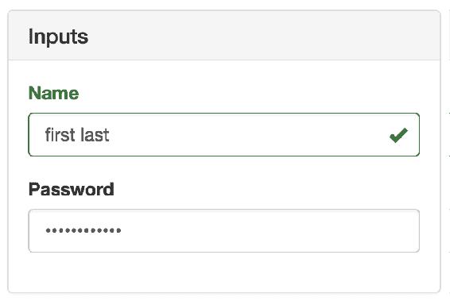
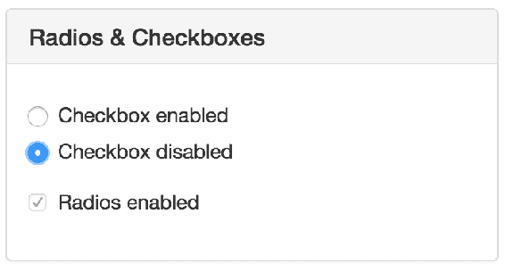

# 第十一章：移动优先 React 组件

在本章中，您将学习如何使用`react-bootstrap`包。该包通过利用 Bootstrap CSS 框架提供移动优先的 React 组件。这不是进行移动优先 React 的唯一选择，但这是一个不错的选择，并且它将网络上最流行的两种技术结合在一起。

我将从采用移动优先设计策略的动机开始。然后您将在本章的其余部分中实现一些`react-bootstrap`组件。

# 移动优先设计背后的原理

移动优先设计是一种将移动设备视为用户界面的主要目标的策略。较大的屏幕，如笔记本电脑或大型显示器，是次要目标。这并不一定意味着大多数用户在手机上访问您的应用程序。这只是意味着移动设备是缩放用户界面的起点。

例如，当移动浏览器首次出现时，习惯上是为普通桌面屏幕设计用户界面，然后在必要时缩小到较小的屏幕。该方法如下所示：


这里的想法是，您设计 UI 时要考虑较大的屏幕，以便一次性将尽可能多的功能放在屏幕上。当使用较小的设备时，您的代码必须在运行时使用不同的布局或不同的组件。

这在许多方面都是非常有限的。首先，对于不同的屏幕分辨率，维护大量特殊情况处理的代码非常困难。其次，更具有说服力的反对这种方法的论点是，几乎不可能在不同设备上提供类似的用户体验。如果大屏幕一次显示大量功能，您简单无法在较小的屏幕上复制这一点。不仅是屏幕空间较小，而且较小设备的处理能力和网络带宽也是限制因素。

UI 设计的移动优先方法通过放大 UI 来解决这些问题，而不是试图缩小 UI，如下所示：


这种方法以前是没有意义的，因为你会限制你的应用程序的功能；周围没有很多平板电脑或手机。但今天情况不同了，人们期望用户能够在他们的移动设备上与应用程序进行交互而不会出现任何问题。现在有更多的移动设备了，移动浏览器完全能够处理你提出的任何要求。

一旦你在移动环境中实现了应用程序功能，将其扩展到更大的屏幕尺寸就是一个相对容易解决的问题。现在，让我们看看如何在 React 应用程序中实现移动优先。

# 使用 react-bootstrap 组件

虽然可以通过自己编写 CSS 来实现移动优先的 React 用户界面，但我建议不要这样做。有许多 CSS 库可以为你处理看似无穷无尽的边缘情况。在这一部分，我将介绍`react-bootstrap`包——Bootstrap 的 React 组件。

`react-bootstrap`包公开了许多组件，它们在你的应用程序和 Bootstrap HTML/CSS 之间提供了一个薄的抽象层。

现在让我们实现一些示例。我向你展示如何使用`react-bootstrap`组件的另一个原因是它们与`react-native`组件相似，你将在下一章中学习到。

以下示例的重点不是深入覆盖`react-bootstrap`，或者 Bootstrap 本身。相反，重点是让你感受一下通过从容器传递状态等方式在 React 中使用移动优先组件的感觉。现在，先看一下`react-bootstrap`文档（[`react-bootstrap.github.io/`](http://react-bootstrap.github.io/)）了解具体内容。

# 实现导航

移动优先设计的最重要方面是导航。在移动设备上很难做到这一点，因为几乎没有足够的空间来放置功能内容，更别提从一个功能到另一个功能的工具了。幸运的是，Bootstrap 为你处理了许多困难。

在这一部分，你将学习如何实现两种类型的导航。你将从工具栏导航开始，然后构建一个侧边栏导航部分。这构成了你将开始的 UI 骨架的一部分。我发现这种方法真的很有用，因为一旦导航机制就位，我在构建应用程序时很容易添加新页面和在应用程序中移动。

让我们从`Navbar.`开始。这是大多数应用程序中的一个组件，静态地位于屏幕顶部。在这个栏中，你将添加一些导航链接。这是这个 JSX 的样子：

```jsx
{/* The "NavBar" is statically-placed across the
   top of every page. It contains things like the
   title of the application, and menu items. */}
<Navbar className="navbar-top" fluid>
  <Navbar.Header>
    <Navbar.Brand>
      <Link to="/">Mobile-First React</Link>
    </Navbar.Brand>

    {/* The "<Navbar.Taggle>" coponent is used to replace any
       navigation links with a drop-down menu for smaller
       screens. */}
    <Navbar.Toggle />
  </Navbar.Header>

  {/* The actual menu with links to makes. It's wrapped
     in the "<Navbar.Collapse>"" component so that it
     work properly when the links have been collapsed. */}
  <Navbar.Collapse>
    <Nav pullRight>
      <IndexLinkContainer to="/">
        <MenuItem>Home</MenuItem>
      </IndexLinkContainer>
      <LinkContainer to="forms">
        <MenuItem>Forms</MenuItem>
      </LinkContainer>
      <LinkContainer to="lists">
        <MenuItem>Lists</MenuItem>
      </LinkContainer>
    </Nav>
  </Navbar.Collapse>
</Navbar> 
```

导航栏的样子如下：


`<Navbar.Header>`组件定义了应用程序的标题，并放置在导航栏的左侧。链接本身放在`<Nav>`元素中，`pullRight`属性将它们对齐到导航栏的右侧。你可以看到，你没有使用`react-router`包中的`<Link>`，而是使用了`<LinkContainer>`和`<IndexLinkContainer>`。这些组件来自`react-router-bootstrap`包。它们是必要的，以使 Bootstrap 链接与路由器正常工作。

`<Nav>`元素被包裹在`<Navbar.Collapse>`元素中，头部包含一个`<Navbar.Toggle>`按钮。这些组件是必要的，用于将链接折叠成下拉菜单以适应较小的屏幕。由于它是基于浏览器的宽度，你可以调整浏览器窗口大小来看它的效果：


显示的链接现在已经折叠成了一个标准菜单按钮。当点击这个按钮时，相同的链接以垂直方式显示。这在较小的设备上效果更好。但是在较大的屏幕上，将所有导航显示在顶部导航栏可能不是理想的。标准的方法是实现一个带有垂直堆叠导航链接的左侧边栏。让我们现在来实现这个：

```jsx
{/* This navigation menu has the same links
   as the top navbar. The difference is that
   this navigation is a sidebar. It's completely
   hidden on smaller screens. */}
<Col sm={3} md={2} className="sidebar">
  <Nav stacked>
    <IndexLinkContainer to="/">
      <NavItem>Home</NavItem>
    </IndexLinkContainer>
    <LinkContainer to="forms">
      <NavItem>Forms</NavItem>
    </LinkContainer>
    <LinkContainer to="lists">
      <NavItem>Lists</NavItem>
    </LinkContainer>
  </Nav>
</Col> 
```

`<Col>`元素是`<Nav>`的容器，你已经给它添加了自己的类名。你马上就会明白为什么要这样做。在`<Nav>`元素内部，事情看起来和导航工具栏中一样，有链接容器和菜单项。这就是侧边栏的样子：


现在，我们需要给包含元素添加自定义的`sidebar`类名的原因是为了在较小的设备上完全隐藏它。让我们来看一下涉及的 CSS：

```jsx
.sidebar { 
  display: none; 
} 

@media (min-width: 768px) { 
  .sidebar { 
    display: block; 
    position: fixed; 
    top: 60px; 
  } 
} 
```

这个 CSS，以及这个示例的整体结构，都是从 Bootstrap 示例中调整而来：[`getbootstrap.com/examples/dashboard/`](http://getbootstrap.com/examples/dashboard/)。这个媒体查询的背后思想是，如果最小浏览器宽度为`768px`，那么在固定位置显示侧边栏。否则，完全隐藏它，因为我们在一个较小的屏幕上。

在这一点上，您有两个导航组件相互协作，根据屏幕分辨率改变它们的显示方式。

# 列表

在移动和桌面环境中，一个常见的 UI 元素是渲染项目列表。这很容易在没有 CSS 库的支持下完成，但库有助于保持外观和感觉一致。让我们实现一个由一组过滤器控制的列表。首先，您有渲染`react-bootstrap`组件的组件：

```jsx
import React from 'react';
import PropTypes from 'prop-types';

import {
  Button,
  ButtonGroup,
  ListGroupItem,
  ListGroup,
  Glyphicon
} from 'react-bootstrap';

import './FilteredList.css';

// Utility function to get the bootstrap style
// for an item, based on the "done" value.
const itemStyle = done => (done ? { bsStyle: 'success' } : {});

// Utility component for rendering a bootstrap
// icon based on the value of "done".
const ItemIcon = ({ done }) =>
  done ? <Glyphicon glyph="ok" className="item-done" /> : null;

// Renders a list of items, and a set of filter
// controls to change what's displayed in the
// list.
const FilteredList = props => (
  <section>
    {/* Three buttons that control what's displayed
         in the list below. Clicking one of these
         buttons will toggle the state of the others. */}
    <ButtonGroup className="filters">
      <Button active={props.todoFilter} onClick={props.todoClick}>
        Todo
      </Button>
      <Button active={props.doneFilter} onClick={props.doneClick}>
        Done
      </Button>
      <Button active={props.allFilter} onClick={props.allClick}>
        All
      </Button>
    </ButtonGroup>

    {/* Renders the list of items. It passes the
         "props.filter()" function to "items.filter()".
         When the buttons above are clicked, the "filter"
         function is changed. */}
    <ListGroup>
      {props.items.filter(props.filter).map(i => (
        <ListGroupItem
          key={i.name}
          onClick={props.itemClick(i)}
          href="#"
          {...itemStyle(i.done)}
        >
          {i.name}
          <ItemIcon done={i.done} />
        </ListGroupItem>
      ))}
    </ListGroup>
  </section>
);

FilteredList.propTypes = {
  todoFilter: PropTypes.bool.isRequired,
  doneFilter: PropTypes.bool.isRequired,
  allFilter: PropTypes.bool.isRequired,
  todoClick: PropTypes.func.isRequired,
  doneClick: PropTypes.func.isRequired,
  allClick: PropTypes.func.isRequired,
  itemClick: PropTypes.func.isRequired,
  filter: PropTypes.func.isRequired,
  items: PropTypes.array.isRequired
};

export default FilteredList;
```

首先，您有`<ButtonGroup>`和`<Button>`元素。这些是用户可以应用于列表的过滤器。默认情况下，只显示待办事项。但是，他们可以选择按已完成项目进行过滤，或者显示所有项目。

列表本身是一个`<ListGroup>`元素，其子元素是`<ListGroupItem>`元素。该项目根据项目的`done`状态而呈现不同。最终结果如下：

！[](Images/49c26dbd-7540-41ed-aa20-2a38446132a9.png)

您可以通过单击“完成”按钮来切换列表项的完成状态。这个组件的好处在于，如果您正在查看待办事项并将其标记为已完成，它将从列表中删除，因为它不再符合当前的过滤条件。组件重新呈现，因此重新评估过滤器。以下是标记为已完成的项目的外观：

！[](Images/71702a3c-8322-42ce-a9dd-9a75f44f6bad.png)

现在让我们看一下处理过滤器按钮和项目列表状态的容器组件：

```jsx
import React, { Component } from 'react';
import { fromJS } from 'immutable';

import FilteredList from './FilteredList';

class FilteredListContainer extends Component {
  // Controls the state of the the filter buttons
  // as well as the state of the function that
  // filters the item list.
  state = {
    data: fromJS({
      // The items...
      items: [
        { name: 'First item', done: false },
        { name: 'Second item', done: false },
        { name: 'Third item', done: false }
      ],

      // The filter button states...
      todoFilter: true,
      doneFilter: false,
      allFilter: false,

      // The default filter...
      filter: i => !i.done,

      // The "todo" filter button was clicked.
      todoClick: () => {
        this.data = this.data.merge({
          todoFilter: true,
          doneFilter: false,
          allFilter: false,
          filter: i => !i.done
        });
      },

      // The "done" filter button was clicked.
      doneClick: () => {
        this.data = this.data.merge({
          todoFilter: false,
          doneFilter: true,
          allFilter: false,
          filter: i => i.done
        });
      },

      // The "all" filter button was clicked.
      allClick: () => {
        this.data = this.data.merge({
          todoFilter: false,
          doneFilter: false,
          allFilter: true,
          filter: () => true
        });
      },

      // When the item is clicked, toggle it's
      // "done" state.
      itemClick: item => e => {
        e.preventDefault();

        this.data = this.data.update('items', items =>
          items.update(
            items.findIndex(i => i.get('name') === item.name),
            i => i.update('done', done => !done)
          )
        );
      }
    })
  };

  // Getter for "Immutable.js" state data...
  get data() {
    return this.state.data;
  }

  // Setter for "Immutable.js" state data...
  set data(data) {
    this.setState({ data });
  }

  render() {
    return <FilteredList {...this.state.data.toJS()} />;
  }
}

export default FilteredListContainer;
```

这个组件有四个状态和四个事件处理程序函数。三个状态仅仅是跟踪哪个过滤器按钮被选中。`filter`状态是由`<FilteredList>`使用的回调函数，用于过滤项目。策略是根据过滤器选择向子视图传递不同的过滤器函数。

# 表单

在本章的最后一节中，您将从`react-bootstrap`实现一些表单组件。就像您在前一节中创建的过滤按钮一样，表单组件也有需要从容器组件传递下来的状态。

然而，即使是简单的表单控件也有许多组成部分。首先，您将了解文本输入。有输入本身，还有标签，占位符，错误文本，验证函数等等。为了帮助将所有这些部分粘合在一起，让我们创建一个封装了所有 Bootstrap 部分的通用组件：

```jsx
import React from 'react';
import PropTypes from 'prop-types';
import {
  FormGroup,
  FormControl,
  ControlLabel,
  HelpBlock
} from 'react-bootstrap';

// A generic input element that encapsulates several
// of the react-bootstrap components that are necessary
// for event simple scenarios.
const Input = ({
  type,
  label,
  value,
  placeholder,
  onChange,
  validationState,
  validationText
}) => (
  <FormGroup validationState={validationState}>
    <ControlLabel>{label}</ControlLabel>
    <FormControl
      type={type}
      value={value}
      placeholder={placeholder}
      onChange={onChange}
    />
    <FormControl.Feedback />
    <HelpBlock>{validationText}</HelpBlock>
  </FormGroup>
);

Input.propTypes = {
  type: PropTypes.string.isRequired,
  label: PropTypes.string,
  value: PropTypes.any,
  placeholder: PropTypes.string,
  onChange: PropTypes.func,
  validationState: PropTypes.oneOf([
    undefined,
    'success',
    'warning',
    'error'
  ]),
  validationText: PropTypes.string
};

export default Input; 
```

这种方法有两个关键优势。一个是，不需要使用`<FormGroup>`，`<FormControl>`，`<HelpBlock>`等，只需要您的`<Input>`元素。另一个优势是，只需要`type`属性，这意味着`<Input>`可以用于简单和复杂的控件。

现在让我们看看这个组件的实际效果：

```jsx
import React from 'react';
import PropTypes from 'prop-types';
import { Panel } from 'react-bootstrap';

import Input from './Input';

const InputsForm = props => (
  <Panel header={<h3>Inputs</h3>}>
    <form>
      {/* Uses the <Input> element to render
           a simple name field. There's a lot of
           properties passed here, many of them
           come from the container component. */}
      <Input
        type="text"
        label="Name"
        placeholder="First and last..."
        value={props.nameValue}
        onChange={props.nameChange}
        validationState={props.nameValidationState}
        validationText={props.nameValidationText}
      />

      {/* Uses the "<Input>" element to render a
           password input. */}
      <Input
        type="password"
        label="Password"
        value={props.passwordValue}
        onChange={props.passwordChange}
      />
    </form>
  </Panel>
);

InputsForm.propTypes = {
  nameValue: PropTypes.any,
  nameChange: PropTypes.func,
  nameValidationState: PropTypes.oneOf([
    undefined,
    'success',
    'warning',
    'error'
  ]),
  nameValidationText: PropTypes.string,
  passwordValue: PropTypes.any,
  passwordChange: PropTypes.func
};

export default InputsForm;
```

只有一个组件用于创建所有必要的 Bootstrap 部分。所有内容都通过属性传入。这个表单看起来是这样的：



现在让我们来看看控制这些输入状态的容器组件：

```jsx
import React, { Component } from 'react';
import { fromJS } from 'immutable';

import InputsForm from './InputsForm';

// Validates the given "name". It should have a space,
// and it should have more than 3 characters. There are
// many scenarios not accounted for here, but are easy
// to add.
function validateName(name) {
  if (name.search(/ /) === -1) {
    return 'First and last name, separated with a space';
  } else if (name.length < 4) {
    return 'Less than 4 characters? Srsly?';
  }

  return null;
}

class InputsFormContainer extends Component {
  state = {
    data: fromJS({
      // "Name" value and change handler.
      nameValue: '',
      // When the name changes, we use "validateName()"
      // to set "nameValidationState" and
      // "nameValidationText".
      nameChange: e => {
        this.data = this.data.merge({
          nameValue: e.target.value,
          nameValidationState:
            validateName(e.target.value) === null
              ? 'success'
              : 'error',
          nameValidationText: validateName(e.target.value)
        });
      },
      // "Password" value and change handler.
      passwordValue: '',
      passwordChange: e => {
        this.data = this.data.set('passwordValue', e.target.value);
      }
    })
  };

  // Getter for "Immutable.js" state data...
  get data() {
    return this.state.data;
  }

  // Setter for "Immutable.js" state data...
  set data(data) {
    this.setState({ data });
  }

  render() {
    return <InputsForm {...this.data.toJS()} />;
  }
}

export default InputsFormContainer;
```

输入的事件处理程序是作为状态的一部分传递给`InputsForm`作为属性。现在让我们来看看一些复选框和单选按钮。您将使用`<Radio>`和`<Checkbox>` react-bootstrap 组件：

```jsx
import React from 'react';
import PropTypes from 'prop-types';
import { Panel, Radio, Checkbox, FormGroup } from 'react-bootstrap';

const RadioForm = props => (
  <Panel header={<h3>Radios & Checkboxes</h3>}>
    {/* Renders a group of related radio buttons. Note
         that each radio needs to hae the same "name"
         property, otherwise, the user will be able to
         select multiple radios in the same group. The
         "checked", "disabled", and "onChange" properties
         all come from the container component. */}
    <FormGroup>
      <Radio
        name="radio"
        onChange={props.checkboxEnabledChange}
        checked={props.checkboxEnabled}
        disabled={!props.radiosEnabled}
      >
        Checkbox enabled
      </Radio>
      <Radio
        name="radio"
        onChange={props.checkboxDisabledChange}
        checked={!props.checkboxEnabled}
        disabled={!props.radiosEnabled}
      >
        Checkbox disabled
      </Radio>
    </FormGroup>

    {/* Reanders a checkbox and uses the same approach
         as the radios above: setting it's properties from
         state that's passed in from the container. */}
    <FormGroup>
      <Checkbox
        onChange={props.checkboxChange}
        checked={props.radiosEnabled}
        disabled={!props.checkboxEnabled}
      >
        Radios enabled
      </Checkbox>
    </FormGroup>
  </Panel>
);

RadioForm.propTypes = {
  checkboxEnabled: PropTypes.bool.isRequired,
  radiosEnabled: PropTypes.bool.isRequired,
  checkboxEnabledChange: PropTypes.func.isRequired,
  checkboxDisabledChange: PropTypes.func.isRequired,
  checkboxChange: PropTypes.func.isRequired
};

export default RadioForm; 
```

单选按钮切换复选框的`enabled`状态，复选框切换单选按钮的`enabled`状态。请注意，尽管两个`<Radio>`元素在同一个`<FormGroup>`中，它们需要具有相同的`name`属性值。否则，您将能够同时选择两个单选按钮。这个表单看起来是这样的：



最后，让我们来看看处理单选按钮和复选框状态的容器组件：

```jsx
import React, { Component } from 'react';
import { fromJS } from 'immutable';

import RadioForm from './RadioForm';

class RadioFormContainer extends Component {
  // Controls the enabled state of a group of
  // radio buttons and a checkbox. The radios
  // toggle the state of the checkbox while the
  // checkbox toggles the state of the radios.
  state = {
    data: fromJS({
      checkboxEnabled: false,
      radiosEnabled: true,
      checkboxEnabledChange: () => {
        this.data = this.data.set('checkboxEnabled', true);
      },
      checkboxDisabledChange: () => {
        this.data = this.data.set('checkboxEnabled', false);
      },
      checkboxChange: () => {
        this.data = this.data.update(
          'radiosEnabled',
          enabled => !enabled
        );
      }
    })
  };

  // Getter for "Immutable.js" state data...
  get data() {
    return this.state.data;
  }

  // Setter for "Immutable.js" state data...
  set data(data) {
    this.setState({ data });
  }

  render() {
    return <RadioForm {...this.data.toJS()} />;
  }
}

export default RadioFormContainer; 
```

# 总结

本章向您介绍了移动优先设计的概念。您简要了解了为什么要使用移动优先策略。归根结底，这是因为将移动设计扩展到更大的设备要比相反方向的扩展容易得多。

接下来，你了解了这在 React 应用程序的上下文中意味着什么。特别是，你希望使用处理我们的缩放细节的框架，比如 Bootstrap。然后，你使用了`react-bootstrap`包中的几个组件来实现了几个示例。

这结束了本书的第一部分。现在你已经准备好处理在网络上运行的 React 项目，包括移动浏览器！移动浏览器变得越来越好，但它们无法与移动平台的本机功能相媲美。本书的第二部分将教你如何使用 React Native。

# 测试你的知识

1.  React 开发者为什么要考虑移动优先的设计方法呢？

1.  因为大多数用户使用移动设备，考虑较大的显示屏并不值得。

1.  因为将移动设备作为应用程序的主要显示屏，可以确保你可以处理移动设备，并且向较大设备的扩展比另一种方式更容易。

1.  这没有意义。你应该首先针对较大的显示屏，然后缩小应用程序以适应移动设备。

1.  如果你使用`react-bootstrap`这样的库，你甚至不需要考虑移动优先的概念。

1.  `react-router`与`react-bootstrap`集成良好吗？

1.  是的。尽管你会想要使用**`react-router-bootstrap`**包，以确保你可以向**`NavItem`**和**`MenuItem`**组件添加链接。

1.  不，你应该在`react-bootstrap`组件中使用常规链接。

1.  是的，但是你应该考虑编写自己的抽象，以便所有类型的`react-bootstrap`按钮与`Link`组件一起工作。

1.  你会如何使用`react-bootstrap`渲染项目列表？

1.  使用`react-bootstrap`中的`<ListGroup>`组件包装`<ul>`元素。

1.  只需使用`<ul>`并将 Bootstrap 类应用于该元素。

1.  使用**`react-bootstrap`**中的**`ListGroup`**和**`ListGroupItem`**组件。

1.  为什么你要为`react-bootstrap`表单组件创建一个抽象？

1.  因为`react-bootstrap`表单组件在功能上缺乏。

1.  因为有许多相关组件需要用于基本输入，创建这种抽象会让生活更轻松。

1.  因为这是使输入验证工作的唯一方法。

# 进一步阅读

更多信息可以查看以下链接：

+   [`react-bootstrap.github.io/`](https://react-bootstrap.github.io/)

+   [`getbootstrap.com/`](https://getbootstrap.com/)
