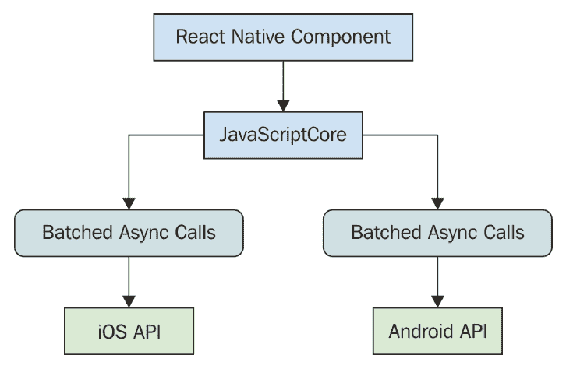

# 第十二章：为什么选择 React Native？

Facebook 创建了 React Native 来构建其移动应用程序。这样做的动机源于 React 在 Web 上非常成功的事实。如果 React 是如此适合 UI 开发的工具，并且您需要一个本机应用程序，那么为什么要反对呢？只需使 React 与本机移动操作系统 UI 元素配合工作即可！

在本章中，您将了解使用 React Native 构建本机移动 Web 应用程序的动机。

# 什么是 React Native？

在本书的前面，我介绍了渲染目标的概念-React 组件渲染到的东西。就 React 程序员而言，渲染目标是抽象的。例如，在 React 中，渲染目标可以是字符串，也可以是 DOM。这就是为什么您的组件从不直接与渲染目标进行交互的原因，因为您永远不能假设渲染发生的位置。

移动平台具有开发人员可以利用的 UI 小部件库，以构建该平台的应用程序。在 Android 上，开发人员实现 Java 应用程序，而在 iOS 上，开发人员实现 Swift 应用程序。如果您想要一个功能齐全的移动应用程序，您将不得不选择一个。但是，您需要学习两种语言，因为仅支持两个主要平台中的一个对于成功来说是不现实的。

对于 React 开发人员来说，这不是问题。您构建的相同 React 组件可以在各个地方使用，甚至可以在移动浏览器上使用！必须学习两种新编程语言来构建和发布移动应用程序是成本和时间上的障碍。解决此问题的方法是引入一个支持新渲染目标-本机移动 UI 小部件的新 React。

React Native 使用一种技术，该技术对底层移动操作系统进行异步调用，该操作系统调用本机小部件 API。有一个 JavaScript 引擎，React API 与 Web 上的 React 大部分相同。不同之处在于目标；而不是 DOM，这里有异步 API 调用。该概念在这里可视化：

这过于简化了底层发生的一切，但基本思想如下：

+   在 Web 上使用的 React 库与 React Native 使用的相同，并在 JavaScriptCore 中运行

+   发送到本机平台 API 的消息是异步的，并且为了性能目的而批处理

+   React Native 附带了为移动平台实现的组件，而不是 HTML 元素的组件

有关 React Native 的历史和机制的更多信息，请访问[`code.facebook.com/posts/1014532261909640`](https://code.facebook.com/posts/1014532261909640)。

# React 和 JSX 很熟悉

为 React 实现一个新的渲染目标并不简单。这本质上就像在 iOS 和 Android 上发明一个新的 DOM。那么为什么要经历这么多麻烦呢？

首先，移动应用程序的需求非常大。原因是移动网络浏览器的用户体验不如原生应用程序体验好。其次，JSX 是构建用户界面的绝佳工具。与其学习新技术，使用自己已经掌握的知识要容易得多。

后一点对你来说最相关。如果你正在阅读这本书，你可能对在 Web 应用程序和原生移动应用程序中使用 React 感兴趣。我无法用言语表达 React 在开发资源方面有多么宝贵。与其有一个团队做 Web UI，一个团队做 iOS，一个团队做 Android 等等，只需要一个了解 React 的 UI 团队。

# 移动浏览器体验

移动浏览器缺乏许多移动应用程序的功能。这是因为浏览器无法复制与 HTML 元素相同的本机平台小部件。你可以尝试这样做，但通常最好只使用本机小部件，而不是尝试复制它。部分原因是这样做需要更少的维护工作，部分原因是使用与平台一致的小部件意味着它们与平台的其他部分一致。例如，如果应用程序中的日期选择器看起来与用户在手机上与之交互的所有日期选择器不同，这不是一件好事。熟悉是关键，使用本机平台小部件使熟悉成为可能。

移动设备上的用户交互与通常为 Web 设计的交互基本不同。例如，Web 应用程序假设存在鼠标，并且按钮上的点击事件只是一个阶段。但是，当用户用手指与屏幕交互时，事情变得更加复杂。移动平台有所谓的手势系统来处理这些。React Native 比 Web 上的 React 更适合处理手势，因为它处理了在 Web 应用程序中不必过多考虑的这些类型的事情。

随着移动平台的更新，您希望您的应用程序的组件也保持更新。这对于 React Native 来说并不是问题，因为它们使用的是来自平台的实际组件。一次，一致性和熟悉度对于良好的用户体验至关重要。因此，当您的应用程序中的按钮看起来和行为方式与设备上的其他每个应用程序中的按钮完全相同时，您的应用程序就会感觉像设备的一部分。

# Android 和 iOS，不同但相同

当我第一次听说 React Native 时，我自动地认为它会是一种跨平台解决方案，可以让您编写一个单一的 React 应用程序，可以在任何设备上本地运行。在开始使用 React Native 之前，请摆脱这种思维方式。iOS 和 Android 在许多基本层面上是不同的。甚至它们的用户体验理念也不同，因此试图编写一个可以在两个平台上运行的单一应用程序是完全错误的。

此外，这并不是 React Native 的目标。目标是*React 组件无处不在*，而不是一次编写，随处运行。在某些情况下，您可能希望您的应用程序利用 iOS 特定的小部件或 Android 特定的小部件。这为特定平台提供了更好的用户体验，并应该超越组件库的可移植性。

在后面的章节中，您将学习有关组织特定于平台的模块的不同策略。

iOS 和 Android 之间有几个领域存在重叠，差异微不足道。这两个小部件旨在以大致相同的方式为用户完成相同的事情。在这些情况下，React Native 将为您处理差异并提供统一的组件。

# 移动 Web 应用的情况

在上一章中，您学会了如何实现移动优先的 React 组件。您的用户中并非每个人都愿意安装应用程序，特别是如果您的下载量和评分还不高的话。通过 Web 应用程序，用户的准入门槛要低得多——用户只需要一个浏览器。

尽管无法复制原生平台 UI 所提供的一切，但您仍然可以在移动 Web UI 中实现出色的功能。也许拥有一个良好的 Web UI 是提高移动应用程序下载量和评分的第一步。

理想情况下，您应该瞄准以下目标：

+   标准 Web（笔记本/台式机浏览器）

+   移动 Web（手机/平板浏览器）

+   移动应用（手机/平板原生平台）

在这三个领域中投入同样的努力可能并不明智，因为你的用户可能更偏爱其中一个领域。一旦你知道，例如，相对于 Web 版本，你的移动应用程序需求非常高，那么你就应该在那里投入更多的努力。

# 总结

在本章中，你了解到 React Native 是 Facebook 的一项努力，旨在重用 React 来创建本机移动应用程序。React 和 JSX 非常擅长声明 UI 组件，而现在对移动应用程序的需求非常大，因此使用你已经了解的 Web 知识是有意义的。

移动应用程序比移动浏览器更受欢迎的原因是它们的体验更好。Web 应用程序缺乏处理移动手势的能力，而且通常在外观和感觉上不像移动体验的一部分。

React Native 并不试图实现一个组件库，让你可以构建一个在任何移动平台上运行的单个 React 应用程序。iOS 和 Android 在许多重要方面都有根本的不同。在有重叠的地方，React Native 确实尝试实现共同的组件。现在我们可以使用 React 进行本地构建，那么我们是否会放弃移动 Web 应用程序？这可能永远不会发生，因为用户只能安装那么多应用程序。

现在你知道了 React Native 的主要目标是什么以及它的优势，接下来你将在下一章学习如何开始新的 React Native 项目。

# 测试你的知识

1.  React Native 的主要目标是什么？

1.  消除构建移动 Web 应用程序的需求。

1.  使 React 开发人员能够轻松将他们已经了解的构建 UI 组件的知识应用于构建本机移动应用程序。

1.  提供统一的用户体验跨所有移动平台。

1.  React Native 在 iOS 和 Android 上提供完全相同的体验吗？

1.  不，iOS 和 Android 有根本不同的用户体验。

1.  是的，你希望你的应用在 iOS 和 Android 上的功能完全相同。

1.  React Native 是否消除了对移动 Web 应用程序的需求？

1.  是的，如果你可以构建本机移动应用程序，就不需要移动 Web 应用程序。

1.  不，总会有移动 Web 应用程序的需求。当你需要本机移动应用程序时，React Native 就在那里。

# 进一步阅读

访问以下链接以获取更多信息：

+   [`facebook.github.io/react-native/`](https://facebook.github.io/react-native/)

+   [`code.facebook.com/posts/1014532261909640`](https://code.facebook.com/posts/1014532261909640)
