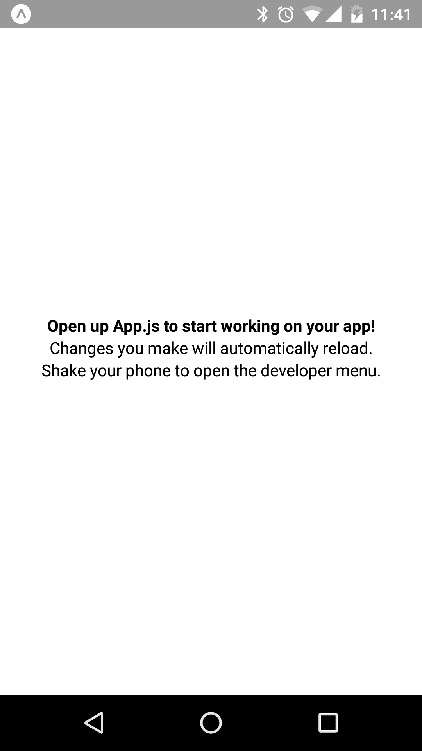

# 第十三章：启动 React Native 项目

在本章中，您将开始使用 React Native。幸运的是，`create-react-native-app`命令行工具已经为您处理了创建新项目所涉及的大部分样板。我将解释当您初始化一个空项目时实际为您创建了什么。然后，我将向您展示如何在 iOS 和 Android 模拟器上运行项目。

# 安装和使用`create-react-native-app`

创建 React Native 项目的首选工具是`create-react-native-app`。这个命令行工具是由 React Native 开发者社区创建的，并且遵循了`create-react-app`工具的步伐。`create-react-app`和`create-react-native-app`的目标是使开发人员能够快速启动他们的项目。您应该能够发出一个命令，生成运行您的 React 或 React Native 应用程序所必需的所有样板。

没有这种类型的工具，您最终会花费大量时间来配置项目的各个方面。首先，开发人员想要构建应用程序。您可以稍后进行配置和优化。

您应该全局安装`create-react-native-app`，因为这个工具不是针对您正在工作的任何一个项目的特定工具——它为您启动了项目。以下是您可以这样做的方法：

```jsx
npm install -g create-react-native-app
```

安装完成后，您将在终端中获得一个新的`create-react-native-app`命令。您可以使用这个命令来启动您的新 React Native 项目。

# 创建一个 React Native 应用程序

使用`create-react-native-app`启动一个新的 React Native 项目涉及调用`create-react-native-app`命令，并将应用程序的名称作为参数传递进去。例如：

```jsx
create-react-native-app my-project
```

这将导致创建一个`my-project`目录。这里将包含`create-react-native-app`为您创建的所有样板代码和其他文件。这也是您将找到`node_modules`目录的地方，其中安装了所有的依赖项。

当您运行此命令时，您将看到类似于以下内容的输出：

```jsx
Creating a new React Native app in Chapter13/my-project. Using package manager as npm with npm interface. Installing packages. This might take a couple minutes. Installing react-native-scripts... + react-native-scripts@1.14.0 added 442 packages from 477 contributors and audited 1178 packages in 19.128s Installing dependencies using npm... Success! Created my-project at Chapter13/my-project Inside that directory, you can run several commands:
  npm start
 Starts the development server so you can open your app in the Expo app on your phone.  npm run ios
 (Mac only, requires Xcode) Starts the development server and loads your app in an iOS simulator.  npm run android
 (Requires Android build tools) Starts the development server and loads your app on a connected Android device or emulator.  npm test
 Starts the test runner.  npm run eject
 Removes this tool and copies build dependencies, configuration files and scripts into the app directory. If you do this, you can’t go back! We suggest that you begin by typing:
  cd my-project
  npm start Happy hacking!
```

输出显示了安装依赖项时正在进行的操作，以及准备立即运行的命令。此时，您已经准备好启动您的应用程序。

# 运行您的应用程序

当您使用`create-react-native-app`来引导您的 React Native 项目时，会将几个命令添加到您的`package.json`文件中。这些列在命令输出中（请参阅前一节，了解此输出的外观）。您将使用的最常见的命令是`start`：

```jsx
npm start
```

这个命令将启动打包进程。当您更新源代码时，此过程将构建原生 UI 组件。它不会为实际的目标平台执行本机构建，因为这在性能上会太昂贵。相反，它将高效地构建您的应用程序，以便与各种模拟器一起使用开发：

```jsx
Here's what the output of npm start looks like:
Starting packager... Packager started!
Your app is now running at URL: exp://192.168.86.21:19000 View your app with live reloading:
 Android device:
    -> Point the Expo app to the QR code above.
       (You'll find the QR scanner on the Projects tab of the app.)
  iOS device:
    -> Press s to email/text the app URL to your phone.   Emulator:
    -> Press a (Android) or i (iOS) to start an emulator. Your phone will need to be on the same local network as this computer.
For links to install the Expo app, please visit https://expo.io. Logs from serving your app will appear here. Press Ctrl+C at any time to stop.
 › Press a to open Android device or emulator, or i to open iOS emulator.
 › Press s to send the app URL to your phone number or email address
 › Press q to display QR code.  › Press r to restart packager, or R **to restart packager and clear cache.**
 **› Press d to toggle development mode. (current mode: development)** 
```

有许多选项可供您模拟您的原生应用程序。默认情况下，您处于开发模式 - 您可能会保持在开发模式。在前面的输出中没有显示的是，输出还包括一个 QR 码，您可以使用 Expo 移动应用程序扫描。

# 安装和使用 Expo

**Expo**移动应用程序是一个工具，您可以用它来辅助 React Native 开发。`npm start`命令启动 React Native 包，它与 Expo 无缝集成（前提是设备与打包程序在同一网络上）。这使您能够在开发过程中在真实移动设备上查看和交互您的应用程序。当您对源代码进行更改时，它甚至支持实时重新加载。

Expo 与移动设备模拟器不同，它使您能够以与用户体验相同的方式体验应用程序。虚拟设备模拟器给出了一个粗略的近似值，但这并不等同于手持设备。此外，并非每个人都有 Macbook，这是模拟 iOS 设备的要求。

您可以通过在 Android 设备上搜索 Play 商店或在 iOS 设备上搜索 App Store 来找到 Expo 应用程序。


当您启动 Expo 时，您将看到一个扫描 QR 码的选项：


当您选择扫描 QR 码时，您手机的摄像头可以扫描终端中打印的 QR 码。这是您将计算机上运行的 React Native 打包程序与您的设备连接的方式。如果您无法扫描 QR 码，您可以通过电子邮件将 Expo 链接发送到您的手机上，在手机上点击它与扫描 QR 码是一样的。

当在 Expo 中打开`my-project`应用程序时，应该是这样的：


让我们来看看由`create-react-native-app`为您创建的`App.js`模块：

```jsx
import React from 'react';
import { StyleSheet, Text, View } from 'react-native';

export default class App extends React.Component {
  render() {
    return (
      <View style={styles.container}>
        <Text>Open up App.js to start working on your app!</Text>
        <Text>Changes you make will automatically reload.</Text>
        <Text>Shake your phone to open the developer menu.</Text>
      </View>
    );
  }
}

const styles = StyleSheet.create({
  container: {
    flex: 1,
    backgroundColor: '#fff',
    alignItems: 'center',
    justifyContent: 'center'
  }
});
```

这个`App`组件将在屏幕上呈现三行文本，并对`View`组件应用一些样式。让我们对第一行进行更改，使文本加粗：

```jsx
import React from 'react';
import { StyleSheet, Text, View } from 'react-native';

export default class App extends React.Component {
  render() {
    return (
      <View style={styles.container}>
        <Text style={styles.bold}>
          Open up App.js to start working on your app!
        </Text>
        <Text>Changes you make will automatically reload.</Text>
        <Text>Shake your phone to open the developer menu.</Text>
      </View>
    );
  }
}

const styles = StyleSheet.create({
  container: {
    flex: 1,
    backgroundColor: '#fff',
    alignItems: 'center',
    justifyContent: 'center'
  },
  bold: {
    fontWeight: 'bold'
  }
});
```

现在样式中有一个加粗样式，并且这被应用到了第一个`Text`组件的样式属性上。如果您再次查看手机，您会注意到应用程序已更新：



更改立即反映在您设备上的应用程序中。

# 使用模拟器

您并不总是随身携带手机，事实上，在开发过程中并不总是需要在物理移动设备上查看您的应用程序。另一个选择是使用模拟物理移动设备的虚拟设备模拟器。React Native 打包程序与模拟器通信的方式与其与 Expo 应用程序通信的方式相同，以支持实时重新加载。

# iOS 模拟器

启动 React Native 打包程序后，按“i”键即可启动 iOS 模拟器。您将看到类似于这样的输出：

```jsx
2:06:04 p.m.: Starting iOS... 2:06:22 p.m.: Finished building JavaScript bundle in 1873ms 2:06:23 p.m.: Running app on Adam in development mode
```

然后，您将看到一个新窗口打开，模拟设备正在运行您的应用程序：


对应用程序源的实时更新与 Expo 应用程序的工作方式相同。更改会在模拟器中自动反映。 

# Android 模拟器

Android 模拟器的启动方式与 iOS 模拟器相同。在运行 React Native 打包程序的终端中，按“A”键。但是，有一个警告 - 您必须在启动 React Native 包内的应用程序之前启动 Android 设备模拟器。如果不这样做，当您按“A”键时，您将看到类似于这样的消息：

```jsx
2:37:02 p.m.: Starting Android... Error running adb: No Android device found.
```

这在过去一直是 Android 上难以做到的。现在，借助 Android Studio 的帮助，启动 Android 设备模拟器变得简单得多。一旦安装了 Android Studio，您可以打开 Android 虚拟设备管理器并添加任何您喜欢的设备：


您可以单击“创建虚拟设备”按钮来创建一个新设备：


一旦您创建了要在其上测试 React Native 应用程序的设备，您可以单击绿色播放按钮。这将启动模拟器：


如果你回到运行 React Native 打包程序的终端并按下"a"，你应该会看到以下输出：

```jsx
2:49:07 p.m.: Starting Android... 2:49:08 p.m.: Finished building JavaScript bundle in 17ms 2:49:10 p.m.: Running app on Android SDK built for x86 in development mode
```

如果你回到你的 Android 模拟器，你的 React Native 应用应该已经启动了：


就像 Expo 应用程序和 iOS 模拟器一样，这个模拟器将随着应用程序源代码的更改而实时重新加载，这要归功于 React Native 打包程序。

# 总结

在本章中，你学会了如何使用`create-react-native-app`工具启动你的 React。你学会了如何在系统上安装该工具，并使`create-react-native-app`命令对你创建的任何 React Native 项目可用。然后，你使用该命令启动了一个基本项目。接下来，你在项目中启动了 React Native 打包程序进程。

你学会了如何在移动设备上安装 Expo 应用程序以及如何将其与 React Native 打包程序连接。然后，你进行了代码更改，以演示实时重新加载的工作原理。最后，你学会了如何使用 React Native 打包程序启动 iOS 和 Android 模拟器。

在下一章中，你将学习如何在 React Native 应用程序中构建灵活的布局。

# 测试你的知识

1.  `create-react-native-app`工具是由 Facebook 创建的

1.  是的，`create-react-native-app`从一开始就存在

1.  不，这是一个社区支持的工具，跟随**`create-react-app`**的脚步

1.  为什么你应该全局安装`create-react-native-app`？

1.  因为没有办法在本地安装它

1.  你不应该。只在本地安装它

1.  因为这是一个用于生成项目样板的工具，实际上并不是项目的一部分

1.  一切都应该全局安装。

1.  Expo 应用程序在移动设备上的作用是什么？

1.  这是一个增强 React Native 应用程序的库

1.  这是一个帮助开发人员在开发过程中在移动设备上运行他们的应用程序的工具，开销非常小

1.  这是一个可以在目标设备上本地构建项目并安装的工具

1.  React Native 打包程序能够模拟 iOS 和 Android 设备

1.  它不会这样做，但它会与 iOS 和 Android 模拟器通信以运行应用程序

1.  是的，模拟器是 React Native 的一部分

# 进一步阅读

查看以下链接以了解更多信息：

+   [`developer.apple.com/xcode/`](https://developer.apple.com/xcode/)

+   [`developer.android.com/studio/`](https://developer.android.com/studio/)

+   [`expo.io/`](https://expo.io/)

+   [`github.com/react-community/create-react-native-app`](https://github.com/react-community/create-react-native-app)
