# 第十四章：使用 Flexbox 构建响应式布局

在本章中，您将体会到在移动设备屏幕上布局组件的感觉。幸运的是，React Native 为许多您过去可能在 Web 应用程序中使用的 CSS 属性提供了 polyfill。您将学习如何使用 flexbox 模型来布局我们的 React Native 屏幕。

在深入实现布局之前，您将简要介绍 flexbox 和在 React Native 应用程序中使用 CSS 样式属性——这与常规 CSS 样式表不太一样。然后，您将使用 flexbox 实现几个 React Native 布局。

# Flexbox 是新的布局标准

在 CSS 引入灵活的盒子布局模型之前，用于构建布局的各种方法都感觉很巧妙，并且容易出错。Flexbox 通过抽象化许多通常需要提供的属性来修复这一问题，以使布局正常工作。

实质上，flexbox 就是其字面意思——一个灵活的盒子模型。这就是 flexbox 的美妙之处——它的简单性。您有一个充当容器的盒子，以及该盒子内的子元素。容器和子元素在屏幕上的呈现方式都是灵活的，如下所示：

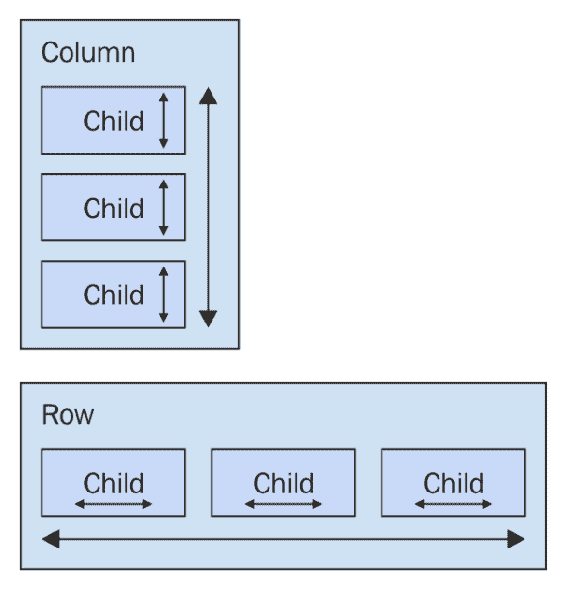

Flexbox 容器有一个方向，可以是列（上/下）或行（左/右）。当我第一次学习 flexbox 时，这实际上让我感到困惑：我的大脑拒绝相信行是从左到右移动的。行是堆叠在彼此上面的！要记住的关键是，这是盒子伸展的方向，而不是盒子在屏幕上放置的方向。

有关 flexbox 概念的更深入的处理，请查看此页面：[`css-tricks.com/snippets/css/a-guide-to-flexbox/`](https://css-tricks.com/snippets/css/a-guide-to-flexbox/)。

# 介绍 React Native 样式

是时候实现您的第一个 React Native 应用程序了，超出了`create-react-native-app`生成的样板。我希望在您开始在下一节中实现 flexbox 布局之前，您能够确保在使用 React Native 样式表时感到舒适。以下是 React Native 样式表的样子：

```jsx
import { Platform, StyleSheet, StatusBar } from 'react-native';

// Exports a "stylesheet" that can be used
// by React Native components. The structure is
// familiar for CSS authors.
const styles = StyleSheet.create({
  container: {
    flex: 1,
    justifyContent: 'center',
    alignItems: 'center',
    backgroundColor: 'ghostwhite',
    ...Platform.select({
      ios: { paddingTop: 20 },
      android: { paddingTop: StatusBar.currentHeight }
    })
  },

  box: {
    width: 100,
    height: 100,
    justifyContent: 'center',
    alignItems: 'center',
    backgroundColor: 'lightgray'
  },

  boxText: {
    color: 'darkslategray',
    fontWeight: 'bold'
  }
});

export default styles; 
```

这是一个 JavaScript 模块，而不是 CSS 模块。如果要声明 React Native 样式，需要使用普通对象。然后，调用`StyleSheet.create()`并从样式模块导出它。

正如你所看到的，这个样式表有三种样式：`container`、`box`和`boxText`。在容器样式中，有一个调用`Platform.select()`的方法：

```jsx
...Platform.select({
  ios: { paddingTop: 20 },
  android: { paddingTop: StatusBar.currentHeight }
})
```

这个函数将根据移动设备的平台返回不同的样式。在这里，你正在处理顶层容器视图的顶部填充。你可能会在大多数应用中使用这段代码，以确保你的 React 组件不会渲染在设备的状态栏下面。根据平台的不同，填充将需要不同的值。如果是 iOS，`paddingTop`是`20`。如果是 Android，`paddingTop`将是`StatusBar.currentHeight`的值。

前面的`Platform.select()`代码是一个例子，说明你需要为平台的差异实现一个解决方法。例如，如果`StatusBar.currentHeight`在 iOS 和 Android 上都可用，你就不需要调用`Platform.select()`。

让我们看看这些样式是如何被导入并应用到 React Native 组件的：

```jsx
import React from 'react';
import { Text, View } from 'react-native';

// Imports the "styles" stylesheet from the
// "styles" module.
import styles from './styles';

// Renders a view with a square in the middle, and
// some text in the middle of that. The "style" property
// is passed a value from the "styles" stylesheet.
export default () => (
  <View style={styles.container}>
    <View style={styles.box}>
      <Text style={styles.boxText}>I'm in a box</Text>
    </View>
  </View>
); 
```

这些样式通过`style`属性分配给每个组件。你正在尝试渲染一个带有一些文本的框在屏幕中间。让我们确保这看起来和我们期望的一样：

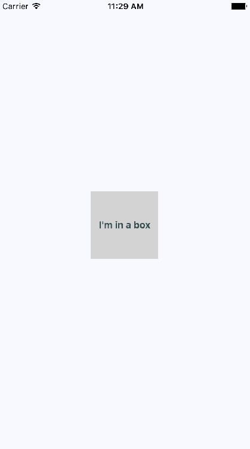

太棒了！现在你已经知道如何在 React Native 元素上设置样式，是时候开始创建一些屏幕布局了。

# 构建 flexbox 布局

在这一部分，你将了解在 React Native 应用中可以使用的几种潜在布局。我想远离一个布局比其他布局更好的想法。相反，我会向你展示 flexbox 布局模型对于移动屏幕有多么强大，这样你就可以设计最适合你的应用的布局。

# 简单的三列布局

首先，让我们实现一个简单的布局，其中有三个部分在列的方向上弹性伸缩（从上到下）。让我们先来看一下结果屏幕：

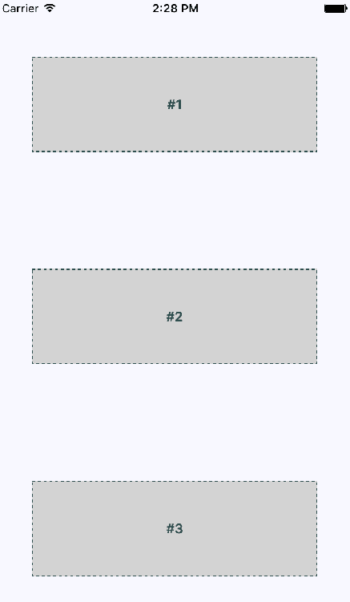

这个例子的想法是，你已经为三个屏幕部分设置了样式和标签，使它们突出显示。换句话说，在真实应用中，这些组件不一定会有任何样式，因为它们用于在屏幕上排列其他组件。

让我们来看一下用于创建此屏幕布局的组件：

```jsx
import React from 'react';
import { Text, View } from 'react-native';

import styles from './styles';

// Renders three "column" sections. The "container"
// view is styled so that it's children flow from
// the top of the screen, to the bottom of the screen.
export default () => (
  <View style={styles.container}>
    <View style={styles.box}>
      <Text style={styles.boxText}>#1</Text>
    </View>
    <View style={styles.box}>
      <Text style={styles.boxText}>#2</Text>
    </View>
    <View style={styles.box}>
      <Text style={styles.boxText}>#3</Text>
    </View>
  </View>
); 
```

容器视图（最外层的 `<View>` 组件）是列，子视图是行。`<Text>` 组件用于标记每一行。在 HTML 元素方面，`<View>` 类似于 `<div>`，而 `<Text>` 类似于 `<p>`。

也许这个例子本来可以被称为“三行布局”，因为它有三行。但与此同时，三个布局部分都在其所在的列的方向上伸展。使用对你来说最有概念意义的命名约定。

现在让我们看一下用于创建此布局的样式：

```jsx
import { Platform, StyleSheet, StatusBar } from 'react-native';

// Exports a "stylesheet" that can be used
// by React Native components. The structure is
// familiar for CSS authors.
export default StyleSheet.create({
  // The "container" for the whole screen.
  container: {
    // Enables the flexbox layout model...
    flex: 1,
    // Tells the flexbox to render children from
    // top to bottom...
    flexDirection: 'column',
    // Aligns children to the center on the container...
    alignItems: 'center',
    // Defines the spacing relative to other children...
    justifyContent: 'space-around',
    backgroundColor: 'ghostwhite',
    ...Platform.select({
      ios: { paddingTop: 20 },
      android: { paddingTop: StatusBar.currentHeight }
    })
  },

  box: {
    width: 300,
    height: 100,
    justifyContent: 'center',
    alignItems: 'center',
    backgroundColor: 'lightgray',
    borderWidth: 1,
    borderStyle: 'dashed',
    borderColor: 'darkslategray'
  },

  boxText: {
    color: 'darkslategray',
    fontWeight: 'bold'
  }
}); 
```

`container` 的 `flex` 和 `flexDirection` 属性使得行的布局从上到下流动。`alignItems` 和 `justifyContent` 属性将子元素对齐到容器的中心，并在它们周围添加空间。

让我们看看当你将设备从竖屏旋转到横屏时，这个布局是什么样子的：

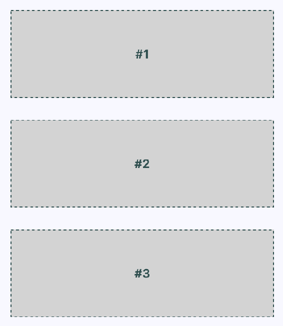

flexbox 自动找到了如何为你保留布局。但是，你可以稍微改进一下。例如，横屏模式现在左右有很多浪费的空间。你可以为渲染的盒子创建自己的抽象。

# 改进后的三列布局

我认为你可以从上一个例子中改进一些东西。让我们修复样式，使得 flexbox 的子元素能够充分利用可用空间。还记得上一个例子中，当你将设备从竖屏旋转到横屏时发生了什么吗？有很多空间被浪费了。让组件自动调整会很好。下面是新样式模块的样子：

```jsx
import { Platform, StyleSheet, StatusBar } from 'react-native';

const styles = StyleSheet.create({
  container: {
    flex: 1,
    flexDirection: 'column',
    backgroundColor: 'ghostwhite',
    alignItems: 'center',
    justifyContent: 'space-around',
    ...Platform.select({
      ios: { paddingTop: 20 },
      android: { paddingTop: StatusBar.currentHeight }
    })
  },

  box: {
    height: 100,
    justifyContent: 'center',
    // Instead of given the flexbox child a width, we
    // tell it to "stretch" to fill all available space.
    alignSelf: 'stretch',
    alignItems: 'center',
    backgroundColor: 'lightgray',
    borderWidth: 1,
    borderStyle: 'dashed',
    borderColor: 'darkslategray'
  },

  boxText: {
    color: 'darkslategray',
    fontWeight: 'bold'
  }
});

export default styles; 
```

这里的关键变化是 `alignSelf` 属性。这告诉具有 `box` 样式的元素改变宽度或高度（取决于其容器的 `flexDirection`）以填充空间。此外，`box` 样式不再定义 `width` 属性，因为现在将动态计算它。在竖屏模式下，各个部分的样子如下：

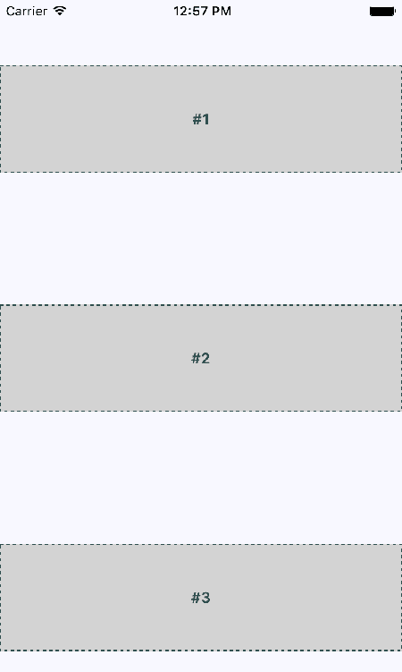

现在每个部分都占据了屏幕的整个宽度，这正是你希望发生的。浪费空间的问题实际上在横屏模式下更为突出，所以让我们旋转设备，看看这些部分现在会发生什么：

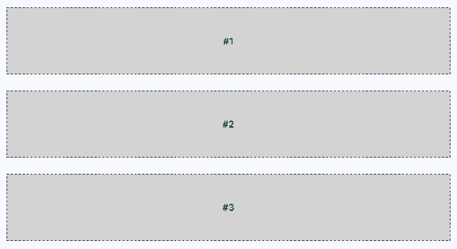

现在你的布局利用了整个屏幕的宽度，不管方向如何。最后，让我们实现一个适当的`Box`组件，可以被`App.js`使用，而不是在原地重复样式属性。`Box`组件的样子如下：

```jsx
import React from 'react';
import { PropTypes } from 'prop-types';
import { View, Text } from 'react-native';

import styles from './styles';

// Exports a React Native component that
// renders a "<View>" with the "box" style
// and a "<Text>" component with the "boxText"
// style.
const Box = ({ children }) => (
  <View style={styles.box}>
    <Text style={styles.boxText}>{children}</Text>
  </View>
);

Box.propTypes = {
  children: PropTypes.node.isRequired
};

export default Box; 
```

现在你已经有了一个不错的布局的开端。接下来，你将学习如何在另一个方向上进行弹性布局——从左到右。

# 灵活的行

在这一节中，你将学习如何使屏幕布局部分从上到下延伸。为此，你需要一个灵活的行。这个屏幕的样式如下：

```jsx
import { Platform, StyleSheet, StatusBar } from 'react-native';

const styles = StyleSheet.create({
  container: {
    flex: 1,
    // Tells the child elements to flex from left to
    // right...
    flexDirection: 'row',
    backgroundColor: 'ghostwhite',
    alignItems: 'center',
    justifyContent: 'space-around',
    ...Platform.select({
      ios: { paddingTop: 20 },
      android: { paddingTop: StatusBar.currentHeight }
    })
  },

  box: {
    width: 100,
    justifyContent: 'center',
    alignSelf: 'stretch',
    alignItems: 'center',
    backgroundColor: 'lightgray',
    borderWidth: 1,
    borderStyle: 'dashed',
    borderColor: 'darkslategray'
  },

  boxText: {
    color: 'darkslategray',
    fontWeight: 'bold'
  }
});

export default styles; 
```

这是`App`组件，使用了你在上一节中实现的`Box`组件：

```jsx
import React from 'react';
import { Text, View, StatusBar } from 'react-native';

import styles from './styles';
import Box from './Box';

// Renders a single row with two boxes that stretch
// from top to bottom.
export default () => (
  <View style={styles.container}>
    <Box>#1</Box>
    <Box>#2</Box>
  </View>
); 
```

这是纵向模式下的屏幕效果：

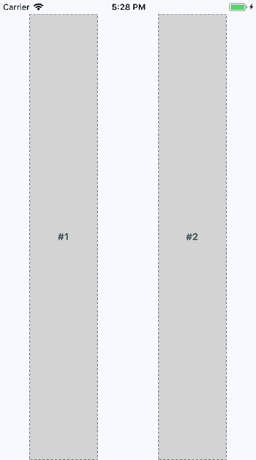

这两列从屏幕顶部一直延伸到屏幕底部，这是因为`alignSelf`属性，它实际上并没有指定要延伸的方向。这两个`Box`组件从上到下延伸，因为它们显示在一个弹性行中。注意这两个部分之间的间距是从左到右的吗？这是因为容器的`flexDirection`属性，它的值是`row`。

现在让我们看看当屏幕旋转到横向方向时，这种弹性方向对布局的影响：

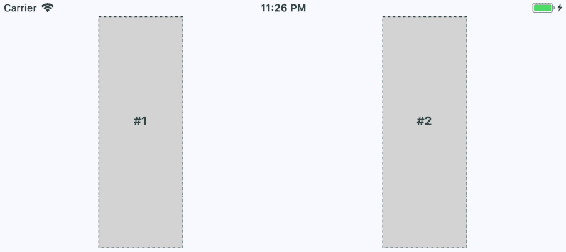

由于弹性盒模型具有`justifyContent`样式属性值为`space-around`，空间被比例地添加到左侧、右侧和部分之间。

# 灵活的网格

有时，你需要一个像网格一样流动的屏幕布局。例如，如果你有几个宽度和高度相同的部分，但你不确定会渲染多少个这样的部分呢？弹性盒模型使得从左到右流动的行的构建变得容易，直到屏幕的末端。然后，它会自动继续从左到右在下一行渲染元素。

这是纵向模式下的一个布局示例：

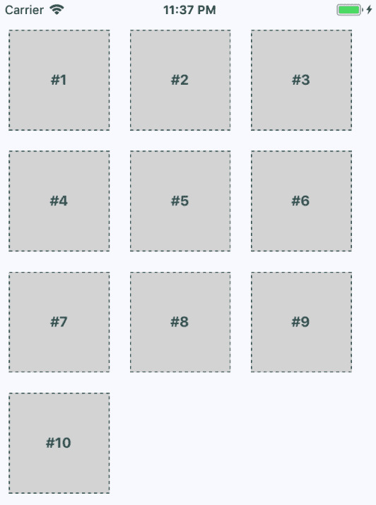

这种方法的美妙之处在于，你不需要提前知道每一行有多少列。每个子元素的尺寸决定了每一行可以容纳多少个元素。让我们来看一下用于创建这个布局的样式：

```jsx
import { Platform, StyleSheet, StatusBar } from 'react-native';

export default StyleSheet.create({
  container: {
    flex: 1,
    flexDirection: 'row',
    flexWrap: 'wrap',
    backgroundColor: 'ghostwhite',
    alignItems: 'center',
    ...Platform.select({
      ios: { paddingTop: 20 },
      android: { paddingTop: StatusBar.currentHeight }
    })
  },

  box: {
    height: 100,
    width: 100,
    justifyContent: 'center',
    alignItems: 'center',
    backgroundColor: 'lightgray',
    borderWidth: 1,
    borderStyle: 'dashed',
    borderColor: 'darkslategray',
    margin: 10
  },

  boxText: {
    color: 'darkslategray',
    fontWeight: 'bold'
  }
}); 
```

这是渲染每个部分的`App`组件：

```jsx
import React from 'react';
import { View, StatusBar } from 'react-native';

import styles from './styles';
import Box from './Box';

// An array of 10 numbers, representing the grid
// sections to render.
const boxes = new Array(10).fill(null).map((v, i) => i + 1);

export default () => (
  <View style={styles.container}>
    <StatusBar hidden={false} />
    {/* Renders 10 "<Box>" sections */}
    {boxes.map(i => <Box key={i}>#{i}</Box>)}
  </View>
); 
```

最后，让我们确保横向方向与这个布局兼容：

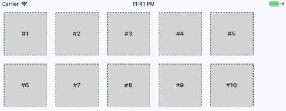你可能已经注意到右侧有一些多余的空间。请记住，这些部分只在本书中可见，因为我们希望它们可见。在真实的应用中，它们只是其他 React Native 组件的分组。但是，如果屏幕右侧的空间成为问题，请尝试调整子组件的边距和宽度。

# 灵活的行和列

在本章的最后一节中，您将学习如何将行和列组合在一起，为应用程序创建复杂的布局。例如，有时您需要能够在行内嵌套列或在列内嵌套行。让我们看看一个应用程序的`App`组件，它在行内嵌套列：

```jsx
import React from 'react';
import { View, StatusBar } from 'react-native';

import styles from './styles';
import Row from './Row';
import Column from './Column';
import Box from './Box';

export default () => (
  <View style={styles.container}>
    <StatusBar hidden={false} />
    {/* This row contains two columns. The first column
        has boxes "#1" and "#2". They will be stacked on
        top of one another. The next column has boxes "#3"
        and "#4", which are also stacked on top of one
        another */}
    <Row>
      <Column>
        <Box>#1</Box>
        <Box>#2</Box>
      </Column>
      <Column>
        <Box>#3</Box>
        <Box>#4</Box>
      </Column>
    </Row>
    <Row>
      <Column>
        <Box>#5</Box>
        <Box>#6</Box>
      </Column>
      <Column>
        <Box>#7</Box>
        <Box>#8</Box>
      </Column>
    </Row>
    <Row>
      <Column>
        <Box>#9</Box>
        <Box>#10</Box>
      </Column>
      <Column>
        <Box>#11</Box>
        <Box>#12</Box>
      </Column>
    </Row>
  </View>
); 
```

你已经为布局部分（`<Row>`和`<Column>`）和内容部分（`<Box>`）创建了抽象。让我们看看这个屏幕是什么样子的：

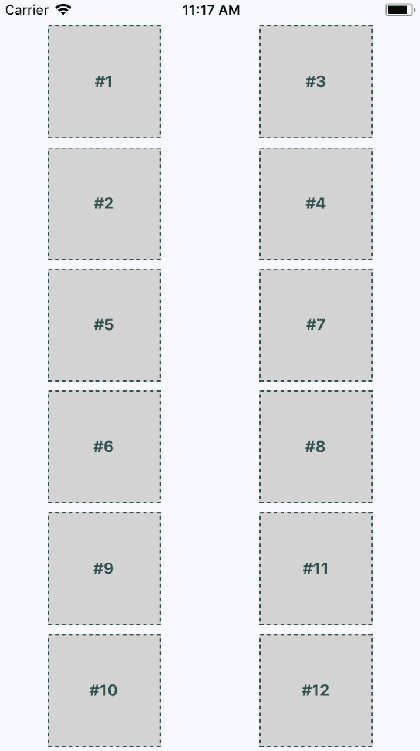

这个布局可能看起来很熟悉，因为你在本章中已经做过了。关键区别在于这些内容部分的排序方式。例如，#2 不会放在#1 的左侧，而是放在下面。这是因为我们将#1 和#2 放在了`<Column>`中。#3 和#4 也是一样。这两列放在了一行中。然后下一行开始，依此类推。

通过嵌套行 flexbox 和列 flexbox，您可以实现许多可能的布局之一。现在让我们看看`Row`组件：

```jsx
import React from 'react';
import PropTypes from 'prop-types';
import { View } from 'react-native';

import styles from './styles';

// Renders a "View" with the "row" style applied to
// it. It's "children" will flow from left to right.
const Row = ({ children }) => (
  <View style={styles.row}>{children}</View>
);

Row.propTypes = {
  children: PropTypes.node.isRequired
};

export default Row; 
```

这个组件将`<View>`组件应用了`row`样式。最终结果是在创建复杂布局时，`App`组件中的 JSX 标记更清晰。最后，让我们看看`Column`组件：

```jsx
import React from 'react';
import PropTypes from 'prop-types';
import { View } from 'react-native';

import styles from './styles';

// Renders a "View" with the "column" style applied
// to it. It's children will flow from top-to-bottom.
const Column = ({ children }) => (
  <View style={styles.column}>{children}</View>
);

Column.propTypes = {
  children: PropTypes.node.isRequired
};

export default Column; 
```

这看起来就像`Row`组件，只是应用了不同的样式。它也和`Row`有相同的作用 - 为其他组件的布局提供更简单的 JSX 标记。

# 总结

本章向您介绍了 React Native 中的样式。虽然您可以使用许多您习惯的 CSS 样式属性，但在 Web 应用程序中使用的 CSS 样式表看起来非常不同。换句话说，它们由普通的 JavaScript 对象组成。

然后，您学习了如何使用主要的 React Native 布局机制 - flexbox。这是如今布局大多数 Web 应用程序的首选方式，因此能够在原生应用中重用这种方法是有意义的。您创建了几种不同的布局，并看到它们在纵向和横向方向上的外观。

在接下来的章节中，你将开始为你的应用实现导航。

# 测试你的知识

1.  CSS 样式和 React Native 组件使用的样式有什么区别？

1.  React Native 与 CSS 共享许多样式属性。样式属性在 React Native 中以普通对象属性的形式表达

1.  没有区别——你可以像其他 React 组件一样样式化 React Native 组件

1.  它们完全不同——React Native 不与 CSS 共享任何样式属性

1.  为什么在设计布局时需要考虑状态栏？

1.  你不需要考虑状态栏

1.  因为状态栏可能会干扰你的 iOS 组件

1.  因为状态栏可能会干扰你的 Android 组件

1.  什么是弹性盒模型？

1.  它是用于控制 View 组件如何伸缩以占据布局中的水平空间的模型

1.  它提供了灵活的列，可以响应屏幕方向的变化

1.  弹性盒布局模型用于以一种抽象方式布置组件，并在布局变化时自动伸缩

1.  在考虑布局选项时，屏幕方向是否是一个因素？

1.  是的，你总是需要确保在开发过程中，横向或纵向方向没有意外

1.  不，方向细节会被处理，这样你就可以专注于应用功能

# 进一步阅读

点击以下链接获取更多信息：

+   [`facebook.github.io/react-native/docs/flexbox`](https://facebook.github.io/react-native/docs/flexbox)

+   [`facebook.github.io/react-native/docs/statusbar`](https://facebook.github.io/react-native/docs/statusbar)

+   [`facebook.github.io/react-native/docs/stylesheet`](https://facebook.github.io/react-native/docs/stylesheet)
