# 第十五章：在屏幕之间导航

本章的重点是在 React Native 应用程序中导航到组成应用程序的屏幕之间。原生应用程序中的导航与 Web 应用程序中的导航略有不同——主要是因为用户没有任何 URL 的概念。在之前的 React Native 版本中，有原始的导航器组件，可以用来控制屏幕之间的导航。这些组件存在一些挑战，导致需要更多的代码来完成基本的导航任务。

最近的 React Native 版本鼓励你使用`react-navigation`包，这将是本章的重点，尽管还有其他几个选项。你将学习导航基础知识，向屏幕传递参数，更改标题内容，使用选项卡和抽屉导航，以及处理导航状态。

# 导航基础知识

让我们从使用`react-navigation`进行从一个页面到另一个页面的基础知识开始。`App`组件的外观如下：

```jsx
import { createStackNavigator } from 'react-navigation';
import Home from './Home';
import Settings from './Settings';

export default createStackNavigator(
  {
    Home,
    Settings
  },
  { initialRouteName: 'Home' }
);
```

`createStackNavigator()`函数是设置导航所需的全部内容。这个函数的第一个参数是一个屏幕组件的映射，可以进行导航。第二个参数是更一般的导航选项——在这种情况下，你告诉导航器`Home`应该是默认的屏幕组件。

`Home`组件的外观如下：

```jsx
import React from 'react';
import { View, Text, Button } from 'react-native';

import styles from './styles';

export default ({ navigation }) => (
  <View style={styles.container}>
    <Text>Home Screen</Text>
    <Button
      title="Settings"
      onPress={() => navigation.navigate('Settings')}
    />
  </View>
);
```

这是您典型的功能性 React 组件。你可以在这里使用基于类的组件，但没有必要，因为没有生命周期方法或状态。它呈现了一个应用了容器样式的`View`组件。接下来是一个标记屏幕的`Text`组件，后面是一个`Button`组件。屏幕可以是任何你想要的东西——它只是一个常规的 React Native 组件。导航器组件为你处理路由和屏幕之间的过渡。

这个按钮的`onPress`处理程序在点击时导航到`Settings`屏幕。这是通过调用`navigation.navigate('Settings')`来实现的。`navigation`属性是由`react-navigation`传递给屏幕组件的，并包含你需要的所有路由功能。与在 React web 应用程序中使用 URL 不同，在这里你调用导航器 API 函数并传递屏幕的名称。

接下来，让我们来看看`Settings`组件：

```jsx
import React from 'react';
import { View, Text, Button } from 'react-native';

import styles from './styles';

export default ({ navigation }) => (
  <View style={styles.container}>
    <Text>Settings Screen</Text>
    <Button
      title="Home"
      onPress={() => navigation.navigate('Home')}
    />
  </View>
);
```

这个组件就像`主页`组件一样，只是文本不同，当点击按钮时，您会被带回到`主页`屏幕。

这就是`主页`屏幕的样子：

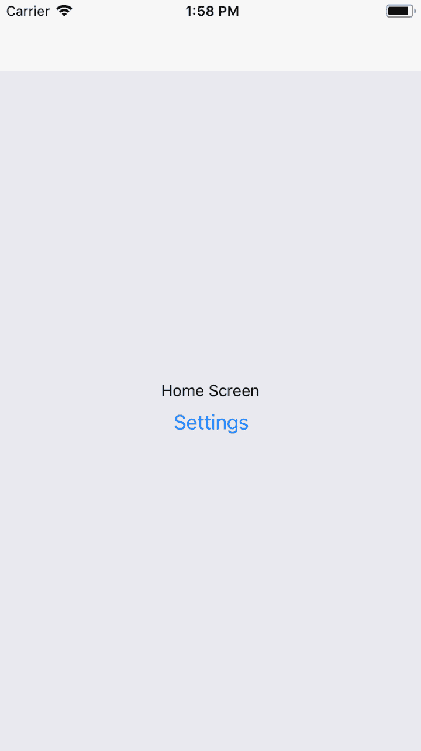

您可以单击**设置**按钮，然后将被带到`设置`屏幕，看起来像这样：

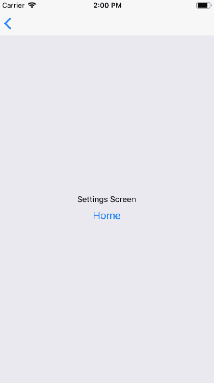

这个屏幕看起来几乎和`主页`屏幕一样。它有不同的文本和一个不同的按钮，当点击时会带您回到`主页`屏幕。但是，还有另一种方法可以回到`主页`屏幕。看一下屏幕顶部，您会注意到一个白色的导航栏。在导航栏的左侧，有一个返回箭头。这就像 Web 浏览器中的返回按钮一样，会带您回到上一个屏幕。`react-navigation`的好处在于它会为您渲染这个导航栏。

有了这个导航栏，您不必担心布局样式如何影响状态栏。您只需要担心每个屏幕内的布局。

如果您在 Android 上运行此应用程序，您将在导航栏中看到相同的返回按钮。但您也可以使用大多数 Android 设备上应用程序外部找到的标准返回按钮。

# 路由参数

当您开发 React Web 应用程序时，一些路由中有动态数据。例如，您可以链接到一个详情页面，在 URL 中，您会有某种标识符。然后组件就有了渲染特定详细信息所需的内容。相同的概念也存在于`react-navigation`中。您不仅可以指定要导航到的屏幕的名称，还可以传递额外的数据。

让我们看看路由参数的实际应用，从`App`组件开始：

```jsx
import { createStackNavigator } from 'react-navigation';
import Home from './Home';
import Details from './Details';

export default createStackNavigator(
  {
    Home,
    Details
  },
  { initialRouteName: 'Home' }
);
```

这看起来和前面的例子一样，只是没有`设置`页面，而是有一个`详情`页面。这是您想要动态传递数据的页面，以便它可以呈现适当的信息。首先，让我们看看`主页`屏幕组件：

```jsx
import React from 'react';
import { View, Text, Button } from 'react-native';

import styles from './styles';

export default ({ navigation }) => (
  <View style={styles.container}>
    <Text>Home Screen</Text>
    <Button
      title="First Item"
      onPress={() =>
        navigation.navigate('Details', { title: 'First Item' })
      }
    />
    <Button
      title="Second Item"
      onPress={() =>
        navigation.navigate('Details', { title: 'Second Item' })
      }
    />
    <Button
      title="Third Item"
      onPress={() =>
        navigation.navigate('Details', { title: 'Third Item' })
      }
    />
  </View>
);
```

“主页”屏幕有三个`Button`组件，每个都导航到“详情”屏幕。注意`navigation.navigate()`的调用。除了屏幕名称，它们每个都有第二个参数。这些是包含特定数据的对象，这些数据将传递给“详情”屏幕。接下来，让我们看看“详情”屏幕，并了解它如何使用这些路由参数：

```jsx
import React from 'react';
import { View, Text, Button } from 'react-native';

import styles from './styles';

export default ({ navigation }) => (
  <View style={styles.container}>
    <Text>{navigation.getParam('title')}</Text>
  </View>
);
```

尽管此示例只传递了一个参数—`title`—您可以根据需要向屏幕传递尽可能多的参数。您可以使用`navigator.getParam()`函数来查找值来访问这些参数。

渲染时，“主页”屏幕如下所示：

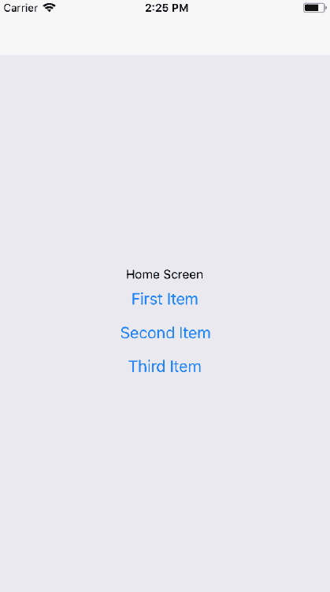

如果您点击**第一项**按钮，您将进入使用路由参数数据呈现的详情屏幕：

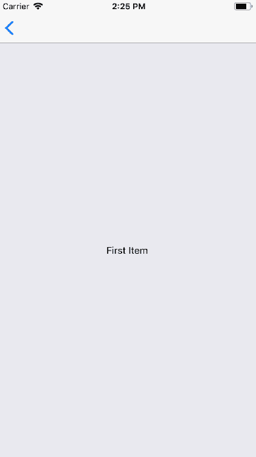

在导航栏中，您可以点击返回按钮返回到“主页”屏幕。如果您点击“主页”屏幕上的任何其他按钮，您将被带回到带有更新数据的“详情”屏幕。路由参数是必要的，以避免编写重复的组件。您可以将参数传递给`navigator.navigate()`，就像将 props 传递给 React 组件一样。

# 导航头

到目前为止，在本章中创建的导航栏都有点普通。这是因为您还没有配置它们执行任何操作，所以`react-navigation`只会渲染一个带有返回按钮的普通栏。您创建的每个屏幕组件都可以配置特定的导航头内容。

让我们在之前使用按钮导航到详情页面的示例上进行扩展。`App`组件保持不变，所以让我们先看看`Home`组件：

```jsx
import React from 'react';
import { View, Button } from 'react-native';

import styles from './styles';

const Home = ({ navigation }) => (
  <View style={styles.container}>
    <Button
      title="First Item"
      onPress={() =>
        navigation.navigate('Details', {
          title: 'First Item',
          content: 'First Item Content',
          stock: 1
        })
      }
    />
    <Button
      title="Second Item"
      onPress={() =>
        navigation.navigate('Details', {
          title: 'Second Item',
          content: 'Second Item Content',
          stock: 0
        })
      }
    />
    <Button
      title="Third Item"
      onPress={() =>
        navigation.navigate('Details', {
          title: 'Third Item',
          content: 'Third Item Content',
          stock: 200
        })
      }
    />
  </View>
);

Home.navigationOptions = {
  title: 'Home'
};

export default Home;
```

您将注意到的第一件事是，每个按钮都向“详情”组件传递了更多的路由参数：`content`和`stock`。您马上就会明白为什么。正是`Home.navigationOptions`的值为您配置了导航头。在这种情况下，“主页”屏幕正在设置“标题”。

“主页”屏幕是一个功能性组件，所以您可以将`navigationOptions`设置为函数的属性。如果您的组件是基于类的，因为它具有生命周期方法的状态，您可以将其定义为静态类属性：

`class MyScreen extends Component { static navigationOptions = {...} ... }`

接下来，让我们看看“详情”组件：

```jsx
import React from 'react';
import { View, Text, Button } from 'react-native';

import styles from './styles';

const Details = ({ navigation }) => (
  <View style={styles.container}>
    <Text>{navigation.getParam('content')}</Text>
  </View>
);

Details.navigationOptions = ({ navigation }) => ({
  title: navigation.getParam('title'),
  headerRight: (
    <Button
      title="Buy"
      onPress={() => {}}
      disabled={navigation.getParam('stock') === 0}
    />
  )
});

export default Details;
```

这一次，`Details`组件呈现内容路由参数。像`Home`组件一样，它也有一个`navigationOptions`属性。在这种情况下，它是一个函数，而不是一个对象。这是因为您根据传递给屏幕的参数动态更改导航头内容。该函数传递了一个`navigation`属性 - 这与传递给`Details`组件的值相同。您可以调用`navigation.getParam()`来获取标题，以根据路由参数更改导航头。 

接下来，使用`headerRight`选项将`Button`组件添加到导航栏的右侧。这就是股票参数发挥作用的地方。如果这个值是 0，因为没有任何库存，你想要禁用**购买**按钮。

现在让我们看看所有这些是如何工作的，从“主页”屏幕开始：

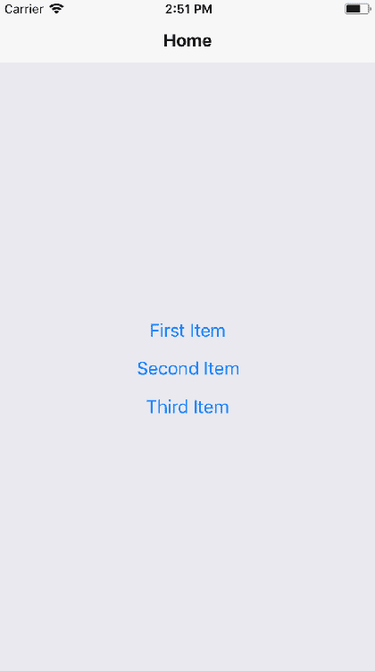

导航栏中的标题文本是由“主页”屏幕组件设置的。接下来，尝试点击**第一项**按钮：

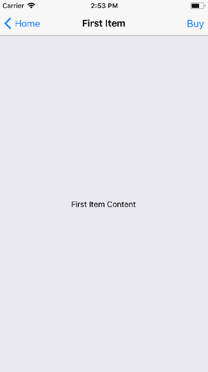

导航栏中的标题是根据传递给`Details`组件的`title`参数设置的。导航栏右侧呈现的**购买**按钮也由`Details`组件呈现。它是启用的，因为`stock`参数值为 1。现在尝试返回到“主页”屏幕，并点击**第二项**按钮：

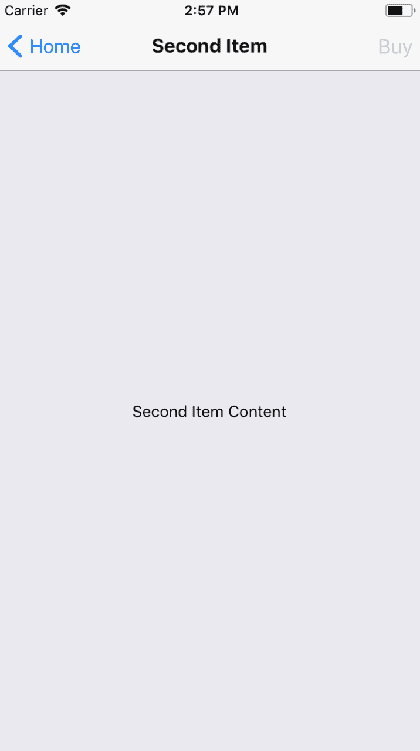

标题和页面内容都反映了传递给`Details`的新参数值。但**购买**按钮也是如此。它处于禁用状态，因为股票参数值为 0，这意味着它无法购买。

# 选项卡和抽屉导航

到目前为止，本章中的每个示例都使用了`Button`组件来链接到应用程序中的其他屏幕。您可以使用`react-navigation`中的函数，根据您提供的屏幕组件自动为您创建选项卡或抽屉导航。

让我们创建一个示例，在 iOS 上使用底部选项卡导航，在 Android 上使用抽屉导航。

您不仅限于在 iOS 上使用选项卡导航或在 Android 上使用抽屉导航。我只是选择这两个来演示如何根据平台使用不同的导航模式。如果您愿意，您可以在两个平台上使用完全相同的导航模式。这是`App`组件的外观：

```jsx
import {
  createBottomTabNavigator,
  createDrawerNavigator
} from 'react-navigation';
import { Platform } from 'react-native';
import Home from './Home';
import News from './News';
import Settings from './Settings';

const { createNavigator } = Platform.select({
  ios: { createNavigator: createBottomTabNavigator },
  android: { createNavigator: createDrawerNavigator }
});

export default createNavigator(
  {
    Home,
    News,
    Settings
  },
  { initialRouteName: 'Home' }
);
```

不要使用`createStackNavigator()`函数来创建你的导航器，而是从`react-navigation`中导入`createBottomTabNavigator()`和`createDrawerNavigator()`函数：

```jsx
import {
  createBottomTabNavigator,
  createDrawerNavigator
} from 'react-navigation';
```

然后，你使用`react-native`中的`Platform`实用程序来决定使用这两个函数中的哪一个。根据平台的不同，结果被分配给`createNavigator()`：

```jsx
const { createNavigator } = Platform.select({
  ios: { createNavigator: createBottomTabNavigator },
  android: { createNavigator: createDrawerNavigator }
});
```

现在你可以调用`createNavigator()`并将其传递给你的屏幕。生成的选项卡或抽屉导航将被创建和渲染给你：

```jsx
export default createNavigator(
  {
    Home,
    News,
    Settings
  },
  { initialRouteName: 'Home' }
);
```

接下来，让我们看一下`Home`屏幕组件：

```jsx
import React from 'react';
import { View, Text } from 'react-native';

import styles from './styles';

const Home = ({ navigation }) => (
  <View style={styles.container}>
    <Text>Home Content</Text>
  </View>
);

Home.navigationOptions = {
  title: 'Home'
};

export default Home;
```

它在导航栏中设置`title`并呈现一些基本内容。`News`和`Settings`组件本质上与`Home`相同。

iOS 上的底部选项卡导航如下所示：

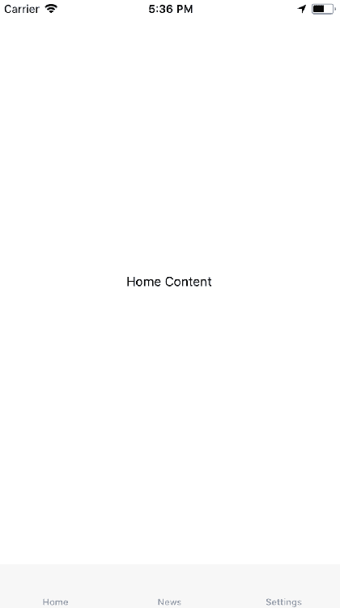

组成你的应用程序的三个屏幕在底部列出。当前屏幕被标记为活动状态，你可以点击其他选项卡来移动。

现在，让我们看看 Android 上的抽屉布局是什么样子的：


要打开抽屉，你需要从屏幕的左侧滑动。一旦打开，你将看到按钮，可以带你到应用程序的各个屏幕。

从屏幕左侧滑动打开抽屉是默认模式。你可以配置抽屉从任何方向滑动打开。

# 处理状态

React 应用程序具有传递给呈现功能并需要状态数据的组件的状态。例如，想象一下，你正在设计一个使用`react-navigation`的应用程序，不同的屏幕依赖于相同的状态数据。你如何将状态数据传递给这些屏幕组件？它们如何更新应用程序状态？

首先，让我们考虑将应用程序状态放在哪里。最自然的地方是`App`组件。到目前为止，在本章中，示例直接导出了对`createStackNavigator()`的调用。这个函数是一个高阶函数 - 它返回一个新的 React 组件。这意味着你可以在由`createStackNavigator()`返回的导航组件周围包装自己的有状态组件。

为了说明这个想法，让我们重新访问之前的例子，其中你有一个列出导航到`Details`屏幕的项目按钮的`Home`屏幕。下面是新的`App`组件的样子：

```jsx
import React, { Component } from 'react';
import { createStackNavigator } from 'react-navigation';
import Home from './Home';
import Details from './Details';

const Nav = createStackNavigator(
  {
    Home,
    Details
  },
  { initialRouteName: 'Home' }
);

export default class App extends Component {
  state = {
    stock: {
      first: 1,
      second: 0,
      third: 200
    }
  };

  updateStock = id => {
    this.setState(({ stock }) => ({
      stock: {
        ...stock,
        [id]: stock[id] === 0 ? 0 : stock[id] - 1
      }
    }));
  };

  render() {
    const props = {
      ...this.state,
      updateStock: this.updateStock
    };

    return <Nav screenProps={props} />;
  }
}
```

首先，你使用`createStackNavigator()`函数来创建你的导航器组件：

```jsx
const Nav = createStackNavigator(
  {
    Home,
    Details
  },
  { initialRouteName: 'Home' }
);
```

现在您有一个可以渲染的`Nav`组件。接下来，您可以创建一个带有状态的常规 React 组件：

```jsx
export default class App extends Component {
  state = {
    stock: {
      first: 1,
      second: 0,
      third: 200
    }
  };
  ...
}
```

这个组件中使用的状态表示每个物品可供购买的数量。接下来，您有`updateStock()`函数，用于更新给定物品 ID 的库存状态：

```jsx
updateStock = id => {
  this.setState(({ stock }) => ({
    stock: {
      ...stock,
      [id]: stock[id] === 0 ? 0 : stock[id] - 1
    }
  }));
};
```

传递给这个函数的 ID 的库存状态会减少 1，除非已经为 0。当单击物品的“购买”按钮时，可以使用这个函数来检查其库存数量是否减少 1。最后，您有`render()`方法，它可以渲染`Nav`组件：

```jsx
render() {
  const props = {
    ...this.state,
    updateStock: this.updateStock
  };

  return <Nav screenProps={props} />;
}
```

`App`的状态作为 props 传递给`Nav`。还将`updateStock()`函数作为 prop 传递，以便屏幕组件可以使用它。现在让我们来看一下`Home`屏幕：

```jsx
import React from 'react';
import { View, Button } from 'react-native';

import styles from './styles';

const Home = ({ navigation, screenProps: { stock } }) => (
  <View style={styles.container}>
    <Button
      title={`First Item (${stock.first})`}
      onPress={() =>
        navigation.navigate('Details', {
          id: 'first',
          title: 'First Item',
          content: 'First Item Content'
        })
      }
    />
    <Button
      title={`Second Item (${stock.second})`}
      onPress={() =>
        navigation.navigate('Details', {
          id: 'second',
          title: 'Second Item',
          content: 'Second Item Content'
        })
      }
    />
    <Button
      title={`Third Item (${stock.third})`}
      onPress={() =>
        navigation.navigate('Details', {
          id: 'third',
          title: 'Third Item',
          content: 'Third Item Content'
        })
      }
    />
  </View>
);

Home.navigationOptions = {
  title: 'Home'
};

export default Home;
```

再次，您有三个`Button`组件，用于导航到`Details`屏幕并传递路由参数。在这个版本中添加了一个新参数：`id`。每个按钮的标题都反映了给定物品的库存数量。这个值是应用程序状态的一部分，并通过属性传递给屏幕组件。然而，所有这些属性都是通过`screenProps`属性访问的。

**经验法则**：如果将 prop 传递给导航组件，则可以通过`screenProps`属性访问它。如果通过`navigator.navigate()`将值传递给屏幕，则可以通过调用`navigator.getParam()`来访问它。

接下来让我们来看一下`Details`组件：

```jsx
import React from 'react';
import { View, Text, Button } from 'react-native';

import styles from './styles';

const Details = ({ navigation }) => (
  <View style={styles.container}>
    <Text>{navigation.getParam('content')}</Text>
  </View>
);

Details.navigationOptions = ({
  navigation,
  screenProps: { stock, updateStock }
}) => {
  const id = navigation.getParam('id');
  const title = navigation.getParam('title');

  return {
    title,
    headerRight: (
      <Button
        title="Buy"
        onPress={() => updateStock(id)}
        disabled={stock[id] === 0}
      />
    )
  };
};

export default Details;
```

`id`和`title`路由参数用于操作导航栏中的内容。`title`参数设置标题。`id`被“Buy”按钮的`onPress`处理程序使用，通过将其传递给`updateStock()`，当按钮被按下时，适当的物品库存数量会更新。`disabled`属性也依赖于`id`参数来查找库存数量。就像`Home`屏幕一样，从`App`组件传递下来的库存和`updateStock()`props 都可以通过 screenProps 应用程序访问。

这是`Home`屏幕在首次渲染时的样子：

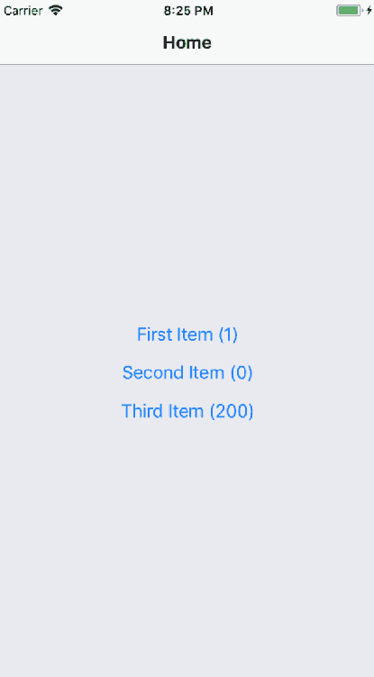

每个物品按钮上的库存数量都反映了一个数字。让我们按下“First Item”按钮并导航到`Details`页面：

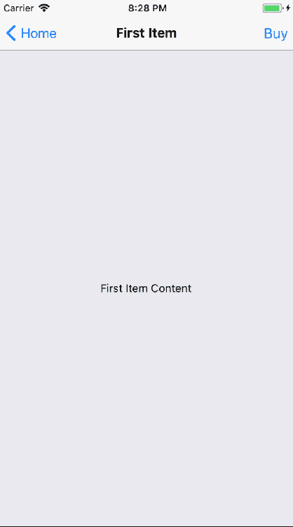

导航栏中的**购买**按钮已启用，因为库存数量为 1。让我们继续按下购买按钮，看看会发生什么：

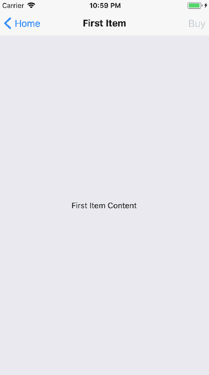

按下**购买**按钮后，它变为禁用状态。这是因为该商品的库存值为 1。通过按下**购买**按钮，你调用了`updateStock()`函数，将该值更新为 0。由于状态改变，`App`组件重新渲染了`Nav`组件，进而使用新的属性值重新渲染了你的`Details`屏幕组件。

让我们回到“主页”屏幕，看看由于状态更新而发生了什么变化：

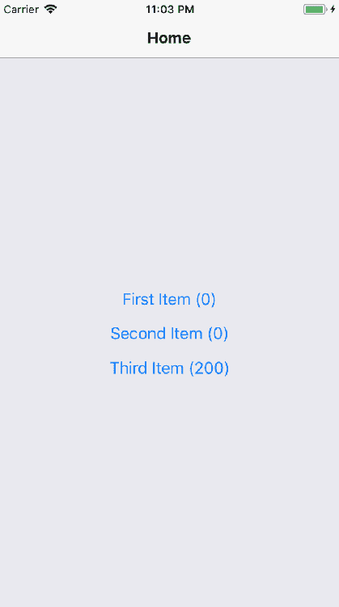

正如预期的那样，**第一项**按钮文本旁边呈现的库存数量为 0，反映了刚刚发生的状态变化。

这个例子表明，你可以让顶层的`App`组件处理应用程序状态，同时将其传递给各个应用程序屏幕，以及发出状态更新的函数。

# 总结

在本章中，你学会了移动 web 应用程序和 web 应用程序一样需要导航。尽管有所不同，但是移动应用程序和 web 应用程序的导航有足够的概念上的相似之处，使得移动应用程序的路由和导航不必成为一个麻烦。

早期版本的 React Native 尝试提供组件来帮助管理移动应用程序中的导航，但这些从未真正生效。相反，React Native 社区主导了这一领域。其中一个例子就是`react-navigation`库，本章的重点。

你学会了如何使用 react-navigation 进行基本导航。然后，你学会了如何控制导航栏中的标题组件。接下来，你学会了选项卡和抽屉导航。这两个导航组件可以根据屏幕组件自动渲染应用的导航按钮。最后，你学会了如何在保持导航的同时，仍然能够从顶层应用向屏幕组件传递状态数据。

在下一章中，你将学习如何渲染数据列表。

# 测试你的知识

1.  在 React web 应用和 React Native 应用中，导航的主要区别是什么？

1.  在导航方面，Web 应用和移动应用之间没有实质性的区别。

1.  Web 应用程序依赖 URL 作为移动的中心概念。原生应用程序没有这样的概念，所以开发人员和他们使用的导航库来管理他们的屏幕。

1.  原生应用代码与 web 应用程序一样使用 URL，但这些 URL 对用户来说是不可见的。

1.  应该使用什么函数来导航到新的屏幕？

1.  屏幕组件会被传递一个导航属性。你应该使用**`navigation.navigate()`**来切换到另一个屏幕。

1.  屏幕组件会自动添加导航方法。

1.  有一个全局导航对象，其中包含可以使用的导航方法。

1.  react-navigation 是否为你处理返回按钮功能？

1.  是的。包括在安卓系统上内置的返回按钮。

1.  不，你必须自己实现所有返回按钮的行为。

1.  你如何将数据传递给屏幕？

1.  你可以将一个普通对象作为**`navigation.navigate()`**的第二个参数。然后可以通过**`navigation.getParam()`**在屏幕上访问这些属性。

1.  你必须重新渲染屏幕组件，将从导航中作为属性获取的参数传递给它。

1.  你不会将数据传递给屏幕。设置应用级别的状态是将数据传递给屏幕组件的唯一方法。

# 进一步阅读

查看以下链接获取更多信息：

+   [`reactnavigation.org/`](https://reactnavigation.org/)
