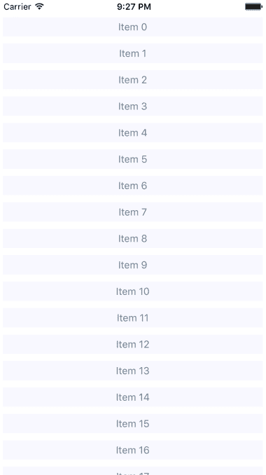
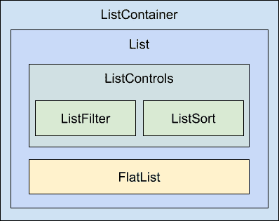
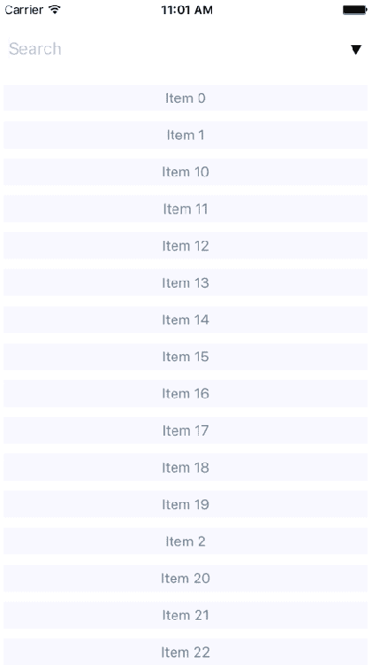
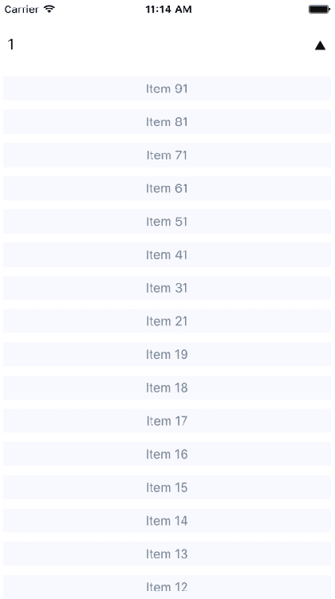

# 第十六章：渲染项目列表

在本章中，你将学习如何处理项目列表。列表是常见的 Web 应用程序组件。虽然使用`<ul>`和`<li>`元素构建列表相对比较简单，但在原生移动平台上做类似的事情要复杂得多。

幸运的是，React Native 提供了一个隐藏所有复杂性的项目列表接口。首先，通过一个例子来了解项目列表的工作原理。然后，学习如何构建改变列表中显示的数据的控件。最后，你将看到一些从网络获取项目的例子。

# 渲染数据集合

让我们从一个例子开始。你将用来渲染列表的 React Native 组件是`FlatList`，它在 iOS 和 Android 上的工作方式相同。列表视图接受一个`data`属性，它是一个对象数组。这些对象可以有任何你喜欢的属性，但它们确实需要一个键属性。这类似于在`<ul>`元素内部渲染`<li>`元素时对键属性的要求。这有助于列表在列表数据发生变化时高效地渲染列表。

现在让我们实现一个基本的列表。以下是渲染基本 100 个项目列表的代码：

```jsx
import React from 'react';
import { Text, View, FlatList } from 'react-native';

import styles from './styles';

const data = new Array(100)
  .fill(null)
  .map((v, i) => ({ key: i.toString(), value: `Item ${i}` }));

export default () => (
  <View style={styles.container}>
    <FlatList
      data={data}
      renderItem={({ item }) => (
        <Text style={styles.item}>{item.value}</Text>
      )}
    />
  </View>
); 
```

让我们从这里开始，首先是`data`常量。这是一个包含 100 个项目的数组。它是通过用 100 个空值填充一个新数组，然后将其映射到一个你想要传递给`<FlatList>`的新数组来创建的。每个对象都有一个键属性，因为这是一个要求。其他任何东西都是可选的。在这种情况下，你决定添加一个值属性，这个值稍后会被使用或在列表被渲染时使用。

接下来，你渲染`<FlatList>`组件。它位于一个`<View>`容器内，因为列表视图需要一个高度才能正确地进行滚动。`data`和`renderItem`属性被传递给`<FlatList>`，最终确定了渲染的内容。

乍一看，似乎`FlatList`组件并没有做太多事情。你必须弄清楚项目的外观？是的，`FlatList`组件应该是通用的。它应该擅长处理更新，并为我们嵌入滚动功能到列表中。以下是用于渲染列表的样式：

```jsx
import { StyleSheet } from 'react-native';

export default StyleSheet.create({
  container: {
    // Flexing from top to bottom gives the
    // container a height, which is necessary
    // to enable scrollable content.
    flex: 1,
    flexDirection: 'column',
    paddingTop: 20,
  },

  item: {
    margin: 5,
    padding: 5,
    color: 'slategrey',
    backgroundColor: 'ghostwhite',
    textAlign: 'center',
  },
}); 
```

在这里，你正在为列表中的每个项目设置样式。否则，每个项目将只是文本，并且很难区分其他列表项目。`container`样式通过将`flexDirection`设置为`column`来给列表设置高度。没有高度，你将无法正确滚动。

现在让我们看看这个东西现在是什么样子的：



如果你在模拟器中运行这个例子，你可以点击并按住鼠标按钮在屏幕的任何地方，就像手指一样，然后通过项目上下滚动。

# 对列表进行排序和过滤

现在你已经学会了`FlatList`组件的基础知识，包括如何向它们传递数据，让我们在之前实现的列表中添加一些控件。`FlatList`组件帮助你为列表控件渲染固定位置的内容。你还将看到如何操作数据源，最终驱动屏幕上的渲染内容。

在实现列表控件组件之前，可能有必要回顾一下这些组件的高层结构，以便代码有更多的上下文。以下是你将要实现的组件结构的示例：



这些组件各自负责什么：

+   `ListContainer`: 列表的整体容器；它遵循熟悉的 React 容器模式

+   `List`: 一个无状态组件，将相关的状态片段传递给`ListControls`和 React Native 的`ListView`组件

+   `ListControls`: 一个包含改变列表状态的各种控件的组件

+   `ListFilter`: 用于过滤项目列表的控件

+   `ListSort`: 用于改变列表排序顺序的控件

+   `FlatList`: 实际的 React Native 组件，用于渲染项目

在某些情况下，像这样拆分列表的实现可能有些过度。然而，我认为如果你的列表需要控件，你可能正在实现一些将受益于有一个经过深思熟虑的组件架构的东西。

现在，让我们深入到这个列表的实现中，从`ListContainer`组件开始：

```jsx
import React, { Component } from 'react';

import List from './List';

const mapItems = items =>
  items.map((value, i) => ({ key: i.toString(), value }));

// Performs sorting and filtering on the given "data".
const filterAndSort = (data, text, asc) =>
  data
    .filter(
      i =>
        // Items that include the filter "text" are returned.
        // Unless the "text" argument is an empty string,
        // then everything is included.
        text.length === 0 || i.includes(text)
    )
    .sort(
      // Sorts either ascending or descending based on "asc".
      asc
        ? (a, b) => (b > a ? -1 : a === b ? 0 : 1)
        : (a, b) => (a > b ? -1 : a === b ? 0 : 1)
    );

class ListContainer extends Component {
  state = {
    data: filterAndSort(
      new Array(100).fill(null).map((v, i) => `Item ${i}`),
      '',
      true
    ),
    asc: true,
    filter: ''
  };

  render() {
    return (
      <List
        data={mapItems(this.state.data)}
        asc={this.state.asc}
        onFilter={text => {
          // Updates the "filter" state, the actualy filter text,
          // and the "source" of the list. The "data" state is
          // never actually touched - "filterAndSort()" doesn't
          // mutate anything.
          this.setState({
            filter: text,
            data: filterAndSort(this.state.data, text, this.state.asc)
          });
        }}
        onSort={() => {
          this.setState({
            // Updates the "asc" state in order to change the
            // order of the list. The same principles as used
            // in the "onFilter()" handler are applied here,
            // only with diferent arguments passed to
            // "filterAndSort()"
            asc: !this.state.asc,
            data: filterAndSort(
              this.state.data,
              this.state.filter,
              !this.state.asc
            )
          });
        }}
      />
    );
  }
}

export default ListContainer;

```

如果这看起来有点多，那是因为确实如此。这个容器组件有很多状态需要处理。它还有一些需要提供给其子组件的非平凡行为。如果从封装状态的角度来看，它会更容易理解。它的工作是使用状态数据填充列表并提供操作此状态的函数。

在理想的情况下，此容器的子组件应该很简单，因为它们不必直接与状态进行交互。让我们接下来看一下`List`组件：

```jsx
import React from 'react';
import PropTypes from 'prop-types';
import { Text, FlatList } from 'react-native';

import styles from './styles';
import ListControls from './ListControls';

const List = ({ Controls, data, onFilter, onSort, asc }) => (
  <FlatList
    data={data}
    ListHeaderComponent={<Controls {...{ onFilter, onSort, asc }} />}
    renderItem={({ item }) => (
      <Text style={styles.item}>{item.value}</Text>
    )}
  />
);

List.propTypes = {
  Controls: PropTypes.func.isRequired,
  data: PropTypes.array.isRequired,
  onFilter: PropTypes.func.isRequired,
  onSort: PropTypes.func.isRequired,
  asc: PropTypes.bool.isRequired
};

List.defaultProps = {
  Controls: ListControls
};

export default List; 
```

此组件将`ListContainer`组件的状态作为属性，并呈现`FlatList`组件。相对于之前的示例，这里的主要区别是`ListHeaderComponent`属性。这会呈现列表的控件。这个属性特别有用的地方在于它在可滚动的列表内容之外呈现控件，确保控件始终可见。

还要注意，您正在将自己的`ListControls`组件指定为`controls`属性的默认值。这样可以方便其他人传入自己的列表控件。接下来让我们看一下`ListControls`组件：

```jsx
import React from 'react';
import PropTypes from 'prop-types';
import { View } from 'react-native';

import styles from './styles';
import ListFilter from './ListFilter';
import ListSort from './ListSort';

// Renders the "<ListFilter>" and "<ListSort>"
// components within a "<View>". The
// "styles.controls" style lays out the controls
// horizontally.
const ListControls = ({ onFilter, onSort, asc }) => (
  <View style={styles.controls}>
    <ListFilter onFilter={onFilter} />
    <ListSort onSort={onSort} asc={asc} />
  </View>
);

ListControls.propTypes = {
  onFilter: PropTypes.func.isRequired,
  onSort: PropTypes.func.isRequired,
  asc: PropTypes.bool.isRequired
};

export default ListControls; 
```

此组件将`ListFilter`和`ListSort`控件组合在一起。因此，如果要添加另一个列表控件，可以在此处添加。现在让我们来看一下`ListFilter`的实现：

```jsx
import React from 'react';
import PropTypes from 'prop-types';
import { View, TextInput } from 'react-native';

import styles from './styles';

// Renders a "<TextInput>" component which allows the
// user to type in their filter text. This causes
// the "onFilter()" event handler to be called.
// This handler comes from "ListContainer" and changes
// the state of the list data source.
const ListFilter = ({ onFilter }) => (
  <View>
    <TextInput
      autoFocus
      placeholder="Search"
      style={styles.filter}
      onChangeText={onFilter}
    />
  </View>
);

ListFilter.propTypes = {
  onFilter: PropTypes.func.isRequired
};

export default ListFilter; 
```

过滤控件是一个简单的文本输入，当用户输入时过滤项目列表。处理此操作的`onChange`函数来自`ListContainer`组件。

接下来让我们看一下`ListSort`组件：

```jsx
import React from 'react';
import PropTypes from 'prop-types';
import { Text } from 'react-native';

// The arrows to render based on the state of
// the "asc" property. Using a Map let's us
// stay declarative, rather than introducing
// logic into the JSX.
const arrows = new Map([[true, '▼'], [false, '▲']]);

// Renders the arrow text. When clicked, the
// "onSort()" function that's passed down from
// the container.
const ListSort = ({ onSort, asc }) => (
  <Text onPress={onSort}>{arrows.get(asc)}</Text>
);

ListSort.propTypes = {
  onSort: PropTypes.func.isRequired,
  asc: PropTypes.bool.isRequired
};

export default ListSort; 
```

以下是生成的列表的样子：



默认情况下，整个列表按升序排列。当用户尚未提供任何内容时，您可以看到占位文本**搜索**。让我们看看当您输入过滤器并更改排序顺序时的效果：



此搜索包括其中包含 1 的项目，并按降序排序结果。请注意，您可以先更改顺序，也可以先输入过滤器。过滤器和排序顺序都是`ListContainer`状态的一部分。

# 获取列表数据

通常，你会从某个 API 端点获取列表数据。在本节中，你将学习如何从 React Native 组件中发出 API 请求。好消息是，`fetch()` API 在 React Native 中是由 React Native 进行了填充，因此你的移动应用程序中的网络代码应该看起来和感觉上很像在 Web 应用程序中一样。

首先，让我们使用返回 promise 的函数构建一个模拟 API 来处理我们的列表项，就像`fetch()`一样。

```jsx
import fetchMock from 'fetch-mock';
import querystring from 'querystring';

// A mock item list...
const items = new Array(100).fill(null).map((v, i) => `Item ${i}`);

// The same filter and sort functionality
// as the previous example, only it's part of the
// API now, instead of part of the React component.
const filterAndSort = (data, text, asc) =>
  data
    .filter(i => text.length === 0 || i.includes(text))
    .sort(
      asc
        ? (a, b) => (b > a ? -1 : a === b ? 0 : 1)
        : (a, b) => (a > b ? -1 : a === b ? 0 : 1)
    );

export const fetchItems = (filter, asc) =>
  new Promise(resolve => {
    resolve({
      json: () =>
        Promise.resolve({
          items: filterAndSort(items, filter, asc)
        })
    });
  }); 
```

有了模拟 API 函数，让我们对列表容器组件进行一些更改。现在可以使用`fetchItems()`函数从 API 模拟中加载数据，而不是使用本地数据源：

```jsx
import React, { Component } from 'react';

import { fetchItems } from './api';
import List from './List';

const mapItems = items =>
  items.map((value, i) => ({ key: i.toString(), value }));

class ListContainer extends Component {
  // The "source" state is empty because we need
  // to fetch the data from the API.
  state = {
    asc: true,
    filter: '',
    data: []
  };

  // When the component is first mounted, fetch the initial
  // items from the API, then
  componentDidMount() {
    fetchItems(this.state.filter, this.state.asc)
      .then(resp => resp.json())
      .then(({ items }) => {
        this.setState({ data: mapItems(items) });
      });
  }

  render() {
    return (
      <List
        data={this.state.data}
        asc={this.state.asc}
        onFilter={text => {
          // Makes an API call when the filter changes...
          fetchItems(text, this.state.asc)
            .then(resp => resp.json())
            .then(({ items }) =>
              this.setState({
                filter: text,
                data: mapItems(items)
              })
            );
        }}
        onSort={() => {
          // Makes an API call when the sort order changes...
          fetchItems(this.state.filter, !this.state.asc)
            .then(resp => resp.json())
            .then(({ items }) =>
              this.setState({
                asc: !this.state.asc,
                data: mapItems(items)
              })
            );
        }}
      />
    );
  }
}

export default ListContainer; 
```

任何修改列表状态的操作都需要调用`fetchItems()`，并在 promise 解析后设置适当的状态。

# 懒加载列表

在本节中，你将实现一种不同类型的列表，即无限滚动的列表。有时，用户实际上并不知道他们在寻找什么，因此过滤或排序是没有帮助的。想想当你登录你的 Facebook 账户时看到的新闻动态；这是应用程序的主要功能，很少有你在寻找特定的东西。你需要通过滚动列表来看看发生了什么。

要使用`FlatList`组件实现这一点，需要在用户滚动到列表末尾时能够获取更多的 API 数据。为了了解这是如何工作的，你需要大量的 API 数据来进行操作。生成器非常适合这个！所以让我们修改你在上一个示例中创建的模拟，使其只是不断地响应新数据：

```jsx
// Items...keep'em coming!
function* genItems() {
  let cnt = 0;

  while (true) {
    yield `Item ${cnt++}`;
  }
}

const items = genItems();

export const fetchItems = () =>
  Promise.resolve({
    json: () =>
      Promise.resolve({
        items: new Array(20).fill(null).map(() => items.next().value)
      })
  }); 
```

有了这个，现在你可以在列表末尾到达时每次发出 API 请求获取新数据。嗯，最终当内存用尽时这将失败，但我只是想以一般的术语向你展示你可以采取的方法来在 React Native 中实现无限滚动。`ListContainer`组件如下所示：

```jsx
import React, { Component } from 'react';

import * as api from './api';
import List from './List';

class ListContainer extends Component {
  state = {
    data: [],
    asc: true,
    filter: ''
  };

  fetchItems = () =>
    api
      .fetchItems()
      .then(resp => resp.json())
      .then(({ items }) =>
        this.setState(state => ({
          data: [...state.data, ...items.map((value, i) => ({
            key: i.toString(),
            value
          }))]
        })
      );

  // Fetches the first batch of items once the
  // component is mounted.
  componentDidMount() {
    this.fetchItems();
  }

  render() {
    return (
      <List data={this.state.data} fetchItems={this.fetchItems} />
    );
  }
}

export default ListContainer; 
```

每次调用`fetchItems()`时，响应都会与`data`数组连接起来。这将成为新的列表数据源，而不是像之前的示例中那样替换它。现在，让我们看看`List`组件如何响应到达列表末尾：

```jsx
import React from 'react';
import PropTypes from 'prop-types';
import { Text, FlatList } from 'react-native';

import styles from './styles';

// Renders a "<FlatList>" component, and
// calls "fetchItems()" and the user scrolls
// to the end of the list.
const List = ({ data, fetchItems }) => (
  <FlatList
    data={data}
    renderItem={({ item }) => (
      <Text style={styles.item}>{item.value}</Text>
    )}
    onEndReached={fetchItems}
  />
);

List.propTypes = {
  data: PropTypes.array.isRequired,
  fetchItems: PropTypes.func.isRequired
};

export default List; 
```

如果你运行这个示例，你会发现当你滚动到屏幕底部时，列表会不断增长。

# 总结

在本章中，您了解了 React Native 中的`FlatList`组件。该组件是通用的，因为它不会对呈现的项目施加任何特定的外观。相反，列表的外观取决于您，而`FlatList`组件有助于高效地呈现数据源。`FlatList`组件还为其呈现的项目提供了可滚动的区域。

您实现了一个利用列表视图中的部分标题的示例。这是呈现静态内容（如列表控件）的好地方。然后，您了解了在 React Native 中进行网络调用；这就像在任何其他 Web 应用程序中使用`fetch()`一样。最后，您实现了无限滚动的懒加载列表，只有在滚动到已呈现内容的底部后才加载新项目。

在下一章中，您将学习如何显示诸如网络调用之类的进度。

# 测试你的知识

1.  `FlatList`组件可以呈现什么类型的数据？

1.  `FlatList`期望一个对象数组。`renderItem`属性接受一个负责呈现每个项目的函数。

1.  `FlatList`期望一个对象。

1.  它期望一个返回可迭代对象的函数。

1.  为什么`key`属性是传递给`FlatList`的每个数据项的要求？

1.  这不是一个要求。

1.  这样列表就知道如何对数据值进行排序。

1.  这样列表就可以进行高效的相等性检查，有助于在列表数据更新期间提高渲染性能。

1.  如何在滚动期间保持固定位置的列表控件呈现？

1.  通过将自定义控件组件作为`FlatList`的子组件。

1.  您可以使用`FlatList`的`ListHeaderComponent`属性。

1.  您不能拥有静态定位的列表控件。

1.  当用户滚动列表时，如何懒加载更多数据？

1.  您可以为`FlatList`的`onEndReached`属性提供一个函数。当用户接近列表的末尾时，将调用此函数，并且该函数可以使用更多数据填充列表数据。

1.  您必须扩展`FlatList`类并响应滚动事件，以确定列表的末尾是否已经到达。

# 进一步阅读

点击以下链接了解更多信息：

+   [`facebook.github.io/react-native/docs/flatlist`](https://facebook.github.io/react-native/docs/flatlist)
