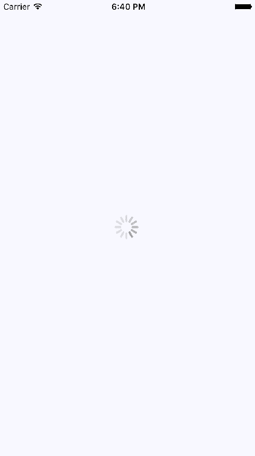
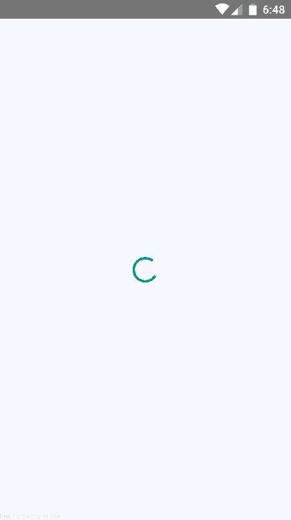
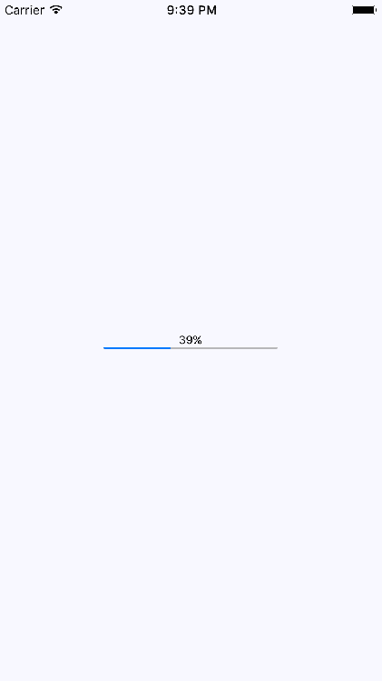
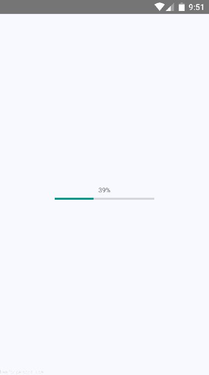

# 第十七章：显示进度

本章主要讨论向用户传达进度的问题。React Native 有不同的组件来处理您想要传达的不同类型的进度。首先，您将学习为什么首先需要这样传达进度。然后，您将学习如何实现进度指示器和进度条。之后，您将看到具体的示例，向您展示如何在数据加载时使用进度指示器与导航，以及如何使用进度条来传达一系列步骤中的当前位置。

# 进度和可用性

想象一下，您有一台没有窗户也不发出声音的微波炉。与它互动的唯一方式是按下标有“烹饪”的按钮。尽管这个设备听起来很荒谬，但许多软件用户面临的情况就是如此——没有进度的指示。微波炉在烹饪什么？如果是的话，我们如何知道什么时候会完成？

改善微波炉情况的一种方法是添加声音。这样，用户在按下烹饪按钮后会得到反馈。您已经克服了一个障碍，但用户仍然在猜测——我的食物在哪里？在您破产之前，最好添加某种进度测量显示，比如一个计时器。

并不是 UI 程序员不理解这种可用性问题的基本原则；只是我们有事情要做，这种事情在优先级方面往往被忽略。在 React Native 中，有一些组件可以向用户提供不确定的进度反馈，也可以提供精确的进度测量。如果您想要良好的用户体验，将这些事情作为首要任务总是一个好主意。

# 指示进度

在本节中，您将学习如何使用`ActivityIndicator`组件。顾名思义，当您需要向用户指示发生了某事时，您会渲染此组件。实际进度可能是不确定的，但至少您有一种标准化的方式来显示发生了某事，尽管尚无结果可显示。

让我们创建一个示例，这样你就可以看到这个组件是什么样子的。这里是`App`组件：

```jsx
import React from 'react';
import { View, ActivityIndicator } from 'react-native';

import styles from './styles';

// Renders an "<ActivityIndicator>" component in the
// middle of the screen. It will animate on it's own
// while displayed.
export default () => (
  <View style={styles.container}>
    <ActivityIndicator size="large" />
  </View>
); 
```

`<ActivityIndicator>`组件是跨平台的。在 iOS 上它是这样的：



它在屏幕中间渲染一个动画旋转器。这是大旋转器，如`size`属性中指定的那样。`ActivityIndicator`旋转器也可以很小，如果你将其渲染在另一个较小的元素内，这更有意义。现在让我们看看这在 Android 设备上是什么样子：



旋转器看起来不同，这是应该的，但你的应用在两个平台上传达的是同样的事情——你在等待某些东西。

这个例子只是永远旋转。别担心，接下来会有一个更现实的进度指示器示例，向你展示如何处理导航和加载 API 数据。

# 测量进度

指示正在取得进展的缺点是用户看不到尽头。这会导致一种不安的感觉，就像在没有定时器的微波炉中等待食物一样。当你知道已经取得了多少进展，还有多少要做时，你会感觉更好。这就是为什么尽可能使用确定性进度条总是更好的原因。

与`ActivityIndicator`组件不同，React Native 中没有用于进度条的跨平台组件。因此，我们必须自己制作一个。我们将创建一个组件，在 iOS 上使用`ProgressViewIOS`，在 Android 上使用`ProgressBarAndroid`。

首先处理跨平台问题。React Native 知道根据文件扩展名导入正确的模块。下面是`ProgressBarComponent.ios.js`模块的样子：

```jsx
// Exports the "ProgressViewIOS" as the 
// "ProgressBarComponent" component that 
// our "ProgressBar" expects. 
export { 
  ProgressViewIOS as ProgressBarComponent, 
} from 'react-native'; 

// There are no custom properties needed. 
export const progressProps = {}; 
```

你直接从 React Native 中导出了`ProgressViewIOS`组件。你还导出了特定于平台的组件属性。在这种情况下，它是一个空对象，因为没有特定于`<ProgressViewIOS>`的属性。现在，让我们看看`ProgressBarComponent.android.js`模块：

```jsx
// Exports the "ProgressBarAndroid" component as 
// "ProgressBarComponent" that our "ProgressBar" 
// expects. 
export { 
  ProgressBarAndroid as ProgressBarComponent, 
} from 'react-native'; 

// The "styleAttr" and "indeterminate" props are 
// necessary to make "ProgressBarAndroid" look like 
// "ProgressViewIOS". 
export const progressProps = { 
  styleAttr: 'Horizontal', 
  indeterminate: false, 
}; 
```

这个模块使用与`ProgressBarComponent.ios.js`模块完全相同的方法。它导出了特定于 Android 的组件以及传递给它的特定于 Android 的属性。现在，让我们构建应用程序将使用的`ProgressBar`组件：

```jsx
import React from 'react';
import PropTypes from 'prop-types';
import { View, Text } from 'react-native';

// Imports the "ProgressBarComponent" which is the
// actual react-native implementation. The actual
// component that's imported is platform-specific.
// The custom props in "progressProps" is also
// platform-specific.
import {
  ProgressBarComponent,
  progressProps
} from './ProgressBarComponent';

import styles from './styles';

// The "ProgressLabel" component determines what to
// render as a label, based on the boolean "label"
// prop. If true, then we render some text that shows
// the progress percentage. If false, we render nothing.
const ProgressLabel = ({ show, progress }) =>
  show && (
    <Text style={styles.progressText}>
      {Math.round(progress * 100)}%
    </Text>
  );

// Our generic progress bar component...
const ProgressBar = ({ progress, label }) => (
  <View style={styles.progress}>
    <ProgressLabel show={label} progress={progress} />
    {/* "<ProgressBarComponent>" is really a ""<ProgressViewIOS>"
         or a "<ProgressBarAndroid>". */}
    <ProgressBarComponent
      {...progressProps}
      style={styles.progress}
      progress={progress}
    />
  </View>
);

ProgressBar.propTypes = {
  progress: PropTypes.number.isRequired,
  label: PropTypes.bool.isRequired
};

ProgressBar.defaultProps = {
  progress: 0,
  label: true
};

export default ProgressBar; 
```

让我们逐步了解这个模块中发生了什么，从导入开始。`ProgressBarComponent`和`progressProps`的值是从我们的`ProgressBarComponent`模块中导入的。React Native 确定从哪个模块导入这些值。

接下来，你有`ProgressLabel`实用组件。它根据`show`属性决定为进度条呈现什么标签。如果是`false`，则不呈现任何内容。如果是`true`，它会呈现一个显示进度的`<Text>`组件。

最后，你有`ProgressBar`组件本身，当我们的应用程序导入和使用。这将呈现标签和适当的进度条组件。它接受一个`progress`属性，这是一个介于`0`和`1`之间的值。现在让我们在`App`组件中使用这个组件：

```jsx
import React, { Component } from 'react';
import { View } from 'react-native';

import styles from './styles';
import ProgressBar from './ProgressBar';

export default class MeasuringProgress extends Component {
  // Initially at 0% progress. Changing this state
  // updates the progress bar.
  state = {
    progress: 0
  };

  componentDidMount() {
    // Continuously increments the "progress" state
    // every 300MS, until we're at 100%.
    const updateProgress = () => {
      this.setState({
        progress: this.state.progress + 0.01
      });

      if (this.state.progress < 1) {
        setTimeout(updateProgress, 300);
      }
    };

    updateProgress();
  }

  render() {
    return (
      <View style={styles.container}>
        {/* This is awesome. A simple generic
             "<ProgressBar>" component that works
             on Android and on iOS. */}
        <ProgressBar progress={this.state.progress} />
      </View>
    );
  }
} 
```

最初，`<ProgressBar>`组件以 0%的进度呈现。在`componentDidMount()`方法中，`updateProgress()`函数使用定时器模拟一个真实的进程，你想要显示进度。这是 iOS 屏幕的样子：



这是相同的进度条在 Android 上的样子：



# 导航指示器

在本章的前面，你已经了解了`ActivityIndicator`组件。在本节中，你将学习在导航加载数据的应用程序中如何使用它。例如，用户从页面（屏幕）一导航到页面二。然而，页面二需要从 API 获取数据来显示给用户。因此，在进行这个网络调用时，显示进度指示器而不是一个缺乏有用信息的屏幕更有意义。

这样做实际上有点棘手，因为你必须确保屏幕所需的数据在用户每次导航到屏幕时都从 API 获取。你的目标应该是以下几点：

+   使`Navigator`组件自动为即将呈现的场景获取 API 数据。

+   使用 API 调用返回的 promise 来显示旋转器，并在 promise 解析后隐藏它。

由于你的组件可能不关心是否显示旋转器，让我们将其实现为一个通用的高阶组件：

```jsx
import React, { Component } from 'react';
import PropTypes from 'prop-types';
import { View, ActivityIndicator } from 'react-native';

import styles from './styles';

// Wraps the "Wrapped" component with a stateful component
// that renders an "<ActivityIndicator>" when the "loading"
// state is true.
const loading = Wrapped =>
  class LoadingWrapper extends Component {
    static propTypes = {
      promise: PropTypes.instanceOf(Promise)
    };

    state = {
      loading: true
    };

    // Adds a callback to the "promise" that was
    // passed in. When the promise resolves, we set
    // the "loading" state to false.
    componentDidMount() {
      this.props.promise.then(
        () => this.setState({ loading: false }),
        () => this.setState({ loading: false })
      );
    }

    // If "loading" is true, render the "<ActivityIndicator>"
    // component. Otherwise, render the "<Wrapped>" component.
    render() {
      return new Map([
        [
          true,
          <View style={styles.container}>
            <ActivityIndicator size="large" />
          </View>
        ],
        [false, <Wrapped {...this.props} />]
      ]).get(this.state.loading);
    }
  };

export default loading; 
```

这个`loading()`函数接受一个组件——`Wrapped`参数，并返回一个`LoadingWrapper`组件。返回的包装器接受一个`promise`属性，当它解析或拒绝时，它会将`loading`状态更改为`false`。正如你在`render()`方法中所看到的，`loading`状态决定了是呈现旋转器还是`Wrapped`组件。

有了`loading()`高阶函数，让我们来看看您将与`react-navigation`一起使用的第一个屏幕组件：

```jsx
import React from 'react';
import { View, Text } from 'react-native';

import styles from './styles';
import loading from './loading';

const First = loading(({ navigation }) => (
  <View style={styles.container}>
    <Text
      style={styles.item}
      onPress={() => navigation.navigate('Second')}
    >
      Second
    </Text>
    <Text
      style={styles.item}
      onPress={() => navigation.navigate('Third')}
    >
      Third
    </Text>
  </View>
));

export default First; 
```

该模块导出了一个组件，该组件使用之前创建的`loading()`函数进行包装。它包装了`First`组件，以便在`promise`属性挂起时显示旋转器。最后一步是在用户导航到给定页面时将该 promise 传递到组件中。这发生在`App`组件中的路由配置中：

```jsx
import React from 'react';
import { createStackNavigator } from 'react-navigation';

import First from './First';
import Second from './Second';
import Third from './Third';

export default createStackNavigator(
  {
    First: {
      screen: props => (
        <First
          promise={new Promise(resolve => setTimeout(resolve, 1000))}
          {...props}
        />
      )
    },
    Second: {
      screen: props => (
        <Second
          promise={new Promise(resolve => setTimeout(resolve, 1000))}
          {...props}
        />
      )
    },
    Third: {
      screen: props => (
        <First
          promise={new Promise(resolve => setTimeout(resolve, 1000))}
          {...props}
        />
      )
    }
  },
  { initialRouteName: 'First' }
); 
```

您不是直接将屏幕组件传递给`createStackNavigator()`的路由配置参数，而是为每个屏幕传递一个对象。`screen`属性允许您提供要渲染的实际屏幕组件。在这种情况下，通过调用解析组件所需数据的 API 函数来传递`promise`属性。这就是`loading()`函数能够在等待 promise 解析时显示旋转器的方式。第一个屏幕不必担心显示加载屏幕。

# 步骤进度

在这个最后的例子中，您将构建一个应用程序，该应用程序显示用户在预定义步骤中的进度。例如，将表单分成几个逻辑部分，并以用户完成一个部分后移动到下一步的方式组织它们可能是有意义的。进度条对用户来说将是有用的反馈。

您将在导航栏中插入一个进度条，就在标题下方，以便用户知道他们已经走了多远，还有多远要走。您还将重用在本章中早些时候实现的`ProgressBar`组件。

让我们先看一下结果。这个应用程序中有四个屏幕，用户可以导航到其中。以下是第一页（场景）的样子：


标题下方的进度条反映了用户在导航中已经完成了 25%。让我们看看第三个屏幕是什么样子的：


进度已更新，以反映用户在路由堆栈中的位置。让我们来看看`App`组件：

```jsx
import React from 'react';
import { createStackNavigator } from 'react-navigation';

import First from './First';
import Second from './Second';
import Third from './Third';
import Fourth from './Fourth';

const routes = [First, Second, Third, Fourth];

export default createStackNavigator(
  routes.reduce(
    (result, route) => ({
      ...result,
      [route.name]: route
    }),
    {}
  ),
  {
    initialRouteName: 'First',
    initialRouteParams: {
      progress: route =>
        (routes.map(r => r.name).indexOf(route) + 1) / routes.length
    }
  }
);

```

这个应用程序有四个屏幕。渲染每个屏幕的组件存储在`routes`常量中，然后使用`createStackNavigator()`配置堆栈导航器。创建`routes`数组的原因是为了让它可以被传递给初始路由(`First`)作为路由参数的`progress()`函数使用。这个函数以当前路由名称作为参数，并查找它在 routes 中的索引位置。例如，`Second`在数字`2`的位置（索引为 1 + 1），数组的长度为`4`。这将把进度条设置为 50%。

让我们看看`First`组件如何使用`progress`函数：

```jsx
import React from 'react';
import { View, Text } from 'react-native';

import styles from './styles';
import ProgressBar from './ProgressBar';

const First = () => (
  <View style={styles.container}>
    <Text style={styles.content}>First Content</Text>
  </View>
);

First.navigationOptions = ({ navigation }) => ({
  headerTitle: (
    <View style={styles.progress}>
      <Text style={styles.title}>First</Text>
      <ProgressBar
        label={false}
        progress={navigation.state.params.progress(
          navigation.state.routeName
        )}
      />
    </View>
  ),
  headerLeft: (
    <Text
      onPress={() =>
        navigation.navigate('Fourth', navigation.state.params)
      }
    >
      Fourth
    </Text>
  ),
  headerRight: (
    <Text
      onPress={() =>
        navigation.navigate('Second', navigation.state.params)
      }
    >
      Second
    </Text>
  )
});

export default First;
```

该函数可以通过`navigation.state.params.progress()`访问。它将`navigation.state.routeName`的值传递给当前页面的进度值。此外，对`navigation.navigate()`的调用必须传递`navigation.state.params`，以便`progress()`函数对屏幕可用。如果不这样做，那么`progress()`将只对第一个屏幕可用，因为它是在`App`组件中使用`initialRouteParams`选项设置的。

# 总结

在本章中，您学习了如何向用户显示一些在幕后发生的事情。首先，我们讨论了为什么显示进度对应用程序的可用性很重要。然后，您实现了一个基本的屏幕，指示进度正在进行。然后，您实现了一个`ProgressBar`组件，用于测量特定的进度量。

指示器适用于不确定的进度，并且您实现了导航，显示了在网络调用挂起时显示进度指示器。在最后一节中，您实现了一个进度条，向用户显示他们在预定义步骤中的位置。

在下一章中，您将看到 React Native 地图和地理位置数据的实际应用。

# 测试你的知识

1.  进度条和活动指示器有什么区别？

1.  进度条是确定的，而进度指示器用于指示不确定的时间量。

1.  没有区别。进度条和进度指示器实际上是相同的东西。

1.  进度条渲染一个水平条，其他所有的都被视为进度指示器。

1.  React Native 的`ActivityIndicator`组件在 iOS 和 Android 上是否工作相同？

1.  不，这个组件不是平台无关的。

1.  是的，这个组件是平台无关的。

1.  如何以平台不可知的方式使用`ProgressViewIOS`和`ProgressBarAndroid`组件？

1.  您可以定义自己的`ProgressBar`组件，导入具有特定于平台的文件扩展名的其他组件。

1.  你不能；你必须在想要使用进度条的每个地方实现平台检查逻辑。

# 进一步阅读

查看以下链接获取更多信息：

+   [`facebook.github.io/react-native/docs/activityindicator`](https://facebook.github.io/react-native/docs/activityindicator)

+   [`facebook.github.io/react-native/docs/progressviewios`](https://facebook.github.io/react-native/docs/progressviewios)

+   [`facebook.github.io/react-native/docs/progressbarandroid`](https://facebook.github.io/react-native/docs/progressbarandroid)
