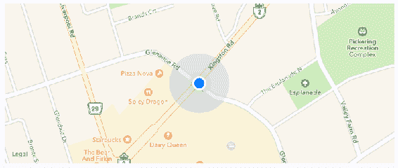

# 第十八章：地理位置和地图

在本章中，您将学习 React Native 的地理位置和地图功能。您将开始学习如何使用地理位置 API；然后您将继续使用`MapView`组件来标记兴趣点和区域。

您将使用`react-native-maps`包来实现地图。本章的目标是介绍 React Native 中用于地理位置和 React Native Maps 中地图的功能。

# 我在哪里？

Web 应用程序用于确定用户位置的地理位置 API 也可以被 React Native 应用程序使用，因为相同的 API 已经进行了 polyfill。除了地图之外，此 API 对于从移动设备的 GPS 获取精确坐标非常有用。然后，您可以使用这些信息向用户显示有意义的位置数据。

不幸的是，地理位置 API 返回的数据本身用处不大；您的代码必须进行一些工作，将其转换为有用的东西。例如，纬度和经度对用户来说毫无意义，但您可以使用这些数据查找对用户有用的信息。这可能只是简单地显示用户当前所在位置。

让我们实现一个示例，使用 React Native 的地理位置 API 查找坐标，然后使用这些坐标从 Google Maps API 查找可读的位置信息：

```jsx
import React, { Component } from 'react';
import { Text, View } from 'react-native';
import { fromJS } from 'immutable';

import styles from './styles';

// For fetching human-readable address info.
const URL = 'https://maps.google.com/maps/api/geocode/json?latlng=';

export default class WhereAmI extends Component {
  // The "address" state is "loading..." initially because
  // it takes the longest to fetch.
  state = {
    data: fromJS({
      address: 'loading...'
    })
  };

  // Getter for "Immutable.js" state data...
  get data() {
    return this.state.data;
  }

  // Setter for "Immutable.js" state data...
  set data(data) {
    this.setState({ data });
  }

  // We don't setup any geo data till the component
  // mounts.
  componentDidMount() {
    const setPosition = pos => {
      // This component renders the "coords" data from
      // a geolocation response. This can simply be merged
      // into the state map.
      this.data = this.data.merge(pos.coords);

      // We need the "latitude" and the "longitude"
      // in order to lookup the "address" from the
      // Google maps API.
      const {
        coords: { latitude, longitude }
      } = pos;

      // Fetches data from the Google Maps API then sets
      // the "address" state based on the response.
      fetch(`${URL}${latitude},${longitude}`)
        .then(resp => resp.json(), e => console.error(e))
        .then(({ results: [{ formatted_address }] }) => {
          this.data = this.data.set('address', formatted_address);
        });
    };

    // First, we try to lookup the current position
    // data and update the component state.
    navigator.geolocation.getCurrentPosition(setPosition);

    // Then, we setup a high accuracy watcher, that
    // issues a callback whenever the position changes.
    this.watcher = navigator.geolocation.watchPosition(
      setPosition,
      err => console.error(err),
      { enableHighAccuracy: true }
    );
  }

  // It's always a good idea to make sure that this
  // "watcher" is cleared when the component is removed.
  componentWillUnmount() {
    navigator.geolocation.clearWatch(this.watcher);
  }

  render() {
    // Since we want to iterate over the properties
    // in the state map, we need to convert the map
    // to pairs using "entries()". Then we need to
    // use the spread operator to make the map iterator
    // into a plain array. The "sort()" method simply
    // sorts the map based on it's keys.
    const state = [...this.data.sortBy((v, k) => k).entries()];

    // Iterates over the state properties and renders them.
    return (
      <View style={styles.container}>
        {state.map(([k, v]) => (
          <Text key={k} style={styles.label}>
            {`${k[0].toUpperCase()}${k.slice(1)}`}: {v}
          </Text>
        ))}
      </View>
    );
  }
} 
```

此组件的目标是在屏幕上呈现地理位置 API 返回的属性，并查找用户的特定位置并显示它。如果您查看`componentDidMount()`方法，您会发现这里有大部分有趣的代码。`setPosition()`函数在几个地方用作回调。它的工作是设置组件的状态。

首先，它设置了`coords`属性。通常，您不会直接显示这些数据，但这是一个示例，展示了地理位置 API 的可用数据。其次，它使用`latitude`和`longitude`值来查找用户当前所在位置的名称，使用 Google Maps API。

`setPosition()`回调函数与`getCurrentPosition()`一起使用，当组件挂载时只调用一次。您还在`watchPosition()`中使用`setPosition()`，它会在用户位置发生变化时调用回调函数。

iOS 模拟器和 Android Studio 允许您通过菜单选项更改位置。您不必每次想要测试更改位置时都在物理设备上安装您的应用程序。

让我们看看一旦位置数据加载后，这个屏幕是什么样子的：


获取的地址信息在应用程序中可能比纬度和经度数据更有用。比物理地址文本更好的是在地图上可视化用户的物理位置；您将在下一节中学习如何做到这一点。

# 周围有什么？

`react-native-maps`中的`MapView`组件是您在 React Native 应用程序中渲染地图时将使用的主要工具。

让我们实现一个基本的`MapView`组件，看看您可以从中得到什么。

```jsx
import React from 'react';
import { View } from 'react-native';
import MapView from 'react-native-maps';

import styles from './styles';

export default () => (
  <View style={styles.container}>
    <MapView
      style={styles.mapView}
      showsUserLocation
      followUserLocation
    />
  </View>
); 
```

您传递给`MapView`的两个布尔属性为您做了很多工作。`showsUserLocation`属性将激活地图上的标记，表示运行此应用程序的设备的物理位置。`followUserLocation`属性告诉地图在设备移动时更新位置标记。让我们看看结果地图：



设备的当前位置在地图上清晰标记。默认情况下，地图上也会显示兴趣点。这些是用户附近的事物，让他们可以看到周围的环境。

通常情况下，当使用`showsUserLocation`时最好使用`followUserLocation`属性。这样地图就会缩放到用户所在的区域。

# 注释兴趣点

到目前为止，您已经看到`MapView`组件如何渲染用户当前位置和用户周围的兴趣点。这里的挑战是，您可能希望显示与您的应用程序相关的兴趣点，而不是默认渲染的兴趣点。

在这一部分，您将学习如何在地图上为特定位置渲染标记，以及渲染地图上的区域。

# 绘制点

让我们标记一些当地的啤酒厂！以下是如何将注释传递给`MapView`组件：

```jsx
import React from 'react';
import { View } from 'react-native';
import MapView from 'react-native-maps';

import styles from './styles';

export default () => (
  <View style={styles.container}>
    <MapView
      style={styles.mapView}
      showsPointsOfInterest={false}
      showsUserLocation
      followUserLocation
    >
      <MapView.Marker
        title="Duff Brewery"
        description="Duff beer for me, Duff beer for you"
        coordinate={{
          latitude: 43.8418728,
          longitude: -79.086082
        }}
      />
      <MapView.Marker
        title="Pawtucket Brewery"
        description="New! Patriot Light!"
        coordinate={{
          latitude: 43.8401328,
          longitude: -79.085407
        }}
      />
    </MapView>
  </View>
); 
```

注释就像它们听起来的那样；在基本地图地理信息的顶部呈现的额外信息。实际上，当您呈现`MapView`组件时，默认情况下会显示注释，因为它们会显示感兴趣的点。在这个例子中，您通过将`showsPointsOfInterest`属性设置为`false`来选择退出此功能。让我们看看这些啤酒厂的位置：


当您按下显示地图上啤酒厂位置的标记时，会显示标注。您给`<MapView.Marker>`的`title`和`description`属性值用于呈现此文本。

# 绘制叠加层

在本章的最后一节中，您将学习如何渲染区域叠加层。一个点是一个单一的纬度/经度坐标。将区域视为几个坐标的连线图。区域可以有很多用途，比如显示我们更可能找到 IPA 饮酒者与 stout 饮酒者的地方。代码如下所示：

```jsx
import React, { Component } from 'react';
import { View, Text } from 'react-native';
import MapView from 'react-native-maps';
import { fromJS } from 'immutable';

import styles from './styles';

// The "IPA" region coordinates and color...
const ipaRegion = {
  coordinates: [
    { latitude: 43.8486744, longitude: -79.0695283 },
    { latitude: 43.8537168, longitude: -79.0700046 },
    { latitude: 43.8518394, longitude: -79.0725697 },
    { latitude: 43.8481651, longitude: -79.0716377 },
    { latitude: 43.8486744, longitude: -79.0695283 }
  ],
  strokeColor: 'coral',
  strokeWidth: 4
};

// The "stout" region coordinates and color...
const stoutRegion = {
  coordinates: [
    { latitude: 43.8486744, longitude: -79.0693283 },
    { latitude: 43.8517168, longitude: -79.0710046 },
    { latitude: 43.8518394, longitude: -79.0715697 },
    { latitude: 43.8491651, longitude: -79.0716377 },
    { latitude: 43.8486744, longitude: -79.0693283 }
  ],
  strokeColor: 'firebrick',
  strokeWidth: 4
};

export default class PlottingOverlays extends Component {
  // The "IPA" region is rendered first. So the "ipaStyles"
  // list has "boldText" in it, to show it as selected. The
  // "overlays" list has the "ipaRegion" in it.
  state = {
    data: fromJS({
      ipaStyles: [styles.ipaText, styles.boldText],
      stoutStyles: [styles.stoutText],
      overlays: [ipaRegion]
    })
  };

  // Getter for "Immutable.js" state data...
  get data() {
    return this.state.data;
  }

  // Setter for "Immutable.js" state data...
  set data(data) {
    this.setState({ data });
  }

  // The "IPA" text was clicked...
  onClickIpa = () => {
    this.data = this.data
      // Makes the IPA text bold...
      .update('ipaStyles', i => i.push(styles.boldText))
      // Removes the bold from the stout text...
      .update('stoutStyles', i => i.pop())
      // Replaces the stout overlay with the IPA overlay...
      .update('overlays', i => i.set(0, ipaRegion));
  };

  // The "stout" text was clicked...
  onClickStout = () => {
    this.data = this.data
      // Makes the stout text bold...
      .update('stoutStyles', i => i.push(styles.boldText))
      // Removes the bold from the IPA text...
      .update('ipaStyles', i => i.pop())
      // Replaces the IPA overlay with the stout overlay...
      .update('overlays', i => i.set(0, stoutRegion));
  };

  render() {
    const { ipaStyles, stoutStyles, overlays } = this.data.toJS();

    return (
      <View style={styles.container}>
        <View>
          {/* Text that when clicked, renders the IPA
               map overlay. */}
          <Text style={ipaStyles} onPress={this.onClickIpa}>
            IPA Fans
          </Text>

          {/* Text that when clicked, renders the stout
               map overlay. */}
          <Text style={stoutStyles} onPress={this.onClickStout}>
            Stout Fans
          </Text>
        </View>

        {/* Renders the map with the "overlays" array. There
             will only ever be a single overlay in this
             array. */}
        <MapView
          style={styles.mapView}
          showsPointsOfInterest={false}
          showsUserLocation
          followUserLocation
        >
          {overlays.map((v, i) => (
            <MapView.Polygon
              key={i}
              coordinates={v.coordinates}
              strokeColor={v.strokeColor}
              strokeWidth={v.strokeWidth}
            />
          ))}
        </MapView>
      </View>
    );
  }
} 
```

区域数据由几个纬度/经度坐标组成，定义了区域的形状和位置。其余的代码大部分是关于在按下两个文本链接时处理状态。默认情况下，IPA 区域被渲染：


当按下`stout`文本时，地图上将删除 IPA 叠加层，并添加 stout 区域：


# 总结

在本章中，您了解了 React Native 中的地理位置和地图。地理位置 API 的工作方式与其 Web 对应物相同。在 React Native 应用程序中使用地图的唯一可靠方式是安装第三方`react-native-maps`包。

您看到了基本配置`MapView`组件，以及它如何跟踪用户的位置，并显示相关的兴趣点。然后，您看到了如何绘制自己的兴趣点和兴趣区域。

在下一章中，您将学习如何使用类似 HTML 表单控件的 React Native 组件收集用户输入。

# 测试你的知识

1.  在 React Native 中找到的地理位置 API 与 Web 浏览器中找到的地理位置 API 的工作方式相同。

1.  是的，它是相同的 API。

1.  不，React Native API 具有其自己独特的特性。

1.  React Native 应用程序中地理位置 API 的主要目的是什么？

1.  计算从一个位置到另一个位置的距离。

1.  查找设备的纬度和经度坐标，并将这些值与其他 API 一起使用，以查找有用信息，如地址。

1.  查找地址和有关这些地址的其他信息。

1.  `MapView`组件能够显示用户附近的兴趣点吗？

1.  是的，默认情况下启用了这个功能。

1.  不，您必须手动绘制和标记所有内容。

1.  是的，但您必须使用`showsPointsOfInterest`属性。

1.  如何在地图上标记点？

1.  通过将纬度/经度数组数据作为属性传递给`MapView`组件。

1.  通过将坐标传递给`MapView.Marker`组件。

# 进一步阅读

请查看以下网址以获取更多信息：

+   [`facebook.github.io/react-native/docs/geolocation`](https://facebook.github.io/react-native/docs/geolocation)

+   [`github.com/react-community/react-native-maps`](https://github.com/react-community/react-native-maps)
