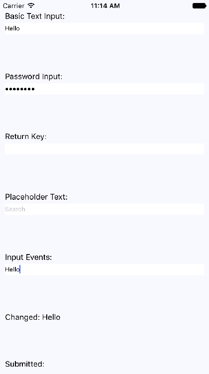
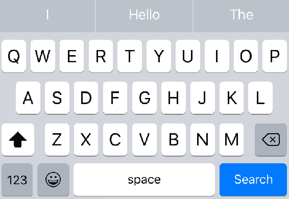
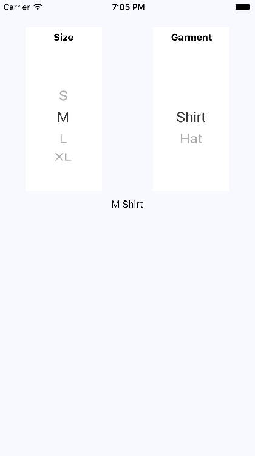
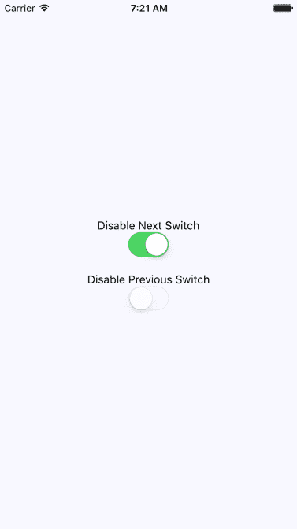
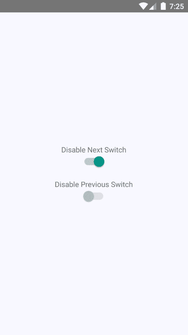
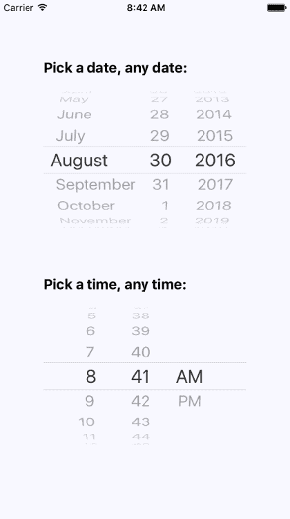
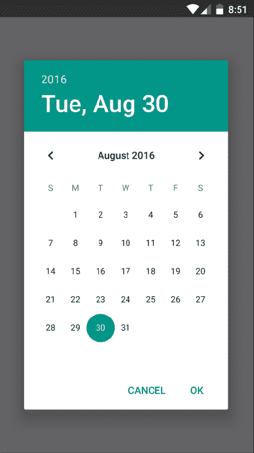

# 第十九章：收集用户输入

在 Web 应用程序中，您可以从标准 HTML 表单元素中收集用户输入，这些元素在所有浏览器上看起来和行为类似。对于原生 UI 平台，收集用户输入更加微妙。

在本章中，您将学习如何使用各种 React Native 组件来收集用户输入。这些包括文本输入、从选项列表中选择、复选框和日期/时间选择器。您将看到 iOS 和 Android 之间的区别，以及如何为您的应用程序实现适当的抽象。

# 收集文本输入

实施文本输入时，原来有很多要考虑的事情。例如，它是否应该有占位文本？这是不应该在屏幕上显示的敏感数据吗？在用户移动到另一个字段时，您应该如何处理文本？

与传统的 Web 文本输入相比，移动文本输入的显着区别在于前者有自己内置的虚拟键盘，您可以对其进行配置和响应。让我们构建一个示例，渲染几个`<TextInput>`组件的实例：

```jsx
import React, { Component } from 'react';
import PropTypes from 'prop-types';
import { Text, TextInput, View } from 'react-native';
import { fromJS } from 'immutable';

import styles from './styles';

// A Generic "<Input>" component that we can use in our app.
// It's job is to wrap the "<TextInput>" component in a "<View>"
// so that we can render a label, and to apply styles to the
// appropriate components.
const Input = props => (
  <View style={styles.textInputContainer}>
    <Text style={styles.textInputLabel}>{props.label}</Text>
    <TextInput style={styles.textInput} {...props} />
  </View>
);

Input.propTypes = {
  label: PropTypes.string
};

export default class CollectingTextInput extends Component {
  // This state is only relevant for the "input events"
  // component. The "changedText" state is updated as
  // the user types while the "submittedText" state is
  // updated when they're done.
  state = {
    data: fromJS({
      changedText: '',
      submittedText: ''
    })
  };

  // Getter for "Immutable.js" state data...
  get data() {
    return this.state.data;
  }

  // Setter for "Immutable.js" state data...
  set data(data) {
    this.setState({ data });
  }

  render() {
    const { changedText, submittedText } = this.data.toJS();

    return (
      <View style={styles.container}>
        {/* The simplest possible text input. */}
        <Input label="Basic Text Input:" />

        {/* The "secureTextEntry" property turns
             the text entry into a password input
             field. */}
        <Input label="Password Input:" secureTextEntry />

        {/* The "returnKeyType" property changes
             the return key that's displayed on the
             virtual keyboard. In this case, we want
             a "search" button. */}
        <Input label="Return Key:" returnKeyType="search" />

        {/* The "placeholder" property works just
             like it does with web text inputs. */}
        <Input label="Placeholder Text:" placeholder="Search" />

        {/* The "onChangeText" event is triggered as
             the user enters text. The "onSubmitEditing"
             event is triggered when they click "search". */}
        <Input
          label="Input Events:"
          onChangeText={e => {
            this.data = this.data.set('changedText', e);
          }}
          onSubmitEditing={e => {
            this.data = this.data.set(
              'submittedText',
              e.nativeEvent.text
            );
          }}
          onFocus={() => {
            this.data = this.data
              .set('changedText', '')
              .set('submittedText', '');
          }}
        />

        {/* Displays the captured state from the
             "input events" text input component. */}
        <Text>Changed: {changedText}</Text>
        <Text>Submitted: {submittedText}</Text>
      </View>
    );
  }
} 
```

我不会深入讨论每个`<TextInput>`组件正在做什么 - 代码中有注释。让我们看看这些组件在屏幕上是什么样子的：



纯文本输入显示已输入的文本。密码字段不会显示任何字符。当输入为空时，占位文本会显示。还显示了更改的文本状态。您没有看到提交的文本状态，因为在我截屏之前我没有按下虚拟键盘上的提交按钮。

让我们来看看输入元素的虚拟键盘，您可以通过`returnKeyType`属性更改返回键文本：



当键盘返回键反映用户按下它时会发生什么时，用户会更加与应用程序保持一致。

# 从选项列表中进行选择

在 Web 应用程序中，通常使用`<select>`元素让用户从选项列表中进行选择。React Native 带有一个`<Picker>`组件，可以在 iOS 和 Android 上使用。根据用户所在的平台对此组件进行样式处理有一些技巧，因此让我们将所有这些隐藏在一个通用的`Select`组件中。这是`Select.ios.js`模块：

```jsx
import React from 'react';
import PropTypes from 'prop-types';
import { View, Picker, Text } from 'react-native';
import styles from './styles';

// The "<Select>" component provides an
// abstraction around the "<Picker>" component.
// It actually has two outer views that are
// needed to get the styling right.
const Select = props => (
  <View style={styles.pickerHeight}>
    <View style={styles.pickerContainer}>
      {/* The label for the picker... */}
      <Text style={styles.pickerLabel}>{props.label}</Text>
      <Picker style={styles.picker} {...props}>
        {/* Maps each "items" value to a
             "<Picker.Item>" component. */}
        {props.items.map(i => <Picker.Item key={i.label} {...i} />)}
      </Picker>
    </View>
  </View>
);

Select.propTypes = {
  items: PropTypes.array,
  label: PropTypes.string
};

export default Select; 
```

这对于一个简单的`Select`组件来说有很多额外的开销。事实证明，样式化 React Native 的`<Picker>`组件实际上是相当困难的。以下是`Select.android.js`模块：

```jsx
import React from 'react';
import PropTypes from 'prop-types';
import { View, Picker, Text } from 'react-native';
import styles from './styles';

// The "<Select>" component provides an
// abstraction around the "<Picker>" component.
// It actually has two outer views that are
// needed to get the styling right.
const Select = props => (
  <View>
    {/* The label for the picker... */}
    <Text style={styles.pickerLabel}>{props.label}</Text>
    <Picker {...props}>
      {/* Maps each "items" value to a
           "<Picker.Item>" component. */}
      {props.items.map(i => <Picker.Item key={i.label} {...i} />)}
    </Picker>
  </View>
);

Select.propTypes = {
  items: PropTypes.array,
  label: PropTypes.string
};

export default Select;
```

以下是样式的样子：

```jsx
import { StyleSheet } from 'react-native'; 

export default StyleSheet.create({ 
  container: { 
    flex: 1, 
    flexDirection: 'row', 
    flexWrap: 'wrap', 
    justifyContent: 'space-around', 
    alignItems: 'center', 
    backgroundColor: 'ghostwhite', 
  }, 

  // The outtermost container, needs a height. 
  pickerHeight: { 
    height: 175, 
  }, 

  // The inner container lays out the picker 
  // components and sets the background color. 
  pickerContainer: { 
    flex: 1, 
    flexDirection: 'column', 
    alignItems: 'center', 
    marginTop: 40, 
    backgroundColor: 'white', 
    padding: 6, 
    height: 240, 
  }, 

  pickerLabel: { 
    fontSize: 14, 
    fontWeight: 'bold', 
  }, 

  picker: { 
  width: 100, 
    backgroundColor: 'white', 
  }, 

  selection: { 
    width: 200, 
    marginTop: 230, 
    textAlign: 'center', 
  }, 
}); 
```

现在你可以渲染你的`<Select>`组件：

```jsx
import React, { Component } from 'react';
import { View, Text } from 'react-native';
import { fromJS } from 'immutable';

import styles from './styles';
import Select from './Select';

export default class SelectingOptions extends Component {
  // The state is a collection of "sizes" and
  // "garments". At any given time there can be
  // selected size and garment.
  state = {
    data: fromJS({
      sizes: [
        { label: '', value: null },
        { label: 'S', value: 'S' },
        { label: 'M', value: 'M' },
        { label: 'L', value: 'L' },
        { label: 'XL', value: 'XL' }
      ],
      selectedSize: null,
      garments: [
        { label: '', value: null, sizes: ['S', 'M', 'L', 'XL'] },
        { label: 'Socks', value: 1, sizes: ['S', 'L'] },
        { label: 'Shirt', value: 2, sizes: ['M', 'XL'] },
        { label: 'Pants', value: 3, sizes: ['S', 'L'] },
        { label: 'Hat', value: 4, sizes: ['M', 'XL'] }
      ],
      availableGarments: [],
      selectedGarment: null,
      selection: ''
    })
  };

  // Getter for "Immutable.js" state data...
  get data() {
    return this.state.data;
  }

  // Setter for "Immutable.js" state data...
  set data(data) {
    this.setState({ data });
  }

  render() {
    const {
      sizes,
      selectedSize,
      availableGarments,
      selectedGarment,
      selection
    } = this.data.toJS();

    // Renders two "<Select>" components. The first
    // one is a "size" selector, and this changes
    // the available garments to select from.
    // The second selector changes the "selection"
    // state to include the selected size
    // and garment.
    return (
      <View style={styles.container}>
        <Select
          label="Size"
          items={sizes}
          selectedValue={selectedSize}
          onValueChange={size => {
            this.data = this.data
              .set('selectedSize', size)
              .set('selectedGarment', null)
              .set(
                'availableGarments',
                this.data
                  .get('garments')
                  .filter(i => i.get('sizes').includes(size))
              );
          }}
        />
        <Select
          label="Garment"
          items={availableGarments}
          selectedValue={selectedGarment}
          onValueChange={garment => {
            this.data = this.data.set('selectedGarment', garment).set(
              'selection',
              this.data.get('selectedSize') +
                ' ' +
                this.data
                  .get('garments')
                  .find(i => i.get('value') === garment)
                  .get('label')
            );
          }}
        />
        <Text style={styles.selection}>{selection}</Text>
      </View>
    );
  }
} 
```

这个例子的基本思想是，第一个选择器中选择的选项会改变第二个选择器中的可用选项。当第二个选择器改变时，标签会显示所选的尺寸和服装。以下是屏幕的样子：



# 在关闭和打开之间切换

在 Web 表单中，你会看到另一个常见的元素是复选框。React Native 有一个`Switch`组件，可以在 iOS 和 Android 上使用。幸运的是，这个组件比`Picker`组件更容易样式化。以下是一个简单的抽象，你可以实现为你的开关提供标签：

```jsx
import React from 'react';
import PropTypes from 'prop-types';
import { View, Text, Switch } from 'react-native';

import styles from './styles';

// A fairly straightforward wrapper component
// that adds a label to the React Native
// "<Switch>" component.
const CustomSwitch = props => (
  <View style={styles.customSwitch}>
    <Text>{props.label}</Text>
    <Switch {...props} />
  </View>
);

CustomSwitch.propTypes = {
  label: PropTypes.string
};

export default CustomSwitch; 
```

现在，让我们看看如何使用一对开关来控制应用程序状态：

```jsx
import React, { Component } from 'react';
import { View } from 'react-native';
import { fromJS } from 'immutable';

import styles from './styles';
import Switch from './Switch';

export default class TogglingOnAndOff extends Component {
  state = {
    data: fromJS({
      first: false,
      second: false
    })
  };

  // Getter for "Immutable.js" state data...
  get data() {
    return this.state.data;
  }

  // Setter for "Immutable.js" state data...
  set data(data) {
    this.setState({ data });
  }

  render() {
    const { first, second } = this.state.data.toJS();

    return (
      <View style={styles.container}>
        {/* When this switch is turned on, the
             second switch is disabled. */}
        <Switch
          label="Disable Next Switch"
          value={first}
          disabled={second}
          onValueChange={v => {
            this.data = this.data.set('first', v);
          }}
        />

        {/* When this switch is turned on, the
             first switch is disabled. */}
        <Switch
          label="Disable Previous Switch"
          value={second}
          disabled={first}
          onValueChange={v => {
            this.data = this.data.set('second', v);
          }}
        />
      </View>
    );
  }
} 
```

这两个开关简单地切换彼此的`disabled`属性。以下是 iOS 上屏幕的样子：



以下是 Android 上相同屏幕的样子：



# 收集日期/时间输入

在本章的最后一节中，你将学习如何实现日期/时间选择器。React Native 为 iOS 和 Android 分别提供了独立的日期/时间选择器组件，这意味着你需要处理组件之间的跨平台差异。 

所以，让我们从 iOS 的日期选择器组件开始：

```jsx
import React from 'react';
import PropTypes from 'prop-types';
import { Text, View, DatePickerIOS } from 'react-native';

import styles from './styles';

// A simple abstraction that adds a label to
// the "<DatePickerIOS>" component.
const DatePicker = props => (
  <View style={styles.datePickerContainer}>
    <Text style={styles.datePickerLabel}>{props.label}</Text>
    <DatePickerIOS mode="date" {...props} />
  </View>
);

DatePicker.propTypes = {
  label: PropTypes.string
};

export default DatePicker; 
```

这个组件并不复杂；它只是向`DatePickerIOS`组件添加了一个标签。日期选择器的 Android 版本需要更多的工作。让我们看一下实现：

```jsx
import React from 'react';
import PropTypes from 'prop-types';
import { Text, View, DatePickerAndroid } from 'react-native';

import styles from './styles';

// Opens the "DatePickerAndroid" dialog and handles
// the response. The "onDateChange" function is
// a callback that's passed in from the container
// component and expects a "Date" instance.
const pickDate = (options, onDateChange) => {
  DatePickerAndroid.open(options).then(date =>
    onDateChange(new Date(date.year, date.month, date.day))
  );
};

// Renders a "label" and the "date" properties.
// When the date text is clicked, the "pickDate()"
// function is used to render the Android
// date picker dialog.
const DatePicker = ({ label, date, onDateChange }) => (
  <View style={styles.datePickerContainer}>
    <Text style={styles.datePickerLabel}>{label}</Text>
    <Text onPress={() => pickDate({ date }, onDateChange)}>
      {date.toLocaleDateString()}
    </Text>
  </View>
);

DatePicker.propTypes = {
  label: PropTypes.string,
  date: PropTypes.instanceOf(Date),
  onDateChange: PropTypes.func.isRequired
};

export default DatePicker; 
```

两个日期选择器之间的关键区别是，Android 版本不使用 React Native 组件，比如`DatePickerIOS`。相反，我们必须使用命令式的`DatePickerAndroid.open()` API。当用户按下我们组件渲染的日期文本时，这将被触发，并打开一个日期选择器对话框。好消息是，我们的这个组件将这个 API 隐藏在一个声明性组件后面。

我还实现了一个遵循这个确切模式的时间选择器组件。因此，我建议您从[`github.com/PacktPublishing/React-and-React-Native-Second-Edition`](https://github.com/PacktPublishing/React-and-React-Native-Second-Edition)下载本书的代码，这样您就可以看到微妙的差异并运行示例。

现在，让我们看看如何使用我们的日期和时间选择器组件：

```jsx
import React, { Component } from 'react';
import { View } from 'react-native';

import styles from './styles';

// Imports our own platform-independent "DatePicker"
// and "TimePicker" components.
import DatePicker from './DatePicker';
import TimePicker from './TimePicker';

export default class CollectingDateTimeInput extends Component {
  state = {
    date: new Date(),
    time: new Date()
  };

  render() {
    return (
      <View style={styles.container}>
        <DatePicker
          label="Pick a date, any date:"
          date={this.state.date}
          onDateChange={date => this.setState({ date })}
        />
        <TimePicker
          label="Pick a time, any time:"
          date={this.state.time}
          onTimeChange={time => this.setState({ time })}
        />
      </View>
    );
  }
} 
```

太棒了！现在我们有两个简单的组件，可以在 iOS 和 Android 上使用。让我们看看在 iOS 上选择器的外观：



正如您所看到的，iOS 的日期和时间选择器使用了您在本章中学到的`Picker`组件。Android 选择器看起来大不相同-让我们现在看看它：



# 总结

在本章中，您了解了各种类似于您习惯的 Web 表单元素的 React Native 组件。您首先学习了文本输入，以及每个文本输入都有自己的虚拟键盘需要考虑。接下来，您了解了`Picker`组件，允许用户从选项列表中选择项目。然后，您了解了`Switch`组件，类似于复选框。

在最后一节中，您学会了如何实现通用的日期/时间选择器，可以在 iOS 和 Android 上使用。在下一章中，您将学习有关 React Native 中模态对话框的内容。

# 测试您的知识

1.  为什么要更改文本输入的虚拟键盘上的返回键？

1.  您永远不应该更改返回键

1.  因为在某些情况下，有意义的是有一个搜索按钮或其他更符合输入上下文的内容

1.  您只应该更改搜索输入或密码输入的返回键

1.  应该使用哪个`TextInput`属性来标记输入为密码字段？

1.  **`secureTextEntry`**

1.  `password`

1.  `securePassword`

1.  `secureText`

1.  为什么要为选择元素创建抽象？

1.  因为 iOS 和 Android 的组件完全不同

1.  因为两个平台之间的样式挑战

1.  您不需要创建一个抽象。

1.  为什么要为日期和时间选择器创建抽象？

1.  因为 iOS 和 Android 的组件完全不同

1.  因为两个平台之间的样式挑战

1.  您不需要创建一个抽象

# 进一步阅读

访问以下链接获取更多信息：

+   https://facebook.github.io/react-native/docs/handling-text-input

+   https://facebook.github.io/react-native/docs/switch

+   https://facebook.github.io/react-native/docs/picker

+   https://facebook.github.io/react-native/docs/datepickerios

+   https://facebook.github.io/react-native/docs/datepickerandroid.html
