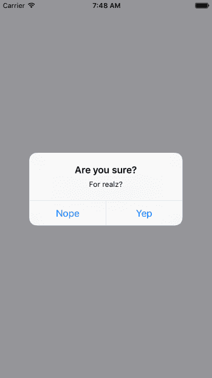

# 第二十章：警报、通知和确认

本章的目标是向你展示如何以不干扰当前页面的方式向用户呈现信息。页面使用`View`组件，并直接在屏幕上呈现。然而，有时候有重要信息需要用户看到，但你不一定希望将他们从当前页面中踢出去。

你将首先学习如何显示重要信息。了解重要信息是什么以及何时使用它，你将看到如何获得用户的确认，无论是错误还是成功的情况。然后，你将实现被动通知，向用户显示发生了某事。最后，你将实现模态视图，向用户显示后台正在发生某事。

# 重要信息

在你开始实施警报、通知和确认之前，让我们花几分钟时间思考一下这些项目各自的含义。我认为这很重要，因为如果你只是被动地通知用户发生了错误，很容易被忽视。以下是我对你需要显示的信息类型的定义：

+   **警报**：发生了重要的事情，你需要确保用户看到发生了什么。可能用户需要确认警报。

+   **通知**：发生了某事，但不重要到完全阻止用户正在做的事情。这些通常会自行消失。

确认实际上是警报的一部分。例如，如果用户刚刚执行了一个操作，然后想要确保操作成功后才继续进行，他们必须确认已经看到了信息才能关闭模态框。确认也可以存在于警报中，警告用户即将执行的操作。

关键是要尝试在信息是好知道但不是关键的情况下使用通知。只有在没有用户确认发生的情况下功能的工作流程无法继续进行时才使用确认。在接下来的章节中，你将看到警报和通知用于不同目的的示例。

# 获得用户确认

在本节中，您将学习如何显示模态视图以从用户那里获得确认。首先，您将学习如何实现成功的情景，其中一个操作生成了您希望用户知晓的成功结果。然后，您将学习如何实现错误情景，其中出现了问题，您不希望用户在未确认问题的情况下继续前进。

# 成功确认

让我们首先实现一个模态视图，作为用户成功执行操作的结果显示出来。以下是用于显示用户成功确认的`Modal`组件：

```jsx
import React from 'react';
import PropTypes from 'prop-types';
import { View, Text, Modal } from 'react-native';

import styles from './styles';

// Uses "<Modal>" to display the underlying view
// on top of the current view. Properties passed to
// this component are also passed to the modal.
const ConfirmationModal = props => (
  <Modal {...props}>
    {/* Slightly confusing, but we need an inner and
         an outer "<View>" to style the height of the
         modal correctly. */}
    <View style={styles.modalContainer}>
      <View style={styles.modalInner}>
        {/* The confirmation message... */}
        <Text style={styles.modalText}>Dude, srsly?</Text>

        {/* The confirmation and the cancel buttons. Each
             button triggers a different callback function
             that's passed in from the container
             component. */}
        <Text
          style={styles.modalButton}
          onPress={props.onPressConfirm}
        >
          Yep
        </Text>
        <Text
          style={styles.modalButton}
          onPress={props.onPressCancel}
        >
          Nope
        </Text>
      </View>
    </View>
  </Modal>
);

ConfirmationModal.propTypes = {
  visible: PropTypes.bool.isRequired,
  onPressConfirm: PropTypes.func.isRequired,
  onPressCancel: PropTypes.func.isRequired
};

ConfirmationModal.defaultProps = {
  transparent: true,
  onRequestClose: () => {}
};

export default ConfirmationModal;
```

传递给`ConfirmationModal`的属性被转发到 React Native 的`Modal`组件。一会儿您就会明白为什么。首先，让我们看看这个确认模态框是什么样子的：


用户完成操作后显示的模态框具有我们自己的样式和确认消息。它还有两个操作，但根据确认是在操作前还是操作后，可能只需要一个。以下是用于此模态框的样式：

```jsx
modalContainer: { 
  flex: 1, 
  justifyContent: 'center', 
  alignItems: 'center', 
}, 

modalInner: { 
  backgroundColor: 'azure', 
  padding: 20, 
  borderWidth: 1, 
  borderColor: 'lightsteelblue', 
  borderRadius: 2, 
  alignItems: 'center', 
}, 

modalText: { 
  fontSize: 16, 
  margin: 5, 
  color: 'slategrey', 
}, 

modalButton: { 
  fontWeight: 'bold', 
  margin: 5, 
  color: 'slategrey', 
}, 
```

使用 React Native 的`Modal`组件，您基本上可以自行决定您希望确认模态视图的外观。将它们视为常规视图，唯一的区别是它们是在其他视图之上渲染的。

很多时候，您可能不在意样式化自己的模态视图。例如，在 Web 浏览器中，您可以简单地调用`alert()`函数，它会在浏览器样式的窗口中显示文本。React Native 有类似的功能：`Alert.alert()`。这里的棘手之处在于这是一个命令式 API，并且您不一定希望直接在应用程序中公开它。

相反，让我们实现一个警报确认组件，隐藏这个特定的 React Native API 的细节，以便您的应用程序可以将其视为任何其他组件：

```jsx
import React, { Component } from 'react';
import PropTypes from 'prop-types';
import { Alert } from 'react-native';

// The "actions" Map will map the "visible"
// property to the "Alert.alert()" function,
// or to a noop function.
const actions = new Map([[true, Alert.alert], [false, () => {}]]);

class ConfirmationAlert extends Component {
  state = { visible: false, title: '', message: '', buttons: [] };

  static getDerivedStateFromProps(props) {
    return props;
  }

  render() {
    actions.get(this.state.visible)(
      this.state.title,
      this.state.message,
      this.state.buttons
    );

    return null;
  }
}

ConfirmationAlert.propTypes = {
  visible: PropTypes.bool.isRequired,
  title: PropTypes.string,
  message: PropTypes.string,
  buttons: PropTypes.array
};

export default ConfirmationAlert;
```

这个组件有两个重要方面。首先，看一下`actions`映射。它的键——`true`和`false`——对应于`visible`状态值。值对应于命令式的`alert()`API 和一个`noop`函数。这是将我们所熟悉和喜爱的声明式 React 组件接口转换为隐藏视图的关键。

其次，注意`render()`方法不需要渲染任何东西，因为这个组件专门处理命令式的 React Native 调用。但是，对于使用`ConfirmationAlert`的人来说，感觉就像有东西被渲染出来了。

这是 iOS 上警报的外观：



在功能上，这里并没有真正的不同。有一个标题和下面的文本，但如果你想的话，这很容易添加到模态视图中。真正的区别在于这个模态看起来像一个 iOS 模态，而不是应用程序样式的东西。让我们看看这个警报在 Android 上是什么样子的：


这个模态看起来像一个 Android 模态，而你不需要对它进行样式设置。我认为大多数情况下，使用警报而不是模态是一个更好的选择。让它看起来像 iOS 的一部分或 Android 的一部分是有意义的。然而，有时候你需要更多地控制模态的外观，比如显示错误确认。以下是用于显示模态和警报确认对话框的代码：

```jsx
import React, { Component } from 'react';
import { View, Text } from 'react-native';
import { fromJS } from 'immutable';

import styles from './styles';
import ConfirmationModal from './ConfirmationModal';
import ConfirmationAlert from './ConfirmationAlert';

export default class SuccessConfirmation extends Component {
  // The two pieces of state used to control
  // the display of the modal and the alert
  // views.
  state = {
    data: fromJS({
      modalVisible: false,
      alertVisible: false
    })
  };

  // Getter for "Immutable.js" state data...
  get data() {
    return this.state.data;
  }

  // Setter for "Immutable.js" state data...
  set data(data) {
    this.setState({ data });
  }

  // A "modal" button was pressed. So show
  // or hide the modal based on its current state.
  toggleModal = () => {
    this.data = this.data.update('modalVisible', v => !v);
  };

  // A "alert" button was pressed. So show
  // or hide the alert based on its current state.
  toggleAlert = () => {
    this.data = this.data.update('alertVisible', v => !v);
  };

  render() {
    const { modalVisible, alertVisible } = this.data.toJS();

    const { toggleModal, toggleAlert } = this;

    return (
      <View style={styles.container}>
        {/* Renders the "<ConfirmationModal>" component,
             which is hidden by default and controlled
             by the "modalVisible" state. */}
        <ConfirmationModal
          animationType="fade"
          visible={modalVisible}
          onPressConfirm={toggleModal}
          onPressCancel={toggleModal}
        />

        {/* Renders the "<ConfirmationAlert>" component,
             which doesn't actually render anything since
             it controls an imperative API under the hood.
             The "alertVisible" state controls this API. */}
        <ConfirmationAlert
          title="Are you sure?"
          message="For realz?"
          visible={alertVisible}
          buttons={[
            {
              text: 'Nope',
              onPress: toggleAlert
            },
            {
              text: 'Yep',
              onPress: toggleAlert
            }
          ]}
        />

        {/* Shows the "<ConfirmationModal>" component
             by changing the "modalVisible" state. */}
        <Text style={styles.text} onPress={toggleModal}>
          Show Confirmation Modal
        </Text>

        {/* Shows the "<ConfirmationAlert>" component
             by changing the "alertVisible" state. */}
        <Text style={styles.text} onPress={toggleAlert}>
          Show Confimation Alert
        </Text>
      </View>
    );
  }
} 
```

渲染模态的方法与渲染警报的方法不同。然而，它们都是根据属性值的变化而改变的声明式组件。

# 错误确认

在前面部分学到的所有原则在需要用户确认错误时都是适用的。如果你需要更多地控制显示，使用模态。例如，你可能希望模态是红色和令人恐惧的外观：


以下是用于创建这种外观的样式。也许你想要更加低调的东西，但重点是你可以根据自己的喜好来定制这种外观：

```jsx
import { StyleSheet } from 'react-native'; 

export default StyleSheet.create({ 
  container: { 
    flex: 1, 
    justifyContent: 'center', 
    alignItems: 'center', 
    backgroundColor: 'ghostwhite', 
  }, 

  text: { 
    color: 'slategrey', 
  }, 

  modalContainer: { 
    flex: 1, 
    justifyContent: 'center', 
    alignItems: 'center', 
  }, 

  modalInner: { 
    backgroundColor: 'azure', 
    padding: 20, 
    borderWidth: 1, 
    borderColor: 'lightsteelblue', 
    borderRadius: 2, 
    alignItems: 'center', 
  }, 

  modalInnerError: { 
    backgroundColor: 'lightcoral', 
    borderColor: 'darkred', 
  }, 

  modalText: { 
    fontSize: 16, 
    margin: 5, 
    color: 'slategrey', 
  }, 

  modalTextError: { 
    fontSize: 18, 
    color: 'darkred', 
  }, 

  modalButton: { 
    fontWeight: 'bold', 
    margin: 5, 
    color: 'slategrey', 
  }, 

  modalButtonError: { 
    color: 'black', 
  }, 
}); 
```

你用于成功确认的相同模态样式仍然在这里。这是因为错误确认模态需要许多相同的样式。以下是如何将它们都应用到`Modal`组件中的方法：

```jsx
import React from 'react';
import PropTypes from 'prop-types';
import { View, Text, Modal } from 'react-native';

import styles from './styles';

// Declares styles for the error modal by
// combining regular modal styles with
// error styles.
const innerViewStyle = [styles.modalInner, styles.modalInnerError];

const textStyle = [styles.modalText, styles.modalTextError];

const buttonStyle = [styles.modalButton, styles.modalButtonError];

// Just like a success modal, accept for the addition of
// error styles.
const ErrorModal = props => (
  <Modal {...props}>
    <View style={styles.modalContainer}>
      <View style={innerViewStyle}>
        <Text style={textStyle}>Epic fail!</Text>
        <Text style={buttonStyle} onPress={props.onPressConfirm}>
          Fix it
        </Text>
        <Text style={buttonStyle} onPress={props.onPressCancel}>
          Ignore it
        </Text>
      </View>
    </View>
  </Modal>
);

ErrorModal.propTypes = {
  visible: PropTypes.bool.isRequired,
  onPressConfirm: PropTypes.func.isRequired,
  onPressCancel: PropTypes.func.isRequired
};

ErrorModal.defaultProps = {
  transparent: true,
  onRequestClose: () => {}
};

export default ErrorModal; 
```

样式在传递给`style`属性之前会被组合成数组。错误样式总是最后出现的，因为冲突的样式属性，比如`backgroundColor`，会被数组中后面出现的样式覆盖。

除了错误确认中的样式，您可以包含任何您想要的高级控件。这取决于您的应用程序如何让用户处理错误；例如，可能有几种可以采取的行动。

然而，更常见的情况是出了问题，你无能为力，除了确保用户意识到情况。在这些情况下，您可能只需显示一个警报：


# 被动通知

到目前为止，在本章中您所检查的通知都需要用户输入。这是有意设计的，因为这是您强制用户查看的重要信息。然而，您不希望过度使用这一点。对于重要但如果被忽略不会改变生活的通知，您可以使用被动通知。这些通知以比模态框更不显眼的方式显示，并且不需要任何用户操作来解除。

在本节中，您将创建一个`Notification`组件，该组件使用 Android 的 Toast API，并为 iOS 创建一个自定义模态框。它被称为 Toast API，因为显示的信息看起来像是弹出的一片吐司。以下是 Android 组件的样子：

```jsx
import React from 'react';
import PropTypes from 'prop-types';
import { ToastAndroid } from 'react-native';
import { Map } from 'immutable';

// Toast helper. Always returns "null" so that the
// output can be rendered as a React element.
const show = (message, duration) => {
  ToastAndroid.show(message, duration);
  return null;
};

// This component will always return null,
// since it's using an imperative React Native
// interface to display popup text. If the
// "message" property was provided, then
// we display a message.
const Notification = ({ message, duration }) =>
  Map([[null, null], [undefined, null]]).get(
    message,
    show(message, duration)
  );

Notification.propTypes = {
  message: PropTypes.string,
  duration: PropTypes.number.isRequired
};

Notification.defaultProps = {
  duration: ToastAndroid.LONG
};

export default Notification;
```

再次，您正在处理一个命令式的 React Native API，您不希望将其暴露给应用程序的其他部分。相反，这个组件将命令式的`ToastAndroid.show()`函数隐藏在一个声明性的 React 组件后面。无论如何，这个组件都会返回`null`，因为它实际上不会渲染任何内容。以下是`ToastAndroid`通知的样子：


发生了某事的通知显示在屏幕底部，并在短暂延迟后移除。关键是通知不会打扰。

iOS 通知组件涉及更多，因为它需要状态和生命周期事件，使模态视图的行为类似于瞬态通知。以下是代码：

```jsx
import React, { Component } from 'react';
import PropTypes from 'prop-types';
import { View, Modal, Text } from 'react-native';
import { Map } from 'immutable';

import styles from './styles';

class Notification extends Component {
  static propTypes = {
    message: PropTypes.string,
    duration: PropTypes.number.isRequired
  };

  static defaultProps = {
    duration: 1500
  };

  static getDerivedStateFromProps(props) {
    // Update the "visible" state, based on whether
    // or not there's a "message" value.
    return {
      ...this.state,
      visible: Map([[null, false], [undefined, false]]).get(
        props.message,
        true
      )
    };
  }

  // The modal component is either "visible", or not.
  // The "timer" is used to hide the notification
  // after some predetermined amount of time.
  state = { visible: false };
  timer = null;

  componentWillUnmount() {
    clearTimeout(this.timer);
  }

  render() {
    const modalProps = {
      animationType: 'fade',
      transparent: true,
      visible: this.state.visible
    };

    this.timer = Map([
      [null, () => null],
      [undefined, () => null]
    ]).get(this.props.message, () =>
      setTimeout(
        () => this.setState({ visible: false }),
        this.props.duration
      )
    )();

    return (
      <Modal {...modalProps}>
        <View style={styles.notificationContainer}>
          <View style={styles.notificationInner}>
            <Text>{this.props.message}</Text>
          </View>
        </View>
      </Modal>
    );
  }
}

Notification.propTypes = {
  message: PropTypes.string,
  duration: PropTypes.number.isRequired
};

Notification.defaultProps = {
  duration: 1500
};

export default Notification; 
```

您必须设计模态框以显示通知文本，以及用于在延迟后隐藏通知的状态。以下是 iOS 的最终结果：


与`ToastAndroid` API 相同的原则适用于这里。您可能已经注意到，除了显示通知按钮之外，还有另一个按钮。这是一个简单的计数器，重新渲染视图。实际上，演示这个看似晦涩的功能是有原因的，您马上就会看到。这是主应用视图的代码：

```jsx
import React, { Component } from 'react';
import { Text, View } from 'react-native';
import { fromJS } from 'immutable';

import styles from './styles';
import Notification from './Notification';

export default class PassiveNotifications extends Component {
  // The initial state is the number of times
  // the counter button has been clicked, and
  // the notification message.
  state = {
    data: fromJS({
      count: 0,
      message: null
    })
  };

  // Getter for "Immutable.js" state data...
  get data() {
    return this.state.data;
  }

  // Setter for "Immutable.js" state data...
  set data(data) {
    this.setState({ data });
  }

  render() {
    const { count, message } = this.data.toJS();

    return (
      <View style={styles.container}>
        {/* The "Notification" component is
             only displayed if the "message" state
             has something in it. */}
        <Notification message={message} />

        {/* Updates the count. Also needs to make
             sure that the "message" state is null,
             even if the message has been hidden
             already. */}
        <Text
          onPress={() => {
            this.data = this.data
              .update('count', c => c + 1)
              .set('message', null);
          }}
        >
          Pressed {count}
        </Text>

        {/* Displays the notification by
             setting the "message" state. */}
        <Text
          onPress={() => {
            this.data = this.data.set(
              'message',
              'Something happened!'
            );
          }}
        >
          Show Notification
        </Text>
      </View>
    );
  }
}
```

按下计数器的整个目的是要证明，即使`Notification`组件是声明性的，并在状态改变时接受新的属性值，当改变其他状态值时，仍然必须将消息状态设置为 null。原因是，如果重新渲染组件并且消息状态仍然包含字符串，它将一遍又一遍地显示相同的通知。

# 活动模态

在本章的最后一节中，您将实现一个显示进度指示器的模态。想法是显示模态，然后在 promise 解析时隐藏它。以下是显示带有活动指示器的模态的通用`Activity`组件的代码：

```jsx
import React from 'react';
import PropTypes from 'prop-types';
import { View, Modal, ActivityIndicator } from 'react-native';

import styles from './styles';

// The "Activity" component will only display
// if the "visible" property is try. The modal
// content is an "<ActivityIndicator>" component.
const Activity = props => (
  <Modal visible={props.visible} transparent>
    <View style={styles.modalContainer}>
      <ActivityIndicator size={props.size} />
    </View>
  </Modal>
);

Activity.propTypes = {
  visible: PropTypes.bool.isRequired,
  size: PropTypes.string.isRequired
};

Activity.defaultProps = {
  visible: false,
  size: 'large'
};

export default Activity; 
```

您可能会想要将 promise 传递给组件，以便在 promise 解析时自动隐藏自己。我认为这不是一个好主意，因为这样你就必须将状态引入到这个组件中。此外，它将依赖于 promise 才能正常工作。通过您实现这个组件的方式，您可以仅基于`visible`属性来显示或隐藏模态。这是 iOS 上活动模态的样子：


模态上有一个半透明的背景，覆盖在带有获取内容...链接的主视图上。以下是在`styles.js`中创建此效果的方法：

```jsx
modalContainer: { 
  flex: 1, 
  justifyContent: 'center', 
  alignItems: 'center', 
  backgroundColor: 'rgba(0, 0, 0, 0.2)', 
}, 
```

与其将实际的`Modal`组件设置为透明，不如在`backgroundColor`中设置透明度，这样看起来就像是一个覆盖层。现在，让我们来看看控制这个组件的代码：

```jsx
import React, { Component } from 'react';
import { Text, View } from 'react-native';
import { fromJS } from 'immutable';

import styles from './styles';
import Activity from './Activity';

export default class ActivityModals extends Component {
  // The state is a "fetching" boolean value,
  // and a "promise" that is used to determine
  // when the fetching is done.
  state = {
    data: fromJS({
      fetching: false,
      promise: Promise.resolve()
    })
  };

  // Getter for "Immutable.js" state data...
  get data() {
    return this.state.data;
  }

  // Setter for "Immutable.js" state data...
  set data(data) {
    this.setState({ data });
  }

  // When the fetch button is pressed, the
  // promise that simulates async activity
  // is set, along with the "fetching" state.
  // When the promise resolves, the "fetching"
  // state goes back to false, hiding the modal.
  onPress = () => {
    this.data = this.data.merge({
      promise: new Promise(resolve => setTimeout(resolve, 3000)).then(
        () => {
          this.data = this.data.set('fetching', false);
        }
      ),
      fetching: true
    });
  };

  render() {
    return (
      <View style={styles.container}>
        {/* The "<Activity>" modal is only visible
             when the "fetching" state is true. */}
        <Activity visible={this.data.get('fetching')} />
        <Text onPress={this.onPress}>Fetch Stuff...</Text>
      </View>
    );
  }
} 
```

当按下获取链接时，将创建一个模拟异步网络活动的新 promise。然后，当 promise 解析时，将`fetching`状态更改回 false，以便隐藏活动对话框。

# 摘要

在本章中，您了解到向移动用户显示重要信息的必要性。有时，这需要用户的明确反馈，即使只是对消息的确认。在其他情况下，被动通知效果更好，因为它们比确认模态更不显眼。

有两种工具可用于向用户显示消息：模态和警报。模态更灵活，因为它们就像常规视图一样。警报适用于显示纯文本，并且它们会为您处理样式问题。在 Android 上，您还有额外的 `ToastAndroid` 接口。您看到这在 iOS 上也是可能的，但这需要更多的工作。

在下一章中，我们将深入研究 React Native 中的手势响应系统，这比浏览器能提供更好的移动体验。

# 测试你的知识

1.  警报和模态之间有什么区别？

1.  警报用于不重要的信息，而模态用于不太重要的信息。

1.  它们用途相同，使用哪一个都无所谓。

1.  警报很擅长继承移动环境的外观和感觉，而模态框是常规的 React Native 视图，您可以完全控制其样式。

1.  哪个 React Native 组件可用于创建覆盖屏幕上其他组件的模态视图？

1.  没有办法做到这一点。

1.  `Modal` 组件。

1.  `Modal.open()` 函数用于此目的。

1.  在 Android 系统上显示被动通知的最佳方法是什么？

1.  React Native 有一个通知 API 用于此目的。

1.  您可以使用 `ToastAndroid` React Native API。在 iOS 上，没有不涉及自己编写代码的好的替代方法。

1.  React Native 仅支持 iOS 上的被动通知。

1.  React Native 警报 API 仅在 iOS 上可用。

1.  真

1.  假

# 进一步阅读

查看以下链接以获取更多信息：

+   [`facebook.github.io/react-native/docs/modal`](https://facebook.github.io/react-native/docs/modal)

+   [`facebook.github.io/react-native/docs/alert`](https://facebook.github.io/react-native/docs/alert)

+   [`facebook.github.io/react-native/docs/toastandroid`](https://facebook.github.io/react-native/docs/toastandroid)
