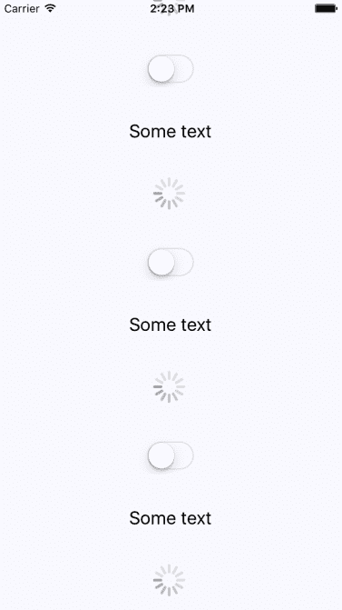
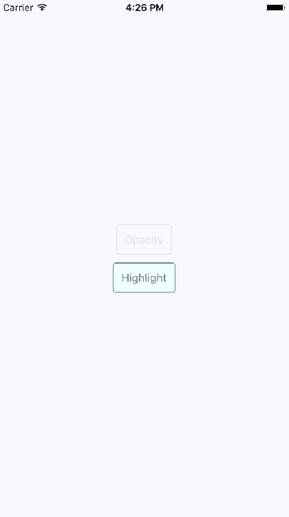
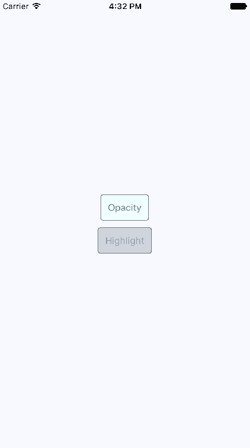
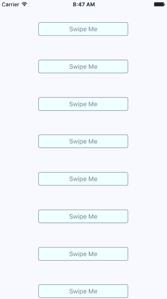
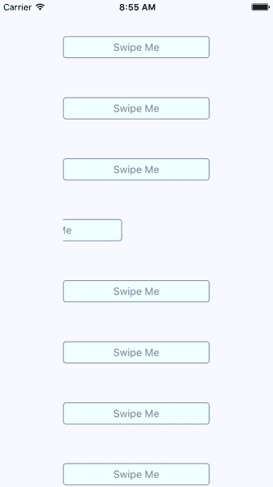
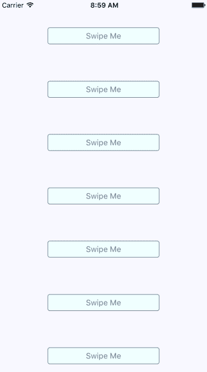

# 第二十一章：响应用户手势

到目前为止，您在本书中实现的所有示例都依赖于用户手势。在传统的 Web 应用程序中，您主要处理鼠标事件。然而，触摸屏依赖用户用手指操作元素，这与鼠标完全不同。

本章的目标是向您展示 React Native 内部手势响应系统的工作原理，以及通过组件公开该系统的一些方式。

首先，您将学习有关滚动的内容。除了触摸之外，这可能是最常见的手势。然后，您将学习在用户与您的组件交互时提供适当级别的反馈。最后，您将实现可以被滑动的组件。

# 用手指滚动

在 Web 应用程序中，通过使用鼠标指针来拖动滚动条来进行滚动，或者通过旋转鼠标滚轮来进行滚动。这在移动设备上不起作用，因为没有鼠标。一切都由屏幕上的手势控制。例如，如果您想向下滚动，您可以使用拇指或食指在屏幕上移动手指来将内容向上拉。

像这样滚动是很难实现的，但它变得更加复杂。当您在移动屏幕上滚动时，会考虑拖动动作的速度。您快速拖动屏幕，然后松开，屏幕将根据您移动的速度继续滚动。在此过程中，您也可以触摸屏幕以阻止其滚动。

幸运的是，您不必处理大部分这些内容。`ScrollView`组件为您处理了大部分滚动复杂性。实际上，在第十六章*渲染项目列表*中，您已经使用了`ScrollView`组件。`ListView`组件内置了`ScrollView`。

您可以通过实现手势生命周期方法来突破用户交互的低级部分。您可能永远不需要这样做，但如果您感兴趣，可以在[`facebook.github.io/react-native/releases/next/docs/gesture-responder-system.html`](http://facebook.github.io/react-native/releases/next/docs/gesture-responder-system.html)上阅读相关内容。

您可以在`ListView`之外使用`ScrollView`。例如，如果您只是渲染文本和其他小部件等任意内容，而不是列表，您可以将其包装在`<ScrollView>`中。以下是一个示例：

```jsx
import React from 'react';
import {
  Text,
  ScrollView,
  ActivityIndicator,
  Switch,
  View
} from 'react-native';

import styles from './styles';

export default () => (
  <View style={styles.container}>
    {/* The "<ScrollView>" can wrap any
         other component to make it scrollable.
         Here, we're repeating an arbitrary group
         of components to create some scrollable
         content */}
    <ScrollView style={styles.scroll}>
      {new Array(6).fill(null).map((v, i) => (
        <View key={i}>
          {/* Abitrary "<Text>" component... */}
          <Text style={[styles.scrollItem, styles.text]}>
            Some text
          </Text>

          {/* Arbitrary "<ActivityIndicator>"... */}
          <ActivityIndicator style={styles.scrollItem} size="large" />

          {/* Arbitrary "<Switch>" component... */}
          <Switch style={styles.scrollItem} />
        </View>
      ))}
    </ScrollView>
  </View>
); 
```

`ScrollView`组件本身并没有太多用处——它用于包装其他组件。它需要一个高度才能正确地发挥作用。以下是滚动样式的外观：

```jsx
scroll: { 
  height: 1, 
  alignSelf: 'stretch', 
}, 
```

`height`设置为`1`，但`alignSelf`的`stretch`值允许项目正确显示。以下是最终结果的外观：



当您拖动内容时，屏幕右侧会出现垂直滚动条。如果运行此示例，您可以尝试进行各种手势，例如使内容自动滚动，然后停止。

# 提供触摸反馈

到目前为止，在本书中您已经使用了纯文本来充当按钮或链接的 React Native 示例。在 Web 应用程序中，要使文本看起来像可以点击的东西，只需用适当的链接包装它。移动设备上没有类似的东西，因此您可以将文本样式化为按钮。

尝试在移动设备上将文本样式化为链接的问题在于它们太难按。按钮为手指提供了更大的目标，并且更容易应用触摸反馈。

让我们将一些文本样式化为按钮。这是一个很好的第一步，使文本看起来可以点击。但是当用户开始与按钮交互时，您还希望给予视觉反馈。React Native 提供了两个组件来帮助实现这一点：`TouchableOpacity`和`TouchableHighlight`。但在深入代码之前，让我们先看一下这些组件在用户与它们交互时的外观，首先是`TouchableOpacity`：



这里渲染了两个按钮，顶部的按钮标有“Opacity”当前正在被用户按下。当按下时，按钮的不透明度会变暗，这为用户提供了重要的视觉反馈。让我们看看当按下时`TouchableHighlight`按钮的外观，如下所示：



当按下时，`TouchableHighlight`组件不会改变不透明度，而是在按钮上添加一个高亮层。在这种情况下，它使用了 slate gray 的更透明的版本来进行高亮显示，slate gray 是字体和边框颜色中使用的颜色。

您使用哪种方法并不重要。重要的是，您为用户提供适当的触摸反馈，以便他们与按钮进行交互。实际上，您可能希望在同一个应用程序中使用两种方法，但用于不同的事物。让我们创建一个`Button`组件，这样可以轻松使用任一方法：

```jsx
import React from 'react';
import PropTypes from 'prop-types';
import {
  Text,
  TouchableOpacity,
  TouchableHighlight
} from 'react-native';

import styles from './styles';

// The "touchables" map is used to get the right
// component to wrap around the button. The
// "undefined" key represents the default.
const touchables = new Map([
  ['opacity', TouchableOpacity],
  ['highlight', TouchableHighlight],
  [undefined, TouchableOpacity]
]);

const Button = ({ label, onPress, touchable }) => {
  // Get's the "Touchable" component to use,
  // based on the "touchable" property value.
  const Touchable = touchables.get(touchable);

  // Properties to pass to the "Touchable"
  // component.
  const touchableProps = {
    style: styles.button,
    underlayColor: 'rgba(112,128,144,0.3)',
    onPress
  };

  // Renders the "<Text>" component that's
  // styled to look like a button, and is
  // wrapped in a "<Touchable>" component
  // to properly handle user interactions.
  return (
    <Touchable {...touchableProps}>
      <Text style={styles.buttonText}> {label} </Text>
    </Touchable>
  );
};

Button.propTypes = {
  onPress: PropTypes.func.isRequired,
  label: PropTypes.string.isRequired,
  touchable: PropTypes.oneOf(['opacity', 'highlight'])
};

export default Button; 
```

`touchables`映射用于确定基于`touchable`属性值的哪个 React Native 可触摸组件包装文本。以下是用于创建此按钮的样式：

```jsx
button: { 
  padding: 10, 
  margin: 5, 
  backgroundColor: 'azure', 
  borderWidth: 1, 
  borderRadius: 4, 
  borderColor: 'slategrey', 
}, 

buttonText: { 
  color: 'slategrey', 
} 
```

以下是如何在主应用程序模块中使用这些按钮：

```jsx
import React from 'react';
import { View } from 'react-native';

import styles from './styles';
import Button from './Button';

export default () => (
  <View style={styles.container}>
    {/* Renders a "<Button>" that uses
         "TouchableOpacity" to handle user
         gestures, since that is the default */}
    <Button onPress={() => {}} label="Opacity" />

    {/* Renders a "<Button>" that uses
         "TouchableHighlight" to handle
         user gestures. */}
    <Button
      onPress={() => {}}
      label="Highlight"
      touchable="highlight"
    />
  </View>
); 
```

请注意，`onPress`回调实际上并不执行任何操作，我们传递它们是因为它们是必需的属性。

# 可滑动和可取消

使原生移动应用程序比移动 Web 应用程序更易于使用的部分原因是它们感觉更直观。使用手势，您可以快速掌握事物的工作原理。例如，用手指在屏幕上滑动元素是一种常见的手势，但手势必须是可发现的。

假设您正在使用一个应用程序，并且不确定屏幕上的某些内容是做什么的。因此，您用手指按下并尝试拖动元素。它开始移动。不确定会发生什么，您松开手指，元素又回到原位。您刚刚发现了这个应用程序的一部分是如何工作的。

您将使用`Scrollable`组件来实现可滑动和可取消的行为。您可以创建一个相对通用的组件，允许用户将文本从屏幕上滑走，并在发生这种情况时调用回调函数。让我们先看看呈现滑动组件的代码，然后再看通用组件本身：

```jsx
import React, { Component } from 'react';
import { View } from 'react-native';
import { fromJS } from 'immutable';

import styles from './styles';
import Swipeable from './Swipeable';

export default class SwipableAndCancellable extends Component {
  // The initial state is an immutable list of
  // 8 swipable items.
  state = {
    data: fromJS(
      new Array(8)
        .fill(null)
        .map((v, id) => ({ id, name: 'Swipe Me' }))
    )
  };

  // Getter for "Immutable.js" state data...
  get data() {
    return this.state.data;
  }

  // Setter for "Immutable.js" state data...
  set data(data) {
    this.setState({ data });
  }

  // The swipe handler passed to "<Swipeable>".
  // The swiped item is removed from the state.
  // This is a higher-order function that returns
  // the real handler so that the "id" context
  // can be set.
  onSwipe = id => () => {
    this.data = this.data.filterNot(v => v.get('id') === id);
  };

  render() {
    return (
      <View style={styles.container}>
        {this.data
          .toJS()
          .map(i => (
            <Swipeable
              key={i.id}
              onSwipe={this.onSwipe(i.id)}
              name={i.name}
            />
          ))}
      </View>
    );
  }
} 
```

这将在屏幕上呈现八个`<Swipeable>`组件。让我们看看这是什么样子：



现在，如果您开始向左滑动其中一个项目，它将移动。这是它的样子：



如果您没有滑动足够远，手势将被取消，并且项目将按预期移回原位。如果您将其完全滑动，项目将从列表中完全移除，并且屏幕上的项目将填充空白空间，就像这样：



现在让我们来看看`Swipeable`组件本身：

```jsx
import React from 'react';
import PropTypes from 'prop-types';
import {
  View,
  ScrollView,
  Text,
  TouchableOpacity
} from 'react-native';

import styles from './styles';

// The "onScroll" handler. This is actually
// a higher-order function that returns the
// actual handler. When the x offset is 200,
// when know that the component has been
// swiped and can call "onSwipe()".
const onScroll = onSwipe => e =>
  e.nativeEvent.contentOffset.x === 200 && onSwipe();

// The static properties used by the "<ScrollView>"
// component.
const scrollProps = {
  horizontal: true,
  pagingEnabled: true,
  showsHorizontalScrollIndicator: false,
  scrollEventThrottle: 10
};

const Swipeable = ({ onSwipe, name }) => (
  <View style={styles.swipeContainer}>
    {/* The "<View>" that wraps this "<ScrollView>"
         is necessary to make scrolling work properly. */}
    <ScrollView {...scrollProps} onScroll={onScroll(onSwipe)}>
      {/* Not strictly necessary, but "<TouchableOpacity>"
           does provide the user with meaningful feedback
           when they initially press down on the text. */}
      <TouchableOpacity>
        <View style={styles.swipeItem}>
          <Text style={styles.swipeItemText}>{name}</Text>
        </View>
      </TouchableOpacity>
      <View style={styles.swipeBlank} />
    </ScrollView>
  </View>
);

Swipeable.propTypes = {
  onSwipe: PropTypes.func.isRequired,
  name: PropTypes.string.isRequired
};

export default Swipeable; 
```

请注意，`<ScrollView>`组件被设置为水平，并且`pagingEnabled`为 true。分页行为会将组件捕捉到位，并提供可取消的行为。这就是为什么在文本组件旁边有一个空白组件的原因。以下是用于此组件的样式：

```jsx
swipeContainer: { 
  flex: 1, 
  flexDirection: 'row', 
  width: 200, 
  height: 30, 
  marginTop: 50, 
}, 

swipeItem: { 
  width: 200, 
  height: 30, 
  backgroundColor: 'azure', 
  justifyContent: 'center', 
  borderWidth: 1, 
  borderRadius: 4, 
  borderColor: 'slategrey', 
}, 

swipeItemText: { 
  textAlign: 'center', 
  color: 'slategrey', 
}, 

swipeBlank: { 
  width: 200, 
  height: 30, 
}, 
```

`swipeBlank`样式与`swipeItem`具有相同的尺寸，但没有其他内容。它是不可见的。

# 总结

在本章中，我们介绍了在原生平台上的手势与移动 web 平台相比的差异。我们首先看了`ScrollView`组件，以及它通过为包装组件提供原生滚动行为而使生活变得更加简单。

接下来，我们花了一些时间实现带有触摸反馈的按钮。这是另一个在移动 web 上很难做到的领域。你学会了如何使用`TouchableOpacity`和`TouchableHighlight`组件。

最后，你实现了一个通用的`Swipeable`组件。滑动是一种常见的移动模式，它允许用户在不感到害怕的情况下发现事物是如何工作的。在下一章中，你将学习如何使用 React Native 来控制图像显示。

# 测试你的知识

1.  web 应用程序和本地移动应用程序之间的用户交互的主要区别是什么？

1.  在 web 和移动应用中，用户交互没有明显的区别。

1.  移动应用程序本质上比其 web 等效版本更快，因此您的代码需要考虑到这一点。

1.  没有鼠标。相反，用户使用手指与您的 UI 进行交互。这是一种与使用鼠标完全不同的体验，需要进行适应。

1.  你如何在 React Native 中为用户提供触摸反馈？

1.  通过将`View`组件传递给`feedback`属性。

1.  通过用`TouchableOpacity`或`TouchableHighlight`组件包装可触摸组件。

1.  你必须在`onPress`处理程序中手动调整视图的样式。

1.  移动应用中的滚动为什么比 web 应用中的滚动复杂得多？

1.  在移动 web 应用中滚动需要考虑诸如速度之类的因素，因为用户是用手指进行交互。否则，交互会感到不自然。

1.  在复杂性上没有真正的区别。

1.  只有当你把它复杂化时，它才会变得复杂。触摸交互可以被实现成与鼠标交互完全相同的行为。

1.  为什么要使用 ScrollView 组件来实现可滑动的行为？

1.  因为这是 Web 应用程序中用户习惯的方式。

1.  因为这是移动 Web 应用程序中用户习惯的方式，以及他们学习 UI 控件的方式。

1.  你不应该实现可滑动的行为。

# 进一步阅读

查看以下链接以获取更多信息：

+   [`facebook.github.io/react-native/docs/scrollview`](https://facebook.github.io/react-native/docs/scrollview)

+   [`facebook.github.io/react-native/docs/touchablehighlight`](https://facebook.github.io/react-native/docs/touchablehighlight)

+   [`facebook.github.io/react-native/docs/touchableopacity`](https://facebook.github.io/react-native/docs/touchableopacity)
