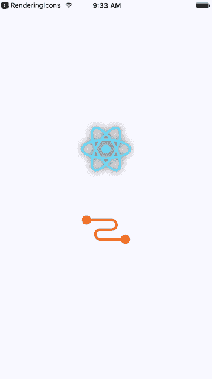
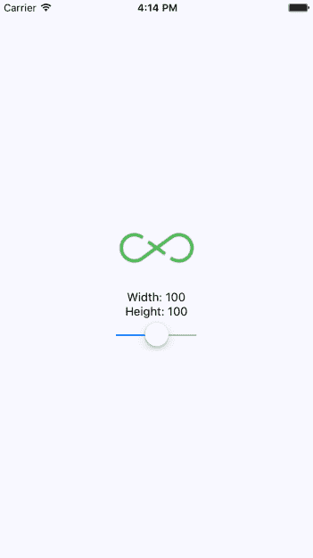
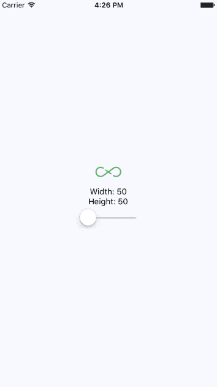
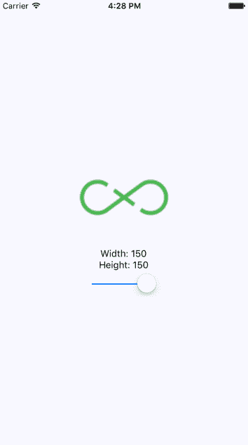
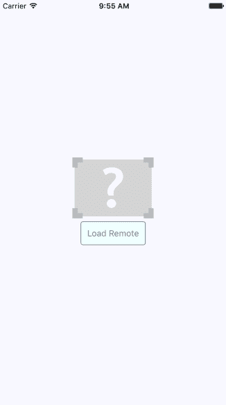
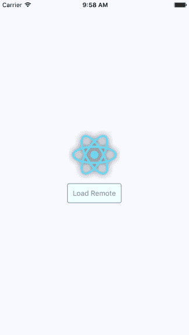
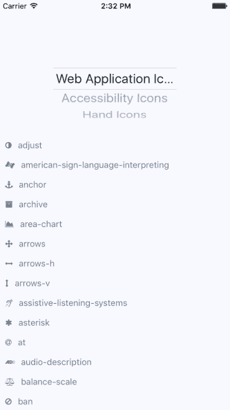

# 第二十二章：控制图像显示

到目前为止，本书中的示例在移动屏幕上还没有渲染任何图像。这并不反映移动应用程序的现实情况。Web 应用程序显示大量图像。如果说什么，原生移动应用程序比 Web 应用程序更依赖图像，因为图像是在有限空间下的强大工具。

在本章中，您将学习如何使用 React Native 的`Image`组件，从不同来源加载图像。然后，您将看到如何使用`Image`组件调整图像大小，以及如何为懒加载的图像设置占位符。最后，您将学习如何使用`react-native-vector-icons`包实现图标。

# 加载图像

让我们开始解决如何加载图像的问题。您可以渲染`<Image>`组件并像任何其他 React 组件一样传递属性。但是这个特定的组件需要图像 blob 数据才能发挥作用。让我们看一些代码：

```jsx
import React from 'react';
import PropTypes from 'prop-types';
import { View, Image } from 'react-native';

import styles from './styles';

// Renders two "<Image>" components, passing the
// properties of this component to the "source"
// property of each image.
const LoadingImages = ({ reactSource, relaySource }) => (
  <View style={styles.container}>
    <Image style={styles.image} source={reactSource} />
    <Image style={styles.image} source={relaySource} />
  </View>
);

// The "source" property can be either
// an object with a "uri" string, or a number
// represending a local "require()" resource.
const sourceProp = PropTypes.oneOfType([
  PropTypes.shape({
    uri: PropTypes.string.isRequired
  }),
  PropTypes.number
]).isRequired;

LoadingImages.propTypes = {
  reactSource: sourceProp,
  relaySource: sourceProp
};

LoadingImages.defaultProps = {
  // The "reactSource" image comes from a remote
  // location.
  reactSource: {
    uri:
      'https://facebook.github.io/react-native/docs/assets/favicon.png'
  },

  // The "relaySource" image comes from a local
  // source.
  relaySource: require('./images/relay.png')
};

export default LoadingImages;
```

有两种方法可以将 blob 数据加载到`<Image>`组件中。第一种方法是从网络加载图像数据。通过将带有`uri`属性的对象传递给`source`来实现。在这个例子中的第二个`<Image>`组件是使用本地图像文件，通过调用`require()`并将结果传递给`source`。

看一下`sourceProp`属性类型验证器。这让您了解可以传递给`source`属性的内容。它要么是一个带有`uri`字符串属性的对象，要么是一个数字。它期望一个数字，因为`require()`返回一个数字。

现在，让我们看看渲染结果如下：



这是与这些图像一起使用的样式：

```jsx
image: { 
  width: 100, 
  height: 100, 
  margin: 20, 
}, 
```

请注意，如果没有`width`和`height`样式属性，图像将不会渲染。在下一节中，您将学习在设置`width`和`height`值时图像调整大小的工作原理。

# 调整图像大小

`Image`组件的`width`和`height`样式属性决定了在屏幕上渲染的大小。例如，您可能会在某个时候需要处理分辨率比您在 React Native 应用程序中想要显示的更大的图像。只需在`Image`上设置`width`和`height`样式属性就足以正确缩放图像。

让我们看一些代码，让您可以使用控件动态调整图像的尺寸，如下所示：

```jsx
import React, { Component } from 'react';
import { View, Text, Image, Slider } from 'react-native';
import { fromJS } from 'immutable';

import styles from './styles';

export default class ResizingImages extends Component {
  // The initial state of this component includes
  // a local image source, and the width/height
  // image dimensions.
  state = {
    data: fromJS({
      source: require('./images/flux.png'),
      width: 100,
      height: 100
    })
  };

  // Getter for "Immutable.js" state data...
  get data() {
    return this.state.data;
  }

  // Setter for "Immutable.js" state data...
  set data(data) {
    this.setState({ data });
  }

  render() {
    // The state values we need...
    const { source, width, height } = this.data.toJS();

    return (
      <View style={styles.container}>
        {/* The image is rendered using the
             "source", "width", and "height"
             state values. */}
        <Image source={source} style={{ width, height }} />
        {/* The current "width" and "height"
             values are displayed. */}
        <Text>Width: {width}</Text>
        <Text>Height: {height}</Text>
        {/* This slider scales the image size
             up or down by changing the "width"
             and "height" states. */}
        <Slider
          style={styles.slider}
          minimumValue={50}
          maximumValue={150}
          value={width}
          onValueChange={v => {
            this.data = this.data.merge({
              width: v,
              height: v
            });
          }}
        />
      </View>
    );
  }
} 
```

如果您使用默认的 100 x 100 尺寸，图像的外观如下：



这是图像的缩小版本：



最后，这是图像的放大版本：

`Image`组件可以传递`resizeMode`属性。这确定了缩放图像如何适应实际组件的尺寸。您将在本章的最后一节中看到此属性的作用。

# 延迟加载图像

有时，您不一定希望图像在渲染时立即加载。例如，您可能正在渲染尚未在屏幕上可见的内容。大多数情况下，从网络获取图像源在实际可见之前是完全可以的。但是，如果您正在微调应用程序并发现通过网络加载大量图像会导致性能问题，您可以懒惰地加载源。

我认为在移动环境中更常见的用例是处理渲染一个或多个图像的情况，其中它们是可见的，但网络响应速度很慢。在这种情况下，您可能希望渲染一个占位图像，以便用户立即看到一些东西，而不是空白空间。

要做到这一点，您可以实现一个包装实际图像的抽象，一旦加载完成，您就可以显示它。以下是代码：

```jsx
import React, { Component } from 'react';
import PropTypes from 'prop-types';
import { View, Image } from 'react-native';

// The local placeholder image source.
const placeholder = require('./images/placeholder.png');

// The mapping to the "loaded" state that gets us
// the appropriate image component.
const Placeholder = props =>
  new Map([
    [true, null],
    [false, <Image {...props} source={placeholder} />]
  ]).get(props.loaded);

class LazyImage extends Component {
  // The "width" and "height" properties
  // are required. All other properties are
  // forwarded to the actual "<Image>"
  // component.
  static propTypes = {
    style: PropTypes.shape({
      width: PropTypes.number.isRequired,
      height: PropTypes.number.isRequired
    })
  };

  constructor() {
    super();

    // We assume that the source hasn't finished
    // loading yet.
    this.state = {
      loaded: false
    };
  }

  render() {
    // The props and state this component
    // needs in order to render...
    const {
      props: {
        style: { width, height }
      },
      state: { loaded }
    } = this;

    return (
      <View style={{ width, height }}>
        {/* The placeholder image is just a standard
             "<Image>" component with a predefined
             source. It isn't rendered if "loaded" is
             true. */}
        <Placeholder loaded={loaded} {...this.props} />
        {/* The actual image is forwarded props that
             are passed to "<LazyImage>". The "onLoad"
             handler ensures the "loaded" state is true,
             removing the placeholder image. */}
        <Image
          {...this.props}
          onLoad={() =>
            this.setState({
              loaded: true
            })
          }
        />
      </View>
    );
  }
}

export default LazyImage; 
```

此组件呈现一个带有两个`Image`组件的`View`。它还具有一个`loaded`状态，最初为 false。当`loaded`为 false 时，将呈现占位图像。当调用“onLoad（）”处理程序时，`loaded`状态设置为 true。这意味着占位图像被移除，主图像被显示。

现在让我们使用您刚刚实现的`LazyImage`组件。您将渲染没有源的图像，并且应该显示占位图像。让我们添加一个按钮，为懒惰图像提供源，当它加载时，占位图像应该被替换。主应用程序模块的外观如下：

```jsx
import React, { Component } from 'react';
import { View } from 'react-native';

import styles from './styles';
import LazyImage from './LazyImage';
import Button from './Button';

// The remote image to load...
const remote =
  'https://facebook.github.io/react-native/docs/assets/favicon.png';

export default class LazyLoading extends Component {
  state = {
    source: null
  };

  render() {
    return (
      <View style={styles.container}>
        {/* Renders the lazy image. Since there's
             no "source" value initially, the placeholder
             image will be rendered. */}
        <LazyImage
          style={{ width: 200, height: 100 }}
          resizeMode="contain"
          source={this.state.source}
        />
        {/* When pressed, this button changes the
             "source" of the lazy image. When the new
             source loads, the placeholder image is
             replaced. */}
        <Button
          label="Load Remote"
          onPress={() =>
            this.setState({
              source: { uri: remote }
            })
          }
        />
      </View>
    );
  }
} 
```

这是屏幕最初的样子：



然后，如果单击“加载远程”按钮，最终将看到我们实际想要的图像：



你可能会注意到，根据你的网络速度，占位图片在你点击加载远程按钮后仍然可见。这是有意设计的，因为你不希望在确保实际图片准备好显示之前移除占位图片。

# 渲染图标

在本章的最后一节中，你将学习如何在 React Native 组件中渲染图标。使用图标来表示含义使 web 应用更易用。那么，原生移动应用为什么要有所不同呢？

你会想要使用`react-native-vector-icons`包将各种矢量字体包引入到你的 React Native 项目中：

```jsx
npm install --save @expo/vector-icons
```

现在你可以导入`Icon`组件并渲染它们。让我们实现一个示例，根据选择的图标类别渲染几个`FontAwesome`图标：

```jsx
import React, { Component } from 'react';
import { View, Picker, FlatList, Text } from 'react-native';
import Icon from 'react-native-vector-icons/FontAwesome';
import { fromJS } from 'immutable';

import styles from './styles';
import iconNames from './icon-names.json';

export default class RenderingIcons extends Component {
  // The initial state consists of the "selected"
  // category, the "icons" JSON object, and the
  // "listSource" used to render the list view.
  state = {
    data: fromJS({
      selected: 'Web Application Icons',
      icons: iconNames,
      listSource: []
    })
  };

  // Getter for "Immutable.js" state data...
  get data() {
    return this.state.data;
  }

  // Setter for "Immutable.js" state data...
  set data(data) {
    this.setState({ data });
  }

  // Sets the "listSource" state based on the
  // "selected" icon state. Also sets the "selected"
  // state.
  updateListSource = selected => {
    this.data = this.data
      .update('listSource', listSource =>
        this.data.getIn(['icons', selected])
      )
      .set('selected', selected);
  };

  // Make sure the "listSource" is populated
  // before the first render.
  componentDidMount() {
    this.updateListSource(this.data.get('selected'));
  }

  render() {
    const { updateListSource } = this;

    // Get the state that we need to render the icon
    // category picker and the list view with icons.
    const selected = this.data.get('selected');
    const categories = this.data
      .get('icons')
      .keySeq()
      .toJS();
    const listSource = this.data.get('listSource');

    return (
      <View style={styles.container}>
        <View style={styles.picker}>
          {/* Lets the user select a FontAwesome icon
               category. When the selection is changed,
               the list view is changed. */}
          <Picker
            selectedValue={selected}
            onValueChange={updateListSource}
          >
            {categories.map(c => (
              <Picker.Item key={c} label={c} value={c} />
            ))}
          </Picker>
        </View>
        <FlatList
          style={styles.icons}
          data={listSource
            .map((value, key) => ({ key: key.toString(), value }))
            .toJS()}
          renderItem={({ item }) => (
            <View style={styles.item}>
              {/* The "<Icon>" component is used
                   to render the FontAwesome icon */}
              <Icon name={item.value} style={styles.itemIcon} />
              {/* Shows the icon class used */}
              <Text style={styles.itemText}>{item.value}</Text>
            </View>
          )}
        />
      </View>
    );
  }
} 
```

当你运行示例时，你应该看到类似以下的东西：



每个图标的颜色都是以与文本颜色相同的方式指定的，通过样式。

# 总结

在本章中，你学会了如何在 React Native 应用中处理图片。在原生移动应用中，图片和在 web 上下文中一样重要——它们提高了用户体验。

你学会了加载图片的不同方法，然后如何调整它们的大小。你还学会了如何实现一个懒加载图片，使用占位图片来显示，直到实际图片加载完成。最后，你学会了如何在 React Native 应用中使用图标。

在下一章中，你将学习关于 React Native 中的本地存储，这在你的应用离线时非常方便。

# 检验你的知识

1.  `Image`组件的`source`属性接受什么类型的值？

1.  `Image`组件接受本地文件的路径。

1.  `Image`组件接受远程图片 URL 的路径。

1.  `Image`组件接受本地文件和远程图片 URL 的路径。

1.  在图片加载时，你应该使用什么作为占位符？

1.  你应该使用一个在图片使用的上下文中有意义的占位图片。

1.  你应该为屏幕上尚未加载的任何图片使用`ActivityIndicator`组件。

1.  `Image`组件会自动为你处理占位符。

1.  你如何使用`Image`组件来缩放图片？

1.  你必须确保`Image`组件中只使用缩放后的图片。

1.  通过设置`width`和`height`属性，`Image`组件将自动处理图像的缩放。

1.  在移动应用程序中缩放图像会消耗大量 CPU，并且应该避免。

1.  值得为您的应用程序安装`react-native-vector-icons`包吗？

1.  是的，这个包可以为您的应用程序提供数千个图标，并且图标是向用户传达意图的重要工具。

1.  不，这会增加很多额外开销，并且图标在移动应用程序中并不有用。

# 进一步阅读

查看以下链接以获取更多信息：

+   [`facebook.github.io/react-native/docs/image`](https://facebook.github.io/react-native/docs/image)

+   [`github.com/oblador/react-native-vector-icons`](https://github.com/oblador/react-native-vector-icons)
