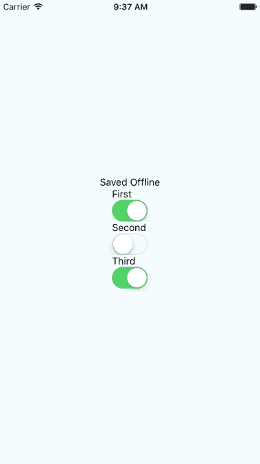

# 第二十三章：离线操作

用户期望应用程序在网络连接不稳定的情况下能够无缝运行。如果您的移动应用程序无法应对瞬时网络问题，那么用户将使用其他应用程序。当没有网络时，您必须在设备上将数据持久保存在本地。或者，也许您的应用程序甚至不需要网络访问，即使是这种情况，您仍然需要在本地存储数据。

在本章中，您将学习如何使用 React Native 执行以下三件事。首先，您将学习如何检测网络连接状态。其次，您将学习如何在本地存储数据。最后，您将学习如何在网络问题导致数据存储后，一旦网络恢复，同步本地数据。

# 检测网络状态

如果您的代码在断开连接时尝试通过`fetch()`进行网络请求，将会发生错误。您可能已经为这些情况设置了错误处理代码，因为服务器可能返回其他类型的错误。然而，在连接问题的情况下，您可能希望在用户尝试进行网络请求之前检测到此问题。

主动检测网络状态有两个潜在原因。您可能会向用户显示友好的消息，指出网络已断开，他们无法做任何事情。然后，您将阻止用户执行任何网络请求，直到检测到网络已恢复。早期检测网络状态的另一个可能好处是，您可以准备在离线状态下执行操作，并在网络重新连接时同步应用程序状态。

让我们看一些使用`NetInfo`实用程序来处理网络状态变化的代码：

```jsx
import React, { Component } from 'react';
import { Text, View, NetInfo } from 'react-native';
import { fromJS } from 'immutable';

import styles from './styles';

// Maps the state returned from "NetInfo" to
// a string that we want to display in the UI.
const connectedMap = {
  none: 'Disconnected',
  unknown: 'Disconnected',
  wifi: 'Connected',
  cell: 'Connected',
  mobile: 'Connected'
};

export default class NetworkState extends Component {
  // The "connected" state is a simple
  // string that stores the state of the
  // network.
  state = {
    data: fromJS({
      connected: ''
    })
  };

  // Getter for "Immutable.js" state data...
  get data() {
    return this.state.data;
  }

  // Setter for "Immutable.js" state data...
  set data(data) {
    this.setState({ data });
  }

  // When the network state changes, use the
  // "connectedMap" to find the string to display.
  onNetworkChange = connection => {
    this.data = this.data.set(
      'connected',
      connectedMap[connection.type]
    );
  };

  // When the component is mounted, we add a listener
  // that changes the "connected" state when the
  // network state changes.
  componentDidMount() {
    NetInfo.addEventListener(
      'connectionChange',
      this.onNetworkChange
    );
  }

  // Make sure the listener is removed...
  componentWillUnmount() {
    NetInfo.removeEventListener(
      'connectionChange',
      this.onNetworkChange
    );
  }

  // Simply renders the "connected" state as
  // it changes.
  render() {
    return (
      <View style={styles.container}>
        <Text>{this.data.get('connected')}</Text>
      </View>
    );
  }
} 
```

该组件将根据`connectedMap`中的字符串值呈现网络状态。`NetInfo`对象的`connectionChange`事件将导致`connected`状态发生变化。例如，当您首次运行此应用程序时，屏幕可能如下所示：


然后，如果您在主机机器上关闭网络，模拟设备上的网络状态也会发生变化，导致我们应用程序的状态如下所示：


# 存储应用程序数据

`AsyncStorage` API 在 iOS 和 Android 平台上的工作方式相同。您可以在不需要任何网络连接的应用程序中使用此 API，或者存储数据，一旦网络可用，就会使用 API 端点最终进行同步。

让我们看一些代码，允许用户输入键和值，然后存储它们：

```jsx
import React, { Component } from 'react';
import {
  Text,
  TextInput,
  View,
  FlatList,
  AsyncStorage
} from 'react-native';
import { fromJS } from 'immutable';

import styles from './styles';
import Button from './Button';

export default class StoringData extends Component {
  // The initial state of this component
  // consists of the current "key" and "value"
  // that the user is entering. It also has
  // a "source" for the list view to display
  // everything that's been stored.
  state = {
    data: fromJS({
      key: null,
      value: null,
      source: []
    })
  };

  // Getter for "Immutable.js" state data...
  get data() {
    return this.state.data;
  }

  // Setter for "Immutable.js" state data...
  set data(data) {
    this.setState({ data });
  }

  // Uses "AsyncStorage.setItem()" to store
  // the current "key" and "value" states.
  // When this completes, we can delete
  // "key" and "value" and reload the item list.
  setItem = () =>
    AsyncStorage.setItem(this.data.get('key'), this.data.get('value'))
      .then(() => {
        this.data = this.data.delete('key').delete('value');
      })
      .then(() => this.loadItems());

  // Uses "AsyncStorage.clear()" to empty any stored
  // values. Then, it loads the empty list of
  // items to clear the item list on the screen.
  clearItems = () =>
    AsyncStorage.clear().then(() => this.loadItems());

  // This method is async because awaits on the
  // data store keys and values, which are two
  // dependent async calls.
  async loadItems() {
    const keys = await AsyncStorage.getAllKeys();
    const values = await AsyncStorage.multiGet(keys);

    this.data = this.data.set('source', fromJS(values));
  }

  // Load any existing items that have
  // already been stored when the app starts.
  componentDidMount() {
    this.loadItems();
  }

  render() {
    // The state that we need...
    const { source, key, value } = this.data.toJS();

    return (
      <View style={styles.container}>
        <Text>Key:</Text>
        <TextInput
          style={styles.input}
          value={key}
          onChangeText={v => {
            this.data = this.data.set('key', v);
          }}
        />
        <Text>Value:</Text>
        <TextInput
          style={styles.input}
          value={value}
          onChangeText={v => {
            this.data = this.data.set('value', v);
          }}
        />
        <View style={styles.controls}>
          <Button label="Add" onPress={this.setItem} />
          <Button label="Clear" onPress={this.clearItems} />
        </View>
        <View style={styles.list}>
          <FlatList
            data={source.map(([key, value]) => ({
              key: key.toString(),
              value
            }))}
            renderItem={({ item: { value, key } }) => (
              <Text>
                {value} ({key})
              </Text>
            )}
          />
        </View>
      </View>
    );
  }
} 
```

在我解释这段代码在做什么之前，让我们先看一下以下屏幕，因为它将提供您所需的大部分解释：


如您所见，有两个输入字段和两个按钮。字段允许用户输入新的键和值。添加按钮允许用户在其设备上本地存储此键值对，而清除按钮则清除先前存储的任何现有项目。

`AsyncStorage` API 在 iOS 和 Android 上的工作方式相同。在底层，`AsyncStorage`的工作方式取决于它正在运行的平台。React Native 能够在两个平台上公开相同的存储 API 的原因是因为它的简单性——它只是键值对。比这更复杂的任何操作都留给应用程序开发人员。

在这个示例中，您围绕`AsyncStorage`创建的抽象很少。想法是设置和获取项目。然而，即使是这样简单的操作也值得一个抽象层。例如，您在这里实现的`setItem()`方法将进行异步调用到`AsyncStorage`并在完成后更新`items`状态。加载项目更加复杂，因为您需要将键和值作为两个单独的异步操作获取。

原因是保持 UI 的响应性。如果在将数据写入磁盘时需要进行待处理的屏幕重绘，通过阻止它们发生来阻止会导致用户体验不佳。

# 同步应用程序数据

到目前为止，在本章中，您已经学会了如何检测网络连接的状态，以及如何在 React Native 应用程序中本地存储数据。现在是时候结合这两个概念，并实现一个可以检测网络中断并继续运行的应用程序。

基本思想是只有在确定设备在线时才发出网络请求。如果知道设备不在线，可以在本地存储任何状态更改。然后，当您再次在线时，可以将这些存储的更改与远程 API 同步。

让我们实现一个简化的 React Native 应用程序来实现这一点。第一步是实现一个抽象层，位于 React 组件和存储数据的网络调用之间。我们将称这个模块为`store.js`：

```jsx
import { NetInfo, AsyncStorage } from 'react-native';
import { Map as ImmutableMap } from 'immutable';

// Mock data that would otherwise come from a real
// networked API endpoint.
const fakeNetworkData = {
  first: false,
  second: false,
  third: false
};

// We'll assume that the device isn't "connected"
// by default.
let connected = false;

// There's nothing to sync yet...
const unsynced = [];

// Sets the given "key" and "value". The idea
// is that application that uses this function
// shouldn't care if the network is connected
// or not.
export const set = (key, value) =>
  // The returned promise resolves to true
  // if the network is connected, false otherwise.
  new Promise((resolve, reject) => {
    if (connected) {
      // We're online - make the proper request (or fake
      // it in this case) and resolve the promise.
      fakeNetworkData[key] = value;
      resolve(true);
    } else {
      // We're offline - save the item using "AsyncStorage"
      // and add the key to "unsynced" so that we remember
      // to sync it when we're back online.
      AsyncStorage.setItem(key, value.toString()).then(
        () => {
          unsynced.push(key);
          resolve(false);
        },
        err => reject(err)
      );
    }
  });

// Gets the given key/value. The idea is that the application
// shouldn't care whether or not there is a network connection.
// If we're offline and the item hasn't been synced, read it
// from local storage.
export const get = key =>
  new Promise((resolve, reject) => {
    if (connected) {
      // We're online. Resolve the requested data.
      resolve(key ? fakeNetworkData[key] : fakeNetworkData);
    } else if (key) {
      // We've offline and they're asking for a specific key.
      // We need to look it up using "AsyncStorage".
      AsyncStorage.getItem(key).then(
        item => resolve(item),
        err => reject(err)
      );
    } else {
      // We're offline and they're asking for all values.
      // So we grab all keys, then all values, then we
      // resolve a plain JS object.
      AsyncStorage.getAllKeys().then(
        keys =>
          AsyncStorage.multiGet(keys).then(
            items => resolve(ImmutableMap(items).toJS()),
            err => reject(err)
          ),
        err => reject(err)
      );
    }
  });

// Check the network state when the module first
// loads so that we have an accurate value for "connected".
NetInfo.getConnectionInfo().then(
  connection => {
    connected = ['wifi', 'unknown'].includes(connection.type);
  },
  () => {
    connected = false;
  }
);

// Register a handler for when the state of the network changes.
NetInfo.addEventListener('connectionChange', connection => {
  // Update the "connected" state...
  connected = ['wifi', 'unknown'].includes(connection.type);

  // If we're online and there's unsynced values,
  // load them from the store, and call "set()"
  // on each of them.
  if (connected && unsynced.length) {
    AsyncStorage.multiGet(unsynced).then(items => {
      items.forEach(([key, val]) => set(key, val));
      unsynced.length = 0;
    });
  }
}); 
```

该模块导出了两个函数——`set()`和`get()`。它们的工作分别是设置和获取数据。由于这只是演示如何在本地存储和网络端点之间同步的示例，因此该模块只是用`fakeNetworkData`对象模拟了实际网络。

让我们先看看`set()`函数。这是一个异步函数，它总是返回一个解析为布尔值的 promise。如果为 true，则表示您在线，并且网络调用成功。如果为 false，则表示您离线，并且使用`AsyncStorage`保存了数据。

`get()`函数也采用了相同的方法。它返回一个解析布尔值的 promise，指示网络的状态。如果提供了一个键参数，那么将查找该键的值。否则，将返回所有值，无论是从网络还是从`AsyncStorage`中。

除了这两个函数之外，该模块还做了另外两件事。它使用`NetInfo.getConnectionInfo()`来设置`connected`状态。然后，它添加了一个监听器以侦听网络状态的变化。这就是当您离线时本地保存的项目在再次连接时与网络同步的方式。

现在让我们看一下使用这些函数的主要应用程序：

```jsx
import React, { Component } from 'react';
import { Text, View, Switch, NetInfo } from 'react-native';
import { fromJS } from 'immutable';

import styles from './styles';
import { set, get } from './store';

// Used to provide consistent boolean values
// for actual booleans and their string representations.
const boolMap = {
  true: true,
  false: false
};

export default class SynchronizingData extends Component {
  // The message state is used to indicate that
  // the user has gone offline. The other state
  // items are things that the user wants to change
  // and sync.
  state = {
    data: fromJS({
      message: null,
      first: false,
      second: false,
      third: false
    })
  };

  // Getter for "Immutable.js" state data...
  get data() {
    return this.state.data;
  }

  // Setter for "Immutable.js" state data...
  set data(data) {
    this.setState({ data });
  }

  // Generates a handler function bound to a given key.
  save = key => value => {
    // Calls "set()" and depending on the resolved value,
    // sets the user message.
    set(key, value).then(
      connected => {
        this.data = this.data
          .set('message', connected ? null : 'Saved Offline')
          .set(key, value);
      },
      err => {
        this.data = this.data.set('message', err);
      }
    );
  };

  componentDidMount() {
    // We have to call "NetInfo.fetch()" before
    // calling "get()" to ensure that the
    // connection state is accurate. This will
    // get the initial state of each item.
    NetInfo.getConnectionInfo().then(() =>
      get().then(
        items => {
          this.data = this.data.merge(items);
        },
        err => {
          this.data = this.data.set('message', err);
        }
      )
    );
  }

  render() {
    // Bound methods...
    const { save } = this;

    // State...
    const { message, first, second, third } = this.data.toJS();

    return (
      <View style={styles.container}>
        <Text>{message}</Text>
        <View>
          <Text>First</Text>
          <Switch
            value={boolMap[first.toString()]}
            onValueChange={save('first')}
          />
        </View>
        <View>
          <Text>Second</Text>
          <Switch
            value={boolMap[second.toString()]}
            onValueChange={save('second')}
          />
        </View>
        <View>
          <Text>Third</Text>
          <Switch
            value={boolMap[third.toString()]}
            onValueChange={save('third')}
          />
        </View>
      </View>
    );
  }
} 
```

`App`组件的工作是保存三个复选框的状态，当您为用户提供无缝的在线和离线模式切换时，这是困难的。幸运的是，您在另一个模块中实现的`set()`和`get()`抽象层隐藏了大部分细节，使应用功能更加简单。

然而，您会注意到，在尝试加载任何项目之前，您需要在此模块中检查网络状态。如果您不这样做，那么`get()`函数将假定您处于离线状态，即使连接正常。应用程序的外观如下：



请注意，直到您在 UI 中更改了某些内容，您才会实际看到“已保存离线”消息。

# 总结

本章介绍了在 React Native 应用程序中离线存储数据。您希望在设备离线并且您的应用无法与远程 API 通信时，才需要将数据存储在本地。然而，并非所有应用程序都需要 API 调用，`AsyncStorage`可以用作通用存储机制。您只需要围绕它实现适当的抽象。

您还学会了如何在 React Native 应用程序中检测网络状态的变化。了解设备何时离线很重要，这样您的存储层就不会进行无谓的网络调用尝试。相反，您可以让用户知道设备处于离线状态，然后在连接可用时同步应用程序状态。

这就结束了本书的第二部分。您已经了解了如何为 Web 构建 React 组件，以及为移动平台构建 React 组件。在本书的开头，我提出了 React 之美在于渲染目标的概念。React 的声明式编程接口永远不需要更改。将 JSX 元素转换的底层机制是完全可替换的 - 理论上，您可以将 React 渲染到任何地方。

在本书的最后部分，我将讨论 React 应用程序中的状态。状态和管理其在应用程序中流动的策略可以决定 React 架构的成败。

# 测试您的知识

1.  为什么`AsyncStorage` API 中的操作是异步的？

1.  这样您可以同时执行大量存储操作。

1.  为了不干扰 UI 的响应性。

1.  它们不是异步操作，它们只是返回承诺，以保持与其他存储 API 的一致性。

1.  您将使用哪个`AsyncStorage` API 来一次查找多个项目？

1.  `AsyncStorage.getAll()`

1.  `AsyncStorage.filter()`

1.  `AsyncStorage.getAllKeys()`和`AsyncStorage.multiGet()`的组合。

1.  在 React Native 应用程序中如何获取设备的连接状态？

1.  您调用`NetInfo.getConnectionInfo()`并读取结果连接类型。

1.  您调用`NetInfo.getConnectionInfo()`，如果返回 true，则表示已连接。否则，您处于离线状态。

1.  有一个全局的`reactNativeConnectionInfo`对象，您可以随时从中读取以确定连接的状态。

1.  在 React Native 应用程序中如何响应连接状态的变化？

1.  无法响应连接状态的更改。

1.  您可以通过调用`NetInfo.addEventListener('connectionChange', ...)`来监听`connectionChange`事件。

1.  您可以为`NetInfo.onChange()` API 提供回调函数。

# 进一步阅读

访问以下链接以获取更多信息：

+   [`facebook.github.io/react-native/docs/asyncstorage`](https://facebook.github.io/react-native/docs/asyncstorage)

+   [`facebook.github.io/react-native/docs/netinfo`](https://facebook.github.io/react-native/docs/netinfo)
