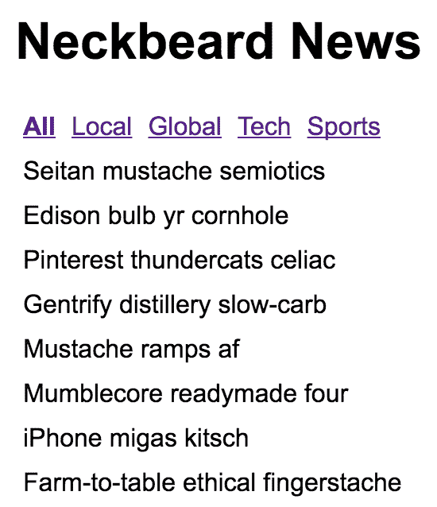

# 第二十四章：处理应用程序状态

在本书的早期，你一直在使用状态来控制你的 React 组件。状态是任何 React 应用程序中的重要概念，因为它控制用户可以看到和交互的内容。没有状态，你只有一堆空的 React 组件。

在本章中，你将学习 Flux 以及它如何作为信息架构的基础。然后，你将学习如何构建最适合 Web 和移动架构的架构。你还将介绍 Redux 库，然后讨论 React 架构的局限性以及如何克服它们。

# 信息架构和 Flux

将用户界面视为信息架构可能很难。更常见的是，你对 UI 应该如何看起来和行为有一个大致的想法，然后你实现它。我一直这样做，这是一个很好的方法，可以让事情开始进行，及早发现你的方法存在的问题等等。但是然后我喜欢退一步，想象没有任何小部件时会发生什么。不可避免的是，我构建的东西在状态通过各种组件流动方面存在缺陷。这没关系；至少现在我有东西可以使用。我只需要确保在构建太多之前解决信息架构的问题。

Flux 是 Facebook 创建的一组模式，它帮助开发人员以与其应用程序自然契合的方式思考他们的信息架构。接下来我将介绍 Flux 的关键概念，这样你就可以将这些想法应用到统一的 React 架构中。

# 单向性

在本书的前面，我介绍了 React 组件的容器模式。容器组件具有状态，但实际上不会呈现任何 UI 元素。相反，它呈现其他 React 组件并将其状态作为属性传递。每当容器状态更改时，子组件都会使用新的属性值重新呈现。这是单向数据流。

Flux 采纳了这个想法，并将其应用于称为存储的东西。**存储**是一个抽象概念，它保存应用程序状态。就我而言，React 容器是一个完全有效的 Flux 存储。我一会儿会详细介绍存储。首先，我希望你理解为什么单向数据流是有利的。

您很可能已经实现了一个改变状态的 UI 组件，但并不总是确定它是如何发生的。它是另一个组件中的某个事件的结果吗？是某个网络调用完成的副作用吗？当发生这种情况时，您会花费大量时间追踪更新的来源。结果往往是一个连续的麻烦游戏。当改变只能来自一个方向时，您可以排除许多其他可能性，从而使整体架构更可预测。

# 同步更新轮次

当您改变 React 容器的状态时，它将重新渲染其子组件，子组件将重新渲染它们的子组件，依此类推。在 Flux 术语中，这称为*更新轮次*。从状态改变到 UI 元素反映这一变化的时间，这就是轮次的边界。能够将应用程序行为的动态部分分组成更大的块是很好的，因为这样更容易理解因果关系。

React 容器组件的一个潜在问题是它们可以交织在一起并以非确定性的顺序进行渲染。例如，如果某个 API 调用完成并导致在另一个更新轮次中的渲染完成之前发生状态更新，会发生什么？如果不认真对待，异步性的副作用会累积并演变成不可持续的架构。

Flux 架构中的解决方案是强制同步更新轮次，并将试图规避更新轮次顺序的尝试视为错误。JavaScript 是一个单线程的、运行至完成的环境，应该通过与之合作而不是对抗来接受它。先更新整个 UI，然后再次更新整个 UI。事实证明，React 是这项工作的一个非常好的工具。

# 可预测的状态转换

在 Flux 架构中，您有一个用于保存应用程序状态的存储。您知道，当状态发生变化时，它是同步和单向的，使整个系统更可预测且更易于理解。然而，还有一件事可以做，以确保不会引入副作用。

你将所有应用程序状态都保存在一个存储中，这很好，但你仍然可以通过在其他地方改变数据来破坏一切。这些变化乍看起来可能无害，但对你的架构来说是有害的。例如，处理`fetch()`调用的回调函数可能在将数据传递给存储之前对数据进行操作。事件处理程序可能生成一些结构并将其传递给存储。可能性是无限的。

在存储之外执行这些状态转换的问题在于你并不一定知道它们正在发生。将数据变异看作蝴蝶效应：一个小的改变会产生不明显的深远影响。解决方案是只在存储中变异状态，没有例外。这样做是可预测的，可以轻松追踪你的 React 架构的因果关系。

我一直在本书的大部分示例中使用`Immutable.js`来管理状态。当你考虑 Flux 架构中的状态转换时，这将会很有用。控制状态转换发生的位置很重要，但状态的不可变性也很重要。它有助于强化 Flux 架构的理念，当我们深入了解 Redux 时，你将更深入地了解这些理念。

# 统一的信息架构

让我们回顾一下到目前为止我们应用程序架构的要素：

+   **React Web**：在 Web 浏览器中运行的应用程序

+   **React Native**：在移动平台上本地运行的应用程序

+   **Flux**：可扩展数据在 React 应用程序中的模式

记住，React 只是一个位于渲染目标之上的抽象。两个主要的渲染目标是浏览器和移动原生应用。这个列表可能会不断增长，所以你需要设计你的架构，以便不排除未来的可能性。挑战在于你不是将一个 Web 应用程序移植到原生移动应用程序；它们是不同的应用程序，但它们有相同的目的。

话虽如此，是否有一种方式可以基于 Flux 的思想仍然拥有某种统一的信息架构，可以被这些不同的应用使用？我能想到的最好答案，不幸的是，是：有点。你不希望让不同的网页和移动用户体验导致在处理状态上采取截然不同的方法。如果应用的目标是相同的，那么必须有一些共同的信息可以使用，使用相同的 Flux 概念。

困难的部分在于网页和原生移动应用是不同的体验，这意味着你的应用状态的形式会有所不同。它必须是不同的；否则，你只是在不同平台之间移植，这违背了使用 React Native 来利用浏览器中不存在的功能的初衷。

# 实现 Redux

你将使用一个叫做 Redux 的库来实现一个演示 Flux 架构的基本应用。Redux 并不严格遵循 Flux 所设定的模式。相反，它借鉴了 Flux 的关键思想，并实现了一个小的 API，使得实现 Flux 变得容易。

应用本身将是一个新闻阅读器，一个你可能从未听说过的时髦读者。这是一个简单的应用，但我想要在实现过程中突出架构上的挑战。即使是简单的应用，在关注数据时也会变得复杂。

你将实现这个应用的两个版本。你将从网页版本开始，然后实现移动——iOS 和 Android 的原生应用。你将看到如何在应用之间共享架构概念。当你需要在多个平台上实现相同的应用时，这降低了概念上的负担。你现在正在实现两个应用，但随着 React 扩展其渲染能力，将来可能会有更多。

我再次敦促你从[`github.com/PacktPublishing/React-and-React-Native-Second-Edition`](https://github.com/PacktPublishing/React-and-React-Native-Second-Edition)下载本书的代码示例。这本书中有很多我无法在书中覆盖的细节，尤其是对于我们即将看到的这些示例应用。

# 初始应用状态

让我们首先看一下 Flux 存储的初始状态。在 Redux 中，应用的整个状态由一个单一的存储表示。它看起来是这样的：

```jsx
import { fromJS } from 'immutable';

// The state of the application is contained
// within an Immutable.js Map. Each key represents
// a "slice" of state.
export default fromJS({
  // The "App" state is the generic state that's
  // always visible. This state is not specific to
  // one particular feature, in other words. It has
  // the app title, and links to various article
  // sections.
  App: {
    title: 'Neckbeard News',
    links: [
      { name: 'All', url: '/' },
      { name: 'Local', url: '/local' },
      { name: 'Global', url: '/global' },
      { name: 'Tech', url: '/tech' },
      { name: 'Sports', url: '/sports' }
    ]
  },

  // The "Home" state is where lists of articles are
  // rendered. Initially, there are no articles, so
  // the "articles" list is empty until they're fetched
  // from the API.
  Home: {
    articles: []
  },

  // The "Article" state represents the full article. The
  // assumption is that the user has navigated to a full
  // article page and we need the entire article text here.
  Article: {
    full: ''
  }
}); 
```

该模块导出一个`Immutable.js Map`实例。稍后您会明白原因。但现在，让我们看看这个状态的组织。在 Redux 中，您通过切片来划分应用程序状态。在这种情况下，这是一个简单的应用程序，因此存储只有三个状态切片。每个状态切片都映射到一个主要的应用程序功能。

例如，`Home`键表示应用程序的`Home`组件使用的状态。初始化任何状态都很重要，即使它是一个空对象或数组，这样您的组件就有了初始属性。现在让我们使用一些 Redux 函数来创建一个用于向您的 React 组件获取数据的存储。

# 创建存储

初始状态在应用程序首次启动时很有用。这足以呈现组件，但仅此而已。一旦用户开始与 UI 交互，您需要一种改变存储状态的方法。在 Redux 中，您为存储中的每个状态切片分配一个减速器函数。因此，例如，您的应用程序将有一个`Home`减速器，一个`App`减速器和一个`Article`减速器。

Redux 中减速器的关键概念是它是纯净的，没有副作用。这就是在状态中使用`Immutable.js`结构有用的地方。让我们看看如何将初始状态与最终改变我们存储状态的减速器函数联系起来：

```jsx
import { createStore } from 'redux';
import { combineReducers } from 'redux-immutable';

// So build a Redux store, we need the "initialState"
// and all of our reducer functions that return
// new state.
import initialState from './initialState';
import App from './App';
import Home from './Home';
import Article from './Article';

// The "createStore()" and "combineReducers()" functions
// perform all of the heavy-lifting.
export default createStore(
  combineReducers({
    App,
    Home,
    Article
  }),
  initialState
); 
```

`App`，`Home`和`Article`函数的命名方式与它们操作的状态片段完全相同。随着应用程序的增长，这使得添加新的状态和减速器函数变得更容易。

现在您有一个准备就绪的 Redux 存储。但您仍然没有将其连接到实际呈现状态的 React 组件。现在让我们看看如何做到这一点。

# 存储提供程序和路由

Redux 有一个`Provider`组件（技术上，它是`react-redux`包提供的），用于包装应用程序的顶级组件。这将确保 Redux 存储数据对应用程序中的每个组件都可用。

在您正在开发的潮流新闻阅读器应用中，您将使用`Provider`组件将`Router`组件包装起来。然后，在构建组件时，您知道存储数据将可用。以下是`Root`组件的外观：

```jsx
import React from 'react';
import { Provider } from 'react-redux';

import store from '../store';
import App from './App';

export default () => (
  <Provider store={store}>
    <App />
  </Provider>
);
```

通过将初始状态与减速器函数组合来创建的存储器被传递给`<Provider>`。这意味着，当你的减速器导致 Redux 存储器改变时，存储器数据会自动传递给每个应用程序组件。接下来我们将看一下`App`组件。

# App 组件

`App`组件包括页面标题和各种文章分类的链接列表。当用户在用户界面中移动时，`App`组件总是被渲染，但每个`<Route>`元素根据当前路由渲染不同的内容。让我们来看一下这个组件，然后我们将分解它的工作原理：

```jsx
import React from 'react';
import {
  BrowserRouter as Router,
  Route,
  NavLink
} from 'react-router-dom';
import { connect } from 'react-redux';

// Components that render application state.
import Home from './Home';
import Article from './Article';

// Higher order component for making the
// various article section components out of
// the "Home" component. The only difference
// is the "filter" property. Having unique JSX
// element names is easier to read than a bunch
// of different property values.
const articleList = filter => props => (
  <Home {...props} filter={filter} />
);

const categoryListStyle = {
  listStyle: 'none',
  margin: 0,
  padding: 0,
  display: 'flex'
};

const categoryItemStyle = {
  padding: '5px'
};

const Local = articleList('local');
const Global = articleList('global');
const Tech = articleList('tech');
const Sports = articleList('sports');

// Routes to the home page, the different
// article sections, and the article details page.
// The "<Provider>" element is how we pass Redux
// store data to each of our components.
export default connect(state => state.get('App').toJS())(
  ({ title, links }) => (
    <Router>
      <main>
        <h1>{title}</h1>
        <ul style={categoryListStyle}>
          {/* Renders a link for each article category.
             The key thing to note is that the "links"
             value comes from a Redux store. */}
          {links.map(l => (
            <li key={l.url} style={categoryItemStyle}>
              <NavLink
                exact
                to={l.url}
                activeStyle={{ fontWeight: 'bold' }}
              >
                {l.name}
              </NavLink>
            </li>
          ))}
        </ul>
        <section>
          <Route exact path="/" component={Home} />
          <Route exact path="/local" component={Local} />
          <Route exact path="/global" component={Global} />
          <Route exact path="/tech" component={Tech} />
          <Route exact path="/sports" component={Sports} />
          <Route exact path="/articles/:id" component={Article} />
        </section>
      </main>
    </Router>
  )
);

```

这个组件需要一个`title`属性和一个`links`属性。这两个值实际上都是来自 Redux 存储器的状态。请注意，它导出了一个使用`connect()`函数创建的高阶组件。这个函数接受一个回调函数，将存储器状态转换为组件需要的属性。

在这个例子中，你需要`App`状态。使用`toJS()`方法将这个映射转换为普通的 JavaScript 对象。这就是 Redux 状态传递给组件的方式。下面是`App`组件的渲染内容：



暂时忽略这些惊人的文章标题；我们稍后会回到这些。标题和分类链接是由`App`组件渲染的。文章标题是由`<Route>`元素之一渲染的。

注意所有分类都是粗体吗？这是因为它是当前选定的分类。如果选择了本地分类，所有文本将恢复为常规字体，而本地文本将加粗。这一切都是通过 Redux 状态控制的。现在让我们来看一下`App`减速器函数：

```jsx
import { fromJS } from 'immutable';
import initialState from './initialState';

// The initial page heading.
const title = initialState.getIn(['App', 'title']);

// Links to display when an article is displayed.
const articleLinks = fromJS([
  {
    name: 'Home',
    url: '/'
  }
]);

// Links to display when we're on the home page.
const homeLinks = initialState.getIn(['App', 'links']);

// Maps the action type to a function
// that returns new state.
const typeMap = fromJS({
  // The article is being fetched, adjust
  // the "title" and "links" state.
  FETCHING_ARTICLE: state =>
    state.set('title', '...').set('links', articleLinks),

  // The article has been fetched. Set the title
  // of the article.
  FETCH_ARTICLE: (state, payload) =>
    state.set('title', payload.title),

  // The list of articles are being fetched. Set
  // the "title" and the "links".
  FETCHING_ARTICLES: state =>
    state.set('title', title).set('links', homeLinks),

  // The articles have been fetched, update the
  // "title" state.
  FETCH_ARTICLES: state => state.set('title', title)
});

// This reducer relies on the "typeMap" and the
// "type" of action that was dispatched. If it's
// not found, then the state is simply returned.
export default (state, { type, payload }) =>
  typeMap.get(type, () => state)(state, payload); 
```

关于这个减速器逻辑，我想提出两点。首先，你现在可以看到，使用不可变数据结构使得这段代码简洁易懂。其次，对于简单的操作，这里发生了很多状态处理。例如，以`FETCHING_ARTICLE`和`FETCHING_ARTICLES`操作为例。在实际发出网络请求之前，你希望改变 UI。我认为这种明确性是 Flux 和 Redux 的真正价值。你知道为什么某些东西会改变。它是明确的，但不啰嗦。

# 主页组件

Redux 架构中缺少的最后一个重要部分是动作创建函数。这些函数由组件调用，以便向 Redux 存储发送有效负载。调度任何操作的最终结果是状态的改变。然而，有些操作需要去获取状态，然后才能作为有效负载调度到存储中。

让我们来看看`Neckbeard News`应用程序的`Home`组件。它将向您展示如何在将组件连接到 Redux 存储时传递动作创建函数。以下是代码：

```jsx
import React, { Component } from 'react';
import PropTypes from 'prop-types';
import { connect } from 'react-redux';
import { Link } from 'react-router-dom';
import { Map } from 'immutable';

// Various styles...
const listStyle = {
  listStyle: 'none',
  margin: 0,
  padding: 0
};

const listItemStyle = {
  margin: '0 5px'
};

const titleStyle = {
  background: 'transparent',
  border: 'none',
  font: 'inherit',
  cursor: 'pointer',
  padding: '5px 0'
};

// What to render when the article list is empty
// (true/false). When it's empty, a single elipses
// is displayed.
const emptyMap = Map()
  .set(true, <li style={listItemStyle}>...</li>)
  .set(false, null);

class Home extends Component {
  static propTypes = {
    articles: PropTypes.arrayOf(PropTypes.object).isRequired,
    fetchingArticles: PropTypes.func.isRequired,
    fetchArticles: PropTypes.func.isRequired,
    toggleArticle: PropTypes.func.isRequired,
    filter: PropTypes.string.isRequired
  };

  static defaultProps = {
    filter: ''
  };

  // When the component is mounted, there's two actions
  // to dispatch. First, we want to tell the world that
  // we're fetching articles before they're actually
  // fetched. Then, we call "fetchArticles()" to perform
  // the API call.
  componentWillMount() {
    this.props.fetchingArticles();
    this.props.fetchArticles(this.props.filter);
  }

  // When an article title is clicked, toggle the state of
  // the article by dispatching the toggle article action.
  onTitleClick = id => () => this.props.toggleArticle(id);

  render() {
    const { onTitleClick } = this;
    const { articles } = this.props;

    return (
      <ul style={listStyle}>
        {emptyMap.get(articles.length === 0)}
        {articles.map(a => (
          <li key={a.id} style={listItemStyle}>
            <button onClick={onTitleClick(a.id)} style={titleStyle}>
              {a.title}
            </button>
            {/* The summary of the article is displayed
                 based on the "display" property. This state
                 is toggled when the user clicks the title. */}
            <p style={{ display: a.display }}>
              <small>
                <span>{a.summary} </span>
                <Link to={`articles/${a.id}`}>More...</Link>
              </small>
            </p>
          </li>
        ))}
      </ul>
    );
  }
}

// The "connect()" function connects this component
// to the Redux store. It accepts two functions as
// arguments...
export default connect(
  // Maps the immutable "state" object to a JavaScript
  // object. The "ownProps" are plain JSX props that
  // are merged into Redux store data.
  (state, ownProps) =>
    Object.assign(state.get('Home').toJS(), ownProps),

  // Sets the action creator functions as props. The
  // "dispatch()" function is when actually invokes
  // store reducer functions that change the state
  // of the store, and cause new prop values to be passed
  // to this component.
  dispatch => ({
    fetchingArticles: () =>
      dispatch({
        type: 'FETCHING_ARTICLES'
      }),

    fetchArticles: filter => {
      const headers = new Headers();
      headers.append('Accept', 'application/json');

      fetch(`/api/articles/${filter}`, { headers })
        .then(resp => resp.json())
        .then(json =>
          dispatch({
            type: 'FETCH_ARTICLES',
            payload: json
          })
        );
    },

    toggleArticle: payload =>
      dispatch({
        type: 'TOGGLE_ARTICLE',
        payload
      })
  })
)(Home); 
```

让我们专注于`connect()`函数，它用于将`Home`组件连接到存储。第一个参数是一个函数，它从存储中获取相关状态，并将其作为此组件的`props`返回。它使用`ownProps`，这样您就可以直接将`props`传递给组件，并覆盖存储中的任何内容。`filter`属性是我们需要这种能力的原因。

第二个参数是一个函数，它将动作创建函数作为`props`返回。`dispatch()`函数是这些动作创建函数能够向存储传递有效负载的方式。例如，`toggleArticle()`函数直接调用了`dispatch()`，并且是响应用户点击文章标题时调用的。然而，`fetchingArticles()`调用涉及异步行为。这意味着直到`fetch()`承诺解决之前，`dispatch()`才会被调用。您需要确保在此期间不会发生意外情况。

让我们通过查看与`Home`组件一起使用的 reducer 函数来结束这些内容：

```jsx
import { fromJS } from 'immutable';

const typeMap = fromJS({
  // Clear any old articles right before
  // we fetch new articles.
  FETCHING_ARTICLES: state =>
    state.update('articles', a => a.clear()),

  // Articles have been fetched. Update the
  // "articles" state, and make sure that the
  // summary display is "none".
  FETCH_ARTICLES: (state, payload) =>
    state.set(
      'articles',
      fromJS(payload)
        .map(a => a.set('display', 'none'))
    ),

  // Toggles the state of the selected article
  // "id". First we have to find the index of
  // the article so that we can update it's
  // "display" state. If it's already hidden,
  // we show it, and vice-versa.
  TOGGLE_ARTICLE: (state, id) =>
    state.updateIn([
      'articles',
      state
        .get('articles')
        .findIndex(a => a.get('id') === id),
      'display',
    ], display =>
      display === 'none' ?
        'block' : 'none'
    ),
});

export default (state, { type, payload }) =>
  typeMap.get(type, s => s)(state, payload); 
```

在这里也使用了使用类型映射根据操作类型改变状态的相同技术。再次强调，这段代码易于理解，但系统中可以发生变化的所有内容都是明确的。

# 移动应用中的状态

在 React Native 移动应用中使用 Redux 怎么样？当然应该，如果您正在为 Web 和原生平台开发相同的应用程序。事实上，我已经在 React Native 中为 iOS 和 Android 都实现了`Neckbeard News`。我鼓励您下载本书的代码，并让这个应用程序在 Web 和原生移动设备上运行。

在移动应用中，实际上使用 Redux 并没有什么不同。唯一的区别在于所使用的状态的形状。换句话说，不要认为你可以在网页和原生应用的版本中使用完全相同的 Redux 存储和减速器函数。想想 React Native 组件。许多事情并没有一种大小适合所有的组件。你有一些组件针对 iOS 平台进行了优化，而其他一些则针对 Android 平台进行了优化。Redux 状态也是同样的道理。以下是移动应用`Neckbeard News`的初始状态：

```jsx
import { fromJS } from 'immutable';

export default fromJS({
  Main: {
    title: 'All',
    component: 'articles',
  },
  Categories: {
    items: [
      {
        title: 'All',
        filter: '',
        selected: true,
      },
      {
        title: 'Local',
        filter: 'local',
        selected: false,
      },
      {
        title: 'Global',
        filter: 'global',
        selected: false,
      },
      {
        title: 'Tech',
        filter: 'tech',
        selected: false,
      },
      {
        title: 'Sports',
        filter: 'sports',
        selected: false,
      },
    ],
  },
  Articles: {
    filter: '',
    items: [],
  },
  Article: {
    full: '',
  },
}); 
```

正如你所看到的，适用于 Web 环境的相同原则在移动环境中同样适用。只是状态本身不同，以支持我们使用的特定组件以及你使用它们实现应用程序的独特方式。

# 架构的扩展

到目前为止，你可能已经对 Flux 的概念、Redux 的机制以及它们如何用于实现 React 应用程序的健全信息架构有了很好的掌握。那么问题就变成了，这种方法有多可持续，它能否处理任意大型和复杂的应用程序？

我认为 Redux 是实现大规模 React 应用程序的好方法。你可以预测任何给定操作的结果，因为一切都是明确的。它是声明式的。它是单向的，没有副作用。但它并非没有挑战。

Redux 的限制因素也是它的核心；因为一切都是明确的，需要扩展功能数量和复杂性的应用程序最终会有更多的移动部分。这并没有什么错；这只是游戏的本质。扩展的不可避免后果是减速。你简单地无法把握足够的全局图景来快速实现事情。

在本书的最后两章中，我们将研究与 Flux 相关但不同的方法：Relay/GraphQL。我认为这种技术可以以 Redux 无法做到的方式扩展。

# 总结

在本章中，你了解了 Flux，一组有助于构建 React 应用程序信息架构的架构模式。Flux 的关键思想包括单向数据流、同步更新轮和可预测的状态转换。

接下来，我将详细介绍 Redux / React 应用程序的实现。Redux 提供了 Flux 思想的简化实现。好处是无论何时都能预测。

然后，您将了解 Redux 是否具备构建可扩展架构的 React 应用程序所需的条件。答案大多数情况下是肯定的。然而，在本书的其余部分，您将探索 Relay 和 GraphQL，以查看这些技术是否能将您的应用程序提升到下一个水平。

# 测试你的知识

1.  以下哪种最能描述 Flux？

1.  Flux 是一种用于增强 DOM 元素属性的架构模式，使得更容易将 API 数据传入 HTML 中。

1.  Flux 是一种用于控制应用程序中数据单向流动的架构模式，使变化更加可预测。

1.  Flux 是一个处理应用程序状态的库。

1.  Flux 和 Redux 之间有什么区别？

1.  没有区别，它们都代表相同的架构模式。

1.  Flux 是处理 React 组件状态的官方方式，而 Redux 是要避免的东西。

1.  Redux 是 Flux 概念的一种有主见的实现，可以帮助管理应用程序中的数据流。

1.  如何将数据从 Redux 存储库传递到组件？

1.  您可以使用`connect()`高阶函数将组件连接到存储库，使用将存储库数据转换为组件属性的函数。

1.  您可以扩展`Redux.Component`以自动在组件上设置来自 Redux 存储库的状态。

1.  您可以随时从全局`store`对象访问状态。

1.  Redux 在 Web 应用程序和原生移动应用程序之间有什么区别？

1.  有一个特定的`redux-react-native`包，你应该使用它。

1.  没有区别。

# 进一步阅读

欲了解更多信息，请查看以下链接：

+   [`redux.js.org/`](https://redux.js.org/)

+   [`facebook.github.io/flux/`](https://facebook.github.io/flux/)
