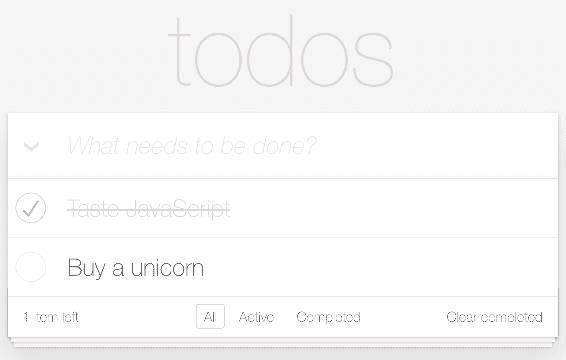
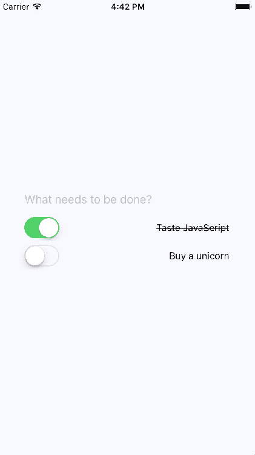
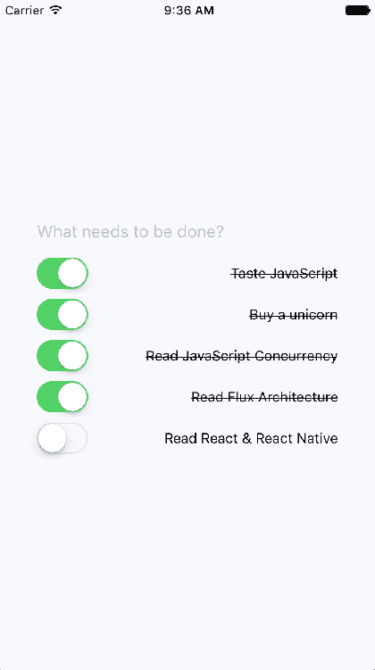

# 第二十六章：构建 Relay React 应用

在上一章中，你对 Relay/GraphQL 有了一个概览，并了解了为什么应该在 React 应用程序中使用这种方法。现在你可以使用 Relay 构建你的 Todo React Native 应用程序。在本章结束时，你应该对 GraphQL 中心架构中的数据传输感到自如。

# TodoMVC 和 Relay

我最初计划扩展我们在本章前面工作过的 Neckbeard News 应用程序。但我决定使用 Relay 的 TodoMVC 示例（[`github.com/taion/relay-todomvc`](https://github.com/taion/relay-todomvc)），这是一个强大而简洁的示例，我很难超越它。

我将带你走过一个示例 React Native 实现的 Todo 应用程序。关键是，它将使用与 Web UI 相同的 GraphQL 后端。我认为这对于想要构建其应用程序的 Web 和原生版本的 React 开发人员来说是一个胜利；他们可以共享相同的模式！

我已经在随本书一起提供的代码中包含了 TodoMVC 应用程序的 Web 版本，但我不会详细介绍它的工作原理。如果你在过去 5 年里从事过 Web 开发，你可能已经接触过一个样本 Todo 应用程序。这是 Web 版本的样子：



即使你以前没有使用过任何 TodoMVC 应用程序，我建议在尝试实现本章剩余部分的原生版本之前，先尝试玩一下这个。

你即将实现的原生版本的目标不是功能平等。事实上，你的目标是实现一个非常简化的 todo 功能子集。目标是向你展示，Relay 在原生平台上的工作方式与在 Web 平台上基本相同，并且 GraphQL 后端可以在 Web 和原生应用程序之间共享。

# GraphQL 模式

模式是 GraphQL 后端服务器和前端 Relay 组件使用的词汇。GraphQL 类型系统使模式能够描述可用的数据，以及在查询请求到来时如何将所有数据组合在一起。这就是整个方法如此可扩展的原因，因为 GraphQL 运行时会找出如何组合数据。你只需要提供告诉 GraphQL 数据在哪里的函数；例如，在数据库中或在某个远程服务端点中。

让我们来看看在 TodoMVC 应用程序的 GraphQL 模式中使用的类型，如下所示：

```jsx
import {
  GraphQLBoolean,
  GraphQLID,
  GraphQLInt,
  GraphQLList,
  GraphQLNonNull,
  GraphQLObjectType,
  GraphQLSchema,
  GraphQLString
} from 'graphql';
import {
  connectionArgs,
  connectionDefinitions,
  connectionFromArray,
  cursorForObjectInConnection,
  fromGlobalId,
  globalIdField,
  mutationWithClientMutationId,
  nodeDefinitions,
  toGlobalId
} from 'graphql-relay';

import {
  Todo,
  User,
  addTodo,
  changeTodoStatus,
  getTodo,
  getTodos,
  getUser,
  getViewer,
  markAllTodos,
  removeCompletedTodos,
  removeTodo,
  renameTodo
} from './database';

const { nodeInterface, nodeField } = nodeDefinitions(
  globalId => {
    const { type, id } = fromGlobalId(globalId);
    if (type === 'Todo') {
      return getTodo(id);
    }
    if (type === 'User') {
      return getUser(id);
    }
    return null;
  },
  obj => {
    if (obj instanceof Todo) {
      return GraphQLTodo;
    }
    if (obj instanceof User) {
      return GraphQLUser;
    }
    return null;
  }
);

const GraphQLTodo = new GraphQLObjectType({
  name: 'Todo',
  fields: {
    id: globalIdField(),
    complete: { type: GraphQLBoolean },
    text: { type: GraphQLString }
  },
  interfaces: [nodeInterface]
});

const {
  connectionType: TodosConnection,
  edgeType: GraphQLTodoEdge
} = connectionDefinitions({ nodeType: GraphQLTodo });

const GraphQLUser = new GraphQLObjectType({
  name: 'User',
  fields: {
    id: globalIdField(),
    todos: {
      type: TodosConnection,
      args: {
        status: {
          type: GraphQLString,
          defaultValue: 'any'
        },
        ...connectionArgs
      },
      resolve: (obj, { status, ...args }) =>
        connectionFromArray(getTodos(status), args)
    },
    numTodos: {
      type: GraphQLInt,
      resolve: () => getTodos().length
    },
    numCompletedTodos: {
      type: GraphQLInt,
      resolve: () => getTodos('completed').length
    }
  },
  interfaces: [nodeInterface]
});

const GraphQLRoot = new GraphQLObjectType({
  name: 'Root',
  fields: {
    viewer: {
      type: GraphQLUser,
      resolve: getViewer
    },
    node: nodeField
  }
});

const GraphQLAddTodoMutation = mutationWithClientMutationId({
  name: 'AddTodo',
  inputFields: {
    text: { type: new GraphQLNonNull(GraphQLString) }
  },
  outputFields: {
    viewer: {
      type: GraphQLUser,
      resolve: getViewer
    },
    todoEdge: {
      type: GraphQLTodoEdge,
      resolve: ({ todoId }) => {
        const todo = getTodo(todoId);
        return {
          cursor: cursorForObjectInConnection(getTodos(), todo),
          node: todo
        };
      }
    }
  },
  mutateAndGetPayload: ({ text }) => {
    const todoId = addTodo(text);
    return { todoId };
  }
});

const GraphQLChangeTodoStatusMutation = mutationWithClientMutationId({
  name: 'ChangeTodoStatus',
  inputFields: {
    id: { type: new GraphQLNonNull(GraphQLID) },
    complete: { type: new GraphQLNonNull(GraphQLBoolean) }
  },
  outputFields: {
    viewer: {
      type: GraphQLUser,
      resolve: getViewer
    },
    todo: {
      type: GraphQLTodo,
      resolve: ({ todoId }) => getTodo(todoId)
    }
  },
  mutateAndGetPayload: ({ id, complete }) => {
    const { id: todoId } = fromGlobalId(id);
    changeTodoStatus(todoId, complete);
    return { todoId };
  }
});

const GraphQLMarkAllTodosMutation = mutationWithClientMutationId({
  name: 'MarkAllTodos',
  inputFields: {
    complete: { type: new GraphQLNonNull(GraphQLBoolean) }
  },
  outputFields: {
    viewer: {
      type: GraphQLUser,
      resolve: getViewer
    },
    changedTodos: {
      type: new GraphQLList(GraphQLTodo),
      resolve: ({ changedTodoIds }) => changedTodoIds.map(getTodo)
    }
  },
  mutateAndGetPayload: ({ complete }) => {
    const changedTodoIds = markAllTodos(complete);
    return { changedTodoIds };
  }
});

const GraphQLRemoveCompletedTodosMutation = mutationWithClientMutationId(
  {
    name: 'RemoveCompletedTodos',
    outputFields: {
      viewer: {
        type: GraphQLUser,
        resolve: getViewer
      },
      deletedIds: {
        type: new GraphQLList(GraphQLString),
        resolve: ({ deletedIds }) => deletedIds
      }
    },
    mutateAndGetPayload: () => {
      const deletedTodoIds = removeCompletedTodos();
      const deletedIds = deletedTodoIds.map(
        toGlobalId.bind(null, 'Todo')
      );
      return { deletedIds };
    }
  }
);

const GraphQLRemoveTodoMutation = mutationWithClientMutationId({
  name: 'RemoveTodo',
  inputFields: {
    id: { type: new GraphQLNonNull(GraphQLID) }
  },
  outputFields: {
    viewer: {
      type: GraphQLUser,
      resolve: getViewer
    },
    deletedId: {
      type: GraphQLID,
      resolve: ({ id }) => id
    }
  },
  mutateAndGetPayload: ({ id }) => {
    const { id: todoId } = fromGlobalId(id);
    removeTodo(todoId);
    return { id };
  }
});

const GraphQLRenameTodoMutation = mutationWithClientMutationId({
  name: 'RenameTodo',
  inputFields: {
    id: { type: new GraphQLNonNull(GraphQLID) },
    text: { type: new GraphQLNonNull(GraphQLString) }
  },
  outputFields: {
    todo: {
      type: GraphQLTodo,
      resolve: ({ todoId }) => getTodo(todoId)
    }
  },
  mutateAndGetPayload: ({ id, text }) => {
    const { id: todoId } = fromGlobalId(id);
    renameTodo(todoId, text);
    return { todoId };
  }
});

const GraphQLMutation = new GraphQLObjectType({
  name: 'Mutation',
  fields: {
    addTodo: GraphQLAddTodoMutation,
    changeTodoStatus: GraphQLChangeTodoStatusMutation,
    markAllTodos: GraphQLMarkAllTodosMutation,
    removeCompletedTodos: GraphQLRemoveCompletedTodosMutation,
    removeTodo: GraphQLRemoveTodoMutation,
    renameTodo: GraphQLRenameTodoMutation
  }
});

export default new GraphQLSchema({
  query: GraphQLRoot,
  mutation: GraphQLMutation
});

```

这里导入了很多东西，所以我将从导入开始。我想包括所有这些导入，因为我认为它们在这次讨论中是相关的。首先，有来自`graphql`库的基本 GraphQL 类型。接下来，您有来自`graphql-relay`库的辅助程序，简化了定义 GraphQL 模式。最后，有来自您自己的`database`模块的导入。这不一定是一个数据库，实际上，在这种情况下，它只是模拟数据。例如，如果您需要与远程 API 端点通信，您可以将`database`替换为`api`，或者我们可以将两者结合起来；就您的 React 组件而言，这都是 GraphQL。

然后，您定义了一些自己的 GraphQL 类型。例如，`GraphQLTodo`类型有两个字段——`text`和`complete`。一个是布尔值，一个是字符串。关于 GraphQL 字段的重要事情是`resolve()`函数。这是告诉 GraphQL 运行时如何在需要时填充这些字段的方法。这两个字段只是返回属性值。

然后，有`GraphQLUser`类型。这个字段代表了用户在 UI 中的整个宇宙，因此得名。例如，`todos`字段是您如何从 Relay 组件查询待办事项的方式。它使用`connectionFromArray()`函数进行解析，这是一种快捷方式，可以省去更冗长的字段定义。然后，有`GraphQLRoot`类型。这有一个单一的`viewer`字段，用作所有查询的根。

现在让我们更仔细地看一下添加待办事项的突变，如下所示。出于篇幅考虑，我不会介绍此应用程序的 Web 版本中使用的每个突变：

```jsx
const GraphQLAddTodoMutation = mutationWithClientMutationId({
  name: 'AddTodo',
  inputFields: {
    text: { type: new GraphQLNonNull(GraphQLString) }
  },
  outputFields: {
    viewer: {
      type: GraphQLUser,
      resolve: getViewer
    },
    todoEdge: {
      type: GraphQLTodoEdge,
      resolve: ({ todoId }) => {
        const todo = getTodo(todoId);
        return {
          cursor: cursorForObjectInConnection(getTodos(), todo),
          node: todo
        };
      }
    }
  },
  mutateAndGetPayload: ({ text }) => {
    const todoId = addTodo(text);
    return { todoId };
  }
}); 
```

所有的突变都有一个`mutateAndGetPayload()`方法，这是突变实际上调用某个外部服务来改变数据的方法。返回的有效负载可以是已更改的实体，但也可以包括作为副作用而更改的数据。这就是`outputFields`发挥作用的地方。这是传递给 Relay 在浏览器中的信息，以便它有足够的信息来根据突变的副作用正确更新组件。别担心，您很快就会从 Relay 的角度看到这是什么样子。

您在这里创建的突变类型用于保存所有应用程序突变。最后，这是整个模式如何组合并从模块中导出的方式：

```jsx
export default new GraphQLSchema({
  query: GraphQLRoot,
  mutation: GraphQLMutation
}); 
```

现在不要担心将此模式馈送到 GraphQL 服务器中。

# 引导 Relay

此时，您的 GraphQL 后端已经启动运行。现在，您可以专注于前端的 React 组件。特别是，您将在 React Native 环境中查看 Relay，这实际上只有一些细微的差异。例如，在 Web 应用程序中，通常是`react-router`引导 Relay。在 React Native 中，情况有些不同。让我们看看作为本机应用程序入口点的`App.js`文件：

```jsx
import React from 'react';
import { View, Text } from 'react-native';
import { Network } from 'relay-local-schema';
import { Environment, RecordSource, Store } from 'relay-runtime';
import { QueryRenderer, graphql } from 'react-relay';

import schema from './data/schema';
import styles from './styles';
import TodoInput from './TodoInput';
import TodoList from './TodoList';

if (typeof Buffer === 'undefined')
  global.Buffer = require('buffer').Buffer;

const environment = new Environment({
  network: Network.create({ schema }),
  store: new Store(new RecordSource())
});

export default () => (
  <QueryRenderer
    environment={environment}
    query={graphql`
      query App_Query($status: String!) {
        viewer {
          ...TodoList_viewer
        }
      }
    `}
    variables={{ status: 'any' }}
    render={({ error, props }) => {
      if (error) {
        return <Text>Error!</Text>;
      }
      if (!props) {
        return <Text>Loading...</Text>;
      }
      return (
        <View style={styles.container}>
          <TodoInput environment={environment} {...props} />
          <TodoList {...props} />
        </View>
      );
    }}
  />
); 
```

让我们从这里开始分解发生的事情，从环境常量开始：

```jsx
const environment = new Environment({
  network: Network.create({ schema }),
  store: new Store(new RecordSource())
});
```

这是您与 GraphQL 后端通信的方式，通过配置网络。在这个例子中，您从`relay-local-schema`中导入`Network`，这意味着没有进行网络请求。这对于刚开始使用特别方便，尤其是构建 React Native 应用程序。

接下来是`QueryRenderer`组件。这个 Relay 组件用于渲染依赖于 GraphQL 查询的其他组件。它期望一个查询属性：

```jsx
query={graphql`
  query App_Query($status: String!) {
    viewer {
      ...TodoList_viewer
    }
  }
`}
```

请注意，查询是由它们所在的模块前缀的。在这种情况下，是`App`。这个查询使用了另一个模块`TodoList`中的 GraphQL 片段，并命名为`TodoList_viewer`。您可以向查询传递变量：

```jsx
variables={{ status: 'any' }}
```

然后，`render`属性是一个在 GraphQL 数据准备就绪时渲染组件的函数：

```jsx
render={({ error, props }) => {
  if (error) {
    return <Text>Error!</Text>;
  }
  if (!props) {
    return <Text>Loading...</Text>;
  }
  return (
    <View style={styles.container}>
      <TodoInput environment={environment} {...props} />
      <TodoList {...props} />
    </View>
  );
}}
```

如果出现问题，错误将包含有关错误的信息。如果没有错误和没有属性，那么可以安全地假定 GraphQL 数据仍在加载中。

# 添加待办事项

在`TodoInput`组件中，有一个文本输入框，允许用户输入新的待办事项。当他们输入完待办事项后，Relay 将需要向后端 GraphQL 服务器发送一个 mutation。以下是组件代码的样子：

```jsx
import React, { Component } from 'react';
import { TextInput } from 'react-native';

import styles from './styles';
import AddTodoMutation from './mutations/AddTodoMutation';

export default class App extends Component {
  onSubmitEditing = ({ nativeEvent: { text } }) => {
    const { environment, viewer } = this.props;
    AddTodoMutation.commit(environment, viewer, text);
  };

  render() {
    return (
      <TextInput
        style={styles.textInput}
        placeholder="What needs to be done?"
        onSubmitEditing={this.onSubmitEditing}
      />
    );
  }
} 
```

它看起来并不比您典型的 React Native 组件有多大的不同。突出的部分是 mutation——`AddTodoMutation`。这是告诉 GraphQL 后端您想要创建一个新的`todo`节点的方式。

让我们看看目前为止应用程序的样子：



用于添加新待办事项的文本框就在待办事项列表的上方。现在，让我们看看`TodoList`组件，它负责渲染待办事项列表。

# 渲染待办事项

`TodoList`组件的工作是渲染待办事项列表项。当`AddTodoMutation`发生时，`TodoList`组件需要能够渲染这个新项目。Relay 负责更新内部数据存储，其中包含我们所有的 GraphQL 数据。再次查看项目列表，添加了几个更多的待办事项：



这是`TodoList`组件本身：

```jsx
import React, { Component } from 'react';
import PropTypes from 'prop-types';
import { View } from 'react-native';
import { createFragmentContainer, graphql } from 'react-relay';

import Todo from './Todo';

class TodoList extends Component {
  static propTypes = {
    viewer: PropTypes.object.isRequired,
    relay: PropTypes.object.isRequired
  };

  static contextTypes = {
    relay: PropTypes.shape({
      variables: PropTypes.shape({
        status: PropTypes.string.isRequired
      }).isRequired
    }).isRequired
  };

  render() {
    const { viewer } = this.props;
    return (
      <View>
        {viewer.todos.edges.map(edge => (
          <Todo key={edge.node.id} viewer={viewer} todo={edge.node} />
        ))}
      </View>
    );
  }
}

export default createFragmentContainer(
  TodoList,
  graphql`
    fragment TodoList_viewer on User {
      todos(status: $status, first: 2147483647)
        @connection(key: "TodoList_todos") {
        edges {
          node {
            id
            complete
            ...Todo_todo
          }
        }
      }
      id
      numTodos
      numCompletedTodos
      ...Todo_viewer
    }
  `
); 
```

获取所需数据的相关 GraphQL 作为第二个参数传递给`createFragmentContainer()`。这是组件的声明性数据依赖关系。当您渲染`<Todo>`组件时，您会将`edge.todo`数据传递给它。现在，让我们看看`Todo`组件本身是什么样子。

# 完成待办事项

这个应用程序的最后一部分是渲染每个待办事项并提供更改待办事项状态的能力。让我们看看这段代码：

```jsx
import React, { Component } from 'react';
import classNames from 'classnames';
import PropTypes from 'prop-types';
import { createFragmentContainer, graphql } from 'react-relay';
import { Text, View, Switch } from 'react-native';

import ChangeTodoStatusMutation from './mutations/ChangeTodoStatusMutation';
import styles from './styles';

const completeStyleMap = new Map([
  [true, { textDecorationLine: 'line-through' }],
  [false, {}]
]);

class Todo extends Component {
  static propTypes = {
    viewer: PropTypes.object.isRequired,
    todo: PropTypes.object.isRequired,
    relay: PropTypes.object.isRequired
  };

  onValueChange = value => {
    const { relay, viewer, todo } = this.props;

    ChangeTodoStatusMutation.commit(
      relay.environment,
      viewer,
      todo,
      value
    );
  };

  render() {
    const {
      todo: { text, complete }
    } = this.props;

    return (
      <View style={styles.todoItem}>
        <Switch value={complete} onValueChange={this.onValueChange} />
        <Text style={completeStyleMap.get(complete)}>{text}</Text>
      </View>
    );
  }
}

export default createFragmentContainer(Todo, {
  viewer: graphql`
    fragment Todo_viewer on User {
      id
    }
  `,
  todo: graphql`
    fragment Todo_todo on Todo {
      id
      complete
      text
    }
  `
}); 
```

实际渲染的组件是一个开关控件和项目文本。当用户标记待办事项为完成时，项目文本会被划掉。用户也可以取消选中项目。`ChangeTodoStatusMutation`变异发送请求到 GraphQL 后端以更改`todo`状态。GraphQL 后端然后与任何需要使此操作发生的微服务进行通信。然后，它会响应此组件所依赖的字段。

我想指出的这段代码的重要部分是 Relay 容器中使用的片段。这个容器实际上并不直接使用它们。相反，它们被`TodoList`组件中的`todos`查询使用（`Todo.getFrament()`）。这很有用，因为这意味着您可以在另一个上下文中使用`Todo`组件，使用另一个查询，并且它的数据依赖关系总是会被满足。

# 摘要

在本章中，您实现了一些特定的 Relay 和 GraphQL 想法。从 GraphQL 模式开始，您学习了如何声明应用程序使用的数据以及这些数据类型如何解析为特定的数据源，例如微服务端点。然后，您学习了如何在 React Native 应用程序中从 Relay 引导 GraphQL 查询。接下来，您将详细了解如何添加、更改和列出待办事项。应用程序本身使用与 Todo 应用程序的 Web 版本相同的模式，这在开发 Web 和原生 React 应用程序时会更加容易。

好了，这本书就到这里了。我们一起学习了很多材料，我希望你从阅读中学到的东西和我从写作中学到的一样多。如果有一个主题是你应该记住的，那就是 React 只是一个渲染抽象。随着新的渲染目标出现，新的 React 库也会出现。随着开发人员想出处理大规模状态的新方法，你会看到新的技术和库发布。我希望你现在已经准备好在这个快速发展的 React 生态系统中工作了。
