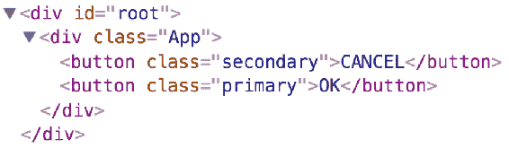
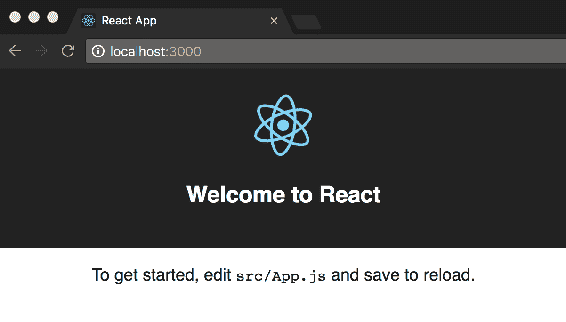

# 第一章：React Router 4 简介和创建您的第一个路由

单页应用程序（SPA）已成为开发 Web 应用程序的事实标准。许多 JavaScript 库和框架已经出现，帮助前端工程师开发 SPA。其中包括 React、Angular、Ember 和 Backbone 等。这些库或框架抽象了原生 API，并提供了可以用于更快地构建应用程序的服务和组件。SPA 是提供流畅用户体验的绝佳选择；当用户在网站中浏览时，会触发 HTTP 请求，只会更新页面的某些部分，而不是请求整个页面的服务器。

React 是一个开源的 JavaScript 库，帮助您构建 Web 和移动应用程序中的用户界面和视图层。它鼓励开发人员将视图层视为可以在整个应用程序中重用的组件集合。大多数前端框架都包含一个路由包，它使您能够在用户点击网站上提供的各种链接时更新页面的各个部分。前端框架中的路由器会监听 URL 的变化，并通过渲染相应的视图组件来保持应用程序同步。例如，当用户访问`'/dashboard'`时，页面将呈现各种仪表板组件，如图表和表格；当用户访问`'/user'`时，页面将列出各种用户属性。在基于 React 的应用程序中，需要一个路由器库，因为 React 本身不带有路由器。React-Router 是一个完全基于 React 构建的流行路由库。该库包括各种组件，可用于在用户浏览应用程序时呈现视图。除了匹配 URL 和呈现视图组件外，React-Router 还具有一些功能，可帮助您轻松配置路由。

本章讨论以下主题：

+   React 简介：本节介绍了 React 中的一些核心概念，如基于组件的架构、在 React 中创建组件以及如何向应用程序树中的子组件提供数据

+   React-Router 简介：在这里，我们首先使用`create-react-app` CLI 创建一个 React 应用程序，然后将 React-Router 库（`'react-router-dom'`包）添加为依赖项

+   创建您的第一个路由：在添加 React-Router 作为依赖项后，使用 `<BrowserRouter>` 和 `<Route>` 组件创建应用程序的第一个路由。

# 简要了解 React

React 是一个提供一组组件和服务的 JavaScript 库，使您能够构建用户界面。

以下是来自 `reactjs.org` 的引用：

"React 是一个声明式、高效、灵活的 JavaScript 库，用于构建用户界面。"

该库由 Facebook 开发和维护，根据 MIT 许可。它被广泛用于构建 Facebook 的各种应用程序，包括 Facebook 网站和 Instagram 网站。

React 使您能够构建视图组件，在应用程序状态更改时进行更新。这里的状态可能指的是底层领域数据，也可能反映用户在应用程序旅程中的位置。React 确保视图组件反映应用程序状态。

React 的一些重要特性：

+   JSX：React 应用程序中的组件使用类似 XML/HTML 的语法，称为 JSX，来渲染视图元素。JSX 允许您在 JavaScript/React 代码中包含 HTML；在 React 组件的渲染函数中使用熟悉的带有属性的 HTML 语法，无需学习新的模板语言。预处理器（如 Babel）将使用 JSX 将 HTML 文本转译为 JavaScript 对象，以便 JavaScript 引擎能够理解。

+   单向数据绑定：React 应用程序组织为一系列嵌套组件；一组不可变值作为属性传递给组件的渲染器，以 HTML 标签的形式。组件不会修改其从父组件接收的属性（或 props）；相反，子组件将用户操作传达给其父组件，父组件通过更新组件的状态来修改这些属性。

+   虚拟 DOM：在 React 中，为每个 DOM 对象创建一个相应的虚拟 DOM 对象，其具有与真实 DOM 对象相同的一组属性。但是，虚拟 DOM 对象缺乏在用户与页面交互时更新视图的能力。React 中的组件在检测到状态变化时重新渲染视图元素，这种重新渲染会更新虚拟 DOM 树。然后，React 将此虚拟 DOM 树与更新前创建的快照进行比较，以确定更改的 DOM 对象。最后，React 通过仅更新更改的 DOM 对象来修改真实 DOM。

# React 中的基于组件的架构

自 2013 年发布以来，React 已经重新定义了前端应用程序的构建方式。它引入了基于组件的架构的概念，本质上允许您将应用程序视为由小型、自包含的视图组件组成。这些视图组件是可重用的；也就是说，诸如`CommentBox`或`Footer`之类的组件封装了必要的功能，并可以在站点的各个页面中使用。

在这种情况下，页面本身是一个视图组件，由其他小的视图组件组成，如下所示：

```jsx
<Dashboard>
    <Header>
        <Brand />
    </Header>
    <SideNav>
        <NavLink key=”1”>
        <NavLink key=”2”>
    </SideNav>
    <ContentArea>
        <Chart>
        <Grid data="stockPriceList">
    </ContentArea>
    <Footer />
</Dashboard>
```

在这里，`<Dashboard>`是一个视图组件，包含了几个其他视图组件（`Header`、`SideNav`、`ContentArea`和`Footer`），这些又由小组件（`Brand`、`NavLink`、`Chart`和`Grid`）组成。基于组件的架构鼓励您构建提供特定功能并且不与任何父级或同级组件紧密耦合的组件。这些组件实现了某些功能，并提供了一个接口，通过这个接口它们可以被包含在页面中。

在前面的例子中，`<Grid>`组件将包括渲染数据的行和列、提供搜索功能，以及按升序或降序对列进行排序的功能。`<Grid>`组件将实现所有上述功能，并提供一个接口，通过这个接口它可以被包含在页面中。这里的接口将包括标签名（`Grid`）和一组属性（`props`），接受来自其父组件的值。在这里，`<Grid>`组件可以与后端系统进行接口，并检索数据；然而，这将使组件与给定的后端接口紧密耦合，因此无法重用。理想情况下，视图组件将从其父组件接收数据并相应地进行操作。

```jsx
<Grid data="stockPriceList" />
```

在这里，`<Grid>`组件通过其`data`属性接收包含股票价格信息的列表，并以表格格式呈现这些信息。包含这个`<Grid>`组件的组件可以被称为`Container`组件，`Grid`作为子组件。

`Container`组件也是`View`组件；然而，它的责任包括为其子组件提供必要的数据来渲染。`Container`组件可以发起 HTTP 调用到后端服务并接收渲染其子组件所需的数据。此外，`Container`组件还负责将单个视图组件定位在其视图区域内。

# 创建一个 React 组件

通过扩展 React 提供的`Component`类来创建 React 组件如下：

```jsx
import React, { Component } from 'react';
import './button.css';

export class Button extends Component {
    render() {
        return (
            <button className={this.props.type}>
                {this.props.children}
            </button>
        );
    }
}
```

在这里，`Button`类扩展了 React 的`Component`类并重写了`render`方法。`render`方法返回将在页面加载时呈现在 DOM 上的 JSX。`type`和`children`属性在`this.props`中可用。React 允许您通过 props 将数据传递给其组件，并通过以下语法来实现：

```jsx
import React, { Component } from 'react';
import { Button } from './components/Button/button';
import './App.css';

export default class App extends Component {
    render() {
        return (
            <div className="App">
                <Button type="secondary">CANCEL</Button>
                <Button type="primary">OK</Button>
            </div>
        );
    }
}
```

在这里，我们将`Button`组件包裹在父组件`App`中，以渲染两个按钮元素。`type`属性被`Button`组件使用来设置`CANCEL`和`OK`按钮的类名(`className`)和`Button`标签内提到的文本。这可以通过`children`属性来引用。`children`属性可以是纯文本或其他视图组件。子组件使用`this.props`来引用其父组件提供的数据。`'this.props'`中的`children`属性提供了父组件在标签之间包含的所有子元素的引用。如果您以前使用过 Angular，请将前面的片段视为类似于在 AngularJS 中使用`ng-transclude`或在 Angular 中使用`ng-content`来包含元素。

在这里，`<App>`组件包含`<Button>`组件，可以被称为容器组件，负责在页面上渲染按钮。

下一步是在 DOM 上呈现`<App>`组件。`<App>`组件充当根组件，即树中的根节点。应用程序中的每个组件都将`<App>`组件作为其最顶层的父组件：

```jsx
import React from 'react';
import ReactDOM from 'react-dom';
import App from './App'; 
import './index.css'; 

ReactDOM.render(<App />, document.getElementById('root'));
```

这段代码包含在`index.js`中，它导入了`React`和`ReactDOM`库。`ReactDOM`库有一个`render`方法，它接受要渲染的组件作为其第一个参数，并且根组件要渲染到的 DOM 节点的引用作为第二个参数。

运行应用程序时，将呈现在`<App>`组件内的内容：



# React-Router 简介

React-Router 是用 React 构建的 SPA 的路由库。React-Router 版本 4 是一个完全的重写，并采用了基于组件的架构的 React 哲学。

这是来自 React-Router 文档（[`reacttraining.com/react-router/`](https://reacttraining.com/react-router/)）

“React Router 是一组与您的应用程序声明性地组合的**导航组件**。无论您是想为您的 Web 应用程序拥有**可书签的 URL**还是想以**React Native**中的可组合方式导航，*React Router*都可以在 React 渲染的任何地方使用--所以*随你*选择！”

React-Router 可以在 React 可以应用的任何地方使用；也就是说，React-Router 在浏览器和使用 React Native 的本地环境中都可以工作。

该库分为三个包：

+   `react-router`：DOM 和本地版本的常见核心组件

+   `react-router-dom`：用于浏览器和 Web 应用程序的组件

+   `react-router-native`：用于使用 React Native 构建的本地应用程序的组件

该库提供了各种组件，可用于动态添加路由到您的应用程序。React-Router v4 中的动态路由允许您在用户通过应用程序旅程时指定应用程序路由。诸如 AngularJS 和 Express 之类的框架要求您预先指定路由，并且在应用程序引导时需要此路由信息。实际上，React-Router 的早期版本遵循了相同的范例，并且需要提前提供路由配置。

除了在 React 应用程序中进行动态路由和提供流畅导航之外，该库还包括传统网站中可用的各种功能。这些包括以下内容：

+   通过应用程序向后和向前导航，维护历史记录，并恢复应用程序的状态

+   在提供 URL（深度链接）时呈现适当的页面组件

+   将用户从一个路由重定向到另一个路由

+   在没有任何路由匹配 URL 时支持呈现 404 页面

+   支持基于哈希的路由和使用 HTML5 模式的漂亮 URLs

React-Router 是 Facebook 提供的官方路由解决方案是一个常见的误解。实际上，它是一个第三方库，根据 MIT 许可证授权。

# 使用 React-Router 入门

让我们创建一个 React 应用程序，然后将 React-Router 作为依赖项添加进去。

为了创建一个 React 应用程序，我们将使用`create-react-app`CLI。`create-react-app`CLI 使创建一个已经工作的应用程序变得更容易。CLI 创建了一个项目脚手架，以便您可以开始使用最新的 JavaScript 功能，并提供了用于为生产环境构建应用程序的脚本。有各种 React 和 React-Router 入门套件可用；然而，使用`create-react-app`有助于演示如何将 React-Router 添加到现有的基本 React 应用程序中。

第一步是使用 NPM 全局安装`create-react-app`，如下所示：

```jsx
npm install -g create-react-app
```

CLI 要求`node`版本大于或等于 6，并且`npm`版本大于 5.2.0。

安装完 CLI 后，我们将使用`create-react-app`命令创建一个新的应用程序，如下所示：

```jsx
create-react-app react-router-demo-app
```

当`create-react-app`完成安装包时，将显示以下输出：

```jsx
Inside that directory, you can run several commands:
 npm start
 Starts the development server.

 npm run build
 Bundles the app into static files for production.

 npm test
 Starts the test runner.

 npm run eject
 Removes this tool and copies build dependencies, configuration 
 files
 and scripts into the app directory. If you do this, you can't 
 go back!
 We suggest that you begin by typing:
 cd react-router-demo-app
 npm start
```

如果您使用`yarn`包管理器（[`yarnpkg.com/en/`](https://yarnpkg.com/en/)），则前面片段中的`npm`命令将被替换为`yarn`。

在安装过程中创建了`react-router-demo-app`目录（如果尚不存在）。在该目录内，创建了以下项目结构：

```jsx
/react-router-demo-app
    |--node_modules
    |--public
    |   |--favicon.ico 
    |   |--index.html
    |   |--manifest.json
    |--src
    |   |--App.css
    |    |--App.js
    |    |--App.test.js
    |    |--index.css
    |    |--index.js
    |    |--logo.svg
    |    |--registerServiceWorker.js
    |--package-lock.json
    |--package.json
    |--README.md
```

CLI 安装了所有必要的依赖项，如 Babel，用于将 ES6 代码转译为 ES5，从而使您能够利用最新的 JavaScript 功能。它还使用 webpack 创建了一个构建管道配置。安装后，无需额外配置即可启动或构建应用程序。如前面的输出所示，您可以使用`npm start`命令启动应用程序，并使用`npm build`构建一个生产就绪的应用程序。

运行`npm start`后，应用程序将被编译，并将打开一个浏览器窗口，显示“欢迎来到 React”的消息，如下所示：



在`index.js`文件中，使用`ReactDOM`引用来呈现应用程序的根组件，如下所示：

```jsx
ReactDOM.render(<App />, document.getElementById('root'));
```

`<App>`组件标记了应用程序启动时将呈现的树的开始。

# 添加 React-Router 库

现在我们的示例应用程序已经运行起来了，让我们使用`npm`添加 React-Router 库作为一个依赖项：

```jsx
npm install --save react-router-dom
```

此命令将下载并将`react-router-dom`添加到`/node_modules`目录中。`package.json`文件现在将其包含为一个依赖项：

```jsx
"dependencies": {
 "react": "¹⁶.4.0",
 "react-dom": "¹⁶.4.0",
 "react-router-dom": "⁴.3.0",
 "react-scripts": "1.1.4"
}
```

在撰写本书时，`react-router-dom`的版本为 4.3.0。您可以通过在使用`npm`包含库时提到`react-router-dom@next`来尝试 alpha 和 beta 版本。 

# 定义应用程序路由

`react-router-dom`包括一个`<BrowserRouter>`组件，它用作在应用程序中添加路由之前的包装器。要在 React Native 应用程序中使用 React-Router，需要使用`react-router-native`包。这将在后面的章节中详细讨论。`<BrowserRouter>`组件是路由器接口的一种实现，它利用 HTML5 的历史 API 来使 UI 与 URL 路径保持同步。

第一步是使用`<BrowserRouter>`将应用程序的根组件包装起来，如下所示：

```jsx
import { BrowserRouter } from 'react-router-dom';

ReactDOM.render(
    <BrowserRouter>
        <App />
    </BrowserRouter>,
    document.getElementById('root')
);
```

将您的应用程序包装在`<BrowserRouter>`中将为我们的`<App>`组件创建一个 history 实例，使其所有子组件都可以访问来自原生浏览器历史 API 的 props。这允许组件匹配 URL 路径并呈现适当的页面组件。

History 是一个 JavaScript 库，它允许您管理历史堆栈导航，并有助于在会话之间保持状态。

在 React-Router 中的路由实际上并不是路由-它是基于与当前 URL 路径匹配的模式的组件的条件渲染。要定义路由，我们需要两个信息：要匹配的 URL 路径和要呈现的组件。让我们创建两个组件，`HomeComponent`和`DashboardComponent`，分别在`/home`和`/dashboard`上呈现。

在`src/components/home/home.component.js`中：

```jsx
import  React  from  'react'; export  const  HomeComponent  = () => ( <div> Inside Home route </div> );
```

在`src/components/dashboard/dashboard.component.js`中：

```jsx
import  React  from  'react'; export  const  DashboardComponent  = () => ( <div  className="dashboard"> Inside Dashboard route </div> );
```

由于我们从前面的组件返回 JSX，所以需要`import`语句。

下一步是使用`Route`组件（来自`'react-router-dom'`）定义路由。`Route`组件接受几个 props，但在本例中，我们将使用`path`和`component`。

在`App.js`中：

```jsx
class  App  extends  Component { render() { return ( <div  className="container"> <Route path="/home" component={HomeComponent} /> <Route path="/dashboard" component={DashboardComponent} /> </div> ); } } export  default  App;
```

在这里，我们在`<App>`组件的`'render'`方法中定义路由。每个`<Route>`组件都有一个`path`属性，它提到要匹配的 URL 路径，以及一个`component`属性，提到一旦路径匹配 URL 就要呈现的组件。

在前面的示例中，该组件是在不扩展 React 组件类的情况下创建的。如果通过将扩展 React 组件类创建的组件作为`component`属性的值提供，则每次`<Route>`呈现组件时都会调用组件的生命周期方法`componentWillMount`和`componentWillUnmount`。

当您运行应用程序（`npm start`）并访问`localhost:3000/home`时，将呈现`HomeComponent`并显示消息“Inside Home Component”。类似地，当您访问`localhost:3000/dashboard`时，将呈现`DashboardComponent`。

`<BrowserRouter>`创建一个`History`对象，它用于跟踪当前位置并在位置更改时重新渲染站点。`<BrowserRouter>`通过 React 的上下文将`History`对象提供给其后代子组件。如果一个`Route`组件没有`<BrowserRouter>`作为其父级，它将无法工作。

另外，`<BrowserRouter>`必须只有一个子元素的要求。在下面的片段中，`<BrowserRouter>`给出了两个子元素：

```jsx
<BrowserRouter>
    <Route
        path="/home"
        component={HomeComponent} />
    <Route
        path="/dashboard"
        component={DashboardComponent} />
</BrowserRouter>
```

上述代码将导致错误，例如“<Router>只能有一个子元素”。要解决此问题，您可以将这些路由移入一个组件并提供组件引用，或者将前面片段中的`<Route>`组件包装在另一个元素中，例如`div`或`React Fragment`。

`React fragment`用于将一组子元素分组，而不向 DOM 添加额外的节点。当组件返回多个元素时，使用片段。

除了`BrowserRouter`之外，React-Router 库中还有其他类型的路由器：`HashRouter`，`MemoryRouter`和`StaticRouter`。这些将在后面的章节中讨论。

# 总结

React 是一个用于构建用户界面的 JavaScript 库。与 Angular 和 Ember 等库不同，它们包括路由包，React 库不包括任何帮助进行路由的组件或服务。React-Router 是一个路由库，可以在任何 React 应用程序中使用，包括 Web 或原生应用。React-Router 版本 4 是对早期版本的完全重写，所有组件都是用 React 编写的。该库包括用于 Web 应用程序的`react-router-dom`包；用于使用 React-Native 构建的原生应用程序的`react-router-native`；以及`react-router`，这是`react-router-dom`和`react-router-native`都依赖的核心包。

`create-react-app` CLI 用于快速搭建 React 应用程序。它包括可以用于生成开发和生产环境构建的构建配置脚本。然后将`react-router-dom`包添加为应用程序的依赖项。该包包括`<BrowserRouter>`组件，它实现了`History`接口。应用程序的根组件`<App />`被包裹在 React-Router 的`<BrowserRouter>`组件中，以使`History`对象对应用程序树中的所有组件都可用。

创建我们的第一个路由，包括`<Route>`组件。它接受`path`和`component`作为 props，并在浏览器的 URL 匹配`<Route>`路径时渲染组件。

在第二章中，*配置路由-在 Route 组件中使用各种选项*，详细讨论了`<Route>`组件的 props。此外，我们将看看渲染组件接收的各种 props，并考虑如何使用这些 props 来创建嵌套路由。
