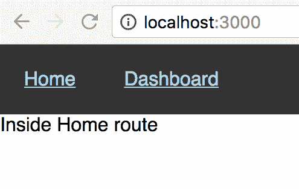
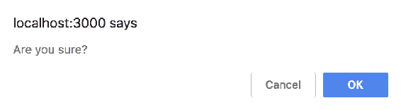

# 第三章：使用 Link 和 NavLink 组件导航到路由

React-Router 提供了 `<Link>` 和 `<NavLink>` 组件，允许您导航到应用程序中定义的不同路由。这些导航组件可以被视为页面上的锚链接，允许您导航到站点中的其他页面。在传统网站中，使用锚链接导航应用程序会导致页面刷新，并且页面中的所有组件都会重新渲染。使用 `<Link>` 和 `<NavLink>` 创建的导航链接不会导致页面刷新，只有使用 `<Route>` 定义的页面特定部分并匹配 URL 路径的部分会更新。

与 `<Route>` 组件类似，导航组件 `<Link>` 和 `<NavLink>` 是 React 组件，允许您声明性地定义导航链接。

在本章中，我们将看看导航到应用程序中定义的路由的各种选项。这包括以下内容：

+   `<Link>` 组件及其属性

+   `<NavLink>` 组件及其属性

+   使用 `match` 属性导航到嵌套路由

+   使用 `history` 程序化地导航到路由

+   使用高阶组件 `withRouter`

+   使用 `<Prompt>` 组件阻止路由转换

# <Link> 组件

使用 `<Link>` 组件导航到使用 `<Route>` 组件定义的现有路由。要导航到一个路由，将路由中使用的路径名指定为 `to` 属性的值：

```jsx
import { Link } from 'react-router-dom';

class  App  extends  Component {
    render() {
        return (
            <div class="container">
                <nav>
                    **<Link to="/">Home</Link>**
                    **<Link to="/dashboard">Dashboard</Link>**
                </nav>
                <Route
                    path="/"
                    component={HomeComponent}
                    exact 
                />
                <Route
                    path="/dashboard"
                    component={DashboardComponent} 
                />
            </div>
        );
    }
} 
```

注意 `to` 属性的值与 `<Route>` 中分配给 `path` 属性的值相同。页面现在呈现两个链接：



当您点击主页时，您将看到显示的文本“Inside Home route”，当您点击仪表板时，您将被导航到其 `path` 属性设置为 `/dashboard` 的路由。

当您使用 `<Link>` 导航到一个路由时，会调用 `history.push()`，这会向历史堆栈添加一个条目。因此，当您点击浏览器的返回按钮时，您将被导航到之前访问的上一个路由（主页路由）。如前一章所述，React-Router 使用 `history` 库来在用户在应用程序旅程中穿越各种路由时维护应用程序的状态。

`<Link>` 组件还有两个其他属性——`replace` 和 `innerRef`。

# replace 属性

`replace`属性在`<Link>`中调用`history.replace()`，用`to`属性中提到的新路径名替换历史堆栈中的当前条目：

```jsx
<Link  to="/dashboard" replace>Dashboard</Link>
```

例如，如果您访问路径为`/home`的页面，则访问上述链接将用`/dashboard`替换历史堆栈中的当前条目，这基本上将条目`/home`替换为`/dashboard`。

# innerRef 属性

React 提供`ref`来获取对渲染的 DOM 元素的引用。然后可以使用此引用（`ref`）来执行常规流程之外的某些操作，例如聚焦输入元素，媒体播放等。`<Link>`是一个复合组件，在 DOM 上呈现一个锚元素。

在前面的代码片段中提到的`<Link>`组件翻译为以下锚元素：

```jsx
..
<nav>
    <a href="/">Home</a>
    <a href="/dashboard">Dashboard</a>
</nav>
..
```

要获取对此渲染的锚元素的引用，需要将`innerRef`属性添加到`<Link>`中：

```jsx
<nav> <Link to="/" innerRef={this.refCallback}> Home </Link> <Link to="/dashboard" innerRef={this.refCallback}> Dashboard </Link> </nav>
```

`innerRef`属性接受回调函数作为其值；在这里，函数`refCallback`被指定为`innerRef`属性的值。`refCallback`获取对`<Link>`组件的内部元素的引用：

```jsx
refCallback(node) { node.onmouseover  = () => { node.focus(); } } 
```

回调函数`refCallback`在`<Link>`组件挂载时被调用。从上述代码片段中，我们可以看到为两个`<Link>`组件渲染的锚元素都添加了`mouseover`处理程序。当用户悬停在链接上时，相应的锚点获得焦点。

# 带有对象的 to 属性

`to`属性可以是字符串，也可以是对象。该对象可以包含以下属性：

+   `pathname`：要导航到的路径

+   `search`：路径的查询参数，表示为字符串值

+   `hash`：要添加到 URL 的哈希字符串

+   `state`：包含渲染组件可以使用的状态信息的对象

使用这些参数，让我们添加一个`<Link>`组件：

```jsx
<Link to={{ pathname:  '/user', search:  '?id=1', hash:  '#hash',
```

```jsx
 state: { isAdmin:  true } }}>
 User </Link>
```

前面的代码翻译为以下内容：

```jsx
<a href="/user?id=1#hash">User</a>
```

`state`信息不包含在 URL 路径中；但是，它可用于作为`<Route>`匹配的结果呈现的组件：

```jsx
<Route path="/user" render={({ location }) => { const { pathname, search, hash, state } = location; return ( <div> Inside User route <h5>Pathname: {pathname}</h5> <h5>Search: {search}</h5> <h5>Hash: {hash}</h5> <h5>State: {'{'}  {Object.keys(state).map((element, index) => { return ( <span  key={index}> {element}: {state[element].toString()} </span> ) })}  {'}'} </h5> </div> ); }} />
```

`location`对象包含所有先前定义的参数，包括`state`对象。

`state`对象可用于在用户浏览应用程序时存储数据，并将此数据提供给由于`<Route>`匹配而呈现的下一个组件。

# <NavLink>组件

`<NavLink>`组件类似于`<Link>`组件，不同之处在于可以指定多个属性，这些属性可以帮助您有条件地向呈现的元素添加样式属性。它接受与`<Link>`组件相同的一组属性（`to`，`replace`和`innerRef`）用于导航到一个路由，并包括用于样式化选定路由的属性。

让我们来看看这些属性，它们可以帮助您为`<NavLink>`组件设置样式。

# activeClassName 属性

默认情况下，类名`active`将应用于活动的`<NavLink>`组件。例如，当点击`<NavLink>`并呈现相应的路由时，所选的`<NavLink>`的类名将设置为`active`。要更改此类名，请在`<NavLink>`组件上指定`activeClassName`属性，并将其值设置为要应用的 CSS 类名：

```jsx
<nav>
    <NavLink to="/">Home</NavLink> <NavLink to="/dashboard" activeClassName="selectedLink"> Dashboard
    </NavLink> </nav>
```

下一步是在应用程序的 CSS 文件中指定 CSS 类`selectedLink`的样式。请注意，第一个`<NavLink>`没有指定`activeClassName`属性。在这种情况下，当点击`<NavLink>`时，将添加`active`类：

```jsx
<nav>
    <a class="active" aria-current="page" href="/">Home</a>
    <a aria-current="page" href="/dashboard">Dashboard</a>
</nav>
```

然而，当点击第二个`<NavLink>`时，将应用`selectedLink`类：

```jsx
<nav>
    <a aria-current="page" href="/">Home</a>
    <a class="selectedLink" aria-current="page" href="/dashboard">Dashboard</a>
</nav>
```

# activeStyle 属性

`activeStyle`属性也用于为选定的`<NavLink>`设置样式。但是，与其在`<NavLink>`被选中时提供一个类不同，可以在内联中提供 CSS 样式属性：

```jsx
<NavLink
 to="/user" activeStyle={{ background:  'red', color:  'white' }}> User </NavLink>
```

# exact 属性

当您点击具有`to`属性`/dashboard`的`<NavLink>`时，`active`类（或在`activeStyle`属性中指定的内联样式）将应用于页面中的两个`<NavLink>`组件。与`<Route>`组件类似，`/dashboard`中的`/`与`to`属性中指定的路径匹配，因此将`active`类应用于两个`<NavLink>`组件。

在这种情况下，`exact`属性可用于仅在路径与浏览器的 URL 匹配时应用`active`类或`activeStyle`。

```jsx
<NavLink
 to="/" exact> Home </NavLink> <NavLink to="/dashboard" activeClassName="selectedLink"> Dashboard </NavLink>
```

# strict 属性

`<NavLink>`组件还支持`strict`属性，可用于匹配`to`属性中指定的尾随斜杠。

```jsx
<NavLink
 to="/dashboard/"
 activeClassName="selectedLink"
 strict>
 Dashboard </NavLink>
```

在这里，当浏览器的 URL 路径匹配路径`/dashboard/`时，类`selectedLink`仅应用于`<NavLink>`组件，例如，当 URL 中存在尾随斜杠时。

# isActive 属性

`isActive` 属性用于确定 `<NavLink>` 组件是否应用 `active` 类（或在 `activeStyle` 属性中指定的内联样式）。作为 `isActive` 属性值指定的函数应返回一个布尔值：

```jsx
<NavLink
 to={{ pathname:  '/user', search:  '?id=1', hash:  '#hash', state: { isAdmin:  true } }} activeStyle={{ background:  'red', color:  'white' }} isActive={(match, location) => { if (!match) { return  false; } const  searchParams = new  URLSearchParams(location.search); return  match.isExact && searchParams.has('id'**)**; }}> User </NavLink>
```

从上面的例子中，该函数接受两个参数——`match` 和 `location`。仅当条件 `match.isExact && searchParams.has('id')` 评估为 true 时，才会应用在 `activeStyle` 属性中定义的样式，因此，只有当 `match` 是 `exact` 并且 URL 具有查询参数 `id` 时。

当浏览器的 URL 是 `/user` 时，与 `<Route>` 定义的相应路由将显示。然而，`<NavLink>` 组件将具有默认样式，而不是 `activeStyle` 属性中提到的样式，因为缺少查询参数 `id`。

# 位置属性

`<NavLink>` 中的 `isActive` 函数接收浏览器的历史 `location`，并确定浏览器的 `location.pathname` 是否与给定条件匹配。要提供不同的位置，包括 `location` 属性：

```jsx
<NavLink
 to="/user" activeStyle={{ background:  'red', color:  'white' }} location={{ search:  '?id=2', }**}** isActive={(match, location) => { if (!match) { return  false; } const  searchParams = new  URLSearchParams(location.search); return  match.isExact && searchParams.has('id'**)**; }}> User </NavLink>
```

请注意，`to` 属性没有指定 `search` 参数；然而，`location` 属性包括它，因此当浏览器的位置是 `/user` 时，`isActive` 函数返回 true，因为搜索参数包括 `id` 属性。

# 导航到嵌套路由

在上一章中，我们看到如何使用渲染组件接收的 `match` 属性创建嵌套路由。`match.url` 属性包含与 `<Route>` 组件的路径匹配的浏览器 URL 路径。同样，`<Link>` 和 `<NavLink>` 组件可用于创建导航链接以访问这些嵌套路由：

```jsx
<nav>
 <Link to={`${match.url}/pictures`}> Pictures </Link> <NavLink to={`${match.url}/books`**}** activeStyle={{ background:  'orange' }}>
     Books
    </NavLink> </nav>
```

在前面的代码片段中，`<Link>` 和 `<NavLink>` 组件利用 `match.url` 来获取对当前渲染路由的引用，并添加所需的附加路径值以导航到嵌套路由。

# 使用历史对象以编程方式导航到路由

`<Link>` 和 `<NavLink>` 组件在页面上呈现锚链接，允许您从当前路由导航到新路由。然而，在许多情况下，当事件发生时，用户应该以编程方式导航到新的路由。例如，在登录表单中点击提交按钮时，用户应该被导航到新的路由。在这种情况下，渲染组件可用的 `history` 对象可以被使用：

```jsx
export  const  DashboardComponent  = (props) => (    <div  className="dashboard"> Inside Dashboard route <button  onClick={() =>  props.history.push('/user')}> User </button> </div> );
```

在这里，`DashboardComponent`将`props`作为其参数，其中包含`history`对象。`onClick`处理程序调用`props.history.push`，路径名为`/user`。此调用将向历史堆栈添加一个条目，并将用户导航到路径为`/user`的`<Route>`。`history`对象还可以用于使用`history.replace`替换历史堆栈中的当前条目，而不是使用`history.push`。

# 使用 withRouter 高阶组件

`history`对象可用于使用`<Route>`匹配渲染的组件。在前面的示例中，`DashboardComponent`作为导航到路径`/dashboard`的结果进行了渲染。渲染的组件接收了包含`history`对象（以及`match`，`location`和`staticContext`）的`props`。在页面上渲染的组件不是路由导航的结果时，`history`对象将不可用于该组件。

考虑在`App.js`中包含的`FooterComponent`：

```jsx
class  FooterComponent  extends  Component { render() { return ( <footer> In Footer <div> <button  onClick={() =>                         this.props.history.push('/user')}> User </button> <button  onClick={() =>                          this.props.history.push('/stocks')}> Stocks </button> </div> </footer> ) } }
```

`FooterComponent`有两个按钮，调用`history.push`导航到应用程序中的一个页面。单击按钮时，会抛出错误`TypeError: Cannot read property 'push' of undefined`。错误是因为`history`对象在`props`属性中不可用，因为该组件不是作为导航的结果进行渲染的。为了避免这种情况，使用高阶组件`withRouter`：

```jsx
export  const  Footer  =  withRouter(FooterComponent**)**;
```

在这里，`react-router`包中定义的`withRouter`函数接受一个 React 组件作为其参数，并增强它以在`props`属性上提供必要的对象—`history`，`match`，`location`和`staticContext`。

有关 HOC 的 React 文档：高阶组件是一个接受组件并返回新组件的函数。尽管组件将 props 转换为 UI，但高阶组件将组件转换为另一个组件。

包装在`withRouter` HOC 中的组件可以使用`<Route>`，`<Link>`和`<NavLink>`定义路由和导航链接：

```jsx
import { withRouter } from 'react-router';

class  FooterComponent  extends  Component { render() { return ( <footer> In Footer <div> <button  onClick={() =>                  this.props.history.push('/user')}>User</button> <button  onClick={() =>                   this.props.history.push('/stocks')}>Stocks</button> <Link  to='subroute'>User</Link> <Route path='/subroute' render={() => { return  <span>Inside Footer Subroute</span> }}  /> </div> </footer  > ) } } export const Footer = withRouter(FooterComponent);
```

在前面的代码片段中，`withRouter` HOC 使组件能够获取路由器的上下文，因此使诸如`Link`，`NavLink`和`Route`之类的组件可用。

# 使用<Prompt>阻止转换

当您在应用程序中的页面之间导航时，转换到新路由会立即发生。然而，有些情况下，您希望根据应用程序的状态来阻止这种转换。一个常见的例子是，当用户在表单字段中输入数据并花费了几分钟（或几个小时）填写表单数据时。如果用户意外点击导航链接，所有在表单中输入的数据将丢失。用户应该被通知这种路由导航，以便用户有机会保存输入到表单中的数据。

传统网站会跟踪表单的状态，并在用户尝试离开包含尚未提交到服务器的表单的页面时显示确认消息。在这些情况下，将显示一个带有两个选项（OK 和 CANCEL）的确认对话框；前者允许用户转换到下一步，后者取消转换：



React-Router 提供了`<Prompt>`组件，可以用来显示确认对话框，以防止用户意外离开当前的`<Route>`：

```jsx
import { **Prompt** } from 'react-router-dom'

**<**Prompt
 when={this.state.isFormSubmitted} message='Are you sure?'  />
```

`<Prompt>`组件在这里接受两个属性——`when`和`message`。从前面的代码片段可以看出，如果`state`属性`isFormSubmitted`的值为`true`，并且用户尝试离开当前路由时，将向用户显示带有消息“您确定吗？”的确认对话框。

请注意，只有当用户尝试离开当前路由时，才会显示`<Prompt>`消息。当`state`属性设置为`true`时，不会显示任何消息。

分配给`when`属性的值可以是任何布尔变量或布尔值。在 React 中，组件的`state`被用作视图模型来维护呈现组件的状态。在这种情况下，`state`属性非常理想，可以确定当用户尝试离开当前路由时是否应该显示`<Prompt>`。

`message`属性的值可以是字符串或函数：

```jsx
<Prompt
 when={this.state.isFormSubmitted} message={(location) => 'Are you sure you want to navigate to ${location.pathname}?'}  />
```

该函数接收`location`参数，其中包括用户试图导航到的路由的位置信息。

与`'react-router-dom'`包中的其他组件类似，`<Prompt>`组件应该在渲染的`<Route>`内使用。当您尝试在没有当前路由上下文的情况下使用`<Prompt>`时，会显示消息。您不应该在`<Router>`之外使用`<Prompt>`。

还可以通过不包括`when`属性来在用户尝试离开当前路由时（不考虑应用程序的`state`）显示消息。

```jsx
<Prompt  message=**'Are you sure?**'  />
```

往往在`<Prompt>`中包含`when`属性，并且分配给`when`属性的值用于确定是否应该显示确认对话框。

在尝试这些示例时，请确保给定的`<Route>`只有一个`<Prompt>`，否则库将报告警告`历史记录一次只支持一个提示`。

# 总结

在本章中，我们看了如何使用`<Link>`和`<NavLink>`导航组件导航到应用程序中定义的各种路由。这些组件在页面中呈现`anchor`链接，当用户点击这些链接时，页面的部分会更新，而不是进行完整的页面重新加载，从而提供清晰的用户体验。`<Link>`组件接受`to`、`replace`和`innerRef`等 props。

`<NavLink>`组件类似于`<Link>`组件，并接受`<Link>`组件使用的所有 props。除了向页面添加链接外，`<NavLink>`组件还接受几个 props——`activeClassName`、`activeStyle`、`exact`、`strict`和`isActive`。

要创建到嵌套路由的链接，`<Link>`和`<NavLink>`组件可以在`to`属性中使用前缀`match.url`。此外，您还可以在事件处理程序函数中使用`history.push`或`history.replace`进行程序化导航。通过`withRouter`高阶组件，可以使`history`、`match`、`location`和`staticContext`等 props 在 Route 上下文之外呈现的组件中可用。`'react-router-dom'`包包括一个`<Prompt>`组件，可用于在用户尝试通过意外点击导航链接导航到路由时显示确认对话框。`<Prompt>`组件接受`when`和`message`属性，并根据分配给`when`属性的布尔值，将显示在`message`属性中指定的消息给用户。

在第四章中，*使用重定向和切换组件*，我们将看看`<Redirect>`和`<Switch>`组件。此外，我们将看到这些组件如何用于保护路由，并在页面中没有任何路由匹配请求的 URL 时显示一个未找到页面。
