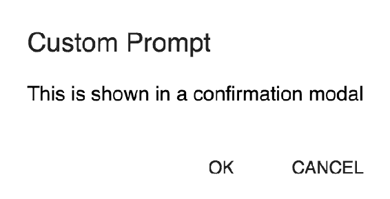

# 第五章：理解核心路由器，并配置`BrowserRouter`和`HashRouter`组件

React-Router 库提供了几个组件，用于解决各种用例，例如使用`<Link>`和`<NavLink>`添加导航链接，使用`<Redirect>`组件重定向用户等。`<BrowserRouter>`组件包装了应用程序的根组件（`<App />`），并使这些组件能够与`history`对象交互。当应用程序初始化时，`<BrowserRouter>`组件初始化`history`对象，并使用 React 的`context`使其可用于所有子组件。

单页应用程序中的路由实际上并不是真正的路由；相反，它是组件的条件渲染。`<BrowserRouter>`组件创建了`history`对象，`history`对象具有诸如`push`、`replace`、`pop`等方法，这些方法在导航发生时被使用。`history`对象使应用程序能够在用户在页面之间导航时保持历史记录。除了`<BrowserRouter>`，React-Router 还提供了各种 Router 实现——`<HashRouter>`、`<StaticRouter>`、`<MemoryRouter>`和`<NativeRouter>`。这些路由器利用了包含在`react-router`核心包中的低级`Router`接口。

在本章中，我们将看一下低级`<Router>`组件和各种路由器实现：

+   `<Router>`和`react-router`包

+   `<BrowserRouter>`属性

+   `HashRouter`——用于在旧版浏览器中使用的 Router 实现

其他`<Router>`实现，如`<StaticRouter>`、`<MemoryRouter>`和`<NativeRouter>`，将在接下来的章节中讨论。

# `<Router>`组件

如前所述，React-Router 提供了各种 Router 实现：

+   `<BrowserRouter>`

+   `<HashRouter>`

+   `<MemoryRouter>`

+   `<StaticRouter>`

+   `<NativeRouter>`

这些路由器利用了低级接口`<Router>`。`<Router>`组件是`react-router`包的一部分，`<Router>`接口提供的功能由这些 Router 实现扩展。

`<Router>`组件接受两个 props——`history`和`children`。`history`对象可以是对浏览器历史记录的引用，也可以是应用程序中维护的内存中的历史记录（这在原生应用程序中很有用，因为浏览器历史记录的实例不可用）。`<Router>`组件接受一个子组件，通常是应用程序的根组件。此外，它创建一个`context`对象，`context.router`，通过它，所有后代子组件，如`<Route>`、`<Link>`、`<Switch>`等，都可以获得`history`对象的引用。

来自 reactjs.org：

上下文提供了一种通过组件树传递数据的方式，而无需在每个级别手动传递 props。

通常不使用`<Router>`接口来构建应用程序；而是使用适合给定环境的高级别 Router 组件之一。使用`<Router>`接口的常见用例之一是将自定义的`history`对象与诸如`Redux`和`MobX`之类的状态管理库同步。

# 包括来自 react-router 的<Router>

核心的`react-router`包可以通过`npm`安装：

```jsx
npm install --save react-router
```

`Router`类然后可以包含在应用程序文件中：

```jsx
import { Router } from 'react-router'
```

下一步是创建一个`history`对象，然后将其作为值提供给`<Router>`的`history` prop：

```jsx
import  createBrowserHistory  from  'history/createBrowserHistory'; const customHistory = createBrowserHistory()
```

在这里，使用`history`包中的`createBrowserHistory`类来为浏览器环境创建`history`对象。`history`包包括适用于各种环境的类。

最后一步是用`<Router>`组件包装应用程序的根组件并渲染应用程序：

```jsx
ReactDOM.render(
 **<**Router  history={customHistory}**>** <App  /> </Router>, document.getElementById('root'));
```

注意，`<Router>`组件接受一个`history` prop，其值是使用`createBrowserHistory`创建的`history`对象。与`<BrowserRouter>`组件类似，`<Router>`组件只接受一个子组件，在有多个子组件时会抛出错误。

React 允许其 prop 值发生变化，并在检测到变化时重新渲染组件。在这种情况下，如果我们尝试更改分配给 history prop 的值，React-Router 会抛出警告消息。考虑以下代码片段：

```jsx
class  App  extends  Component { state  = { customHistory:  createBrowserHistory() } componentDidMount() { this.setState({ customHistory:  createBrowserHistory() **});** } render() { return ( <Router  history={**this**.state.customHistory}> <Route path="/" render={() =>  <div> In Home </div>}  /> </Router> ); } }
```

在前面的例子中，state 属性`customHistory`包含了提供给`<Router>`组件的`history`对象。然而，当`customHistory`的值在`componentDidMount`生命周期函数中改变时，React-Router 会抛出警告消息 Warning: You cannot change <Router> history。

# react-router 包

`react-router`包括一些核心组件，比如之前提到的`<Router>`组件。该包还包括其他一些组件，然后被`react-router-dom`和`react-router-native`包中的组件使用。`react-router`包导出这些组件：

```jsx
export MemoryRouter from "./MemoryRouter";
export Prompt from "./Prompt";
export Redirect from "./Redirect";
export Route from "./Route";
export Router from "./Router";
export StaticRouter from "./StaticRouter";
export Switch from "./Switch";
export generatePath from "./generatePath";
export matchPath from "./matchPath";
export withRouter from "./withRouter";
```

这里提到的一些组件在之前的章节中已经讨论过。该包还提供了一些辅助函数，比如`generatePath`和`matchPath`，以及 Router 实现，比如`<MemoryRouter>`和`<StaticRouter>`。`react-router-dom`和`react-router-native`中定义的组件和服务导入了这些组件和服务，并包含在各自的包中。

# react-router-dom 包

`react-router-dom`包提供了可以在基于浏览器的应用程序中使用的组件。它声明了对`react-router`包的依赖，并导出以下组件：

```jsx
export BrowserRouter from "./BrowserRouter";
export HashRouter from "./HashRouter";
export Link from "./Link";
export MemoryRouter from "./MemoryRouter";
export NavLink from "./NavLink";
export Prompt from "./Prompt";
export Redirect from "./Redirect";
export Route from "./Route";
export Router from "./Router";
export StaticRouter from "./StaticRouter";
export Switch from "./Switch";
export generatePath from "./generatePath";
export matchPath from "./matchPath";
export withRouter from "./withRouter";
```

请注意，这里提到的一些组件也包含在`react-router`包中。`react-router-dom`中的组件导入了`react-router`中定义的组件，然后导出它们。例如，看一下`<Route>`组件：

```jsx
import { Route } from "react-router";
export default Route;
```

`BrowserRouter`、`<HashRouter>`和`<MemoryRouter>`的 Router 实现会创建一个特定于给定环境的`history`对象，并渲染`<Router>`组件。我们很快将会看一下这些 Router 实现。

`react-router-native`包使用了`react-router`中的`<MemoryRouter>`实现，并提供了一个`<NativeRouter>`接口。`NativeRouter`的实现和其打包细节将在接下来的章节中讨论。

# <BrowserRouter>组件

`<BrowserRouter>`组件在第一章中简要讨论过。正如其名称所示，`<BrowserRouter>`组件用于基于浏览器的应用程序，并使用 HTML5 的 history API 来保持 UI 与浏览器的 URL 同步。在这里，我们将看一下该组件如何为浏览器环境创建`history`对象并将其提供给`<Router>`。

`<BrowserRouter>`组件接受以下属性：

```jsx
static propTypes = {
    basename: PropTypes.string,
    forceRefresh: PropTypes.bool,
    getUserConfirmation: PropTypes.func,
    keyLength: PropTypes.number,
    children: PropTypes.node
};
```

与`<Router>`接口类似，`<BrowserRouter>`只接受一个子组件（通常是应用程序的根组件）。前面代码片段中提到的`children`属性指的是这个子节点。使用`history`包中的`createBrowserHistory`方法来创建一个用于初始化`<Router>`的`history`对象：

```jsx
import { createBrowserHistory as createHistory } from "history";
import Router from "./Router";

class  BrowserRouter  extends  React.Component {    ...
    history = createHistory(this.props);
    ...
    render() {
        return <Router 
                   history={this.history}
                   children={this.props.children}
               />;
    }
}
```

在前面的代码片段中，`<BrowserRouter>`使用提供的属性使用`history/createBrowserHistory`类创建一个`history`对象。然后渲染`<Router>`组件，并从属性中提供创建的`history`对象和`children`对象。

# basename 属性

`basename`属性用于为应用程序中的所有位置提供基本的 URL 路径。例如，如果您希望在`/admin`路径上呈现应用程序，而不是在根路径`/`上呈现，则在`<BrowserRouter>`中指定`basename`属性：

```jsx
<BrowserRouter basename="/admin">
    <App />
</BrowerRouter>
```

`basename`属性现在将基本 URL 路径`/admin`添加到应用程序中。当您使用`<Link>`和`<NavLink>`进行导航时，`basename`路径将添加到 URL 中。例如，考虑以下带有两个`<Link>`组件的代码：

```jsx
<BrowserRouter  basename="/admin">
 <div  className="component">
 <nav> <Link  to="/">Home</Link**>** <Link  to="/dashboard">Dashboard</Link**>** </nav>
    </div> </BrowserRouter>
```

当您点击`Home`链接（路径`/`）时，您会注意到 URL 路径更新为`/admin`而不是`/`。当您点击`Dashboard`链接时，更新后的 URL 路径为`/admin/dashboard`。使用`<BrowserRouter>`中的`basename`属性，前面的`<Link>`组件转换为以下内容：

```jsx
<a href='/admin'>Home</a>
<a href='/admin/dashboard'>Dashboard</a>
```

锚链接的`href`属性前缀为`/admin`路径。

# forceRefresh 属性

`forceRefresh`属性是一个布尔属性，当设置为`true`时，导航到任何路由都会导致页面刷新 - 而不是更新页面的特定部分，整个页面都会重新加载：

```jsx
<BrowserRouter forceRefresh={true}>
    <Link to="/dashboard">Dashboard</Link>
</BrowserRouter>
```

当您点击导航链接`Dashboard`时，您会注意到在请求 URL 路径`/dashboard`时页面重新加载。

# keyLength 属性

`keyLength`属性用于指定`location.key`的长度。`locaction.key`属性表示提供给位置的唯一键。看一下以下代码片段：

```jsx
<BrowserRouter keyLength={10}>
    <div  className="container"> <nav> <Link  to="/dashboard">Dashboard</Link> <Link  to="/user">User</Link> </nav> <Route path="/dashboard" render={({ location }) => <div> In Dashboard, Location Key: {location.key}  </div> }
        />
        <Route path="/user" render={({ location }) => <div> In User, Location Key: {location.key}  </div> }
        />
    </div>
</BrowserRouter>
```

当您导航到`/dashboard`或`/user`路径中的任何一个时，`location.key`的值将是一个长度为 10 的随机字母数字字符串。默认情况下，用于生成密钥的`keyLength`属性的值为 6。

当您使用导航链接在`/dashboard`和`/user`路径之间来回导航时，您会注意到每次导航都会生成一个新的键。这是因为当您使用导航链接导航时，会调用`history.push`并生成一个新的键，而该键对于历史堆栈中的每个条目都是唯一的。因此，当您通过单击浏览器的后退按钮导航时，将调用`history.pop`，您会注意到为位置生成的键，并且不会生成新的键。

# getUserConfirmation 属性

`getUserConfirmation`属性接受一个函数作为其值，并且当用户发起的导航被`<Prompt>`组件阻止时执行。`<Prompt>`组件使用`window.confirm`方法显示一个确认对话框，并且仅当用户单击确定按钮时才将用户导航到所选路径。然而，当`<BrowserRouter>`组件指定了`getUserConfirmation`属性时，将执行作为该属性值的函数。这提供了显示自定义对话框的机会。

让我们看一下以下配置：

```jsx
<BrowserRouter getUserConfirmation={this.userConfirmationFunc**}**>
    <div className="container">
        <nav>  <Link  to="/dashboard">Dashboard</Link> <Link  to="/user">User</Link> </nav>
        <Route path="/dashboard" render={({ location }) => <div> In Dashboard, Location Key: {location.key}  </div> }
        />
        <Route path="/user" render={({ location }) => <div> In User, Location Key: {location.key} <Prompt  message="This is shown in a confirmation 
                     window" **/>** </div> }
        />
    </div>
</BrowserRouter>
```

假设当前的 URL 路径是`/user`，您尝试通过单击`nav`菜单中提供的导航链接来导航到不同的路由，比如`/dashboard`。如果未指定`getUserConfirmation`属性，则会显示`<Prompt>`消息。在这种情况下，将执行在组件类中定义的`userConfirmationFunc`函数。

您可以调用`window.confirm`来显示一个确认对话框，询问用户是否导航：

```jsx
userConfirmationFunc  = (message, callback) => { const  status  =  window.confirm(message); callback(status**);** }
```

该函数接受两个参数——`message`和`callback`。`message`参数指定需要显示的消息，而`<Prompt>`组件中包含的`message`属性提供了该值。该函数预计执行作为第二个参数提供的回调函数。

在这里，`<BrowserRouter>`的第二个参数提供了一个回调函数。使用提供的`message`调用`window.confirm`函数，用户将看到两个按钮——确定和取消；单击确定时，`status`设置为 true，单击取消时，`status`设置为`false`。将使用作为第二个参数提供的`callback`函数调用此`status`值；这是一个允许用户导航到所选路由的真值。

这是默认行为；在允许用户导航到所选页面之前，会显示一个原生浏览器确认对话框。然而，这种行为可以在前面提到的`userConfirmationFunc`中进行更改；你可以显示一个自定义对话框，而不是显示浏览器的原生确认对话框。

# 使用 getUserConfirmation prop 显示自定义对话框

为了这个例子，让我们添加`material-UI`，其中包括一个自定义对话框组件：

```jsx
npm install --save @material-ui/core
```

让我们创建一个自定义对话框，将`Dialog`组件包装在`@material-ui/core`中：

```jsx
import { Button, Dialog, DialogActions, DialogContent, DialogTitle } from  '@material-ui/core'; export  class **ConfirmationDialog** extends  Component { render() { const { message, handleClose, isOpen } =  this.props; return ( <Dialog open={isOpen**}**> <DialogTitle>Custom Prompt</DialogTitle> <DialogContent>{message}</DialogContent> <DialogActions> <Button onClick={handleClose.bind(this, true)}> OK
                    </Button> <Button  onClick={handleClose.bind(this, false)}> CANCEL
                    </Button> </DialogActions> </Dialog> )
    }
}
```

这个组件接受三个 props——`message`、`handleClose`和`isOpen`。`message` prop 是你想在自定义对话框中显示的消息，`handleClose` prop 是一个函数引用，当用户点击 OK 或 CANCEL 按钮时调用该函数引用，分别允许或取消转换到所选路径。

让我们在根组件文件（在`App.js`中）中使用这个，并在用户尝试导航到不同的路由时显示`ConfirmationDialog`：

```jsx
class  App  extends  Component {    state  = { showConfirmationDialog:  false, message:  '', callback:  null }
    ...
```

我们首先在 React 组件中将`state`属性设置为它们的初始值。当用户尝试导航到不同的路由时，前面提到的`state`属性会发生变化：

```jsx
... userConfirmationFunc  = (message, callback) => { this.setState({ showConfirmationDialog:  true, message:  message, callback:  callback });
    }
```

前面的`userConfirmationFunc`函数设置`state`属性，以便在用户尝试离开当前路由时显示自定义确认对话框(`ConfirmationDialog`)。

在`App`组件中定义的以下`handleClose`函数将提供给我们之前创建的`ConfirmationDialog`组件：

```jsx
    ...
 handleClose(status) { this.state.callback(status**)**; this.setState({ showConfirmationDialog:  false, message:  '', callback:  null })
    }
```

这为我们提供了一种隐藏自定义确认对话框和将组件的`state`属性重置为它们的初始值的方法。`this.state.callback(status)`语句将关闭确认对话框，并且根据状态为真还是假，将用户导航到所选路由（如果状态为真）或取消导航（如果状态为假）。

这是组件类的更新渲染方法：

```jsx
    ...
    render() { return ( <BrowserRouter getUserConfirmation={this.userConfirmationFunc**}**> ...
                <Route path="/user" render={({ location }) => {
                        return ( <div> In User, Location Key: {location.key} <Prompt  message="This is shown in a 
                             confirmation modal" **/>** </div>
                        ); }}
                />
                <ConfirmationDialog isOpen={this.state.showConfirmationDialog} message={this.state.message} handleClose={this.handleClose.bind(this)} />
                ...
            </BrowserRouter>
        )
    }
}
```

在前面的渲染方法中，包括了自定义的`ConfirmationDialog`对话框，并且只有当`state`属性`showConrfirmationDialog`设置为`true`时才会渲染。`userConfirmationFunc`设置`state`属性，自定义对话框显示如下：



在前面的代码片段中，`handleClose` 函数是由 `ConfirmDialog` 框在用户单击 OK 或 CANCEL 按钮时调用的。OK 按钮将发送值 `true`，而 CANCEL 按钮将发送值 `false` 到先前定义的 `handleClose` 函数。

# <HashRouter> 组件

`<HashRouter>` 组件是 `react-router-dom` 包的一部分，与 `<BrowserRouter>` 类似，也用于构建浏览器环境的应用程序。`<BrowserRouter>` 和 `<HashRouter>` 之间的主要区别是组件创建的 URL：

`<BrowserRouter>` 创建的 URL 如下：

```jsx
www.packtpub.com/react-router
```

`<HashRouter>` 在 URL 中添加了一个哈希：

```jsx
www.packtpub.com/#/react-router
```

`<BrowserRouter>` 组件利用 HTML5 History API 来跟踪路由历史记录，而 `<HashRouter>` 组件使用 `window.location.hash`（URL 的哈希部分）来记住浏览器历史堆栈中的更改。应该在支持 HTML5 History API 的现代浏览器上构建应用程序时使用 `<BrowserRouter>`，而在需要支持旧版浏览器的应用程序中使用 `<HashRouter>`。

`<HashRouter>` 使用 `createHashHistory` 类来创建 `history` 对象。然后将此 `history` 对象提供给核心 `<Router>` 组件：

```jsx
import { createHashHistory  as  createHistory } from  "history";  class  HashRouter  extends  React.Component {    ...
    history =  createHistory(this.props**)**; ...
    render() {
        return **<Router 
                  history={this.history}
                  children={this.props.children} 
               />**;
    } }
```

`<HashRouter>` 接受以下 props：

```jsx
static propTypes = {
    basename: PropTypes.string,
    getUserConfirmation: PropTypes.func,
    hashType: PropTypes.oneOf(["hashbang", "noslash", "slash"]),
    children: PropTypes.node
};
```

与`<BrowserRouter>`类似，props `basename` 和 `getUserConfirmation` 用于分别指定基本 URL 路径和确认导航到所选 URL 的函数。然而，`<HashRouter>` 不支持 `location.key` 和 `location.state`，因此不支持 prop `keyLength`。此外，也不支持 prop `forceRefresh`。

让我们来看看 `hashType` prop。

# hashType prop

`hashType` prop 用于指定用于 `window.location.hash` 的编码方法。可能的值包括 `slash`、`noslash` 和 `hashbang`。

让我们来看看在包含 `hashType` prop 时如何形成 URL：

```jsx
<HashRouter hashType="slash">
    <App />
</HashRouter>
```

当您将 `slash` 指定为 `hashType` prop 的值时，会在哈希 (`#`) 后添加斜杠 (`/`)。因此，URL 将采用以下形式 — `#/`，`#/dashboard`，`#/user` 等。

请注意，`slash` 是 prop `hashType` 的默认值，如果要在 `#` 后添加斜杠，则不需要包括 `hashType` prop。

类似地，当`hashType`属性的值为`noslash`时，URL 的形式为—`#`、`#dashboard`、`#user`等：

```jsx
<HashRouter hashType="noslash">
```

当`hashType`属性分配值`hashbang`时，它创建的 URL 形式为—`#!/`、`#!/dashboard`、`#!/user`等：

```jsx
<HashRouter  hashType="hashbang">
```

`hashbang`是为了让搜索引擎爬虫可以爬取和索引单页面应用程序而添加的。然而，谷歌已经弃用了这种爬取策略。在这里阅读更多信息：[`webmasters.googleblog.com/2015/10/deprecating-our-ajax-crawling-scheme.html`](https://webmasters.googleblog.com/2015/10/deprecating-our-ajax-crawling-scheme.html)。

# 摘要

`react-router`包中的`<Router>`组件提供了路由器接口的低级实现。`react-router-dom`和`react-router-native`中的各种路由器使用这个低级的`<Router>`接口为特定环境提供路由功能。`<Router>`中的`history`属性用于指定给定环境的`history`对象。例如，`<BrowserRouter>`组件在浏览器环境中使用`history/createBrowserHistory`来创建`history`对象。所有的 Router 组件只接受一个子组件，通常是应用程序的根组件。

`react-router-dom`中的`BrowserRouter`组件利用 HTML5 历史 API 与浏览器历史记录同步以保持应用程序的 URL。它接受`basename`、`keyLength`、`forceRefresh`和`getUserConfirmation`等 props。另一方面，`<HashRouter>`在浏览器的 URL 中添加一个哈希(#)并使用`window.location.hash`来跟踪历史记录。它接受`basename`、`getUserConfirmation`和`hashType`等 props。`hashType`属性用于指定用于`window.location.hash`的编码方法；可能的值有`slash`、`noslash`和`hashbang`。

在第六章中，*在服务器端渲染的 React 应用程序中使用 StaticRouter*，我们将介绍使用`<StaticRouter>`组件进行服务器端渲染。
