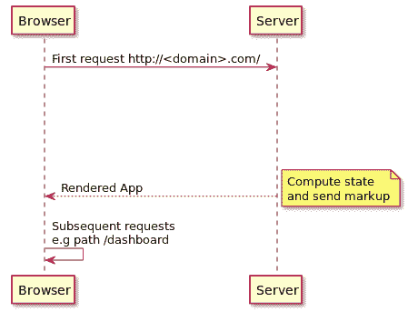

# 第六章：在服务器端呈现的 React 应用程序中使用 StaticRouter

**服务器端渲染**（**SSR**）是一种在服务器上呈现仅客户端的**单页面应用程序**（**SPAs**）的技术，并将完全呈现的页面作为响应发送给用户的请求。在客户端端 SPAs 中，JavaScript 捆绑包被包含为脚本标签，并且最初页面中没有呈现任何内容。捆绑包首先被下载，然后 DOM 节点通过执行捆绑包中的代码进行填充。这有两个缺点——在较差的连接上，可能需要更长时间来下载捆绑包，并且不执行 JavaScript 的爬虫将无法看到任何内容，从而影响页面的 SEO。

SSR 通过在用户请求时加载 HTML、CSS 和 JavaScript 来解决这些问题；内容在服务器上呈现，并且最终的 HTML 交给爬虫。可以使用 Node.js 在服务器上呈现 React 应用程序，并且 React-Router 中可用的组件可以用来定义应用程序中的路由。

在本章中，我们将看看如何在服务器端呈现的 React 应用程序中使用 React-Router 组件：

+   使用 Node.js 和 Express.js 执行 React 应用程序的 SSR

+   添加`<StaticRouter>`组件并创建路由

+   理解`<StaticRouter>`属性

+   通过在服务器上呈现第一页，然后允许客户端代码接管后续页面的呈现来创建同构 React 应用程序

# 使用 Node.js 和 Express.js 执行 React 应用程序的 SSR

在这个例子中，我们将使用 Node.js 和 Express.js 创建一个服务器端应用程序，该应用程序将在服务器上呈现 React 应用程序。Node.js 是一个用于服务器和应用程序的跨平台 JavaScript 运行时环境。它构建在 Google 的 V8 JavaScript 引擎上，并且使用事件驱动的非阻塞 I/O 模型，使其高效且轻量级。Express.js 是 Node.js 环境中使用的最流行的路由和中间件 Web 框架模块之一。它允许您创建中间件，以帮助处理来自客户端的 HTTP 请求。

# 安装依赖项

让我们首先使用`npm init`命令创建一个服务器端应用程序：

```jsx
npm init -y
```

这将创建一个名为`package.json`的文件，并为各种字段添加默认值。下一步是添加依赖项：

```jsx
npm install --save react react-dom react-router react-router-dom express
```

上述命令将把所有必要的库添加到`package.json`文件中的`dependencies`列表中。请注意，我们不是使用`create-react-app` CLI 创建 React 应用程序；相反，我们将添加所需的依赖项并编写构建应用程序的配置文件。

为了构建应用程序，以下开发依赖项被添加到`devDependencies`列表中：

```jsx
npm install --save-dev webpack webpack-cli nodemon-webpack-plugin webpack-node-externals babel-core babel-loader babel-preset-env babel-preset-react 
```

上述命令将把构建应用程序所需的库添加到`package.json`文件中的`devDependencies`列表中。

下一步是编写构建配置，以便构建服务器端应用程序。

# Webpack 构建配置

这是来自 Webpack 文档的：

**Webpack**的核心是现代 JavaScript 应用程序的*静态模块打包程序*。当 webpack 处理您的应用程序时，它在内部构建一个*依赖图*，该图将映射项目所需的每个模块，并生成一个或多个*捆绑包*。

Webpack 已成为为 JavaScript 应用程序创建捆绑包的事实标准。`create-react-app` CLI 包含内部使用`webpack`为开发和生产环境创建捆绑包的脚本。

创建一个名为`webpack-server.config.babel.js`的文件，并包含以下配置：

```jsx
import path from 'path'; import  webpack  from  'webpack'; import  nodemonPlugin  from  'nodemon-webpack-plugin'; import  nodeExternals  from  'webpack-node-externals'; export  default  { entry:  './src/server/index.js', target:  'node', externals:  [nodeExternals()], output:  { path:  path.resolve(__dirname,  'dist'), filename:  'server.js', publicPath:  '/' },
    module:  { rules:  [ {
                test:  /\.js$/, use:  'babel-loader' }
        ]
    },
    plugins:  [ new  webpack.DefinePlugin({ __isBrowser__:  false }),
        new  nodemonPlugin()
    ]
}
```

根据上述配置，文件`index.js`（位于`./src/server`路径）被指定为入口点，并且生成的输出文件`server.js`被复制到`dist`目录。使用`Webpack`的`babel-loader`插件来使用`Babel`和`Webpack`转译应用程序中的 JavaScript 文件。使用`nodemon-webpack-plugin`来运行`nodemon`实用程序，它将监视应用程序中 JavaScript 文件的更改，并在`webpack`以观察模式运行时重新加载和构建应用程序。

下一步是创建一个`.babelrc`文件，其中将列出构建应用程序所需的预设：

```jsx
{
 "presets": ["env","react"] }
```

`babel-preset-env`和`babel-preset-react`插件用于将 ES6 和 React 代码转译为 ES5。作为最后一步，在`package.json`文件中添加一个脚本命令，以使用`webpack-server.config.babel.js`文件中提到的配置启动应用程序：

```jsx
"scripts": {
 "start": "webpack --config webpack-server.config.babel.js --watch --mode development" }
```

命令`npm start`将构建应用程序，并将监听应用程序中 JavaScript 文件的更改，并在检测到更改时重新构建应用程序。

# 服务器端应用程序

如`webpack`配置中所述，应用程序的入口点位于`/src/server/index.js`。让我们在此路径下创建`index.js`文件，并包含以下代码，该代码在给定端口启动服务器应用程序：

```jsx
import  express  from  'express'; const  PORT  =  process.env.PORT  ||  3001; const  app  =  express(); app.get('*', (req, res) => { res.send(` <!DOCTYPE HTML>
 <html>
 <head>
 <title>React SSR example</title>
 </head>
 <body>
 <main id='app'>Rendered on the server side</main>
 </body>
 </html>
 `); });

app.listen(PORT, () => { console.log(`SSR React Router app running at ${PORT}`); });
```

当您运行`npm start`命令并访问 URL`http://localhost:3001`时，将呈现前面的 HTML 内容。这确保了`webpack`配置构建了应用程序，并在端口`3001`上运行前面的服务器端代码，`nodemon`监视文件的更改。

# 使用 ReactDOMServer.renderToString 呈现 React 应用程序

要在服务器端呈现 React 应用程序，首先让我们创建一个 React 组件文件—`shared/App.js`：

```jsx
import  React, { Component } from  'react'; export  class  App  extends  Component { render() { return ( <div>Inside React App (rendered with SSR)</div> ); }
}
```

然后，在`server/index.js`文件中呈现前面的组件：

```jsx
import  express  from  'express'; import  React  from  'react'; import  ReactDOMServer  from  'react-dom/server'; import { App } from  '../shared/App'; app.get('*', (req, res) => { const  reactMarkup  =  ReactDOMServer.renderToString(<App  />**)**; res.send(` <!DOCTYPE HTML>
        <html>
        ...
 **<main id='app'>**${reactMarkup}</main>   
        ...
        </html>
    `); });
```

`ReactDOMServer`类包括用于在服务器端 Node.js 应用程序中呈现 React 组件的各种方法。`ReactDOMServer`类中的`renderToString`方法在服务器端呈现 React 组件并返回生成的标记。然后，可以将此生成的标记字符串包含在发送给用户的响应中。

当您访问`http://localhost:3001`页面时，您会注意到显示了消息“Inside React App (rendered with SSR)”。

确认内容确实是在服务器端呈现的，您可以右键单击页面，然后从上下文菜单中选择“查看页面源代码”选项。页面源代码将显示在新标签页中，其中包括以下内容：

```jsx
<main id='app'>
 <div data-reactroot=""> Inside React App (rendered with SSR) **</div>** </main>
```

当爬虫访问应用程序时，前面的内容很有帮助。通过在服务器端呈现 React 组件，标记被填充并作为来自服务器的响应包含。然后，此内容将被搜索引擎的爬虫索引，有助于应用程序的 SEO 方面。

# 添加<StaticRouter>并创建路由

`<StaticRouter>`组件是`react-router-dom`包的一部分（在`react-router`中使用`<StaticRouter>`定义），它用于在服务器端呈现 React-Router 组件。`<StaticRouter>`组件类似于其他路由器组件，因为它只接受一个子组件——React 应用程序的根组件（`<App />`）。此组件应该在无状态应用程序中使用，用户不会点击以导航到页面的不同部分。

让我们通过包装应用程序的根组件来包含`<StaticRouter>`组件：

```jsx
import { StaticRouter } from  'react-router-dom'**;** app.get('*', (req, res) => { const  context  = {}; const  reactMarkup  =  ReactDOMServer.renderToString( <StaticRouter  context={context}  location={req.url}> <App  /> </StaticRouter**>**  );

    res.send(` ...
        <main id='app'>${reactMarkup}</main> ...
    `);
});
```

请注意，`<StaticRouter>`组件接受两个属性——`context`和`location`。`context`对象是一个空对象，在`<App />`中的一个`<Route>`组件作为浏览器位置匹配的结果进行渲染时，它会被填充属性。

`location`对象通常是请求的 URL，这些信息对中间件函数是可用的。请求对象（`req`）包含指定请求的 URL 的`url`属性。

让我们在`App.js`中包含一对`<Route>`组件：

```jsx
export  class  App  extends  Component {    render() { return ( <div> Inside React App (rendered with SSR) <Route exact
 path='/' render={() =>  <div>Inside Route at path '/'</div>} />
 <Route path='/home' render={() =>  <div>Inside Home Route at path '/home'</div> }
```

```jsx
 />
            </div> ); }
}
```

`<Route>`组件匹配`<StaticRouter>`组件的`location`属性中指定的请求 URL 并进行渲染。

# 使用`<Redirect>`和`staticContext`进行服务器端重定向

从前面的例子中，让我们使用`<Redirect>`组件将用户从`/`路径重定向到`/home`路径：

```jsx
<Route
 path="/" render={() =>  <Redirect  to="/home"  />**}** exact />
```

当您尝试访问 URL `http://localhost:3001/`时，您会注意到重定向没有发生，浏览器的 URL 也没有更新。在客户端环境中，前面的重定向已经足够了。但是，在服务器端环境中，服务器负责处理重定向。在这种情况下，`<StaticRouter>`组件中提到的`context`对象被填充了必要的细节：

```jsx
{
    "action": "REPLACE",
    "location": {
        "pathname": "/home",
        "search": "",
        "hash": "",
        "state": undefined
    },
    "url": "/home"
}
```

`context`对象包含组件渲染的结果。当组件仅渲染内容时，它通常是一个空对象。但是，当渲染的组件重定向到不同的路径时，它会填充前面的细节。请注意，`url`属性指定了应将用户重定向到的路径——到`'/home'`路径。

可以添加一个检查，看看`context`对象中是否存在`url`属性，然后可以使用`response`对象上的`redirect`方法来重定向用户：

```jsx
...
const  reactMarkup  =  ReactDOMServer.renderToString(
 <StaticRouter  context={context}  location={req.url}> <App  /> </StaticRouter> ); if (context.url) { res.redirect(301, 'http://'  +  req.headers.host  +  context.url); } else { res.send(`
        <!DOCTYPE HTML>
        <html>
            ...
        </html>
    `);
}

```

`response`对象中的`redirect`方法用于执行服务器端重定向，并提到状态代码和要重定向到的 URL。

还可以使用渲染组件中的`staticContext`属性向`context`对象中填充更多属性：

```jsx
<Route
 path="/" exact render={({ staticContext, }) => { if (staticContext) { staticContext.status = 301**;** } return ( <Redirect  to="/home"  /> ) }} />
```

在这里，`staticContext`属性在渲染的组件中可用，并且在使用`<Redirect>`组件重定向用户之前，`status`属性被添加到其中。然后`status`属性在`context`对象中可用：

```jsx
res.redirect(context.status, 'http://'  +  req.headers.host  +  context.url);
```

在这里，`context`对象中的`status`属性用于在使用`redirect`方法重定向用户时设置 HTTP 状态。

# 使用 matchPath 进行请求 URL 匹配

在服务器端渲染 React 应用程序时，了解请求的 URL 是否与应用程序中现有路由中的任何一个匹配也是有帮助的。只有在路由可用时，才应在服务器端呈现相应的组件。但是，如果路由不可用，则应向用户呈现一个未找到页面（404）。`react-router`包中的`matchPath`函数允许您将请求的 URL 与包含路由匹配属性（如`path`，`exact`，`strict`和`sensitive`）的对象进行匹配：

```jsx
import { matchPath } from 'react-router'

app.use('*', (req, res) => {
    const isRouteAvailable = **matchPath(req.url, {** path: '/dashboard/',
 strict: true
 });
    ...

});
```

`matchPath`函数类似于库如何将`<Route>`组件与请求的 URL 路径进行匹配。传递给`matchPath`函数的第一个参数是请求的 URL，第二个参数是请求的 URL 应该匹配的对象。当路由匹配时，`matchPath`函数返回一个详细说明请求的 URL 如何与对象匹配的对象。

例如，如果请求的 URL 是`/dashboard/`，`matchPath`函数将返回以下对象：

```jsx
{
    path: '/dashboard/',
    url: '/dashboard/',
    isExact: true,
    params: {}
}
```

在这里，`path`属性提到了用于匹配请求的 URL 的路径模式，`url`属性提到了 URL 的匹配部分，`isExact`布尔属性如果请求的 URL 和路径完全匹配，则设置为`true`，`params`属性列出了与提供的路径名匹配的参数。考虑以下示例，其中提到了路径中的参数：

```jsx
const  matchedObject  =  matchPath(req.url, '/github/:githubID');
```

在这里，不是将对象指定为第二个参数，而是指定了一个路径字符串。如果要将路径与请求的 URL 进行匹配，并使用`exact`，`strict`和`sensitive`属性的默认值，则这种简短的表示法非常有用。匹配的对象将返回以下内容：

```jsx
{
    path: '/github/:githubID',
    url: '/github/sagar.ganatra',
    isExact: true,
    params: { githubID: 'sagar.ganatra' } 
}
```

请注意，`params`属性现在填充了在`path`中提到的参数列表，并提供了请求的 URL 中的值。

在服务器端，在初始化`<StaticRouter>`并渲染 React 应用程序之前，可以执行检查，以查看请求的 URL 是否与对象集合中定义的任何路由匹配。例如，考虑一个路由对象集合。

在`shared/routes.js`中，我们有以下内容：

```jsx
export  const  ROUTES  = [ { path:  '/', exact:  true  }, { path:  '/dashboard/', strict:  true }, { path:  '/github/:githubId' } ];
```

前面的数组包含路由对象，然后可以在`matchPath`中使用它们来检查请求的 URL 是否与前面列表中的任何路由匹配：

```jsx
app.get('*', (req, res) => {
 const isRouteAvailable = ROUTES.find(route => { return matchPath(req.url, route**)**; })
    ...
});
```

如果找到请求的 URL，则`isRouteAvailalbe`将是`ROUTES`列表中的匹配对象，否则当没有路由对象匹配请求的 URL 时，它被设置为`undefined`。在后一种情况下，可以向用户发送页面未找到的标记：

```jsx
if (!isRouteAvailable) {
 **res**.status(404**);** res.send(` <!DOCTYPE HTML> <html> <head><title>React SSR example</title></head> <body> <main id='app'> Requested page '${req.url}**' not found** </main> </body> </html>`); res.end(); }
```

当用户请求路径，比如`/user`，`ROUTES`中提到的对象都不匹配时，前面的响应被发送，提到`404`HTTP 状态，响应主体提到请求的路径`/user`未找到。

# StaticRouter 上下文属性

`<StaticRouter>`组件接受`basename`、`location`和`context`等 props。与其他路由器实现类似，`<StaticRouter>`中的`basename`属性用于指定`baseURL`位置，`location`属性用于指定位置属性——`pathname`、`hash`、`search`和`state`。

`context`属性仅在`<StaticRouter>`实现中使用，它包含组件渲染的结果。如前所述，`context`对象可以填充 HTTP 状态码和其他任意属性。

在初始化时，上下文对象可以包含属性，然后由渲染的组件消耗：

```jsx
const  context  = { message:  'From StaticRouter\'s context object' **}** const  reactMarkup  =  ReactDOMServer.renderToString( <StaticRouter  context={context}  location={req.url}  > <App  /> </StaticRouter> );
```

在这里，上下文对象包含`message`属性，当找到匹配请求 URL 的`<Route>`组件时，包含此属性的`staticContext`对象可用于渲染组件：

```jsx
<Route
 path='/home' render={({ staticContext }) => { return ( <div> Inside Home Route, Message - {staticContext.message**}** </div> ); }} />
```

当您尝试访问`/home`路径时，前面的`<Route>`匹配，并且在`staticContext`消息属性中提到的值被渲染。

`staticContext`属性仅在服务器端环境中可用，因此，在同构应用程序中尝试引用`staticContext`对象（在下一节中讨论），会抛出一个错误，指出您正在尝试访问未定义的属性消息。可以添加检查以查看`staticContext`是否可用，或者可以检查在 webpack 配置中定义的`__isBrowser__`属性的值：

```jsx
<Route
 path='/home' render={({ staticContext }) => { if (!__isBrowser__) { return ( <div> Inside Home Route, Message - {staticContext.message} </div> ); } return ( <div>Inside Home Route, Message</div> ); }} />
```

在上面的例子中，如果页面在服务器端渲染，则`__isBrowser__`属性将为`false`，并且`staticContext`对象中指定的消息将被渲染。

# 创建同构 React 应用程序

一个应用程序，其中代码可以在服务器端和客户端环境中运行，几乎没有或没有变化，被称为同构应用程序。在同构应用程序中，用户的网络浏览器发出的第一个请求由服务器处理，任何后续请求由客户端处理。通过在服务器端处理和渲染第一个请求，并发送 HTML、CSS 和 JavaScript 代码，提供更好的用户体验，并帮助搜索引擎爬虫索引页面。然后，所有后续请求可以由客户端代码处理，该代码作为服务器的第一个响应的一部分发送。

以下是更新后的请求-响应流程：



为了在客户端渲染应用程序，可以使用`<BrowserRouter>`或`<HashRouter>`组件中的任何一个。在本例中，我们将使用`<BrowserRouter>`组件。

添加了用于客户端代码的目录后，应用程序结构如下：

```jsx
/server-side-app
|--/src
|----/client
|------index.js
|----/server
|------index.js
|----/shared
|------App.js
```

在这里，`shared`目录将包含可以被服务器端和客户端代码使用的代码。使用`<BrowserRouter>`组件的客户端特定代码位于`client`目录中的`index.js`文件中：

```jsx
import  React  from  "react"; import  ReactDOM  from  "react-dom"; import { BrowserRouter } from  "react-router-dom"; import { App } from  "../shared/App"; // using hydrate instead of render in SSR app ReactDOM.hydrate( <BrowserRouter> <App  /> </BrowserRouter>, document.getElementById("app") );
```

在这里，`ReactDOM`类中的`hydrate`方法被用来渲染应用程序，而不是调用`render`方法。`hydrate`方法专门设计用来处理初始渲染发生在服务器端（使用`ReactDOMServer`）的情况，以及所有后续的路由更改请求来更新页面的特定部分都由客户端代码处理。`hydrate`方法用于将事件监听器附加到在服务器端渲染的标记上。

下一步是构建应用程序，以便在构建时生成客户端包，并包含在服务器的第一个响应中。

# Webpack 配置

现有的 webpack 配置构建了服务器端应用程序，并运行`nodemon`实用程序来监视更改。为了生成客户端包，我们需要包含另一个 webpack 配置文件—`webpack-client.config.babel.js`：

```jsx
import  path  from  'path'; import  webpack  from  'webpack'; export  default { entry:  './src/client/index.js', output: { path:  path.resolve(__dirname, './dist/public'), filename:  'bundle.js', publicPath:  '/' }, module: { rules: [ { test: /\.js$/, use:  'babel-loader' } ] }, plugins: [ new  webpack.DefinePlugin({ __isBrowser__:  "true" }) ] }
```

前面的配置解析了`/src/client/index.js`文件中的依赖关系，并在`/dist/public/bundle.js`处创建了一个包。这个包包含了运行应用程序所需的所有客户端代码；不仅是`index.js`文件中的代码，还包括`shared`目录中声明的组件。

当前的`npm start`脚本还需要修改，以便客户端应用程序代码与服务器端代码一起构建。让我们创建一个文件，导出服务器和客户端 webpack 配置——`webpack.config.babel.js`：

```jsx
import clientConfig from './webpack-client.config.babel'; import serverConfig from './webpack-server.config.babel'; export default [clientConfig, serverConfig];
```

最后，更新`npm start`脚本，以引用上述配置文件：

```jsx
"start": "webpack --config webpack.config.babel.js --mode development --watch"
```

上述脚本将生成`server.js`，其中包含服务器端代码，以及`bundle.js`，其中包含客户端代码。

# 服务器端配置

最后一步是更新服务器端代码，将客户端 bundle（`bundle.js`）包含在第一个响应中。服务器端代码可以包含一个`<script>`标签，其中指定了`bundle.js`文件的源（`src`）属性：

```jsx
res.send(`
 <!DOCTYPE HTML> <html> <head> <title>React SSR example</title> **<script src='/bundle.js' defer></script>** ...
    </html>
`);
```

另外，为了使我们的 express 服务器能够提供 JavaScript 文件，我们包括了用于提供静态内容的中间件函数：

```jsx
app.use(express.static('dist/public'))
```

上述代码允许从`dist/public`目录提供静态文件，如 JavaScript 文件、CSS 文件和图像。在使用`app.get()`之前，应包含上述语句。

当您访问`/home`路径的应用程序时，第一个响应来自服务器，并且除了渲染与`/home`路径匹配的`<Route>`之外，客户端 bundle——`bundle.js`也包含在响应中。`bundle.js`文件由浏览器下载，然后路由路径的任何更改都由客户端代码处理。

# 摘要

在本章中，我们看了一下如何使用`ReactDOMserver.renderToString`方法在服务器端（使用 Node.js 和 Express.js）呈现 React 应用程序。React-Router 中的`<StaticRouter>`组件可用于包装应用程序的根组件，从而使您能够在服务器端添加与请求的 URL 路径匹配的`<Route>`组件。`<StaticRouter>`组件接受`context`和`location`属性。在渲染的组件中，`staticContext`属性（仅在服务器端可用）包含`context`属性中由`<StaticRouter>`提供的数据。它还可以用于在使用`<Redirect>`组件时添加属性以重定向用户。

`matchPath` 函数用于确定请求的 URL 是否与提供的对象 `{path, exact, strict, sensitive}` 匹配。这类似于库如何将请求的 URL 与页面中可用的 `<Route>` 组件进行匹配。`matchPath` 函数使我们能够确定请求的 URL 是否与集合中的任何路由对象匹配；这为我们提供了一个机会，可以提前发送 404：页面未找到的响应。

还可以创建一个同构的 React 应用程序，它在服务器端渲染第一个请求，然后在客户端渲染后续请求。这是通过在从服务器发送第一个响应时包含客户端捆绑文件来实现的。客户端代码在第一个请求之后接管，这使您能够更新与请求的路由匹配的页面的特定部分。

在第七章中，*在 React Native 应用程序中使用 NativeRouter*，我们将看看如何使用 `NativeRouter` 组件来定义 React-Native 创建的原生移动应用程序中的路由。
