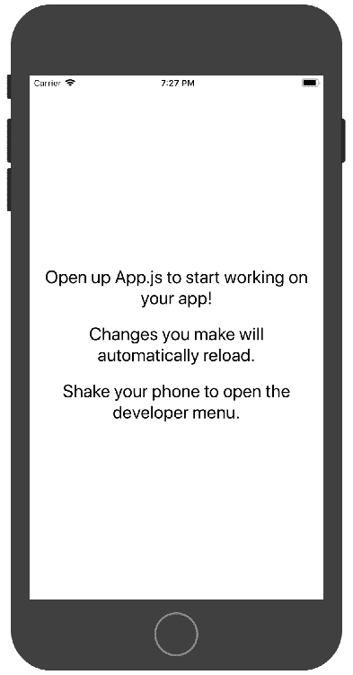
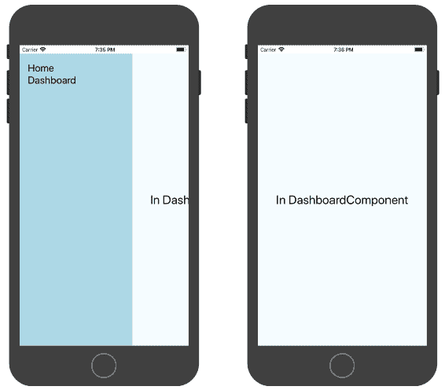
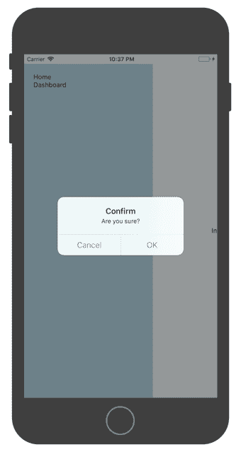
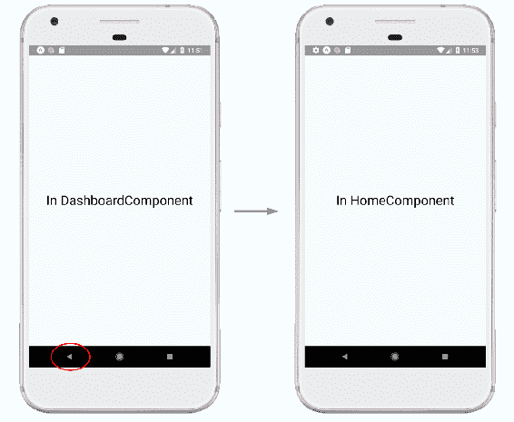

# 第七章：在 React Native 应用程序中使用 NativeRouter

React Router 库提供了`react-router-native`包，其中包括用于 React Native 应用程序的`NativeRouter`组件的实现。React Native 框架允许您使用 JavaScript 和 React 构建 iOS 和 Android 的本机移动应用程序。

来自 React Native 文档（[`facebook.github.io/react-native/`](https://facebook.github.io/react-native/)）：

“使用 React Native，您不会构建**移动 Web 应用程序**，**HTML5 应用程序**或**混合应用程序**。您构建的是一个与使用 Objective-C 或 Java 构建的应用程序无异的真实移动应用程序。React Native 使用与常规 iOS 和 Android 应用程序相同的基本 UI 构建块。您只需使用 JavaScript 和 React 将这些构建块组合在一起。”

在本章中，讨论了以下主题：

+   在 React Native 应用程序中使用 NativeRouter

+   NativeRouter 组件及其属性

+   使用`<BackButton>`组件与设备的返回按钮交互

+   使用`<DeepLinking>`组件创建深链接

# 在 React Native 应用程序中使用 NativeRouter

与`create-react-app`CLI 类似，`create-react-native-app`CLI 用于创建一个包含构建脚本的应用程序，可用于开发和生产环境。它还包括`packager`，允许您在 iOS 和 Android 模拟器以及真实设备上测试应用程序。

# 使用 create-react-native-app CLI 创建新项目

让我们首先安装 CLI：

```jsx
npm install -g create-react-native-app
```

上一个命令将 CLI 安装在全局的`node_modules`目录中。下一步是使用 CLI 创建一个 React Native 项目：

```jsx
create-react-native-app react-native-test-app
```

创建了`react-native-test-app`目录，并在`node_modules`目录中下载了所有必需的脚本。

现在，当您运行`npm start`脚本时，构建脚本会启动`packager`，并为您生成一个 QR 码和一个 URL，以便您在真实设备（iOS 或 Android）或模拟器上访问应用程序。此外，如果您已安装 Xcode 或 Android Studio，还可以启动 iOS 或 Android 模拟器。这是一个例子：

```jsx
Your app is now running at URL: exp://192.168.1.100:19000
View your app with live reloading:
Android device:
-> Point the Expo app to the QR code above.
(You'll find the QR scanner on the Projects tab of the app.)
iOS device:
-> Press s to email/text the app URL to your phone.
Emulator:
-> Press a (Android) or i (iOS) to start an emulator.
Your phone will need to be on the same local network as this computer.
For links to install the Expo app, please visit https://expo.io.
Logs from serving your app will appear here. Press Ctrl+C at any time to stop.
› Press a to open Android device or emulator, or i to open iOS emulator.
› Press s to send the app URL to your phone number or email address
› Press q to display QR code.
› Press r to restart packager, or R to restart packager and clear cache.
› Press d to toggle development mode. (current mode: development)
```

在本例中，我们将使用 Xcode 模拟器；当您请求在 iOS 模拟器上查看应用程序时，这是应用程序的屏幕截图：



React Native 提供了几个组件，允许您为原生平台构建视图。让我们看一下代码，并了解用于构建前述视图的一些组件。

在`App.js`中，包括以下代码：

```jsx
export  default  class  App  extends  React.Component {    render() { return ( <View  style={styles.container}**>**  <Text>Open up App.js to start working on your app!</Text**>** <Text>Changes you make will automatically reload.</Text> <Text>Shake your phone to open the developer menu.</Text> </View> ); } }
```

在这里，React Native 的`<View>`组件被用来创建一个容器，类似于在 React 应用程序中使用`<div>`或`<section>`创建容器的方式。在 React Native 中，不是使用 HTML 元素，如`<div>`和`<span>`，而是使用 React Native 的组件，如`<View>`和`<Text>`。

# 添加`<NativeRouter>`组件

让我们现在将`react-router-native`包添加到我们刚刚创建的应用程序中：

```jsx
 npm install --save react-router-native
```

`NativeRouter`组件用于在 React Native 应用程序中提供路由和导航支持。它使得诸如`<Route>`和`<Link>`之类的组件可以在原生应用程序中使用。

让我们首先创建一个包含一对`<Link>`组件的侧边菜单：

```jsx
import { Link } from 'react-router-native';

export  class  Menu  extends  Component { render() { return ( <ScrollView  scrollsToTop={false}  style={styles.menu}> <View> <Link  to="/"> <Text>Home</Text> </Link> <Link  to="/dashboard"> <Text>Dashboard</Text> </Link**>** </View> </ScrollView> ) } }
```

`<ScrollView>`组件被用作容器来承载我们的菜单项（`<Link>`组件）。正如其名称所示，`<ScrollView>`组件用于创建可滚动的容器。下一步是向应用程序添加`<Route>`组件：

```jsx
export  class  ContentView  extends  Component { render() { return ( <View  style={styles.container}> <Route path="/" exact component={HomeComponent} /> <Route path="/dashboard" component={DashboardComponent} **/>** </View> ) } }
```

`ContentView`组件将`<Route>`组件包装在`<View>`组件中，从而定义了路径为`/`和`/dashboard`的两个应用程序路由。

作为最后一步，我们现在将使用`react-native-side-menu`中的`<SideMenu>`组件来创建一个抽屉菜单。然后在 App.js 中将此菜单包装在`<NativeRouter>`组件中：

```jsx
export  default  class  App  extends  Component { render() { const  menu  =  <Menu  />**;** return ( <NativeRouter**>** <View  style={styles.container}> <SideMenu  menu={menu}> <ContentView  /> </SideMenu**>** </View> </NativeRouter**>** ); } }
```

类似于其他路由器实现，`NativeRouter`组件包装了应用程序根组件，并使得`<Route>`和`<Link>`组件可以在用户浏览应用程序时更新`history`。

在模拟器上重新构建应用程序后：



当您选择任一链接时，`ContentView`将使用由`<Route>`匹配渲染的组件进行更新。

前述功能类似于`BrowserRouter`使您能够浏览应用程序中定义的各种路由。类似于`<Route>`和`<Link>`组件，其他组件，如`<Switch>`、`<Redirect>`和`<NavLink>`在 React Native 应用程序中的行为也是相同的。然而，当您尝试使用`<Prompt>`组件阻止导航时，应该使用 React Native 的`Alert`组件来显示确认消息。

从 NativeRouter 的实现：

```jsx
import { Alert } from  "react-native";

NativeRouter.defaultProps = {
    getUserConfirmation: (message, callback) => {
        Alert.alert("Confirm", message, [
            { text: "Cancel", onPress: () => callback(false) },
            { text: "OK", onPress: () => callback(true) }
        ]);
    }
};
```

NativeRouter 提供了`getUserConfirmation`函数的默认实现，它使用`react-native`包中定义的`Alert`组件来向用户显示确认消息：



这种默认行为可以通过包括`getUserConfirmation`属性来覆盖：

```jsx
<NativeRouter getUserConfirmation={customGetUserConfirmation}>
...
</NativeRouter>
```

# <NativeRouter>组件

`NativeRouter`组件使用`react-router`包中定义的`MemoryRouter`组件在 React Native 应用程序中提供路由支持。当您希望在内存中保留浏览历史记录而不更新地址栏中的 URL 时，可以使用`MemoryRouter`。这在没有地址栏的非浏览器环境中特别有用。`MemoryRouter`组件使用`history`包中可用的`createMemoryHistory`类创建一个`history`对象。然后将此`history`对象提供给低级别的`<Router>`接口。

在`NativeRotuer.js`中：

```jsx
import  MemoryRouter  from  "react-router/MemoryRouter"; const  NativeRouter  =  props  =>  <MemoryRouter {...props} />;
```

然后，`MemoryRouter`组件使用`createMemoryHistory`在`MemoryRouter.js`中创建一个`history`对象：

```jsx
import { createMemoryHistory  as  createHistory } from  "history"; class  MemoryRouter  extends  React.Component { **history** =  createHistory(this.props**)**;
    ...

    render() {
        return <Router 
                  history={this.history} children={this.props.children}
               />;
    }
}
```

`NativeRouter`组件接受 props：`initialEntries`，`initialIndex`，`getUserConfirmation`，`keyLength`和`children`。如前所述，`NativeRouter`类中包含了`getUserConfirmation`的默认实现，而`keyLength`和`children`属性的行为与前几章中提到的其他路由器组件类似。

让我们来看看`initialEntries`和`initialIndex`属性。

# initialEntries 属性

initialEntries 属性用于使用位置列表填充历史堆栈：

```jsx
export  default  class  App  extends  Component {    render() {
        const  initialEntries  = ['/', '/dashboard'**]**; return ( <NativeRouter  initialEntries={initialEntries**}**> ...
            </NativeRouter>
        );
    }
}
```

在初始化 NativeRouter 时，您可以通过提供位置路径数组来填充历史记录。位置路径可以是字符串，甚至是形状为`{ pathname，search，hash，state }`的对象：

```jsx
const initialEntries = [
    '/' ,
    { 
 pathname: '/dashboard',
 search: '',
 hash: 'test', 
 state: { from: '/'}
 }
];
```

# initialIndex 属性

initialIndex 属性用于指定在应用程序加载时渲染在`initialEntries`数组中的位置的索引值。例如，如果`initialEntries`数组列出了两个位置，那么`initialIndex`值为`1`会加载第二个条目；也就是说，匹配`initialEntries`数组中第二个条目作为路径名的`<Route>`实例会被渲染：

```jsx
export  default  class  App  extends  Component {    render() { const  initialEntries  = ['/', '/dashboard']; const  initialIndex  =  1; return ( <NativeRouter  initialEntries={initialEntries}  initialIndex={initialIndex**}**> ...
            </NativeRouter>
        )
    }
}
```

在这个例子中，`initialIndex`的值设置为`1`，因此当应用程序加载时，匹配位置路径`/dashboard`的`<Route>`被渲染。

# <BackButton>组件

默认情况下，在 Android 设备上按下返回按钮时，应用程序会退出，而不是将用户导航到历史记录中的上一个状态。React Native 库包括一个`BackHandler`类，它允许您自定义设备的硬件返回按钮的行为。React Router 中的`<BackButton>`组件使用`BackHandler`类来自定义 Android 设备上返回按钮的行为：

```jsx
import { NativeRouter, BackButton } from 'react-router-native';

export  default  class  App  extends  Component { render() { return (
            <NativeRouter>
                <View  style={styles.container}>
                    **<BackButton />** <SideMenu  menu={menu}> <ContentView  /> </SideMenu> </View> </NativeRouter> )
    }
}
```

`<BackButton>`组件可以包含在应用程序的任何位置。在前面的示例中，该组件包含在根组件中，不包含任何子组件。请注意，`<BackButton>`组件不会在视口上呈现任何内容；相反，它促进了与设备返回按钮的交互。

以下是工作流程：



在仪表板屏幕（路径为`/dashboard`）上，当您点击设备的返回按钮时，用户将被导航到主页（路径为`/`）。

# 使用<DeepLinking>创建深层链接

在 Web 应用程序中，HTTP URL 引用的位置可以通过在浏览器的地址栏中输入来访问。在单页应用程序中，此位置指的是用户可以导航到的特定路由。在移动应用程序的上下文中，`DeepLink`指的是您想要查看的特定页面或内容。例如，当您在移动设备上点击链接时，应用程序会启动，而不是在浏览器窗口中打开新标签，并显示所请求的页面。

与 Web 应用程序不同，移动设备上的应用程序需要为应用程序声明 URI 方案，而不是使用 HTTP 引用特定位置。例如，Twitter 应用程序使用 URI 方案`twitter://`，因此您可以通过引用 URI `twitter://profile` 查看他们的 Twitter 个人资料。当用户点击电子邮件中的链接或访问推送通知消息时，深层链接非常有用，这些链接将用户导航到应用程序以显示所请求的内容。

React Native 提供了接口，允许您在 iOS 和 Android 平台上为设备创建深层链接。在本节中，我们将看看如何在 Android 设备上创建深层链接，因此我们需要安装 Android Studio。Android Studio 允许我们创建虚拟设备（AVD），然后用于测试深层链接。

在 React Native 文档中详细介绍了在 iOS 和 Android 上安装必要组件的逐步指南：[`facebook.github.io/react-native/docs/getting-started.html`](https://facebook.github.io/react-native/docs/getting-started.html)。

安装 Android Studio 并创建 AVD 后，需要为应用程序配置 URI 方案。要添加 URI 方案，需要更新一些本机文件，并且要访问这些本机文件，需要退出当前设置。

# 从 create-react-native-app 中退出

`create-react-native-app` CLI 是一个非常好的选项，可以为 React Native 应用程序提供脚手架和在模拟器上测试应用程序。然而，要测试`DeepLinking`，我们需要在清单文件中包含条目，因此需要使用以下命令退出配置：

```jsx
npm run eject
```

上一个命令将为 iOS 和 Android 平台生成配置文件。这个最基本的配置允许你为 iOS 设备生成一个`.ipa`文件，为 Android 设备生成一个`.apk`文件。在本节中，我们将看到如何生成`.apk`文件，然后部署到 AVD 上。

退出后，你会看到为 iOS 和 Android 生成的各种目录和文件：

```jsx
|--/android
|----/.gradle
|----/app
|----/build
|----/gradle
|----/keystores
|--/ios
|----/chapter7DeepLink
|----/chapter7DeepLink-tvOS |----/chapter7DeepLink-tvOSTests |----/chapter7DeepLink.Xcodeproj |----/chapter7DeepLinkTests
```

下一步是在 Android 设备上构建和运行应用程序：

```jsx
npm run android
```

上一个命令将运行构建脚本并生成`.apk`文件，然后部署到 AVD 上。请确保在执行上一个命令之前虚拟设备正在运行。

要在 Android 设备上配置 URI 方案，需要更新位于`/android/app/src/main`路径的`AndroidManifest.xml`清单文件。在下一节中，我们将看到需要添加到清单文件中的配置。

# 向清单文件添加<intent-filter>

`AndroidManifest.xml`文件包含有关应用程序的元信息，并用于声明应用程序中存在的各种组件。这些组件使用意图过滤器进行激活。清单文件中的`<intent-filter>`实例用于定义应用程序的功能，并定义其他应用程序与应用程序交互的策略。

当你退出配置时，`AndroidManifest.xml`文件将被生成：

```jsx
<manifest  xmlns:android="http://schemas.android.com/apk/res/android"
 **package**="com.chapter7deeplink"> <uses-permission  android:name="android.permission.INTERNET"  /> <uses-permission  android:name="android.permission.SYSTEM_ALERT_WINDOW"/> <application android:name=".MainApplication" android:label="@string/app_name" android:icon="@mipmap/ic_launcher" android:allowBackup="false" android:theme="@style/AppTheme"> <activity android:name=".MainActivity" android:label="@string/app_name" android:configChanges="keyboard|keyboardHidden|orientation|screenSize" android:windowSoftInputMode="adjustResize"> <intent-filter> <action  android:name="android.intent.action.MAIN"  /> <category  android:name="android.intent.category.LAUNCHER"  /> </intent-filter**>** </activity> <activity  android:name="com.facebook.react.devsupport.DevSettingsActivity"  /> </application> </manifest>
```

在这里，`<intent-filter>`为应用程序定义了动作和类别，分别为`android.intent.action.MAIN`和`android.intent.category.LAUNCHER`。前一个`intent-filter`使应用程序能够在用户设备上看到，并且当用户点击应用程序时，应用程序中的`MainActivity`（请参阅 activity 标签）会被触发。

类似地，用于为应用程序定义 URI 方案的`intent-filter`可以添加到清单文件中：

```jsx
<intent-filter  android:label="filter_react_native">
 <action  android:name="android.intent.action.VIEW"  /> <category  android:name="android.intent.category.DEFAULT"  /> <category  android:name="android.intent.category.BROWSABLE"  /> <data  android:scheme="deeplink"  android:host="app.chapter7.com" **/>** </intent-filter>
```

在这里，`<data>`标签用于指定应用程序的 URI 方案。`<data>`标签中的`android:scheme`属性用于指定方案名称，`android:host`属性用于指定应用程序使用的`hostname`类型。因此，`deeplink://app.chapter7.com` URI 用于访问应用程序中的主页。可以使用此 URI 访问具有`/dashboard`路径的路由：`deeplink://app.chapter7.com/dashboard`。

下一步是使用 React Router 的`<DeepLinking>`组件，以便应用程序可以对传入的请求做出反应，并将用户导航到请求的路由。

# 包括<DeepLinking>组件

`react-router-native`包中的`<DeepLinking>`组件使用 React Native 的`Linking`接口来监听 URL 的更改。每当检测到更改时，用户就会通过在历史堆栈中添加条目来导航到请求的路径。

`<DeepLinking>`组件可以包含在应用程序的任何位置：

```jsx
export  class  RootComponent  extends  Component { render() { return ( <View  style={styles.container}> <DeepLinking **/>** <View  style={styles.nav}> <Link  to="/app.chapter7.com">
                        <Text>Home</Text>
                    </Link> <Link  to="/app.chapter7.com/dashboard">
                        <Text>Dashboard</Text>
                    </Link> </View> <View  style={styles.routeContainer}> <Route  path="/app.chapter7.com"  exact  component={HomeComponent}  /> <Route  path="/app.chapter7.com/dashboard"  component={DashboardComponent}  /> </View> </View> ) } }
```

在这里，`<DeepLinking>`组件包含在应用程序的`RootComponent`中，并且`<Route>`路径使用前缀`app.chapter7.com`进行更新，以匹配`AndroidManifest.xml`文件中声明的主机名。

要测试深层链接，请尝试以下命令：

```jsx
adb shell am start -W -a android.intent.action.VIEW -d deeplink://app.chapter7.com/dashboard
```

上一个命令应该在 AVD 上启动应用程序，并将您导航到具有`/dashboard`路径的路由。

# 摘要

在本章中，我们看了一下 React Router 的`<NativeRouter>`组件如何在 React Native 应用程序中使用。`<NativeRouter>`组件包含在`react-router-native`包中，并在内部使用`react-router`包中定义的`<MemoryRouter>`组件。`<NativeRouter>`组件接受 props：`initialEntries`、`initialIndex`、`getUserConfirmation`、`keyLength`和`children`。此外，它为`getUserConfirmation`函数提供了默认实现，该函数使用 React Native 的`Alert`组件显示确认消息。当应用程序中包含`<Prompt>`组件并且用户尝试从当前路由导航时，将显示此确认消息。

`<BackButton>`组件在`react-router-native`中是 React Native 的`BackHandler`类的包装器，它监听设备的返回按钮，并通过历史堆栈中的一个条目将用户导航回去。`<DeepLinking>`组件用于处理应用程序中内容的深层链接。该组件使用 React Native 的`Linking`接口来监听 URL 的更改，并在使用深层链接 URI 方案访问应用程序时将用户导航到请求的路由。要为应用程序定义 URI 方案，需要更新`AndroidManifest.xml`清单文件，为主要活动（`.MainActivity`）添加`<intent-filter>`。`intent-filter`声明要使用的 URI 方案和主机名以访问应用程序内的内容。

在下一章中，我们将看一下状态管理工具 Redux，并了解如何将 React Router 与 Redux 结合使用。
