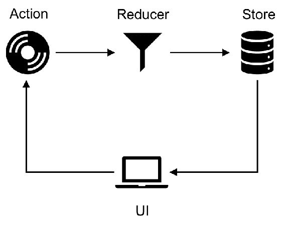
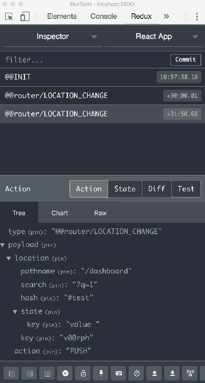

# 第八章：使用 connected-react-router 的 Redux 绑定

在之前的章节中，我们看到了如何使用组件的状态来存储模型数据，以及当模型由于用户操作而更新时，React 如何更新视图。在大型应用程序中，此状态信息不仅应该对当前组件及其子组件可用，还应该对应用程序树中的其他组件可用。有各种状态管理库可用，可帮助使用户界面组件与应用程序状态保持同步。Redux 是一个这样的库，它使用一个中央数据存储来管理应用程序的状态。存储作为真相的来源，应用程序中的组件可以依赖于存储中维护的状态。

在本章中，我们将看一下`connected-react-router`库，它为 React Router 提供了 Redux 绑定。本章讨论以下主题：

+   使用 Redux 进行状态管理-介绍 Redux 概念

+   开始使用`connected-react-router`

+   从 Redux 存储中读取 react-router 状态

+   通过分派操作导航到不同路由

# 使用 Redux 进行状态管理

如前所述，Redux 使用单个存储来管理应用程序的状态。除了`Store`，还有另外两个构建块：`Actions`和`Reducers`。

让我们看看这些构建块如何帮助维护`state`并在`Store`中的`state`更改时更新视图。

# 操作

操作让您定义用户可以执行的操作，以更新应用程序的状态。操作是一个 JavaScript 对象，具有`{ type，payload }`的形状，其中`type`是指用户操作的字符串，`payload`是应该更新状态的数据：

```jsx
let todoId = 0;
export const addTodo = text => ({
    type: 'ADD_TODO'
    payload: {
        text,
        id: todoId++,
        isCompleted: false
    }
})
```

在这里，`addTodo`操作接受 TODO 文本，并指示该操作用于将 TODO 添加到 TODO 列表中。`payload`在这里是一个包含 TODO `text`，TODO `ID`和布尔标志`isCompleted`（设置为 false）的对象。也可以有不需要包含`payload`属性的操作。例如，考虑以下操作：

```jsx
export const increment = () => ({
    type: 'INCREMENT'
})
```

在这里，`action`类型`INCREMENT`表示实体的值必须增加 1。前面的`action`不需要`payload`属性，并且根据操作类型，可以更新实体的状态。

# 减速器

Redux 中的 Reducer 根据分派到存储的操作改变实体的状态。Reducer 是一个纯函数，接受两个参数：`state`和`action`。然后根据存储在`action.type`中的值返回更新后的状态。例如，考虑以下 reducer：

```jsx
const todoReducer  = (state  = [], action) => { switch (action.type) { case  '**ADD_TODO**':
            return [
                ...state,
                {
                    id: action.payload.id,
                    text: action.payload.text,
                    isCompleted: action.payload.isCompleted
                }
            ];  default: return  state; } }
```

`todoReducer`的初始状态设置为空数组（状态参数的默认值），当操作类型为`ADD_TODO`时，TODO 被添加到列表中。Redux 的核心原则之一是不要改变状态树，而是返回一个新的状态树作为组件分派的操作的结果。这有助于保持 reducer 函数的纯净（即没有副作用），并有助于在 React 组件重新渲染视图元素时识别新的状态变化。

同样，可能会有多个更新 TODO 状态的操作（如`MARK_COMPLETED`和`DELETE`），并且根据分派到存储的操作类型，reducer 可以改变 TODO 列表的状态。

# 存储

存储是一个中心数据对象，应用程序的状态可以从中派生。应用程序中的组件订阅存储状态的变化并更新视图。

Redux 中数据的流动方式如下：



用户执行操作，比如提交表单或点击按钮，从而向存储分派一个操作。应用程序定义了用户可以执行的各种操作，reducer 被编码以便处理这些操作并更新实体的状态。应用程序中各种实体的状态都在一个中心位置维护：存储。例如，应用程序可能有各种实体，如 Todo 和用户配置文件，存储将维护这些实体的状态信息。每当 reducer 更新存储中特定实体的状态值时，用户界面组件从存储接收更新，更新组件的状态信息并重新渲染视图以显示更新后的状态。

# React 中的 Redux

使用`create-react-app`CLI 创建项目后，包括依赖`redux`和`react-redux`：

```jsx
npm install --save redux react-redux 
```

`redux`库包括`createStore`、`combineReducers`、`bindActionCreators`、`applyMiddleware`和`compose`辅助函数；而`react-redux`库包括 Redux 绑定，帮助你的 React 组件与 Redux 存储通信。

下一步是定义用户可以从用户界面发起的动作。在我们的示例中，我们将创建一个`Counter`组件，该组件可以`增加`和`减少`计数器的值。

在`actions/counter.js`中：

```jsx
export  const  increment  = () => ({ **type:****'INCREMENT'** }); export  const  decrement  = () => ({ type: **'DECREMENT'** });
```

在为我们的计数器实体定义动作之后，需要定义更新`counter`状态的`reducer`：

在`reducers/counter.js`中：

```jsx
const  counterReducer  = (state  =  0, action) => {    switch (action.type) { case  'INCREMENT': return  state  +  1; case  'DECREMENT': return  state  -  1; default: return  state; }
}

export  default **counterReducer**;
```

在这里定义的`reducer`根据用户触发的`action`类型更新`state`值。同样，应用程序中可以有各种 reducers 和 actions，它们在用户触发某个动作时更新实体的状态。

`redux`中的`combineReducers`实用程序允许您将所有 reducers 组合成一个单一的 reducer，然后可以在应用程序的存储中使用它来进行初始化。

在`reducers/index.js`中：

```jsx
import { combineReducers } from  'redux'; import  counterReducer  from  './counter'; const  rootReducer  =  combineReducers({ count:  counterReducer,
    todo: todoReducer }); export  default  rootReducer;
```

使用`combineReducers`函数创建了一个`rootReducer`，它接受一个包含实体和 reducer 键值映射的对象。这里`counterReducer`分配给了`count`实体，`todoReducer`分配给了一个带有`todo`键的实体。

然后在`createStore`函数中使用`rootReducer`来创建一个 store。

在`index.js`中：

```jsx
import { createStore } from 'redux';

const  store  =  createStore(
    rootReducer
);
```

使用`react-redux`库中定义的`<Provider>`组件，将 store 提供给应用程序中的组件：

```jsx
ReactDOM.render(
 **<**Provider  store={store}**>**
 **<**Counter **/>**
 **</**Provider>,
 document.getElementById('root')
);
```

应用程序中的组件现在可以使用`connect`高阶函数订阅存储中实体（`count`和`todo`）的状态更改。创建了一个`Counter`组件，它将显示`count`的当前状态值，并将分发我们在`actions/counter.js`中定义的`increment`和`decrement`动作。

在`components/counter.component.js`中：

```jsx
import { increment, decrement } from  '../actions/counter'; const  Counter  = ({ count, increment, decrement }) => ( <div> <h4>Counter</h4> <button  onClick={decrement}>-</button> <span>{count}</span> <button  onClick={increment}>+</button> </div> )
```

使用以下`connect`方法从`store`中提供`count`、`increment`和`decrement`属性：

```jsx
import { connect } from  'react-redux'; import { increment, decrement } from  '../actions/counter';  ... const  mapStateToProps  =  state  => ({    count:  state.count });

const  mapDispatchToProps  =  dispatch  => ({    increment: () =>  dispatch(increment()),
    decrement: () =>  dispatch(decrement()) })

export  default  connect(mapStateToProps, mapDispatchToProps)(Counter**)**;
```

`react-redux`中的`connect`高阶函数帮助您将 Redux 状态注入到您的 React 组件中。`connect` HOC 接受两个参数：`mapStateToProps`和`mapDispathToProps`。如观察到的，Redux 状态`count`属性在`mapStateToProps`中分配给了组件的状态`count`属性，同样地，组件可以使用`mapDispatchToProps`中指定的`increment`和`decrement`动作向存储分发动作。在这里，为了从 Redux 存储中读取状态值，使用了`mapStateToProps`，`connect`提供了整个状态树给组件，以便组件可以从状态树中的各种对象中读取。为了改变状态树的状态，`mapDispatchToProps`帮助分发与存储注册的动作。`connect` HOC 提供了`dispatch`方法，以便组件可以在存储上调用动作。

# 开始使用 connected-react-router

`connected-react-router`库为 React Router 提供了 Redux 绑定；例如，可以从 Redux 存储中读取应用程序的历史记录，并且可以通过向存储分发动作来导航到应用程序中的不同路由。

让我们首先使用`npm`安装`connected-react-router`和其他库：

```jsx
npm install --save connected-react-router  react-router  react-router-dom  history
```

接下来，我们将更新存储设置。

在`index.js`中：

```jsx
import { applyMiddleware, createStore, compose } from  'redux'; import { ConnectedRouter, connectRouter, routerMiddleware } from  'connected-react-router'; const  history  =  createBrowserHistory(); const  composeEnhancer  =  window.__REDUX_DEVTOOLS_EXTENSION_COMPOSE__  ||  compose; const  store  =  createStore( connectRouter(history)(rootReducer), composeEnhancer(applyMiddleware(routerMiddleware(history))) );
```

`createStore`函数具有以下签名：

```jsx
createStore(reducer, preloadedState, enhancer) 
```

它接受三个参数：第一个参数是`reducer`函数，它根据当前状态树和要处理的动作返回下一个状态树；第二个参数指定应用程序的初始`state`，应该是一个与`combineReducers`中使用的形状相同的对象；第三个参数指定存储`enhancer`，它为存储添加更多功能，如时间旅行、持久性等。

在我们的示例中，第一个参数如下：

```jsx
connectRouter(history)(rootReducer)
```

`connected-react-router`中的`connectRouter`包装`rootReducer`并返回一个带有`router`状态的新根 reducer。`connectRouter` reducer 响应类型为`@@router/LOCATION_CHANGE`的动作以更新路由器状态。注意，`connectRouter`接受`history`对象作为其参数；然后使用`history`对象初始化路由器状态的`location`和`action`属性。

`createStore`的第二个参数是增强器：

```jsx
composeEnhancer  =  window.__REDUX_DEVTOOLS_EXTENSION_COMPOSE__  ||  compose;
... composeEnhancer(applyMiddleware(routerMiddleware(history)))
```

请注意，我们将 `enhancer` 指定为第二个参数。如果 `createStore` 方法的第二个参数是函数，并且未指定 `createStore` 的第三个参数，则将第二个参数标记为 `enhancer`。`redux` 中的 `compose` 实用程序返回通过从右到左组合给定函数获得的函数。在前面的情况下，我们正在检查浏览器中是否可用 `Redux Devtools Extension`，它使您能够查看应用程序中各种实体的状态。

`routerMiddleware` 在 `connected-react-router` 中定义，是一个中间件函数，用于使用提供的 `history` 对象重定向用户。如果分发了一个 `'CALL_HISTORY_METHOD'` 类型的动作，中间件函数将通过调用 `history` 对象上的方法将用户导航到请求的路由。它还阻止了动作 (`CALL_HISTORY_METHOD`) 到达应用程序中定义的其他 reducer 和在 `routerMiddleware` 之后定义的中间件组件。

Redux 中的 `applyMiddleware` 实用程序用于创建存储增强器，它将中间件应用于 Redux 存储的分发方法。

下一步是使用 `<Provider>` 组件使存储（使用 `createStore` 创建）可用于应用程序中的组件：

```jsx
ReactDOM.render(
 **<**Provider  store={store}> <ConnectedRouter  history={history}**>** <App  /> </ConnectedRouter> </Provider>, document.getElementById('root'));
```

在这里，我们将应用程序根组件包装在 `<ConnectedRouter>` 组件内部，而 `<ConnectedRouter>` 组件又包装在 `<Provider>` 组件内部。这是必需的，因为 `ConnectedRouter` 订阅了 `router` 状态的更改，以查看 `location` 属性是否已更改，然后调用 `history.push` 方法将用户导航到请求的路由。

通过这些更改，我们应用程序中的组件现在可以从存储中读取状态信息，并分发动作以导航到应用程序中定义的各种路由。

# 从 Redux 存储中读取状态信息

为了测试上述设置，让我们首先在我们的导航栏中创建一个 `<Link>` 组件和一个相应的具有相同路径名的 `<Route>`：

```jsx
<Link
 **to**={{ pathname: '/dashboard', search: 'q=1', hash: 'test',
        state: { key: 'value' } }**}** > Dashboard </Link> ...
<Route  path='/dashboard'  component={Dashboard}  />
```

请注意，`<Link>` 组件指定了带有 `pathname`、`search`、`hash` 和 `state` 属性的 `to` 对象。我们将从 Redux 存储中读取此信息在我们的渲染组件中：

```jsx
const  Dashboard  = ({ pathname, search, hash, state, count }) => { return ( <div> <h4>In Dashboard</h4> <div> Pathname   : {pathname}  </div> <div> Search     : {search}  </div> <div> Hash       : {hash}  </div> <div> State-Key  : {state? state.key : null} </div>  </div> ) } const  mapStateToProps  =  state  => ({ pathname:  state.router.location.pathname, search:  state.router.location.search, hash:  state.router.location.hash, state:  state.router.location.state  }); export  default  connect(mapStateToProps)(Dashboard);
```

从这段代码中，`pathname`、`search`、`location`和`hash`属性从`state.router.location`中读取。正如前面提到的，`connectRouter`函数创建了`router`状态，并在分发了`LOCATION_CHANGE`类型的动作时更新了值。`<ConnectRouter>`组件监听历史对象的变化，然后在你使用`<Link>`组件尝试导航时分发`LOCATION_CHANGE`动作。

如果你在 Chrome 中安装了 Redux Dev Tools（在 Chrome Web Store 中可用），你可以观察到当你尝试从一个路由导航到另一个路由时分发的动作。



在这个 Dev Tools 窗口中，当你尝试导航时，会分发`@@router/LOCATION_CHANGE`动作，下一节中的动作显示了分发动作时提供的有效载荷。

# 通过分发动作进行导航

`connected-react-router`库提供了可以从组件中分发的动作，以导航到应用程序中定义的路由。这些包括`push`、`replace`、`go`、`goBack`和`goForward`。这些方法调用历史对象上的相应方法，以导航到指定的路径。

前面例子中的`DashboardComponent`现在可以更新为使用`mapDispatchToProps`：

```jsx
import {push, replace} from 'connected-react-router'; const  Dashboard  = ({ pathname, search, hash, state, count, push, replace }) => {    return ( ...
<button  onClick={() => {push('/')}}>HOME</button> <button  onClick={() => {replace('/counter')}}>COUNTER</button>
        ...
 ) } 
const  mapStateToProps  =  state  => ({ ...
}); 
const  mapDispatchToProps  =  dispatch  => ({ push: (path) =>  dispatch(push(path**))**, replace: (path) =>  dispatch(replace(path**))** });

export  default  connect(mapStateToProps, mapDispatchToProps)(Dashboard**)**;
```

前面的组件现在在你点击 HOME 和 COUNTER 按钮时分发`push`和`replace`动作。`mapDispatchToProps`函数使你能够向 store 分发动作，在我们的例子中，`push`和`replace`函数接受一个`pathname`来分发动作。

# 总结

在本章中，我们看到了如何使用 Redux 库创建一个存储来管理应用程序中的各种状态实体。存储接收动作，当分发动作时，减少器改变应用程序的状态。`connected-react-router`库为 React Router 提供了 Redux 绑定，其中包括一个高阶函数`connectRouter`，它包装了`rootReducer`并创建了一个`router`状态。然后在`createStore`函数中使用`connectRouter`函数，使`router`状态可用于应用程序中的组件。

`connected-react-router`中的`<ConnectedRouter>`组件监听`history`位置的变化，并分发`LOCATION_CHANGE`动作来更新`router`状态属性。然后渲染的路由组件可以通过从存储中读取状态信息来读取这个`router`状态属性。

该库还包括`push`、`replace`、`go`、`goBack`和`goForward`动作，组件可以分发这些动作来导航到应用程序中定义的路由。
