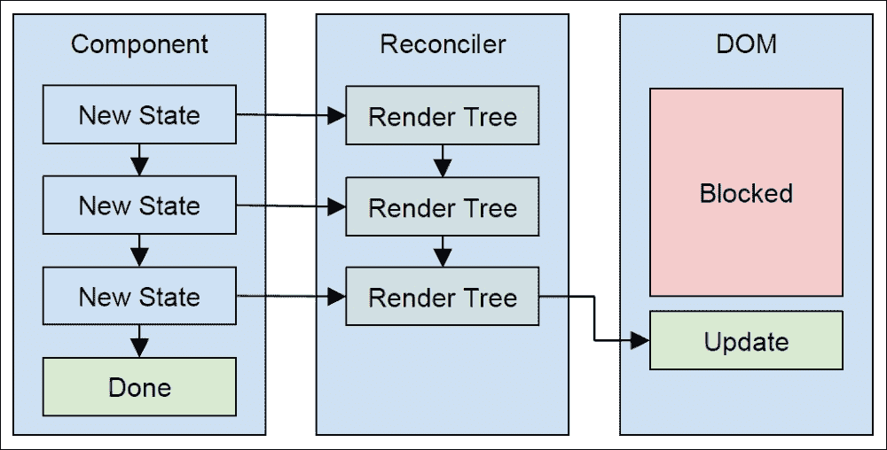
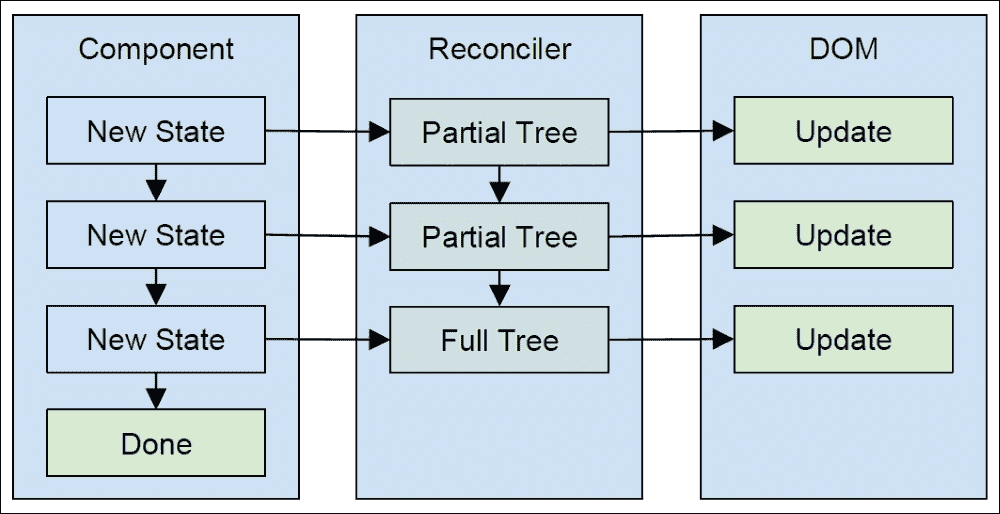

# 第一章 React 16 的新特性

React 16 的发布包含了足够重要的变化，值得专门撰写一章来讨论。这个特定的发布花了相对较长的时间来完成。这是因为协调内部——React 中负责高效渲染组件变化的部分——是从头开始重写的。兼容性是另一个因素：这次重写没有主要的破坏性 API 变化。

在本章中，您将了解 React 16 中引入的重大变化：

+   对协调内部所做的重大变化，以及对 React 项目的意义，未来的发展

+   通过设置错误边界将错误限制在应用程序的各个部分

+   创建渲染多个元素和渲染字符串的组件

+   渲染到门户

# 重新思考渲染

您不需要深入了解 React 协调内部的工作原理。这样会违背 React 的初衷，以及它如何为我们封装所有这些工作。然而，了解 React 16 中发生的重大内部变化的动机以及它们在更高层次上的工作方式，将有助于您思考如何最好地设计您的组件，无论是今天还是未来的 React 应用。

## 现状

React 已经确立自己作为选择帮助构建用户界面的库的标准之一。这其中的两个关键因素是它的简单性和性能。React 之所以简单，是因为它有一个小的 API 表面，易于上手和实验。React 之所以高性能，是因为它通过协调渲染树中的变化，最小化了需要调用的 DOM 操作数量。

这两个因素之间存在相互作用，这导致了 React 的飞速流行。如果 API 难以使用，React 提供的良好性能就不会有价值。React 的最大价值在于它简单易用，并且开箱即用性能良好。

随着 React 的广泛采用，人们意识到它的内部协调机制可以得到改进。例如，一些 React 应用程序更新组件状态的速度比渲染完成的速度更快。再举一个例子：对于渲染树的一部分的更改，如果在屏幕上看不到，那么它们的优先级应该比用户可以看到的元素低。这些问题足以降低用户体验，使其感觉不如可能的那样流畅。

如何在不破坏 API 和渲染树协调的情况下解决这些问题呢？

## 运行到完成

JavaScript 是单线程的，并且运行到完成。这意味着默认情况下，你运行的任何 JavaScript 代码都会阻止浏览器运行其他任务，比如绘制屏幕。这就是为什么 JavaScript 代码特别重要的原因。然而，在某些情况下，即使 React 协调代码的性能也无法掩盖用户的瓶颈。当面对一个新的树时，React 别无选择，只能阻止 DOM 更新和事件监听器，同时计算新的渲染树。

一个可能的解决方案是将协调工作分成更小的块，并安排它们以防止 JavaScript 运行到完成线程阻塞重要的 DOM 更新。这意味着协调器不必渲染完整的树，然后再次进行渲染，因为在第一次渲染时发生了事件。

让我们来看一个这个问题的视觉示例：



这个图表表明，当 React 组件中的状态发生变化时，直到渲染完成之前都不会发生其他任何事情。正如你所看到的，随着状态变化的不断堆积，协调整个树的成本会变得很高，与此同时，DOM 被阻止做任何事情。

协调渲染树与 JavaScript 的运行到完成语义是一致的。换句话说，React 不能暂停正在进行的工作来让 DOM 更新。现在让我们看看 React 16 如何试图改变前面的图表：



这个版本的 React 渲染/协调过程看起来与之前的版本相似。实际上，左侧组件的任何内容都没有改变——这反映了 React 16 中不变的 API。不过，有一些微妙但重要的区别。

让我们先看看协调器。它不是在每次组件状态改变时构建一个新的渲染树，而是渲染一个部分树。换句话说，它执行一部分工作，导致部分渲染树的创建。它不完成整个树的原因是为了让协调过程暂停，让任何 DOM 更新运行——你可以在图像的右侧看到 DOM 的差异。

当协调器恢复构建渲染树时，它首先检查是否自暂停以来发生了新的状态变化。如果是这样，它会获取部分完成的渲染树，并根据新的状态变化重复使用它可以的部分。然后，它继续进行，直到下一次暂停。最终，协调完成。在协调过程中，DOM 有机会响应事件并渲染任何未完成的更改。在 React 16 之前，这是不可能的——在整个树被渲染之前，DOM 中的任何事情都不会发生。

## 什么是 fiber？

为了将组件的渲染工作分解为更小的工作单元，React 创建了一个名为**fiber**的抽象。Fiber 代表可以暂停和恢复的渲染工作单元。它还具有其他低级属性，如优先级以及完成后应该返回到的 fiber 的输出位置。

React 16 在开发过程中的代号是 React Fiber，因为这个基本抽象使得调度整体渲染工作的片段，以提供更好的用户体验。React 16 标志着这种新的协调架构的初始发布，但它还没有完成。例如，一切仍然是同步的。

## 异步和未来

React 16 为下一个主要版本的异步渲染奠定了基础。这个功能没有包含在 React 16 中的主要原因是因为团队希望将基本的协调变化发布到公众中。还有一些其他需要发布的新功能，我们将在接下来的部分中介绍。 

一旦异步渲染功能引入到 React 中，您不应该修改任何代码。相反，您可能会注意到应用程序中某些区域的性能得到改善，这些区域将受益于优先和计划的渲染。

## 更好的组件错误处理

React 16 为组件引入了更好的错误处理能力。这个概念被称为**错误边界**，它被实现为一个生命周期方法，当任何子组件抛出异常时被调用。实现`componentDidCatch()`的父类就是错误边界。根据您的功能组织方式，您可以在应用程序中有不同的边界。

这种功能的动机是为应用程序提供从某些错误中恢复的机会。在 React 16 之前，如果组件抛出错误，整个应用程序将停止。这可能并不理想，特别是如果一个次要组件的问题导致关键组件停止工作。

让我们创建一个带有错误边界的`App`组件：

```jsx
class App extends Component {
  state = {}

  componentDidCatch(err) {
    this.setState({ err: err.message });
  }

  render() {
    return (<p><MyError err={this.state.err}/></p>);
  }
}
```

`App`组件除了渲染`MyError`之外什么也不做——一个故意抛出错误的组件。当这种情况发生时，`componentDidCatch()`方法将被调用，并将错误作为参数传递。然后，您可以使用这个值来改变组件的状态。在这个例子中，它将错误消息设置为`err`状态。然后，`App`将尝试重新渲染。

正如您所看到的，`this.state.err`被传递给`MyError`作为属性。在第一次渲染期间，这个值是未定义的。当`App`捕获到`MyError`抛出的错误时，错误将被传递回组件。现在让我们看看`MyError`：

```jsx
const MyError = (props) => {
  if (props.err) {
    return <b style={{color: 'red'}}>{props.err}</b>;
  }

  throw new Error('epic fail');
};
```

这个组件抛出一个带有消息'epic fail'的错误。当`App`捕获到这个错误时，它会使用一个`err`属性来渲染`MyError`。当这种情况发生时，它只是以红色呈现错误字符串。这恰好是我为这个应用程序选择的策略；在再次调用错误行为之前，始终检查错误状态。在`MyError`中，通过不执行`throw new Error('epic fail')`来第二次恢复整个应用程序。

使用`componentDidCatch()`，您可以自由地设置任何您喜欢的错误恢复策略。通常，您无法恢复失败的特定组件。

## 渲染多个元素和字符串

自 React 首次发布以来，规则是组件只能渲染一个元素。在 React 16 中有两个重要的变化。首先，您现在可以从组件返回一组元素。这简化了渲染兄弟元素会极大简化事情的情况。其次，您现在可以渲染纯文本内容。

这两个变化都导致页面上的元素减少。通过允许组件渲染兄弟元素，您不必为了返回单个元素而将它们包装起来。通过渲染字符串，您可以将测试内容作为子元素或另一个组件进行渲染，而无需将其包装在元素中。

以下是渲染多个元素的样子：

```jsx
const Multi = () => [
  'first sibling',
  'second sibling'
].map((v, i) => <p key={i}>{v}</p>);
```

请注意，您必须为集合中的元素提供一个`key`属性。现在让我们添加一个返回字符串值的元素：

```jsx
const Label = () => 'Name:';

const MultiWithString = () => [
  'first sibling',
  'second sibling'
].map((v, i) => <p key={i}><Label/> {v}</p>);
```

`Label`组件只是将一个字符串作为其渲染内容返回。`p`元素将`Label`作为子元素呈现，与`{v}`值相邻。当组件可以返回字符串时，您有更多选项来组合构成 UI 的元素。

## 呈现到门户

我想介绍的 React 16 的最终新功能是门户的概念。通常，组件的呈现输出放置在树中 JSX 元素所在的位置。然而，有时我们需要更大的控制权来决定组件的呈现输出最终放在哪里。例如，如果您想要在根 React 元素之外呈现组件怎么办？

门户允许组件在渲染时指定其容器元素。想象一下，您想在应用程序中显示通知。屏幕上不同位置的几个组件需要能够在屏幕上的一个特定位置呈现通知。让我们看看如何使用门户来定位元素：

```jsx
import React, { Component } from 'react';
import { createPortal } from 'react-dom';
class MyPortal extends Component {
  constructor(...args) {
    super(...args);
    this.el = document.createElement('strong');
  }

  componentWillMount() {
    document.body.appendChild(this.el);
  }

  componentWillUnmount() {
    document.body.removeChild(this.el);
  }

  render() {
    return createPortal(
      this.props.children,
      this.el
    );
  }
};
```

在这个组件的构造函数中，目标元素被创建并存储在`el`属性中。然后，在`componentWillMount()`中，该元素被附加到文档主体。实际上，您不需要在组件中创建目标元素——您可以使用现有元素。`componentWillUnmount()`方法会删除此元素。

在`render()`方法中，使用`createPortal()`函数创建门户。它接受两个参数——要呈现的内容和目标 DOM 元素。在这种情况下，它传递了其子属性。让我们看看`MyPortal`是如何使用的：

```jsx
class App extends Component {
  render() {
    return (
      <div>
        <p>Main content</p>
        <MyPortal>Bro, you just notified me!</MyPortal>
      </div>
    );
  }
}
```

最终的结果是传递给`MyPortal`的文本作为一个强元素呈现在根 React 元素之外。在使用门户之前，您必须采取某种命令式的解决方法才能使这样的事情起作用。现在，我们可以在需要的上下文中呈现通知——它只是碰巧被插入到 DOM 的其他位置以正确显示。

# 总结

本章的目标是向您介绍 React 16 的重大变化。值得注意的是，与之前的 React 版本几乎没有兼容性问题。这是因为大部分变化是内部的，不需要更改 API。还添加了一些新功能。

React 16 的头条是它的新协调内部。现在，协调工作被分解成更小的单元，而不是在组件改变状态时尝试协调所有内容。这些单元可以被优先处理、调度、暂停和恢复。在不久的将来，React 将充分利用这种新架构，并开始异步地渲染工作单元。

您还学会了如何在 React 组件中使用新的错误边界功能。使用错误边界可以让您从组件错误中恢复，而不会使整个应用程序崩溃。然后，您了解到 React 组件现在可以返回组件集合。就像渲染一组组件一样。现在您可以直接从组件中执行此操作。最后，您学会了如何使用门户将组件渲染到非标准位置。

在下一章中，您将学习如何构建响应式组件。
