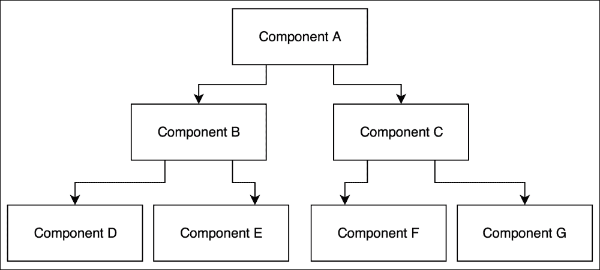

# 第四章：创建您的第一个 React 组件

在上一章中，您学习了如何创建 React 元素以及如何使用它们来渲染 HTML 标记。您看到使用 JSX 生成 React 元素是多么容易。在这一点上，您已经了解了足够多的关于 React 的知识，可以创建静态网页，我们在第三章中讨论了这一点，*创建您的第一个 React 元素*。然而，我敢打赌这不是您决定学习 React 的原因。您不只是想构建由静态 HTML 元素组成的网站。您想要构建对用户和服务器事件做出反应的交互式用户界面。对事件做出反应意味着什么？静态 HTML 元素如何**反应**？React 元素如何反应？在本章中，我们将回答这些问题以及许多其他问题，同时向 React 组件介绍自己。

# 无状态与有状态

反应意味着从一种状态切换到另一种状态。这意味着你需要首先有一个状态，以及改变该状态的能力。我们在 React 元素中提到了状态或改变状态的能力吗？没有。它们是无状态的。它们的唯一目的是构建和渲染虚拟 DOM 元素。事实上，我们希望它们以完全相同的方式渲染，只要我们为它们提供完全相同的参数。我们希望它们保持一致，因为这样可以方便我们理解它们。这是使用 React 的关键好处之一——方便我们理解我们的 Web 应用程序的工作原理。

我们如何向我们的无状态 React 元素添加状态？如果我们不能在 React 元素中封装状态，那么我们应该将 React 元素封装在已经具有状态的东西中。想象一个代表用户界面的简单状态机。每个用户操作都会触发该状态机中的状态变化。每个状态由不同的 React 元素表示。在 React 中，这个状态机被称为**React 组件**。

# 创建您的第一个无状态 React 组件

让我们看看如何创建一个 React 组件的以下示例：

```jsx
import React, { Component } from 'react';
import ReactDOM from 'react-dom';

class ReactClass extends Component {
  render () {
    return (
      <h1 className="header">React Component</h1>
    );
  }
}

const reactComponent = ReactDOM.render(
  <ReactClass/>,
  document.getElementById('react-application')
);
export default ReactClass;
```

之前的一些代码对你来说可能已经很熟悉了，其余部分可以分解为两个简单的步骤：

1.  创建一个 React 组件类。

1.  创建一个 React 组件。

让我们更仔细地看一下如何创建一个 React 组件：

1.  创建一个`ReactClass`类作为`Component`类的子类。在本章中，我们将重点学习如何更详细地创建 React 组件类。

1.  通过调用`ReactDOM.render()`函数并将我们的`ReactClass`元素作为其元素参数提供来创建`reactComponent`。

我强烈建议您阅读 Dan Abramov 的这篇博文，其中更详细地解释了 React 组件、元素和实例之间的区别：[`facebook.github.io/react/blog/2015/12/18/react-components-elements-and-instances.html`](https://facebook.github.io/react/blog/2015/12/18/react-components-elements-and-instances.html)

React 组件的外观和感觉在`ReactClass`中声明。

`Component`类封装了组件的状态并描述了组件的呈现方式。至少，React 组件类需要有一个`render()`方法，以便返回`null`或`false`。以下是一个最简单形式的`render()`方法的示例：

```jsx
class ReactClass extends Component {
  render() {
    return null;
  }
}
```

正如您可以猜到的，`render()`方法负责告诉 React 这个组件应该呈现什么。它可以返回`null`，就像前面的例子中一样，屏幕上将不会呈现任何内容。或者，它可以返回我们在第三章中学习如何创建的 JSX 元素，*创建您的第一个 React 元素*：

```jsx
class ReactClass extends Component {
  render() {
    return (
      <h1 className="header">React Component</h1>
    );
  }
}
```

这个例子展示了我们如何将 React 元素封装在 React 组件中。我们创建了一个带有`className`属性和一些文本作为其子元素的`h1`元素。然后，在调用`render()`方法时返回它。我们将 React 元素封装在 React 组件中的事实并不影响它的呈现方式：

```jsx
<h1 data-reactroot class="header">React Component</h1>
```

正如您所看到的，生成的 HTML 标记与我们在第三章中创建的标记相同，*创建您的第一个 React 元素*，而不使用 React 组件。在这种情况下，您可能会想知道，如果我们可以在没有它的情况下呈现完全相同的标记，那么拥有`render()`方法的好处是什么？

拥有`render()`方法的优势在于，与任何其他函数一样，在返回值之前，它可以选择返回什么值。到目前为止，您已经看到了两个`render()`方法的例子：一个返回`null`，另一个返回一个 React 元素。我们可以合并这两个并添加一个条件来决定要渲染什么：

```jsx
class ReactClass extends Component {
  render() {
    const componentState = {
      isHidden: true
    };

    if (componentState.isHidden) {
      return null;
    }

    return (
      <h1 className="header">React Component</h1>
    );
  }
}
```

在这个例子中，我们创建了`componentState`常量，它引用了一个具有单个`isHidden`属性的对象。这个对象充当我们的 React 组件的状态。如果我们想要隐藏我们的 React 组件，那么我们需要将`componentState.isHidden`的值设置为`true`，我们的`render`函数将返回`null`。在这种情况下，React 将不渲染任何内容。从逻辑上讲，将`componentState.isHidden`设置为`false`，将返回我们的 React 元素并渲染预期的 HTML 标记。您可能会问的问题是，我们如何将`componentState.isHidden`的值设置为`false`？或者设置为`true`？或者如何一般地改变它？

让我们想想我们可能想要改变状态的情况。其中之一是当用户与我们的用户界面交互时。另一个是当服务器发送数据时。或者，当一定时间过去后，现在我们想要渲染其他东西。我们的`render()`方法并不知道所有这些事件，也不应该知道，因为它的唯一目的是根据我们传递给它的数据返回一个 React 元素。我们如何将数据传递给它？

有两种方法可以使用 React API 将数据传递给`render()`方法：

+   `this.props`

+   `this.state`

在这里，`this.props`对您来说应该很熟悉。在第三章*创建您的第一个 React 元素*中，您学习了`React.createElement()`函数接受`props`参数。我们用它来传递属性给我们的 HTML 元素，但我们没有讨论发生了什么以及为什么传递给`props`对象的属性会被渲染。

您放入`props`对象并传递给 JSX 元素的任何数据都可以通过`this.props`在`render()`方法中访问。一旦您从`this.props`访问数据，您可以渲染它：

```jsx
class ReactClass extends Component {
  render() {
    const componentState = {
      isHidden: false
    };

    if (componentState.isHidden) {
      return null;
    }

    return (
      <h1 className="header">{this.props.header}</h1>
    );
  }
}
```

在这个例子中，我们在`render()`方法中使用`this.props`来访问`header`属性。然后，我们直接将`this.props.header`作为子元素传递给`h1 元素`。

在前面的例子中，我们可以将`isHidden`的值作为`this.props`对象的另一个属性传递：

```jsx
class ReactClass extends Component {
  render() {
    if (this.props.isHidden) {
      return null;
    }

    return (
      <h1 className="header">{this.props.header}</h1>
    );
  }
}
```

注意，在这个例子中，我们重复了两次`this.props`。一个`this.props`对象通常有我们想要在`render`方法中多次访问的属性。因此，我建议你首先解构`this.props`：

```jsx
class ReactClass extends Component {
  render() {
    const {
      isHidden,
      header
    } = this.props;

    if (isHidden) {
      return null;
    }

    return (
      <h1 className="header">{this.header}</h1>
    );
  }
}
```

你是否注意到在前面的例子中，我们不是将`isHidden`存储在`render()`方法中，而是通过`this.props`传递它？我们移除了我们的`componentState`对象，因为我们不需要在`render()`方法中担心组件的状态。`render()`方法不应该改变组件的状态或访问真实的 DOM，或以其他方式与 Web 浏览器交互。我们可能希望在服务器上渲染我们的 React 组件，在那里我们没有 Web 浏览器，并且我们应该期望`render()`方法在任何环境下都能产生相同的结果。

如果我们的`render()`方法不管理状态，那么我们如何管理它？我们如何设置状态，以及在处理 React 中的用户或浏览器事件时如何更新它？

在本章的前面，你学到了在 React 中，我们可以用 React 组件表示用户界面。有两种类型的 React 组件：

+   有一个状态

+   没有状态

等一下！我们不是说 React 组件是状态机吗？当然，每个状态机都需要有一个状态。你是对的，但是尽可能保持尽可能多的 React 组件无状态是一个好习惯。

React 组件是可组合的。因此，我们可以有一个 React 组件的层次结构。想象一下，我们有一个父 React 组件，它有两个子组件，每个子组件又有另外两个子组件。所有组件都是有状态的，它们可以管理自己的状态：



如果层次结构中顶部组件更新其状态，要弄清楚最后一个子组件将渲染什么，会有多容易？不容易。有一种设计模式可以消除这种不必要的复杂性。这个想法是通过两个关注点来分离你的组件：如何处理用户界面交互逻辑和如何渲染数据。

+   你的 React 组件中少数是有状态的。它们应该位于组件层次结构的顶部。它们封装了所有的交互逻辑，管理用户界面状态，并将该状态通过`props`传递到无状态组件的层次结构中。

+   你的 React 组件中大多数是无状态的。它们通过`this.props`接收其父组件的状态数据，并相应地渲染该数据。

在我们之前的例子中，我们通过`this.props`接收了`isHidden`状态数据，然后渲染了该数据。我们的组件是无状态的。

接下来，让我们创建我们的第一个有状态组件。

# 创建您的第一个有状态的 React 组件

有状态的组件是应用程序处理交互逻辑和管理状态的最合适的地方。它们使您更容易理解应用程序的工作原理。这种推理在构建可维护的 Web 应用程序中起着关键作用。

React 将组件的状态存储在`this.state`对象中。我们将`this.state`的初始值分配为`Component`类的公共类字段：

```jsx
class ReactClass extends React.Component {
  state = {
    isHidden: false
  };

  render() {
    const {
      isHidden
    } = this.state;

    if (isHidden) {
      return null;
    }

    return (
      <h1 className="header">React Component</h1>
    );
  }
}
```

现在，`{ isHidden: false }`是我们的 React 组件和用户界面的初始状态。请注意，在我们的`render()`方法中，我们现在从`this.state`而不是`this.props`中解构`isHidden`属性。

在本章的前面，您已经学习到我们可以通过`this.props`或`this.state`将数据传递给组件的`render()`函数。这两者之间有什么区别呢？

+   `this.props`：这存储了从父级传递的只读数据。它属于父级，不能被其子级更改。这些数据应被视为不可变的。

+   `this.state`：这存储了对组件私有的数据。它可以被组件更改。当状态更新时，组件将重新渲染自身。

如何更新组件的状态？您可以使用`setState(nextState, callback)`通知 React 状态变化。此函数接受两个参数：

+   代表下一个状态的`nextState`对象。它也可以是一个带有`function(prevState, props) => newState`签名的函数。此函数接受两个参数：先前的状态和属性，并返回表示新状态的对象。

+   `callback`函数，您很少需要使用，因为 React 会为您保持用户界面的更新。

React 如何保持用户界面的更新？每次更新组件的状态时，包括任何子组件，它都会调用组件的`render()`函数。实际上，每次调用我们的`render()`函数时，它都会重新渲染整个虚拟 DOM。

当您调用`this.setState()`函数并传递表示下一个状态的数据对象时，React 将将下一个状态与当前状态合并。在合并过程中，React 将用下一个状态覆盖当前状态。未被下一个状态覆盖的当前状态将成为下一个状态的一部分。

想象一下这是我们当前的状态：

```jsx
{
  isHidden: true,
  title: 'Stateful React Component'
}
```

我们调用`this.setState(nextState)`，其中`nextState`如下：

```jsx
{
  isHidden: false
}
```

React 将这两个状态合并为一个新的状态：

```jsx
{
  isHidden: false,
  title: 'Stateful React Component'
}
```

`isHidden`属性已更新，`title`属性未被删除或以任何方式更新。

现在我们知道如何更新我们组件的状态，让我们创建一个对用户事件做出反应的有状态组件：

在这个例子中，我们正在创建一个切换按钮，用于显示和隐藏标题。我们首先设置我们的初始状态对象。我们的初始状态有两个属性：`isHeaderHidden`设置为`false`，标题设置为`Stateful React Component`。现在，我们可以通过`this.state`在我们的`render()`方法中访问这个状态对象。在我们的`render()`方法中，我们创建三个 React 元素：`h1`，`button`和`div`。我们的`div`元素充当我们的`h1`和`button`元素的父元素。然而，在某种情况下，我们创建我们的`div`元素有两个子元素，`header`和`button`元素，而在另一种情况下，我们只创建一个子元素，`button`。我们选择的情况取决于`this.state.isHeaderHidden`的值。我们组件的当前状态直接影响`render()`函数将渲染什么。虽然这对您来说应该很熟悉，但在这个例子中有一些新的东西是我们以前没有见过的。

请注意，我们在组件类中添加了一个名为`handleClick()`的新方法。`handleClick()`方法对 React 没有特殊意义。它是我们应用逻辑的一部分，我们用它来处理`onClick`事件。您也可以向 React 组件类添加自定义方法，因为它只是一个 JavaScript 类。所有这些方法都将通过`this`引用可用，您可以在组件类中的任何方法中访问它。例如，我们在`render()`和`handleClick()`方法中都通过`this.state`访问状态对象。

我们的`handleClick()`方法做什么？它通过切换`isHeaderHidden`属性来更新我们组件的状态：

```jsx
this.setState(prevState => ({
  isHeaderHidden: !prevState.isHeaderHidden
}));
```

我们的`handleClick()`方法对用户与用户界面的交互做出反应。我们的用户界面是一个`button`元素，用户可以点击它，我们可以将事件处理程序附加到它上面。在 React 中，您可以通过将它们传递给 JSX 属性来将事件处理程序附加到组件上：

```jsx
<button onClick={this.handleClick}>
  Toggle Header
</button>
```

React 使用**驼峰命名**约定来命名事件处理程序，例如，`onClick`。您可以在[`facebook.github.io/react/docs/events.html#supported-events`](http://facebook.github.io/react/docs/events.html#supported-events)找到所有支持的事件列表。

默认情况下，React 在冒泡阶段触发事件处理程序，但您可以告诉 React 在捕获阶段触发它们，方法是在事件名称后附加`Capture`，例如`onClickCapture`。

React 将浏览器的原生事件封装到`SyntheticEvent`对象中，以确保所有支持的事件在 Internet Explorer 8 及以上版本中表现一致。

`SyntheticEvent`对象提供与原生浏览器事件相同的 API，这意味着您可以像往常一样使用`stopPropagation()`和`preventDefault()`方法。如果出于某种原因，您需要访问原生浏览器事件，那么可以通过`nativeEvent`属性来实现。

请注意，在上一个示例中，将`onClick`属性传递给我们的`createElement()`函数并不会在呈现的 HTML 标记中创建内联事件处理程序：

```jsx
<button class="btn btn-default">Toggle header</button>
```

这是因为 React 实际上并没有将事件处理程序附加到 DOM 节点本身。相反，React 在顶层监听所有事件，使用单个事件侦听器并将它们委托给它们适当的事件处理程序。

在上一个示例中，您学习了如何创建一个有状态的 React 组件，用户可以与之交互并更改其状态。我们创建并附加了一个事件处理程序到`click`事件，以更新`isHeaderHidden`属性的值。但您是否注意到用户交互不会更新我们在状态中存储的另一个属性`title`的值。这对您来说是否奇怪？我们的状态中有一些数据永远不会改变。这个观察引发了一个重要的问题；我们不应该将什么放在我们的状态中？

问问自己，“我可以从组件的状态中删除哪些数据，而仍然保持其用户界面始终更新？”继续问，继续删除数据，直到您绝对确定没有剩下任何要删除的东西，而不会破坏用户界面。

在我们的示例中，我们在状态对象中有`title`属性，我们可以将其移动到我们的`render()`方法中，而不会破坏我们的切换按钮的交互性。组件仍将按预期工作：

```jsx
class ReactClass extends Component {
  state = {
    isHeaderHidden: false
  }

  handleClick = () => {
    this.setState(prevState => ({
      isHeaderHidden: !prevState.isHeaderHidden
    }));
  }

  render() {
    const {
      isHeaderHidden
    } = this.state;

    if (isHeaderHidden) {
      return (
        <button
          className="btn ban-default"
          onClick={this.handleClick}
        >
          Toggle Header
        </button>
      );
    }

    return (
      <div>
        <h1 className="header">Stateful React Component</h1>
        <button
          className="btn ban-default"
          onClick={this.handleClick}
        >
          Toggle Header
        </button>
      </div>
    );
  }
}
```

另一方面，如果我们将`isHeaderHidden`属性移出状态对象，那么我们将破坏组件的交互性，因为我们的`render()`方法将不再被 React 自动触发，每当用户点击我们的按钮时。这是一个破坏交互性的例子。

```jsx
class ReactClass extends Component {
  state = {}
  isHeaderHidden = false

  handleClick = () => {
    this.isHeaderHidden = !this.isHeaderHidden;
  }

  render() {
    if (this.isHeaderHidden) {
      return (
        <button
          className="btn ban-default"
          onClick={this.handleClick}
        >
          Toggle Header
        </button>
      );
    }

    return (
      <div>
        <h1 className="header">Stateful React Component</h1>
        <button
          className="btn ban-default"
          onClick={this.handleClick}
        >
          Toggle Header
        </button>
      </div>
    );
  }
}
```

### 注意

**注意**：为了获得更好的输出结果，请参考代码文件。

这是一个反模式。

请记住这个经验法则：组件的状态应该存储组件的事件处理程序可能随时间改变的数据，以便重新渲染组件的用户界面并保持其最新状态。在`state`对象中保持组件状态的最小可能表示，并根据`state`和`props`中的内容在组件的`render()`方法中计算其余数据。利用 React 会在其状态改变时重新渲染组件的特性。

# 总结

在这一章中，您达到了一个重要的里程碑：您学会了如何封装状态并通过创建 React 组件来创建交互式用户界面。我们讨论了无状态和有状态的 React 组件以及它们之间的区别。我们谈到了浏览器事件以及如何在 React 中处理它们。

在下一章中，您将了解 React 16 中的新功能。
