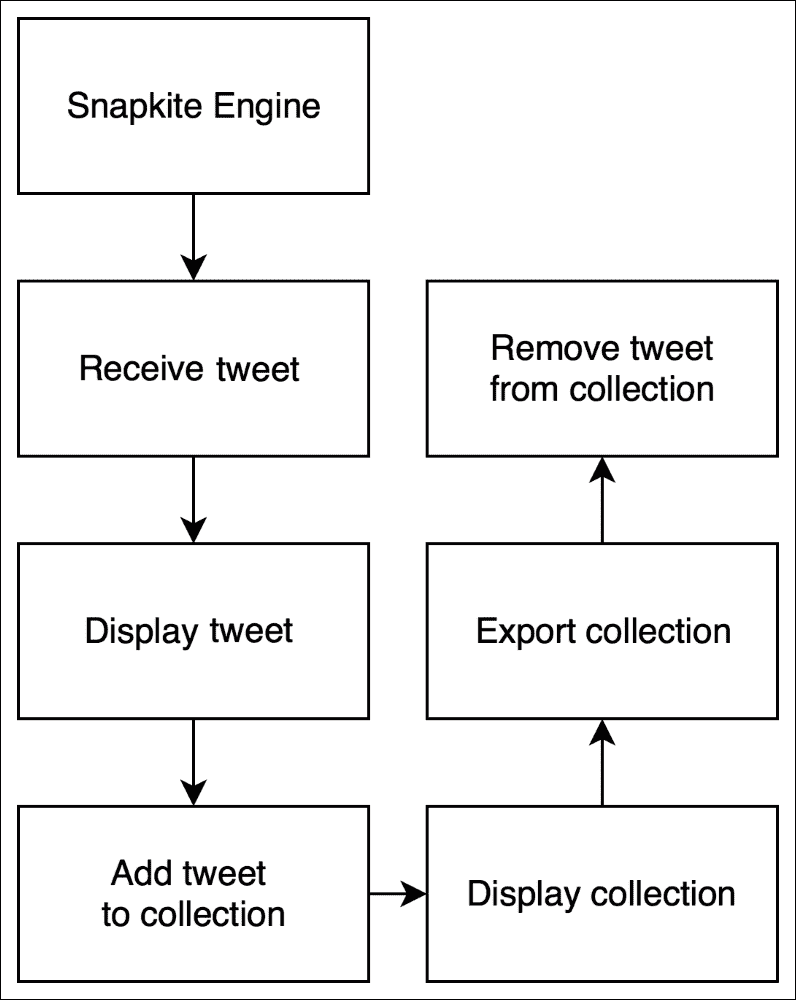
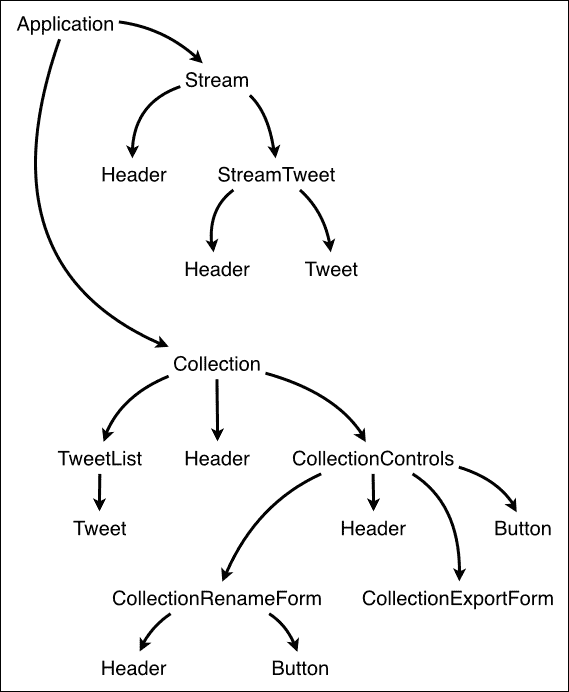
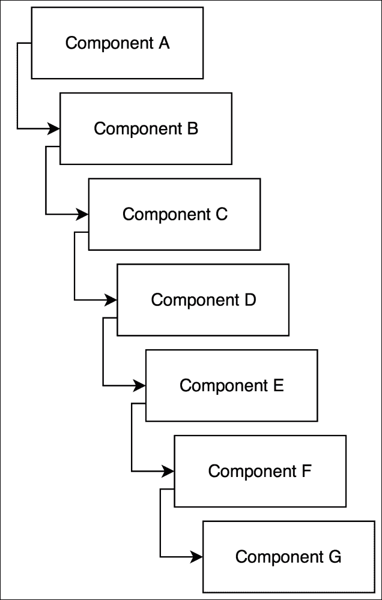

# 第五章：使您的 React 组件具有反应性

现在您知道如何创建具有状态和无状态的 React 组件，我们可以开始组合 React 组件并构建更复杂的用户界面。实际上，是时候开始构建我们在第二章中讨论的名为**Snapterest**的 Web 应用程序，*为您的项目安装强大的工具*。在此过程中，您将学习如何规划您的 React 应用程序并创建可组合的 React 组件。让我们开始吧。

# 使用 React 解决问题

在开始编写您的 Web 应用程序代码之前，您需要考虑您的 Web 应用程序将解决的问题。清晰地定义问题并尽早理解问题是通往成功解决方案——一个有用的 Web 应用程序的最重要步骤。如果您在开发过程中未能早期定义问题，或者定义不准确，那么以后您将不得不停下来，重新思考您正在做的事情，放弃您已经编写的一部分代码，并编写新的代码。这是一种浪费的方法，作为专业软件开发人员，您的时间对您和您的组织都非常宝贵，因此明智地投资时间符合您的最佳利益。在本书的前面，我强调了使用 React 的好处之一是代码重用，这意味着您将能够在更短的时间内做更多的事情。然而，在我们查看 React 代码之前，让我们首先讨论问题，牢记 React。

我们将构建 Snapterest——一个 Web 应用程序，以实时方式从 Snapkite Engine 服务器接收推文，并将它们一次显示给用户。实际上，我们并不知道 Snapterest 何时会收到新的推文，但是当它收到时，它将至少显示该新推文 1.5 秒，以便用户有足够的时间查看并单击它。单击推文将将其添加到现有推文集合中或创建一个新的推文集合。最后，用户将能够将其集合导出为 HTML 标记代码。

这是我们将要构建的内容的一个非常高层次的描述。让我们将其分解为一系列较小的任务列表：



以下是步骤：

1.  实时从 Snapkite Engine 服务器接收推文。

1.  一次显示一条推文，持续至少 1.5 秒。

1.  在用户点击事件发生时，将推文添加到集合中。

1.  在集合中显示推文列表。

1.  为集合创建 HTML 标记代码并导出它。

1.  从集合中删除推文，当用户点击事件发生时。

您能否确定哪些任务可以使用 React 解决？请记住，React 是一个用户界面库，因此任何描述用户界面和与用户界面交互的内容都可以用 React 解决。在前面的列表中，React 可以处理除第一个任务之外的所有任务，因为它描述的是数据获取而不是用户界面。第一步将使用我们将在下一章讨论的另一个库来解决。第 2 步和第 4 步描述了需要显示的内容。它们是 React 组件的完美候选者。第 3 步和第 6 步描述了用户事件，正如我们在第四章中所看到的，用户事件处理也可以封装在 React 组件中。您能想到如何使用 React 解决第 5 步吗？请记住，在第三章中，我们讨论了`ReactDOMServer.renderToStaticMarkup()`方法，该方法将 React 元素呈现为静态 HTML 标记字符串。这正是我们需要解决第 5 步的方法。

现在，当我们已经为每个单独的任务确定了潜在的解决方案时，让我们考虑如何将它们组合在一起，创建一个完全功能的 Web 应用程序。

构建可组合的 React 应用程序有两种方法：

+   首先，您可以开始构建单独的 React 组件，然后将它们组合成更高级别的 React 组件，沿着组件层次结构向上移动

+   您可以从最顶层的 React 元素开始，然后实现其子组件，沿着组件层次结构向下移动

第二种策略有一个优势，可以看到和理解应用程序架构的整体情况，我认为在我们考虑如何实现各个功能部分之前，了解一切是如何组合在一起的很重要。

# 规划您的 React 应用程序

在规划您的 React 应用程序时，有两个简单的准则需要遵循：

+   每个 React 组件应该代表 Web 应用程序中的单个用户界面元素。它应该封装可能被重用的最小元素。

+   多个 React 组件应该组合成一个单独的 React 组件。最终，您的整个用户界面应该封装在一个 React 组件中。



我们的 React 组件层次结构图

我们将从我们最顶层的 React 组件**Application**开始。它将封装我们整个的 React 应用程序，并且它将有两个子组件：**Stream**和**Collection**组件。**Stream**组件将负责连接到一系列 tweets，接收并显示最新的 tweet。**Stream**组件将有两个子组件：**StreamTweet**和**Header**。**StreamTweet**组件将负责显示最新的 tweet。它将由**Header**和**Tweet**组件组成。**Header**组件将渲染一个标题。它将没有子组件。**Tweet**组件将渲染一条 tweet 的图片。请注意我们计划重复使用**Header**组件两次。

**Collection**组件将负责显示集合控件和一系列 tweets。它将有两个子组件：**CollectionControls**和**TweetList**。**CollectionControls**组件将有两个子组件：**CollectionRenameForm**组件，它将渲染一个重命名集合的表单，以及**CollectionExportForm**组件，它将渲染一个将集合导出到名为**CodePen**的服务的表单，这是一个 HTML、CSS 和 JavaScript 的游乐场网站。您可以在[`codepen.io`](http://codepen.io)了解更多关于 CodePen 的信息。正如您可能已经注意到的，我们将在**CollectionRenameForm**和**CollectionControls**组件中重用**Header**和**Button**组件。我们的**TweetList**组件将渲染一系列 tweets。每条 tweet 将由一个**Tweet**组件渲染。事实上，总共我们将在**Collection**组件中再次重用**Header**组件。事实上，总共我们将在**Collection**组件中再次重用**Header**组件五次。这对我们来说是一个胜利。正如我们在前一章讨论的那样，我们应该尽可能地保持尽可能多的 React 组件无状态。因此，只有 11 个组件中的 5 个将存储状态，它们分别是：

+   **Application**

+   **CollectionControls**

+   **CollectionRenameForm**

+   **流**

+   **StreamTweet**

现在我们有了一个计划，我们可以开始实施它。

# 创建一个容器 React 组件

让我们从编辑我们应用的主 JavaScript 文件开始。用以下代码片段替换`~/snapterest/source/app.js`文件的内容：

```jsx
import React from 'react';
import ReactDOM from 'react-dom';
import Application from './components/Application';

ReactDOM.render(
  <Application />,
  document.getElementById('react-application')
);
```

这个文件只有四行代码，你可以猜到，它们提供了`document.getElementById('react-application')`作为`<Application/>`组件的部署目标，并将`<Application/>`渲染到 DOM 中。我们的 Web 应用程序的整个用户界面将被封装在一个 React 组件`Application`中。

接下来，导航到`~/snapterest/source/components/`并在这个目录中创建`Application.js`文件：

```jsx
import React, { Component } from 'react';
import Stream from './Stream';
import Collection from './Collection';

class Application extends Component {
  state = {
    collectionTweets: {}
  }

  addTweetToCollection = (tweet) => {
    const { collectionTweets } = this.state;

    collectionTweets[tweet.id] = tweet;

    this.setState({
      collectionTweets: collectionTweets
    });
  }

  removeTweetFromCollection = (tweet) => {
    const { collectionTweets } = this.state;

    delete collectionTweets[tweet.id];

    this.setState({
      collectionTweets: collectionTweets
    });
  }

  removeAllTweetsFromCollection = () => {
    this.setState({
      collectionTweets: {}
    });
  }

  render() {
    const {
      addTweetToCollection,
      removeTweetFromCollection,
      removeAllTweetsFromCollection
    } = this;

    return (
      <div className="container-fluid">
        <div className="row">
          <div className="col-md-4 text-center">
            <Stream onAddTweetToCollection={addTweetToCollection}/>
          </div>
          <div className="col-md-8">
            <Collection
              tweets={this.state.collectionTweets}
              onRemoveTweetFromCollection={removeTweetFromCollection}
              onRemoveAllTweetsFromCollection={removeAllTweetsFromCollection}
            />
          </div>
        </div>
      </div>
    );
  }
}

export default Application;
```

这个组件的代码比我们的`app.js`文件要多得多，但这段代码可以很容易地分成三个逻辑部分：

+   导入依赖模块

+   定义一个 React 组件类

+   将 React 组件类作为模块导出

在`Application.js`文件的第一个逻辑部分中，我们使用`require()`函数导入了依赖模块：

```jsx
import React, { Component } from 'react';
import Stream from './Stream';
import Collection from './Collection';
```

我们的`Application`组件将有两个子组件，我们需要导入它们：

+   `Stream`组件将渲染我们用户界面的流部分

+   `Collection`组件将渲染我们用户界面的收藏部分

我们还需要将`React`库作为另一个模块导入。

`Application.js`文件的第二个逻辑部分创建了 React`Application`组件类，并包含以下方法：

+   `addTweetToCollection()`

+   `removeTweetFromCollection()`

+   `removeAllTweetsFromCollection()`

+   `render()`

只有`render()`方法是 React API 的一部分。所有其他方法都是我们应用逻辑的一部分，这个组件封装了这些方法。我们将在讨论这个组件在`render()`方法中渲染的内容之后更仔细地看一下每一个方法：

```jsx
render() {
  const {
    addTweetToCollection,
    removeTweetFromCollection,
    removeAllTweetsFromCollection
  } = this;

  return (
    <div className="container-fluid">
      <div className="row">
        <div className="col-md-4 text-center">
          <Stream onAddTweetToCollection={addTweetToCollection}/>
        </div>
        <div className="col-md-8">
          <Collection
            tweets={this.state.collectionTweets}
            onRemoveTweetFromCollection={removeTweetFromCollection}
            onRemoveAllTweetsFromCollection={removeAllTweetsFromCollection}
          />
        </div>
      </div>
    </div>
  );
}
```

如你所见，它使用 Bootstrap 框架定义了我们网页的布局。如果你不熟悉 Bootstrap，我强烈建议你访问[`getbootstrap.com`](http://getbootstrap.com)并阅读文档。学习这个框架将使你能够快速轻松地原型化用户界面。即使你不懂 Bootstrap，也很容易理解发生了什么。我们将网页分成两列：一个较小的列和一个较大的列。较小的列包含我们的`Stream` React 组件，较大的列包含我们的`Collection`组件。你可以想象我们的网页被分成了两个不等的部分，它们都包含了 React 组件。

这就是我们如何使用我们的`Stream`组件：

```jsx
<Stream onAddTweetToCollection={addTweetToCollection} />
```

`Stream`组件有一个`onAddTweetToCollection`属性，我们的`Application`组件将自己的`addTweetToCollection()`方法作为这个属性的值传递。`addTweetToCollection()`方法将一条推文添加到集合中。这是我们在`Application`组件中定义的自定义方法之一。我们不需要使用`this`关键字，因为该方法被定义为箭头函数，所以函数的作用域自动成为我们的组件。

让我们看看`addTweetToCollection()`方法做了什么：

```jsx
addTweetToCollection = (tweet) => {
  const { collectionTweets } = this.state;

  collectionTweets[tweet.id] = tweet;

  this.setState({
    collectionTweets: collectionTweets
  });
}
```

该方法引用存储在当前状态中的集合推文，将新推文添加到`collectionTweets`对象，并通过调用`setState()`方法更新状态。当在`Stream`组件内部调用`addTweetToCollection()`方法时，会传递一个新推文作为参数。这是子组件如何更新其父组件状态的一个例子。

这是 React 中的一个重要机制，它的工作方式如下：

1.  父组件将回调函数作为属性传递给其子组件。子组件可以通过`this.props`引用访问这个回调函数。

1.  每当子组件想要更新父组件的状态时，它调用该回调函数并将所有必要的数据传递给新的父组件状态。

1.  父组件更新其状态，正如你已经知道的，这个状态更新并触发`render()`方法，根据需要重新渲染所有子组件。

这就是子组件与父组件交互的方式。这种交互允许子组件将应用程序的状态管理委托给其父组件，并且只关注如何渲染自身。现在当你学会了这种模式，你会一遍又一遍地使用它，因为大多数 React 组件应该保持无状态。只有少数父组件应该存储和管理应用程序的状态。这种最佳实践允许我们通过两种不同的关注点逻辑地对 React 组件进行分组：

+   管理应用程序的状态并渲染它

+   只渲染并将应用程序的状态管理委托给父组件

我们的`Application`组件有一个第二个子组件，`Collection`：

```jsx
<Collection
  tweets={this.state.collectionTweets}
  onRemoveTweetFromCollection={removeTweetFromCollection}
  onRemoveAllTweetsFromCollection={removeAllTweetsFromCollection}
/>
```

这个组件有一些属性：

+   `tweets`：这指的是我们当前的推文集合

+   `onRemoveTweetFromCollection`：这是指从我们的收藏中删除特定推文的函数

+   `onRemoveAllTweetsFromCollection`：这是指从我们的收藏中删除所有推文的函数

你可以看到 `Collection` 组件的属性只关心如何执行以下操作：

+   访问应用程序的状态

+   改变应用程序的状态

可以猜到，`onRemoveTweetFromCollection` 和 `onRemoveAllTweetsFromCollection` 函数允许 `Collection` 组件改变 `Application` 组件的状态。另一方面，`tweets` 属性将 `Application` 组件的状态传播到 `Collection` 组件，以便它可以以只读方式访问该状态。

你能认识到 `Application` 和 `Collection` 组件之间数据流的单向性吗？它是如何工作的：

1.  `collectionTweets` 数据在 `Application` 组件的 `constructor()` 方法中初始化。

1.  `collectionTweets` 数据作为 `tweets` 属性传递给 `Collection` 组件。

1.  `Collection` 组件调用 `removeTweetFromCollection` 和 `removeAllTweetsFromCollection` 函数来更新 `Application` 组件中的 `collectionTweets` 数据，然后循环再次开始。

请注意，`Collection` 组件不能直接改变 `Application` 组件的状态。`Collection` 组件通过 `this.props` 对象只能以只读方式访问该状态，并且更新父组件状态的唯一方法是调用父组件传递的回调函数。在 `Collection` 组件中，这些回调函数是 `this.props.onRemoveTweetFromCollection` 和 `this.props.onRemoveAllTweetsFromCollection`。

我们 React 组件层次结构中数据流的简单心智模型将帮助我们增加所使用的组件数量，而不增加用户界面工作方式的复杂性。例如，它可以有多达 10 层嵌套的 React 组件，如下所示：



如果`Component G`想要改变根`Component A`的状态，它会以与`Component B`或`Component F`或此层次结构中的任何其他组件完全相同的方式来做。但是，在 React 中，您不应该直接将数据从`Component A`传递给`Component G`。相反，您应该首先将其传递给`Component B`，然后传递给`Component C`，然后传递给`Component D`，依此类推，直到最终到达`Component G`。`Component B`到`Component F`将不得不携带一些实际上只是为`Component G`准备的“中转”属性。这可能看起来像是浪费时间，但这种设计使我们能够轻松调试我们的应用程序并推理出其工作原理。始终有优化应用程序架构的策略。其中之一是使用**Flux 设计模式**。另一个是使用**Redux**库。我们将在本书的后面讨论这两种方法。

在我们结束讨论`Application`组件之前，让我们看一下改变其状态的两种方法：

```jsx
removeTweetFromCollection = (tweet) => {
  const { collectionTweets } = this.state;

  delete collectionTweets[tweet.id];

  this.setState({
     collectionTweets: collectionTweets
  });
}
```

`removeTweetFromCollection（）`方法从我们存储在`Application`组件状态中的 tweet 集合中删除一个 tweet。它从组件状态中获取当前的`collectionTweets`对象，从该对象中删除具有给定`id`的 tweet，并使用更新后的`collectionTweets`对象更新组件状态。

另一方面，`removeAllTweetsFromCollection（）`方法从组件状态中删除所有 tweet：

```jsx
removeAllTweetsFromCollection = () => {
  this.setState({
    collectionTweets: {}
  });
}
```

这两种方法都是从子`Collection`组件中调用的，因为该组件没有其他方法可以改变`Application`组件的状态。

# 摘要

在本章中，您学会了如何使用 React 解决问题。我们首先将问题分解为较小的单独问题，然后讨论如何使用 React 来解决这些问题。然后，我们创建了一个需要实现的 React 组件列表。最后，我们创建了我们的第一个可组合的 React 组件，并了解了父组件如何与其子组件交互。

在下一章中，我们将实现我们的子组件，并了解 React 的生命周期方法。
