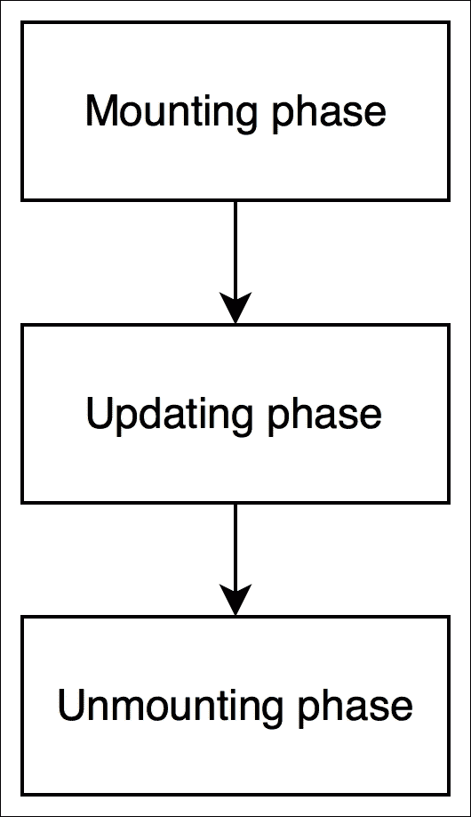

# 第六章。使用 React 组件与另一个库

React 是一个用于构建用户界面的优秀库。如果我们想将其与负责接收数据的另一个库集成呢？在上一章中，我们概述了我们的 Snapterest web 应用程序应该能够执行的五项任务。我们决定其中四项与用户界面有关，但其中一项完全是关于接收数据的：实时从 Snapkite Engine 服务器接收推文。

在本章中，您将学习如何将 React 与外部 JavaScript 库集成，以及 React 组件生命周期方法是什么，同时解决接收数据的重要任务。

# 在您的 React 组件中使用另一个库

正如我们在本书前面讨论过的，我们的 Snapterest web 应用程序将消费实时推文流。在第二章中，*为您的项目安装强大的工具*，您安装了**Snapkite Engine**库，该库连接到 Twitter 流 API，过滤传入的推文，并将它们发送到我们的客户端应用程序。反过来，我们的客户端应用程序需要一种连接到该实时流并监听新推文的方法。

幸运的是，我们不需要自己实现这个功能，因为我们可以重用另一个 Snapkite 模块叫做 `snapkite-stream-client`。让我们安装这个模块:

1.  导航到 `~/snapterest` 目录并运行以下命令:

```jsx
**npm install --save snapkite-stream-client**

```

1.  这将安装 `snapkite-stream-client` 模块，并将其添加到 `package.json` 作为一个依赖项。

1.  现在我们已经准备好在我们的一个 React 组件中重用 `snapkite-stream-client` 模块了。

在上一章中，我们创建了 `Application` 组件，其中包含两个子组件：`Stream` 和 `Collection`。在本章中，我们将创建我们的 `Stream` 组件。

让我们首先创建 `~/snapterest/source/components/Stream.js` 文件:

```jsx
import React, { Component } from 'react';
import SnapkiteStreamClient from 'snapkite-stream-client';
import StreamTweet from './StreamTweet';
import Header from './Header.react';

class Stream extends Component {
  state = {
    tweet: null
  }

  componentDidMount() {
    SnapkiteStreamClient.initializeStream(this.handleNewTweet);
  }

  componentWillUnmount() {
    SnapkiteStreamClient.destroyStream();
  }

  handleNewTweet = (tweet) => {
    this.setState({
      tweet: tweet
    });
  }

  render() {
    const { tweet } = this.state;
    const { onAddTweetToCollection } = this.props; 
    const headerText = 'Waiting for public photos from Twitter...';

    if (tweet) {
      return (
        <StreamTweet
          tweet={tweet}
           onAddTweetToCollection={onAddTweetToCollection}
        />
      );
    }

    return (
      <Header text={headerText}/>
    );
  }
}

export default Stream;
```

首先，我们将导入我们的 `Stream` 组件依赖的以下模块:

+   `React` 和 `ReactDOM`: 这是 React 库的一部分

+   `StreamTweet` 和 `Header`: 这些是 React 组件

+   `snapkite-stream-client`: 这是一个实用库

然后，我们将定义我们的 React 组件。让我们来看看我们的 `Stream` 组件实现了哪些方法:

+   `componentDidMount()`

+   `componentWillUnmount()`

+   `handleNewTweet()`

+   `render()`

我们已经熟悉了 `render()` 方法。`render()` 方法是 React API 的一部分。你已经知道任何 React 组件都必须实现至少 `render()` 方法。让我们来看看我们的 `Stream` 组件的 `render()` 方法：

```jsx
render() {
  const { tweet } = this.state;
  const { onAddTweetToCollection } = this.props;
  const headerText = 'Waiting for public photos from Twitter...';

  if (tweet) {
    return (
      <StreamTweet
        tweet={tweet}
        onAddTweetToCollection={onAddTweetToCollection}
      />
    );
  }

  return (
    <Header text={headerText}/>
  );
}
```

正如你所看到的，我们创建了一个新的 `tweet` 常量，引用了组件状态对象的 `tweet` 属性。然后我们将检查该变量是否引用了一个实际的 `tweet` 对象，如果是，我们的 `render()` 方法将返回 `StreamTweet` 组件，否则返回 `Header` 组件。

`StreamTweet` 组件渲染了一个标题和来自流的最新推文，而 `Header` 组件只渲染了一个标题。

你是否注意到我们的 `Stream` 组件本身并不渲染任何东西，而是返回另外两个实际进行渲染的组件之一？`Stream` 组件的目的是封装我们应用的逻辑，并将渲染委托给其他 React 组件。在 React 中，你应该至少有一个组件来封装你应用的逻辑，并存储和管理你应用的状态。这通常是你组件层次结构中的根组件或高级组件之一。所有其他子 React 组件应尽可能不具有状态。如果你将所有的 React 组件都视为 `Views`，那么我们的 `Stream` 组件就是一个 `ControllerView` 组件。

我们的 `Stream` 组件将接收一个无尽的新推文流，并且需要在每次接收到新推文时重新渲染其子组件。为了实现这一点，我们需要将当前推文存储在组件的状态中。一旦我们更新了它的状态，React 将调用它的 `render()` 方法并重新渲染所有的子组件。为此，我们将实现 `handleNewTweet()` 方法：

```jsx
handleNewTweet = (tweet) => {
  this.setState({
    tweet: tweet
  });
}
```

`handleNewTweet()` 方法接受一个 `tweet` 对象，并将其设置为组件状态的 `tweet` 属性的新值。

新的推文是从哪里来的，什么时候来的？让我们来看看我们的 `componentDidMount()` 方法：

```jsx
componentDidMount() {
  SnapkiteStreamClient.initializeStream(this.handleNewTweet);
}
```

该方法调用 `SnapkiteStreamClient` 对象的 `initializeStream()` 属性，并将 `this.handleNewTweet` 回调函数作为其参数传递。`SnapkiteStreamClient` 是一个外部库，具有我们用来初始化推文流的 API。`this.handleNewTweet` 方法将被调用以处理 `SnapkiteStreamClient` 接收到的每条新推文。

为什么我们将这个方法命名为`componentDidMount()`？其实不是我们命名的，是 React 命名的。事实上，`componentDidMount()`方法是 React API 的一部分。它只被调用一次，在 React 完成组件的初始渲染后立即调用。此时，React 已经创建了一个 DOM 树，由我们的组件表示，现在我们可以使用另一个 JavaScript 库访问该 DOM。

`componentDidMount()`库是将 React 与另一个 JavaScript 库集成的完美场所。这是我们使用外部`SnapkiteStreamClient`库连接到推文流的地方。

现在我们知道了在 React 组件中初始化外部 JavaScript 库的时机，但是反过来呢——我们应该在什么时候取消初始化并清理掉在`componentDidMount()`方法中所做的一切呢？在卸载组件之前清理一切是个好主意。为此，React API 为我们提供了另一个组件生命周期方法——`componentWillUnmount()`：

```jsx
componentWillUnmount() {
  SnapkiteStreamClient.destroyStream();
}
```

`componentWillUnmount()`方法在 React 卸载组件之前被调用。正如你在`componentWillUnmount()`方法中所看到的，你正在调用`SnapkiteStreamClient`对象的`destroyStream()`属性。`destroyStream()`属性清理了我们与`SnapkiteStreamClient`的连接，我们可以安全地卸载我们的`Stream`组件。

你可能想知道组件的生命周期方法是什么，以及为什么我们需要它们。

# 了解 React 组件的生命周期方法

想想 React 组件是做什么的？它描述了要渲染什么。我们知道它使用`render()`方法来实现这一点。然而，有时仅有`render()`方法是不够的，因为如果我们想在组件渲染之前或之后做一些事情怎么办？如果我们想决定是否应该调用组件的`render()`方法呢？

看起来我们描述的是 React 组件被渲染的过程。这个过程有各种阶段，例如在渲染之前，渲染和渲染之后。在 React 中，这个过程被称为**组件的生命周期**。每个 React 组件都经历这个过程。我们想要的是一种方法来连接到这个过程，并在这个过程的不同阶段调用我们自己的函数，以便更好地控制它。为此，React 提供了一些方法，我们可以使用这些方法在组件的生命周期过程的不同阶段得到通知。这些方法被称为**组件的生命周期方法**。它们按照可预测的顺序被调用。

所有 React 组件的生命周期方法可以分为三个阶段：

+   **挂载**：当组件被插入 DOM 时发生

+   **更新**：当组件被重新渲染到虚拟 DOM 中以确定实际 DOM 是否需要更新时发生

+   **卸载**：当组件被从 DOM 中移除时发生：



在 React 的术语中，将组件插入 DOM 称为"挂载"，而将组件从 DOM 中移除称为"卸载"。

了解 React 组件的生命周期方法最好的方法是看它们在实际中的应用。让我们创建我们在本章前面讨论过的`StreamTweet`组件。这个组件将实现大部分 React 的生命周期方法。

导航到`~/snapterest/source/components/`并创建`StreamTweet.js`文件：

```jsx
import React, { Component } from 'react';
import Header from './Header';
import Tweet from './Tweet';

class StreamTweet extends Component {

  // define other component lifecycle methods here

  render() {
    console.log('[Snapterest] StreamTweet: Running render()');

    const { headerText } = this.state;
    const { tweet, onAddTweetToCollection } = this.props;

    return (
      <section>
        <Header text={headerText} />
        <Tweet
          tweet={tweet}
          onImageClick={onAddTweetToCollection}
        />
      </section>
    );
  }
}

export default StreamTweet;
```

正如你所看到的，`StreamTweet`组件除了`render()`之外还没有生命周期方法。随着我们的进展，我们将逐一创建并讨论它们。

这四种方法在组件的*挂载*阶段被调用，如下图所示：


正如你从前面的图中所看到的，被调用的方法如下：

+   构造函数()

+   componentWillMount()

+   render()

+   componentDidMount()

在本章中，我们将讨论这四种方法中的两种（除了`render()`）。它们在组件插入 DOM 时只被调用一次。让我们更仔细地看看每一个。

## 挂载方法

现在让我们看一些有用的挂载方法。

### componentWillMount 方法

`componentWillMount()`方法被第二次调用。它在 React 将组件插入 DOM 之前*立即*调用。在您的`StreamTweet`组件的`constructor()`方法之后立即添加此代码：

```jsx
componentWillMount() {
  console.log('[Snapterest] StreamTweet: 1\. Running componentWillMount()');

  this.setState({
    numberOfCharactersIsIncreasing: true,
    headerText: 'Latest public photo from Twitter'
  });

  window.snapterest = {
    numberOfReceivedTweets: 1,
    numberOfDisplayedTweets: 1
  };
}
```

在此方法中，我们做了许多事情。首先，我们记录了调用此方法的事实。实际上，为了演示目的，我们将记录此组件的每个生命周期方法。当您在 Web 浏览器中运行此代码时，应该能够打开 JavaScript 控制台，并看到这些日志消息按预期的升序打印出来。

接下来，我们使用`this.setState()`方法更新组件的状态：

+   将`numberOfCharactersIsIncreasing`属性设置为`true`

+   将`headerText`属性设置为“来自 Twitter 的最新公共照片”

因为这是此组件将呈现的第一条推文，我们知道字符数肯定是从零增加到第一条推文中的字符数。因此，我们将其设置为`true`。我们还将默认文本分配给我们的标题，“来自 Twitter 的最新公共照片”。

如您所知，调用`this.setState()`方法应该触发组件的`render()`方法，因此在组件的挂载阶段似乎会调用两次`render()`。但是，在这种情况下，React 知道尚未呈现任何内容，因此它只会调用一次`render()`方法。

最后，在此方法中，我们使用以下两个属性定义了一个`snapterest`全局对象：

+   接收到的推文数量：此属性计算所有接收到的推文的数量

+   `numberOfDisplayedTweets`：此属性计算仅显示的推文的数量

我们将`numberOfReceivedTweets`设置为`1`，因为我们知道`componentWillMount()`方法仅在接收到第一条推文时调用一次。我们还知道我们的`render()`方法将为这条第一条推文调用，因此我们也将`numberOfDisplayedTweets`设置为`1`：

```jsx
window.snapterest = {
  numberOfReceivedTweets: 1,
  numberOfDisplayedTweets: 1
};
```

这个全局对象不是 React 或我们的 Web 应用程序逻辑的一部分；我们可以删除它，一切仍将按预期工作。在前面的代码中，`window.snapterest`是一个方便的工具，用于跟踪我们在任何时间点处理了多少推文。我们仅出于演示目的使用全局`window.snapterest`对象。我强烈建议您不要在实际项目中向全局对象添加自己的属性，因为您可能会覆盖现有属性，和/或您的属性可能会被稍后由您不拥有的其他 JavaScript 代码覆盖。稍后，如果您决定将 Snapterest 部署到生产环境中，请确保删除全局`window.snapterest`对象以及与`StreamTweet`组件相关的代码。

在网络浏览器中查看 Snapterest 几分钟后，您可以打开 JavaScript 控制台并输入`snapterest.numberOfReceivedTweets`和`snapterest.numberOfDisplayedTweets`命令。这些命令将输出数字，帮助您更好地了解新推文的到达速度以及有多少推文未被显示。在我们的下一个组件生命周期方法中，我们将向`window.snapterest`对象添加更多属性。

### componentDidMount 方法

`componentDidMount()`方法在 React 将组件插入 DOM 后*立即*调用。更新后的 DOM 现在可以访问，这意味着这个方法是初始化其他需要访问该 DOM 的 JavaScript 库的最佳位置。

在本章的早些时候，我们使用了`componentDidMount()`方法创建了我们的`Stream`组件，该方法初始化了外部的`snapkite-stream-client` JavaScript 库。

让我们来看看这个组件的`componentDidMount()`方法。在`componentWillMount()`方法之后，向您的`StreamTweet`组件添加以下代码：

```jsx
componentDidMount = () => {
  console.log('[Snapterest] StreamTweet: 3\. Running componentDidMount()');

  const componentDOMRepresentation = ReactDOM.findDOMNode(this);

  window.snapterest.headerHtml = componentDOMRepresentation.children[0].outerHTML;
  window.snapterest.tweetHtml = componentDOMRepresentation.children[1].outerHTML;
}
```

在这里，我们使用`ReactDOM.findDOMNode()`方法引用表示我们的`StreamTweet`组件的 DOM。我们传递`this`参数，引用当前组件（在本例中为`StreamTweet`）。`componentDOMRepresentation`常量引用了我们可以遍历的 DOM 树，从而访问其各种属性。为了更好地了解这个 DOM 树的样子，让我们更仔细地看一下我们的`StreamTweet`组件的`render()`方法：

```jsx
render() {
  console.log('[Snapterest] StreamTweet: Running render()');

  const { headerText } = this.state;
  const { tweet, onAddTweetToCollection } = this.props;

  return (
    <section>
      <Header text={headerText} />
      <Tweet
        tweet={tweet}
        onImageClick={onAddTweetToCollection}
      />
    </section>
  );
}
```

使用 JSX 的最大好处之一是，我们可以通过查看组件的`render()`方法轻松地确定组件将有多少子元素。在这里，我们可以看到父`<section>`元素有两个子组件：`<Header/>`和`<Tweet/>`。

因此，当我们使用 DOM API 的`children`属性遍历生成的 DOM 树时，我们可以确保它也将有两个子元素：

+   `componentDOMRepresentation.children[0]`：这是我们`<Header />`组件的 DOM 表示

+   `componentDOMRepresentation.children[1]`：这是我们`<Tweet />`组件的 DOM 表示

每个元素的`outerHTML`属性都会得到表示该元素 DOM 树的 HTML 字符串。我们将这个 HTML 字符串分配给我们的全局`window.snapterest`对象，以方便起见，正如我们在本章前面讨论过的那样。

如果您正在使用其他 JavaScript 库，例如**jQuery**，以及 React 一起使用，则可以使用`componentDidMount()`方法作为集成两者的机会。如果您想发送 AJAX 请求，或者使用`setTimeout()`或`setInterval()`函数设置定时器，那么您也可以在这个方法中执行。一般来说，`componentDidMount()`应该是您首选的组件生命周期方法，用于将 React 库与非 React 库和 API 集成。

到目前为止，在本章中，您已经学会了 React 组件提供给我们的基本挂载方法。我们在`StreamTweet`组件中使用了所有三种方法。我们还讨论了`StreamTweet`组件的`render()`方法。这就是我们需要了解的所有内容，以了解 React 将如何最初渲染`StreamTweet`组件。在其第一次渲染时，React 将执行以下方法序列：

+   `componentWillMount()`

+   `render()`

+   `componentDidMount()`

这被称为 React 组件的**挂载阶段**。它只执行一次，除非我们卸载一个组件并再次挂载它。

接下来，让我们讨论 React 组件的**卸载阶段**。

## 卸载方法

现在让我们来看一下流行的卸载方法之一。

### `componentWillUnmount`方法

React 仅为此阶段提供了一种方法，即`componentWillUnmount()`。它在 React 从 DOM 中移除组件并销毁之前立即调用。此方法对清理在组件挂载或更新阶段创建的任何数据非常有用。这正是我们在`StreamTweet`组件中所做的。在`componentDidMount()`方法之后，将此代码添加到您的`StreamTweet`组件中：

```jsx
componentWillUnmount() {
  console.log('[Snapterest] StreamTweet: 8\. Running componentWillUnmount()');

  delete window.snapterest;
}
```

在`componentWillUnmount()`方法中，我们使用`delete`运算符删除全局的`window.snapterest`对象：

```jsx
delete window.snapterest;
```

删除`window.snapterest`将保持我们的全局对象清洁。如果您在`componentDidMount()`方法中创建了任何其他 DOM 元素，则`componentWillUnmount()`方法是删除它们的好地方。您可以将`componentDidMount()`和`componentWillUnmount()`方法视为将 React 组件与另一个 JavaScript API 集成的两步机制。

1.  在`componentDidMount()`方法中初始化它。

1.  在`componentWillUnmount()`方法中终止它。

通过这种方式，需要与 DOM 一起工作的外部 JavaScript 库将与 React 渲染的 DOM 保持同步。

这就是我们需要知道的有关有效卸载 React 组件的全部内容。

# 总结

在本章中，我们创建了我们的`Stream`组件，并学习了如何将 React 组件与外部 JavaScript 库集成。您还了解了 React 组件的生命周期方法。我们还着重讨论了挂载和卸载方法，并开始实现`StreamTweet`组件。

在我们的下一章中，我们将看一下组件生命周期的更新方法。我们还将实现我们的`Header`和`Tweet`组件，并学习如何设置组件的默认属性。
